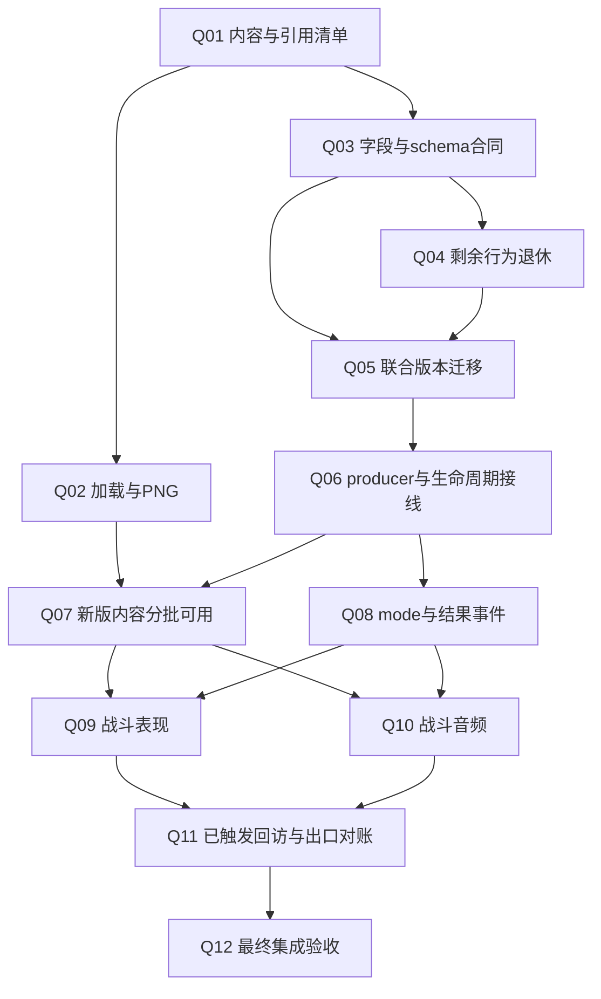

# 2026-09-25 实时恢复与 Q07/Q08/Q10 游标（覆盖下方候选期措辞）

> 2026-09-26 BATCH-04/Q07 `NTSD28-Q07-HIT-SHADOW-HISTORICAL-EXPECTATIONS-001 / FOCUSED_TEST_PASS / TEST_ONLY`：正式源码给出的未护甲bdefend=45、减伤bdefend累加、fall>60→80及火花两次原生CRT抽样已用于纠正旧ShadowCompare测试期望；原Editor当前18标准+2减伤聚焦job `e093dd020cbf40c4888d216c5a740790` 20/20 PASS，均保留plan-valid/writer-mask0门槛。此前20/20旧值FAIL、20/20火花X FAIL及临时探针堆栈均保留，临时探针已移除且原Editor重编译/Console0错。此包只改测试，不更新前两包生产X550/X1200 raw证据；自然Battle Play、其它命中分支、正式EXE GPU、旧内容退场和Q07/总目标仍开放。详`NTSD28-Q07-SASUKE-ARMOR-TARGET-FIRST-DIFF-001/HISTORICAL-EXPECTATIONS-ACCEPTANCE-20260926.md`。

> 2026-09-26 Q07后继只读入口：旧`ADJACENT-RESOURCE-BRANCH-AUDIT`中“减伤未接资源事务”已由上述生产修复覆盖，不能重复实施。尚待首差验证的是正式`battle_world.cpp`的两条CPoint资源事务调用。已定位正式`c/hid/hid.dat` frame239 kind1/injury30及Unity暂存同SHA，另有正式/Unity既有合成关系夹具可复用；尚未证明该帧自然可达或同初态PP差异。下一独立Task先做正例和不触发反例的同seed/tick正式根EXE/原Editor对照，再决定是否改`BattleCpointWriter`。详更新后的`NTSD28-Q07-SASUKE-NEEDLE-TARGET-HIT-FIRST-DIFF-001/ADJACENT-RESOURCE-BRANCH-AUDIT-20260926.md`；Q07仍`IN_PROGRESS`，DAT数值/Scene/非战斗不动。

> 2026-09-26 Q07 ShadowCompare限定出口：`NTSD28-Q07-HIT-PROJECTION-RESOURCE-MOTION-SYNC-001 / FOCUSED_TEST_PASS / SCOPED_SHADOW_FIELD_PARITY`。标准/减伤命中的观察投影已同步生产writer资源事务与奇数dvx浮点半量；原Editor新增奇数dvx/非满PP定向1/1 PASS、编译0错。既有21例相邻测试均通过其writer字段mask0与plan-valid断言，但整组随后在历史值期望上21/21失败，未改无权威证据的期望，需另立审计。此项不改生产raw；前两包X550 1428/1428和X1200 2100/2100仅为既有受控证据。自然Battle Play、D-024画面比例、其它命中分支、正式EXE GPU及内容退场仍待，Q07/总目标开放；详`NTSD28-Q07-SASUKE-ARMOR-TARGET-FIRST-DIFF-001/PROJECTION-SYNC-ACCEPTANCE-20260926.md`。

> 2026-09-26 Q07生产同轨后的诊断路径首差：`NTSD28-Q07-HIT-PROJECTION-RESOURCE-MOTION-SYNC-001 / PLANNED`。原Editor现有减伤ShadowCompare两例2/2失败，writer mask0x20000000000000（目标PP/相关字段）；投影仍遗漏标准/减伤资源事务并将奇数dvx整数半量，须与已修生产writer同步。此为观察投影首差，不推翻已证正式根EXE/Unity生产raw X550 1428/1428、X1200 2100/2100；Task/Change/Ledger脚本前登记，下一先加奇数RED再聚焦修复。Q07/总目标开放，DAT数据/Scene/非战斗不动。

> 2026-09-26 BATCH-04/Q07通用减伤奇数dvx位移首差限定关闭：`NTSD28-Q07-REDUCED-HIT-HALF-DVX-PRECISION-001 / FOCUSED_TEST_PASS / SCOPED_RAW_PARITY`。正式`hit_response.cpp`浮点半量、Unity共享减伤writer原整数半量的差异已按通用公式修复，未加角色/技能特例。原Editor有效RED→GREEN2/2、编译0错；同seed正式根EXE/Unity X550 26tick 68实体行×21字段=1428/1428、X1200未命中100行×21=2100/2100，全无映射差异。X550目标tick19 Vx8.4、tick20精确X558.4两边相同；修前后Unity只改目标速度和随后位置，显式v2 domain及input/RNG不变。此为受控raw轨迹出口，D-024的项目场景比例、自然Battle Play、其它减伤组合、正式EXE GPU、cpoint资源和旧内容退场仍各自待证，Q07/R17-R18/总目标开放。DAT数据/图片/Scene/非战斗未改；详`NTSD28-Q07-SASUKE-ARMOR-TARGET-FIRST-DIFF-001/MOTION-FIX-ACCEPTANCE-20260926.md`，下方PLANNED为历史。

> 2026-09-26 Q07下一位移首差 `NTSD28-Q07-REDUCED-HIT-HALF-DVX-PRECISION-001 / PLANNED`：正式`HitResponseResolver28::accumulate_ordinary_horizontal`对普通地面减伤`dvx`作double除2；Unity`ApplyAlternateGroundKnockback`作int除2。X550正式tick19目标Vx8.4/Unity8、tick20精确X558.4/Unity558，符合奇数dvx半量被截断的通用公式差；这与D-024画面比例层分开。Task/Change/Ledger已在脚本前立项，下一聚焦RED→GREEN并原两例复跑；Q07/D-024开放，不动DAT数据/图片/Scene/非战斗。

> 2026-09-26 BATCH-04/Q07减伤资源限定出口：`NTSD28-Q07-REDUCED-HIT-RESOURCE-TRANSACTION-001 / FOCUSED_TEST_PASS / SCOPED_MP_PARITY_POSITION_PENDING`。原Editor聚焦RED→GREEN 2/2、编译0错，通用减伤writer复用正式受击PP事务。正式根EXE对照同seed X550 26tick的68实体行×21字段=1428比较，资源差异归零，只余12处tick20起目标水平位置差；未命中X1200 100行×21=2100/2100全同。前后Unity raw实体只改变X550双方tick16–26当前MP，domain/input-RNG不变。目标位置正式精确X558.4/Unity558首差仍须独立运动审计，不能把这项资源出口提升为Q07完成；自然Battle Play、cpoint等共享调用者、正式EXE GPU及资源退场继续开放。DAT数据/图片/Scene/非战斗未改，详`NTSD28-Q07-SASUKE-ARMOR-TARGET-FIRST-DIFF-001/RESOURCE-FIX-ACCEPTANCE-20260926.md`；下方诊断/PLANNED是历史阶段。

> 2026-09-26 BATCH-04/Q07新增实测首差：`NTSD28-Q07-SASUKE-ARMOR-TARGET-FIRST-DIFF-001 / VERIFIED_SCOPED_DIAGNOSTIC`。正式OID87 type-1护甲目标X550于tick16受佐助四OID440依次造成3/3/35/35伤害；原Editor目标HP424/action186及子体生命周期同，但佐助/目标当前MP分别452/352，对正式500/404各缺52。未命中X1200 100行×21=2100/2100字段全同；X550 68行×21=1428比较有34差，首差tick16 MP，另有tick20起目标水平位置差（正式精确X558.4/Unity558），需独立D-024/受击运动审计，不得以资源修复掩盖。下一先另建Task/Change只修通用减伤资源事务并复跑，再追位移；Q07/D-024/R17-R18及总目标开放。详同ID验收。

> 2026-09-26 Q07下一优先入口（只读审计，未证运行时首差）：正式共享资源转移除已修的普通未护甲分支外，还由选中护甲/防御减伤及cpoint投掷/持有受伤调用；Unity对应`ApplyAlternateDamage`与`BattleCpointWriter`目前仅见HP/MP伤害、credit或display，没有同资源事务调用。先做一个正式可达且非满MP的同初态减伤/持有命中与负对照，证实首差后另立Task/Change；不得由本轮静态缺调用直接宣称全分支失配或顺手补齐。见`ADJACENT-RESOURCE-BRANCH-AUDIT-20260926.md`。Q07仍开放。

> 2026-09-26 BATCH-04/Q07当前修复进度：`NTSD28-Q07-STANDARD-HIT-RESOURCE-TRANSACTION-001 / FOCUSED_TEST_PASS / SCOPED_RAW_PARITY`。原Editor先在两个聚焦测试RED2/2，通用type0未护甲受击资源结算接入共享writer并改用当前PP后GREEN2/2、纯核8/8、编译0错。严格同初态X550千本命中26tick的正式根EXE/Unity实体68行×21字段=1428/1428相同；X1200未命中100行×21=2100/2100。两条前后Unity raw除了X550佐助tick16–26当前MP外无变化。旁支反射测试23/24（一项`TargetParameterCountException`，基线未证）保留。此出口只关闭该共享未护甲资源首差，护甲/减伤、自然Battle Play、正式EXE GPU和完整Q07资源/旧文件退场仍待，Q07/D-024/R17-R18/总目标开放。DAT数据/图片/Scene/非战斗未改，详`NTSD28-Q07-SASUKE-NEEDLE-TARGET-HIT-FIRST-DIFF-001/RESOURCE-FIX-ACCEPTANCE-20260926.md`；下方PLANNED为历史阶段。

> 2026-09-26 BATCH-04/Q07当前首差：`NTSD28-Q07-SASUKE-NEEDLE-TARGET-HIT-FIRST-DIFF-001 / VERIFIED_SCOPED_DIAGNOSTIC`。同初态X550佐助千本四OID440于tick16命中，对手HP500→360/action186与生命周期在正式根EXE和Unity相同；唯佐助MP正式400→500、Unity保持400（tick16–26共11差）。X1200不命中对照100实体行×21字段=2100/2100同值。正式源与根EXE LFR、原Editor raw均PASS，但LFR报告`nativeParityClaim=false`且不等于自然Battle画面出口。Unity共享type0命中路径未调用已有资源结算纯核，且纯核当前写旧MP而非当前PP；下一独立通用受击资源修复先建Task/Change，再验证两个出口。DAT数值/图片/Scene/非战斗不改，Q07/D-024/R17-R18/总目标仍开放；下方PLANNED为改前阶段。

> 2026-09-26 Q07下一同初态包 `NTSD28-Q07-SASUKE-NEEDLE-TARGET-HIT-FIRST-DIFF-001 / PLANNED`：在已证正式chi.dat/action2 ITR与原Battle自然四OID440基础上，以X550做明确重叠候选、X1200保留未命中对照；扩既有正式LFR和Unity raw严格诊断入口，逐tick比候选/HP/action/rest/生命周期和D-024规则坐标，先查首差后决定是否要生产修复。两脚本已在Task/Change/Ledger预声明，尚未改/运行。静态投影不等于实际命中，Q07/D-024/R17/R18和总目标仍开放；DAT/PNG/Scene/非战斗不改。

> 2026-09-26 Q07 有目标碰撞后继入口已只读确认：Lee J→L 的五 OID204 动作20–23无 ITR，不再重复以它们作发起命中用例；正式 OID440 `c/sasu/a/chi.dat` 与暂存逐SHA一致，动作2有完整kind0 ITR。原Battle Scene物理佐助L/D/J既有结果自然产生四个OID440/action2/pic1，故下一定向出口改为**同初态、有明确重叠/不重叠控制的佐助千本对角色命中首差**，记录候选门、HP/action/rest及生命周期，再验Play和正式EXE。当前仅证入口与数据，未证命中或对齐；DAT/Scene/非战斗未改。详`artifacts/diagnostics/NTSD28-Q07-SASUKE-NEEDLE-ITR-ENTRY-AUDIT-20260926.md`。Q07/D-024/R17/R18及总目标开放；此前恢复的三份v3文档继续保留后续增量，勿重装旧候选。

> 2026-09-26 Q07佐助千本相机子包后继 `NTSD28-Q07-SASUKE-NEEDLE-CAMERA-PIXEL-001 / VERIFIED_SCOPED_UNITY_CHILD_GROUP_CAMERA_AND_SHUTDOWN`：原Editor第四轮物理L/D/J自然四OID440和tick18四个正式`chi.png/pic1`命令再次PASS，出生前全黑ROI独立复数出424新增像素。退出回调在既有owner已`Stopped`后读到`AlreadyStopped / RuntimeMapCleared`、剩余World对象/槽/池借用0/0/0；原Editor回EditMode，Console0 C#错，Scene及两配置SHA不变。仅关闭此Unity画面/关闭子包，正式EXE同世界GPU与其它Q07内容/技能/资源出口未证；BATCH-04/Q07继续`IN_PROGRESS`。详同ID`ACCEPTANCE-20260926.md`；下条`RUNTIME_PENDING`为补关闭计数前快照。

> 2026-09-26 Q07正式佐助千本相机见证 `NTSD28-Q07-SASUKE-NEEDLE-CAMERA-PIXEL-001 / RUNTIME_PENDING / SCOPED_UNITY_CHILD_GROUP_CAMERA_PASS`：原Editor物理L/D/J第三轮自然生成四OID440；tick18四个独立投影中心的正式`chi.png/pic1`中央命令，出生前全黑的5265像素ROI中出生后独立复数出424非黑像素，前后PNG已目检。首轮pic0观察门槛FAIL与第二轮出生重叠ROI限定结果均保留。编译0 C#错、相机字段恢复、退出Play、Menu/Battle与两配置SHA稳定；本轮后退出World/slot/pool借用计数及正式EXE同画面GPU未证，故不关闭Q07/BATCH-04。详`artifacts/diagnostics/NTSD28-Q07-SASUKE-NEEDLE-CAMERA-PIXEL-001/ACCEPTANCE-20260926.md`。三份已恢复文档保持NUL-free，不重装旧v3候选。

> 2026-09-26 Q07正式佐助千鸟千本视觉下一出口 `NTSD28-Q07-SASUKE-NEEDLE-CAMERA-PIXEL-001 / PLANNED`：正式/Unity同初态26tick字段对照及原Battle物理L/D/J四OID440自然出生已限定通过，欠实际相机子体像素。脚本前Task/Change/Ledger已登记；只新增opt-in Editor观察者与meta，采出生前后相机、四命令与ROI，独立复核PNG。生产/DAT/Scene/非战斗不改，原版EXE GPU同条件仍另待；Q07/BATCH-04开放。

> 2026-09-26 Q07旧资源动态owner边界：当前非空正式根仍走Logan预热并有原Editor Menu→Battle限定证据；空根时Menu预热旧DAT/图片后才显示模式/选人，Battle入口另行拒绝。若直接删除旧文件或把空根分支改成即时失败，会改变受保护的Menu/loading行为，不能算战斗内无副作用清理。521项旧资产保持`deleteAuthorized=false`，正式战斗选中内容不因此退回旧版；Q07仍需自然内容/画面与最终验收。只读证据：`artifacts/diagnostics/NTSD28-Q07-LEGACY-MENU-FALLBACK-BOUNDARY-20260926.md`。

> 2026-09-26 Q07六图格动作写者续审：四份正式DAT及配对playable已限定排除对应目标帧的字面`next`/`hit_*`/`hold_*`、本DAT编码state跳转、相邻state85自增和`next=999`/state12物理选择；OID55的103→104→105仍只是条件尾链，OID32的跑防仍写102，OID30/31的30/40仍写52。动态关系/碰撞/AI/外部初态可达性未证，不据此判图格不可达或完成Q07。只读证据：`artifacts/diagnostics/NTSD28-Q07-SIX-BOUNDARY-WRITER-EXCLUSION-20260926.md`；本项未改脚本、DAT、图片或Scene。

> 2026-09-26 Q09/P-08 controlled GPU result `NTSD28-Q09-BPOINT-BLEED-SCENE-PIXEL-001 / VERIFIED_CONTROLLED_CENTRAL_GPU_ONLY`: final original Battle Scene formal Ita frame0 HP500/166 A/B has 0/1 bpoint commands, 1x3 red mark after body, and 3 independently reproduced new pure-red camera pixels in projected ROI. Probe-only initial HP3 and color-predicate false negatives are preserved. Editor compile0, non-Play, camera/World/slot/pool and four protected SHA stable. Natural Ita/Sasu, Legacy, formal EXE same-state still pending; P-08/Q09/full goal remain open. See `artifacts/diagnostics/NTSD28-Q09-BPOINT-BLEED-SCENE-PIXEL-001/ACCEPTANCE.md`.

> 2026-09-26 Q09/P-08 Legacy owner read-only audit: live `LF2ObjectRenderer` body path has no bpoint display; CentralOnly mark commands do not enter LegacyOnly. `BattleEntityOverlayRenderer.RenderAll` currently has only test/self-check callers, while production `SimulationTickDriver.LateUpdate` invokes `SparkRenderer.RenderAll`; merely adding a mark to that unused overlay class would not reach production. Any Legacy implementation needs an explicitly governed production owner, pool/release/shutdown contract and original Scene Legacy pixel proof. No script changed in this audit; details `artifacts/diagnostics/NTSD28-Q09-BPOINT-BLEED-SCENE-PIXEL-001/LEGACY-OWNER-AUDIT.md`.

> 2026-09-26 Q09/P-08 next controlled GPU witness `NTSD28-Q09-BPOINT-BLEED-SCENE-PIXEL-001 / IN_PROGRESS`: original clean Battle Scene formal Ita high/low-HP camera A/B opt-in probe declared before script edit. Current central focused evidence stands; Scene pixel, Legacy and formal EXE same-state evidence remain pending, so P-08/Q09/full goal stay open. The VERIFIED entry above supersedes this pre-change cursor.

> 2026-09-26 Q09回归测试门 `NTSD28-Q09-COM-LABEL-TEST-CONSTRUCTOR-001 / FOCUSED_TEST_PASS`：修正Editor com-label反射夹具六→七参数及false实参后，原项目Editor编译0错，旧阻断单例1/1、当前类8/8通过。只关闭夹具漂移，不关闭平台阴影实际GPU像素、正式EXE同条件或Q09聚合出口；完整Driver的10C载体与中央命令既有证据仍有效。四保护资源/场景SHA未变，Q07/Q09/总目标继续开放。

> 2026-09-26 Q09测试门 `NTSD28-Q09-COM-LABEL-TEST-CONSTRUCTOR-001 / PLANNED`：现有`BattlePresentationCommandWriterEditorTests`的com-label反射夹具仍查六参数，当前七参数构造函数使相邻Q09测试在命令断言前失败。独立Task/Change先登记，只修测试签名与false实参后原Editor定向验证；此事不代表平台阴影像素已通过，Q07/Q09及总目标继续开放。

> 2026-09-26 Q07 KO→feed 生产行 `NTSD28-Q07-KO-FEED-PRODUCTION-ROW-WITNESS-001 / FOCUSED_TEST_PASS`：原Editor同初态鸣人38tick完整Driver见证1/1，事件tick8/time7，native记录维持1，发布行tick8–36为1、tick37/38为0；关闭World对象/槽/借用0。先前3轮测试夹具失败及终态CSV/Job均保留；正式EXE同场景像素与其它Q07/Q09出口未证，不能关闭聚合阶段。模式DAT未恢复，四保护SHA不变。

> 2026-09-26 Q07 `NTSD28-Q07-KO-FEED-PRODUCTION-ROW-WITNESS-001 / CODE_WRITTEN`：Editor回放帮助器加默认关闭的项目模式Asset参数，新单例见证延长同初态鸣人输入至38tick并记录生产KO→发布行；原项目Editor编译/聚焦待，生产/DAT/Scene/非战斗未改。Q07/Q09及总目标开放。

> 2026-09-26 Q07下一执行包 `NTSD28-Q07-KO-FEED-PRODUCTION-ROW-WITNESS-001 / PLANNED`：在同初态正式鸣人KO事件tick8/time7的现有Editor回放后补8个中性tick，以生产Driver发布行检查tick8/36/37/38；只改Editor诊断帮助器的可选项目mode Asset入口及1个聚焦测试，脚本前已登记Task/Change/Ledger。源码谓词推导不替代运行时/正式像素；Q07/Q09及总目标开放。

> 2026-09-26 Q07 KO→feed 行边界只读复核 `NTSD28-Q07-KO-FEED-ROW-CODE-BOUNDARY-001 / VERIFIED_SCOPED_STATIC_BOUNDARY`：正式事件时间7与两端投影谓词推得该单事件在角色/模式门槛持续有效时行显示tick8–36、tick37隐藏但占行距、tick38不占；项目模式Asset lifetime70使无新KO时尾记录tick78清除。Q09合成行边界测试已9/9组内通过，所检谓词未见首差；尚无同初态生产逐tick行发布和正式EXE/Unity像素见证，不据此关闭Q07/Q09。只读报告见`artifacts/diagnostics/NTSD28-Q07-KO-FEED-ROW-CODE-BOUNDARY-001/REPORT.md`。

> 2026-09-26 Q09 模式Asset测试夹具 `NTSD28-Q09-PROJECT-MODE-TEST-FIXTURES-001 / FOCUSED_TEST_PASS`：原Editor编译0错；三处旧测试改用项目模式Asset快照，七图临时夹具补齐现有正式SPARK依赖后，受影响9/9定向EditMode通过。原版mode DAT未恢复，双Scene/GameConfig/模式Asset哈希不变。Q07 KO时钟的Q09行测试依赖已解除，但同初态生产可见末tick、正式像素仍未验；Q07/Q09、R项及总目标开放。下方CODE_WRITTEN/PLANNED为历史阶段。

> 2026-09-26 Q09模式Asset测试夹具 `NTSD28-Q09-PROJECT-MODE-TEST-FIXTURES-001 / CODE_WRITTEN`：三处历史Editor测试已改用`ProjectBattleModeConfig`快照；图标夹具只复制正式PNG，排除ID变体用内存克隆。原Editor编译/聚焦待，正式DAT/Asset/Scene/非战斗不动。Q07 KO时钟的原Battle Scene物理J→鸣人出拳KO→350→选角复验PASS，池借用0，双Scene/GameConfig哈希不变；Q07/Q09/总目标仍开放。下方PLANNED为改前登记。

> 2026-09-26 Q07 共享KO时钟 `NTSD28-Q07-NATIVE-KNOCKOUT-EVENT-CLOCK-001 / FOCUSED_TEST_PASS`：生产事件时间改读既有 C24 `NativeFrameSequence`，不按角色/伤害类型特判。原Editor编译0错，前/后C24生产路径2/2、Q08事件寿命/快照/校验3/3、Q10模式音效5/5；鸣人同初态30tick KO仍完成tick8，事件时间现与正式同为7，raw/domain/input-RNG轨各30/30不变。Q09行投影测试的SetUp仍读取用户排除的`mode/ntsd.dat`而失败，未恢复原DAT；需改用项目mode Asset或自足夹具后验行末可见帧，更新的Play探针/正式像素也待。Scene/GameConfig SHA保持，正式DAT/图片/非战斗未改；Q07和总目标仍开放。详同ID ACCEPTANCE；下方CODE_WRITTEN为改前记录。

> 2026-09-26 Q07 同初态 KO 事件诊断 `NTSD28-Q07-NARUTO-PUNCH-KO-EVENT-TRACE-001 / VERIFIED_SCOPED_DIAGNOSTIC`：原 Editor 30-tick 请求 PASS，旧 raw/domain/input-RNG tick 轨各30/30不变；鸣人普通出拳的 KO 同在完成 tick8 出生，source type与source/victim/credit/four-owner五字段一致，正式事件时间7而Unity为8。正式 `record_native_knockout` 使用 C24 前/后的世界 `sequence_`，Unity 生产 writer 误用提前推进的 host tick；既有 `NativeFrameSequence` 才是共享的相位时钟，不能简单统一减1。诊断只改 opt-in Editor 导出，DAT/PNG/生产/Scene/非战斗未改。另立共享生产修复并覆盖 C24 前后 writer、feed寿命/快照/校验；Q07/R09/R10/R18及总目标仍开放。详同ID `ACCEPTANCE.md`。

> 2026-09-26 Q07 六个越界图格的自然动作入口仍未证：正式四 DAT 中，OID55/frame105 仅有 103→104→105 条件帧链而 103 无字面前驱；OID32/frame95 无字面前驱，普通跑中防御的正式输入分支写 action102；OID30/31 frame31/41 无字面前驱，frame30/40 的 `next` 均指向 52。`wpoint weaponact:31` 是关联子体动作来源，不能直接当成本角色 frame31 可达证据。`next:999`、组合键、链接/碰撞和其他动态动作写者尚未排除，所以既不称六帧不可达，也不报画面对齐完成。目录发布 6/6 的旧结论保持；下一步先取得自然动作写者与同初态帧轨迹，再做根正式 EXE/Unity 画面比对。只读证据见 `artifacts/diagnostics/NTSD28-Q07-SIX-BOUNDARY-ACTION-INGRESS-20260926.md`；Q07/R17 继续开放。

> 2026-09-26 Q07鸣人同种子RNG状态补证 `NTSD28-Q07-NARUTO-PUNCH-SEEDED-RNG-TRACE-001 / VERIFIED_SCOPED_SEEDED_SOURCE_UNITY_RNG_STATE_PARITY`：正式配对playable源诊断只加7列RNG观测，36/36作者出拳/归属KO、旧1080行×15字段及LFR/summary全保持；首例X525/J@tick2的seed682973786源与原Editor Unity raw，CRT state/calls和同步counter/index/calls/site/table hash逐tick30×7＝210/210同值，tick8 CRT state2524509468/calls3002。根正式EXE LFR回放CRT仍默认seed0，故仅关闭该**同种子源/Unity状态**疑点，不报EXE CRT全态或Q07聚合对齐。首次链接漏LFR源、首次运行VFS根传错均留失败日志，修正后C++编译0错/run2 PASS。DAT/生产Unity/Scene/非战斗未改，旧521资源删除授权0；详同ID REPORT。覆盖下条PLANNED前态。

> 2026-09-26 Q07鸣人同种子CRT补证 `NTSD28-Q07-NARUTO-PUNCH-SEEDED-RNG-TRACE-001 / PLANNED`：上个Q07 30tick原Editor同条件实体/输入首差为零，但根正式EXE的LFR回放CRT起自默认seed0，不能据此推断与source/Unity seed682973786的CRT状态差。只扩已具36例普通命中源诊断的每tick RNG观察列，在新输出目录与原Unity run2比较同种子30tick；正式源码、DAT、生产Unity、Scene和旧证据均不改。若有首差另立修复包；Q07/R09/R10/R18与总目标开放。详同ID Task/Record。

> 2026-09-26 Q07鸣人普通出拳同条件原Editor首差 `NTSD28-Q07-NARUTO-PUNCH-UNITY-RAW-FIRST-DIFF-001 / VERIFIED_SCOPED_EDITMODE_NARUTO_PUNCH_ENTITY_INPUT_PARITY`：原项目Editor完整Driver 30tick PASS，根正式EXE LFR逐tick占用槽集合30/30、实体映射1560/1560、输入映射1140/1140、相位30/30、同步RNG状态30/30及CRT调用次数30/30同值；tick8双方作者frame513命中，目标动作186/HP-10。首轮夹具difficulty谓词FAIL已保存，第二轮校正后PASS。根LFR回放CRT默认seed0，配对源/Unity用682973786，故不称完整CRT状态同值。只扩原Editor诊断schema，不改生产/DAT/图片/Scene/非战斗。Battle Scene物理键、Unity KO事件归属、正式画面及Q07/R09/R10/R18总出口仍待；详同ID ACCEPTANCE。覆盖下条PLANNED前态。

> 2026-09-26 Q07鸣人frame513同初态Unity首差 `NTSD28-Q07-NARUTO-PUNCH-UNITY-RAW-FIRST-DIFF-001 / PLANNED`：正式源/根EXE的X525、seed682973786、J@完成tick2、30tick命中轨迹已封存。先仅扩既有原Editor raw-capture诊断的精确场景schema并取实体/domain/input-RNG trace，不改DAT/生产/Scene/非战斗；必须核对初态及相位后才报告首差。旧Q08物理J Play初态不完整，不能代替本次同条件对照；根LFR CRT种子差别单独标记。Q07/R09/R10/R18及总目标开放。详同ID Task/Record。

> 2026-09-26 Q07自然普通命中源/发行见证 `NTSD28-Q07-NARUTO-PUNCH-FORMAL-HIT-001 / VERIFIED_SCOPED_FORMAL_SOURCE_RELEASE_AUTHORED_PUNCH_HIT`：配对playable以两鸣人OID2、声明seed/双方初态，在6站位×3攻击起点×2持续长度的36例中36/36自然走到作者出拳与归属KO；首例X525、tick2单次攻击于tick8在作者frame513将目标HP10→-10，KO归属source/victim/credit/four-owner=0/1/0/0。根正式EXE同LFR无头回放PASS；逐tick比对动作、目标HP/动作、输入阶段30/30无差异。正式/暂存鸣人DAT同SHA；仅增Tools诊断及记录，DAT/Unity生产/Scene/非战斗未改。旧Q08物理J Unity Play的完整初态未保存，不能视作同条件跨端对齐；下一另建原Editor同初态见证包。Q07/R09/R10/R18及总目标仍开放。详同ID REPORT。

> 2026-09-26 Q07螺旋丸持有物候选消费 `NTSD28-Q07-RASENGAN-ACTION35-TARGET-SOURCE-001 / VERIFIED_SCOPED_FORMAL_SOURCE_NEGATIVE_CONSUMER_GATE`：正式Naruto frame254自然生OID434/action35，其kind5 ITR在11个目标位置/605完成tick均可达；五位置形成10条子体→目标几何候选，但正式`classify_ordinary_hit_eligibility`全部以无有效holder/wpoint强度替换拒绝，目标HP全程500。正式frame254的wpoint `attacking:0`，消费者要求1..9才将kind5变为普通伤害。两次最终扫描CSV逐字节相同；未产生有效目标LFR，根EXE只复核SHA，**不称同条件正式EXE/Unity命中已对齐**。下一选实际可消费的自然攻击链，先审已有Q08鸣人frame513物理J/KO，再另建同初态跨端包。只新增诊断及记录，DAT/生产/Scene/非战斗未改；Q07/R09/R12/R18和总目标开放。详同ID REPORT。

> 2026-09-26 Q07 Lee子体后续测试门更正：正式/暂存 `a/cha/cha.dat` 同SHA，已对齐的普通J→L五OID204子体在动作20–23无 `itr`；配对playable候选收集对无ITR源帧直接返回。因此把目标移到这五子体路径上不能验证它们发起的几何命中，先前拟做的位置扫描取消。后续应先找到**自然可达且带ITR**的对象动作，再做目标命中首差；被目标攻击/其他交互未排除。只读源码和DAT复核，无脚本/资源/Scene修改；Q07/D-024/R17/R18/总目标仍开放。详 `NTSD28-Q07-LEE-CHILD-LIFECYCLE-TRACE-001` Task后续说明。

> 2026-09-26 Q07 Lee五OID204子体**无目标**出生→回收轨迹 `NTSD28-Q07-LEE-CHILD-LIFECYCLE-TRACE-001 / VERIFIED_SCOPED_NO_TARGET_CHILD_BIRTH_TO_DESPAWN_TRACE`：复用根正式EXE LFR和原Editor完整Driver已保存原始记录，tick1–45子体槽位集45/45、在世40子体-tick×16字段640/640同值；slots51–55在tick6自然出生，五条动作均20/20/21/21/22/22/23/23，tick14正式lifecycle/despawned code1000及Unity快照derived death同槽位，至tick45无残留。先前“完整寿命待验”对**本无命中场景**已由此限定覆盖，不再重复延长轨迹；有目标碰撞、内部回收原因/复用、物理键及正式像素仍待。此次只读复核，未改脚本/DAT/图片/Scene/非战斗；Q07/D-024/R17/R18和总目标开放。详同ID REPORT/JSON。

> 2026-09-26 Q07资源字节门当前复核 `NTSD28-Q07-CURRENT-SELECTED-CONTENT-BYTE-GATE-001 / VERIFIED_SCOPED_SELECTED_BATTLE_BYTE_GATE`：根正式EXE SHA复核后，非排除DAT 338/353、PNG1031/1255，所有公共路径逐SHA相同。缺15 DAT均有原生HUD/保留Menu/P-14或stage暂缓owner；缺224 PNG为用户排除背景110和旧审计114张sprite的精确当前集合。114中106有受保护/例外归属、8仅有声明；配对playable所检索引只选活动战斗WORDS0..5/SPARK且七图同SHA已暂存，七`UI/extra`尾段未被目录解析，pause分支画实心条。**在所检路径未发现缺失的非例外活动战斗资源字节**，不等于正式EXE全读者、自然技能/画面或Q07完整验收；8张保留R17/Q09不确定，旧521退场授权仍0。下一Q07转向自然技能/生命周期首差及旧动态读者，不按缺口数量盲拷贝；详同ID REPORT。覆盖下方“先核8张”游标的优先顺序但不删除其开放条件。

> 2026-09-26 Q07 Lee正常背景世界相机已限定验证 `NTSD28-Q07-LEE-CHILD-COMPOSED-WORLD-CAMERA-001 / VERIFIED_SCOPED_UNITY_COMPOSED_WORLD_CAMERA_PIXEL`：原Editor保存Battle Scene正式内容普通J→L五OID204/pic28；保留原相机场景层的tick11→12双PNG首子体ROI58×58有600变化、其中574与上一轮隔离中央相机变化位置重合，ROI外背景前帧515004/515036像素非黑；相机/RT恢复、关闭借用0、Editor非Play/Console0错、双Scene SHA稳定。仅Editor诊断扩可选模式，不改生产、DAT/图片、Scene、非战斗。全Game view、物理按键、子体全寿命和正式EXE同条件GPU A/B仍待，Q07/D-024/总目标开放；详同ID COMPOSED-CAMERA-ANALYSIS，覆盖下条预登记前态。

> 2026-09-26 Q07 Lee正常背景世界相机下一门 `NTSD28-Q07-LEE-CHILD-COMPOSED-WORLD-CAMERA-001 / IN_PROGRESS`：隔离中央相机574像素只证黑底/culling0读回。已在脚本前建Task/Change/Ledger，仅扩原Editor Lee探针的独立可选正常场景层世界相机读回，保留背景及原相机配置；需原Battle Scene编译/Play及独立PNG核验，正常Game view和正式EXE同相机GPU A/B仍待。生产、DAT/图片、Scene、非战斗不改；Q07/D-024/总目标开放。

> 2026-09-26 Q07 Lee子体实际像素限定通过 `NTSD28-Q07-LEE-CHILD-CAMERA-PIXEL-001 / VERIFIED_SCOPED_UNITY_ISOLATED_CENTRAL_CAMERA_PIXEL`：原Editor保存Battle Scene普通J→L自然生成五OID204，正式trace与Unity命令同为pic28；正式/暂存`a/cha/cha.png`整文件SHA一致。隔离中央渲染的世界相机读回tick11→12，在首子体命令ROI58×58内基线0非黑→574个变化非黑像素；独立PNG解码其中288个像素RGB与正式pic28图格精确同色，471个色距≤5。相机参数/RenderTexture恢复、有序关闭/借用0、Editor退出Play、Console0错和双Scene SHA稳定。首次诊断CS0165已修且无Play前保留于Record；仅扩Editor探针，不改生产/DAT/图片/Scene/非战斗。此证孤立中央相机子体可见，不证正常背景合成、物理键、完整交互/寿命或正式EXE同相机GPU A/B；Q07/D-024/总目标继续开放。详同ID PIXEL-ANALYSIS；覆盖下条待像素快照。

> 2026-09-26 Q07 Lee子体像素下一门 `NTSD28-Q07-LEE-CHILD-CAMERA-PIXEL-001 / IN_PROGRESS`：既有原Battle Scene Play已证五个自然OID204与中央命令，但命令不等于实际相机像素。已在改脚本前建Task/Change/Ledger，仅给原Lee Editor探针加可选出生前后相机读回、正式图格身份/命令ROI、恢复相机与有序关闭；独立PNG比对后再判可见性。不改生产、DAT/图片、Scene或非战斗，不用computer-use/第二Editor；Play/正式EXE A/B及Q07整体仍待。

> 2026-09-26 Q07 Lee真实Battle Scene限定出口 `NTSD28-Q07-LEE-JL-BATTLE-PLAY-001 / VERIFIED_SCOPED_BATTLE_PLAY_NATURAL_CHILD_PUBLICATION`：原Editor正式内容、保存Battle Scene生产完整Driver run3 PASS；J@完成tick8/InputPhase0、L@9–10自然到frame145/PP500→300，tick12 frame164生五个ownerLee OID204。五子体源规则(437,651)初始化、全背景比例下物理(403,-35,651)，中央五条Entity命令，logic-only无子Renderer符合模式；45tick后有序关闭完整/借用0、Editor回EditMode、Console0错、双Scene SHA不变。run1相位错与run2夹具漏源坐标均保留为FAIL，不是生产缺陷。仅Editor诊断新增，未改DAT/生产/Scene/非战斗。真实相机像素、物理键、全生命周期和正式EXE同画面仍待，Q07/D-024及总目标开放。详同ID ACCEPTANCE；覆盖下方run1/run2快照。

> 2026-09-26 Q07 Lee原Battle Scene第二轮：相位校正后普通J@完成tick8/InputPhase0、L@9–10经生产Driver自然达到frame60/61/145/146/164；tick12生成五个owner50的OID204，中央有五条Entity命令。run2最终FAIL仅因新临时夹具漏调用生产`AppManager.SyncParticipantBirthPosition`，五个子体源坐标初始化标志为false；记录MP500也误读了未扣费字段，正式raw/成本使用PP。两次FAIL均保留，不能误报生产缺陷或总体PASS。下一只修探针出生夹具和PP读数，再独立run3；有序关闭/借用0/Scene SHA稳定，生产/DAT/非战斗不改。Q07/D-024和像素仍开放；覆盖下条run1首差快照。

> 2026-09-26 Q07 Lee Battle Scene首次Play首差：`NTSD28-Q07-LEE-JL-BATTLE-PLAY-001 / IN_PROGRESS` 原Editor编译0错、45tick完整Driver请求保留为FAIL；tick5起算的夹具把J送在完成tick7，Lee仍frame0，L@8进入frame110，未生OID204。正式/原EditMode场景的J在完成tick2（偶数相位）；不能据本轮推断生产规则差异。探针有序关闭stopped、借用0、双Scene SHA稳定且Editor退出Play。下一仅调整新探针的输入相位起点并记录相位，独立run2，绝不注入帧或修改生产/DAT/Scene。Q07/D-024及真实像素仍开放；覆盖下条待Play快照。

> 2026-09-26 Q07下一真实场景出口 `NTSD28-Q07-LEE-JL-BATTLE-PLAY-001 / IN_PROGRESS`：在前包45tick正式EXE/原Editor EditMode原始状态2557/2557同值后，已于任何新脚本前建Task/Change/Ledger；只加原Battle Scene的Editor请求探针，用普通离散J→L经生产完整Driver观察OID204自然生成、源坐标/表现载体与有序关闭。不改生产、DAT、图片、Scene或非战斗，旧运行结果不覆盖。Play结果、物理键和正式像素仍待，Q07/D-024整体开放。

> 2026-09-26 Q07 Lee同条件原Editor第二轮 `NTSD28-Q07-LEE-JL-UNITY-RAW-FIRST-DIFF-001 / VERIFIED_SCOPED_EDITMODE_JL_ENTITY_RNG_PARITY`：严格45tick J@2/L@3–4正式场景在原项目EditMode完整Driver运行PASS；与根正式EXE LFR的输入相位及全部占用slot映射实体字段2557/2557同值、同步RNG counter/index/calls/site逐tick45/45同值。tick6五个OID204/action20/owner0子体在slots51–55、坐标(437,-35,651)同值。仅新Lee诊断夹具改为显式BGM对应的无预消费reset；旧3/26tick夹具、生产RNG、DAT/Scene/非战斗不改。根LFR回放CRT用默认seed0而source/Unity用682973786，故不宣称CRT初态同值。原Temp结果及双Scene SHA不变；Battle Play物理键、像素、完整寿命和Q07/D-024总出口仍开放。详同ID ACCEPTANCE；覆盖下一条首轮/待run2快照。

> 2026-09-26 Q07 Lee同条件原Editor首轮：`NTSD28-Q07-LEE-JL-UNITY-RAW-FIRST-DIFF-001 / IN_PROGRESS` 的严格45tick场景已在原Editor EditMode编译0错并运行PASS；输入相位和全部占用slot的16个映射实体字段共2557/2557与正式EXE LFR trace一致，tick6五个OID204槽位/动作/坐标同值。RNG初态有夹具前置差异：Unity旧raw工具多做一次随机BGM选择，正式source已显式选BGM2；LFR回放CRT默认seed0而本次source/Unity seed682973786。下一仅校正此Lee诊断夹具再独立跑run2，不改生产RNG/DAT/Scene，Play/物理键/像素与Q07总出口仍待。详同ID RUN1-ANALYSIS；覆盖下方“未执行Unity”快照。

> 2026-09-26 Q07/D-024下一同条件首差 `NTSD28-Q07-LEE-JL-UNITY-RAW-FIRST-DIFF-001 / IN_PROGRESS`：正式Lee 45tick J→L→OID204的source/release限定证据已成；现在已在任何Editor诊断脚本改动前登记Task/Change/Ledger，只扩原raw capture的精确Lee场景合同和唯一结果路径，计划在原Editor EditMode按正式内容跑完整Driver并逐tick找首差。旧legacy/26tick场景不放宽，既有Temp结果不覆盖。未执行Unity运行，原Battle Play/物理键/像素及Q07总出口仍待。

> 2026-09-26 Q07/D-024 `NTSD28-Q07-LEE-NATURAL-NONSOUND-CHILD-001 / VERIFIED_SCOPED_FORMAL_SOURCE_RELEASE`：正式配对playable以普通输入令Lee在tick2按J、tick3–4按L，tick4/5/6分别到frame145/146/164，tick6生成五个owner0的OID204/action20子体；根正式EXE同LFR回放exit0/PASS。45 tick的输入相位、Lee动作、MP、owned子体数量180/180逐项一致。仅为受控玩家输入的正式source→release可达与选定字段对照；Unity原Editor同输入完整Driver、物理按键、子体源坐标/像素/生命周期及Q07总出口仍待。旧AI自然600tick纯音效OID814结论不变，未改DAT/Unity生产/Scene。详同ID ACCEPTANCE/Task/Change；覆盖下一条“尚未运行脚本”快照。

> 2026-09-26 Q07/D-024下一自然生成链 `NTSD28-Q07-LEE-NATURAL-NONSOUND-CHILD-001 / IN_PROGRESS`：既有Lee AI自然600tick仅OID814纯音效，受控frame22→OID706不能代表自然选招。正式Lee `hit_ad:145`由J→L输入历史触发，145→146→164的非音效OID204/action20是新的有界候选。已在任何新脚本前登记Task/Change/Ledger，拟仅用配对playable的普通输入/完整GameSession生成LFR并由根正式EXE回放；若不自然到达则保留负结果，不注入帧或改规则。Unity自然Play/像素和Q07总出口后置，DAT/非战斗不改。

> 2026-09-26 Q07/R17越图集帧静态可见性收窄 `NTSD28-Q07-OUT-OF-RANGE-FRAME-VISIBILITY-AUDIT-001 / VERIFIED_STATIC_VISIBILITY_SCOPE_ONLY`：先前330正式对象DAT清单中的84个非999越累计容量base pic，现以正式/暂存DAT 330/330逐SHA相同、21个相关DAT 84/84重新计算确认；全体最大累计容量560，正式playable所检生产`+0x318`图片偏移仅零或正值，故这些pic不会重新进入图集，正式resolver不发实体body sprite。它们不是84张待补PNG；`pic:999`在现有内容同样始终越界。此静态结论不覆盖六个图内范围但超出PNG尺寸的格子、自然动作、阴影/特效、正式EXE GPU或Unity同条件像素；Q07/R17/BATCH-04和总目标仍开放。详同ID Task/REPORT，未改脚本、DAT、图片、Scene或旧资源。

> 2026-09-26 Q07/R17剩余图片消费者静态清单 `NTSD28-Q07-REMAINING-SPRITE-CONSUMER-AUDIT-001 / DELIVERED_SCOPED_STATIC_CLASSIFICATION`：正式根EXE SHA复核；114张未暂存`sprite/*`逐路径/正式SHA/DAT声明生成CSV，114/114有声明，但声明不等于当前战斗消费。106张归属于用户保留的原生菜单/加载/结果/HUD或P-14头顶条例外；另8张为`UI/extra/*`七张及`PAUSE.png`一张，所检配对playable没有其当前选中PNG消费者，正式EXE可见性仍待证。当前已选战斗`WORDS0..5`与`SPARK`七图正式/暂存逐SHA一致。不得按缺数复制114张、不得将8张未证写成已排除；Q07旧动态reader/521旧资产、自然技能和R17像素仍开放。详同ID REPORT/CSV。

> 2026-09-26 Q09相机诊断最终脚本复核：第三个唯一原Editor Play `platform-shadow-camera-03`在更新“两次相机恢复累计检查”后，仍为`PARTIAL_PIXEL_OWNERSHIP_UNPROVEN`，原正式OID56完整tick6载体/中央命令一致、相机恢复true、独占像素0；对象/池及双Scene SHA稳定、原Editor非Play/Console错误0。此子项保留RUNTIME_PENDING，不能据截图把平台阴影GPU或正式EXE同画面写成已对齐。详同ID ACCEPTANCE。

> 2026-09-26 Q09正式平台阴影相机回访 `NTSD28-Q09-FORMAL-PLATFORM-SHADOW-CAMERA-WITNESS-001 / RUNTIME_PENDING / PIXEL_OWNERSHIP_UNPROVEN`：原Editor编译0 C#错及两次原Battle Scene受控Play，正式OID56完整tick6平台slot50/10C=-5、中央目标Shadow命令维持；第二次结果顶层PARTIAL。实际相机1920×1080白底前后PNG已查看，目标Shadow投影(169,528,53,11)完全落入其它命令投影框，保守独占候选/变化像素0；画面采集不等于目标阴影GPU归属已证。相机/对象/slot/池清理及双Scene SHA稳定，Editor已退出Play、Console错误0。下一用独立受治理的可分辨阴影像素捕获，不能改10C后重建同tick缓存计划；自然入口、Legacy Play、正式EXE画面及Q09整体仍开放。详同ID ACCEPTANCE。

> 2026-09-26 Q09相机像素诊断 `NTSD28-Q09-FORMAL-PLATFORM-SHADOW-CAMERA-WITNESS-001 / CODE_WRITTEN / COMPILE_PENDING`：仅扩正式OID56完整Driver的既有Editor探针，新增可选白底前后相机读回与保守目标Shadow独占区域计数；未改DAT、Scene、生产或非战斗。原Editor编译/Play/归属证据待；Q09及总目标开放。

> 2026-09-26 Q09下一子出口 `NTSD28-Q09-FORMAL-PLATFORM-SHADOW-CAMERA-WITNESS-001 / IN_PROGRESS`：原Editor正式OID56完整Driver→10C=-5→中央Shadow命令已证，现先登记仅扩现有opt-in Editor探针采前后相机白底像素，并排除其它投影命令来判断目标阴影是否有独占像素。若被遮挡则报告归属未证，不能当通过。脚本/编译/Play未执行；正式DAT、生产规则、Scene、非战斗不改。自然入口、Legacy Play、正式EXE画面和Q09整体仍待。

> 2026-09-26 Q09正式平台阴影受控整tick出口：`NTSD28-Q09-FORMAL-PLATFORM-DRIVER-PLAY-001 / VERIFIED_SCOPED_FULL_DRIVER_CENTRAL_COMMAND`。原Editor原Battle Scene正式内容OID56/frame130与异组OID2在tick6经完整生产Driver得平台slot50、10C=-5、碰撞参考-5；CentralOnly同tick精确1条目标Shadow命令，排序Z仍287而Y符合`Z+10C`。探针对象4→4、slot2→2、Renderer借用2→2、双Scene SHA稳定，Editor退出非Play。UnityMCP重连期间5条disposed-object Console错误已保留，不是C#编译错误。此为受控摆位/入帧和中央命令，不证明自然输入、Legacy Play、相机像素或正式EXE同条件画面；Q09/总目标仍开放。详`artifacts/diagnostics/NTSD28-Q09-FORMAL-PLATFORM-DRIVER-PLAY-001/ACCEPTANCE-20260926.md`。

> 2026-09-26 Q09正式平台阴影完整Driver Play探针 `NTSD28-Q09-FORMAL-PLATFORM-DRIVER-PLAY-001 / CODE_WRITTEN / COMPILE_PENDING`：静态正式OID56/kind50候选之后，脚本改动前已先建准确Task/Change/Ledger；现仅加原Battle Scene opt-in诊断文件/Meta，目标是一tick生产Driver证实际帧、10C链接与中央Shadow命令并校验退出清理。编译/Play尚待；不改正式DAT、生产规则、Scene或非战斗。自然输入/Legacy Play/相机/正式EXE仍独立待证，Q09/总目标开放。

> 2026-09-26 Q09平台阴影正式内容入口只读审计：`NTSD28-Q09-FORMAL-PLATFORM-REACHABILITY-AUDIT-001 / STATIC_FORMAL_CONTENT_CANDIDATE / PLAY_PENDING`。正式索引OID56/type0的`c/hid/rea.dat`与暂存逐SHA一致；全暂存DAT逐条清点完整平台ITR `30<=kind<100`仅17条，均为该文件kind50：被抓帧130–134共5、下落帧180–191共12。配对playable源码对不同组、目标type0/3的kind50归一为operation30，并经X/Z及Y参考门写10C；该ITR的`y:564000`不参与平台扫描。这里只确认正式内容候选，不证明自然帧可达、Battle Play发生链接/画面或EXE同条件像素。下一用原Editor定向完整Driver与相机见证，不改DAT/Scene/非战斗；Q09/总目标仍开放。详`artifacts/diagnostics/NTSD28-Q09-FORMAL-PLATFORM-REACHABILITY-AUDIT-001/REPORT.md`。此前用户批准的三份v3恢复已安装，当前文档含后续进度，禁止重复覆盖。

> 2026-09-26 Q09平台阴影消费限定进度：`NTSD28-Q09-PLATFORM-SHADOW-OFFSET-PUBLICATION-001 / RUNTIME_PENDING / FOCUSED_TEST_PASS`。正式render snapshot阴影Z+10C/depth仍Z已接入Unity Legacy阴影中心及中央快照/Shadow命令；只移动阴影，稳定ground/脚下标记、实体Z与排序未改。原Editor test-first缺字段编译RED，生产接线后编译0错、最终Legacy+中央2/2聚焦通过，原Battle/Menu Scene SHA稳定；扩大至相邻测试类6/7的一例旧com-label反射前置FAIL保留。真实Battle Play/正式EXE同条件GPU及Q09其它P项均待，Q07/Q08依赖与总目标未闭。详 `artifacts/diagnostics/NTSD28-Q09-PLATFORM-SHADOW-OFFSET-PUBLICATION-001/ACCEPTANCE-20260926.md`。

> 2026-09-26 Q09独立回访 `NTSD28-Q09-PLATFORM-SHADOW-OFFSET-PUBLICATION-001 / IN_PROGRESS`：按既有Q06平台阴影审计，正式配对源码用`position.z + render_shadow_offset_10c`放阴影、排序仍以Z；Unity10C逻辑载体已存在而Legacy/中央画面未消费。已预登记准确Task/Change/Ledger，测试先行后仅接阴影显示位置，不改脚下标记、实体/逻辑真值、DAT/PNG、Scene或非战斗。Q07/Q08聚合依赖和Q09其余表现/正式EXE仍开放。

> 2026-09-26 Q07六越界图格目录限定出口：`NTSD28-Q07-SIX-BOUNDARY-CATALOG-001 / VERIFIED_SCOPED_CATALOG_PUBLICATION`。原Editor正式根Battle Scene编译后tick5同一次只读Play得六键6/6：OID55/pic44、OID32/pic64、OID30/pic81/91、OID31/pic81/91均有79×79派生纹理、Legacy Sprite及有效中央绑定；退出非Play、Console0错、双Scene SHA稳定。此项关闭六键**目录发布**疑点，不关闭自然技能可达性、实体GPU像素或正式EXE同条件画面；Q07/R17及总目标继续开放，DAT/PNG/Scene/生产/非战斗未改。详 `artifacts/diagnostics/NTSD28-Q07-SIX-BOUNDARY-CATALOG-001/ACCEPTANCE-20260926.md`。

> 2026-09-26 Q07六个越界图格目录回访 `NTSD28-Q07-SIX-BOUNDARY-CATALOG-001 / IN_PROGRESS`：既有正式全帧清单六键中，当前原Editor动态证据仅覆盖OID32/pic64和OID30/pic81；已预登记独立诊断Task/Change，随后在原Battle Scene用同一正式预热目录只读核六键的79x79派生纹理、Legacy Sprite和中央绑定。编译/Play待；不改DAT/PNG/生产规则/Scene/非战斗，Q07/R17仍开放。

> 2026-09-26 Q07自然候选补证 `NTSD28-Q07-NARUTO-NATURAL-PICKUP-001 / VERIFIED_SCOPED_FULL_DRIVER_COLLISION_PICKUP`：原Editor正式内容受控初始OID2站立、OID120落地，单次原生攻击意图经完整Driver在tick6得到拾取action115/link101/-1，探针此分支没有直接调用pickup消费者/强制动作；同轮tick20持武器空中action30/pic97、中央命令及相机目标ROI57×57/481非黑像素，独立源图格RGB命中470/481。退出相机/World/slot/pool/roster与双Scene SHA恢复。正式EXE现有headless LFR不输出GPU图片，GUI门也无已知帧图片出口；此证据不冒充EXE同世界画面或物理键验收。Q07/R17及总目标开放，详`artifacts/diagnostics/NTSD28-Q07-NARUTO-NATURAL-PICKUP-001/ACCEPTANCE-20260926.md`。

> 2026-09-26 Q07鸣人实际frame30/pic97相机限定见证 `NTSD28-Q07-NARUTO-HELD-AIR-CAMERA-PIXEL-001 / VERIFIED_SCOPED_UNITY_CAMERA_PIXEL`：原Editor完整Driver正式内容tick20精确中央命令后，960×540世界相机读回目标ROI底点(66,276,56,57)有486非黑像素；独立正式源图格颜色复核474/486精确RGB命中、19/19源颜色出现，PNG已查看。相机临时设置、World/slot/pool/roster与双Scene SHA恢复。诊断黑底遵循项目相机例外，不是正式EXE同画面对照；物理键/自然碰撞拾取也待，Q07/R17及总目标开放。详`artifacts/diagnostics/NTSD28-Q07-NARUTO-HELD-AIR-CAMERA-PIXEL-001/ACCEPTANCE-20260926.md`。

> 2026-09-26 Q07鸣人实际到达pic97的生产中央提交已限定通过：`NTSD28-Q07-NARUTO-HELD-AIR-PUBLICATION-001 / VERIFIED_SCOPED_CENTRAL_COMMAND`。原Editor正式内容与完整Driver在tick20到action30/state15/pic97；生产catalog取`nar.png` rect(560,801,79,79)、中央绑定有效，当前CentralOnly冻结帧10命令中精确1条stable102/OID2/pic97/79×79实体命令，submission可获取。退出World/slot/pool/roster与双Scene SHA稳定。尚无该帧相机像素、正式EXE同场面、物理键或自然碰撞拾取证据；Q07/R17及总目标开放。详`artifacts/diagnostics/NTSD28-Q07-NARUTO-HELD-AIR-PUBLICATION-001/ACCEPTANCE-20260926.md`。

> 2026-09-26 Q07鸣人已到达frame30/pic97的下一层只读核查：正式`nar.dat`与`SpriteFrameResolver28`给出`nar.png`顶点源矩形(560,720,79,79)；Unity相同sheet的底点矩形(560,801,79,79)与之对应，正式/暂存PNG SHA一致且该格有924个非黑可见像素。既有整sheet五点GPU测试未专测pic97，上一Play禁用presentation，因此实际发布命令/相机像素仍待原Editor定向见证。无脚本、DAT、图片或Scene改动；Q07/R17及总目标开放。详`artifacts/diagnostics/NTSD28-Q07-NARUTO-HELD-AIR-ACTION-001/PIC97-SOURCE-RECT-AUDIT-20260926.md`。

> Q07鸣人持武器空中攻击实际帧已限定验收：`NTSD28-Q07-NARUTO-HELD-AIR-ACTION-001 / VERIFIED_SCOPED_DRIVER_INPUT`。原Editor正式内容 OID2+OID120 经生产kind2受控拾取101/-1、完整Driver离散输入tick12跳210、tick18空中212/Y-16、tick20攻击30/state15/pic97且保持link101；-04 PASS，前三轮诊断FAIL保留。退出对象/slot/池/roster还原、双Scene SHA稳定。此证据不含自然碰撞拾取、物理键盘、同世界正式EXE或GPU；下一按到达的frame30/pic97做发布/相机/正式表现对照。Q07/R17及总目标开放，DAT/PNG/生产/Scene/非战斗未改。详同ID `ACCEPTANCE-20260925.md`。

> Q07下一运行时任务 `NTSD28-Q07-NARUTO-HELD-AIR-ACTION-001 / IN_PROGRESS`：已先建精确Task/Change/Ledger，仅新增原Editor固定目标诊断探针/meta；正式 OID2+OID120 经生产拾取、离散 Driver 跳跃/攻击采实际 action/pic和清理。代码/Play尚待，不碰生产、DAT/PNG、Scene或非战斗；该层不等于物理键盘或正式EXE同画面，Q07/R17开放。

> Q07下一自然输入样本已按正式索引收敛：OID30 `nin.dat` 标 `hidden:1`，其 frame31 受控像素不代表可选角色的跳攻；正常可选鸣人 OID2 `hidden:0` 持轻武器 OID120 `w/4.dat` 为下一见证。正式鸣人 frame30 是 `jump_weapon_atck`/pic97/next53，frame31 是另一 `sexy` 动作；正式与项目暂存的鸣人DAT、武器DAT、鸣人PNG各自逐SHA一致。已有拾取/投掷Play与合成输入selector测试均不覆盖此完整物理输入序列；下一先采真实拾取→跳跃→攻击 action/pic，再做该帧可见对照。此次只读核查未跑新Play、未改脚本/DAT/Scene，Q07/R17开放。详 `artifacts/diagnostics/NTSD28-Q07-NIN-FRAME31-NATURAL-REACHABILITY-AUDIT-20260925/REPORT.md`。

> Q07 OID30/frame31 自然入口静态复核（2026-09-25）：正式 playable `input_routing.cpp` 的 state4 持轻武器、空中、无方向攻击选择 linked `jump_attack`，缺省 action30；正式 `nin.dat` frame30 的 `next:52`，未查到指向 frame31 的 `next`/`hit_*` 或正式 DAT `jump_attack:` 配置。Unity 对应无方向 linked 分支也回退30。因此已通过的 frame31/pic81 源/EXE trace 与原 Editor 相机像素只作**受控边界取图**证据，不能写成自然持武器跳攻验收；非默认动态入口仍未排除。下一先以真实拾取和空中攻击确定实际到达的 action/pic，再对同一帧做正式/Unity画面对照。Q07/R17仍开放；详 `artifacts/diagnostics/NTSD28-Q07-NIN-FRAME31-NATURAL-REACHABILITY-AUDIT-20260925/REPORT.md`。

> Q07派生图格预热内存后继 `NTSD28-Q07-CLAMPED-CELL-PREWARM-RETENTION-001 / VERIFIED_SCOPED_RETENTION_BOUND`：正式图集31行、1212越界格的原始Color32载荷共48,533,904字节（46.286 MiB）；旧预热在释放CPU限流后才等串行上传，可能保留这些数组。现在只保留hash跨等待、首次上传再采像素；原Editor编译、聚焦3/3、正式目录Play 1212/36/无无效绑定、OID32 tick6相机白像素2835、退出派生纹理0及双Scene SHA稳定。实际进程内存高水位未测，Q07/R17与总目标开放。

> Q07剩余边界帧回访 `NTSD28-Q07-NIN-FRAME31-VISIBILITY-WITNESS-001 / VERIFIED_SCOPED_SOURCE_RELEASE_TRACE`：正式OID30 nin.dat frame31/pic81在原生累计图集容量内、79×79源矩形越799×560图片底边；受控12tick源/LFR与根正式EXE回放exit0/PASS，动作/有效pic/总精灵数36/36一致，source tick1–7各有角色精灵命令。正式/暂存nin.png同SHA、底边钳制79/79纯白不透明。原Editor只读内存C#查询因Mono命令行过长在执行前失败，退出Play/Scene SHA稳定；下一改用opt-in Editor探针验目录/实体像素，再自然输入与正式GUI直接像素。不改DAT/PNG/Scene，Q07/R17开放。详同ID报告。

> Q07 OID30原Editor后继 `NTSD28-Q07-OID30-UNITY-BOUNDARY-PIXEL-001 / VERIFIED_SCOPED_CONTROLLED_UNITY_PIXEL`：只扩已验OID32 Editor探针的受限`oid30-frame31`目标。原Editor正式目录OID30/pic81 79×79派生图、Legacy/中央有效；完整Driver tick6唯一实体命令，相机56×57 ROI见2870白像素。默认OID32复测仍2835；两次退出派生纹理0、池计数还原、双Scene SHA稳定。受控源/根EXE trace36/36与本Unity画面分别成立，未证明自然跳跃持武器或根EXE同画面GPU；Q07/R17继续开放。详同ID ACCEPTANCE，DAT/PNG/生产/非战斗不改。

> Q07受控像素出口 `NTSD28-Q07-OID32-UNITY-ENTITY-PIXEL-001 / VERIFIED_SCOPED_CONTROLLED_UNITY_PIXEL`：原Battle Scene正式内容、完整Driver tick6 OID32/frame95/pic64精确中央Entity命令1条；真实WorldCamera投影56×56有2835纯白像素，PNG已查看；对象/slot/两池恢复4/2/2/2、退出Play派生纹理0、双Scene SHA稳定。前两次诊断前置FAIL保留。内存高水位、自然入口及根正式EXE直接GPU A/B仍待，Q07/R17和总目标开放；DAT/PNG/Scene/非战斗不改。详同ID ACCEPTANCE。

> Q07通用源格修复包：`NTSD28-Q07-NATIVE-CLAMPED-CELL-PUBLICATION-001 / RUNTIME_PENDING / CATALOG_PLAY_PASS`。正式PNG越界图格已按点/CLAMP派生、内容去重并统一Legacy/Catalog/中央图集发布；原Editor聚焦3/3、共同路径5/5和6/6。两次原Battle Scene正式根Play的目录均29,034条，OID32/pic64由缺失变为79×79派生Sprite且中央绑定有效；第二次精确统计1212派生条目、36纹理/源、0无效绑定，退出Play且双Scene SHA不变。**实体同状态画面、内存峰值、退出派生资源借用数仍待**，不能关闭Q07/R17。详`NTSD28-Q07-NATIVE-CLAMPED-CELL-PUBLICATION-001/ACCEPTANCE-PARTIAL-20260925.md`；DAT/PNG/Scene/非战斗未改。

> Q07 OID32图集发布首差已定位（只读）：正式配对renderer把DAT源矩形交给点采样CLAMP；Unity `BuildIndexedSpriteRects`按实际PNG裁剪，空矩形使Sprite创建与`BattleSpriteCatalog`发布都跳过pic64。六个静态越界base pic的正式PNG底边为五个不透明白色格、一个透明格；目前仅OID32有配对源码GPU和根EXE命令证据。粗扫769/773图集声明显示239行纵向网格大于图片，不能盲目把全部图集扩到DAT容量。通用修复需在预热/目录/中央图集事务中定义按需CLAMP采样、内存界限与所有权，再建Task/Change并验原Editor同状态画面；不改DAT值。详`NTSD28-Q07-OID32-PAIRED-OFFSCREEN-PIXEL-001/UNITY-PUBLICATION-FIRST-DIFFERENCE-20260925.md`。Q07/R17仍开放。

> Q07 OID32配对源码离屏像素见证：`NTSD28-Q07-OID32-PAIRED-OFFSCREEN-PIXEL-001 / VERIFIED_SCOPED_PAIRED_SOURCE_GPU`。新增独立Tools诊断编译/运行exit0，正式配对playable D3D11 WARP同初态action95/action0各读回1333×730 PNG；action95 pic64投影79×79区域6241/6241纯白，对照RGB差异恰为该区域、外部0像素。此为配对源码GPU输出，非根正式EXE直接截帧；Unity实体同状态像素和自然进入仍待。不改DAT/Unity生产/Scene，不用computer-use；详同ID `REPORT-20260925.md`/PNG/JSON。Q07/R17/总目标开放。

> Q07 OID32正式图片生产发布见证：`NTSD28-Q07-OID32-PUBLISHED-CATALOG-001 / VERIFIED_SCOPED_PUBLICATION_OBSERVATION`。原Editor保存Battle Scene正式根tick5的27,825条SpriteCatalog中，OID32数据及作者pic0纹理/中央绑定有效，作者action95/pic64无条目；一次Play后退出，双Scene SHA稳定。与正式源码/根EXE受控action95/pic64命令及原Editor取图函数差异衔接，现已证**实际资源发布缺项**；仍无Unity实体画面、正式GPU像素和自然入口证据，不能宣称自然玩家画面缺陷或Q07完成。详同ID `ACCEPTANCE-20260925.md`/JSON；DAT/生产/Scene未改，Q07/R17/总目标开放。

> Q07下一发布出口：`NTSD28-Q07-OID32-PUBLISHED-CATALOG-001 / PLANNED`。Task/Change/Ledger已先建，只加原Editor opt-in Battle Scene探针/meta，正式内容预热后读取实际SpriteCatalog OID32已作者pic0控制和pic64并有序退出Play；pic54只作未作者几何控制。前项只证取图函数差异，正式GPU、Unity画面和自然入口仍待；DAT/生产/Scene不改，Q07/R17/总目标开放。

> Q07 OID32/frame95 Unity取图实测：`NTSD28-Q07-OID32-UNITY-RECT-WITNESS-001 / FOCUSED_TEST_PASS`。原Editor正式暂存OID32图集精确EditMode 1/1，生产BuildIndexedSpriteRects中pic54有效、pic64缺失；两次0-selected历史不计PASS。结合正式源/根EXE受控action95/pic64命令，确认**表示层取图准备差异**；实际SpriteCatalog/Play、正式GUI GPU像素和自然进入仍待，不能据此称玩家画面已证首差。证据见同ID Task/Record及`UNITY-RECT-ACCEPTANCE-20260925.md`。DAT/生产/Scene未改；Q07/R17/总目标开放。

> Q07原Unity同状态取图下一包：`NTSD28-Q07-OID32-UNITY-RECT-WITNESS-001 / PLANNED`。原Editor PID11944 空闲非Play；MCP内存C#编译在执行前因命令行过长失败，不计结果。Task/Change/Ledger已先建，只加一个聚焦Editor诊断测试/meta读取正式暂存OID32实际图集并调用生产取图；DAT/生产/Scene不改。Q07/R17/总目标开放。

> Q07 OID32/frame95新证据：`NTSD28-Q07-OID32-FRAME95-RELEASE-VISIBILITY-001 / VERIFIED_SCOPED_SOURCE_AND_RELEASE_TRACE`。正式源桥tick0–8 action95/pic64每tick1角色精灵命令，根正式EXE同LFR等待式exit0/PASS且动作/有效pic/总精灵数27/27同。正式D3D点采样钳制与hun.png底边79/79不透明只预测可见重复边缘，**没有**正式GUI GPU像素、原Unity同状态发布/画面或自然入口；下方PLANNED为前态。详同ID报告。DAT/生产/Scene未改；Q07/R17/总目标开放。

> Q07下一受控边界见证：`NTSD28-Q07-OID32-FRAME95-RELEASE-VISIBILITY-001 / PLANNED`。正式OID32/action95/pic64源格越hun.png底边且边缘79/79不透明；Task/Change/Ledger已建，仅新增Tools诊断获取正式源码LFR和根EXE回放。动态命令、GPU像素、Unity同状态与自然入口均未证，不改DAT/生产/Scene；Q07/R17/总目标开放。

> Q07 OID55/frame105受控发行回放结果：`NTSD28-Q07-OID55-FRAME105-RELEASE-VISIBILITY-001 / VERIFIED_SCOPED_SOURCE_AND_RELEASE_TRACE`。正式playable源桥从OID55/action103无按键走到action105/pic44（tick5–7），每tick仍发1条角色精灵命令；根正式EXE同LFR等待式运行exit0/PASS，12tick动作/有效pic/总精灵数36/36同，trace重复运行同SHA。正式D3D11精灵采样UV边缘钳制，但pup.png对应底边79像素alpha全0；所以越图矩形不能当缺命令或已证可见错误。其余m/nin三图对应底边79/79不透明，转为下一Q07重点候选；尚无它们正式EXE像素或Unity首差，不改DAT。详`artifacts/diagnostics/NTSD28-Q07-OID55-FRAME105-RELEASE-VISIBILITY-001/REPORT-20260925.md`，Q07/R17/总目标开放。

> Q07 OID55/frame105下一受控发行可见性见证：`NTSD28-Q07-OID55-FRAME105-RELEASE-VISIBILITY-001 / PLANNED`已建Task/Change/Ledger。正式DAT静态有frame104→105且frame105/pic44源格越正式PNG高度；拟仅用新Tools诊断从OID55/action103无按键生成正式源码LFR、根正式EXE回放并对比逐tick动作/精灵数量。未自然选角、未运行发行、未证Unity差异，DAT/生产/Scene不改。Q07/R17/总目标开放。

> Q07全帧图片静态覆盖新证据：`NTSD28-Q07-ALL-FRAME-SPRITE-COVERAGE-001 / VERIFIED_STATIC_SCOPE_ONLY`。按正式playable累计`row×col`而非DAT文本`file(first-last)`范围，330份含帧对象DAT、773图集行、55,347帧；50,676帧base pic在范围，4,587帧`pic:999`，另84帧非999却超出本定义图集容量。703个图集源PNG及330 DAT均在项目正式暂存根中与正式runtime逐路径SHA一致，0缺失/不同；6个在范围内的base帧源矩形超过正式PNG尺寸，需动态可达性和像素对照，不能改DAT数字或凭静态结果判战斗缺图。正式parser与Unity Logan分支均用累计容量；旧按文本端点得到425越界是错误扫描口径，已更正。详`artifacts/diagnostics/NTSD28-Q07-ALL-FRAME-SPRITE-COVERAGE-001/REPORT-20260925.md`及JSON；Q07/Q09/R17/总目标开放，旧资源删除授权仍0。

> Q09 OID434/action396 受控GPU像素续证：`NTSD28-Q09-OID434-CAMERA-PIXEL-001 / VERIFIED_SCOPED_CONTROLLED_GPU_PIXEL`。原Editor同tick54中央提交/相机lease/9次draw下，V3只补导后绘命令图片身份/UV；V2与V3画面PNG逐字节相同。正式/暂存ras、nar、atk三图逐SHA一致。源图alpha逐像素排除后绘实体不透明采样及后绘阴影矩形后，目标剩213个不被这些覆盖的不透明采样点，其中151个画面RGB与ras.png源像素精确相同。三份raw探针FAIL保持原样（旧门槛只算矩形独占区）；本结论是受控Camera.Render的源采样归属，未做目标开关GPU差分、自然屏幕帧或正式EXE同状态像素A/B。原Editor退出/Console0/双Scene与GameConfig SHA稳定，生产逻辑/DAT/Scene未改；详`artifacts/diagnostics/NTSD28-Q09-OID434-CAMERA-PIXEL-001/PIXEL-ALPHA-20260925.md`，Q09/R17/总目标开放。

> Q09 OID434/action396 原相机受控绘制进度：`NTSD28-Q09-OID434-CAMERA-PIXEL-001 / RUNTIME_PENDING`。原Editor自然254后追加J至tick54，原world Camera已接受CentralOnly generation52提交，两次隔离临时RT的`Camera.Render()`均提交9次绘制；目标投影ROI分别有1563/1566个非清屏像素，但保守独占ROI均为0/878。正式ras.png图块按生产UV投影的296个不透明采样点全部落在后绘命令的保守矩形内，矩形不代表逐像素遮挡，故两份raw FAIL保留、目标自身像素归属未证。正式render snapshot按depth升序、同depth物理slot降序排序；这不是正式EXE同状态像素证据。原Editor退出/Console0/双Scene与GameConfig SHA稳定，生产逻辑/DAT/Scene未改。详`artifacts/diagnostics/NTSD28-Q09-OID434-CAMERA-PIXEL-001/PROGRESS-20260925.md`；Q09/R17/总目标开放。

> Q09 OID434/action396中央命令发布限定验收：`NTSD28-Q09-OID434-CENTRAL-COMMAND-001 / VERIFIED_SCOPED_COMMAND_PUBLICATION`，原Editor自然254后追加物理J的tick54生产当前计划owner Central/mode CentralOnly、冻结帧tick54；7条命令中精确1条匹配stable ID121/slot50/(434,36)的Entity命令，48×48/sort5。编译0错、退出/Console/Scene/Config稳定。只证冻结中央提交包含命令，不证相机实际draw/GPU像素/正式EXE同世界画面，Q09/R17与总目标开放。详同ID`ACCEPTANCE-20260925.md`。

> Q07 OID434/action396自然可达续段实体取图已限定验收：`NTSD28-Q07-OID434-NATURAL-ATTACK-TAIL-001 / VERIFIED_SCOPED_ENTITY_BINDING`。原Editor保存Battle Scene在原“254后”自然流程PASS后另队列物理J，45连续tick后tick53入帧输入、普通attack20，tick54见OID434/action100及另一个action396；后者`GetRenderPicIndex=36`、实体`TryResolveCurrentSpriteEntry=(434,36)`、正式`ras.png`源SHA同、48×48/中央绑定有效。首轮诊断因写死旧受控action25而FAIL，已保留并修正为自然普通attack20/25后次轮PASS。编译0错、退出/Console/Scene/Config稳定。只闭实体取图，不证明renderer命令/GPU像素、正式EXE同自然输入全链或Q07/Q09/R17整体；详同ID`ACCEPTANCE-20260925.md`。

> Q07 OID434自然254后分支已限定排除作为action396取图见证：新独立Editor观察者两次Play均保留FAIL结果；修正自身收尾计数后，自然物理输入PASS、45连续tick、OID434在tick39以action35出现并有12实体帧，但全程未到action396，角色254→0。正式/暂存ras.png目录发布与受控回放action396证据不受影响；下一需在可达的受控续段捕捉实体Sprite条目，再分Q09 renderer/像素。此为诊断分支结论，非缺图或玩法bug；Q07/Q09/R17及总目标开放。详`NTSD28-Q07-OID434-NATURAL-ENTITY-BINDING-001/ACCEPTANCE-20260925.md`。

> Q07 OID434 可见帧图片目录发布子出口已限定验收：`NTSD28-Q07-OID434-PUBLISHED-SPRITE-001 / VERIFIED_SCOPED_PUBLICATION`，原Editor正式根Battle Play tick5生产SpriteCatalog查得(434,36)，源路径是已暂存`c/nar/a/ras.png`、48×48裁切/490×198共享纹理、中央绑定有效，所选源文件SHA与正式版一致；编译0错、退出/双Scene/GameConfig哈希稳定、Console0。此不证明tick29实体取图、renderer命令、GPU像素或自然物理键；Q07/Q09/R17开放。详`NTSD28-Q07-OID434-PUBLISHED-SPRITE-001/ACCEPTANCE-20260925.md`。

> Q07 鸣人 DDJ 动态图片 owner 纠正：正式发行 tick16 留存的 OID518 是 action390/`pic:999`，来源为 Naruto frame273 的 OPoint；action708是另一条出生事件，不应混同。正式且暂存同SHA的 `atk.dat` 图集只覆盖0–133，故这项出生只证明逻辑对象时序，不能当作可见图片发布证据；runtime视觉偏移与像素仍未直接测。可见螺旋丸候选是 OID434/`ras.dat` frame396 `pic:36`：既有受控回放正式与Unity均在tick29出现slot52/action396，正式与暂存 `ras.png` 同SHA；Unity动态绑定与实际画面仍待独立见证。详 `NTSD28-Q07-DDJ-SAME-STATE-WITNESS-001/OID518-VISUAL-OWNER-CORRECTION-20260925.md`；Q07/Q09/R17开放。

> Q07 DDJ 探针早停纠正已由原 Editor 第二独立 Play `ddj-contiguous-20260925-2` 限定通过：与修正前受控运行 JSON 同 SHA，tick1–26/无漏采，271→272→495、PP500→150、OID518 tick16；退出 Play、Scene clean/磁盘 SHA 稳定、Console 错误0。仅关闭探针早停误报风险的正常运行复验，未做刻意提前入招反例；同世界初始状态/输入 schema 与 Renderer 借用数仍未证，Q07/R18开放。详 `CONTINUOUS-TICK-ACCEPTANCE-20260925.md`。

> Q07 鸣人 DDJ 连续 tick 定向出口：原 Editor `ddj-contiguous-20260925-1` 在正式内容下通过物理 L/S/K 与生产 `StepOneTick`，连续采样 tick1–26、271→272→495、PP500→150、OID518 首生 tick16；与正式发行限定字段对照，PP/相位/OID518 为26/26，动作25/26，tick1 初始动作不同。初始 roster/位置/RNG/地图及输入 mask schema 未同一化，借用数未验，故非同世界完整对齐。后续审阅修正 DDJ 探针早停可假 PASS 的诊断门，C# 编译0错，修正后 Play 待验。详 `NTSD28-Q07-DDJ-SAME-STATE-WITNESS-001/CONTINUOUS-TICK-ACCEPTANCE-20260925.md`；Q07/R18仍开放。

> Q07正式`resource.dat`目录新增只读消费闭环：当前playable的48索引按活动战斗7、结果8、选人10、加载1、选人字面路径2、所检生产目录未选中20互斥对账；末尾7张`<frame>`不在此目录。活动战斗WORDS0..5/SPARK正式与Unity暂存7/7同路径同SHA。动态`small/head/menu_face_layers.pic`仅在`selection_active_`快照，不是上述20索引的活动战斗目录读者。此为限定源码和磁盘字节证据，非正式EXE永不使用、运行发布或像素验收；旧资源删除仍无授权。详`NTSD28-Q07-INDEXED-IMAGE-COVERAGE-001/RESOURCE-CATALOG-PRODUCTION-DATAFLOW-20260925.md`，Q07/Q09/R17开放。

> Q07几何SelfCheck补证：`NTSD28-Q07-SELFCHECK-FORMAL-GEOMETRY-001 / VERIFIED_SCOPED`的正式根无参入口已在原Editor真实Menu→Battle Play通过；330对象/282810帧访问/19461 ITR/86383 BDY/27有效零宽/82控制型与原形式合同一致。三发布键、World2、有序退出/借用0、Scene/Config哈希和Console错误0已核；原JSON SHA见`NTSD28-Q07-SELFCHECK-FORMAL-GEOMETRY-001/PLAY-ACCEPTANCE-20260925.md`。只关闭SelfCheck旧Config来源子包，不关闭Q07自然技能、114张sprite消费者、旧521项退场、正式EXE画面或总目标。

> Q09/P-11权威纠错：前述“缺combo画面即普通战斗已证缺口／下一包必须实现”结论撤回。正式playable `BattleConfig28::native_combo_runtime_display_enabled_49fd8`默认false，所检生产源码无开启写者；render snapshot在检查图集/命令前即抑制绘制，正式GameSession测试要求combo计数存在而画面命令不存在。Unity缺生产`BattleComboView.Apply`调用和表现字段仍是静态事实，但在该默认关闭路径上不是已证可见首差。P-11仅保留条件分支：有正式release启用证据后才建独立Task/Change并做30/60/120及像素验收；当前不得默认打开combo叠加层。原生mode DAT及P-17 HUD例外不变。详`NTSD28-Q09-COMBO-PRESENTATION-READINESS-001/DEFAULT-DISABLED-LATCH-CORRECTION-20260925.md`；Q07/Q09/R14/R17整体仍开放。

> Q07→Q09/R17 新只读逐索引出口：114张未暂存`sprite/*`中，`resource.dat`独有46张已拆为选择直取9、结果直取8、赛前选择字面路径1、加载1、PAUSE未证选中1、其余19个已声明但所检playable无直接索引/文件名字面消费者、`<frame>`额外7；合计46且与共享mode子表两张互斥。正式48槽中战斗直接选中WORDS0..5/SPARK仍7/7在位。19张只能标“所检消费者未证”，不能宣称EXE永不绘制、批量复制或删旧图。详`NTSD28-Q07-INDEXED-IMAGE-COVERAGE-001/RESOURCE-ONLY-46-PLAYABLE-CONSUMER-CLOSURE-20260925.md`；Q07/Q09/R17及整体画面验收仍开放。

> Q07/R18 当前定向出口：`NTSD28-Q07-RASENGAN-AFTER254-PROBE-GUARD-001 / VERIFIED_SCOPED_DIAGNOSTIC`。原Editor自然第二253 J、254后J两负窗Play均PASS，J于254/相位0采样、不进301，PP350/累计消耗150；首253正窗邻接见证保持。254后首跑于防御action110失败的原因是Editor探针过早断言，已通过单行后窗启用条件修正并重编译。原Editor退出Play、Scene/配置磁盘SHA稳定、Console0；正式源/发行受控里程碑详同ID `ACCEPTANCE-20260925.md`。这仅关闭诊断子包，不关闭Q07/R18、同世界正式EXE/像素或剩余内容与规则消费者。下方“尚待复验”是旧快照。

> Q07/R18 当前定向：原Editor第二253自然J补资源字段Play PASS，action254/相位1入FrameInputSet→相位0采样且未转301，PP350/累计消耗150；254后例尚在入招前被Editor探针误启的后窗断言拒绝，不是已证战斗差异。`NTSD28-Q07-RASENGAN-AFTER254-PROBE-GUARD-001`已建Task/Change/Ledger，下一只修测试断言启用时点并复验，生产/DAT/Scene不改。Q07/R18仍开放。

> Q07缺图DAT文本 owner 已完成互斥分组：未暂存的114张 `sprite/*` 分为 `resource.dat`独有46、mode子表独有21、双frame HUD16、menu14、system9、minibar四张、mode/resource共享2、备用frame HUD2，总和114且无无主路径。直接选中战斗的WORDS0..5/SPARK仍7/7暂存；该分组不能代替动态消费者、发布或像素验收，也不授权批量复制/删除。详 `NTSD28-Q07-INDEXED-IMAGE-COVERAGE-001/MISSING-SPRITE-DISJOINT-OWNER-MATRIX-20260925.md`；Q07/Q09/R17开放。

> Q07 `resource.dat` 解析边界：末尾 `<frame>` 段的 7 张 `sprite/UI/extra/*` 不进入正式 playable 的48项 `NativeResourceCatalog28`；所检源码亦无直接文件名消费者，故标为未证活动消费者，不因 DAT 文本引用就复制。连同已审的加载2张和PAUSE1张，114张中本轮精确收窄10张，余104张保留既有分类或待查，非宣称全部无战斗用途。详 `NTSD28-Q07-INDEXED-IMAGE-COVERAGE-001/RESOURCE-FRAME-EXTRA-CATALOG-SCOPE-20260925.md`；Q07/Q09/R17仍开放。

> Q07 缺图消费者补证：114 张未暂存 `sprite/*` 中，两张 `Loading/menu_wait.png`、`Loading/loading.png` 已由正式 playable 的 `FrontendScene28::loading` 快照和 renderer 确认为战斗前加载画面 owner；`UI/PAUSE.png` 虽在 `resource.dat` 索引22声明，所检暂停画面实际绘制纯色条，未证选中图片消费者。其余111张不因本次结论自动归为例外或战斗缺图；总量、逐SHA结果与 Q07/Q09/R17 开放状态不变。详 `NTSD28-Q07-INDEXED-IMAGE-COVERAGE-001/LOADING-PAUSE-CONSUMER-AUDIT-20260925.md`。

> Q07 当前资源字节门槛回访：同正式EXE SHA新鲜核对后，非排除DAT为353正式/338暂存/共同338逐SHA全同；缺15精确归属为备用HUD1、非战斗Menu1、P-14头顶条5、用户暂缓的stage父表及7子表8，**没有无主的当前选中战斗DAT待机械复制**。PNG全VFS为1255正式/1031暂存/共同1031全同；缺224=排除背景110+仍需按消费者分类的`sprite/*`114，角色相关`c/custom`600/600在位。故Q07下一内容任务转向114张的实际战斗消费者、发布/自然技能和旧动态reader，而非补DAT总数；Q07/Q08/Q09/R17/R18及BATCH-04均未闭，不授权旧资源删除。详`NTSD28-Q07-REMAINING-DAT-REACHABILITY-001/ACTIVE-BATTLE-CONTENT-BYTE-GATE-20260925.md`。

> D-024/W-07 随机武器源载体 `NTSD28-USER-D024-RANDOM-WEAPON-SOURCE-BIRTH-001 / VERIFIED_SCOPED`：原Editor有效RED0/3→GREEN3/3后，修后Menu→Battle mode0/seed2833自然完整Driver 600tick再次在231/476/540出生三把OID120/owner-1武器，源载体缺失由旧231次变为0；有序退出/借用0/双Scene SHA保持。共享AI子体探针整体因自然`NO_CHILD_OBSERVED`报FAIL，不能写成AI子体PASS；mode-2仅有确定性定向两例。正式非空候选表及所有源读者、D-024/Q07/总目标仍开放。下方本包FOCUSED_TEST_PASS与IN_PROGRESS均为较早快照。

> D-024/W-07 随机武器源载体子包 `NTSD28-USER-D024-RANDOM-WEAPON-SOURCE-BIRTH-001 / FOCUSED_TEST_PASS`：普通与mode-2两条出生路径已只补初始源坐标，原Editor强制编译后有效RED0/3→GREEN3/3；既有OID/槽/owner/帧/物理位置/RNG断言、Console0错、双Scene SHA及Ledger均保持。历史`-12`缺失231次尚无修后自然完整Driver复测，正式非空候选表未锁定；下方IN_PROGRESS是改前状态。D-024/Q07/总目标不关闭。详同ID `ACCEPTANCE-20260925.md`。

> D-024/W-07 新子包 `NTSD28-USER-D024-RANDOM-WEAPON-SOURCE-BIRTH-001 / IN_PROGRESS`：针对历史原Editor随机武器 source 缺失231次，脚本前已建 Task/Change/Ledger。只补普通与 mode-2 两条现有随机武器出生的初始源坐标载体及确定性断言，不改正式DAT/背景/模式、候选/RNG/物理出生、Scene或非战斗；当前尚未完成代码/验证，Q07/D-024保持开放。

> D-024 原始证据纠错：`d024-ai-child-play-12.json` 实为 `missingSourceCount=231`、`missingSourceSlots=51:120`，并有 OID120 随机武器出生；下方“源历史缺失0”是错误历史结论。后续受控 `-14` 的零缺失只覆盖其 82-tick 子体场景。现行随机武器 spawn task 静态未设置源坐标初始化标记；W-07 属用户保留例外，需独立出生见证/合同处理源载体，不能据旧运行宣称修复后回归或正式非空掉落分支全等。详 `D024-CURRENT-GATE.md` 顶部，Q07/D-024 仍开放。

> Q08新限定出口 `NTSD28-Q08-PHYSICAL-ATTACK-REAL-MENU-KO-001 / VERIFIED_SCOPED`：原Editor真实Menu双槽两队、正式内容Battle中，P1物理J进入FrameInputSet；未改Naruto帧/ITR，仅控制对手位置与HP10，正式frame513 injury20在tick96致死，native KO事件source/credit/four-owner均slot0、victim slot1。结果timer0→1→80/101/350、transition2、生产回活动选人、旧Driver销毁/借用0均PASS；双Scene/GameConfig SHA稳定。首轮编译缺NTSD.Game命名空间及首次Play未记KO归属均保留，第二请求补证后关闭此诊断。非人手正常时钟、无受控比赛、正式EXE同输入画面或音频证书；Q07/Q08/BATCH-04/总目标仍开放。详同ID `ACCEPTANCE-20260925.md`，下方PLANNED/待Play为历史。

> Q08下一独立验证 `NTSD28-Q08-PHYSICAL-ATTACK-REAL-MENU-KO-001 / PLANNED`：已通过受控碰撞链后，精确补真实P1物理J→正式Naruto帧/ITR→实际第二队伍HP/KO→结果timer/选人返回。仅测试期控制对手距离/HP，不注入攻击帧、ITR、结果或伤害；Task/Change/Ledger先行，待原Editor编译/Play。Q07仍最早未闭，Q08/BATCH-04及总目标开放。

> Q08受控碰撞链 `NTSD28-Q08-COLLISION-TO-ORDINARY-REAL-MENU-WITNESS-001 / VERIFIED_SCOPED`：原Editor第二独立请求PASS。真实Menu双槽两队进入正式内容Battle，测试专用kind0攻击者经完整Driver在tick90碰撞致死，native KO事件与结果timer0、次tick1、80/101/350和transition2均成立；生产host卸载Battle、旧Driver销毁、回到活动选人页、池借用0。首轮仅因探针误判battle mode ID而FAIL，已保留。双Scene/GameConfig SHA稳定、未注入结果状态；自然玩家攻击、正式EXE同条件画面、Player及Q08总出口继续开放。详同ID `ACCEPTANCE-20260925.md`。下方IN_PROGRESS/Play待为历史。

> Q08下一真实场景链 `NTSD28-Q08-COLLISION-TO-ORDINARY-REAL-MENU-WITNESS-001 / IN_PROGRESS`：先建Task/Change/Ledger，再仅扩原Editor Menu诊断独立请求，用两个真实菜单槽位构成不同队伍，以受控完整Driver碰撞产生KO，不写结果字段，检查timer次tick启动、350命令及现有返回选人入口。此为受控碰撞而非自然物理攻击/正式EXE画面；原Q07与直接结果注入Q08探针不变，DAT/Scene/非战斗不改。编译/Play待，Q08与总目标开放。

> Q07→Q09/R17 先前未定的四张模式子表缺图已按正式playable消费者收敛：`CHARMENU` 经`resource.dat`索引32进入普通选人背景并绘制，`small/random`进入选人随机角色格并绘制；`BGBOX`虽声明于赛前网格块，所检选中子表读取器仅取`grid_stage.row`，`menu_clip2b`的`<misc>`声明在所检构建闭包未见绘制消费者。后两项仅能标“所检源码未证活动消费者”，不能推断正式EXE绝不显示。四张均不构成已证战斗缺图；原模式DAT继续排除，Unity选人表现保留，1255/1031/224及27/4/23计数不变。详`MODE-CHILD-IMAGE-OWNER-AUDIT-20260925.md`顶部后记；Q07/Q09/R17继续开放。

> Q07 控制型 ITR 候选修正的相邻回归补证：原Editor精确选中 `NTSD.Test.RoleAwareCollisionShadowSelfCheckTests.CollisionRoleZeroItrFastPath_DegenerateAuthoredItrUsesConservativeIndexAndMatchesOriginalCollector` 并通过1/1（job `97c1acddbe6841d6bba3cda642bd9e2c`）。先前0/0是过滤器命名空间错误，不计验收；已通过的正式帧收集器3/3和合成相邻5/5不重跑。Q03捕获测试会覆盖既有`unity.tsv`，本轮未执行。自然Play/正式EXE同条件及Q07总出口仍开放；详同ID Task/Record和新增原始JSON。

> Q08 `NTSD28-Q08-ORDINARY-REAL-MENU-RESULT-WITNESS-001 / VERIFIED_SCOPED`：原Editor真实Menu组件回调→正式内容预热→Naruto/CMC0/Fight→加法BattleRunning/World2后，受控注入普通结果phase3/timer350/command2；生产Driver/AppManager在原Scene绑定下将Battle卸载并回现有角色选择，旧Driver销毁、池借用0。Editor退出Play并恢复原Battle Scene，双Scene/GameConfig SHA不变。它补上父`ORDINARY-RESULT-SELECTION-HOST-001`的真实场景受控路由证据，尚非自然KO进入结果、正式EXE GUI或Player证书；Q08/BATCH-04/总目标开放。详`artifacts/diagnostics/NTSD28-Q08-ORDINARY-REAL-MENU-RESULT-WITNESS-001/ACCEPTANCE-20260925.md`。下方本包待Play措辞为历史。

> Q07→Q09/R17 图片owner回访：正式`data/mode/ntsd.dat`虽按用户决定不作Unity生产DAT，文本所引27张PNG已核：击倒图`c/sk1/sk2`和`combo_hits`四张正式/暂存逐SHA相同；其余23张缺失项是菜单/赛前选择字段引用，已检查的playable post-roster消费者覆盖其中`menu_small`、`BG_RANDOM`与队旗，另4张具体活动caller未证。不能为凑224缺图数字批量复制，也不能把此静态输入在位证据当成Q09画面通过。Q07/Q09/R17保持开放，DAT/PNG/Scene/脚本未改。详`artifacts/diagnostics/NTSD28-Q07-INDEXED-IMAGE-COVERAGE-001/MODE-CHILD-IMAGE-OWNER-AUDIT-20260925.md`。

> Q07→Q08 剩余DAT依赖回访 `NTSD28-Q07-REMAINING-DAT-REACHABILITY-001 / VERIFIED_STATIC_DEPENDENCY`：未暂存的7个`s/*`剧情DAT逐项对应正式`data/stage.dat`的ID0–6子表。正式playable先读父表再按`file:`解析子表，父表缺失时剧情catalog不可用；剧情选择还需mode1下成对mission/child ID。用户已暂缓默认`stage.dat`部署，当前Unity菜单也未提供正式成对选择，因此7个子表归Q08剧情owner，不独立复制来凑齐Q07数量。正式/Unity文件在位核验为7/7存在、Unity 0/7；当前非排除DAT仍338/353，Q07/Q08及总目标开放。仅静态证据，未改DAT、脚本或Scene。详`artifacts/diagnostics/NTSD28-Q07-REMAINING-DAT-REACHABILITY-001/STORY-CHILD-OWNER-AUDIT-20260925.md`。

> Q07/R18 `NTSD28-Q07-SASUKE-NATURAL-STATE15-MOTION-001 / VERIFIED_SCOPED`：原Unity Editor/Battle Scene自然物理L/D/J单次Play PASS，四个OID440（stable ID101–104）在action12、13、14各有完整采样，12条Vx均为0；PP500→400、frame264与正式chi.png pic0绑定成立。Editor另漏采2个非目标tick，但目标帧覆盖完整；已退出Play，Battle/Menu/GameConfig SHA不变。与此前根正式EXE受控26tick修后3826/3826已列字段对照相互支撑，但尚非正式EXE自然同世界、全碰撞/生命周期、像素或音频证书。Q07/R18/BATCH-04及总目标仍开放。证据：`artifacts/diagnostics/NTSD28-Q07-SASUKE-NATURAL-STATE15-MOTION-001/ACCEPTANCE-20260925.md`。下方自然运动待测文字为历史快照。

> Q07→Q10/R17 内容增量 `NTSD28-Q10-BGM-DAT-CONTENT-ENTRY-001 / DELIVERED_CONTENT_ONLY`：正式非排除 `data/bgm.dat` 454字节已逐SHA复制并由原Editor导入，当前非排除DAT暂存 **338/353**、其余15项保留既有owner。正式文件列8个WMA，正式VFS8/8在、Unity暂存VFS0/8；Unity尚无`bgm.dat`播放消费者，所以本包不证明BGM事件、媒体加载或可听对齐。DAT数值、WMA/WAV、Scene、非战斗未改；Q07/Q10/R17及总目标仍开。详 `artifacts/diagnostics/NTSD28-Q10-BGM-DAT-CONTENT-ENTRY-001/ACCEPTANCE-20260925.md`。下方337/353为复制前快照。

> Q08/D-024 回访 `NTSD28-Q08-PROTECTED-STAGE-GATE-ORIGIN-AUDIT-001 / VERIFIED_STATIC_SCOPED`：正式 Core 对 OID122/123 的 mode1 额外夹取需 `selected_stage_participant_gate_178914==1`；正式 `BattleConfig28` 默认0，所检普通 `main→GameSession→赛前菜单/背景模式投影` 无该字段非零写者，显式赋值入口在 Scenario28 JSON/测试。现不能把这个条件当成项目生产缺失并擅自加 ProjectBattleModeConfig 字段或搬入用户排除的背景/模式 DAT。仅为静态入口结论，正式 EXE GUI 同条件与自然对象链未证；Q07/Q08/D-024仍开。详 `artifacts/diagnostics/NTSD28-Q08-PROTECTED-STAGE-GATE-ORIGIN-AUDIT-001/REPORT.md`。

> D-024/Q07 最新：`NTSD28-USER-D024-PROTECTED-X-SCENE-WITNESS-001 / VERIFIED`，原 Battle Scene 受控 OID122/123 完整 Driver tick0→1 均存活，物理/源规则 X 50/2030→100/1940，源整数镜像一致；清理后 World/slot/renderer 借用归原值，Battle/Menu Scene SHA 不变。只关闭该定向诊断，不代表自然拾取/消耗或正式 EXE 同条件验收；D-024、Q07 和总目标仍开放。详 `artifacts/diagnostics/NTSD28-USER-D024-PROTECTED-X-SCENE-WITNESS-001/ACCEPTANCE-20260925.md`。下方 `IN_PROGRESS` 是运行前历史快照。

> D-024/Q07下一精确运行时出口 `NTSD28-USER-D024-PROTECTED-X-SCENE-WITNESS-001 / IN_PROGRESS`：正式OID122/123 type6有短命默认帧，先建Task/Change/Ledger，再用原Battle Scene一次完整Driver受控双对象Play核夹取与生命周期先后；独立新Editor探针，不改已闭D-025探针、生产、DAT、Scene或非战斗。运行结果、Scene hash待，Q07继续开放。

> D-024/Q07 `NTSD28-USER-D024-PROTECTED-OBJECT-X-CLAMP-001 / FOCUSED_TEST_PASS / RUNTIME_PENDING`：正式OID122/123正参与者类X夹取`[100,max(100,width-100)]`已在共用PreFrame出口替换旧10像素边界，画面/已初始化源规则X独立夹取；DAT、D-025离区304tick清除、Scene/非战斗未改。原Editor正式预期RED0/4→修后7/7（含D-025相邻3例）、SelfCheck PASS；双Scene/GameConfig SHA保持。仅聚焦证据，受保护对象自然Play/EXE和Q08 mode1 stage gate仍待。详 `artifacts/diagnostics/NTSD28-USER-D024-PROTECTED-OBJECT-X-CLAMP-001/ACCEPTANCE-20260925.md`；下方本包IN_PROGRESS为旧快照，Q07/D-024/总目标继续开放。

> D-024/Q07 `NTSD28-USER-D024-PROTECTED-OBJECT-X-CLAMP-001 / IN_PROGRESS`：正式OID122/123正参与者类的独立X夹取为`[100,width-100]`，Unity现为`[10,width-10]`，width800聚焦旧首差已有原Editor见证。D-025只替代即时离场清除，不撤销夹取。Task/Change/Ledger先于脚本登记，精确修PreFrame出口与聚焦/SelfCheck；mode1 selected-stage附加门槛留Q08，DAT、非战斗、Scene不改。Q07/D-024仍开放。

> Q07/D-024 `NTSD28-Q07-CPOINT-Z-FORMAL-CONTENT-REACHABILITY-001 / VERIFIED_STATIC_SCOPED`：正式405个decoded DAT的4019个完整CPoint块均无显式`z`字段；正式解析器缺省0，故旧记录中非零`cpoint.z`抓持深度分支在当前发行内容内静态不可达。保留动态定义/未来内容边界，不为此改DAT或生产脚本；Q07、D-024及总目标继续开放。详 `artifacts/diagnostics/NTSD28-Q07-CPOINT-Z-FORMAL-CONTENT-REACHABILITY-001/REPORT.md`。

> Q07/R07/R18 `NTSD28-Q07-RASENGAN-PP-NATURAL-WITNESS-001 / VERIFIED_SCOPED`：原Editor鸣人自然防→前→跳、首253后J单例Play PASS，技能PP/累计消耗500/0→350/150→250/250与根正式EXE受控相对tick相等。旧Unity自然报告`Runtime.MP=500`非资源真值，现探针改采`Health.PP`、消耗累计和资源门；编译Console0、退出Play，Battle/Menu/GameConfig SHA保持。详 `artifacts/diagnostics/NTSD28-Q07-RASENGAN-PP-NATURAL-WITNESS-001/ACCEPTANCE-20260925.md`。只关闭此子链字段见证，不代表Q07/BATCH-04/R07/R18整体或独立正式物理/画面完成；下方IN_PROGRESS是历史。

> Q07/R07/R18新资源字段定向 `NTSD28-Q07-RASENGAN-PP-NATURAL-WITNESS-001 / IN_PROGRESS`：已证正式源码/根EXE自然输入的MP500→350→250；旧Unity自然探针采了无关的`Runtime.MP=500`，不能据此判资源首差。下一只修既有Editor诊断采`Health.PP`与消耗累计/启用门，跑首253一例，不重跑全部窗口、不改生产或DAT；Task/Change/Ledger先行。Q07/BATCH-04及R07/R18仍开放。

> Q07/R18 `NTSD28-Q07-RASENGAN-NATURAL-FORMAL-PLAYBACK-001 / VERIFIED_SCOPED`：正式playable自然L/D/K/J三组55tick受控LFR，根正式EXE三例exit0/PASS；tick/2tu相位/action/MP/current/previous攻击990/990。首253后J转301；次253后J在254/phase1到达、下一phase0才采，和254后例的LFR采样流相同、均不转。早期Unity自然探针`Runtime.MP`不是技能资源真值`Health.PP`，旧500列不能与正式MP350/250对比；后继只补采Unity PP/消耗累计再判首差。此LFR是当前源码生成，非独立正式物理键或像素证书；Q07/BATCH-04/R18保持开放。详 `artifacts/diagnostics/NTSD28-Q07-RASENGAN-NATURAL-FORMAL-PLAYBACK-001/REPORT.md`；下方IN_PROGRESS为历史。

> Q07/R18下一发行对照 `NTSD28-Q07-RASENGAN-NATURAL-FORMAL-PLAYBACK-001 / IN_PROGRESS`：原Editor自然输入三个窗口已限定通过；按已记录L/D/K/J相对tick生成正式playable三份受控LFR，根正式EXE回放比较动作/2tu相位/MP。Task/Change/Ledger先行，唯一脚本位于Tools诊断目录；不得将来源生成LFR称独立原版物理键或画面证书。未改生产/DAT/非战斗，Q07/BATCH-04/R18开放。

> Q07/R18 自然输入子出口 `NTSD28-Q07-RASENGAN-NATURAL-COMBO-PLAY-001 / VERIFIED_SCOPED`：原Editor鸣人防→前→跳自然组合与J三窗口限定Play通过。首253后J下一tick转301；第二253后J到action254/2tu相位1，下一相位0才采，因此不转301；254后J也不转。第二253“必转”旧预期依正式playable输入采样顺序更正。最终脚本编译0 error、退出Play，Battle/Menu/GameConfig SHA不变；没有改生产战斗逻辑、DAT、图片或非战斗。早期漏tick/异步bootstrap未就绪/旧预期FAIL保留原始结果。证据 `artifacts/diagnostics/NTSD28-Q07-RASENGAN-NATURAL-COMBO-PLAY-001/ACCEPTANCE-20260925.md`；下方IN_PROGRESS是历史，Q07/R18/BATCH-04整体及正式EXE自然画面仍开放。

> Q07/R18 下一自然输入出口 `NTSD28-Q07-RASENGAN-NATURAL-COMBO-PLAY-001 / IN_PROGRESS`：既有253双时点物理J Play从action241注入，未覆盖玩家站立防→前→跳起手；已先建精确Task/Change/Ledger，仅扩Editor诊断做253第一/第二/254后三场景，不改生产、DAT或非战斗。原Editor编译与真实Battle Scene Play待，正式EXE可见画面另待；Q07/R18仍开放。

> Q07/R18 螺旋丸错过转换的正式发行受控回放 `NTSD28-Q07-RASENGAN-MISS-FORMAL-PLAYBACK-001 / VERIFIED_SCOPED_DIAGNOSTIC`：源码桥固定正式选曲2后与根正式EXE逐tick 32×11=352项相等；旧选曲随机预调用造成的tick29动作差已消除。正式/原Editor Unity均在tick30 OID434/slot52/action397测得Vx0，32tick活跃slot一致、94行所检非X字段相等；26处X数值差按各自生成父体局部原点符合D-024批准比例，包括tick29父体X531、frame100中心24/opoint x0的正式子体X507、Unity X494。受控LFR不等于自然物理键/画面证书，Q07/R18/总目标继续开放。详 `artifacts/diagnostics/NTSD28-Q07-RASENGAN-MISS-FORMAL-PLAYBACK-001/REPORT.md`；下方IN_PROGRESS为历史快照。

> Q07/R18 旧OID434速度首差的正式发行复核已开独立包 `NTSD28-Q07-RASENGAN-MISS-FORMAL-PLAYBACK-001 / IN_PROGRESS`：新C++诊断只用当前正式playable构建闭包生成32tick受控LFR，根正式EXE回放后与已保存Unity raw按同tick/slot比较。Task/Change/Ledger已在脚本前登记；旧源码模型记录及本轮Unity回归不能代替正式发行回放。未改正式DAT数值、Unity生产、Scene或非战斗；Q07/R18开放。

> Q07/R18 第二类生成对象速度回归：原Editor现行通用state15修复后，鸣人螺旋丸续按错过转换的聚焦(26,2)案例1/1 PASS；完成tick30的OID434/slot52/action397/state15 Vx0，与旧正式源码模型在该字段的0一致，消除了旧Unity550锚点。输入seed从保留报告重建、旧参考ID只为夹具格式，本轮未重新生成正式EXE完整trace；不因此关闭全32tick/画面可见按键窗口或Q07。32tick原始输出、shutdown限定与哈希见 `artifacts/diagnostics/NTSD28-Q07-STATE15-POSTPHYSICS-VELOCITY-001/RASENGAN-OID434-CROSS-ENTITY-REGRESSION-20260925.md`。

> Q07正式内容战斗入口闭合一个子门：`NTSD28-Q07-MENU-BATTLE-FORMAL-ROOT-GATE-001 / VERIFIED_SCOPED`。原项目Editor两唯一Menu回调Play分别PASS：当前正式根预热/选人→BattleRunning/World2→有序回Menu；空根仍完成旧Menu预热与选人，但Battle加载后在生产`AppManager`门被拒绝，`BattleRunning=false`、World0/Stopped、回Menu且池借用0。Play内暂设的GameConfig根已恢复，Scene/asset SHA稳定。此不退掉Inspector/preview/历史诊断等旧reader，不授权521项旧DAT/图删除；Q07、BATCH-04仍开放。详同ID `ACCEPTANCE-PENDING-20260925.md` 顶部；下方待验快照作历史。

> Q07旧资源退场前置：`NTSD28-Q07-MENU-BATTLE-FORMAL-ROOT-GATE-001 / RUNTIME_PENDING`。生产`AppManager`现仅在战斗初始化入口拒绝空正式根，原Editor重编译且两Scene/GameConfig SHA不变；非战斗Menu legacy预热与作者工具不改。空根拒绝及正式根回归尚无本轮真实Menu Play，现有Menu回调探针固定旧指纹而不能直接作为当前模式证明；需独立聚焦复验。521项旧资源仍无删除授权，本包不关闭Q07。详同ID `ACCEPTANCE-PENDING-20260925.md`。

> Q07 旧内容战斗入口新精确包：`NTSD28-Q07-MENU-BATTLE-FORMAL-ROOT-GATE-001 / IN_PROGRESS`。直接Battle测试入口已拒绝空正式根，Menu→Battle的`AppManager`仍可接受由Menu旧 Config 预热产生的null内容key；仅在战斗初始化前加正式根门，非战斗Menu预热和作者工具保留。当前序列化根非空，故这是可达配置风险，不是默认生产路径已读取旧资源的证据。已在脚本前登记精确Task/Change/Ledger；Editor双路径验收待，旧文件删除授权仍零，Q07未闭。

> Q07 佐助修后自然物理键 Play 已限定通过：首次唯一请求因旧诊断指纹门在按键前 FAIL，留存原结果；`NTSD28-Q07-SASUKE-NATURAL-PROBE-IDENTITY-001 / VERIFIED` 仅改探针身份选择后，新唯一 L/D/J 请求在原 Editor PASS，tick2/4/6、PP500→400、frame264、四 OID440 和正式 chi.png pic0 绑定均有观察。此探针没有 tick24 Vx/完整逐 tick 同世界记录；通用 state15 物理后重复写入的修复仍以 26tick 同初态正式回放 3826/3826 列明字段对照与 DDJ 不变回归支撑，`NTSD28-Q07-STATE15-POSTPHYSICS-VELOCITY-001 / FOCUSED_TEST_PASS`。Scene/GameConfig SHA 稳定，Q07/R18/BATCH-04 仍开放。见 `artifacts/diagnostics/NTSD28-Q07-SASUKE-FORMAL-MANUAL-TRACE-001/NATURAL-PLAY-POSTFIX-20260925.md` 与 `COMPARISON-20260925.md`。

> Q07 佐助同初态修复出口：`NTSD28-Q07-SASUKE-FORMAL-MANUAL-TRACE-001`与`NTSD28-Q07-STATE15-POSTPHYSICS-VELOCITY-001`均为`FOCUSED_TEST_PASS`。原Editor 26tick首次在四OID440的tick24–26测得12处Vx首差；仅移除原生World路径state15物理后重复原值写入，正式frame motion与DAT保持。修后相同26tick/slot的实体2500/2500、语义映射输入与相位1326/1326相等，鸣人DDJ旧夹具26tick三流记录不变。初始LFR/Unity RNG不同、自然同世界Play、借用数和像素/音频未验，不能据此关闭R18或Q07。原始RED/PASS与映射见 `artifacts/diagnostics/NTSD28-Q07-SASUKE-FORMAL-MANUAL-TRACE-001/COMPARISON-20260925.md`；本条覆盖下方`IN_PROGRESS`历史快照。

> Q07 佐助千鸟千本同初态新首差：原Editor正式内容/项目Mode Asset Manual 26tick已连续捕获，发行/Unity活跃slot全同；tick24四个OID440进入state15/action12，正式Vx0而Unity Vx550，至tick26共12处，其他所检实体字段相同。正式`FrameMotion28`把DAT dvx550映为0，Unity通用核已同样处理，后物理旧state15尾部却重复写回原始550。已先登记独立`NTSD28-Q07-STATE15-POSTPHYSICS-VELOCITY-001 / IN_PROGRESS`，下一只修通用后写入口并用新同初态trace/旧DDJ回归验证，不改DAT或为OID440做特例。修复前RED文件保留；Q07、BATCH-04与总目标开放。

> Q07 最新限定进度：`NTSD28-Q07-DDJ-FORMAL-MANUAL-TRACE-001 / FOCUSED_TEST_PASS`。原项目Editor独立Manual正式内容诊断连续26tick PASS，同tick/slot逐项比对列明的实体1425/1425、输入与相位767/767相等；tick6鸣人action495/MP150、tick16 OID518/slot50。旧三tick场景回归PASS。发行LFR与Unity夹具初始CRT seed不同，虽然本段两边均无新增RNG调用，仍不构成完整RNG/世界/像素证书；Renderer借用数及自然同世界Play未验。详 `artifacts/diagnostics/NTSD28-Q07-DDJ-FORMAL-MANUAL-TRACE-001/COMPARISON-20260925.md`。本条覆盖下方“新诊断尚未实施”的历史快照；Q07、BATCH-04和总目标仍开放。

> Q07 DDJ下一对照入口已只读核实：现有自然Battle Scene探针由Editor Update抽样而漏tick1/3，通用`BattleParityTraceEditor`虽有Manual逐tick机制却强制读旧`gameRoot/data/data.txt`，不能原样当正式内容证据。后继独立诊断应复用Manual/FrameInputSet机制、用已发布的Logan正式内容和项目Mode Asset构造OID2/OID7/action110等明确初态；背景/模式及D-024画面坐标按批准例外分域比较，保留自然物理键Play为另一种见证。只读入口与缺口见 `NTSD28-Q07-DDJ-SAME-STATE-WITNESS-001/CONTROLLED-TRACE-ENTRY-AUDIT-20260925.md`；尚未实施该新诊断，Q07开放。

> Q07 鸣人DDJ同初态补证：原Editor唯一-5聚焦Play通过271→272→完整tick495、PP350消耗与tick16 OID518；但新捕获证明Unity起点OID2/OID2、action0、位置/RNG与正式发行OID2/OID7、action110不同，tick1/3未采且原始输入mask未归一化，Renderer借用数待验。该诊断 `RUNTIME_PENDING`，没有建立同世界逐tick证书；两Scene/GameConfig磁盘SHA保持。旧“待导入/Play”语句为历史。详 `NTSD28-Q07-DDJ-SAME-STATE-WITNESS-001/ACCEPTANCE-20260925.md`，Q07/BATCH-04与总目标继续开放。

> Q07佐助OID440出生空间补证：现存正式根EXE tick15轨迹与原项目Battle Scene物理输入Play虽父体绝对位置不同，但四子体相对父体坐标均为(1,-33,1)，四组速度、end-of-tick frame2/pic1相同；4×6数值逐项比较24/24相等、最大差0。此强化限定出生/散射速度证据，不补齐seed、输入相位、碰撞/后续寿命或像素，Q07/R17/R18仍开放。详 `NTSD28-Q07-SASUKE-NEEDLE-RELEASE-PLAYBACK-001/SPATIAL-RELATIVE-COMPARISON.md`。

> Q07 `resource.dat` 直接消费者补证：正式playable的活动战斗索引WORDS0..5(16..21)与SPARK(43)在当前暂存VFS为7/7存在；其余所检直接索引分别进入选择视图、story result或`result_visible`记分板，不能按114张缺图总数批量迁移，也不能据此宣称全部114张都是例外。仅是源码调用点/磁盘存在性审计，发布和像素仍待Q09/R17。详 `artifacts/diagnostics/NTSD28-Q07-INDEXED-IMAGE-COVERAGE-001/RESOURCE-INDEX-DIRECT-CONSUMERS-20260925.md`。

> Q07佐助千鸟千本限定补证：`NTSD28-Q07-SASUKE-NEEDLE-RELEASE-PLAYBACK-001 / VERIFIED_SCOPED_RELEASE_PLAYBACK`。正式playable源码生成26输入tick，根正式EXE使用正式VFS及初始action110回放通过；26×5字段零差，tick6进入261/MP400，tick15进入264并首次出现四OID440。原Editor物理L/D/J Play此前也见上述里程碑，但两者初态位置/世界不同，尚非同世界逐tick证书；LFR报告`nativeParityClaim:false`。DDJ同初态新Editor诊断仍待导入/Play，Q07及总目标开放。详 `artifacts/diagnostics/NTSD28-Q07-SASUKE-NEEDLE-RELEASE-PLAYBACK-001/REPORT.md`。

> Q07正式PNG当前全VFS逐字节回访：正式EXE身份匹配，1255张正式PNG/1031张Unity暂存PNG，暂存路径无额外且1031/1031 SHA全等；角色关联的`c/*`和`custom/*`合计600/600全在且字节相等。余224张缺110背景图（用户排除）和114张`sprite/*`（frame2/Loading2/menu8/minibar4/radar16/small1/UI81），后者按实际consumer与HUD/头顶血条例外判定，不凭路径计数自动迁移。此仅磁盘资源证明，角色发布/自然技能/像素、旧图退场和R17仍开放；详`NTSD28-Q07-INDEXED-IMAGE-COVERAGE-001/CURRENT-FULL-VFS-PNG-BYTE-AUDIT-20260925.md`。

> Q07余114张`sprite/*`的正式DAT反向引用已逐路径核对：114/114至少一条精确文本引用，归于frame HUD两子表、menu、minibar、用户排除mode子表、resource全局UI索引或system菜单背景/等待；9个DAT文件合计132个路径-文件关系。此清单明确后续consumer审计入口，不能单凭`resource.dat`引用认定所有UI都是已批准例外，也没有证据可将这114张批量当作角色/技能缺图迁移。详上述PNG报告末节；Q07/R17继续开放。

> Q07 缺失DAT归属更正：5个 `data/minibar*` 在正式playable中确实进入战斗角色头顶条渲染，但本计划P-14已明确批准保留Unity自有头顶血条；故这5项属于正式可达而当前不要求迁移的**具名表现例外**，不是尚未分类的普通UI待办。353/337/缺16的字节计数不变，详同目录 `CURRENT-NONEXCLUDED-353-INVENTORY-20260925.md` 的consumer correction。不得为“补齐353”覆盖已批准血条表现。

> Q07 `INKHUD2.dat` 进一步收窄：正式 `frame.dat` 把它列为index1 `INKHUDV2`，所检playable `GameSession28`只取 captured active index0的`INKHUD.dat`用于战斗快照；index0正式子文件已由Q09先前单独暂存。因此当前缺的`INKHUD2.dat`不是所检战斗选中路径的待补文件，仍保留其他入口/正式EXE选择未知和HUD例外边界。详同一16项清单末节；Q07不因缺它而机械复制。

> Q07 非排除DAT现状重新逐字节核对：正式EXE SHA匹配，正式目录353个、Unity暂存337个，337个同路径SHA全等、额外0、差异0；缺16个为Q10 BGM 1、Q09战斗HUD 1、非战斗menu 1、minibar UI 5、用户暂缓默认stage 1、Q08 stage/story 7。各项须先完成对应消费者与范围门槛，不因Q07计数而盲目补齐；排除的背景及两类mode DAT仍不用，旧文件删除授权仍0。精确路径与方法见 `NTSD28-Q07-REMAINING-DAT-REACHABILITY-001/CURRENT-NONEXCLUDED-353-INVENTORY-20260925.md`；这是字节清单而非Q07运行验收。

> Q07 DDJ 输入字段静态合同补证：正式 `InputKey28` 的 bit4/5/6 为攻击/跳跃/防御；新 Unity 诊断的 `proxyCurrent/proxyPrevious` 是原始代理数组索引，`FreezeProducerState` 的相应来源为旧 runtime `KeyJump/KeyDefend/KeyAttack`，native combo 投影及可选 remap 还会改变解释。原始 bitset、边沿倒计时和物理 L/S/K 排队记录不能直接数值比较为正式按键 mask；需先凭新 Play 结果证明 producer、remap 和捕获时点。原 Editor 程序集仍早于诊断脚本，真实导入/Play 未验；详 DDJ `SAME-STATE-GAP-AUDIT-20260925.md` 末节，Q07 保持开放。

> Q07 DDJ同初态门槛新证据（只读）：现有正式源码桥/发行回放为OID2对OID7、初始2实体；当前与原Play同SHA的Battle Scene配置为OID2对OID2，旧Unity结果仅报起点4对象且未记身份、seed/RNG、位置/朝向、mode/map门、连续输入mask/phase。故22个重叠抽样tick的里程碑零差不构成同世界证明。正式发行tick2/3、4/5、6/7实际保持64/2/32输入mask并按0/1相位交替，不能把源码桥奇数tick空注入误判成当tick已释放。下一精确出口是唯一命名的新Unity起点/逐tick输入状态见证，再与已存发行完整trace对照；不得为制造相同初态改Scene或恢复用户排除的背景/mode DAT。详 `SAME-STATE-GAP-AUDIT-20260925.md`；Q07开放。

> Q07 旧资源删除门槛补证（只读）：空根 Menu 战斗预热可发布旧 Config DAT/路径构造图片，`AppManager` 的战斗入口通过 `ValidateConfiguredContentForBattleAsync` 仍可接受已发布的空根 legacy 内容（返回 null key）；直接 Battle 测试 bootstrap 的空根拒绝不能覆盖此路径。当前序列化 GameConfig 为非空正式 Logan 根，故这不是默认生产分支已读取旧资源的证明。旧 138 DAT/383 图删除授权继续为零；不能只改单个 Menu 回退就宣称全入口封闭，也不能为退场旧资源破坏非战斗菜单/编辑器功能。准确调用链及限定见 `CURRENT-LEGACY-READER-REACHABILITY-20260925.md` 末节；本次未改脚本、DAT、图或 Scene，未运行 Unity。

> 2026-09-25 Q07 DDJ正式发行回访：`NTSD28-Q07-FORMAL-DDJ-RELEASE-PLAYBACK-001 / VERIFIED_SCOPED`。正式playable源码桥以鸣人action110、HP/MP500、tick2/4/6防/下/跳生成26tick LFR；哈希正确的根目录正式EXE用显式action110回放PASS/failureCode0。源→发行26行5字段零首差，源→原Editor物理L/S/K重叠22行4字段零首差；共同的tick6动作272/帧495/MP150、tick16 OID518。首次无初始动作覆盖的回放虽PASS但tick0 action0，独立保留。发行报告`nativeParityClaim:false`；来源生成LFR不是独立native录制，Unity全世界/seed、视觉及其它技能未证，Q07/BATCH-04仍开放。详Task/Record与诊断REPORT。

> 2026-09-25 Q07 后继 `NTSD28-Q07-FORMAL-DDJ-RELEASE-PLAYBACK-001 / IN_PROGRESS`：在原Editor物理L/S/K自然见证之后，按正式playable构建闭包建立artifacts内受控DDJ输入/LFR诊断，并让根目录正式EXE的headless playback消费该LFR；只比较有实测的动作、PP、帧与OID518，输入相位/初态差异明列。Task/Change/Ledger已先行。该LFR由正式源码桥生成，不能作为独立native录制或最终同世界证书；Q07及BATCH-04仍开放。

> 2026-09-25 Q07 更新：`NTSD28-Q07-FORMAL-DDJ-PROBE-001 / VERIFIED` 仅关闭正式鸣人DDJ诊断修正与原Editor自然Play见证。保存Battle Scene物理L/S/K的 `formal-ddj-play-3.json` PASS：请求271→动作272、tick6完整帧495、PP500→150、tick16首见OID518。旧RED及两次前置失败完整保留；前置失败是探针固定旧指纹，当前正式根发布身份与精确帧字段均核验。原Editor编译、退出Play、双Scene SHA稳定及Ledger通过。正式EXE同输入、Q07动态资源引用和聚合验收仍未完成，Q07保持开放；本次未改DAT、场景、生产规则或非战斗代码。详Task/Change Record及结果SHA。

> Q07 正式 DDJ 活跃子项 `NTSD28-Q07-FORMAL-DDJ-PROBE-001 / IN_PROGRESS`：原项目Battle Scene物理防＋下＋跳的旧探针在combo tick626/628后于tick630观测frame495，并经273/497/274、对象4→21，却因仍等待旧frame271而报超时。正式 DAT frame110请求271；正式playable对frame271的state1150272在HP500重定向到272、保留源MP350；frame272 wait0→495。原结果已归档且双Scene SHA保持。已预登记仅改诊断脚本的Task/Change；下一出口为记录请求/实际动作与OID518自然出生并原Editor复跑，之后做正式EXE同条件对照。旧六分身断言不复活，Q07整体未闭。

> Q07 最新限定出口：`NTSD28-Q07-SELFCHECK-LEGACY-DAT-FIXTURES-001 / VERIFIED`。原项目 Editor 的正式/暂存投影 1/1、修改后投影与实际 flash catalog 2/2 通过；完整 `BattleRuntimeSelfCheck` 首次因 EditMode 未取得 GameConfig 根目录失败，加入仅供 EditMode 自检读取已序列化 GameConfig 的回退后，在同一原 Editor 重跑结果为 `PASS`。`RunAll` 已不再通过本次审计的四个调用者读取旧 Config DAT；旧 OID205/frame272 六分身断言只保留为未调用的历史诊断，正式 DDJ 技能链仍须独立见证。此处只关闭旧 DAT 自检夹具与 Editor 聚合门槛，**不关闭 Q07** 的真实 Play、正式 EXE 对照、旧资源退场和自然技能出口。结果文件、SHA 与失败留证见该 Change Record；Scene/GameConfig asset SHA 未变，未改 DAT 数值。

> Q07 后继只读引用回访：现行 `RunAll` 的旧 Config DAT 路径已退场，但空根 Menu 预热、空根 Inspector 刷新、空根帧预览及显式历史 Editor 工具仍可读取旧资源；公开 `GameDataManager.LoadDataFile` 默认路径的外部/反射调用也未被排除。已序列化的非空正式根只证明当前选中分支，不证明这些分支全局不可达。旧 138 DAT/383 索引图片的 521 项删除授权仍为零，下一步按 owner 分别建立夹具/缺源合同与运行证据，禁止批删或连带改变非战斗流程。新鲜调用点见 `CURRENT-LEGACY-READER-REACHABILITY-20260925.md` 顶部后记。

> `NTSD28-Q07-SELFCHECK-FORMAL-GEOMETRY-001` 仍为 `RUNTIME_PENDING`：其几何来源和聚焦 2/2 已通过；上述完整 Editor 自检 PASS 解除了它先前记录的“其他旧 DAT 夹具阻断聚合”依赖，但不等于该几何入口已有生产 Play 证据。下方该依赖仍待的叙述是更早快照。

> Q07 旧 DAT 自检夹具后继包 `NTSD28-Q07-SELFCHECK-LEGACY-DAT-FIXTURES-001 / PLANNED` 已登记：`RunAll` 尚有图片范围、移动头、旧鸣人六分身三项直读旧 Config DAT；正式 OID214 仅 file(0-13)，旧移动数值不再裁决正式内容，正式索引无 OID205。先经原 Editor 实际解析/帧缓存测量，再迁移或明确退场旧断言；不猜测新版六分身链，不改 DAT。

> Q07 几何 SelfCheck 当前 `NTSD28-Q07-SELFCHECK-FORMAL-GEOMETRY-001 / RUNTIME_PENDING`：原 Editor 正式/暂存 330 对象、19,461 ITR、86,383 BDY、27 有效零宽与 82 控制记录同值测量 1/1 PASS；迁移后的共用几何自检连同该测量 2/2 PASS。该方法已不再读旧 Config DAT，合成几何规则与 R-HC-02 检查保留；生产无参配置入口的 Play、其他旧 DAT fixture 和完整 SelfCheck 仍待。两 Scene SHA 未变，未改 DAT/非战斗。下方同包 PLANNED 是实施前快照。

> Q07 下一依赖包 `NTSD28-Q07-SELFCHECK-FORMAL-GEOMETRY-001 / PLANNED` 已登记 Task/Change/Ledger：用项目模式 Asset 在原 Editor 测正式与暂存几何域，然后迁移几何 SelfCheck 的旧 Config 来源与旧内容断言。控制型 ITR 包新增加的两项合成路线自检在原 Editor 通过，连同原三项 5/5；没有因此改合成夹具。其余旧 DAT fixture 和 Q07 总出口另待。

> 2026-09-25 Q07 最新：`NTSD28-Q07-CONTROL-ONLY-ITR-CANDIDATE-001 / RUNTIME_PENDING`。原 Editor 两正式作者帧经 brute-force/role-aware 双路径先 RED（各多 1 候选），共享 `IsReleaseItrGeometry` 改为要求既有 `hasGeometry` 后，限定 EditMode 3/3 PASS，完整零宽几何对照未退化；Menu/Battle Scene SHA 未变。相邻旧套件过滤实际选择 0 项，不能算 PASS；自然 Play、正式 EXE 同条件和 Q07 资源引用/旧资产退场仍待。下方“生产谓词未改／RED 未跑”是本包测试前快照。证据及 job JSON 见 `NTSD28-Q07-CONTROL-ONLY-ITR-CANDIDATE-001` Task/Record。

Q07 已选下一个精确 Task/Change：`NTSD28-Q07-CONTROL-ONLY-ITR-CANDIDATE-001 / CODE_WRITTEN`。只写入正式 Puppet5 frame407、KonanAngel frame11 和有效零宽对照的原 Editor 测试；brute-force/role-aware 候选 RED 尚待，生产谓词未改。只有真实候选差异证实后才修改共享几何准入谓词。该包不替代旧资源退场、SelfCheck 正式内容迁移、自然技能与整域表现出口。

用户已明确批准只用 v3 候选替换本文、`CODEX-CURRENT-HANDOFF.md`、`docs/ai/STATE.md` 三个 NUL 损坏原件。三份损坏字节快照仍保存在 `artifacts/diagnostics/NTSD28-Q07-PROGRESS-DOC-RECOVERY-20260925/`；本文已安装 v3 候选。`Tools/Validate-ChangeLedger.ps1` 安装后首次运行 exit0（796 Records、当时 4 个脚本差异均有覆盖）；后续复跑也 exit0（796 Records、复跑时当前代码 diff 为 0，工作树状态期间已变化）。下文“候选仅供审查／原件仍损坏／仍待批准”和较早 Q 行中的空 Build Settings、旧音频数量均为恢复前历史快照，不再描述现状；丢失的未提交原文未被逐字找回。恢复后增量的逐项来源在同目录 `RECOVERY-POST-V3-DELTA-20260925.md`。

- 批次游标保持 `BATCH-04 / Q07 IN_PROGRESS`。非排除正式 DAT 为 353 个，当前 337 个同路径同 SHA 暂存，余 16 个分别由 Menu/HUD、Q08 stage 暂缓和 Q10 音频等 owner 接管，不能机械复制或算作 16 个 Q07 已证战斗缺陷。正式 `data/sound.dat` 已原字节暂存且原 Editor AssetDatabase 登记成功；WAV/播放归 Q10。旧资源退场、正式自然技能和动态引用出口仍未闭。
- Q07 控制型 ITR 有 82 条实际正式内容记录；native focused `hit_candidates_tests` PASS，Unity 当前静态/程序集候选准入与 native 跳过规则不同。Puppet5 frame407 和 KonanAngel frame11 的同状态几何夹具已计算，原 Editor 候选收集测试尚未运行；没有证据证明直接误伤，Q07 不关闭。详 `NTSD28-Q07-SELFCHECK-FORMAL-GEOMETRY-001` Task 和 `CONTROL-ONLY-ITR-CANDIDATE-AUDIT-20260925.md`。
- Q08 原 Editor held-continue 2/2、transition core 3/3、host tick admission 1/1 聚焦 PASS。`EditorBuildSettings.asset` 现已按用户确认启用 Menu 第一、Battle 第二；真正的原项目普通结果命令返回选人、自然 KO、Player/正式 EXE 同条件验收仍待，Q08 不关闭。
- Q10 的 903 条直接 Battle 预热失败警告只是失败加载子集，不能代表全部音效需求。正式 981 WAV 中，帧、sound table、对象/武器及项目 mode 事件已有 978 条路径的静态归属；`m_cancel.wav`、`m_end.wav`、`m_pass.wav` 消费者仍待确认。旧 `Sound` 中部分同路径文件与正式字节不同，当前暂存 VFS 缺大量 WAV，WMA/BGM 及实际播放仍待；Q10 不关闭。详 `FORMAL-WAV-REFERENCE-UNION-20260925.md`。

# Recovery candidate v3 active-record index (2026-09-25)

This is an **index correction in review candidates only**. The current Change Record metadata classifies 272 records as active. All 272 IDs occur in the v2 STATE candidate and all 797 current Record IDs occur in `docs/ai/CHANGE-LEDGER.md`; nine active IDs were absent from the v2 handoff candidate. Include these nine with their existing Record statuses and exact Record paths so the handoff can recover governance references without silently changing any task's scope or status:

| Active Change ID | Current Record status | Record path |
| --- | --- | --- |
| `BUILD-LOCKSTEP-TEST-COMPILE-001` | `CODE_WRITTEN` | `docs/ai/CHANGE-RECORDS/BUILD-LOCKSTEP-TEST-COMPILE-001.md` |
| `CAMERA-PLATFORM-BACKGROUND-001` | `FOCUSED_TEST_PASS` | `docs/ai/CHANGE-RECORDS/CAMERA-PLATFORM-BACKGROUND-001.md` |
| `GOVERNANCE-S0-UNITY-CONTENT-AUTHORITY-DIRECTION-B-001` | `BLOCKED` | `docs/ai/CHANGE-RECORDS/GOVERNANCE-S0-UNITY-CONTENT-AUTHORITY-DIRECTION-B-001.md` |
| `MAPCFG-001` | `FOCUSED_TEST_PASS` | `docs/ai/CHANGE-RECORDS/MAPCFG-001-map-assets-catalog.md` |
| `MAPCFG-002` | `RUNTIME_PENDING` | `docs/ai/CHANGE-RECORDS/MAPCFG-002-boundary-runtime-source.md` |
| `MAPCFG-003` | `FOCUSED_TEST_PASS` | `docs/ai/CHANGE-RECORDS/MAPCFG-003-explicit-boundary-authoring.md` |
| `MAPCFG-004` | `RUNTIME_PENDING` | `docs/ai/CHANGE-RECORDS/MAPCFG-004-map-startup-integration.md` |
| `MAPCFG-005` | `CODE_WRITTEN` | `docs/ai/CHANGE-RECORDS/MAPCFG-005-boundary-asset-consolidation.md` |
| `NTSD28-USER-STATE9996-CHILD-VIEW-RATIO-WITNESS-001` | `FOCUSED_TEST_PASS` | `docs/ai/CHANGE-RECORDS/NTSD28-USER-STATE9996-CHILD-VIEW-RATIO-WITNESS-001.md` |

This index comes from metadata in the current Record files and does not claim these packages are current battle-alignment priorities. The three live NUL-corrupt documents remain unchanged. Replacing them with any candidate still needs explicit approval under `AGENTS.md`, followed by the real `Tools/Validate-ChangeLedger.ps1` and a content review of the restored documents.


# Recovery candidate v2 delta (2026-09-25)

This delta is a current-status addendum for the three **review candidates only**. It does not authorize replacing the three NUL-corrupt originals, does not claim lost post-commit wording was recovered byte-for-byte, and does not supersede the formal EXE/playable battle authority. Preserve the original binary snapshots and Git HEAD baselines in this directory.

- BATCH-04/Q07 remains open. Current Unity-assembly formal/staged geometry conversion found 82 `kind=100100,hasGeometry=false` control ITR records. Native `CollisionGeometry28`/`HitCandidateBuilder28` skip their candidate production while retaining source ITR indexing; Unity `BruteForceSceneQuery.IsReleaseItrGeometry` currently returns true for such a record, and its zero-size overlap helper can return true inside a BDY. The current compiled consumer disposition is `Unsupported`, so direct damage is **not proved**; candidate count/order/capacity effects need one original-Editor same-state focused test. The exact native test, Unity assembly SHA, scope and proposed 1-body/20-body witnesses are in `artifacts/diagnostics/NTSD28-Q07-OLD-ASSET-REFERENCE-REFRESH-001/CONTROL-ONLY-ITR-CANDIDATE-AUDIT-20260925.md`. No DAT or script was edited for this audit.
- BATCH-05/Q10 remains open. The original Editor direct Battle prewarm had 905 failed attempts for 903 distinct WAV paths, all formal-VFS present and staged-VFS absent; those 903 files total 31,891,393 bytes. All formal-VFS 981 WAVs total 33,571,573 bytes, parse as PCM RIFF/WAVE (0 structural errors); 968 are mono and 13 stereo. The current `NTSDSoundPlayer` still reads the old `Assets/NTSD/Sound` tree. The formal 8 WMA BGM files total 4,529,950 bytes; current `NTSD_ResourceLoader` does not recognize WMA. Do not infer that copying either file set alone would provide formal playback. Exact evidence: `artifacts/diagnostics/NTSD28-Q10-FRAME-SOUND-ENTRY-READINESS-001/FORMAL-AUDIO-DEPLOYMENT-BOUNDARY-20260925.md` and `FORMAL-WAV-CONTAINER-READINESS-20260925.md` in the same directory.
- Q10 current-tree correction: the 2026-09-22 audio CSV's 71 overlapping lexical rows collapse to 67 physical paths after Windows slash/case normalization. `Assets/NTSD/Sound/data/m_ok.wav` was created after that audit and is byte-identical to formal; current overlap is 68 physical frame-cue paths: 1 whole-file identical, 67 different, with 27 identical PCM payloads and 41 different. The current Unity typed converter measured 8,864 `FrameSounds` entries across 330 formal objects, zero frames with multiple entries, and the same 976 distinct ordinal cue spellings in `FrameSounds` and scalar `sound`; a proposed multi-sound prewarm omission is disproved for this corpus. Exact evidence: `artifacts/diagnostics/NTSD28-Q10-FRAME-SOUND-ENTRY-READINESS-001/CURRENT-OVERLAP-AND-TYPED-CUE-REFRESH-20260925.md`.
- Original Unity Editor PID 11944 ran only the existing `NTSD.Test.NTSD28Q10KnockoutModeSoundEditorTests.SelectedModeWavsResolveAndDecodeThroughBattleAudioPath` EditMode case, job `2fa15821c9ae4d08a095ff270a1acf23`: **1/1 PASS**. Its two loaded old-Sound WAVs (`data/m_ok.wav`, `data/m_join.wav`) are byte-identical to formal-VFS samples; this proves current Unity decoding of those two formal PCM bytes, not 979 others or audible/formal-root/WMA parity. The exact JSON is `artifacts/diagnostics/NTSD28-Q10-FRAME-SOUND-ENTRY-READINESS-001/original-editor-formal-two-wav-decode-20260925.json` SHA-256 `D805933BD70A14AA86BEA8DADB046D91749396284F0D8653E6C3E11E82D7AAEC`. Editor ended idle/out of Play; Battle/Menu Scene SHA-256 stayed `2EE465D83C7169A0589447F437E37CAEFF3CC6F1BA6C3AAA55B8068F2B48B77A` / `785F828C4E64182BEA214E4794B198E3C82E3C42002FDADD3932A7E061B81E13`.
- The three live progress documents remain NUL-corrupt at byte offsets 446 / 297 / 240, with unchanged 2026-09-25 01:17:40 timestamps. These v2 candidates remain **proposals**, not active progress documents. A valid `Tools/Validate-ChangeLedger.ps1` run and new script changes still require safe recovery of those originals under repository `AGENTS.md`'s explicit overwrite approval rule. Q07, Q10 and the overall Q01-Q12 goal remain open.


# Current status addendum for recovery candidates

This note supersedes historical status snapshots in the Git HEAD baselines where they conflict. It does not claim to reproduce lost uncommitted text byte-for-byte.

- The latest authorized content scope is formal NTSD 2.8-Logan runtime DAT and role-related images, except native background DAT, background-mode DAT, and both mode DAT families. Project background/map/mode content and the user's visual exceptions remain. Never alter DAT field values without the user's explicit request.
- BATCH-01/Q01 delivered. BATCH-02/Q02–Q05 delivered at their stated load/contract/retirement/schema exits. BATCH-03/Q06 delivered scoped, not full battle equivalence. BATCH-04/Q07 and Q08 remain in progress. BATCH-05/Q09 and Q10 have independent partial evidence, not aggregate exits. BATCH-06/Q11 and Q12 wait on prerequisites. The total battle-alignment goal remains active.
- Q07 current byte audits: 353 nonexcluded formal DAT are in scope, 337 staged and identical by same-path SHA, 16 remaining with separate owner/scope decisions. The latest addition is formal `data/sound.dat` (397 bytes, exact SHA, 18 ordered entries), staged without WAV/audio-code changes under `NTSD28-Q07-SOUND-TABLE-DAT-STAGING-001`; its 18 WAV paths all exist in formal VFS and 0/18 exist in staged VFS, so Q10 audio deployment/playback remains pending. The 1,010/1,010 indexed images are staged and SHA-identical, of which 104 `smallb` HUD images are excluded from runtime replacement. The old 138 indexed DAT and 383 indexed images remain present with zero deletion authorizations. The 174 other old image paths require owner classification; 164 exist and no bulk deletion is authorized.
- Q07 current serialized-owner correction: the committed Battle Scene's inactive editor preview already points to formal Sasuke `sasu.png` and source rect `(0,881,79,79)`; its Inspector sample and focused test also use the formal path. A fresh 933-file GUID scan found 37 of the prior 52 old-image rows still serialized (39 file-reference pairs); 15 prior rows have no current serialized GUID reference. All 14 current Battle Scene and 40 Menu Scene nonzero `m_Sprite` GUIDs resolve to present `.meta` files, so the missing old GUIDs have not left a serialized missing-Sprite slot. This is static binding evidence, not Play appearance. The older proposed preview rebind is historical, while dynamic-reader and per-file deletion gates remain open. Exact evidence: `artifacts/diagnostics/NTSD28-Q07-OLD-ASSET-REFERENCE-REFRESH-001/CURRENT-SERIALIZED-OWNER-REFRESH-20260925.md`.
- Q07 excluded-content caller check: none of the 52 user-excluded native background/mode DATs is present in the staged `decoded_dat` root. Configured production prewarm captures `ProjectBattleModeConfig.asset` and passes its snapshot through candidate/catalog creation and freshness re-read, so that selected call chain does not read native mode DATs; no background DAT reader was found in production scripts. The public no-snapshot catalog API still permits explicit historical/diagnostic mode-DAT reads and remains a future-caller risk, not a reason to restage excluded inputs. Exact bounded evidence: `artifacts/diagnostics/NTSD28-Q07-EXCLUDED-NATIVE-BG-MODE-001/PRODUCTION-CALLER-CLOSURE-20260925.md`.
- Q07 direct Battle test bootstrap rejects an empty formal content root in current source and retains formal prewarm for a nonempty root. Independent Roslyn compilation using Unity-generated response files passed for runtime and Editor assemblies (0 errors; 24 and 6 warnings respectively). Later the original Editor PID 11944 imported the current test source: its first two-test request returned 1 pass/1 error because the historical formal-root helper's separate Temp PNG fixture was absent; the new empty-root test passed. After reproducing that fixture in Temp, a second unique request returned **2 passed/0 failed** for the two exact focused tests, with Menu/Battle Scene SHA stable. `NTSD28-Q07-EMPTY-ROOT-BATTLE-ENTRY-001` is `FOCUSED_TEST_PASS / GOVERNANCE_BLOCKED / DIRECT_BATTLE_PLAY_PENDING`; full Q07 remains open. Evidence: `artifacts/diagnostics/NTSD28-Q07-EMPTY-ROOT-BATTLE-ENTRY-001/original-editor-focused-20260925/ACCEPTANCE.md`. Menu/Inspector/preview/SelfCheck historical empty-root paths are separately owned.
- `Tools/Validate-ChangeLedger.ps1` last failed because six unrelated active Change IDs were absent from the NUL-truncated live `docs/ai/STATE.md`; all six already appear in the readable Git HEAD baseline. The recovery candidate additionally records post-commit `NTSD28-BATTLE-UI-CONTROLS-ACTION-BINDING-001` as `IN_PROGRESS` per its current Change Record. Candidate coverage is a text-level check only; the now-corrupted live progress files prevent a valid new governance run until recovered. Do not state that the Q07 package is deliverable.
- Menu and Battle Scene disk SHA-256 remain `785F828C4E64182BEA214E4794B198E3C82E3C42002FDADD3932A7E061B81E13` and `2EE465D83C7169A0589447F437E37CAEFF3CC6F1BA6C3AAA55B8068F2B48B77A`. No Scene, DAT, image or unrelated UI source was changed by this recovery package.
- The three live progress documents were observed at 01:17:40 local time as short UTF-8 prefixes followed by NUL bytes. Exact damaged bytes and the last committed baselines are preserved in this directory. A recovery candidate needs explicit review because uncommitted post-commit details cannot be reproduced exactly from Git HEAD alone.

---

> 2026-09-24 D-024追加出口：d024-ai-child-play-10 的生产 DataOrientedCanonical AI indexed 最近目标检索在tick76/90/120/180各执行1次，目标仍-1。旧提交phase call计数0不是提交未执行证据，因为该phase未调用RecordPhaseCall。停止重复同一Play；下一有界批次比较同状态两profile候选结果、提交/回退计数，决定是否有生产首差。AI自然子体、D-024及Q07仍未闭。

> 2026-09-24 D-024 当前优先级：先定位原项目 Menu→Battle AI 自然子对象链的首差，再恢复 Q07。d024-ai-child-play-9 在正式内容、生产 DataOrientedCanonical 路径推进 180 tick，AI 决策计数 1/tick，但目标持续 -1、无子体；tick76 后玩家满足初步血量/队伍/类型/停顿条件，仍不能归因生产缺陷。下一有界出口是同状态 Legacy/DataOrientedCanonical 的候选及写回对照；Task/Record 为 NTSD28-USER-D024-AI-CHILD-SCENE-PLAY-001。OID219、fusion、普通复活已有聚焦修复，完整 Driver/Play/EXE 仍待；旧未修措辞作废。两 Camera 按用户确认默认启用，当前 Battle Scene 序列化 Enabled=1；未改 Scene、生产脚本或 DAT。

> 2026-09-24 Q09/P-04限定新证：原Battle Scene同SHA `471396E7...6475BC7B9` 四次独立Play各推进正式OID120/121完整tick5→6，生产CentralOnly同Z命令slot52先于slot51；四张真实GPU图的完整可区分交集82像素均符合OID120后绘制模型，44排除相反顺序、0支持相反顺序。旧探针精确颜色字段为0是非白底色/过滤边缘的诊断限制，独立全交集双模型计算见 `artifacts/diagnostics/NTSD28-Q09-SAME-Z-NATURAL-TICK-PIXEL-WITNESS-001/scene-471396E7-series/ANALYSIS.md`。仅该自然tick CentralOnly遮挡出口 VERIFIED；Legacy、正式EXE A/B、其它P项和Q09整体仍待。

> 2026-09-24 执行优先级更正：第0.11节旧游标 `NEXT=R15-FORMAL-TYPE3-ACTION-UNITY-SCENARIO` 已过期。该诊断3/3并发现额外slot50出生，后继 `NTSD28-Q07-NONCHARACTER-HITFA7-PRODUCTION-001` 消除了该首差；冻结正式源码模型/Unity三tick主流150字段0差，另有目标存在时tick3 OPoint定向1/1。以上均非正式EXE整域验收。用户要求先排尽非体感位移问题；D-024仍有 OID219/fusion 距离读者、普通复活源坐标门槛、其余出生/关系写者及全Driver/Play/EXE出口，故这些依赖未闭前 Q07 保持后置。D-025已决定非角色按项目可行走区离区10秒清除并有正常/F5-route完整Driver限定验收；旧“X离场采用源还是画面坐标待用户选择”不再是即时销毁决策门，受保护对象夹取等其他规则仍需独立裁决。Q09/P-04自然四图已在其后完成；本行旧“Scene dirty/暂停探针”是运行前快照。最新门槛见 `D024-CURRENT-GATE.md`、D-025决定及本表Q07/Q09后继记录。

> 最新出口 2026-09-24：Q09/P-04 原Battle Scene正式OID120/121的受控Central GPU body交集像素11/11 PASS，原相机启用及Scene哈希不变。此项只关闭受控像素见证；自然完整tick、Legacy、正式EXE A/B和Q09其他P项仍开放。详本文末尾 `NTSD28-Q09-SAME-Z-FORMAL-SPRITE-PIXEL-WITNESS-001` 及其ACCEPTANCE。下方早期PLANNED和全屏误匹配PASS均为历史快照。

> 2026-09-24 Q09/P-04相机更正：用户确认原Battle Scene的HUDCamera与ScenesCamera默认都应启用，并指出本任务导致前次两字段关闭。已精确恢复两处m_Enabled=1、Scene磁盘SHA回到9409F2...3B3A39、Git Scene diff为空；原Editor重新加载且Scene clean。受控Play可见性探针于20:25:31 PASS：ScenesCamera enabled/active true、central plan与submission有效、source commands4/draws6、firstDifference=NO_DIAGNOSTIC_DIFFERENCE；退出后Scene哈希仍保持。此前“并行写入者未证/待用户确认/不回退”记录以本条覆盖。BattleBootstrap.OnDisable是可能调用链，但独立Play未复现写盘触发，未改生产脚本。证据：artifacts/diagnostics/NTSD28-Q09-SAME-Z-SCENE-ORDER-WITNESS-001/ACCEPTANCE.md。P-04遮挡像素及正式EXE A/B仍待。

> 2026-09-24 P-04并行Scene变动更正：同Z Play探针结果写于20:12:16，退出后首次磁盘核对Battle Scene仍为SHA 9409F2...3B3A39；20:14:05 Scene后续被写为7D7286...0E567，当前Git diff仅两台Camera的m_Enabled 1→0。写入者/意图未证，不回退、不归因探针。新排序见证仅证明原Scene当时的受控物化顺序；后续像素验收必须先复核当前相机可用性。

> 2026-09-24 NTSD28-Q09-SAME-Z-SCENE-ORDER-WITNESS-001 / VERIFIED_SCENE_ORDER_ONLY：原Battle Scene真实Play中CentralOnly生产World的受控同Z排序在tick5为slot51 rank0/order1、slot50 rank1/order5，两个handle generation1，对象/占用slot 4/2→4/2、pause恢复；Editor已退出Play且Battle Scene磁盘SHA不变。原Editor新脚本编译0错；首轮45秒启动等待超时与正式内容加载有关，保留首轮FAIL，第二轮180秒有界等待PASS。探针显式物化、夹具无sprite/绘制命令，故自然LateUpdate/GPU遮挡像素、Legacy视觉出口及正式EXE同场景仍待；P-04/Q09/总目标不关闭。详artifacts/diagnostics/NTSD28-Q09-SAME-Z-SCENE-ORDER-WITNESS-001/ACCEPTANCE.md。

> 2026-09-24 NTSD28-Q09-SAME-Z-PAINTER-ORDER-001 / FOCUSED_TEST_PASS / RUNTIME_PENDING：按正式playable entity_commands 的同Z大物理slot先绘，已更正Unity Stage/Coordinator与central radix的战斗表现排序，冻结快照保持原物理slot存储；原Editor编译0错、定向14/14、fresh SelfCheck PASS。原Battle Scene旧R07B探针未建立正式内容下夹具，退出结果FAIL不构成P-04反证；遮挡像素/正式EXE同场景仍待。Scene哈希不变，DAT/相机/逻辑/非战斗未改。全量EditMode误触发提前失败不作本包证据。详artifacts/diagnostics/NTSD28-Q09-SAME-Z-PAINTER-ORDER-001/ACCEPTANCE.md。Q09/R16/总目标仍开放。

> 2026-09-24 NTSD28-Q09-C01-PLAY-PROBE-RNG-001 / VERIFIED（仅测试探针）：原Battle Scene CentralOnly真实Play四tick 1928-1931 PASS；每tick正式原生CRT 2次、共享RNG武器门槛1次，HitRecord物化命令1/2/3/0，C01年龄与Late幂等通过，退出时两流和对象/slot/pool等基线恢复。原Editor编译0错、Battle/Menu Scene哈希不变。旧探针3次共享RNG断言已按Q06正式双流合同更正；正式EXE同种子像素、legacy出口和30/60/120采样仍待，Q09/R14/R17与总目标开放。证据：artifacts/diagnostics/NTSD28-Q09-C01-PLAY-PROBE-RNG-001/ACCEPTANCE.md。

> 2026-09-24 NTSD28-Q09-NATIVE-SPARK-PUBLICATION-001 / RUNTIME_PENDING：正式SPARK.png黑键及20个有效格已通过原Unity Editor编译、几何/资源测试、330对象正式发布回收和BattleRuntimeSelfCheck；raw 0..99 ID在legacy与central出口共用可绘制映射，DAT/Scene/战斗逻辑未改。Battle Scene C01自然命中Play探针在tick3573先遇RNG delta 1 vs旧夹具期望3，尚未到SPARK画面断言；需按当前正式命中链审计该首差，另做两出口Play、30/60/120采样和正式EXE像素对照。Q09/R14/R17及总目标未关闭。证据：artifacts/diagnostics/NTSD28-Q09-NATIVE-SPARK-PUBLICATION-001/ACCEPTANCE.md。

> 2026-09-24 Q09正式SPARK输入前置已验收：NTSD28-Q09-NATIVE-SPARK-INPUT-001 / VERIFIED。候选现在捕获resource.dat索引43的正式SPARK.png、system.dat的99x79及图像SHA，三类变化使旧候选失效；正式与暂存候选身份1/1、原Editor候选8/8及追加变更反例1/1 PASS，编译0错、Scene哈希不变、Ledger785/21 PASS。角色图候选仍906，旧SPARK.bmp发布和两个绘制出口尚未替换；下一Q09须接正式PNG黑键、原始ID稀疏裁切和legacy/central消费，再验Play/正式像素，R14/R17与总目标仍开放。详artifacts/diagnostics/NTSD28-Q09-NATIVE-SPARK-INPUT-001/ACCEPTANCE.md。

> 2026-09-24 Q09 smallb权限纠正已验收：NTSD28-Q09-SMALLB-EXCEPTION-CORRECTION-001 / VERIFIED。依据P-17，原生角色HUD为USER_EXCLUDED；已精确撤销误加的smallb候选、解码、发布和肖像API，生产候选恢复906张，磁盘正式/暂存图片1010/1010逐SHA证据仍有效。原Editor编译0错、聚焦5/5、候选7/7、Ledger与diff检查通过，Scene SHA不变；旧smallb发布记录仅为已SUPERSEDED历史。项目Battle HUD、HeadImg和用户HUDBg x30不变。后续仅推进非排除Q09战斗表现与Q07资源引用闭环，Q09及总目标均未关闭。详artifacts/diagnostics/NTSD28-Q09-SMALLB-EXCEPTION-CORRECTION-001/ACCEPTANCE.md。

> 2026-09-24 smallb权限更正：本表§0.2/§1.2及P-17、DECISIONS已将完整原生角色HUD列为USER_EXCLUDED。104张smallb正式图片的磁盘部署/SHA 1010/1010事实保留，但其HUD消费不是Q09/R17待修项。前两条把静态HUD首差误判为必修，并曾新增smallb运行时发布；该建议已被本条覆盖，代码正按NTSD28-Q09-SMALLB-EXCEPTION-CORRECTION-001精确纠正。项目原Battle HUD、HeadImg、用户HUDBg x30保持，不重做非战斗UI。

> 2026-09-24 NTSD28-Q09-SMALLB-PUBLICATION-001 / FOCUSED_TEST_PASS：正式smallb图已进入候选SHA、预热与原子发布，独立BattlePortraitSprite供后续HUD读取；正式/暂存候选各1010图，原Editor聚焦5/5、330对象发布回收1/1、候选类8/8 PASS。Battle Scene HeadImg仍为静态small图，HUD槽消费者/Play像素/正式EXE同场景未验；Q09/R17/总目标保持开放。详 artifacts/diagnostics/NTSD28-Q09-SMALLB-PUBLICATION-001/ACCEPTANCE.md。

> 2026-09-24 Q09 smallb HUD首差：正式战斗HUD优先smallb，缺字段才回退small；当前Battle Scene HeadImg静态引用的naruto_s.png恰与正式small图同SHA，却与正式smallb图不同。Unity候选/发布尚无smallb，未见HUD动态消费者。Q09须独立接字段、候选、预热、发布及实体槽选择，保留选人UI和用户HUDBg x30；Play像素未验。详 artifacts/diagnostics/NTSD28-Q09-SMALLB-HUD-CONSUMER-AUDIT-001/REPORT.md。

> 2026-09-24 Q07正式索引图片内容新鲜全量复核：Q01的2,005条对象图片声明形成1,010张不同图；当前正式/暂存两侧各1,010存在、正式对Q01 SHA 1,010/1,010、暂存对正式SHA 1,010/1,010。原生产候选906与原始1,010的104差额**全部**是独立`smallb`图：file703/head97/small106并集906，smallb104不重叠。正式`render_snapshot.cpp`的战斗HUD优先smallb、缺少回退small；Unity候选/生产仅收file/head/small，未见smallb读者，这是Q09 HUD表现/R17消费缺口，不是Q07资源缺失。详 `artifacts/diagnostics/NTSD28-Q07-INDEXED-IMAGE-COVERAGE-001/REPORT.md`与逐图SHA表；不得直接将smallb当菜单head替换，Q07资源整链及Q09实际像素仍开放。

> 2026-09-24 Q07旧资源动态owner门槛新鲜复核：当前旧 `data.txt` SHA等于Q01冻结值`DB7A5F7A...2812B913`，137索引对象/type0 42；Q01旧138 DAT+383索引角色图的当前同路径字节521/521不变，383图均有旧DAT对象声明owner，另1份`effect/weapon4.dat`未索引。当前正式根非空的默认预热不用旧资源，但菜单/测试bootstrap/Inspector/帧预览的空根显式legacy入口仍可达；静态GUID/文本0引用不能作为删除证书。详 `artifacts/diagnostics/NTSD28-Q07-LEGACY-DYNAMIC-OWNER-GATE-001/REPORT.md`及逐文件CSV/JSON。下一独立包先处理空根兼容入口和历史夹具，旧资源不移动不删除，Q07/总目标开放。

> 2026-09-24 Q07旧角色图静态重扫：在Inspector、帧预览和两项测试迁移后，以同一383图的路径/GUID遍历当前Assets所选9,825个文本/序列化文件，383张存在、序列化GUID owner 0、精确路径文本引用0；逐行均 `deleteAuthorized=False`。该结果只覆盖静态文本/GUID，不解析旧DAT动态声明或空根legacy路径，不能据此删图。新CSV见 `artifacts/diagnostics/NTSD28-Q07-OLD-CHARACTER-IMAGE-CURRENT-OWNER-001/post-formal-test-indexed-image-reference-scan.csv`，下方旧CSV“2张文本引用”是历史快照。Q07仍开放。

> 2026-09-24 Q07正式角色部署测试限定闭合：`NTSD28-Q07-FORMAL-CHARACTER-DEPLOYMENT-001 / VERIFIED`。正式和项目暂存catalog均有158条object/type0；原测试仅验证42份旧DAT/BMP，现改为逐ID/注册序/路径/DAT SHA、解析帧数及声明的正式VFS图片路径/SHA验收。原Editor重编译、目标+相邻内容身份+正式鸣人PNG/GPU EditMode 3/3 PASS（job `3bc6f024f2784e928d749118b17d4982`）；活动Battle Scene dirty=false、双Scene磁盘SHA未变、Ledger PASS。此测试不再依赖旧Config/Character和Sprite/Character，但空根legacy入口、动态引用图、逐文件退场及Q07整体仍开放。详Task/Record与 `artifacts/diagnostics/NTSD28-Q07-FORMAL-CHARACTER-DEPLOYMENT-001/ACCEPTANCE.md`。

> 2026-09-24 Q07旧角色BMP测试夹具限定闭合：`NTSD28-Q07-LEGACY-GRID-TEST-FIXTURE-001 / VERIFIED`。原Editor重编译后，合成800×560旧网格、帧内绿色保护、正式鸣人PNG生产/GPU三项EditMode 3/3 PASS（job `91c3e05b90844d64ae160d2c24bd8003`）；该测试文件旧Naruto/Sasuke BMP精确路径现为0。下方383图静态扫描CSV是改动前快照，其“2条文本引用”计数已过期；整个引用图尚未重扫，旧资源不准据此删除。仅测试脚本，不改生产、DAT、图片、Scene；Q07整体仍开放。详Task/Record和本包ACCEPTANCE。

> 2026-09-24 Q07 角色帧预览旧索引入口限定闭合：NTSD28-Q07-FRAME-PREVIEW-FORMAL-INDEX-001 / VERIFIED。正确单例夹具下原窗口正式根仍加载旧data.txt，RED1/2；现正式根打开窗口不读旧索引、空根保持旧行为，原Editor聚焦2/2、相邻Inspector/legacy2/2、Battle Scene dirty=false且双Scene SHA稳定。两次早期夹具失败不计行为证据。详Task/Change及 artifacts/diagnostics/NTSD28-Q07-FRAME-PREVIEW-FORMAL-INDEX-001/ACCEPTANCE.md；旧资源删留与Q07整组仍开放。

> 2026-09-24 Q07 Inspector正式资源刷新限定完成：NTSD28-Q07-INSPECTOR-FORMAL-REFRESH-001 / VERIFIED。原Inspector按钮在配置正式根时仍读旧data.txt/BMP，actual-button测试先RED 0/1（发布键null）；现复用现有正式预热，按钮+相邻调用2/2、旧显式数据1/1，原Editor编译、Scene双SHA稳定、Ledger PASS。空根历史入口与383旧索引图删留仍开放。详Task/Change与 artifacts/diagnostics/NTSD28-Q07-INSPECTOR-FORMAL-REFRESH-001/ACCEPTANCE.md。

> 2026-09-24 Q07 旧索引角色图片新鲜静态扫描：从旧Q01清单取383张，当前同路径存在383；扫描Assets内2901个文本Scene/Prefab/Asset/脚本/配置，序列化GUID owner为0，精确路径文本引用仅naruto_0.bmp与sasuke_0.bmp两项Editor网格测试。详 artifacts/diagnostics/NTSD28-Q07-OLD-CHARACTER-IMAGE-CURRENT-OWNER-001/current-indexed-image-reference-scan.csv 及REPORT.md。旧DAT动态声明与手动/空根加载仍开放，不能据381项无静态引用批准删除；Q07继续。

> 2026-09-24 Q07 旧角色图片当前 owner 回访：当前 Battle Scene 禁用佐助预览已指向正式 `sasu.png` GUID，2026-09-22 图中旧 BMP Scene owner 结论过期。配置化默认预热使用正式根、项目模式 Asset，旧任务在该根非空时取消；但手动 Editor 刷新、空根旧加载路径、42 角色旧资源部署测试及两个 BMP 网格测试仍有旧内容依赖，不能据默认预热成功批量退场 383 个旧索引图。当前态与下一逐文件门槛见 `artifacts/diagnostics/NTSD28-Q07-OLD-CHARACTER-IMAGE-CURRENT-OWNER-001/REPORT.md`。本轮仅只读审计/文档回链，删除授权仍为零，Q07 开放。

> 2026-09-24 Q07 排除后新鲜清单：正式405 DAT明确排除背景/两类模式52，当前范围上限353；项目目录现336 DAT均有正式同路径同SHA，额外0、不同0、缺17。17项分别进入原生菜单/HUD例外、Q09活动证据、Q10音频及Q08/stage部署暂缓，见 `artifacts/diagnostics/NTSD28-Q07-EXCLUDED-NATIVE-BG-MODE-001/CURRENT-SCOPED-DAT-INVENTORY.md`，不得再机械复制。原版背景/模式资源统一待用户清理文件夹与项目模式Asset的限定验收见同目录REPORT及Q07 ProjectMode记录。随后原Editor再编译、与旧mode身份相关的三项Q07聚焦测试3/3 PASS（`c82592c1ad694d3dbf5cb4e358ab36af`），ProjectMode生产接线限定验收完成。下一Q07优先回到角色相关旧图的序列化引用/活动可达性与正式图重绑清单；先按既有owner分类作只读核对，不得按目录批量删除或把Q07整组写成完成。

> 2026-09-24 Q07 范围修正已落地：按用户确认，原版背景24 DAT、背景模式26 DAT、`data/mode.dat` 与 `data/mode/ntsd.dat` 共52 DAT及配套meta，连同误加的未接入解析器/测试，已从 Assets 可读路径精确移入 `artifacts/diagnostics/NTSD28-Q07-EXCLUDED-NATIVE-BG-MODE-001/for-user-deletion/` 单一文件夹（136文件，含已逐项SHA验证的135项zip），留给用户自行删除；未删原件。新的独立 `Assets/NTSD/Resources/ProjectBattleModeConfig.asset` 已接管配置化生产内容入口。原Editor Asset聚焦1/1、生产快照/首tick聚焦1/1、预热缓存2/2、SelfCheck PASS；无原版mode DAT的临时内容 Play 和正式内容 Play 均完成World4/发布键一致/有序关闭/零残留，Scene磁盘哈希不变。此前本文件下方“原件仍在Assets/下一步接线”文字均是被此项覆盖的历史阶段。Q07未整体关闭，后续按排除后的内容范围继续。

> 2026-09-24 用户补充确认：不使用原版 NTSD 背景、背景模式和 mode DAT；排除 `b/*/b.dat`、`data/bg_mode.dat`、`data/bg/*.dat`、`data/mode.dat`、`data/mode/ntsd.dat`。当前后两项已进入生产内容指纹及 combo/KO 消费链，先脱钩并验证，不直接移走造成战斗断链。本轮误加的背景类50 DAT及未接入解析器已核验打包到 `artifacts/diagnostics/NTSD28-Q07-EXCLUDED-NATIVE-BG-MODE-001/excluded-native-background-and-mode-staging.zip`；原文件仍在 Assets，压缩包不是退场证明。下方旧接线计划均以本条及对齐总表 §0.2 为准。

> 2026-09-24 用户范围更正（覆盖下文 D-023 DAT 概括及 Q07 背景接线计划）：本项目不采用原版 NTSD 背景和背景模式 DAT，包括 `b/*/b.dat`、`data/bg_mode.dat`、`data/bg/*.dat`。项目自己的背景、地图、模式内容和既有例外保持。此前 50 个正式 DAT 暂存与未接入的背景模式解析器属于范围错误，停止接线，待精确退场；下文相关数量与计划只保留历史事实，不能作为当前任务指令。

> 2026-09-24 D-024 AI 动态子体 Play 入口 `NTSD28-USER-D024-AI-CHILD-SCENE-PLAY-001 / RUNTIME_PENDING`：原项目新增测试专用请求入口已编译，但首个请求因当前 Menu Scene 有未保存修改，在进入 Play 前准确 `FAIL/preflight`；请求已消费，两个 Scene 磁盘哈希保持。晚期 OPoint 的规则坐标通过通用 task→entity Init 的静态链闭合，既有 Play 只直接测过真实对象池出生，尚不能替代 AI 决策经完整 tick 的自然子体见证。等待菜单保存后才可重跑；非角色 X 越界销毁仍待选择，Q07 后置。

> 2026-09-24 D-024 AI 完整 Driver 新证据：原项目 Editor 正式资源受控回放现分人类持续方向 12 tick 和 AI 参战者 3 tick，参数化作业 `2e60f6a680704c2aacfd550852e7b1ab` 2/2 PASS。全程活跃规则坐标完整，AI 实际选择人类 slot0，画面/规则 X 位移精确 `2048/1333`；AppManager 生产参战者出生初始化另有 2/2 PASS。隔离夹具在 AI tick4 无 Renderer pool 物化 OPoint 时失败，故该结果仍不覆盖动态子体、自然 Battle Scene Play 或正式 EXE 同条件。非角色 X 越界销毁仍待选择，Q07 继续后置。

> 2026-09-24 D-024 AI 坐标完整 Driver 补证：正式资源双角色受控回放在原项目 Editor 用持续方向键推进 12 tick，`c1b53cb922a142ab880a9cf2d7100f81` 1/1 PASS；每 tick 活跃实体的规则坐标已初始化，实际画面 X 与独立原版规则 X 出现分离。旧回放夹具绕过 AppManager，初始两人无源坐标的 RED 是夹具缺陷；本测试只在起始时给夹具两人补初始源位置。空输入直接写 Vx 会被 Driver 清零，因此该试验不算位移验收。此结果仍不覆盖自然 Battle Scene 的 AI 参战者、动态子体出生或正式 EXE 同条件；非角色 X 越界销毁仍待决定，Q07 继续后置。

> 2026-09-24 D-024 非体感差异最新结果：角色 AI 原先在规则 X 间距20/40、画面 X 间距100/30 时选择画面最近的 slot2，和正式版规则最近 slot1 不一致。追加旁路审计又发现 Legacy 最近目标事实快照源 X 应为120、实际仍读画面 X200，原项目 Editor RED 已留证。`NTSD28-USER-SOURCE-CHARACTER-AI-DOMAIN-001 / FOCUSED_TEST_PASS` 已统一两种生产路径的输入、索引、事实快照和决策坐标域；历史不完整时整轮回退画面坐标。强化后原项目 Editor 四例4/4、相邻13/13、预热128轮零托管分配1/1、修后标准战斗自检13:02:44本地PASS。完整 Driver、自然 Battle Scene Play、正式 EXE 同条件与所有源坐标写入仍待；非角色 X 越界销毁选择也待用户答复。因此尚不能断言“没有其他问题”，Q07 继续后置。DAT、Scene、相机和非战斗逻辑未在此包修改。

> 2026-09-24 D-024 受控真实 Battle Scene Play 补证：原项目 Editor 运行既有复活 Play 请求，包含新增两种原版/画面总和相反的 RNG 门槛和比例视口用例，结果 `state=Passed/logicalCases=10`；Editor 已退出 Play，Scene 磁盘哈希未变。这是临时 World 中的受控用例，不证明自然参战者完整 Driver 历史或正式 EXE 等价。Q07 仍后置。

> 2026-09-24 D-024 跨 pass 自检：本轮 WPoint、复活平均、OID219 与合体修订在原项目运行中的 Editor 完成仓库标准 `BattleRuntimeSelfCheck`，12:11 本地新结果文件为 `PASS`；Editor 随后非 Play、空闲，Battle Scene 磁盘 SHA 仍为 `9E7B8A91ADD396D8A3674915BB5AC9A03B8D1A2EC817BA3B12F135D03EBA0AC0`。该证据不能替代真实 Battle Scene Play、正式 EXE 同条件与仍开放的其他规则读者；Q07 后置。

> 2026-09-24 D-024 合体非体感首差 `NTSD28-USER-SOURCE-FUSION-DISTANCE-001 / FOCUSED_TEST_PASS / PLAY_PENDING`：正式版 `<50` X、`<8` Z 及槽位顺序现在使用双方完整原版规则整数坐标；合体保留批准的画面中点，同时写入独立规则中点，解体把规则位置复制给恢复的伙伴。原项目 Editor 的 X 双视口2/2、相邻正式四记录4/4、Z 门槛1/1 PASS，源 X 间距40/画面50、源 Z 间距7/画面8 都可按正式规则合体。完整 Driver/Play/正式 EXE 和其余源写入/规则读者未闭，Q07 继续后置。

> 2026-09-24 D-024 正式 OID219 `hit_Fa5` 非体感首差已限定修正：`NTSD28-USER-SOURCE-HITFA5-TARGET-VELOCITY-001 / FOCUSED_TEST_PASS / PLAY_PENDING` 按施放者与目标原版整数 X 间距求子体原始 Vx，并把施放者原版精确/整数 X/Z 带入子体出生；缺失源历史时保留现有回退。正式 `w/e.dat` frame51 在目标移动一/两次原始48后子体 Vx 回到正式3/4，不再误用画面间距得4/5。原项目 Editor 指定八例8/8 PASS，物理画面位移仍按批准比例；整链 Driver/Play/EXE 与其他技能/合体规则仍未验，Q07 后置。

> 2026-09-24 D-024 普通复活队友平均 `FOCUSED_TEST_PASS / PLAY_PENDING`：`NTSD28-USER-SOURCE-REVIVAL-AVERAGE-001` 将正式版同队角色原版整数 X 总和作为唯一定位/RNG 门槛，`0x90/0x91` 只抽一次；原版规则精确 X/Z 使用原始平均与偏移，画面精确 X/Z 使用画面平均与批准的比例偏移，双方整数镜像仍延后同步。原项目 Editor 复活整类11/11 PASS，覆盖源和画面总和互为零/非零的两种首差、视口比例和既有负数/筛选/回退。真实参战者 Driver/Play 与正式 EXE 同条件仍待，Q07 后置。

> 2026-09-24 D-024 WPoint 持有物 `FOCUSED_TEST_PASS / CARRIER_NOT_ACTIVE`：`NTSD28-USER-SOURCE-WPOINT-HELD-POSITION-001` 对普通持有物及武器组件两个正式生产写入点补独立原版规则 X/Z，保留原始 WPoint/center 局部偏移和当前画面姿态。原项目 Editor 双视口4/4、相邻完整 tick2/2、缺源历史门槛1/1 PASS；源持有物 X359/Z251 两视口一致，画面 X 分别359/384。直接角色链接路径的生产可达性、cover2 正式内容可达性、OID219/fusion 读者与 Play/EXE 仍待，Q07 后置。

> 2026-09-24 D-024 最新进度：本轮抓取 kind1/kind3 双人源 X、CPoint 抓持跟随源 X/Z、CPoint 投掷源 X 均已补齐对应正式版整数位置历史；原项目 Editor 聚焦验收分别 23/23、7/7、8/8 PASS。画面位移与 DAT 不变，Scene SHA 保持。WPoint 持有物、抓取朝向/目标选择、OID219/fusion 规则读者、非角色越界销毁选择及整链 Driver/Play/正式 EXE 对照仍开放，因此不能判定“没有其他问题”，Q07 继续后置。各批次 Task/Change 和本文件末尾详述。

> 2026-09-24 D-024 canonical kind8 关系定位 `FOCUSED_TEST_PASS / CARRIER_NOT_ACTIVE`：`NTSD28-USER-SOURCE-KIND8-RELATION-POSITION-001` 按正式 sync-mode 将目标原版精确 X/Z 复制到攻击方独立源坐标，源整数镜像留待后续物理帧，原项目 Editor kind8 生产矩阵最终15/15 PASS（含下一物理帧同步）。物理画面位置、动作/PP、候选门槛不改。旧 direct resolver 的可达性、抓持关系、复活平均、OID219/fusion 与 Play/EXE 仍开放，Q07 后置。

> 2026-09-24 D-024 角色 stage X 原版坐标 `FOCUSED_TEST_PASS / CARRIER_NOT_ACTIVE`：`NTSD28-USER-SOURCE-CHARACTER-STAGE-X-001` 给准确 type0 和兼容路径独立套用正式 slot20、队伍5、phase override 与 hit-stop 边界并更新源整数镜像；实际画面 X 不变。原项目 Editor 新分支矩阵11/11、相邻 PreFrame 6/6 PASS（含千实体零分配）。非角色越界销毁可能因放大的实际距离而比正式版更早触发，是独立生命周期门槛，不能由源 X 裁切伪称解决；已异步征询用户决定按原版规则坐标还是实际场景坐标控制此项销毁，答复前不改此门槛。下方旧“关系定位开放”现由上方 kind8 批次推进，但抓持/持有等关系和复活、OID219/fusion 与整链 Play/EXE 仍开放，Q07 后置。

> 2026-09-24 D-024 原版规则 stage 深度 `FOCUSED_TEST_PASS / CARRIER_NOT_ACTIVE`：`NTSD28-USER-SOURCE-STAGE-DEPTH-001` 对默认、Legacy/ShadowCompare 和后续 PreFrame 三条 Z 裁切出口同步独立源坐标，type0 用正式 [zMin,zMax]、其他实体用 ±1，整数镜像向零截断；实际画面 Z 不变。原项目 Editor 新矩阵6/6、原有 StageZ 9/9 PASS（包括千实体预热零分配）。下方旧“stage X开放”已由上方 type0 批次推进，但非角色越界生命周期仍开放；关系/复活等历史和整链 Play/正式 EXE 未闭，Q07 后置。

> 2026-09-24 D-024 state400/401 传送源坐标批次 `FOCUSED_TEST_PASS / CARRIER_NOT_ACTIVE`：`NTSD28-USER-SOURCE-TELEPORT-WRITER-001` 让正式/早期兼容出口记录目标原版整数 X±原始120/60、Z+1；无目标时正式出口回到自身源整数镜像，现有画面比例位移不变。原项目 Editor 完整 C05 类最终13/13 PASS。选目标的距离排序仍读取实际画面 X/Z，须独立对照；下方旧“stage源历史开放”已由上方 Z 批次推进但 X 仍开放，关系/复活等源历史、OID219/fusion、整链 Play/正式 EXE 未闭，Q07 后置。

> 2026-09-24 D-024 kind14 原版方向标志 `FOCUSED_TEST_PASS / CARRIER_NOT_ACTIVE`：`NTSD28-USER-SOURCE-KIND14-DIRECTION-FLAGS-001` 在通用写入器及四处回退分支统一按独立源整数 X/Z 与严格 ±5/±2 比较，向下一帧源物理积分发布标志；现有按画面坐标生成的物理标志不改。原项目 Editor 新阈值/中央/回退/消费矩阵7/7、相邻ECS kind14两项2/2 PASS。仍无完整 Driver/Play/正式 EXE，source-rule 读者未启用；下方旧“传送位置历史开放”已由上方写入批次推进，但传送目标排序与stage/关系等位置历史和 OID219/fusion 首差仍开放，Q07 后置，详 Task/Change。

> 2026-09-24 D-024 源规则物理位移批次 `FOCUSED_TEST_PASS / CARRIER_NOT_ACTIVE`：`NTSD28-USER-SOURCE-COORDINATE-PHYSICS-001` 给角色、非角色、武器三个共用物理入口补原始 Vx/Vz 的独立源 X/Z 积分、源方向标志消费及整数镜像；武器身份 X 附加和 type3 hit_j Z 附加也记录原始源位移，现有画面比例输出与 DAT 不变。原项目 Editor 精确三组 7/7、12/12、11/11 PASS；最后一组包含已知未修差异的刻画用例，不代表整体对齐。下方旧句“kind14源阻挡生产者开放”已由上方聚焦结果推进，但stage/传送/关系写入与 OID219/fusion 读者仍开放；尚无整链 Play/正式 EXE。Q07 继续后置，详 Task/Change。Scene SHA 保持。

> 2026-09-24 当前优先级：用户要求先完成非体感问题及全实体比例位移复核，现首批 source-rule 出生写入已获原 Battle Scene pooled Renderer Play PASS；其余出生/运动/边界/命中与 OID219/fusion 首差仍开放，故 Q07 暂缓且不能宣称无其他问题。DAT、Scene、相机未改。

> 2026-09-24 D-024 续命特效源出生补证：`NTSD28-USER-SOURCE-COORDINATE-REVIVAL-EFFECT-BIRTH-001` 将 OID998/action6 子体的原版规则 X/Z 与整数镜像从宿主源整数建立，保留已放大的实际出生位置；原项目 Editor 实际工厂矩阵4/4、最终 C07 整类7/7 PASS。旧类中相位断言 slot28/count34 已由独立测试专包纠正为 FrameAdvance27/Stage28/count33，不涉及生产顺序。该子项仅 `FOCUSED_TEST_PASS / CARRIER_NOT_ACTIVE`，原版复活队友平均、连续源位移、真实 Play/EXE 及 Q07 仍开放。详两个 Task/Record。

> 2026-09-24 D-024 连续源规则坐标帧/平台批次 `FOCUSED_TEST_PASS / CARRIER_NOT_ACTIVE`：`NTSD28-USER-SOURCE-COORDINATE-FRAME-MOTION-001` 在正式帧内阶段依次记录平台携带和当前帧 dx/dz 的原始 X/Z 位移，以独立源整数镜像为底并立即舍入；物理画面位移继续按用户批准的视口比例。原项目 Editor 精确筛选正式 OID736 直移、朝向、平台和平台→延迟帧共14/14 PASS，相邻完整 tick/回放3/3 PASS。源物理积分、传送、stage 边界、关系定位和 kind14 源标志尚未连接，OID219/fusion 消费者仍不得启用，Q07 后置；DAT/Scene/相机/非战斗未改。详 Task/Record。

> 2026-09-24 kind14 权威纠错（优先于下方旧结论）：当前正式 EXE 对应 playable 闭包的 `Position28::x/z` 是整数镜像，`BattleWorld28::resolve_special_relation_hit` kind14 实际比较它们与严格 ±5/±2；此前写成“精确 X/Z”的诊断、7/7 和 C32 结论不能证明正式规则对齐。`NTSD28-USER-KIND14-INTEGER-OPERAND-AUTHORITY-CORRECTION-001` 已把六条 Unity 分支及定向断言改回整数操作数，原项目 Editor 新进程 PID10576 定向11/11 PASS。续命OID998源出生4/4、最终C07整类7/7 PASS；旧全量作业随旧进程消失，无可信终态。D-024 仍须独立源规则坐标及阻挡历史、完整 Driver/Play/EXE，OID219/fusion 和 Q07 继续开放；正式 EXE 同输入小数阈值见证仍未做。旧报告保留历史观察并由新 Record supersede。

> 2026-09-24 D-024 原版规则坐标载体的状态与校验两批均达聚焦出口，但仍 `CARRIER_NOT_ACTIVE`。`NTSD28-USER-SOURCE-COORDINATE-STATE-001` 保存 source-rule X/Z/整数/阻挡标志/initialized，覆盖 entity+raw 的 canonical copy/reset、版本化快照、64-bit checksum（含占用槽独立 raw）；原 Editor 最终 19/19 PASS、成功 aggregate restore。`NTSD28-USER-SOURCE-COORDINATE-JSON-CHECKSUM-001` 令 Extended/Lockstep JSON v4 识别九项来源状态并保留冻结 trace v3；六例 test-first RED，后续 Extended 三例和直接自检通过，最终 Authority/直接自检 4/4 PASS。Ledger 744 PASS、Scene SHA 未变。两批均未连接出生、运动、边界、碰撞和附件写入或切换战斗读者；OID219/fusion、完整 Driver/Play/EXE 与 Q07 仍开放。详两个 Task/Record。

> 2026-09-24 非体感差异复核：正式 OID875 的 `hit_Fa=7` 指向预分配空槽时，Unity 原来因活跃实体查询为空而不移动；现读取该槽保留的 raw X/Z，原项目 Editor 正式内容用例先 RED（Vx 0，对照期望 -1.4），修后与活跃目标控制项 2/2 PASS。全量 BattleRuntimeSelfCheck 在纠正旧的“非角色 hit_Fa7 生成同 OID 克隆”断言后返回 PASS。空槽场景尚无正式 EXE 直接观测，故该分支仅报告聚焦实现与自检通过。D-024 源规则坐标/阻挡历史、OID219/fusion、完整 Driver/Play/EXE 仍开放，Q07 后置。详 `artifacts/diagnostics/NTSD28-USER-HITFA7-RAW-SLOT-TARGET-001/ACCEPTANCE.md`。DAT、Scene、相机、非战斗未改。

> 2026-09-24 D-024 kind14 非体感首差已完成聚焦修复：正式规则以精确 X/Z 判断严格±5/±2，原Unity活跃/投影/三回退路径误用整数镜像。原项目Editor同候选X5.5/int5先2/2复现、正式期望RED，修后X/Z正负及边界7/7，直接C32自检1/1。全量SelfCheck当时在早于C32的独立FL-05 hit_Fa7空槽断言失败，该阻断已由上方后续记录处理；D-024源规则坐标/阻挡历史、OID219/fusion及完整Driver/Play/EXE仍开放，Q07后置。详KIND14-PRECISE-THRESHOLD-ACCEPTANCE.md及两个Change Record。DAT、Scene、相机、非战斗未改。

> 2026-09-24 D-024 非体感审计新增 kind14 坐标域门槛：正式 playable `BattleWorld28` 在精确 X/Z 上判断 ±5/±2 并发布一次性方向阻挡标志；Unity 活跃 BoundaryWriter/ECS hit 投影用已按画面比例移动的战斗整数 X/Z。即使倍率1，阈值附近也有精确数/整数取整的静态差异候选；比例位移后原规则参考轨迹不能直接复用战斗阻挡标志。当前仅源码/调用链审计，正式内容可达见证与原Editor/正式同输入仍待，不能宣称已修或无剩余问题。双坐标 carrier 必须覆盖源坐标域阻挡的生成、消费及状态版本；OID219/fusion 首差未修，Q07继续后置。详 `artifacts/diagnostics/NTSD28-USER-ALL-ENTITY-MOTION-RATIO-001/KIND14-COORDINATE-DOMAIN-AUDIT.md`。

> 2026-09-24 D-024 CPoint投掷位置两视野聚焦验收：正式source row0经实际`RunCpointAdvanceStep10`，原项目Editor job a75fa674dcb1434d9324c5a5fa351453 2/2 PASS；投掷者/目标整数X为148/159和173/184，局部差11、目标Y-24/Z200及Vx1.5/Vy-2.25保持。仅测试/文档；双坐标carrier与OID219/fusion首差未修、完整Driver/Play/EXE仍待，Q07后置。详CPOINT-THROW-POSE-TWO-VIEW-WITNESS.md及Task/Record。

> 2026-09-24 D-024 CPoint持有姿态两视野聚焦验收：正式source row1经实际`RunWeaponSyncHeldStep10`，原项目Editor job b1e0ecd2071448b580d1b62e66b45f0a 2/2 PASS；持有者/被持有者整数X为348/373和373/398，局部差25、被持有者Y4/Z249均保持。仅测试/文档；CPoint投掷、OID219/fusion双坐标历史及完整Driver/Play/EXE仍待，Q07后置。详CPOINT-HELD-POSE-TWO-VIEW-WITNESS.md及Task/Record。

> 2026-09-24 D-024 WPoint武器组件分支两视野聚焦验收：正式source row21/type1经Unity活跃`LF2WeaponBase` writer，原项目Editor job 13805c76522f442cac6bc7917647d39b 2/2 PASS；持有者/武器整数X在1333视口为348/359、2048视口为373/384，局部差11、武器Z251均保持。局部挂点不作物理位移比例放大。仅测试/文档，CPoint、OID219/fusion双坐标历史及完整Driver/Play/EXE仍待，Q07后置。详WPOINT-WEAPON-COMPONENT-TWO-VIEW-WITNESS.md及Task/Record。

> 2026-09-24 非角色早期StageZ首差已定向修复：正式两次StageDepth应按type0/其他的0/±1边界裁全部active；Unity原两次只裁type0，原Editor测试RED为type1 Z500而应351。现扩默认DataOriented与Legacy/Shadow两写入路径，三模式+旧断言4/4、最终相关StageZ/StageBounds/WPoint定向16/16PASS。DAT/相机/Scene/非战斗不改；完整Driver命中/Play/EXE与双坐标carrier仍待，OID219/fusion未修、Q07后置。详NONCHAR-EARLY-STAGE-Z-ACCEPTANCE.md及Task/Record。

> 2026-09-24 D-024 WPoint普通持有路径两视口见证：原项目Editor job bdb426058e5f448da3a79d711c11d9f4 2/2，复用正式源码row1，持有者raw Vx48后因子1 holder/held XInt348/359、全景配置373/384，两者DAT局部间距均11，ZInt251。局部WPoint挂点不应作为自由位移一律放大；武器组件另有活跃写入分支待验。另静态发现正式两次StageDepth裁全部实体，Unity对应两次仅type0、非角色直到后续PreFrame才裁；后继NTSD28-USER-NONCHAR-EARLY-STAGE-Z-001已聚焦修正该首差。仅测试/文档改动的历史阶段，OID219/fusion未修、Q07后置。详WPOINT-POSE-TWO-DOMAIN-WITNESS.md及POSITION-WRITER-OWNERSHIP-GATE.md。

> 2026-09-24 D-024独立StageZ边界最终强化验收：原项目Editor job ddce615b36c54e6b902682f627431db7两例2/2，通过独立常量断言视口比例和裁剪前Z；先前b4333ba62f464c2385c206f329e05bc7为增强前2/2。raw Z300+40在正式边界350内为340，配置1152/730全景的Battle精确Z先到363.123...，默认StageZ pass裁到350。后续reference Z须独立裁剪/同步；仅测试脚本改动，非角色Z/真实Play/正式EXE未验，OID219/fusion未修、Q07继续后置。详STAGE-DEPTH-TWO-DOMAIN-WITNESS.md及Task/Record。

> 2026-09-24 D-024新增类似位移首差已修至聚焦出口：正式kind1 OPoint出生后随机X/Z原先仍按原始像素增加；原Editor测试RED为X原始147、2048/1333视口应225.848462却仍147。仅在共享出生最终位置写入按X和投影Z各自视口比例换算，DAT/Y/动作/RNG次序不变；强化X/Z测试1/1GREEN、默认正式源World/组件物化2/2PASS。真实Yagura418 Battle Scene/正式EXE屏幕占比未验，双坐标历史及OID219/fusion仍开放，Q07继续后置。详KIND1-OPOINT-RANDOM-BIRTH-RATIO-ACCEPTANCE.md及Change Record。

> 2026-09-24 D-024抓取挂点双域见证：原项目Editor定向job 6fe9428e5d1f45ea9bd5e4049b3eb22e 2/2PASS。相同raw Vx48，factor1目标抓取前X188、抓取后攻击者/目标X148/140；2048/1333视口前X213、后X160.5/152.5；两者局部姿态间距均-8。正式centerx/cpoint.x为局部挂点，不能当通用位移整体放大；正式规则历史坐标仍需独立载体。仅测试改动，OID219/fusion未修、Q07暂停。详GRAB-POSE-TWO-DOMAIN-WITNESS.md。

> 2026-09-24 D-024舞台边界双坐标门槛有原项目Editor定向证据：job 57c29991fd964a428e6e856c41e1c209 2/2；正式绝对舞台宽2048、起点X2000、原始Vx40，原始因子走到2040不触边；已批准固定全景比例下Unity战斗位置约2061.46后被生产ECS边界夹至2048。这是批准的实际战斗位移例外之结果，不单独判为违规；未来正式规则参考坐标必须独立保留2040并按正式边界处理，不能复制Battle夹取。仅新增测试，生产/DAT/相机/Scene不改；OID219/合体仍待修，Q07暂停。详STAGE-EDGE-TWO-DOMAIN-WITNESS.md与Task/Record。

> 2026-09-24 D-024历史坐标实现前置审计：POSITION-WRITER-OWNERSHIP-GATE.md列出实际生产位置写入者、PS.x/z别名、出生task、物理积分、传送、抓取/持有、合体、复活及边界，并标记无生产调用的旧helper。新增边界冲突门槛：按比例后的Battle位置可能先于正式原始位置到达同一stage边缘，不能直接复用其阻挡标志推进正式参考位置。当前仅只读审计，未写坐标carrier；OID219/合体首差仍开放，Q07继续暂停。

> 2026-09-24 D-024 state9996五子体相对出生X/Z定向修复：原项目Editor在正式源row0下，配置视口首差RED为子体精确X实际327/目标325.39084771192796；只在共享状态9996出生写入处按World轴比例调整最终相对偏移，保留父体绝对坐标、随机序列、Y/速度、正式DAT。五子体两视口最终2/2GREEN，原始视口正式源即时出生/后续tick 2/2PASS。Scene/相机/非战斗不改；真实Play/正式EXE画面及OID219/合体的双坐标历史仍开放，Q07继续暂停。详NTSD28-USER-STATE9996-CHILD-RATIO-001 Task/Record及STATE9996-CHILD-VIEW-FIRST-DIFFERENCE.md。

> 2026-09-24 D-024合体距离非体感首差已由原项目Editor定向确认：job 42504562540d48f29a0f42433c24eced 2/2为差异刻画通过，复用正式fusion.dat有效OID7+8，原始因子下raw20px移动后X整数间距40会合体；2048/1333固定全景下Unity当前间距50，生产合体扫描拒绝。正式源码要求原始间距40满足<50。只新增一个测试，未修合体生产；不能把测试PASS写成已对齐。OID219历史速度首差也仍开放，需双坐标/历史通用合同，Q07继续暂停。详FUSION-VIEW-DISTANCE-FIRST-DIFFERENCE.md与对应Task/Record。

> 2026-09-24 D-024 non-perceptual follow-up: Original Editor measured OID219 same-current-gap yet source-rule Vx3/Unity Vx4; this remains open. X-WRITER-SEMANTIC-INVENTORY.md adds PS.x/SetPos aliases and reachable fusion, grab, state9996 and AI paths. Playable fusion uses X<50/Z<8 while Unity reads scaled battle positions against unchanged thresholds; this is a static parity risk, not runtime-confirmed yet. Q07 paused until two-domain writer contract and focused validation. No script/DAT/Scene/camera edits in this pass.

> 2026-09-24 D-024 coordinate-history design gate: COORDINATE-HISTORY-CONTRACT-DESIGN.md now lists the two required position domains, required writer-inventory gate, and snapshot/reset/checksum/Play acceptance before any runtime carrier change. This is a plan only; same-gap224 first difference remains uncorrected. No DAT/camera/Scene/nonbattle change. D-024 OPEN; Q07 paused.

> 2026-09-24 D-024 same-current-gap proof: original Editor focused job d248af5583144fa4822db084fa43cee3 passed 11/11. Static initial gap224 and a target moved once from initial gap151 both yield Unity integer gap224, but playable source-rule hit_Fa5 velocities are respectively4 and3. Current Unity returns4 for both. Thus no stateless multiplier/divider of current gap can satisfy both histories. Test-only change this turn; general two-domain coordinate/history contract is required, including snapshot/reset/checksum and all position writers. D-024 OPEN, Q07 paused. See TARGET-HISTORY-VELOCITY-FIRST-DIFFERENCE.md.

> 2026-09-24 D-024 target-history measured first difference: original Editor focused job 92b7728e66144755aafa43f9b4e8deb0 passed 10/10, including two defect-characterization cases using production character movement, formal-DAT-loaded OID219 child birth and next non-character step. One prior 48px target move yields formal/current child Vx 3/4; two yield 4/5. These passing tests prove a parity defect, not alignment. Equal-start controls remain GREEN. Mixed raw absolute spawn and scaled prior movement require a general coordinate-history contract; do not apply blanket inverse scaling. Full Driver/Play and formal EXE pending. D-024 OPEN; Q07 paused. See TARGET-HISTORY-VELOCITY-FIRST-DIFFERENCE.md.

> 2026-09-24 target-history first difference: indexed OID219 hit_Fa5 equal-start birth/one-step passed, but source-derived velocity sees a scaled World target gap after prior D-024 movement. Initial gap151 plus one formal48px target move gives formal Vx3 versus Unity Vx4 and next screen fraction4/1333 rather than3/1333; two moves give formal4 versus Unity5. This is static source-formula evidence, not dynamic Editor/EXE trace. See artifacts/diagnostics/NTSD28-USER-ALL-ENTITY-MOTION-RATIO-001/TARGET-HISTORY-VELOCITY-FIRST-DIFFERENCE.md. Blanket inverse scaling breaks the equal-start case. D-024 OPEN, Q07 paused.

> 2026-09-24 D-024 attachment audit: active held-object/caught-object writers and paired playable source construct pose from holder position plus frame-local wpoint/cpoint offsets. Blindly multiplying these DAT-local anchors risks sprite misalignment; holder movement itself is already scaled. Focused pose test, stage bounds and Y/floor still open. D-024 and Q07 gate unchanged.

> 2026-09-24 D-024 non-perceptual update: indexed formal OID219 frame51 hit_Fa5 child X velocity has integer division before double; Unity floating division caused 3.02 vs formal 3 at 151px. Corrected only the producer arithmetic. Original Editor source-DAT-loaded actual World child birth and next production mechanics step class 8/8 PASS after RED 4/4. Configured screen fraction 3/1333 without inverse producer scaling. Dynamic targets, full Driver/Play, formal EXE view and unindexed hit_Fa6 remain open. Nine earlier bypasses remain narrowly tested, D-024 OPEN, Q07 paused. See NTSD28-USER-HITFA5-TARGET-VELOCITY-001 Task/Record.

> 2026-09-24 D-024非体感/全实体位移复核最新：除上一快照的五条外，state18/19粒子精确X、普通复活随机X/Z、武器identity额外X、专用type3帧hit_j精确Z也分别经原Editor配置视图RED→聚焦GREEN，累计九条生产出口有定向证据；默认正式源或相邻约束回归已通过。仍有HitFa11等相对效果出生、抓取/持有挂点、stage绝对坐标与边界、Y高度/floor/碰撞及真实Battle Scene/正式EXE屏幕占比待分类/验收。D-024未闭，不能判定“没有其他问题”，Q07新包继续后置。DAT数值、固定相机、Scene和非战斗代码未改。详D-024 parent Task、九Change Record、NON-INTEGRATOR-WRITER-AUDIT；上一快照的state18/复活“未分类”已由本条更新。

> 2026-09-23 用户要求的D-024非体感/全实体位移复核继续优先：已在原Editor用配置视口RED→聚焦GREEN证实并修复晚生OPoint、native帧dx/dz、平台乘客X/Z、state400/401传送相对X、内建及DAT碎片出生X/Z五条共用生产出口；各保留默认正式源对照。当前仍有state18粒子、复活随机位置、抓持物挂点、Y/floor与stage边界等未分类路径，以及全域Play/EXE可视验收；因此不能宣称“无其他问题”，Q07新包继续后置。DAT数值、Scene、固定相机与非战斗代码未改；详D-024 parent Task、五Change Record和NON-INTEGRATOR-WRITER-AUDIT。

> 2026-09-23 用户澄清“其他问题”指非体感差异，尤其其他实体位移原始像素相同而画面比例不一致；因此先完成D-024同类路径审计，不能按上一条试玩反馈直接回Q07。已测出并定向修复两个独立首差：late OPoint相对X/Z出生偏移（配置视口旧4例RED→kind1/kind2双物化共16/16PASS，旧深度6/6、源物化2/2）和native帧dx/dz直接位移（正式OID736及左右dx配置旧3例RED→6/6PASS，旧正式帧尾12/12）。只改通用位置出口，DAT/Scene/相机/非战斗不改；Scene SHA保持。平台携带、传送相对偏移、碎片随机出生、Y高度与floor/碰撞、stage边界和附件仍有已确认生产候选，尚不能说没有类似问题。D-024继续优先，Q07暂停新包；详NON-INTEGRATOR-WRITER-AUDIT与两Change Record。

> 2026-09-23 用户试玩回访：此前两项回归在用户体感上基本没有问题，允许恢复原先Q07工作。鸣人持续D+K落地奔跑仍只具备16:9该序列屏幕占比的原项目Play证据；螺旋丸首次/第二次253后物理J均转301，但未得到正式EXE同画面时点证书，不能把用户反馈改写为全域证明。已知晚按未转后的OID434 motionX首差归战斗差异回访，D-024其他实体/生成偏移/边界仍开放；它们不再阻断Q07的独立内容包。下一Q07先按当前405正式DAT、338已暂存、67未暂存的清单复核可达消费者与Owner；旧DAT/图521项删除授权仍为0，不清理旧资源。DAT数据不改，非战斗和双Scene保持。下条“用户两项回归当前优先门槛”为旧阶段记录，其阻断顺序由本条覆盖。
> 2026-09-23 用户两项回归当前优先门槛（覆盖下文旧“相机决定待定”和Q07后继顺序）：①鸣人方向+跳持续过落地的奔跑画面距离：D-024共用X/Z位移出口聚焦通过；原项目Battle Scene真实Play的一次D、一次K持续过落地已PASS，动作215→215→0→7，同后3tick精确位移Unity11.778944736/2048与正式源码模型7.666666667/1333画面占比相同，状态NARUTO_16_9_SCOPED_PLAY_RATIO_PASS；正式EXE可见及全实体D-024仍待。②螺旋丸241–253期间按攻击转螺旋手里剑：正式源码模型/原项目Unity真实Driver各三组完整32tick受控诊断及原Editor3/3通过，J在场景tick23、25按2tick均转301、tick26才按均错过，鸣人action/counter/MP全同；tick26错过后的生成OID434运动在完成tick30另有差异。新增原项目Battle Scene物理J两个定点Play：首次动作253后tick591→592与第二次253后tick1291→1292均真实FrameInputSet held/pressed32、KeyJump1转301，状态PHYSICAL_PLAY_TWO_253_CASES_PASS / USER_SYMPTOM_OPEN。正式DAT动作253有hit_a:300、254无hit_a；正式EXE画面显示与实际晚按时点仍未验，未实施技能生产修复。F5关闭的既有10-tick Play平均约32.6ms，不支持“Unity正常逻辑帧更快”的猜测，但不足以排除画面/按键相位差。先查技能画面时序和正式EXE物理输入、定位通用首差，再继续Q07新包。DAT数据不改；保留相机及完整背景。详`artifacts/diagnostics/NTSD28-USER-NARUTO-RUN-ATTACK-WINDOW-001/LANDING-RATIO-PLAY.md`及`FULL-WINDOW-COMPARISON.md`。

> 2026-09-23 D-024首个实现包`NTSD28-USER-CORE-MOTION-OUTPUT-RATIO-001 / FOCUSED_TEST_PASS / RUNTIME_PENDING`：角色和非角色共用物理X/Z积分出口已按World比例写位置，跑/冲刺Writer恢复原DAT速度；摩擦后的逻辑速度保留原值。原Editor聚焦4/4、11/11、13/13、4/4、5/5通过，合成World完整core tick 1/1、生产物化type-1武器物理通道1/1另通过。仅覆盖共用积分和两直接位移，完整Driver tick/真实Play、Y、OPoint/持有/传送、边界/碰撞几何和其他视口未完成。详Task/Change与`artifacts/diagnostics/NTSD28-USER-ALL-ENTITY-MOTION-RATIO-001/INITIAL-INVENTORY.md`。

> 2026-09-23 D-024 用户新决定：后续所有战斗实体（角色、武器、道具、飞行物等）的位移对齐，出口由“同 tick 原始像素位移相同”改为“同条件下相对于各自画面的位移比例相同”。保留现有相机尺寸与完整背景；DAT 任何数据未经用户另行要求不得修改。当前 Training 16:9 样本横向2048/1333，纵向和纵深屏幕投影1152/730；其他画面比例/地图单独量测。全实体任务`NTSD28-USER-ALL-ENTITY-MOTION-RATIO-001`已有初步词法候选与生产路径图（`artifacts/diagnostics/NTSD28-USER-ALL-ENTITY-MOTION-RATIO-001/INITIAL-INVENTORY.md`），语义穷尽、碰撞/生成/边界联动及分批实现仍待处理；当前`NTSD28-USER-FIXED-VIEW-RUN-RATIO-001`仅覆盖角色跑/冲刺部分且已纠正Z倍率，D-024整体未完成。详`docs/ai/DECISIONS.md` D-024。

> 2026-09-23 用户此前确认：保留当前相机尺寸及完整背景，并接受奔跑实际战斗位移与正式版不同，以使画面位移占比匹配。当前16:9样本原版普通跑48/1333=3.60%，Unity48/2048=2.34%，目标约73.7画面像素，即倍率2048/1333≈1.536；落地冲刺29像素同理约44.6。此为用户批准的新战斗规则例外，不能称逻辑位移逐tick等价。相机比例试改`NTSD28-USER-CAMERA-VIEWPORT-SCALE-001`已ROLLED_BACK，原相机代码/测试无Git diff且回退后21/21。此前只盘点角色跑/冲刺速度入口，现由D-024扩展到全战斗实体位移。螺旋丸自然物理输入待证；本用户回归仍优先Q07。

> 2026-09-23 用户优先回归（鸣人落地长按方向+跳、螺旋丸续按攻击）：`NTSD28-USER-NARUTO-RUN-ATTACK-WINDOW-001 / DIAGNOSTIC_ONLY`。正式Logan DAT一致；原Editor与当前正式源码模型的3-tick落地冲刺/普通奔跑逻辑X分别29/48像素零差，动作215→213及9→10一致；frame253跨2tu采样的攻击两边均到301、MP200→100。正式playable视口为1333×730（旧Unity 794×550不可用作此比较）；原Battle Scene真实Play相机半高5.76，16:9时约2048逻辑像素宽，同48像素占画面3.60% vs 2.34%，视觉距离差约1.54倍，固定相机例外是否调整等用户看数据决定。F5关闭真实Play 10 tick/0.3259767s，未支持普通逻辑帧更快；既有Host探针整体因无关F5快速段严格阈值超约0.004ms/tick为FAIL，不能写成全PASS。技能完整241–253自然物理键/正式EXE画面尚未对照，禁止特判或加宽DAT。证据和精确下一门槛见`artifacts/diagnostics/NTSD28-USER-NARUTO-RUN-ATTACK-WINDOW-001/REPORT.md`；Q07及总目标保持开放，本回归优先于继续Q07。

> 2026-09-23 Q07/R15新进度：`NTSD28-Q07-KIND-DAT-IDENTITY-PREPARED-WORLD-001 / FOCUSED_TEST_PASS`已把正式kind selected/fallback纳入V3（无mode为V3_KIND_ONLY）身份、候选新鲜度与prepared World。原项目Editor编译/定向3+16+17全PASS，离线parity162/162，双Scene SHA不变。R15只新增Unity端V3头/校验器子条件；正式native源模型仍V2，未做V3双端同seed trace，Q07实际候选/变身consumer及Player冷启动仍待；原Editor Menu→Battle V3发布Play已PASS。当前0.10/Q07旧“Build Settings空列表阻断”是历史首差，已由NTSD28-Q07-PRODUCTION-SCENE-LIST-001的用户确认Menu第一/Battle第二与真实Menu回调PASS取代；Player冷启动仍待。下一精确执行为kind combat consumer，再回R15 native V3捕获，Q07/总目标不关闭。

> 2026-09-23 Q10受控整链证据：原Battle Scene直接Play实际为battle mode0，首个完整致死探针在创建夹具前准确FAIL，原报告已另存。重跑时选定正式KO feed已发布，只在Play-only World切mode1，临时战斗体经真实Driver tick5→6令受击者HP=-10、KO事件0→1、m_join.wav入队，场景音频播放0→1、未预热拒绝0；Editor退出后Scene SHA 9E7B8A91ADD396D8A3674915BB5AC9A03B8D1A2EC817BA3B12F135D03EBA0AC0不变。此为受控mode1临时战斗体整tick，不证明真实菜单选mode、物理玩家输入、扬声器可听、Player或正式EXE等价；Q10/总目标开放。详NTSD28-Q10-KNOCKOUT-MODE-SOUND-001 Record和scene-natural-ko-audio-probe.json。

> 2026-09-23 Q10真实场景补证：原项目Editor PID173216在保存的NTSD_Battle Scene两次Play（第二次退出重进）中，选定正式两WAV已在封存音频目录，每轮用合成PendingSoundEvent经生产NTSDSoundPlayer呈现，调用播放计数0→2、未预热拒绝0→0；两轮退出后Editor非Play，Scene SHA-256 9E7B8A91ADD396D8A3674915BB5AC9A03B8D1A2EC817BA3B12F135D03EBA0AC0不变。原Editor聚焦8/8 PASS。此为合成事件的真实场景音频呈现证据，不能替代自然击倒整链、可听设备输出、正式EXE听感或Player/其余cue验收；Q10及总目标开放。详NTSD28-Q10-KNOCKOUT-MODE-SOUND-001 Record和scene-play-audio-probe-first.json / scene-play-audio-probe.json。

> 2026-09-23 Q10最新：原项目Editor PID173216 编译后定向EditMode 8/8 PASS；真实选定LoganRuntime两mode cue已在NTSDSoundPlayer.PrepareBattleCuesAsync中加载，战斗目录封存后各有非空AudioClip，未发生未预热cue拒绝。两正式WAV SHA匹配且GUID各唯一。仅此EditMode夹具的封存预热已验；真实Battle Scene可听、退出重进、Player打包及正式EXE音画行为对照未验，Q10/总目标开放。详NTSD28-Q10-KNOCKOUT-MODE-SOUND-001 Record与editor-sealed-prewarm-result.json。

> 2026-09-23 Q10新证据：原项目Editor PID173216当前编译后，NTSD28-Q10-KNOCKOUT-MODE-SOUND-001 定向EditMode 7/7 PASS；真实选定LoganRuntime中两mode cue进入战斗预热集合，NTSDSoundPlayer将路径解析到Assets/NTSD/Sound/data，现有资源加载器将两正式WAV解码为非空AudioClip。两WAV SHA匹配，meta GUID在Assets各唯一。首次路径分隔符断言失败已修正测试，生产逻辑未改。完整封存预热、Scene可听、退出重进、Player打包及正式EXE听感未验；Q10/总目标继续开放。详Q10包Record与editor-audio-decode-rerun-result.json。

> 2026-09-23 Q10当前进度：原项目 Unity Editor PID173216 路径为 I:\GitHub\Unity_GAS\gameplay-ability-system-for-unity；独立 I:\UnityPreject\test 自09-21已打开，不用于本任务验证。NTSD28-Q10-KNOCKOUT-MODE-SOUND-001 已在原项目编译并完成定向 EditMode 5/5 PASS，正式 mode KO 新事件选择双阵营 cue、同tick位置、无重播及门槛有覆盖；两正式WAV按SHA暂存。首轮断言误计普通命中声的RED保留在Record。预热实际加载、场景可听、退出重进、Player及正式EXE对照仍待；Q10与总目标开放。下方早期 PLANNED/Editor无进程记录为历史快照。

> 2026-09-23 08:56+08 原项目当前进度：Unity Editor PID173216（确认项目路径为本仓库）已对Q09图标当前测试重新编译并完成聚焦 job a825513e8f674351b5dc006768d49502，EditMode 1/1 PASS。前一轮 job 44ab32a4831547aa893ba0c8606465ef 因未声明预期BMPLoader错误日志失败，测试修正和两份终态JSON均已留证；生产代码未随之修改。`NTSD28-Q09-KILL-ICON-PUBLICATION-001 / FOCUSED_TEST_PASS` 仅覆盖7槽/3图发布、损坏Temp图保旧代及目录租约回收，图文屏幕consumer、同tick、Play/EXE像素、退出重进仍待。下方“原Editor无进程/旧PID33236活跃”均为不同时点快照；独立I:\UnityPreject\test不作本项目证据。Q09/R17及总目标开放。

> 2026-09-23 08:50+08 当前会话再核对：原项目 Unity Editor PID173216 于08:46经Hub启动，进程路径明确为 I:\GitHub\Unity_GAS\gameplay-ability-system-for-unity，Responding=True；08:46之前“原项目无Editor”的记录仅是当时快照。原项目程序集仍停留2026-09-22 20:19/18:44本地时间，当前修订编译与Q09聚焦测试须以新会话新鲜状态再验。I:\UnityPreject\test 独立会话不作本项目证据。总目标开放。

> Q07 mode combo联合激活当前态（2026-09-22）：`NTSD28-Q07-MODE-COMBO-PUBLISHED-ACTIVATION-001 / CODE_WRITTEN / UNITY_COMPILE_PENDING`四生产脚本及一个聚焦测试已写；mode双DAT参与V2内容身份/发布新鲜度，已发布tuple在共用seal配置World。外部纯身份编译及Ledger通过，原项目Unity编译、公开seal测试、真实普通/抓取tick及R15版本化trace尚未通过；旧V1正式probe预期不得冒充新版PASS。Q07/R15未闭，禁computer-use/第二Unity项目。

> Q08完整tick碰撞致死时序见证（2026-09-22）：`NTSD28-Q08-COMBAT-LETHAL-PRECOMBAT-TIMING-001 / CODE_WRITTEN / COMPILE_PENDING`已新增单个EditMode用例，使用真实`RunReleaseTick`内kind0碰撞伤害与20HP目标，检查致死tick原生结果计时仍0、下一tick计时1及胜组锁定。正式GameSession已有tick12/13源见证；新Unity脚本尚未被原Editor编译/运行，不能报PASS或生产差异。Task/Change/Ledger已登记，非战斗/Scene/资源未动，禁computer-use。

> Q08正式PNG源纹理原项目验收（2026-09-22）：原Unity Editor PID33236定向`FormalSourceBindingProducesProductionCameraPixels` NUnit 1/1 PASS；原项目正式fingerprint、SourceTexture2D、145页预算回退、tick33四中央命令及960x540非白像素2012均有JSON/PNG，图已查看，Scene哈希不变。归档`artifacts/diagnostics/NTSD28-Q08-FORMAL-SOURCE-PIXEL-WITNESS-001/original-editor-focused-20260922-1247.xml/.json/.png`。这次运行的Editor程序集早于v2结束标记源码，故仅证明旧测试体通过；v2编译、正式EXE画面同条件及自然技能归属仍待，Q08未闭。禁computer-use。

> Q08第二次battle-only结果状态回访（2026-09-22）：早期两次正式内容Scene在atlas分配处OOM；后续`ATLAS-BUDGET-SOURCE-BINDING-001`修正后，同一个`SecondResultEntersOrdinaryUpperSelectionInSameWorld`正式内容Scene测试1/1 PASS（XML SHA-256 `E70E58EAA8D64150B314F843E8320F97D3CAD5CB3F5317A9A552B692D7692B77`）。这解除该脚本化双结果路径的OOM阻塞，仍非自然KO、原项目Editor或正式EXE可见验收；`SECOND-BATTLE-ONLY-LOGICAL-SELECTION-001`保持`RUNTIME_PENDING`。详本包Task/Record和`UNITY-SECOND-BATTLE-SOURCE-BUDGET.xml`。

> Q08 timer101 consumer边界（2026-09-22）：正式playable `BattleFlow28::step`在101输出瞬时`result_record_created`，但所检`GameSession28`未消费该布尔值创建持久记录，render snapshot按`result_visible`阶段/胜组显示；Unity已有独立native timer/phase/outcome载体。不得仅凭该瞬时字段要求新建Unity持久“结果记录”对象，仍须验timer101逻辑状态、实际render handoff及350切场；P-19/G-08既有结果页表现例外保持。只读证据见`artifacts/diagnostics/NTSD28-Q08-RESULT-101-CONSUMER-AUDIT-001/REPORT.md`，Q08未闭。

> Q08 G-05/G-06独立正式结果载体（2026-09-22）：`NTSD28-Q08-NATIVE-RESULT-CARRIER-001 / RUNTIME_PENDING`已把有效组1..39排5、预战斗首终局tick、锁定计时和80/101/350状态接入独立Results字段，roster2/aggregate26/checksum29/Parity随行；隔离Unity聚焦8/8、恢复/非法mask1/1、相邻结果2/2+3/3、完整SelfCheck日志PASS。Q05目标schema断言PASS但全类另4项受clone缺场景/旧raw47预期影响，未报全绿。旧两侧UI仍可phase11激活、>=144有效combatant继续输入、mode4 reserve、真实战斗/关闭重进与正式EXE表现仍待，Q08未闭。详`artifacts/diagnostics/NTSD28-Q08-NATIVE-RESULT-CARRIER-001/ACCEPTANCE-PENDING.md`。

> Q08剧情选择入口纠正（2026-09-22）：正式playable仅在成对选择story mission/child时跳过普通BattleFlow；Unity mode1也是直接战斗默认。真实菜单创建`MatchConfig`不填stage campaign，且config没有正式paired story ID；`StageProgressionValid`不能代替成对选择。先前隔离Unity 4PASS/1FAIL把“配置stage”误当“选中剧情”，该测试预期已撤回并保留原XML；校正后5/5PASS。详`artifacts/diagnostics/NTSD28-Q08-RESULT-GROUP-CARRIER-AUDIT-001/STORY-SELECTOR-CALLER-CORRECTION.md`。当前直接战斗结果流仍需按已证group/timing RED推进，正式story selector独立待接，Q08未闭。

> Q08 mode-4 reserve 边界（2026-09-22）：正式playable完整GameSession一存活组mode-4首timer1/350切场命令202双跑一致；所检`BattleConfig28`无Unity结果页committed reserve同条件输入，playable调用链未找到等价自动补reserve入口。Unity生产`RESULT-RESERVE-09`仍会按HadBoth/两侧表尝试生成，现有行为不得仅凭源码负搜索删除。专项见`artifacts/diagnostics/NTSD28-Q08-RESULT-GROUP-CARRIER-AUDIT-001/MODE4-RESERVE-CALLER-AUDIT.md`；正式EXE同配置可见行为仍待，Q08未闭。

> Q08 G-05存活组下一依赖（2026-09-22）：正式playable隔离副本经`GameSession28::step()`六例组别、计时追加例及真实战斗命中致死例双跑相同：0/5/40排除、1/2/3三组保留、零有效组首tick计时、HP0/复活2仍存活；恢复另一组后计时/胜者锁定、80/101与144→350；物理Attack致HP20目标第12 tick死亡当tick计时0、第13 tick才1。初版host将team0规范化为11，已改为建场后设置实体组号。隔离Unity组别4例RED之外，新增直接结果producer两例RED：恢复第二组后timer仍1（正式为2），第80次更新结果页已激活（正式101才建记录）；完整`RunReleaseTick`第2/3 tick恢复组别也复现timer 1≠2，定向类最终3PASS/7FAIL，详`artifacts/diagnostics/NTSD28-Q08-RESULT-GROUP-CARRIER-AUDIT-001/TIMING-FIRST-DIFFERENCE.md`。Unity当前TeamIds[2]/HadBoth还被两侧结果UI、schema1快照恢复与checksum使用，不能只改group谓词或直接扩原数组。独立原生存活组载体/快照/checksum改前合同见同目录`CARRIER-CONTRACT.md`；Unity同条件自然命中及准确Change仍待。正式EXE可见结果/跨引擎同全状态仍待，Q08未闭，Q06出口保持。

> Q08 G-05复活生命子分支（2026-09-22）：`NTSD28-Q08-REVIVE-LIVES-LIVING-GROUP-001 / FOCUSED_TEST_PASS_ISOLATED`已把HP0且HP2Orig>1纳入结果存活分类。正式source/原两条RED及同SHA隔离Unity三例1/3→3/3、相邻结果seam 2/2+3/3见同ID ACCEPTANCE；正式playable完整driver中HP0/复活2及另一存活组的首tick现也已验证，见上条组载体审计。原Editor、完整SelfCheck、真实战斗及跨引擎同全状态trace仍待；G-05/G-06其它组/门槛/调用顺序/mode-4 reserve未闭，Q08未交付，Q06本地出口保持。

> Q08 G-05/G-06首个实测RED（2026-09-22）：隔离Unity EditMode同组1/2、HP0且`HP2Orig=2`时，直接结果写入器和实际`RunReleaseTick`第2 tick均把`BattleEndPhase`推到1；正式`battle_flow_tests`对应`revive_lives_30c=2`例期望timer0/双方仍存活。两次Unity测试各编译并执行1例、在目标断言处失败，XML/fixture见`artifacts/diagnostics/NTSD28-Q08-RESULT-FLOW-CALLER-AUDIT-001/`。这是改前证据；正式端同初态完整driver trace、其它组/门槛及mode-4 reserve仍待，Q08未闭。

> Q07 Sasuke正式PNG预览隔离验证（2026-09-22）：原项目与独立Unity副本六项输入逐SHA一致；正式PNG聚焦EditMode 1/1、预览测试类11/11及现有图形验证JSON/PNG PASS。报告明确使用正式sasu.png处理后源图，角色/阴影/脚标/血条可见，非清屏像素1135、旧绿色分隔像素0，画面已查看且Scene hash保持；XML/JSON/PNG归档于`artifacts/diagnostics/NTSD28-Q07-SASUKE-EDITOR-PREVIEW-FORMAL-IMAGE-001/`。原Editor外部Scene重载/现场图仍待，Q07未闭，禁computer-use。

> Q07正式PNG importer只读清单（2026-09-22）：1010图中1009为NPOT，除已修sasu.png外1008张仍`nPOTScale:1`；但当前6109个非正式根文本资产仅1个正式PNG GUID序列化引用（Battle Scene的sasu），NTSD直接`AssetDatabase.LoadAssetAtPath<Texture2D>`也仅为该预览/测试。正式战斗加载走磁盘字节解码，不能把1008项一概判为运行时缩放缺陷或批量改meta。详`artifacts/diagnostics/NTSD28-Q07-FORMAL-PNG-IMPORTER-REACHABILITY-001/REPORT.md`；Q07预览Unity验收仍待Reload。

> Q08 G-05/G-06 调用时点与载体只读复核（2026-09-22）：正式 playable 在实体战斗更新前执行 `BattleFlow28::step`，Unity 当前在 post-frame tail 后执行 `BattleResultsFlow`；源码分类还包含 `revive_lives_30c>1`、有效 group `1..39` 排除 5、80/101/350 与 144 后继续，而 Unity 当前仅 HP>0/两 bucket/`HadBoth`/phase>=11。`HP2Orig` 已是 Unity 的 reviveLives 载体。此为静态首差候选，须先做同条件 first-difference tick 与精确 Task/Change，不能直接改生产或把结果页视觉例外当作逻辑例外；详 `artifacts/diagnostics/NTSD28-Q08-RESULT-FLOW-CALLER-AUDIT-001/REPORT.md`。下一聚焦任务已记录于 `docs/ai/TASKS/NTSD28-Q08-RESULT-FLOW-SOURCE-MATCHED-001.md`，仍待Unity RED与准确Change Record。Q08/G-05/G-06未闭，Q06本地出口不重开。

> 当前Q07 Sasuke旧图磁盘引用回访：旧退场CSV是修改前快照（旧图Scene引用1/脚本文字3）；现磁盘Scene已改为正式PNG GUID、NTSD Scene/Prefab/Config旧GUID引用0、脚本文字仅保留BMP网格测试1处。旧空根DAT动态路径与该测试仍读旧图，且Editor尚未Reload/渲染验收，删除授权仍0；详SASUKE-EDITOR-PREVIEW-FORMAL-IMAGE-001/OLD-ASSET-OWNER-REFRESH.md。Q07未闭。

> 当前Q07 `NTSD28-Q07-SASUKE-EDITOR-PREVIEW-FORMAL-IMAGE-001 / CODE_WRITTEN / UNITY_MODAL_RELOAD_PENDING`：正式sasu.png importer因RED1024先由独立子Task仅调nPOTScale并1/1PASS；预览PNG alpha、Editor示例/验证、Battle Scene禁用预览GUID及y881已精确写入，Scene仅两字段diff、HUDBg x30/旧BMP/Menu保持。现有Editor外部Scene修改弹窗阻断后续编译/预览图验收，已请用户手动Reload，禁computer-use/第二Editor；详PROGRESS。Q07未闭。

> Q08结果设置stage计数权威面修正：正式EXE SHA核对后，匹配playable host仅提供战斗Scene loop/GUI/smoke和在转换边界冻结的LFR回放；已检命令行及live path没有mode-4结果设置stage动作入口。因此此前“下一步直接取得同条件EXE见证”当前不可执行，`RuntimeStageCount=0`仍只是Unity静态候选，正式24背景ID仅用于赛前菜单，禁止写24。详Q08 RESULT-STAGE-COUNT-AUTHORITY-AUDIT-001/SHIPPED-HOST-SURFACE-ADDENDUM.md；Q08其他有权威的工作可推进，此子项保留权威面/例外决策，禁computer-use。

> 当前Q07未索引旧`effect/weapon4.dat`只读调用链审计：旧data.txt索引的是不同的`chars/weapon4.dat` OID120；当前默认正式分支、旧索引解析器、手动刷新、正式catalog和Editor补丁表均未发现此effect文件的已知读取，GUID无序列化owner。仅得`STATIC_NO_KNOWN_READER`，不证明全局不可达，CSV仍`REVIEW_UNINDEXED_DAT/deleteAuthorized=false`，文件未删。详UNINDEXED-EFFECT-WEAPON4-REACHABILITY-001/REPORT.md；Q07仍IN_PROGRESS，Q06限定出口保持。

> 当前Q07 `NTSD28-Q07-WINDOWS-PLAYER-NATURAL-SKILL-001 / VERIFIED_PLAYER_NARUTO_REPRESENTATIVE_ONLY`：Windows Mono Development build-3 0错，独立Player物理L/D/J于tick4/6→frame285 tick8→OID33隐藏tick13/正式ncl.png pic1 tick14，进程exit0/PASS；关闭Stopped/borrowers0、双Scene SHA保持。前build-1编译/前run-2探针方向码错误保留，生产未改。详本包ACCEPTANCE；Q07整批仍IN_PROGRESS，Q06本地出口保持，禁computer-use。

> 当前Q07 `NTSD28-Q07-LEGACY-DAT-IMAGE-RETIREMENT-GATE-AUDIT-001 / VERIFIED_STATIC_RETIREMENT_GATE_ONLY`：旧DAT138中137由旧data.txt直接索引、1个effect/weapon4.dat仍待动态归属；旧索引图片383有保留的legacy/Editor读取，1张sasuke_0.bmp仍是Battle Scene预览序列化引用；174其他图片归HUD/Menu/地图/阴影等独立owner。521行退场门槛表逐项`deleteAuthorized=false`，正式默认战斗仍用LoganRuntime，未删/重绑任何文件。详本包REPORT/CSV；Q07 IN_PROGRESS、Q06本地出口保持，禁computer-use。

> 当前Q08 `NTSD28-Q08-F4-PLAYER-CLOSE-OWNER-001 / VERIFIED_PLAYER_F4_CLOSE_SCOPE`：正式F4的Player关闭效果已接入战斗宿主；两次真实Windows Player物理F4均tick3→3、Stopped/对象池0，第二次进程退出码0；Editor物理键PASS、F4拒绝路由8/8、Scene保持。录像save-pending保护因Unity无对应owner仍待，Q08结果计数和总目标未闭；详本包ACCEPTANCE。下条只读缺口是实施前历史，已由本包局部取代；禁computer-use。

> Q08 F4效果只读首差 `NTSD28-Q08-F4-CLOSE-OWNER-AUDIT-001 / CONFIRMED_PRODUCTION_EFFECT_GAP`：正式playable F4发起带录像待保存保护的整应用关闭；Unity路由/物理键handoff已有，但离开请求仅测试代码消费，生产没有关停owner。不得把物理键probe PASS写成F4退出效果PASS，也不得未经权威把F4改成返回菜单。独立准确Task/Change需补host owner、Editor安全seam与Player有序退出验证；Q08 mode-4结果计数另待同条件权威。详本包REPORT。

> 2026-09-22 Q07 Sasuke自然技能限定出口：`NTSD28-Q07-SASUKE-NEEDLE-PHYSICAL-001 / VERIFIED_SOURCE_FORMULA_AND_SCOPED_PLAY_ONLY`，两次真实物理L/D/J Play；frame261 tick6、frame264及四个OID440 tick15，四子位置/速度逐项符合正式playable源码OPoint公式，正式chi.png pic0绑定通过。Editor退出、Scene未脏/hash保持、Console error0、Ledger653/15PASS。未证正式EXE同条件tick、命中、完整生命周期、屏幕像素、排序/阴影；Q07仍IN_PROGRESS，Q06不重开。详该包ACCEPTANCE。

> 2026-09-22 Q07 新代表路径预检：正式 Sasuke OID11 站立 `hit_Fa:261`→`chidori_needle` 帧264→`facing:40` 四个 OID440/action1；正式 DAT、角色图和对象图与项目暂存副本逐字节相等，相关图片帧有非零 alpha。Unity 源码已有四对象计数解码，但尚未做自然物理键 Play、正式同条件轨迹、实际四对象出生与屏幕表现验收。详 `artifacts/diagnostics/NTSD28-Q07-SASUKE-NEEDLE-AUTHORITY-PREFLIGHT-001/REPORT.md`。Q07 保持 IN_PROGRESS；此项不重开 Q06，也不推断其他角色通过。

> 当前Q07旧图owner清单已复核：52个现存旧路径序列化引用=禁用Editor预览角色图1、Battle HUD/UI 26、Menu UI 14、GameConfig UI 8、地图2、通用阴影1。唯一旧角色图sasuke_0.bmp仍被Battle Scene预览及Editor测试引用，正式sasu.png仅为待验证重绑候选；清单见Q07 OLD-ASSET-REFERENCE-REFRESH-001/SERIALIZED-OWNER-CLASSIFICATION.md。没有重绑或删除，Scene/非战斗保持；Q07仍IN_PROGRESS，Q08 mode-4结果计数仍待权威同条件见证，禁computer-use。

> 当前Q08 `NTSD28-Q08-RESULT-STAGE-COUNT-AUTHORITY-AUDIT-001` 已闭只读边界：正式playable的24有效背景ID进入赛前post-roster菜单；mode-4战果设置stage action在所检playable live path未给出同条件规则。Unity正式根`RuntimeStageCount`静态为0但尚非已证首差，禁止直接写24。下一需正式EXE mode-4同stage/按键与Unity同条件见证；Q08其他有权威证据的子项可先行。详同ID REPORT；Q07仍IN_PROGRESS、Q06本地出口保持，禁computer-use。

> 当前Q07 `NTSD28-Q07-LEGACY-DATA-LAZY-LOAD-001` 限定VERIFIED：GameDataManager初始化不再隐式读取旧data.txt；空根显式加载保留，聚焦EditMode两次1/1、正式完整发布1/1、序列化根menu Play q07-lazy-menu-1 PASS。最终无行为的空覆盖删除后重新编译/聚焦通过，完整发布/Play为此前等效路径。Q08背景计数、Menu Scene空Build Settings、旧资源删除权限仍未闭合；详本包ACCEPTANCE，禁computer-use。

> 当前BATCH-04/Q07仍IN_PROGRESS，BATCH-03/Q06保持`DELIVERED_SCOPED / Q06_LOCAL_EXIT`。新增正式Naruto自然L/D/J的OID33克隆中央像素单例：tick12 pic1命令stableId103/slot51，生产相机投影区1087非清屏像素，fresh自然键与像素两报告PASS；首两轮测试FAIL保留，详NARUTO-CLONE-CENTRAL-PIXEL-WITNESS-001/ACCEPTANCE.md。源PNG裁剪/透明合同另见NARUTO-CLONE-SPRITE-BINDING-001；EXE逐像素、排序、阴影和其他角色未验。Q07旧资源动态调用链证实正式根下GameDataManager仍读旧`data.txt`空背景表，旧0条/正式24条，`RuntimeStageCount`静态路径为0交Q08；正式24有效背景ID只证明选图目录，不定义结果轮换常量。旧data.txt/DAT/图片删除授权0。真实Menu Scene回调已验，但Build Settings空`m_Scenes`阻断加法Battle，未改。Q07其他表现/动态引用继续，13条旧音频目录缺失留Q10；Q08～Q12/R依赖及例外保持，禁computer-use/非战斗生产/Scene/旧资源改动。

> 当前Q06 DAMAGE-REMAINING-SPECIAL-KINDS-001 限定VERIFIED：source17/source4双跑、实测RED后kind9/15、type3原始Z、state1002同步RNG及缺帧原始绑定已修；四组立即/下一tick PASS，稳定SelfCheck15:12:22Z、真实Scene Renderer18/关闭15:13:27Z PASS，Scene哈希未变。详ACCEPTANCE-FINAL4.md。Q06旧CPoint/DamageWriter代码出口阻塞均解除，下一仅做Q06/R最终回访和范围保持出口审计；未审前BATCH-03仍IN_PROGRESS，Q07未迁移，禁computer-use/非战斗/Scene/资源改动。

> 当前Q06 DAMAGE-REMAINING-SPECIAL-KINDS-001 RAW_Z_FOCUSED_PASS：type3 display/两种hit_Fa Z消费者修为原始整数Z，定向7/7、旧role-aware精确1/1 PASS；一次测试夹具CS0117已修复并重新编译，旧程序集运行不算验收。throwing tail只读发现state1002同步RNG/时序候选差异，下一源码见证+Unity RED。稳定SelfCheck/Renderer关闭及Q06出口复审未做；Q06 HOLD/Q07未迁移，禁computer-use/非战斗/Scene/资源改动。

> 当前Q06 DAMAGE-REMAINING-SPECIAL-KINDS-001 STAGE_FOCUSED_PASS：显式type3 offset碰撞RED2→修后4/4PASS；stage精确Z边界RED3→修后3/3PASS，GT-05旧期望已同步修正。余frame-logic/display Z消费者和throwing tail权威分类，随后稳定SelfCheck、代表Renderer/有序关闭及Q06出口复审。Q06 HOLD/Q07未迁移，禁computer-use/非战斗/Scene/资源改动。

> 当前Q06 DAMAGE-REMAINING-SPECIAL-KINDS-001 CANDIDATE_PASS：actual fa0e9603六代表+独立case4均PASS。根因LF2Entity.GetCollisionZInt把type3 hit_j当纵深偏移；准确删该fallback，保留显式offset待ownership审计。fixture补角色PostInteraction阶段，早期失败留证。详本包CANDIDATE-RESULT.md。direct17+6/replay6x2复用；下一explicit Type3VisualZOffset写入guard/throwing tail核查，再稳定SelfCheck/Renderer关闭。Q06 HOLD/Q07未迁移，禁computer-use/非战斗/Scene/资源改动。

> 当前Q06 DAMAGE-REMAINING-SPECIAL-KINDS-001 IN_PROGRESS：同初态RED后准确DamageWriter/WeaponBase修kind9动作归属、kind15仅XZ/保留counter，direct17+6/following全0diff；snapshot replay6x2 PASS。actual candidate测试f680ff21在case4(hit_j857/900)候选0vs源1，原因未定，不跳过不改期望。详本包UNITY-PROGRESS.md。下一核collector/fixture/gate，之后稳定SelfCheck/Renderer关闭；throwing tail待，Q06 HOLD/Q07未开始。

> 当前Q06 DAMAGE-REMAINING-SPECIAL-KINDS-001 SOURCE17_PASS：actual relation+following双跑SHA9E1BE31E一致；kind9 hit_j优先级/owner/counter分支和kind15仅XZ/无201202排除已测源码确认。详本包SOURCE-RESULT.md。下一声明Unity对应fixture，先完整初态和实际candidate路径RED再最小生产修正；throwing tail仍待分类。Q06 HOLD/Q07未迁移，未重跑已闭任务，禁computer-use/非战斗/Scene/资源改动。

> 当前Q06下一 NTSD28-Q06-DAMAGE-REMAINING-SPECIAL-KINDS-001 IN_PROGRESS/SOURCE_FIRST：DamageWriter余调用实际分类见本包CALLER-AUDIT.md。kind9与kind15出现动作/owner/速度语义候选差异，不能只换binder；type3 hurt中非type3受击帧分支不可由正式typed caller进入，旧weapon helpers无caller保持。throwing tail尚待。准确源码见证Task/Change已建，无生产修改；Q06 HOLD/Q07未开始。

> 当前Q06 CPOINT-SETTLEMENT-REMAINDER-FRAME-BINDING-001限定VERIFIED：24x2/旧8复用，following3+snapshot replay全PASS，稳定SelfCheck14:03:31Z，真实Renderer3/关闭14:04:35Z PASS（borrowers2→2、restore4→4、World/slots双pool0、两帧Stopped）。Scene哈希保持，详本包ACCEPTANCE.md。下一只核查DamageWriter剩余旧binder实际gate并处理确认差异；Q06仍HOLD/Q07未开始，禁computer-use/非战斗/Scene/资源改动。

> 当前Q06 CPOINT-SETTLEMENT-REMAINDER-FRAME-BINDING-001 FOCUSED_TEST_PASS：原24x2初态0、实测旧wait1/高帧结算位置RED后仅BattleCpointWriter5调用改原生binder，job615b76c0新24x2+旧8共10/10PASS，raw50/descriptor/relation0diff。详本包FOCUSED-RESULT.md。下一代表following/replay和真实Renderer/关闭，稳定SelfCheck一次；尚非VERIFIED。随后DamageWriter余caller分类。Q06 HOLD/Q07未开始，禁computer-use/非战斗/Scene/资源改动。

> 当前Q06 CPOINT-SETTLEMENT-REMAINDER-FRAME-BINDING-001 IN_PROGRESS/SOURCE24_PASS：实际settle/advance双跑一致，声明857..999 kind2可继续/负值翻向，隐式wait0无kind2早退；失效关系wholepass还执行victim孤立212，超时0/181 counter1。详本包SOURCE-RESULT.md。下一准确Unity fixture/真实pass RED，不只RunKind1误判孤立分支；Unity生产未改。Q06出口HOLD/Q07未开始，禁computer-use/非战斗/Scene/资源改动。

> Q06最终出口审计结论HOLD：原始reader表仍有活跃未闭调用，明确为CPoint settlement vaction及失效/超时raw0/181旧binder；DamageWriter generic/type3剩余调用待按实际gate分类，不批量改。详artifacts/diagnostics/NTSD28-Q06-EXIT-RECONCILIATION-001/EXIT-GATE.md（原要求/R后置映射）。下一NTSD28-Q06-CPOINT-SETTLEMENT-REMAINDER-FRAME-BINDING-001 READY_SOURCE_AUDIT，Task已建/无脚本改动。不重做已闭selector/throw。raw50已闭，Q06未交付/Q07未开始；禁computer-use/非战斗/Scene/资源改动。

> 当前Q06 RAW-REMAINING-THREE-BINDINGS-001限定VERIFIED：raw50/0已接，Unity字段10+完整采集2、工具22+87PASS；fresh Logan同内容源/Unity neutral3tick/6pairs/300字段0diff、50项相等，certificatefalse。详本包ACCEPTANCE.md。不是全场景证书；原raw47/3留历史。下一唯一Q06总出口/live-reader/R02/R04-R13/R16归属最终审计；已使用World epoch及后续mode/视听边界保留，Q07正式迁移尚未开始。禁computer-use/非战斗/Scene/资源改动。

> 当前Q06总出口审计确认raw3是实际采集缺口：Runtime平台/环境三carrier已存在，但capture仍null、tool仍Missing。下一NTSD28-Q06-RAW-REMAINING-THREE-BINDINGS-001 PLANNED，准确5路径Task/Change已建，先字段/版本合同与RED再接线，尚未改脚本。详本包AUDIT.md。继续保留reader/R回访总审计、已使用World epoch及Q09shadow后置；不重做已闭生产。Q06未完/Q07未迁移，禁computer-use/非战斗/Scene/资源改动。

> 当前Q06 NATIVE-LIFECYCLE-STATE-CARRIER-001限定VERIFIED：已核对原386 XML/载体实际Play及后继full-driver Renderer224/672ticks、碎片和零残留关闭；稳定SelfCheck复用，未重跑。详本包EXIT-RECONCILIATION.md/证据JSON。下一Q06总出口逐项审计及R02/R04-R13/R16后置归属核对，不能只据子任务标签宣告DELIVERED；已使用World epoch/raw3/内容模式视听边界保留。Q06未完/Q07未迁移，禁computer-use/非战斗/Scene/资源改动。

> 当前Q06 BDEFEND-FIELD-FAMILY-UNITY-001限定VERIFIED：旧四256通过复用，新增真实Renderer八分支13:27:15Z全PASS（raw/Shadow/legacy241/held-free），13:27:16Z恢复4→4/关闭全0/两帧Stopped；SelfCheck13:19:44Z复用，Scene保持，无生产改动。详本包ACCEPTANCE.md。下一核对NATIVE-LIFECYCLE-STATE-CARRIER父出口与已闭frame/fragment后继证据，再Q06剩余出口；不重做Bdefend。Q06未完/Q07未迁移，平台shadow Q09，禁computer-use/非战斗/Scene/资源改动。

> 当前Q06父出口审计：BDEFEND原四256在两个后继XML均PASS，旧失败不再当前阻塞；FORMAL-CANDIDATE-ENTRY-ORACLE限定VERIFIED，FIELD-FAMILY父改FOCUSED_TEST_PASS但保留真实Renderer字段独立性出口。详本包PARENT-EXIT-AUDIT.md/固定XML证据JSON。下一只补四语义分支代表实际Renderer与legacy241/恢复，不重跑256或已验source/SelfCheck。State13包已闭；Q06未完/Q07未迁移，平台shadow Q09，禁computer-use/非战斗/Scene/资源改动。

> 当前Q06 STATE13-EXIT-TAIL-RETIREMENT-001限定VERIFIED：source6/focused6复用；两处旧15粒子SelfCheck断言已按源证据修正且失败留存，13:19:44Z SelfCheck PASS；13:20:38Z真实Renderer三代表PASS，13:20:39Z恢复4→4/关闭全0/两帧Stopped。Scene哈希保持。详本包ACCEPTANCE.md。下一核对Q06父记录出口与既有证据，优先BDEFEND字段/入口回链，不重复已验矩阵；平台shadow Q09保留。Q06未完/Q07未迁移，禁computer-use/非战斗/Scene/资源改动。

> 当前Q06 STATE13-EXIT-TAIL-RETIREMENT-001 FOCUSED_TEST_PASS：实测旧exit各15额外对象/audio1/legacy额外60；准确断开LF2Entity旧producer调用，source6对应job b67b2ac0全PASS。保留C17批准legacy1/virtualN30/state18/反射slot容量helper，未删除资源或非战斗。详本包FOCUSED-RESULT.md。下一稳定SelfCheck/真实Renderer/关闭，尚非VERIFIED；CPoint已闭，Q06未完/Q07未迁移，禁computer-use。

> 当前Q06 STATE13-EXIT-TAIL-SOURCE-WITNESS-001 FOCUSED_TEST_PASS / SOURCE6：完整driver双跑SHAE7C23807，state13/action200退出/保持与neutral无新增/RNG/audio，state18正向7粒子。详本包SOURCE-RESULT.md。Unity旧分支候选差异尚待同例RED，不能仅据source直接删除；selfcheck反射slot-counter和virtual N30职责须保护。下一准确Unity Task/Change；CPoint限定VERIFIED，Q06未完/Q07未迁移，禁computer-use/非战斗/Scene/资源改动。

> 当前Q06 CPoint包 FOCUSED_TEST_PASS / FOLLOWING370x2_REPLAY6_PASS：正式Controller+human roster夹具接线后job0fccc80a各370全初态/即时/后继raw47+B2/RNG/关系零差异；job49f1368c六代表snapshot重放及两阶段checksum全PASS。无生产输入改动，旧unbound失败保留。详本包FOLLOWING-REPLAY-RESULT.md。下一稳定SelfCheck+真实Renderer代表/关闭验收；平台shadow Q09、state13/action200审计保留，Q06未完/Q07未迁移，禁computer-use/非战斗/Scene/资源改动。

> 当前Q06 CPoint包 FOCUSED_TEST_PASS / FOLLOWING_INPUT_BOUNDARY_DIFFERENCE：扩展B2/RNG/关系初态370×2均0差异；jobc4d57852后继各1194差异（input886/其余308），首差previousMask/edge/history。详本包FOLLOWING-FIRST-DIFFERENCE.md。下一核对source非AI sample_pending与Unity active-human/controller门的等价接线/可达性，禁止夹具强写预期或直接重写输入系统。即时370×2/旧throw已验保持；replay/Play未验，Q06未完/Q07未迁移，禁computer-use/非战斗/Scene/资源改动。

> 当前Q06 CPOINT-INPUT-ACTION-SELECTION-001 FOCUSED_TEST_PASS / IMMEDIATE370_TWO_PROFILES：夹具输入投影纠正后RED各2242差异/初态0；准确writer两方法接有序选择、零取消和native绑定，jobac32c386新370×2零差异+旧throw两profile共4测试PASS。详本包IMMEDIATE-RESULT.md。下一完整input/RNG/关系初态与following tick、replay及稳定包验收；不标VERIFIED。平台shadow Q09、state13/action200审计保留，Q06未完/Q07未迁移，禁computer-use/非战斗/Scene/资源改动。

> 当前平台 parent FOCUSED_TEST_PASS / FULLTICK_REPLAY3_PASS：actual Unity job af41921a 三代表连续两tick及snapshot重放全部通过，12逐tick投影/XML已归档；详 artifacts/diagnostics/NTSD28-Q06-PLATFORM-TRANSACTION-001/FULLTICK-UNITY-RESULT.md。无生产新增，复用稳定SelfCheck/Renderer。下一核对parent原阴影出口与Q09明确交接及Q06剩余清单，不能静默缩小VERIFIED范围。Q06未完/Q07未迁移，禁止computer-use/非战斗/Scene/资源改动。

> 当前 NTSD28-Q06-FRAME-MOTION-TAIL-001 已限定VERIFIED：source12/61+Unity17+following/replay3，稳定SelfCheck复用；真实Renderer四代表（平台0/physics20、tail7/9）12:22:51Z全PASS，scenechecksum/borrowers2→2，Q05 restore/全0/两帧Stopped12:22:52Z PASS。详tail ACCEPTANCE.md。平台parent仍FOCUSED_TEST_PASS，下一补其actual source完整tick及snapshot replay（不能用分段API组合或tail测试代替），mixed3已验；Q09阴影consumer回访保留。Q06未完/Q07未迁移，禁computer-use/非战斗/Scene/资源改动。

> 当前 NTSD28-Q06-DESTROY-POOL-OWNER-001 已限定VERIFIED。真实factory Renderer三类first12:18:20Z/reenter12:19:39Z各3PASS，原pool归还/独立World/重复Destroy通过，scene checksum及borrowers2→2；各自Q05 restore4→4/Worldslots双pool0/两帧Stopped PASS（末次12:19:40Z）。详本包ACCEPTANCE.md；稳定SelfCheck复用，无生产追加。下一平台/frame-motion代表Renderer语义验收仍独立待做，Q09阴影回访保持；mixed3/旧late两项已闭证据保留。Q06未完/Q07未迁移，禁computer-use/非战斗/Scene/资源改动。

> 当前 NTSD28-Q06-PLATFORM-MIXED-CANDIDATE-001 FOCUSED_TEST_PASS / UNITY3_AND_STABLE_SELFCHECK_PASS。actual World候选job bde7da1f3/3PASS，runtime/range候选0/1/0及integer/preciseY/reference/link一致，无需生产修改；本组一次fullSelfCheck 2026-09-21T12:14:34.368890+00:00新鲜PASS，详本包UNITY-RESULT.md/SELF-CHECK.json。下一准确代表Renderer平台/frame-tail与Destroy原pool归还/退出重进零残留验收，不能把SelfCheck升格整包关闭；Q09阴影consumer回访保留。旧late两失败已闭，frame-tail17+following3复用。Q06未完/Q07未迁移，禁computer-use/非战斗/Scene/资源改动。

> 当前 NTSD28-Q06-PLATFORM-MIXED-CANDIDATE-001 IN_PROGRESS / SOURCE3_PASS。actual source平台20/rider21与attack19或22：ordinary候选0/1/0，证明吸附后用更新integerY而非preciseY；双跑SHA62D0258D。初版攻击者自身被平台吸附导致全0已留证，移至范围外并保留世界攻击框后预期通过。详本包SOURCE-RESULT.md。下一准确Unity3例fixture声明/实际候选入口验证，生产未改；旧late两失败已闭，frame-tail17+following3复用。稳定SelfCheck/Renderer/Destroy关闭与Q09阴影回访待，Q06未完/Q07未迁移，禁computer-use/非战斗/Scene/资源改动。

> 当前 NTSD28-Q06-PLATFORM-MIXED-CANDIDATE-001 IN_PROGRESS / SOURCE_FIRST，准确单CPP测试平台吸附前后slot顺序与ordinary窄几何交错，Unity未改。两旧late失败已限定关闭；Q06未完/Q07未迁移，禁computer-use/非战斗/Scene/资源改动。

> 当前 NTSD28-Q06-STATE2000-FACING-ORACLE-001 已限定VERIFIED / TEST_ORACLE_ONLY。actual source step_frame_slot四例双跑SHAF4846CA2，证明state2000 held正零负速度保留朝向/negative-next才翻转；仅旧测试改名和源期望+翻转/action/counter控制，job492179a3两测试PASS，CS0/Ledger631PASS。详本包ACCEPTANCE.md，无生产改动。此前late两失败已分别由RECOVERY-NOOP-FIXTURE与本包闭合，不改写旧23中21PASS/2FAIL历史。下一回平台mixed普通交互及稳定SelfCheck/Renderer/Destroy关闭；frame-tail17+following3保持，Q09阴影回访保留。Q06未完/Q07未迁移，禁computer-use/非战斗/Scene/资源改动。

> 当前 NTSD28-Q06-STATE2000-FACING-ORACLE-001 IN_PROGRESS / SOURCE_FIRST，先actual source step_frame_slot正零负速度/negative-next控制见证，不改生产或先反转旧断言。回血no-op测试前提已关闭；Q06未完/Q07未迁移。

> 当前 NTSD28-Q06-RECOVERY-NOOP-FIXTURE-001 已限定VERIFIED / TEST_ONLY：只给旧no-op测试显式World phase12/3=1，原HP/PP/NoOp断言保留，额外确认partial调用不推进相位；job b24b523e非周期+周期对照2/2PASS，CS0/Ledger630PASS，详本包ACCEPTANCE.md。此前两个late失败现解决回血前提一项；state2000朝向仍待actual source step_frame_slot见证，不能恢复旧兼容分支来迎合断言。frame-tail17+following3证据保持；平台mixed/稳定SelfCheck/Renderer/Destroy关闭及Q09阴影回访仍待。Q06未完/Q07未迁移，禁computer-use/非战斗/Scene/资源改动。

> 当前 NTSD28-Q06-RECOVERY-NOOP-FIXTURE-001 IN_PROGRESS。已确认旧no-op测试未设非恢复World相位；仅准确测试方法先声明后修前提，保留HP/PP/no-op断言。state2000朝向失败仍待源码见证，平台和frame-tail已验职责保持；Q06未完/Q07未迁移。

> 当前 NTSD28-Q06-FRAME-MOTION-TAIL-001 FOCUSED_TEST_PASS / FOLLOWING_REPLAY3_PASS。实际source fulltick rows1/7/9双跑SHA4F9E3443，原immediate字节保持；Unity夹具AI配置顺序修正后jobe49f2970三个following+snapshot replay全PASS（位置/速度/reference/delay源对照+完整runtime回放checksum；未对照全部native raw/RNG）。详本包FOLLOWING-REPLAY.md，复用17既有证据。平台阴影缺口已审：snapshot/copy/legacy/central未消费offset，shared地面锚点还供脚下标记，必须仅改shadow，见parent SHADOW-CONSUMER-AUDIT.md；Q09回访依赖保留。下一Q06 mixed平台/普通交互与两个late失败回访，再稳定包SelfCheck/Renderer/Destroy关闭；Q06未完/Q07未迁移，禁computer-use/非战斗/Scene/资源改动。

> 当前 NTSD28-Q06-FRAME-MOTION-TAIL-001 FOCUSED_TEST_PASS / SOURCE_TAIL17_PASS。source12/61复用，Unity RED12中5PASS/7尾部FAIL→准确LF2Entity尾部接入后job0bf80a40共17/17PASS（source12+旧kernel5）；新鲜compile CS0，详本包UNITY-FOCUSED.md。现有整数kernel/linked保持，下一真实following tick/replay及平台mixed/shadow，再稳定包SelfCheck/Renderer关闭。两个late失败与Destroy-owner Renderer门槛仍待。Q06未完/Q07未迁移，schema17/25/28 raw47/3；禁computer-use/非战斗/Scene/资源改动。

> 当前 NTSD28-Q06-FRAME-MOTION-TAIL-001 IN_PROGRESS / SOURCE12_TABLE61_PASS。actual source API双跑一致SHA2AD148A4，12场景/61表断言通过，身份匹配；详本包SOURCE-WITNESS.md。自身整数速度kernel保留，正delay四分之一与float dx/dy/dz、linked-before-own及pending/失效link已获源证据；Unity RED/实现尚待准确声明。平台/Destroy-owner未验出口和2个late失败回访保留，Q06未完/Q07未迁移，禁computer-use/非战斗/Scene/资源改动。

> 当前 NTSD28-Q06-FRAME-MOTION-TAIL-001 IN_PROGRESS / SOURCE_WITNESS_FIRST。权威frame_motion.cpp证实自身dvx/dvy/dvz按integer读取，纠正此前“自身float速度缺口”的推断；不改已匹配integer kernel。缺口为正DelayTimer134速度×0.25和float dx/dy/dz尾部，先准确两source诊断脚本。平台与Destroy-owner未验出口及2个late失败回访保留。Q06未完/Q07未迁移，schema17/25/28、raw47/3；禁computer-use/非战斗/Scene/资源改动。

> 当前 NTSD28-Q06-PLATFORM-TRANSACTION-001 FOCUSED_TEST_PASS / PREVIOUS_Y_CORE：3个成功mechanics尾部记录旧integerY，source20RED1→virtual/ECS+skip8PASS，type1core4PASS。相邻FrameAdvanceRuntimeSnapshot实际23中21PASS/2FAIL（late回血400vs401、state2000朝向rightvsleft），代码入口不经过本次physics但未证历史先前通过；保留失败，需current-source回访，禁止直接改断言。详本包PHYSICS-HISTORY-STAGE.md。下一优先own-frame native float/delay134/dxdy尾部完整源见证，再mixed/fulltick/replay/shadow；Destroy owner子包Renderer/关闭待。schema17/25/28、raw47/3，Q06未完/Q07未迁移/目标ACTIVE；禁computer-use/非战斗/Scene/资源改动。

> 当前 NTSD28-Q06-DESTROY-POOL-OWNER-001 FOCUSED_TEST_PASS / LOGIC_ONLY_OWNER_RETURN：三个Destroy override先保存原pool再detach，RED9b993b58三类均失败→e7476287三类全PASS，含独立World隔离/重复Destroy/关闭。详本包FOCUSED-RESULT.md；Renderer路径及稳定包关闭仍待，不能标VERIFIED。下一回平台parent补physics previousY与自身float/delay/dxdy尾部，再mixed/fulltick/replay/shadow，最终联合验证保留本包。HEAD外部推进72ecf16e已保留。schema17/25/28、raw47/3，Q06未完/Q07未迁移/目标ACTIVE；禁computer-use/非战斗/Scene/资源改动。

> 当前 NTSD28-Q06-PLATFORM-TRANSACTION-001 FOCUSED_TEST_PASS / LINKED_MOTION_REPRESENTATIVES：linked X/Z/Y已接，初RED21→eaef8c44中20PASS+移除案例90ba7a6a单独1PASS；不是一次21PASS。详本包MOTION-STAGE.md。移除测试现用既有Free契合source直接despawn；另发现Destroy在Unregister后找pool导致独立World清理失败风险，下一单独精确Task/Change回访，不能因fixture绕开而丢弃。随后actual physics previousY、自身float/delay/dxdy尾部、mixed candidate/fulltick/replay/阴影待。schema17/25/28、raw47/3；Q06未完/Q07未迁移/目标ACTIVE，禁computer-use/非战斗/Scene/资源改动。

> 当前 NTSD28-Q06-PLATFORM-TRANSACTION-001 FOCUSED_TEST_PASS / CANDIDATE_SOURCE21_PASS：有平台时slot有序ordinary/platform交错，current ITR+snapshot frame、float32 dvy、点接触/吸附已接；source21×default/brute42PASS，相邻11PASS，初RED保留。详本包CANDIDATE-STAGE.md。下一先准确声明linked motion与physics previousY生产路径，扩展afterMotion/真实following/replay，再阴影。history当前仅fixture种入，未实际生产；非完整平台验收。schema17/25/28、raw47/3；Q06未完/Q07未迁移/目标ACTIVE，禁computer-use/非战斗/Scene/资源改动。

> 当前 NTSD28-Q06-PLATFORM-TRANSACTION-001 FOCUSED_TEST_PASS / CARRIER_TRANSPORT_ONLY：新增platformSlot/shadowOffset/previousY持久carrier，初RED3→恢复/hash/identity4PASS，trace合同87PASS，source诊断编译exit0。新联合schema entity17/aggregate25/checksum28（core12/shell2/2），raw47/3未改。详本包CARRIER-STAGE.md；候选吸附RED2未修，history producer/linked motion/阴影consumer尚未接入。下一声明准确有序候选与位移路径，不称平台完成。Q06未完/Q07未迁移/目标ACTIVE；禁computer-use/非战斗/Scene/资源改动。

> 当前 NTSD28-Q06-PLATFORM-TRANSACTION-001 COMPILE_PASS / CANDIDATE_RED_CONFIRMED：job a7ca8aa2执行4，边界2PASS/普通吸附2FAIL（Y期望-20实际-10），初态位置/reference通过。证据本包candidate-red-a7ca8aa2/REPORT.md；仅投影测试，production/history/schema/阴影未实施。下一先精确完整carrier/候选有序路径合同后实施，不跑无关全套。Q06未完/Q07未迁移，禁computer-use/非战斗/Scene/资源改动。

> Q06 平台接入审计更新（2026-09-21）：只读确认普通候选 bdy 过滤不可用于平台点接触，需保持每对 ordinary/platform 双向交错及吸附后缓存语义；已定位角色/共享非角色/武器物理同步和 legacy/central 阴影消费者。详 `artifacts/diagnostics/NTSD28-Q06-PLATFORM-TRANSACTION-SOURCE-WITNESS-001/UNITY-INTEGRATION-AUDIT.md`。下一完成 shared-character/weapon 提前整数同步及 snapshot/hash/capture 精确路径后建 Unity Task/Change。生产尚未实施；本轮无 Unity 测试，复用源 21/277，按受影响分支验证。Q06未完/Q07未迁移/目标ACTIVE，禁computer-use/非战斗/Scene/资源修改。

> 当前Q06：NTSD28-Q06-PLATFORM-TRANSACTION-SOURCE-WITNESS-001 FOCUSED_TEST_PASS / SOURCE21_FORMULA277_PASS。source-final双跑SHA9671B8D3，21/277通过；多平台顺序、snapshot/current分工、slot0/失效link、fractional取整及physics previousXYZ已测，详EXTENDED-ACCEPTANCE.md。诊断2脚本，Unity未实施；API组合不是fulltick证书。下一先精确审Unity physics整数同步/候选顺序/frame-motion及carrier reset/copy/snapshot/hash/shadow合同，再建准确实现Task。旧environment/碰撞reference和OPoint出生已闭职责保持。Q06未完/Q07未迁移/目标ACTIVE，禁computer-use/非战斗/Scene/资源修改。

> 当前Q06：NTSD28-Q06-PLATFORM-TRANSACTION-SOURCE-WITNESS-001 IN_PROGRESS / SOURCE10_PASS_EXTENDED_CONTRACT_PENDING。准确单CPP actual候选→frame-motion已build/双跑SHA74FD90C9，10场景120检查PASS；整数吸附与精确Y不同步、整数origin位移及type3状态门槛已测。详同ID PROGRESS.md。下一补多平台/顺序、snapshot/current、ITRdvy、sentinel及完整tick previous-position源合同，再声明Unitycarrier；尚无Unity生产修改/不称平台已对齐。旧environment/碰撞reference已闭职责保持，OPoint事务限定VERIFIED。Q06未完/Q07未迁移/目标ACTIVE；禁computer-use/非战斗/Scene/资源修改。

> 当前Q06：NTSD28-Q06-PLATFORM-TRANSACTION-SOURCE-WITNESS-001 IN_PROGRESS / SOURCE_WITNESS_FIRST。准确单diagnostic CPP已预声明，先actual候选op30→linked frame motion源见证，Unity生产未声明未改。CollisionYReference reset与environment伤害/投掷保持关闭；平台需previous-position/slot/shadow完整合同，不以raw null推断环境carrier缺失。父OPoint事务已限定VERIFIED；Q06未完/Q07未迁移/目标ACTIVE，禁computer-use/非战斗/Scene/资源修改。

> 当前Q06：NTSD28-Q06-OPOINT-MATERIALIZER-TRANSACTION-001 已限定VERIFIED / NATIVE_ORDINARY_LATE_MATERIALIZATION。source23+rest3+boundary6；immediate46、followingReplay2、boundary14、resolver3/V3各329PASS；稳定SelfCheck、Renderer3/关闭及最终guard受影响Renderer2/10:38:57Z关闭PASS。scenechecksum/borrowers2→2、restore4→4/finalWorldslots两pool0/Stopped2frames；详同ID ACCEPTANCE.md。父emission调度仍属上游，不把局部证据当全部场景证书。下一回Q06剩余依赖审计，优先platform/environment及父生成门槛所有权，不重做已关闭出生事务。Q06未完/Q07正式DAT图片未迁移/目标ACTIVE；禁computer-use/非战斗/Scene/资源修改。

> 当前Q06：NTSD28-Q06-OPOINT-MATERIALIZER-TRANSACTION-001 IN_PROGRESS / ACCEPTANCE_GATES_PASS_CLOSURE_AUDIT_PENDING。state3003源3/113双跑SHAca4698c6确认无新rest并保留7；精确旧SelfCheck断言纠正后PASS。真实Renderer3于10:31:32Z/关闭10:31:33Z均PASS，scenechecksum/borrowers2→2、restore4→4/finalWorldslots两pool0/Stopped2frames。详同ID ACCEPTANCE-PENDING.md；复用immediate46/followingReplay2/resolver3/V3各329证据。下一收尾审查first-record Kind/Oid整帧早退与random越界action未覆盖分支，必要精确source/test后再修，不能直接宣称全事务完成。Q06未完/Q07未迁移/目标ACTIVE；禁computer-use/非战斗/Scene/资源修改。

> 当前Q06：NTSD28-Q06-OPOINT-MATERIALIZER-TRANSACTION-001 IN_PROGRESS / FOLLOWING_REPLAY_PASS_SELF_CHECK_RED。immediate46复用；source0/15真实fulltick+snapshotReplay2PASS；组件准入复用既有resolver修正后capacity/normal/missing3PASS；旧V3指纹fixture精确纠正后两profile各329出生值PASS。SelfCheck旧lives断言按source修正后，重跑停state3003额外bilateral10/mutual40 vrest旧断言；详同ID FOLLOWING-PROGRESS.md，失败均归档。下一先补type3/state3003关联对象源rest见证，不能直接反转断言。真实Renderer probe0/5/15已声明编译未运行，Play/关闭待SelfCheck；Q06未完/Q07未迁移/目标ACTIVE；禁computer-use/非战斗/Scene/资源修改。

> 当前Q06：NTSD28-Q06-OPOINT-MATERIALIZER-TRANSACTION-001 IN_PROGRESS / IMMEDIATE_46_PASS。准确四生产路径共用native ordinary birth已写；先6代表PASS，再稳定包job90b6b8f4联合46/46PASS，全部before/after/RNG差异0。详同ID IMMEDIATE-PASS.md及immediate-pass-90b6b8f4。仅logic-only两late caller，真实Renderer/后续tick/replay/稳定包SelfCheck与Play关闭仍待；独立review受agent limit未运行，不冒充完整验收。Scene dirtyfalse/root14/hashBCD1047B保持，Ledger625/122PASS。下一既有fixture补source0/15真实following/replay并审真正Renderer入口，不重跑无关全套。Q06未完/Q07未迁移/目标ACTIVE；禁computer-use/非战斗/Scene/资源修改。

> 当前Q06：NTSD28-Q06-OPOINT-MATERIALIZER-TRANSACTION-001 IN_PROGRESS / ADMISSION_WRITTEN_PARTIAL_TEST_PASS。准确两late caller已修kind/缺OID/缺action/容量终止控制；compile CS0，focused job78c84f30仅8例4PASS/4FAIL，19/20通过、18/22拓扑匹配但初始化5项差异仍失败，断言未弱化。详同ID admission-78c84f30/REPORT.md。下一先声明准确初始化生产路径，再补共同birth/RNG/native action/link/double motion；本轮未跑fullSelfCheck/Play。Q06未完/Q07未迁移/目标ACTIVE，禁computer-use/非战斗/Scene/资源修改。

> 当前Q06：NTSD28-Q06-OPOINT-MATERIALIZER-TRANSACTION-001 IN_PROGRESS / UNITY_RED_CONFIRMED。归档job8a2ae10b77b3436188b906a582d62fb9：46例初态全部零差异，生成后2PASS/44FAIL，仅满容量双入口控制通过；详同ID RED-EVIDENCE.md。两actual late caller均为logic-only materializer，不代表Renderer factory/Play已验。生产路径尚未声明、尚未修改；下一审准入/初始化共用边界并先登记准确路径。按影响分支验证，稳定包才集中回归，复用未变证据。Q06未完/Q07未迁移/目标ACTIVE；禁computer-use/非战斗/Scene/资源修改。

> 当前Q06：NTSD28-Q06-OPOINT-MATERIALIZER-SOURCE-WITNESS-001 FOCUSED_TEST_PASS / SOURCE23_FORMULA360_PASS；最终source-final双跑SHA12ACA913…250FD7，正式EXE/closure匹配。详同ID REPORT；准确source2脚本，无Unity生产修改。下一为两actual materializer建立精确Unity RED fixture Record，比较完整初态/出生字段/RNG/link/admission及代表following，再声明生产路径；保护clone/piece/vitals已验职责。Q06未完/Q07未迁移/目标ACTIVE，禁computer-use/非战斗/Scene/资源修改。

> 当前Q06游标：NTSD28-Q06-OPOINT-REMAINING-CONSUMER-AUDIT-001 READ_ONLY_RETURN / 父frame依赖已解除，优先R06/R12完整materializer。post/display保持VERIFIED。最新只读审计见artifacts/diagnostics/NTSD28-Q06-REMAINING-DEPENDENCY-RETURN-20260921/AUDIT.md；总表0.11/0.13已纠正旧游标/schema/display状态。平台op30缺完整producer及linked motion，需要previous-position/shadow联合合同；environment两字段已有carrier，raw null不代表未实现，KO事件归Q08。下一先准确source witness Change与两factory调用链，禁止重复旧vitals/owner/clone职责。Q06未完/Q07未迁移/目标ACTIVE，禁computer-use/非战斗/Scene/资源改动。

> 当前Q06：NTSD28-Q06-NATIVE-POST-DISPLAY-RESOURCE-TRANSACTION-001 已限定VERIFIED。准确三脚本；source2379零差异，focused10/10及真实frame/replay+相邻joint6/6通过；一次SelfCheck09:37:56Z、真实pooled Renderer代表1于09:39:41Z、Q05关闭09:39:42Z PASS。scene checksum/borrowers2→2，restore4→4/finalWorldslots两pool0/Stopped两帧；Scene dirtyfalse/root14/hashBCD1047B…0E9FB6。独立review PASS/GO-WITH-NOTES；synthetic catalog和source-derived405边界保留，不冒充正式DAT/画面对齐。下一回Q06剩余live-path/platform/environment及Host依赖清单，先只读定位，不重做已关闭display/post职责。Q06未完/Q07未迁移/目标ACTIVE；禁止computer-use/非战斗/Scene/资源改动。

> 当前Q06：NTSD28-Q06-NATIVE-POST-DISPLAY-RESOURCE-TRANSACTION-001 FOCUSED_TEST_PASS / 10_CASES_AND_2379_VECTORS。job8866ce8e实际10/10 PASS，sourceVectorsExecuted=2379/differences=0；local/native pending两例及raw-action后computer两方向通过。准确三脚本生产已写；保留初RED、pending夹具纠正及computer真实RED。仍待真实frame body接续、组合snapshot/replay代表、稳定包联合/一次SelfCheck/Play关闭；不是VERIFIED。Q06未完/Q07未迁移/目标ACTIVE，禁止computer-use/非战斗/Scene/资源改动；复用未变证据，不重跑全角色。

> 当前执行NTSD28-Q06-NATIVE-POST-DISPLAY-RESOURCE-TRANSACTION-001 IN_PROGRESS / SOURCE_REUSE_AND_FOCUSED_RED_FIRST，准确三路径Task/Record已建。post2379 SHA4C8CC601…8B644/sourceclosure07CD47复用，先向量及生产位置RED；新无状态writer整事务，不重做preHP/MP/display。前clone/display均VERIFIED；Q06未完/Q07未迁移/目标ACTIVE，禁止computer-use/非战斗/Scene/资源改动。

> 当前Q06：STATE9996-DIRECT-SPAWN-TRANSACTION-001与父NATIVE-DISPLAY-PROGRESSION-001均限定VERIFIED。子包准确13脚本，source12/813、immediate/shared20、following/C25六、SelfCheck09:06:05.218Z、真实Renderer2/关闭09:07:01Z PASS；父display新joint13/980 PASS。保留初RED/旧identity及nativeHP10自检失败和纠正证据；限定诊断source/单following tick/相对容量，不冒充EXE画面。Scene dirtyfalse/root14/hashBCD1047B…0E9FB6保持，raw47/3/schema不变。下一唯一任务NTSD28-Q06-NATIVE-POST-DISPLAY-RESOURCE-TRANSACTION-001 READY_FOR_EXACT_PRECHANGE_RECORD，WAIT_DISPLAY_OWNER解除：复用2379source，先精确Change/路径与RED，补405非零motion；尚未生产实施。Q06未完/Q07正式DAT图片未迁移/目标ACTIVE；禁止computer-use/非战斗/Scene/资源修改，不重做已验职责。

> 当前Q06：NTSD28-Q06-STATE9996-DIRECT-SPAWN-TRANSACTION-001 FOCUSED_TEST_PASS / IMMEDIATE_AND_SHARED_BIRTH_REPRESENTATIVES；非VERIFIED。准确10脚本（source2/test2/生产6），native direct500/implicit/current descriptor/pending/RNG后容量及两factory已写；初RED12中9FAIL/初态全同，修复后clone12+poolreuse1+admission5 PASS。piece旧V3前fingerprint先失败，准确声明后只修测试身份前置；shared piece+state18两个代表再PASS，共20项有效证据。编译CS0、scene dirtyfalse/root14/hashBCD1047B…0E9FB6、Ledger622/113 PASS。下一补source following0/2（helper后driver确实再生5个，禁止counter补偿）、renderer代表、旧C25 native oracle后稳定包验收；本轮未跑fullSelfCheck/Play。详本包PROGRESS.md。父display/Q06未完，Q07未迁移/目标ACTIVE；禁computer-use/非战斗/Scene/资源修改。

> 当前Q06：NTSD28-Q06-STATE9996-DIRECT-SPAWN-TRANSACTION-001 IN_PROGRESS / UNITY_RED_CONFIRMED_IMPLEMENTING。2026-09-21 08:44 UTC job3056fb54实际12例3PASS/9FAIL，所有beforeDiff0，证据unity-red-3056fb54；差异为native出生500、display/frame历史/pending motion、implicit准入、容量后RNG、pending guard。已先声明准确6生产路径，再实施专用transient clone标记/Clear、两factory/shared direct birth及producer顺序；新增pool归还后普通OPoint隔离测试待编译。不是完整验收；following/双materializer/稳定包回归仍待。按受影响分支测试，未跑全角色；父display/Q06未完、Q07未迁移、总目标ACTIVE，禁computer-use/非战斗/Scene/资源修改。

> 当前Q06：NTSD28-Q06-STATE9996-DIRECT-SPAWN-TRANSACTION-001 IN_PROGRESS / SOURCE12_PASS_UNITY_RED_PENDING，准确source2+新fixture1路径声明，Unity生产未改。source-final/first.jsonl才是最终证据：12例/163239bytes双跑SHA090B9773…1D09F6，独立813/root复跑PASS；native500/500、implicit帧、partial/full仍34RNG已实测。following是helper后driver，未改counter所以再生成5个，不能误作两自然tick。UNITY-SEAM-AUDIT记录专用transientflag/Clear、两即时factory/共享direct birth候选；不得冒充weaponpiece或改普通OPoint。native1000 vsUnity400/1050容量案例只比相对空槽边界，不伪报全occupancy。新Unity fixture正在编写，未运行。前普通Stage/AIalias保持VERIFIED；父display/Q06未完，Q07未迁移/目标ACTIVE；禁computer-use/非战斗/Scene/资源修改。

> 当前Q06：NTSD28-Q06-STATE9996-DIRECT-SPAWN-TRANSACTION-001 IN_PROGRESS / SOURCE_WITNESS_FIRST，准确2工具脚本预声明，Unity未改。当前source07CD47采用direct requestHP/MP500、implicit0..3可用、先随机tuple后spawn_transient容量拒绝且继续剩余attempt；Unity仍HP10/HasAuthoredFrame/提前容量break。旧B3克隆record的closure39DDDA15已追加current-authority回访说明，不能重用旧HP10/容量假设；成功5克隆拓扑和callsite顺序职责保留。下一实际source API代表见证+独立校验→准确Unity RED/整事务接线，不只改HP。普通/Stage显示已VERIFIED/证据复用；父display随后联验再post-display2379。Q06未完/Q07未迁移/目标ACTIVE；禁computer-use/Scene/资源/非战斗修改。

> 当前Q06：NTSD28-Q06-ORDINARY-STAGE-DISPLAY-BIRTH-001 已限定VERIFIED / ORDINARY_STAGE_DISPLAY_BIRTH，准确4脚本；复用identity匹配的display980源证据，初7个真实显示RED+1snapshot夹具假设错误保留，joint21/21PASS；snapshot先清local释放slot再restore八markers通过。一次SelfCheck08:15:15.455Z、Play普通/type3 Stage Renderer2于08:15:55.922Z、Q05close08:15:56.504Z PASS；scene checksum/borrowers2→2、restore4→4/finalworldslots两pool0/Stopped2帧，CS0/dirtyfalse/root14/hashBCD1047B…0E9FB6保持。下一明确依赖state9996 direct clone整出生资源：source battle_world2998 requestHP/MP500(EngineProfile)，Unity LateModule native分支792后硬写10且先用普通OPoint stats，先准确Task/Change+实际source见证，不能仅把display同步10或修改通用OPoint已验算法。随后父DISPLAY-PROGRESSION联验，再接POST-DISPLAY原2379事务。AIalias/普通出生/OPoint/融合已验职责复用。Q06未完/Q07正式DAT图片未迁移/总目标ACTIVE，无运行job/build/Play；禁computer-use/非战斗/Scene/资源修改。

> 当前Q06：NTSD28-Q06-ORDINARY-STAGE-DISPLAY-BIRTH-001 IN_PROGRESS / FOCUSED_RED_FIRST，准确4脚本已声明，生产尚未改。DISPLAY-BIRTH-RETURN-AUDIT确认普通Initialize/Stage最终HP未同步出生显示；旧OPoint与weapon-piece出生已VERIFIED不可重做。另发现state9996 native direct clone应HP/MP500，当前Unity普通OPoint后硬写10，需独立整事务源见证，禁止只把display同步到10。优先普通/Stage显示子包→clone完整资源→父display联验→既有post-display2379事务；modeQ08/正式内容Q07仍待。前AIalias已VERIFIED/证据复用；Q06未完/Q07未迁移/目标ACTIVE，禁computer-use/Scene/资源/非战斗修改。

> 当前Q06：NTSD28-Q06-NATIVE-AI-PERSISTED-ALIAS-001 已限定VERIFIED / NATIVE_AI_PERSISTED_ALIAS_CONSUMPTION，准确9脚本，详本包ACCEPTANCE。source18/408双跑SHA E3CCEF…C07D，初carrier RED4/decision RED8of15保留，joint27PASS；真实source16/17两tick+snapshot恢复3/3、正gatecaller1及staleguard1通过。一次fullSelfCheck07:50:14.786Z、Play pooledRenderer2于07:51:03.615Z、Q05关闭07:51:04.211Z PASS；scene checksum/borrowers2→2，restore4→4/finalWorldslots两pool0/Stopped2帧，dirtyfalse/root14/hashBCD1047B…0E9FB6保持。仅fixture初始化canonical/acceptedtrace/Match.Difficulty0纠正，源DAT/pending未变，无每tick补偿。默认/配置DataOrientedCanonical静态已确认；异常fallback/显式legacy未制造，不宣称全部AI路径。下一回Q06剩余live-path/late-display-postdisplay/platform清单，先审最接近消费者及依赖；已有alias/融合职责不要重做。Q06未完/Q07正式DAT图片未迁移/总目标ACTIVE，无运行job/build/Play；禁computer-use/非战斗/Scene/资源修改，按受影响分支验证。

> 当前Q06：NTSD28-Q06-NATIVE-AI-PERSISTED-ALIAS-001 IN_PROGRESS / ROWS_AND_KERNEL_FOCUSED_PASS，source18/408双跑一致，carrier初RED4，decision初RED8/15→joint27/27PASS。四row+kernel已写且独立review限定PASS；actualID1追击保留，unsupported只停AI decision不停止tick。准确9脚本已声明，新增真实two-tick/restore/stale fixture编写中，尚未运行；main正gate新测试待运行。详本包PROGRESS.md；整包未验收、Q06未完/Q07未迁移/目标ACTIVE，禁computer-use/非战斗/Scene/资源修改，不重跑已验融合。

> 当前Q06：NTSD28-Q06-NATIVE-AI-PERSISTED-ALIAS-001 IN_PROGRESS / SOURCE_WITNESS_FIRST，准确初始两个diagnostic路径已声明，Unity脚本尚未修改。先实际source API证明classifier/match/actualID分离及special提前返回/RNG/采样，再Unity RED和准确生产接线。审计见NATIVE-AI-ALIAS-CONSUMER-AUDIT-001；融合证据复用，不跑全角色。Q06未完/Q07未迁移/目标ACTIVE；禁computer-use/非战斗/Scene/资源修改。

> 当前Q06：NATIVE-AI-ALIAS-CONSUMER-AUDIT-001 静态审计及独立复核完成，详 artifacts/diagnostics/NTSD28-Q06-NATIVE-AI-ALIAS-CONSUMER-AUDIT-001/AUDIT.md。已确认派生AI行缺alias，classifier/match语义不同，special 0x3c后非零alias停止ordinary但仍采样/推进tick；正式方法名step_profiled_combat。下一先准确source witness Task/Change与Unity RED，再修行采集/增长/比较及特定kernel分支，禁止全局替换ObjectId或重复已验融合职责。本轮仅文档，无脚本/Unity测试/Play；按受影响分支代表验证，复用无变化证据。Q06未完/Q07未迁移/总目标ACTIVE；禁computer-use/非战斗/Scene/资源修改。

> 当前Q06：融合四包FUSION-RECORD-TRANSACTION / PERSISTENT-CARRIERS / SELFCHECK-ORACLE / CATALOG-TRANSACTION-WITNESS均按各自限定scope VERIFIED，详各ACCEPTANCE。原source4/1737保持；当前即时4/following2/replay4/AI2、requiredslot拒绝通过；oracle初2/7→joint17/18→仅mirror1/1纠正，非虚报18/18独立job。一次fullSelfCheck06:59:18.984Z PASS；真实Play6于07:00:39.067Z PASS(renderer4+Mobilelogic2，scene fast64/borrowers2→2)；Q05close07:00:39.650Z PASS，restore4→4/finalworldslots两pool0/Stopped2frames。Editor idle非Play，Scene dirtyfalse/root14/hashBCD1047B…0E9FB6保持。schema16/24/27/core12，raw47/3不提升。不可把本批解释为完整Host/AI：featurekey准入/跨场景保留、poststory第二投影/stage时序、NativeAI alias消费者、previousXYZ/opoint诊断仍待；source suspended槽本来禁止reuse，不重构allocator。下一回remaining live-path审计，优先精确追踪NativeAI persisted alias→Unity row/resolver再建Task，不凭字段存在称AI已齐；late/display/postdisplay/platform等backlog保持。Q06未完/Q07资源未迁移/总目标ACTIVE，无运行job/build/Play，禁computer-use/非战斗/Scene/资源修改。

> 当前Q06：NTSD28-Q06-FUSION-SELFCHECK-ORACLE-001 IN_PROGRESS / FOCUSED_RED_FIRST，准确SelfCheck七方法及新反射runner两路径已声明；修正旧partialRecovery/partnerReset/latch断言，不改已验融合生产。先七方法定向实测，再更新源依据；一次fullSelfCheck留稳定后。融合事务前即时4/following2/replay4/AI2保持，代表Play/关闭仍待，Q06未完/Q07未迁移/目标ACTIVE，禁computer-use/非战斗/Scene/资源修改。

> 当前Q06：NTSD28-Q06-FUSION-RECORD-TRANSACTION-001 IN_PROGRESS / IMMEDIATE_FOLLOWING_REPLAY_PASS_SELFCHECK_PLAY_PENDING，准确3脚本已改。source4 before均0，原RED差异已归零；最终job33a3f30bde7640f481836e941a08db2f即时4+following2全PASS，jobe0a516a9f1564cf4999c0b5504b45d62融合前/暂存snapshot replay4+AI成员2全PASS，CS0/独立review。完整record merge/split已写，partner不Reset、失败无部分提交、implicit310/属性/状态保持符合支持tuple。native suspended槽原本就禁止reuse（source1233/1297/1504），不要重构allocator；opointLatch/previousXYZ仍source-only诊断，raw3不提升。下一唯一收口依赖：准确新SelfCheck oracle Task，先7个CheckOid5152方法定向RED再按源纠正旧WaitCounter37/partnerReset/partialRecovery断言；之后本组一次fullSelfCheck与代表Play/有序关闭，未运行这些验收不能关闭整包。persistent carrier父仍IN_PROGRESS；featurekey/poststory/NativeAI回访保留。Q06未完/Q07未迁移/目标ACTIVE，无运行job/build/Play，禁computer-use/非战斗/Scene/资源修改。

> 当前Q06：NTSD28-Q06-FUSION-RECORD-TRANSACTION-001 IN_PROGRESS / UNITY_SOURCE4_RED_FIRST，准确单新fixture路径已声明，先真实World scan与source4对照，未改融合生产。persistent carrier26路径前阶段证据保持，整包仍待整体验证；global poststory/键准入/NativeAI消费者回访保留。下一根据真实RED完整替换record merge/split并精确声明生产路径，禁止只改getter/partner.Reset/混用formal身份与synthetic数据。Q06未完/Q07未迁移/目标ACTIVE，禁computer-use/Scene/资源/非战斗修改。

> 当前Q06：NTSD28-Q06-FUSION-PERSISTENT-CARRIERS-001 IN_PROGRESS / FEATURE_CONFIG_CORE_PROJECTION_PASS_FULL_FUSION_PENDING，准确26路径。World显式双global配置、registry first→occupied entity/raw(排除dormant/空raw)、共用RunTick preBattleFlow(main/worker)及rawscenario同名bool已接。初RED7，最终job553b98f94db849928070495c94152d5e联合11/11，新10+正式capture1；midtick出生默认false到下一实际tick更新已测。未启动新的worker线程/未跑无关SelfCheckPlay。source poststory第二投影依赖stageHost旧时序待办，完整功能键准入/跨场景保留未接，不得把此stage标完整Host对齐。下一创建准确record-driven融合事务Task和Unity source4 RED；prepared/table/identity/5carrier/birth/input/显式global已足够，替换完整merge/split而非getter，保持C12/C25h/timer已验职责。carrier整包仍IN_PROGRESS等待整体验证，Q06未完/Q07未迁移/目标ACTIVE，无运行job/build/Play，禁computer-use/非战斗/Scene/资源修改。

> 当前Q06：NTSD28-Q06-FUSION-PERSISTENT-CARRIERS-001 IN_PROGRESS / BIRTH_INPUT_FOCUSED_PASS_GLOBAL_PROJECTION_PENDING，21准确声明路径。alias/drop四shell出生helper及独立ModuleBind开关、snapshot caller false、输入RouteNativeHitJa持久alias已接；常规DAT换绑不覆写。初RED4保留，joint18/18(job13e9bdc8a1264cc385db1123cfc43b6d)，再直接相关fresh-shell/removal replay2/2(job1a0df8ce8660436a8454dde9e7b2441a)，独立review通过。前storage14及schema16/24/27/core12证据保持，不重测无关项。下一同Task先准确声明global配置/first→entity投影：审共同Host/worker入口和source preclassification/poststory时点，rawscenario加同源bool，不改菜单/Host键序列准入、不用getter投影或GameMode猜值；随后完整fusion source4事务。Stage/roster本轮是ModuleBind共享调用链证明非新stagePlay。整包未关闭、Q06未完/Q07未迁移/目标ACTIVE，无运行job/build/Play，禁止computer-use/Scene/资源/非战斗修改。

> 当前Q06：NTSD28-Q06-FUSION-PERSISTENT-CARRIERS-001 IN_PROGRESS / STORAGE_SCHEMA_FOCUSED_PASS_PRODUCERS_PENDING。12声明路径已写，3entity+2World字段copy/reset/corecapture/restore/fast64checksum完成；当前entity16/aggregate24/checksum27/core12、shell2/2。初RED5、初joint21中12PASS9FAIL（fixture误用独立diagnosticJSONchecksum，原结果保留），纠正入口后job130432bfbcb54709bbec6bbf83fb5684新14/14PASS；genericentity/raw1+Q05trace6先前已过且生产未变。Parity84/84+19/19、新nativebuild与Unityfreshheader一致、CS0/review通过。不得关闭整包：下一先准确追加birth/helper/aliasreader/fixture路径，显式覆盖四shell+roster/stage并保留snapshot/普通变身；不可复用OPoint-only writer或偷偷扩展armorflag语义。global配置及投影时序也待落实，完整fusion未实现。诊断JSON与raw47/3未自动扩展。无运行job/build/Play，Scene dirtyfalse/root14/hashBCD1047B…0E9FB6保持，Q06未完/Q07未迁移/目标ACTIVE，禁computer-use/非战斗/Scene/资源修改。

> 当前Q06：NTSD28-Q06-FUSION-PERSISTENT-CARRIERS-001 IN_PROGRESS，准确12初始脚本声明；联合entity16/aggregate24/checksum27/core12存储合同，先字段/copy/reset/快照/hash，出生与消费路径必须追加准确声明后继续，尚未闭合。旧prepared9/9与identity33/33证据保持各自版本范围；raw47/3不提升。总目标ACTIVE/Q06未完/Q07未迁移，禁computer-use/Scene/资源/非战斗修改。

> 当前Q06：NTSD28-Q06-FUSION-CARRIER-PRODUCER-AUDIT-001 只读审计完成，新增证据已归档CARRIER-PRODUCER-MATRIX.md。正式global第一feature值明确投影到entitygate（init/切换/分类前与story出生后pre-tick），二者不同所有权但有关联，不能简单称完全独立；toggle可反转/LFR恢复，Host键准入未对齐。AIalias/drop仅birth/fusion写，FrameCache.Load非通用初始化点；四shell显式birth及stage/roster需覆盖，OPoint vitals helper不完整。当前尚未改carrier代码；下一建准确联合carrier/schemaTask（建议entity16/aggregate24/checksum27/core12一次升级，当前仍15/23/26/core11），先copy/reset/snapshot/hash负例再显式birth/input reader；不自动改AI/菜单或覆盖entitygate时序。prepared接线9/9保持VERIFIED；完整fusion/source4仍待，Q06未完/Q07未迁移/目标ACTIVE，无运行job/build/Play，禁computer-use/非战斗/Scene/资源修改。

> 当前Q06：NTSD28-Q06-FUSION-PREPARED-WORLD-CATALOG-001 已限定VERIFIED / PREPARED_DATA_WIRING_ONLY，准确6脚本。新World table/identity、Host已发布双manager引用守卫beforeUnseal、两rawcapture/replay入口接线完成；legacy显式null且重备清旧引用；Logan staged resolver避免拒绝时部分修改。初RED4保留，最终job20024fe8ede64b78a70e919d4c6bf2d3联合9/9（新7+旧catalog1+正式capture1）、CS0、独立review通过，新actualheader保持V3。未激活融合consumer；null config容许partial，不能称全部融合资源ready/整个wrapper深冻结。未跑无关SelfCheck/Play。下一准确carrier/schema及出生/变身持久化合同：190独立、AIalias/drop不可当前wrapper派生、全局featurepair与entitygate分离、318复用RenderPicOffset，随后source4完整融合事务RED/修复。Q06未完/Q07未迁移/目标ACTIVE；Scene hashBCD1047B…0E9FB6保持，无运行job/build/Play；禁止computer-use/Scene/资源/非战斗修改。

> 当前Q06：NTSD28-Q06-FUSION-PREPARED-WORLD-CATALOG-001 IN_PROGRESS / PREPARED_DATA_ONLY，准确6路径已声明。把已冻结Logan table/identity一起传入既有World catalog和pre-seal入口；legacy显式null，不从环境猜fallback；不改融合事务/新carrier/schema。先新focused RED，再实施及相关capture验证，不跑无关全量。前COMPOSITE身份已VERIFIED。总目标ACTIVE/Q06未完/Q07未迁移，禁止computer-use/Scene/资源/非战斗修改。

> 当前Q06：NTSD28-Q06-FUSION-COMPOSITE-CONTENT-IDENTITY-001 已限定VERIFIED / COMPOSITE_CONTENT_IDENTITY_ONLY，准确12脚本。Unity33/33(job906f2e19a88c4e1d82bbe615868b17e6)、CS0、Parity81/81+raw19/19、新鲜native与Unity实际raw完整content header及独立Python向量一致。对象O保留，融合F/S入组合C和V3；旧V2/tag-only不能current，legacy保持；candidate同bytes高优先级失效并沿既有cache IOException路径重载。source诊断非正式EXE录像；native双root不同值仅静态核对，本次实跑canonical同root。neutral3tick比较仍47equal/3MISSING（platformSourceSlot/environmentState/environmentSourceSlot），不伪报全对齐。未重跑无关SelfCheck/Play；Scene dirtyfalse/root14/hashBCD1047B…0E9FB6保持。下一回父FUSION-CATALOG-TRANSACTION-WITNESS：先精确声明prepared World fusion catalog接线，再carrier/schema及完整融合事务；禁止只接getter假闭环。Q06未完/Q07未迁移/总目标ACTIVE；无运行job/build/Play，禁computer-use/Scene/资源/非战斗修改。

> 当前Q06：新NTSD28-Q06-FUSION-COMPOSITE-CONTENT-IDENTITY-001 PLANNED，准确11脚本预声明，尚未改代码。三端审计发现Unityrawcapture两处仍传object-onlyraw，Parity7合成header点也需同步；新合同保留O，组合C=SHA256(ASCII专用tag+NUL+O/F/S三32byte)，semanticV3及LE64，header显式3分量/新scope；旧V2历史保留但current拒绝。独立Python正式向量C3A7FF5…C37CC4/MFD18D6…008147/projection0FEFD4B968D618FD已存，不是当前runtimeheader。Unity单root明确canonical双root同值限制，nativecapture须用其真实独立两实参；不从ImageRoot猜根。下一按Task实施模型/candidate/Unitytrace/native/Parity和新focused tests，再三端新鲜交叉验证；不得仅改tag。前parser24/freeze14/source4-1737保持；Worldcatalog/carriers/完整融合仍未实现，Q06未完/Q07未迁移/目标ACTIVE，禁computer-use/Scene/资源/非战斗修改。

> 当前Q06：NTSD28-Q06-FUSION-INPUT-FREEZE-001 已限定VERIFIED，准确2新脚本、Unity14/14(job5d8aa21ce3dd47b89fac788cfd9155f6)/CS0/reviewPASS。5原生路径优先级、firstexistinginvalid失败、missing-onlylocked2、byte冻结/高优先级出现失效及fusion专用双hash已证；未接Host/World/全局LoganContentIdentity，不声称端到端融合完成。Parser24/24及source4/1737保持。下一必须精确全局contentidentity/preparedcatalog接线合同：现LoganObjectCatalog只hash角色DAT，需将fusion身份显式纳入且同步source/tool校验后才能activate；明确extractedroot不同于统一runtime根，不能猜。随后独立carrier/schema(190/AIalias/drop/globalfeaturepair，318复用RenderPicOffset)及source4UnityRED完整事务。未改资源/Scene/非战斗，Q06未完/Q07未迁移/总目标ACTIVE；无运行job/build/agent。

> 当前Q06：NTSD28-Q06-FUSION-CATALOG-PARSER-001 已限定VERIFIED / IMMUTABLE_TEXT_PARSER_ONLY，准确3新脚本、Unity24/24(job b1873ce0593347a99062b15d6537fc99)/CS0/独立review通过，未接生产，不重复SelfCheck/Play。父NTSD28-Q06-FUSION-CATALOG-TRANSACTION-WITNESS-001仍IN_PROGRESS，source4/1737证据保持，Unity完整事务未实现。carrier审计确认318复用RenderPicOffset；190独立持久值不可复用Unk338；AIalias/drop在lockedkind换definition时保留，不能始终derive当前wrapper；两fusionfeaturegate是全局且与entityFeatureGate分离。下一建立准确preparedfusioncatalog/contentidentity和carrier/schema任务（详UNITY-CARRIER-ENTRY-AUDIT），声明路径后才改，随后source4UnityRED及完整事务。C12/C25h调度保持；Q06未完/Q07未迁移/总目标ACTIVE；无运行测试/build/agent，禁computer-use/非战斗/Scene/资源修改。

> 当前Q06 NTSD28-Q06-FUSION-CATALOG-TRANSACTION-WITNESS-001 IN_PROGRESS / SOURCE4_PASS_UNITY_DATA_CONTRACT_PENDING。正式fusion.dat两record实际load，source4双跑SHAff7083f5…a4d0b4bf/58471bytes，独立可见状态1737checksPASS：record1/2 merge-defuse（record2真实implicit310），HP177拒绝、缺原partner定义分离失败公开state保持。timer0为明确测试干预，不称4500/200自然到期；private suspended无公开读取不称全字节证明。完整following已capture尚未Unity对照。下一先精确Unity carrier/catalog合同：核对display190/revive318/AI-drop/第二featuregate及snapshot/hash，不凭grep加字段；利用现有preparedRuntimeDataCatalog边界，另建精确Task后才实施。Unity生产/资源尚未改，不能只改getter或保留旧partner.Reset假装融合对齐；C12/C25h调度保持已验。前firstBDY两包限定VERIFIED，Q06未完/Q07未迁移/总目标ACTIVE；无运行build/test/agent，禁computer-use/Scene/资源/非战斗修改。

> 当前Q06 NTSD28-Q06-FUSION-CATALOG-TRANSACTION-WITNESS-001 IN_PROGRESS / SOURCE_WITNESS_FIRST。只读审计发现正式fusion.dat两record（7/8→51与10/11→52），Unity硬编码第一条且gate/历史/定义发布/分离Reset/失败前置不同，不能getter-only修复。准确Task/Change只声明新诊断CPP，source4基线计划两record merge/defuse+HP边界拒绝+缺partner定义拆分失败；生产/资源未改。保持已验C12/C25h调度；完整差异见AUTHORITY-GAP-AUDIT。前firstBDY两个包已限定VERIFIED。Q06未完/Q07未迁移/目标ACTIVE；禁computer-use/Scene/资源/非战斗修改。

> 当前BATCH-03/Q06：NTSD28-Q06-FIRST-BDY-NATIVE-FRAME-BINDING-001 与 NTSD28-Q06-FIRST-BDY-NATIVE-COUNTER-CARRIER-001 已限定VERIFIED。source8/222、主8smoke4 before/after/following零差异、joint19/19、SelfCheck04:53:09Z、sameWorld replay4场景8tick（含负action目标释放）、Play8与Q05close04:57:08Z均PASS。Scenechecksum/borrowers2→2、restore4→4/final World slots pools0/Stopped2frames，dirtyfalse/root14/hashBCD1047B…0E9FB6保持。旧B5仅encoded counter错载体精确纠正，原决策/RNG等保持。next唯一恢复入口remaining-live-readers审计：优先只读核对Oid5152FusionScanAll→BattleOid5152RuntimeModule→TryApplyRuntimeIdentity fixed290/112及retained split action/857 gate的完整source事务与已闭职责，再建新Task；尚未改identity生产或建新sourceTask。lateEffects/display/postdisplay/CPointselector及raw3/platform/previousXYZ待办保留。Q06未完/Q07正式DAT图片未迁移/目标ACTIVE；无运行job/build/agent/Play，Editor33236复用，禁computer-use/非战斗/Scene/资源修改。

> 当前Q06 NTSD28-Q06-FIRST-BDY-NATIVE-FRAME-BINDING-001 IN_PROGRESS / SOURCE8_PASS_UNITY_PENDING。source8已构建/双跑一致SHA98ca9c2…10a97f8，focused222 PASS；初次私有入口编译失败保留后改公开ordinary入口。formal330全部DAT及catalog.csv哈希匹配：55simple+157encoded/目标全显式max705，encoded攻击者112/800/999skip；不声称正式玩家Bug。下一先准确声明Unity单fixture，以真实CharacterInteraction/shared consumer复建before并比即时/following，不能直接DamageWriter绕过firstBDY。生产两旧binder尚未改；已有B5规则/RNG/hold/manualdamage不重做。前lockedkind/snapshot已限定VERIFIED，Q06未完/Q07未迁移/目标ACTIVE；无运行build/test/agent，禁computer-use/Scene/资源/非战斗修改。

> 当前Q06 NTSD28-Q06-FIRST-BDY-NATIVE-FRAME-BINDING-001 IN_PROGRESS / SOURCE_WITNESS_FIRST，准确Task/Change已建，第一写域仅新source CPP；8分支代表、真实candidate→public hit→following，Unity shared consumer要求已写。尚未改生产/Unity fixture。前lockedkind与mutable snapshot两包已限定VERIFIED，不重做。Q06未完/Q07未迁移/目标ACTIVE；禁computer-use/Scene/资源/非战斗修改。

> 当前 BATCH-03/Q06：NTSD28-Q06-LOCKED-KIND-NATIVE-FRAME40-ADMISSION-001 与 NTSD28-Q06-SNAPSHOT-MUTABLE-DAT-IDENTITY-RESTORE-001 已限定VERIFIED。最终entity-only类型校验保留独立raw原值；joint42/42（b834ddc108714f14ae50ab78d3b76f48）、SelfCheck04:31:47Z、renderer replay2及Q05close04:32:46Z全部PASS，Scene checksum/hash/borrowers2→2、restore4→4/final World slots pools0/Stopped2frames保持。错误raw等同假设及中断失败完整保留，两ACCEPTANCE有准确范围。跨type仍拒绝/weapon派生覆盖与跨Worldepoch未提升。下一回NTSD28-Q06-NATIVE-FRAME-REMAINING-LIVE-READERS-AUDIT-001：FIRST-BDY-NEXT-ACCESS-AUDIT.md已只读定位BattleFirstBodyResponseWriter两个旧binder，先审formal catalog可达域并建精确Task/source约8代表，必须shared candidate入口而非直接DamageWriter；已有B5决策/RNG/hold/manualdamage/早退职责不重做。尚未创建新sourceTask/修改该生产。Q06未完/Q07正式DAT图片未迁移/总目标ACTIVE；现有Editor33236已恢复，禁computer-use/非战斗/Scene/资源修改。

> 当前 BATCH-03/Q06：NTSD28-Q06-SNAPSHOT-MUTABLE-DAT-IDENTITY-RESTORE-001 IN_PROGRESS / CORRECTION_WRITTEN_VALIDATION_PENDING。首次绑定修复13/13 PASS仍为旧版本证据；后新增raw==entity type守卫错误，联合job84364ef670d3421baa4ca9cc3df6c5af最后观测36完成/4FAIL，无最终XML。已按RuntimeSlotTable及Q05独立raw合同纠正为仅entity类型检查，raw保真控制替代错误拒绝断言；当前纠正尚未编译/运行，禁止引用旧13/13称最终PASS。证据joint-interrupted/OBSERVATION.md，独立review已明确撤回raw等同假设。旧Editor62860已退出/6403拒绝连接/Temp结果消失；当前三个Open Project窗口、unity status无实例，项目lock实际共享冲突被占用，禁止第二实例或删lock。下一恢复现有连接后跑focused8+父replay及相关raw/native测试，稳定后一次SelfCheck/代表rendererPlay关闭。父lockedkind仍IN_PROGRESS，Q06未完/Q07未迁移/总目标ACTIVE；禁computer-use/非战斗/Scene/资源修改。

> 当前 BATCH-03/Q06：NTSD28-Q06-SNAPSHOT-MUTABLE-DAT-IDENTITY-RESTORE-001 IN_PROGRESS。精确生产恢复顺序已写；新type0/type3成功例初RED2及晚slot拒绝PASS已存focused-red。修后相关snapshot类+原lockedkind变身前回放13/13 PASS（cfffb63e14c74ea0b4f5eb2d92715aa5），CS0，证据after-binding-fix/results.xml。原EntityIdentityMismatch已不再当前失败，但父NTSD28-Q06-LOCKED-KIND-NATIVE-FRAME40-ADMISSION-001仍IN_PROGRESS，依赖待反例硬化与retained-renderer验收。下一先审snapshot private raw/entity runtime类型一致性，声明精确额外路径再补无修改preflight校验与坏catalog/缺帧反例；禁止Load掩盖坏payload。独立review认可Load顺序，反对ModuleBind/初始化。尚未重跑SelfCheck/Play，待生产稳定一次联合；跨type仍拒绝/weapon子类待证据。Q06未完/Q07未迁移/总目标ACTIVE；保护Scene/HUDBg30和非战斗，禁computer-use。以下旧检查点仅历史。

> 当前 BATCH-03/Q06：NTSD28-Q06-LOCKED-KIND-NATIVE-FRAME40-ADMISSION-001 仍 IN_PROGRESS。source2/67、focused9/9、captured2/2、SelfCheck03:32:42Z、Play4及Q05关闭03:38:12Z已有PASS，证据归档 play-pass-replay-pending/ACCEPTANCE-PENDING.md；原sameWorld变身前snapshot回放FAIL EntityIdentityMismatch，不能称完成。新依赖 NTSD28-Q06-SNAPSHOT-MUTABLE-DAT-IDENTITY-RESTORE-001 PLANNED：expected200/current213被preflight拒绝，且当前帧恢复仍读现有DAT，禁止仅删除检查或清local shell绕过。下一先审FrameCache.Load/控制器副作用并做精确测试，再实现保留同shell/Renderer的原DAT恢复；生产尚未改。稳定身份/类型/失败无修改必须保持。按分支代表验证，复用未受影响证据。Q06未完/Q07未迁移/总目标ACTIVE；禁止computer-use、非战斗、Scene和资源修改。以下较早检查点只保留历史，以本条为准。

> 当前BATCH-03/Q06：TYPE3-TARGET-GENERIC-NATIVE-FRAME-BINDING-001已限定VERIFIED。source11双跑SHA c4d7afdc…d5ebee/独立419；Unity11+smoke5零差异、联合13/13、captured两mode2/2、SelfCheck03:11:12Z、representative sameWorld5场景10重放tick、Play10及Q05关闭03:14:12Z全PASS。Scenechecksum/borrowers2→2、restore4→4/worldslots两pool0/两帧Stopped、dirtyfalse/root14/hashBCD1047B…0E9FB6保持。只修单generic binder，真实pair中间900最终70/71及贡献count1→2正确；highpair投影旧gate未覆盖不称PASS。首次新方法pre-reload空test0已保留不计PASS。下一优先只读审计ApplyNativeLockedKindTransform HasFrame40/oldrawbinder及lockedprojection门，源无显式40要求；报告LOCKED-KIND-NEXT-ACCESS-AUDIT.md含真实catalog加载链、formal decoded kind.dat已观察与fallback同表/SHA39e30d…00011。尚未建下一Task/source或改production；需精确Task和显式/隐式40 wholehit见证，不重做已闭genericowner/attacker职责。generic高位projection后继独立，其他identity/late/display/platform/raw3保留。Q06未完/Q07正式DAT图片未迁移/总目标ACTIVE，无运行job/build/agent/Play；复用Editor62860，禁computer-use/非战斗/Scene/资源修改，按分支代表验证。

> 当前BATCH-03/Q06：TYPE3-ATTACKER-POSTHIT-NATIVE-FRAME-ACCESS-001已限定VERIFIED。source13双跑SHAfb3f06bf…bf0e31/独立214、Unity主13+smoke6零差异、旧11+新2联合13/13、Object captured两mode source字段通过、SelfCheck02:49:00Z、代表sameWorld6场景12重放tick、真实Play12与Q05关闭02:51:18Z全PASS。Scenechecksum/borrowers2→2、restore4→4/worldslots两pool0/两帧Stopped、dirtyfalse/root14/hashBCD1047B…0E9FB6保持。captured初用错Character pass已纠正；type3target3005非匹配pair被既有CanProjectStandardType3DamageWriterEffect明确排除，只证明actual，不称writerprojectionPASS。原失败与准确scope见ACCEPTANCE。下一回remaining-live-readers，先只读审计BattleDamageWriter.ApplyNativeType3TargetGenericContinuation的DirectWriteHeldFramePreserveWaitCounter单caller及target response frame/owned关系完整source事务；与locked kind transform/identity及旧投影HasFrame门区分，避免重做已验owner/清pending职责。尚未建下一sourceTask/改该生产caller。Q06未完/Q07正式DAT图片未迁移/总目标ACTIVE，无运行job/build/agent/Play；复用Editor62860，禁computer-use/非战斗/Scene/资源修改，按分支代表验证。

> 当前BATCH-03/Q06：KIND0-POST-EFFECT-NATIVE-FRAME-ACCESS-001及STANDARD-REACTION-HISTORY-NATIVE-READERS-001均限定VERIFIED。source6+reaction2双跑/默认6bytes不变；联合25/25、SelfCheck02:24:27Z、代表sameWorld4场景8重放tick、真实Play10与Q05关闭02:27:23Z PASS，Scene checksum/borrowers2→2、restore4→4/worldslots两pool0/两帧Stopped、dirtyfalse/root14/hashBCD1047B…0E9FB6保持。reaction最终仅实际+投影两个previous reader；snapshot原fallback控制已过不改。父case1为early拒绝，不能称post-effect state18抑制覆盖。准确限制见两ACCEPTANCE。下一回remaining-live-readers审计，优先Type3 attacker post-hit共享selected reader/binder；POST-EFFECT-REMAINING-ACCESS-AUDIT已有定位，先确认standard type0/armored type0/特殊对象当前live消费者及原B5证据，已native unarmored/reduced helper不要重做。尚未建新sourceTask/修改type3生产。Q06未完/Q07正式DAT图片未迁移/总目标ACTIVE；无运行job/build/agent/Play，复用Editor62860，禁computer-use/非战斗/Scene/资源修改，按分支代表验证。

> 当前BATCH-03/Q06：KIND0-POST-EFFECT-NATIVE-FRAME-ACCESS-001 IN_PROGRESS，两访问点已修但依赖未关。source6双跑SHAc01031a3…c2bcae4/独立124PASS；其中5真实hit+1early拒绝（effect20 prev18前置拒绝，不能声称后置18抑制覆盖）。Unity原RED主6即时10/后继12；两访问修后job440cbbd2bef64c5e9f7f49ce15b76b7e旧15PASS/新两矩阵FAIL，仅case0普通reaction剩fall20vs80/action220vs186/pendingX0vs5/Y17vs10，before均0；其余5例零差异。下一唯一Task NTSD28-Q06-STANDARD-REACTION-HISTORY-NATIVE-READERS-001 PLANNED：source CPP增加--reaction的snapshot900state12/state0两例（尚未写），默认6字节保持，之后准确声明普通ApplyStandardFall与投影4reader。父证据production-red/after-post-effect-access保存；完整SelfCheck/Play待依赖修好联合一次。当前无运行job/build/agent/Play；Q06未完/Q07未迁移/总目标ACTIVE，前3包VERIFIED保持不重做。禁computer-use/非战斗/Scene/资源修改，保留HUDBg30。

> 当前BATCH-03/Q06：EFFECT-OVERRIDE-NATIVE-FRAME-ACCESS、STANDARD-HIT-FALL80-PRESERVATION、STANDARD-HIT-PENDING-Y-PROJECTION三个001包已限定VERIFIED。联合30/30、完整SelfCheck01:55:20Z、代表sameWorld6场景12重放tick、真实Play22与Q05关闭02:00:04Z均PASS；Scene checksum/borrowers2→2、restore4→4/worldslots两pool0/两帧Stopped，dirtyfalse/root14/hashBCD1047B…0E9FB6保持。初次Play测试日志context失败已保留并只修测试入口，未再跑全套。准确scope/限制见各ACCEPTANCE。下一唯一入口回remaining-live-readers审计，先Kind0 post-effect旧previous reader+200/203 binder（报告POST-EFFECT-REMAINING-ACCESS-AUDIT.md已有6代表建议），需新Task/Change及source witness后才改生产；随后type3共享selected reader/binder，但已native的unarmored/reduced helper不重做。Q06未完/Q07正式DAT图片未迁移/总目标ACTIVE。无运行job/build/agent/Play；复用Editor62860，禁computer-use/非战斗/Scene/资源修改，按分支代表验证。

> EFFECT-OVERRIDE-NATIVE-FRAME-ACCESS-001 source16已build/double-run一致SHA52093e69d3e286ddd5e496ab862efb7e35ec385b63b41472fa5b0dda51696f0d，focused独立365检查PASS；仅gate/override/descriptor/历史字段保持及固定injury5 HP，不模拟全hit sideeffects/RNG/following。初版target显式wait误填37（源41）两失败已保留并纠正。真实普通unarmored source正常HP395/致死-4，高位latch900state602/BDY50抑制及previous900state12匹配已触发。下一准确扩Record单Unity fixture，slot0/70完整before及whole标准hit后/下tick对照，先RED再决定normal两reader/两binder。实际标准hurt支持帧180/186/220已在同源DAT显式声明以隔离别的binder。HitPlan身份投影两reader另需真实转换代表，普通16不关闭它；Kind0PostEffect/Type3PostHit仍独立后继。生产未改；Q06未完/Q07未迁移/总目标ACTIVE，无运行build/job/agent/Play，Editor62860复用，禁computer-use/Scene/资源/非战斗修改，按分支代表验证。

> EFFECT-OVERRIDE-NATIVE-FRAME-ACCESS-001 IN_PROGRESS / SOURCE_WITNESS_FIRST：正式effect8字段801条，catchingact/pickedact全0。审计纠正旧getter会拒绝显式857..999；normal latch/previous两reader及两binder需见证，identity projectedDAT两reader另需实际转换证据。source16新CPP由cpoint_acceptance编写中，未build/run/Unity/生产修改。原B5职责保持，Kind0PostEffect/Type3PostHit不混改，测试按代表等价类。前IMPACT已VERIFIED不重跑；Q06未完/Q07未迁移/总目标ACTIVE，禁computer-use/非战斗/Scene/资源修改。

> Q06 IMPACT-NATIVE-FRAME-BINDING-001已限定VERIFIED：source20/18285、20+6零差异、联合53/53、SelfCheck01:06:28Z、代表replay12场景24tick、Play12与Q05关闭01:09:41Z全PASS；Scene checksum/borrowers2→2、restore4→4/worldslots两pool0/两帧Stopped、dirtyfalse/root14。单Action caller修复，原B6职责保持。下一回remaining-live-reader审计，优先只读检查BattleDamageWriter.ApplyNativeEffectActionOverride两caller及其正式kind0/weapon/type3消费上下文；旁边Kind0PostEffectAction是独立计数器/朝向事务，须分清顺序再定最小source代表，不批改getter。其它identity/CPoint/lateEffects/display/post-display/platform/raw3保持。Q06未完/Q07未迁移/总目标ACTIVE；无运行job/build/agent/Play，复用Editor62860，禁computer-use/非战斗/Scene/资源修改，按用户分支等价类验证不重复全套。

> IMPACT-NATIVE-FRAME-BINDING-001生产单caller已修：source20/独立18285，Unity有效RED主20 before0/即时15/后继5、smoke6 before0/即时3/后继1；Action操作改native binder后20+6均before/即时/following0。联合job5b92ec860e18446cb36b010bef8608cb 53/53PASS(新2+literal3+相关HitPlan48)，约1.42秒，未跑旧B6全量；证据after-binding-fix，原JSON数字tag夹具失败及有效RED均保留。fullSelfCheck请求已提交，现Editor62860执行，结果待新Temp/NTSD_BattleRuntimeSelfCheck.result；不得重复启动/并行Unitytests或C#编辑。下一仅6代表sameWorld replay与Play(Authority/DataOriented/renderer6+Mobile/Legacy/logic6)及Q05关闭，脚本前准确登记Record；无需再跑矩阵/旧测试除非新失败。Task未关闭，Q06未完/Q07未迁移，总目标ACTIVE，禁computer-use/非战斗/Scene/资源修改。

> IMPACT-NATIVE-FRAME-BINDING-001 source20已build并双跑一致SHA4041ba46914f43292e97058fb9c8687f67482cf384dbcb3590e1d0a0946d6edd，独立18285检查PASS（captured-before→四实体即时after、准入/descriptor/pending/RNG，不独立重建spawn或following）。Build manifest闭包07CD47…778F，源CPP FFBAFC…60D8A。下一准确扩Record新增单Unity fixture，复用正式catalog type与四实体factory，全部spawn后恢复0→1→2 ownerchain及target70 before；额外capture environment/catchSource/impactSource/pendingXYZ/descriptor，sourcepreviousXYZ仍明确source-only；主20代表+必要smoke，不扩乘积。先before0/即时/following分开RED再决定唯一BattleDamageWriter Action caller，生产未改。静态formal respond全0且唯一implicit182 OID899无bdy/itr，不认定实战Bug。前state1218已验不重做；Q06未完/Q07未迁移/总目标ACTIVE，无运行build/job/agent/Play，Editor62860复用；禁computer-use/非战斗/Scene/资源修改。

> Q06 IMPACT-NATIVE-FRAME-BINDING-001 IN_PROGRESS / SOURCE_WITNESS_FIRST。独立审计确认唯一旧binder位于BattleDamageWriter.TryApplyNativeImpact的Action操作；HitPlan.ProjectNativeImpactWriterEffect不读descriptor，旁边kind15不是本包。原B6 I1/I2/I3已验行为保持。formal330 kind10=121/kind11=61/respond全0；type0 target182显式157/隐式1(OID899 spe)，但该对象22frame无bdy/itr，不能认定实战可达差异。20代表source runner由cpoint_acceptance编写，只有新Tools CPP写域，尚未build/run/Unitytest/生产修改。报告remaining审计FORMAL330-IMPACT两JSON及新包UNITY-MAPPING-AUDIT.md。测试按用户等价类原则，不做profile/角色全乘积。前state1218两包VERIFIED保持，Q06未完/Q07未迁移/总目标ACTIVE；禁computer-use/非战斗/Scene/资源修改。

> Q06 STATE1218-CONTACT/AIRBORNE-NATIVE-FRAME-BINDING两包已限定VERIFIED。source480/55双跑与独立模型、联合29/29、SelfCheck00:45:27Z、代表sameWorld40场景80tick、真实Play40与Q05关闭00:48:58Z全PASS。Scene checksum/borrowers2→2、restore4→4/worldslots两pool0/两帧Stopped；dirtyfalse/root14/hashBCD1047B…0E9FB6保持。按用户要求不重复四配置矩阵及SelfCheck；代表限制见ACCEPTANCE。下一唯一入口回NTSD28-Q06-NATIVE-FRAME-REMAINING-LIVE-READERS-AUDIT-001，先只读核对BattleDamageWriter.TryApplyNativeImpact的Action操作与正式resolve_special_relation_hit对应完整事务及已有B6证据，再定最小source witness；禁止重做已闭行为或共享getter批改。其它impact/effect/identity/CPoint/lateEffects/display/post-display及platform/raw3/previousXYZ保留。Q06未完/Q07未迁移/总目标ACTIVE；无运行job/build/agent/Play，Editor62860可复用，禁computer-use/非战斗/Scene/资源修改。

> 按用户分支等价类验证：airborne源55双跑一致SHAa4d7c8fd…52e691/独立24696检查PASS；Unity RED55即时30与smoke8即时7，before/following0，后仅改LF2Entity.ApplyCurrentDatType0AirborneAction单binder。联合job e6d47ce73ce2473180ce73ea5b4eca50已29/29PASS（airborne17旧+contact9旧+新55/8两测试+contact主路径480一个测试），实际8.03秒。新55/8与contact480 before/即时/following均0，证据两包joint-pass。不要重复另外三contact矩阵；已过分支复用证据。完整SelfCheck请求已消费，PID62860当前运行，等新结果勿并行C#改动/Unitytests。下一用代表案例补sameWorld replay与一次Play：contact选覆盖soft/pending/invalid/explicit999/hardmotion的约12例，两条配置路径各验证必要代表；airborne8代表；不要跑旧3840全乘积Probe。代表filter/计数变更前扩Record。两包仍IN_PROGRESS，Q06未完/Q07未迁移，总目标ACTIVE，禁computer-use/Scene/资源/非战斗修改。

> 用户要求收敛重复验证（2026-09-21）：按相关分支/数据等价类选代表案例，不能只按角色名扩矩阵；局部修改先编译+原差异最小案例+受影响边界。未变化已通过证据复用，只有新修改/失败/未决风险才扩测。完整SelfCheck与相关联合回归在一个闭合执行包出口集中一次；Play按实际受影响路径/生命周期选代表，不每改一行都重跑所有配置/角色。Q07内容迁移与Q12完整集成出口不缩减，原失败不得删除/排除来变绿。

> STATE1218-CONTACT-NATIVE-FRAME-BINDING-001已测RED：job87f3c88664724d3b80bf2501db16de3b终态FAILED4/4，两profile×两路径各480 before0/immediate410/following120；即时392 contact+18 airborne-control，后继120全部contact。production-red四JSON/XML已存；生产未改。下一先精确扩Record仅LF2Entity.ApplyCurrentDatType0State1218ContactAction两个raw binder，修后保持完整480控制不删；airborne18另建独立Task/source见证，不在contact包顺手改第三caller。源480/228481模型PASS，但stepflags/following未独立模型（review泛称flags由模型承担不适用当前脚本，按实际scope）。静态正式330默认目标全声明及19461 ITR无自定义pending动作保持，不把synthetic RED称正式玩家Bug；动态身份域仍待。前ordinary/candidate已VERIFIED不重做，Q06未完/Q07未迁移/总目标ACTIVE。无运行job/build/agent/Play，复用Editor62860；禁computer-use/非战斗/Scene/资源修改。

> 普通落地NATIVE-FRAME-BINDING及CANDIDATE-COLLISION-REFERENCE-RESET均已限定VERIFIED。source186四矩阵0差异、联合15+旧6、sameWorld744场景1488tick、完整SelfCheck、真实Play1488、退出重进Q05关闭00:17:02Z/00:18:05Z全部PASS；Scene checksum/borrowers2→2、restore4→4/worldslots两pool0/两帧Stopped，dirtyfalse/root14/hashBCD1047B…0E9FB6保持。下一回NTSD28-Q06-NATIVE-FRAME-REMAINING-LIVE-READERS-AUDIT-001：优先只读确认state12/18 contact/airborne剩余三个raw caller及完整authority事务，必要时新建源见证Task，禁止重做已闭物理规则或批量改getter。platform op30/previousXYZ/raw3明确保留，identity/impact/lateEffects/display/post-display继续待。Q06未完/Q07未迁移/总目标ACTIVE；无运行job/build/agent/Play，Editor62860可复用；禁computer-use/非战斗/Scene/资源修改。

> 最新验收：candidate reference reset与普通落地native binder联合15/15PASS，source186×四组before/即时/following均0；旧B4普通落地已以正确Editor namespace补跑6/6PASS（job4191c162de2543eb83166574b9983c84）。完整SelfCheck 2026-09-21T00:11:47.663892Z PASS文件与时间证据已存candidate包。CS0、Ledger597/11PASS、diffcheck无错误，Scene hashBCD1047B…0E9FB6保持。下一唯一工作：同一普通落地186夹具补同World回放，再真实Play两profile/两路径/两factory及Q05关闭重入；脚本扩展前登记Record准确符号。两个包仍IN_PROGRESS（尚未完成replay/Play），不是平台op30域对齐。当前无运行test/SelfCheck/build/agent/Play；复用Editor62860，禁computer-use/非战斗/Scene/资源修改，Q06未完/Q07未迁移/总目标ACTIVE。

> Q06最新验证：Q06候选高度参考reset独立包已生产写入；联合job0bbead38ad244ed1adc8ac109ebdabd3 SUCCEEDED15/15（新5/载体6/源矩阵4），普通落地186×两profile×两路径before/即时/following全部0。实际未运行旧B4 fixture（初始filter漏Editor namespace），后继须NTSD.Test.Editor.NTSD28B4Type0OrdinaryLandingEditorTests补跑。完整SelfCheck请求已消费，现有Editor PID62860执行中，实际日志Logs/kind8-real-play-editor.log已有RunAllChecksStatic/CheckActivatedRuntimeProfileContracts调用；结果待新Temp/NTSD_BattleRuntimeSelfCheck.result，禁止重复启动或测试并行。之后同World回放/真实Play及关闭仍待。平台op30/previousXYZ/其他两个reference字段仍未闭合，不称整域完成。Q06 active/Q07未迁移/禁computer-use/非战斗/Scene/资源修改。

> 当前Q06更新：普通落地单caller native绑定已写。job01658e8a1a8241caab89c3c3fb25234e终态FAILED4/4，四组各186 before0/immediate0/following78，仅combat.collisionYReference=-10 expected0；证据after-binding-fix。源battle_world.cpp4026在pair pass前清零collision_y_reference/platform_source_slot_f4/render_shadow_offset_10c；Unity仅carrier reset已有，需审完整生产pass及平台依赖，不能在fixture清零掩盖。下一先只读确认并独立Task/Change声明必要生产修复，再完整回归/回放/SelfCheck/Play。CS查询0、Ledger596/9PASS、diffcheck无错误、Scene SHA BCD1047BF912C6A4A8BC9F3A76EAF3FA954211AD064E0402B1C01BF3BA0E9FB6保持。落地Task仍IN_PROGRESS，Q06未完/Q07未迁移/总目标ACTIVE；禁computer-use与非战斗/Scene/资源修改。

> 当前BATCH-03/Q06：KIND8-NATIVE-RAW-BINDING-001已限定VERIFIED。source134/62045、两profile0差异、53回归、268场景536replay、SelfCheck成功日志、真实Play536与关闭23:33:57Z全PASS；Scene dirtyfalse/root14/hashBCD1047B…0E9FB6保持。下一唯一Task NTSD28-Q06-ORDINARY-LANDING-NATIVE-FRAME-BINDING-001 PLANNED / SOURCE_WITNESS_FIRST，只有新CPP预声明，尚未写脚本。ordinary landing规则及canonical tail已闭不重做，只核对raw descriptor binding；formal330静态7隐式hit_g不是动态可达证明。目标Editor62860当前idle/notPlaying，MCP6403/status-b1b02287可复用，禁止第二个同项目实例。无运行test/build/agent。CPoint370保留source-only、selectors正式全零排后，identity/impact/lateEffects/display/post-display仍待；Q06未完/Q07未迁移/总目标ACTIVE，禁computer-use/非战斗/Scene/资源修改。

> 当前Q06 KIND8-NATIVE-RAW-BINDING-001 IN_PROGRESS / FOCUSED_REPLAY_SELF_CHECK_PASS_PLAY_PENDING。kind8单caller原生binder修复后两profile134 before/立即/following0；联合53/53PASS含268场景536重放tick。旧projection反射2FAIL已独立KIND8-PROJECTION-TEST-ENTRY-001限定VERIFIED，原失败保留。完整SelfCheck本轮batch PID122096已终止，日志成功marker与SHA已存full-selfcheck-completion-proof.json；退出后Temp结果缺失，不声称文件归档。下一在同新Editor fixture添加Play536入口，真实场景两profile两factory保护及Q05关闭；目前入口未写，勿重复旧source/回归。场景hashBCD1047B…0E9FB6保持，无目标Unity/job/build运行。CPoint370仅source capture/局部oracle且正式selectors全零，排后未取消目标；Q06未完/Q07未迁移/总目标ACTIVE，禁computer-use/非战斗/资源/Scene改动。

> 2026-09-21当前Q06：KIND8-NATIVE-RAW-BINDING-001 IN_PROGRESS。源134双跑一致SHAc0543119…b26009，62045独立即时transition检查0失败，132applied/2拒绝；新单Editor fixture已写、生产未改。目标项目原未打开，root启动Unity2022.3.62f3独立EditMode PID51800（Temp/NTSD28_Kind8Batch.pid），测试filter NTSD.Test.NTSD28Q06Kind8NativeRawBindingEditorTests，结果Logs/kind8-134-editmode.xml/日志kind8-134-editor.log；当前等待该进程终态，不重复启动同项目实例。CPoint选择370源双跑/2590部分oracle已存，formal330八selector均0，因此source-only保留，排在kind8正式内容30隐式目标之后，非已完成。held已验不重做；Q06未完/Q07未迁移/总目标ACTIVE，禁止computer-use与非战斗/Scene/资源修改。

> 当前BATCH-03/Q06：HELD-NATIVE-FRAME-BINDING-001已VERIFIED（初次140/释放1150/补给242及formal330静态内容声明范围），最终SelfCheck/Play968/关闭21:09:16Z证据保持。SyncHeldPose仅定义；同2033边selectedchild10/12/18均0，动态identity保留关系必须后继回访。当前source无child12/18unsupported，旧游标表述已纠正。下一唯一执行Task NTSD28-Q06-CPOINT-INPUT-ACTION-SELECTION-001 READY_SOURCE_WITNESS，Record PLANNED只声明新CPP，尚未改脚本：完整8路输入选择/最终0取消/原生selected frame与vaction，保护既有throw和kind2。raw-binding矩阵已交付，canonical kind8 dvx999哨兵等排后；identity/rawsetter/lateEffects/display/post-display继续保留。Q06未完/Q07未迁移/总目标ACTIVE；无运行job/build/agent/Play，禁computer-use/非战斗/Scene/资源修改。

> 当前BATCH-03/Q06：HELD-NATIVE-FRAME-BINDING-001 IN_PROGRESS / INITIAL_RELEASE_REFILL_SCOPES_VERIFIED_REMAINING_CALLERS_PENDING。refill242两profile正常0差异、generic202两profile0、484场景968重放tick、旧100回归与联合11/11、完整SelfCheck21:07:43Z、真实Play968全部PASS；关闭21:09:16Z restore4→4/worldslots两pool0/两帧Stopped。Scene dirtyfalse/root14/hashBCD1047B…0E9FB6保持。两个refill oracle已限定VERIFIED，旧失败保留。下一回remaining-live-reader审计：SyncHeldPose全仓仅定义无caller，不修改；held damaged12/10与源unsupported12/18及formal330域需最小只读核对后决定是否本Task仍有真实残余。不要重做已验140/1150/242，不批量改共享getter。identity/rawsetter/lateEffects/display/post-display后继保持；Q06未完/Q07未迁移/总目标ACTIVE。无运行job/build/agent/Play；禁computer-use、非战斗/Scene/资源修改。

> Q06 refill生产修复已两profile242 before/立即/following全0；旧100回归经独立RNG oracle修订后100PASS。SelfCheck原21:00:51Z伪OID992失败保留，独立REFILL-REAL-OID-SELF-CHECK-ORACLE-001只改该const为122，尚待新fullSelfCheck。当前job a2a98665947e4e2babea21e39e0aa359：generic202两profile、refill242 replay两profile、补给Editor最终标记断言回归，必须查询终态。refill Play run-refill968入口已写未运行；原release/initial已验不重做。父IN_PROGRESS，两个oracle未关闭，Q06未完/Q07未迁移/总目标ACTIVE；禁止computer-use、非战斗/Scene/资源修改。

> 当前Q06 refill已获得确定RED：source242双跑一致SHA83af13d…42d5dc0、229293独立检查PASS，原140/1150字节保持；Unity job fd1f7330323c4a5e9e1f3893c13c372d两profile242均before0/immediate660/following992，终态FAILED，证据refill-production-red。差异含耗尽旧legacy RNG、隐式0 wait、type0通用实体未补给；fixture已模拟正式type_sub默认，初态完全一致。下一先冻结最小共享补给事务生产符号/Record，再修已测分支，不动框架/Scene/资源。cpoint_acceptance只读审最小改动设计；无Unity job/build/Play运行。父HELD-NATIVE-FRAME-BINDING IN_PROGRESS，初次140及release1150限定验收保持不重做；Q06未完/Q07未迁移/总目标ACTIVE，禁computer-use。

> 当前BATCH-03/Q06：HELD-NATIVE-FRAME-BINDING-001 IN_PROGRESS / INITIAL_AND_RELEASE_SCOPES_VERIFIED_REFILL_PENDING。release源1150/独立296552 PASS，正常及generic664两profile零差异；旧回归91/query5、同World replay2300场景4600tick、完整SelfCheck20:39:17Z、真实Play4600全部PASS；关闭20:45:41Z restore4→4、world/slots/logic/render0、两帧Stopped，Scene dirtyfalse/root14/hashBCD1047B…0E9FB6保持。独立HELD-RELEASE-FIELD-SELF-CHECK-ORACLE-001已VERIFIED（测试字段范围）。下一同held Task扩refill源向量，精确核对耗尽action0/nativeRNG/Zz及源system_rules对象id门；不要重做初次140或release1150。remaining reader/identity/rawsetter/lateEffects/display/post-display仍待。Q06未完/Q07未迁移/总目标ACTIVE，无运行job/build/agent/Play；禁止computer-use、非战斗/Scene/资源修改。

> 当前Q06：HELD-RELEASE-FIELD-SELF-CHECK-ORACLE-001 VERIFIED / TEST_ONLY；独立字段断言已修，完整SelfCheck2026-09-14T20:39:17Z PASS，原失败保留。父HELD-NATIVE-FRAME-BINDING仍IN_PROGRESS；已扩单Editor fixture的release1150两profile同World回放及run-release Play4600入口，等待编译和实际运行。普通1150/generic664零差异保持，下一先release replay再Play/关闭。Q06未完/Q07未迁移/总目标ACTIVE；无agent运行，禁止computer-use及非战斗/Scene/资源修改。

> Q06最新验证：release1150正常路径及generic武器DAT664子集两profile均0差异，query5/5与旧回归91/91 PASS；但新完整SelfCheck 2026-09-14 20:35:34 UTC FAIL R5-HOLD-002（旧断言要求释放写Spawner，源写独立+2F8）。失败已归档，下一先独立审计该oracle并建立准确Task/Change后修改测试，再SelfCheck及release replay/Play。父HELD-NATIVE-FRAME-BINDING仍IN_PROGRESS，Q07未迁移，总目标ACTIVE。无运行Unity test/build/Play；只读cpoint_acceptance正在审计oracle。禁止computer-use、Scene/资源/非战斗修改。

> 当前 BATCH-03/Q06：HELD-NATIVE-FRAME-BINDING-001 IN_PROGRESS。初次绑定140限定验收保持；release源1150双跑及296552独立检查PASS，正常factory两profile1150 before/立即/following均0差异（job b573b82a834a415c9925f12441a11b0f，release-after-fix）。通用LF2OtherObject承载type1/2/4/6武器DAT的664行两profile补验已SUCCEEDED 2/2、before/立即/following全0（job f60db972d4724aacb78ecd0a5c51aa1d，release-generic-pass）；限定受控CLR适配子集。释放阶段最新生产修复后的replay/SelfCheck/Play仍待，不能复用初次140旧验收代替。refill及remaining live readers、display/post-display继续待处理。Q06未关闭，Q07正式资源未迁移，总目标ACTIVE；保留用户HUDBg30，禁止computer-use及非战斗/Scene/资源修改。以下旧检查点保留历史，以本条覆盖。

> 当前BATCH-03/Q06：HELD-NATIVE-FRAME-BINDING-001 IN_PROGRESS / INITIAL_BINDING_VERIFIED_RELEASE_READERS_PENDING。源140两profile立即/fulltick0、query5/5、旧回归91/91、280replay/560tick、SelfCheck20:01:02Z、真实Play560及关闭20:02:44Z全PASS；Scene checksum/borrowers2→2、restore4→4/worldslots两pool0/两帧Stopped，hashBCD1047B…0E9FB6保持。非holder-query、旧fixture、slotreuse-oracle三个独立子包已VERIFIED声明范围。下一同held Task先保留source140，再扩kind1/3+DVX等后继原生源见证；type2非kind3-DVX旧legacy RNG与后续frame40/随机/补给0旧setter待对照，不重做初次绑定或批量改共享接口。formal330 cover2/state12/18静态域仍0，限定dormant报告已存。remaining reader总审计/identity/rawsetter/lateEffects等继续保留；Q06未完/Q07未迁移/总目标ACTIVE。无运行job/build/agent/Play；禁止computer-use/非战斗/Scene/资源修改。

> 当前Q06 NTSD28-Q06-HELD-NATIVE-FRAME-BINDING-001 IN_PROGRESS / SOURCE140_PASS_UNITY_PENDING。源build/double-run140行1467643bytes SHA8ddb447…5b9610，105valid/21unsupported/14terminal，1344+420独立检查PASS；following126alive/全部lifecycleSuccess，完整following尚未Unity对照。初版reciprocal建立过早导致零分支，失败归档后已修。下一在同Record先新增准确单Editor fixture路径，以两profile/两factory复建完整before并比立即与following，再根据RED限定held两caller native读帧；不要直接改共享setter(type3命中也调用)。remaining reader审计187occurrences/初步matrix仍IN_PROGRESS，identity/rawsetter/lateEffects authority等后继保留，前已验三包不重做。无运行build/test/agent/Play；Q06未完/Q07未部署/总目标ACTIVE，禁止computer-use/Scene/资源/非战斗修改。

> 当前Q06剩余reader审计IN_PROGRESS：187词法occurrences已存inventory，初步live/compat/unknown矩阵已写。下一独立 NTSD28-Q06-HELD-NATIVE-FRAME-BINDING-001 IN_PROGRESS / SOURCE_WITNESS_FIRST；仅新诊断CPP预声明，正式held两条分支旧HasFrame857/descriptor阻断隐式与高帧后续定位，先source完整状态，不批量替换getter。identity/fusion、通用rawsetter、lateEffects authority及其它hit/AI/spawn caller仍待审计；旧throw/shared native-input绕过路径保留。前cost/physics/oracle三包已限定VERIFIED不重做。Q06整体未完成、Q07未部署、目标ACTIVE。

> 当前BATCH-03/Q06：NATIVE-INPUT-ACTION-COST-FRAME-READERS-001、CANONICAL-CHARACTER-PHYSICS-TAIL-001及NATIVE-DJA-UNAVAILABLE-SELF-CHECK-ORACLE-001均VERIFIED（各自声明范围）。源151四完整tick0差异、302replay/604tick、56实际physics、SelfCheck19:09:57Z、真实Play1208+56、最终关闭19:11:02Z全部PASS；Scene checksum/borrowers2→2、restore4→4、world/slots/pools0、两帧Stopped，dirtyfalse/root14/HUDBg30/hashBCD1047B…0E9FB6保持。下一唯一Task NTSD28-Q06-NATIVE-FRAME-REMAINING-LIVE-READERS-AUDIT-001 READY_READ_ONLY：按实际caller分类余下legacy getter/raw setter，禁止批量替换/重做已关闭包；之后回DISPLAY-PROGRESSION/POST-DISPLAY。Q06整体未完成、Q07正式内容未迁移、raw3缺口/跨Worldepoch/stage USER_HOLD/例外保持；总目标ACTIVE。无运行job/build/Play，禁止computer-use/非战斗/Scene/资源修改。

> 当前BATCH-03/Q06：CPOINT-THROW-NATIVE-RAW-BINDING-001与NATIVE-INPUT-MISSING-STATE-ROUTING-001均已VERIFIED（各自声明范围）。source392/432、两profile输入及投掷立即/fulltick、112场景224重放tick、SelfCheck18:13:58Z、真实Play18:15:16Z1568+864及关闭18:16:07Z全部PASS；Scene checksum保持/Renderer2→2、恢复4→4、World/slots/两pool0、两帧Stopped，Editor idle/notPlaying、dirtyfalse/root14、HUDBg30/hash BCD1047B…0E9FB6保持。下一唯一Task NTSD28-Q06-NATIVE-INPUT-ACTION-COST-FRAME-READERS-001 READY_LIVE_SOURCE_MAPPING：BCAW ApplyNativeInputActionCore、rowing与builtin cost仍旧Has/Get；先追真实source apply_action/资源重定向与fallback完整事务并建准确Record，未改该项脚本。不要重做已关闭Cpoint/source/replay/Play。Q06/full alignment仍未完成，Q07正式资源未迁移，raw3缺口/跨Worldepoch/stage USER_HOLD/例外保持，禁止computer-use/非战斗/Scene/资源修改，总目标ACTIVE，无运行job/build/agent/Play。

> 当前BATCH-03/Q06：qualification真实driver补验8例16:54:03Z PASS、关闭16:55:03Z PASS；qualification/collision-frame/prelude-feedback三父包已按声明范围VERIFIED，旧失败不再当前阻塞。下一唯一Task NTSD28-Q06-CPOINT-THROW-NATIVE-RAW-BINDING-001 READY_SOURCE_WITNESS_AND_EXACT_RECORD（已创建精确Task，尚未改脚本）：生产ApplyThrow旧next预取+两个Cpoint raw setter旧857门/descriptor，会让原生高帧action与snapshot分离；先当前source见证，保护RunKind2Validation212，禁止全局getter替换。987/reduced/gain/各端点及kind2/kind3/C25已验不重做。BDEFEND等其它父字段记录需按各自出口回链，不据三包VERIFIED自动标全Q06。现无build/test/agent/Play运行；Q07资源迁移未启动，原raw3缺口/跨Worldepoch/stage USER_HOLD/用户例外保持，禁止computer-use/非战斗/Scene/资源修改，总目标ACTIVE。

> 当前阶段BATCH-03/Q06。VERIFIED / DECLARED_NONCHARACTER_REDUCED_AND_FALLBACK_SCOPE。987四组before0/diff0，资源联合19/19、type3联合27/27、完整SelfCheck16:36:40Z PASS；本批local replay54场景/108重放tick（job7fa21a8a1a9546ef96d214ed84048cdb 2/2 PASS）；真实Play16:45:17Z 3948/3948 PASS，两factory/direct-Shadow/Scene checksum保持/Renderer2→2；关闭16:45:31Z PASS，restore4→4、World/slots/两pool0、两帧Stopped。独立最终review四生产路径未发现确定新错误。当前四个qualification完整driver回访job65d082698b534717b51999e3be656a5b 4/4 PASS；原失败保留。不据此关闭全部Q06、跨World恢复或正式内容/视听；资源0/1hop/gain边界及两级resolver focused为实际范围，未穷尽所有owner组合。 源子项同样限定VERIFIED。下一最小任务：qualification父出口审查/其明确目标Play证据（若缺则只补四个完整driver在真实Play的场景保护验证），随后收口qualification/collision-frame依赖并返回NATIVE-FRAME-RUNTIME-READER-MIGRATION剩余live reader调用图。不要重做原3264端点、source构建、spark/feedback/weapon/type5/reduced；旧父文档失败检查点已追加纠正。当前无build/test/agent/Play运行，Editor已退Play；Q07正式DAT/图片仍未部署，raw3缺口/epoch/stage USER_HOLD及用户例外保持，总目标ACTIVE。禁止computer-use/非战斗/Scene/资源修改，未提交推送。

> 当前阶段仍BATCH-03/Q06。NONCHARACTER-REDUCED-HIT-TRANSACTION-001 IN_PROGRESS / ALL987_AND_SELF_CHECK_PASS。source owner987双跑SHA42367528…44bc9/545439PASS；Unity先before0 direct140/Shadow284，确认旧helper读Runtime.MP错误，root新gain块改Runtime.PP/MPMax，旧MP/helper保持；HitPlan独立resource-owner tuple(PP/消费/类型/上限/localflag/冻结slot+handle)及最多2级独立resolver已写，gain非0观察限制已移除。job6c1197e1854b4f2c8d420f73393a5d3a 19/19 PASS含987四组0差异/owner解析/旧纯函数/scope。后C30 SelfCheck暴露type3 target hit声，parent生产和标准/D1预测修正，音频oracle重新开/关留痕；job a568ca84a4a948e5942c57e0e2244a85 27/27 PASS含987及type3专项，完整SelfCheck16:36:40Z PASS。XML/失败/最新PASS全部parent artifact。下一直接本批真实Play987×两factory×directShadow=3948、关闭及本批local replay；尚未新增对应probe，不要重跑已过矩阵或重做source。若需两级resource-owner实际Shadow/非零localMode边缘可补必要focused，当前987只有0/1hop/invalid、旧resolver两级7项已过，不声称整个owner所有输入穷尽。当前无job/build/agent运行，工作树HEAD观察为f9f7b133（本任务未提交），既有外部提交不回退。Q07资源未部署、schema/raw缺口/跨World epoch/例外保持，总目标ACTIVE，禁止computer-use/非战斗/Scene/资源修改。

> 2026-09-15 当前阶段：BATCH-03 / Q06，IN_PROGRESS。Q01～Q05已达到各自限定出口；Q07正式DAT/角色图片迁移尚未启动，Q08～Q12等待前置。当前Q06子项为NONCHARACTER-REDUCED-HIT-TRANSACTION：843四组0差异及原984回归已通过；正在补非零gain/resource-owner独立观察。新增source owner987（含144 owner/gain边界）已双跑一致SHA42367528b7429d0dfb525a5c3208151f1bdd0937db7657b7b4a0b40066044bc9、545439独立检查PASS；Unity fixture已准备切owner987并恢复OwnerSlotIndex，但尚未刷新/跑987 RED，Shadow仍gain!=0不覆盖。下一步明确：刷新→987 before0及覆盖RED→扩独立resource-owner tuple→复测，再本批SelfCheck/Play/关闭/replay。无运行build/test/agent；不得将source987通过当Unity987通过。以下旧检查点仅保留历史，当前入口以此为准。

当前唯一恢复游标（2026-09-14 14:28Z）：

- `NTSD28-Q06-TYPE5-UNARMORED-UNITY-001` VERIFIED / DECLARED_NO_ARMOR_ORDINARY_TYPE5_SCOPE。两生产文件已改：type5 native40/20/0分档/保留80/动作/机械/rest/post/音频，HitPlan独立type5预测；worker只读原型由root重写集成，reviewer只读复核。不要恢复旧50/30/10、清零80、legacy random/post或旧通用音频，不重做已验weapon。
- 源`TYPE5-UNARMORED-SOURCE-WITNESS-001` VERIFIED / SOURCE_MODEL_ONLY：585/14048，两遍SHA c164b073b4ee789df121f18dcffe8253d0771c21c37703eca35b2e73d4acf30e，source build在Build/NTSD28Type5Witness（避免Editor退出清理Temp），独立validator已保存Tools目录并登记Record。
- 原四组585 before0/直接各2277、Shadow各2862差异已清零；首次22/22 PASS含weapon14与Bdefend四256。后扩展50项46PASS/4FAIL：type5新增14个local replay/28ticks、原34和684早期等全部PASS；4FAIL仅原完整984 reduced108，每组846差异、before0、Shadow额外0。
- `TYPE5-HIT-PLAN-COVERAGE-AUDIT-001` VERIFIED / DECLARED_NO_ARMOR_TYPE5_WRITER_COVERAGE。原16例实测plan valid=true/failure0/dispatch1/writer0（不是实际伤害未执行）；先修真实type5再独立投影，现在Bdefend四256全PASS、每candidate观察1。armor/special states/全部DAT-CLR组合未据此关闭。
- 完整SelfCheck14:21:38Z PASS；真实Play14:24:37Z两factory×direct/Shadow×585=2340 PASS，Scene checksum保持/Renderer2→2；14:24:58Z关闭PASS：restore4→4，World/slots/两pool全0，两帧Stopped。Editor已退出Play、Scene dirtyfalse/root14/hash bcd1047b…保持，生产hash保持。
- **下一唯一Task：`NTSD28-Q06-TYPE5-MATCHED-PAIR-EARLY-001`，READY_NOW。** reviewer已定位native6616非角色初始matched3005/3006早返，Unity仅type3；旧pair reset/latch getter上限857在latch/action900错误。先新源见证和完整RED，正确位置复用rest→target reset→attacker reset→holder hold release，再独立Shadow；不能只加类型gate。正常非match下prev13/snapshot12、非零reference/正向child-rest也补最小向量。精确合同及source位置在Task和artifact independent-review.md。
- 然后`NONCHARACTER-REDUCED-HIT-TRANSACTION-001`处理108例（90active type1+18defense），破甲需进入命中时selected route，不能仅RuntimeArmorHp=-1猜测。父NONCHARACTER-ARMOR-FEEDBACK/BDEFEND/collision及Q06 umbrella未整体关闭；之后回完整984/driver/reader/表现，再Q07。
- 2022 GUI Editor曾退出，原MCP job无终态未伪报；已确认别项目FPSTest2023，两个独立2022 batch分别exit2保留RED。用户重新打开本项目2022 GUI后，预检阻止第二实例，已转原Editor MCP。现在无运行中build/test/Play/request；两个Astra子代理均只读完成。
- 总目标ACTIVE / FULL_ALIGNMENT_INCOMPLETE。Q07正式DAT/角色图片未部署，Scene仍旧内容/合成fixture；未验物理按键/Logan图片一致性。schema15/23/26/2/2、raw47/3、跨World allocation epoch缺口、stage.dat USER_HOLD/用户例外保持。用户HUDBg30已确认其或其他任务修改并保留，禁止computer-use、非战斗/Unity-GAS/Scene/资源/Server变化；未提交推送。

以下历史检查点由以上当前游标优先：

当前唯一恢复游标（2026-09-14 10:39Z）：

- `NTSD28-Q06-UNARMORED-WEAPON-REACTION-001` VERIFIED / DECLARED_WEAPON_TRANSACTION_SCOPE。三生产路径（DamageWriter、BruteForce kind0 heavy预处理、HitPlan）与测试已闭合声明事务；不要重做旧随机team/frame/self-rest尾部或恢复heavy减半。原source2100/43202，两遍SHA28cad088…55a。
- 最终48/48 PASS：source2100×2profile×direct/Shadow=8400全部0差异；原34、整数X两例、8case本地回放/16ticks、六oracle入口通过。每候选prelude/writer各观察1次。state2000读int X；state1002用native同步0xEE/16，state3000 post只执行一次；保持counter/latch/Fall80/team、精确0.55及type2 low-fall跳过Y/action。
- 独立`NTSD28-Q06-WEAPON-REACTION-SELF-CHECK-ORACLE-001` VERIFIED / TEST_ORACLE_ONLY：七个旧SelfCheck方法按当前源纠正，旧三次FAIL保留。完整SelfCheck10:33:50Z PASS。`NTSD28-Q06-WEAPON-REACTION-SOURCE-WITNESS-001` VERIFIED / SOURCE_MODEL_ONLY。
- 真实Play10:36:58Z两factory×direct/Shadow×2100=8400 PASS，Scene checksum不变/Renderer2→2；10:37:31Z关闭PASS，原位restore4→4、World/slots/两pool全0、两帧Stopped。Editor idle非Play，Console error0，Scene dirtyfalse/root14/hash bcd1047b…保持。生产/正式EXE hash保持，未提交。
- **下一唯一Task：`NTSD28-Q06-TYPE5-HIT-PLAN-COVERAGE-AUDIT-001`**。最新BDEFEND两profile direct256均PASS，Shadow每profile只剩16无armor type5观察guard；需输出valid/count/failure再落实对应owner，不删断言。当前DAT/CLR不一致的weapon旧Shadow guard亦为相关待核线索，未证明全部shell已覆盖。
- 接着`NTSD28-Q06-NONCHARACTER-REDUCED-HIT-TRANSACTION-001`：最新完整984四组各846差异/108例（90type1 active+18defense），before0、Shadow额外0；124无护甲weapon已清。原34、684早期四组与本地回放全PASS。父NONCHARACTER-ARMOR-FEEDBACK/BDEFEND/collision仍未关闭；reduced后回完整984/父矩阵，再reader/表现/Q07。
- 总目标ACTIVE / FULL_ALIGNMENT_INCOMPLETE。Q07正式DAT/角色图片未部署；真实Scene仍Unity旧内容与合成fixture，未做物理按键/Logan图片一致性验收。schema15/23/26/2/2、raw47/3、跨World allocation epoch恢复缺口、stage.dat USER_HOLD和既有例外保持。
- 用户确认HUDBg x30由其或其他任务修改，保留且不再询问；禁止computer-use、非战斗/Unity-GAS框架/Scene/资源/Server改动。本批准确记录/原始证据在同ID artifacts REPORT。所有build/test/Play/request均终态，无待轮询job。

以下历史检查点由以上当前游标优先：

> 当前武器批次：`NTSD28-Q06-UNARMORED-WEAPON-REACTION-001` IN_PROGRESS / DIRECT_2100_PASS_SHADOW_PENDING。三生产路径已改、两profile各2100直接对照0差异；当前正编译并补Shadow独立预测。源见证`NTSD28-Q06-WEAPON-REACTION-SOURCE-WITNESS-001` VERIFIED / SOURCE_MODEL_ONLY（2100/43202）。非战斗/HUDBg30保留，Q07未部署、完整对齐尚未完成。旧下文TEST_FIRST_ONLY/生产未改描述仅为历史检查点。

当前唯一恢复游标（2026-09-14 09:31Z）：

- `NTSD28-Q06-NONCHARACTER-ARMOR-FEEDBACK-001` IN_PROGRESS / PRELUDE_FEEDBACK_RUNTIME_PASS_DAMAGE_DEPENDENCIES_OPEN。四生产文件已写：新BattleNativeOrdinaryHitPrelude、Resolver专用native入口、Runner真实前置顺序、HitPlan独立前置token/反馈预测。已不再是TEST_ONLY，禁止重复实现。详见同ID artifact REPORT.md。
- source984四组最新before0差异，after每组1518条/232case（原4641/712），Shadow额外错误0/每候选前置观察1次。source684前置/反馈/拒绝契约四组全PASS（210 feedback+294 rejected+180 unsupported），feedback另断言writer观察1。原完整984失败保留，不把684当全包完成。
- 旧34回归全PASS；完整SelfCheck09:17:43Z PASS；真实Play两factory×direct/Shadow×684=2736 PASS，before/after0差异、主Scene checksum保持、Renderer2→2；有序关闭PASS（原位恢复4→4、World/slots/两pool全0、两帧Stopped）。本地回放16场景/32replayed ticks通过，实际随机状态/links/rest/spark/完整checksum一致、Shadow有效。内部SynchronizedGeneration在restore故意失效旧cursor，测试已另验证旧cursor不能commit，非canonical allocation epoch问题。
- **下一唯一执行Task：`NTSD28-Q06-UNARMORED-WEAPON-REACTION-001`。** 处理完整frame/team/hitReaction/rest/legacy随机尾部；BDEFEND256剩64武器例×3 raw=192，新984对应124个无护甲/绕过护甲武器例。原已有源只是部分state/height，按live调用补必要边界，准确新Record后实施；不能只改frame3→186，不能重做已过前置/反馈。
- 然后`TYPE5-HIT-PLAN-COVERAGE-AUDIT-001`剩无armor16 guard（首type0的16已清）；再新Task`NONCHARACTER-REDUCED-HIT-TRANSACTION-001`的108例（90type1 active+18defense）。之后回完整984/BDEFEND256/父collision。完整984剩232=124weapon+108reduced。
- BDEFEND测试direct已纠正到正式candidate入口，独立`NTSD28-Q06-BDEFEND-FORMAL-CANDIDATE-ENTRY-ORACLE-001` IN_PROGRESS / ENTRY_FIXED_PARENT_DAMAGE_PENDING；原raw/HitStateCount241/C25断言保持。当前每profile direct192/Shadow208，四组FAIL待上述依赖，不把测试入口修订当生产伤害全通过。
- 前置关键规则保持：unarmored先reciprocal2/-2 release与special-rest，再type0反馈，再普通rest/firstbody；同步0xEC/6写child raw action，target Vy精确-1.0000000000000258、child Vy不改，getter矩阵[0][2]=45/[1][2]=30，槽历史保留。type1 bypass/active、defense rest早返后的fallback不可合并。新版Shadow在新token中捕获全Native随机与保留字段，旧ZeroAttackerHp consume位置保持，legacy heavy flag不二次执行。Native代次仅用于游标失效，不修改persistent schema。
- 所有build/test/Play均已终态，Editor已退出Play；MCP当前端口6403，每次仍读取状态文件发现，不硬编码。HEAD 61b3b6cf，本轮未提交。生产hash在SelfCheck/Play后保持，仅测试/文档再补回放。总目标ACTIVE / FULL_ALIGNMENT_INCOMPLETE，各父记录未关闭。
- Scene hash bcd1047b…、用户HUDBg x30、Unity/GAS/非战斗/Server边界保持，禁止computer-use。Q07正式DAT/角色图片未部署；schema15/23/26/2/2、raw47/3、跨World allocation epoch缺口、stage.dat USER_HOLD及其余例外不变。

以下历史检查点由以上当前游标优先：

当前唯一恢复游标（2026-09-14 08:43Z）：

- `NTSD28-Q06-PREARMOR-FEEDBACK-SOURCE-WITNESS-001` VERIFIED / SOURCE_MODEL_ONLY。984向量、5108检查、两遍逐字节一致SHA12323954821eceea6cfc7aa3155ae66102c4389f4fdb47813dd8febc374c0a4a；正式EXE/75源身份保持。完整source调用/字段/限定范围在同ID artifact REPORT。
- **下一唯一Task仍为`NTSD28-Q06-NONCHARACTER-ARMOR-FEEDBACK-001`，IN_PROGRESS / RED_CONFIRMED_BEFORE_INPUT_MATCHED。** 新984×两profile实际runner对照已跑，before受测raw47/3+links/rest/sparks0差异，after各4641条/712case。原FAIL见同ID artifact red/；当前Change Record只声明单新增测试脚本，尚未修改本批Unity生产。下一步按该REPORT落实单一ordinary hit前置owner、列准确生产code-path/Shadow阶段，再实施；不要继续重复source build或新建泛化审计。
- 必须一起解决的已证顺序：原unarmored在armor/普通rest/first-body前执行reciprocal2/-2 release和special-link-rest；Unity目前CanConsumeRecordedCandidate先查live vrest，first-body又早于ConsumeEffects，不能只在DamageWriter最前面加return。源synchronized0xEC/6→child action；target/holder Vy=-1.0000000000000258而child Vy7.5保持；rest按getter实际矩阵[0][2]=45、[1][2]=30。父子slot历史保留，special gate可作用于dormant，不能用active-only getter替代。
- 分支陷阱已补源样本：type1 ratio15<Bdefend17是bypass，会回unarmored prelude；Bdefend0的active/reduced另序。defended wrapper的reduced在rest提前返回时未保留defense_decision，普通unarmored入口可能继续fallback（state7+type0+rest5仍feedback）；type1顶层直接返回reduced，不可合成一个简单armor/defense bool。action_latch的Unity映射仍Runtime.WaitCounter，勿新造字段。
- 984含720基本组合、48 current第一bdy1033/1100500000、180 type1 active、36 defense/rest向量。source210 feedback、198前置后rest拒绝、180前置后unsupported、96 reduced rest全状态不变；24反馈跳过current第一bdy。此为诊断冻结候选初值，未证明完整driver可达或默认spawn links；测试显式赋source默认links0。
- 当前BDEFEND256也已重新测量：两profile direct各968/Shadow各1000条差异（4组FAIL），保留在source artifact unity-parent-red。新984测试入口已覆盖旧heavy release前置；不要把失败只当已排队weapon reaction而略过feedback/时序。尚未新测Shadow984/真实Play；当前生产上一批Spark的34/34、SelfCheck08:06:43Z、Play1440及关闭证据保持，Spark限定职责不重做。
- 本轮只新增1个源诊断CPP与1个Unity Editor测试及文档；上一批生产未再修改。所有build/test均终态，无运行中job。总目标ACTIVE / FULL_ALIGNMENT_INCOMPLETE；父BDEFEND/collision/qualification仍未关闭。反馈之后继续weapon reaction/type5覆盖，再回父包，reader/display后Q07正式资源迁移。
- 保留用户HUDBg x30、Scene hash bcd1047b…、Unity/GAS/非战斗/Server边界；禁止computer-use。Q07未部署、schema15/23/26/2/2、raw47/3、跨World allocation epoch恢复缺口、stage.dat USER_HOLD及其它用户例外不变。

以下历史检查点由以上当前游标优先：

当前唯一恢复游标（2026-09-14 08:14Z）：

- `NTSD28-Q06-HIT-SPARK-UNITY-001` VERIFIED / DECLARED_HIT_SPARK_TRANSACTION_SCOPE。公共Append源guard/owner/capacity/编码/snapshot/cover/整数平均/target Z/Y-X CRT，candidate瞬时scope，角色route owner唯一emission、两个重复外层移除，Shadow独立CRT capture/compare已闭合。
- 最终34/34 PASS：source438×2端点876、角色actual282×2=564（复制itr/原index2）、异常嵌套/非0 guard、原完整driver四组8向量及Shadow0差异、local replay8case/16replayed ticks；完整SelfCheck08:06:43Z PASS。真实Play两factory端点+actual共1440于08:11:26Z PASS，Scene checksum不变/Renderer2→2；08:11:53Z关闭PASS，原位恢复4→4、World/slots/两pool全0/连续两帧Stopped。
- 旧C01 hook与SelfCheck观测分别由`NTSD28-Q06-SPARK-C01-TEST-HOOK-001`、`NTSD28-Q06-HIT-SPARK-SELF-CHECK-ORACLE-001` VERIFIED纠正；全部旧FAIL保留。唯一详细证据：`artifacts/diagnostics/NTSD28-Q06-HIT-SPARK-UNITY-001/REPORT.md`。主包8脚本+两个单测试子项，共10脚本；HEAD61b3b6cf，未提交。
- **下一唯一Task：`NTSD28-Q06-NONCHARACTER-ARMOR-FEEDBACK-001 / READY_SOURCE_ORDER_AND_EXACT_RECORD`。** 公共spark已就绪，先闭合原selected armor/special-link-rest前置及各Unity活入口，准确新Record后再接反馈Append(...,armor,false,false)，不能无条件早返或只保留Bdefend。非角色首type0原96例曾误伤害；type1不能从type0推断。之后UNARMORED-WEAPON-REACTION和TYPE5-HIT-PLAN-COVERAGE，再回BDEFEND256/父collision/qualification。96/64/32是之前生产的测量，未按本轮重测，不当新鲜结果。
- 父BDEFEND/collision/qualification、reader umbrella与总目标仍IN_PROGRESS / ACTIVE，FULL_ALIGNMENT_INCOMPLETE；旧四组完整driver的Spark RNG首差已经清除，不再当当前阻塞。reader/display其它职责后才Q07，正式DAT/角色图片**尚未部署**。Scene仍旧内容/合成fixture，未做物理按键或Logan图片一致性验收。
- 正式EXE SHA B1E13AE1…D2819033、源438 trace b5df6113…ce6f8复核保持；Scene dirtyfalse/root14/SHA bcd1047b…保持，用户HUDBg x30确认归其或其他任务并保留。schema15/23/26/2/2、raw47/3、跨World allocation epoch恢复缺口、stage.dat USER_HOLD及既有例外保持。禁止computer-use、非战斗/Unity-GAS框架/Scene/资源/Server改动。

以下历史检查点由以上当前游标优先：

> **当前唯一恢复游标（2026-09-14 07:37Z）：** HIT-SPARK-SOURCE-WITNESS-001 VERIFIED / SOURCE_MODEL_ONLY。原438/2994断言、两遍一致SHAb5df6113…；366追加+CRT2/72不追加+CRT0，Native0，原EXE/75源身份保持。完整owner/capacity/编码/index/armor/负数几何/CRT数组已证；本轮只新CPP/文档，未改Unity生产、未跑新Unity测试。Scene文件hash bcd1047b…保持。
> **下一唯一Task：`NTSD28-Q06-HIT-SPARK-UNITY-001 / READY_EXACT_CONTEXT_AND_TEST_FIRST_RECORD`。** 先读source artifact REPORT，准确公共emitter/真实caller/瞬时原itr index与hit前selected armor上下文Record，再438 Unity RED/实现。重要纠正：LF2Character.Hit→Dat普通分支ApplyStandardCharacterDamage后RecordKind0Hit即return，普通命中不走底部旧SpawnSpark；不能只改它两行。旧CurrentItrIndex仅Character BeforeDispatch写，generic为空，不能当可靠通用index。route owner保留armor和unarmored/reduced/feedback flags，每次hit只发一次，移除重复外层调用，C01/C25记录生命周期保持。
> 后继顺序仍Spark Unity→NONCHARACTER-ARMOR-FEEDBACK（96）→UNARMORED-WEAPON-REACTION（64）/TYPE5-HIT-PLAN-COVERAGE（32guard）→回BDEFEND256/完整driver。BDEFEND字段已写但父仍IN_PROGRESS；旧完整driver只有RNG差异，所有原失败保留。此前SelfCheck07:18:42Z是旧生产证据，本轮无新Play/自检；无运行中build/test/exec。总目标ACTIVE / FULL_ALIGNMENT_INCOMPLETE。
> 用户HUDBg30保留，禁止computer-use、非战斗/Unity-GAS/Scene/资源/Server更改；raw47/3、schema15/23/26/2/2、epoch恢复缺口、Q07未部署、stage.dat USER_HOLD及用户例外保持。

以下历史检查点由以上当前游标优先：

> **当前唯一恢复游标（2026-09-14 07:21Z）：** BDEFEND-FIELD-FAMILY-UNITY-001仍IN_PROGRESS / FIELD_FIX_WRITTEN_DEPENDENT_HIT_PATHS_OPEN。三生产文件已写Runtime.Bdefend的45/signed累加/阈值、armor delay读Bdefend、Shadow独立transient TargetBdefend（保留legacy观测），C25/compat/schema不改。新256×4仍FAIL，direct各968/Shadow各1000；角色全部和type3/5无armor raw/字段已匹配。当前完整driver四组bdefend0/45已清，仅Spark RNG legacy3/native0/CRT0对源CRT2失败。全部原FAIL保留，未标已对齐。
> **下一唯一Task：`NTSD28-Q06-HIT-SPARK-TRANSACTION-AUDIT-001 / READY_NOW`。** 原非角色所选armor反馈只调用完整spark事务即return，故必须先Spark，再NONCHARACTER-ARMOR-FEEDBACK-001（96例误走damage），再UNARMORED-WEAPON-REACTION-001（64无armor武器team/frame/fall首差）、TYPE5-HIT-PLAN-COVERAGE-AUDIT-001（32Shadow附加guard失败mask0，待打印valid/count）。随后回BDEFEND256/完整driver和两factory运行验收。不能用空return或只保留Bdefend掩盖反馈事务，C17例外仅legacy1。
> 独立BDEFEND-TEST-ORACLE-001 VERIFIED：原SelfCheck07:14:34Z旧HitStateCount观测FAIL保留，准确StandardCharacter/C30/Alternate fixture改Bdefend，07:18:42Z完整PASS；其他断言/compat API保持。本轮尚无新Play验收，不引用旧Play作为新生产通过。Editor idle非Play，无运行中test/build/exec；Scene文件SHA bcd1047b…保持。下次只需继续Spark源调用链和当前失败，不重建已验256/3264端点。
> 父BDEFEND/qualification/collision均进行中，总目标ACTIVE / FULL_ALIGNMENT_INCOMPLETE。用户HUDBg30保留；禁止computer-use、非战斗/Unity-GAS/Scene/资源/Server更改。raw47/3、schema15/23/26/2/2、epoch恢复缺口、Q07未部署和stage.dat USER_HOLD/用户例外保持。

以下历史检查点由以上当前游标优先：

> **当前唯一恢复游标（2026-09-14 07:00Z）：** BDEFEND-FIELD-FAMILY-SOURCE-WITNESS-001 VERIFIED / SOURCE_MODEL_ONLY。原256/1280断言、两遍一致SHA6ba2e26f…；分支148覆写45、96非角色首type0反馈保留、6 signed累加、6armorHP保护，接续C25 held/free恢复验证。确认Runtime.Bdefend raw绑定及既有C25h owner正确；旧HitStateCount无当前C25h owner，不可全局alias。当前轮只新诊断CPP/文档，未改Unity生产或资源，未跑新的Unity测试。
> **下一唯一Task：`NTSD28-Q06-BDEFEND-FIELD-FAMILY-UNITY-001 / READY_EXACT_CALLERS_AND_TEST_FIRST_RECORD`。** 先精确actual三类writer/armor route reader/Shadow分支，原256设Bdefend与legacy HitStateCount不同值做RED。无护甲写45，非角色首type0反馈不得写45，reduced signed add不能clamp，armor matcher读Bdefend，Shadow须独立观测该字段；原C25恢复/copy/schema/compat字段保持。OID300/kind7/D1投影及reduced current/Prev2/Y条件不能按grep泛改，按新Task补必要源证据。之后HIT-SPARK-TRANSACTION-AUDIT-001，再回4完整driver FAIL。
> 父COLLISION-CURRENT-SNAPSHOT-QUALIFICATION-001和COLLISION-FRAME-UNITY-001仍IN_PROGRESS；3264端点已0差异，但8个完整driver向量仍bdefend0/45与RNG legacy3/native0/CRT0（源CRT2）首差，未豁免。此前SelfCheck06:27:14Z、Play480/关闭等通过是前轮证据，不报本轮新运行。无运行中build/test/exec；Scene文件SHA bcd1047b…再次保持。总目标ACTIVE / FULL_ALIGNMENT_INCOMPLETE。
> 用户HUDBg x30保持；禁止computer-use、非战斗/Unity-GAS/Scene/资源/Server更改。raw47/3、schema15/23/26/2/2、epoch恢复缺口、Q07未部署、stage.dat USER_HOLD及例外不变。

以下历史检查点由以上当前游标优先：

> **当前唯一恢复游标（2026-09-14 06:40Z）：** COLLISION-CURRENT-SNAPSHOT-QUALIFICATION-001及父COLLISION-FRAME-UNITY-001仍IN_PROGRESS / QUALIFICATION_RUNTIME_PASS_FULL_DRIVER_DEPENDENCIES。普通/cached/immediate/consumer的current额外门已移除，snapshot几何/current state0分离、pair current-null state0、previous Native；原336×4+新480×4共3264端点全部0差异，旧96candidate首差清零。最终12项8PASS/4FAIL，4FAIL是完整driver两例×四组的独立bdefend0/45与RNG legacy3/native0/CRT0（源CRT2）差异；其余raw/HP499/caught动作/snapshot0一致、Shadow有效/2effects/mask0。原所有FAIL保留，不能标全包VERIFIED。
> **下一唯一Task：`NTSD28-Q06-UNARMORED-BDEFEND-WRITER-AUDIT-001 / READY_SOURCE_WRITER_AND_FIELD_MAP`。** 原battle_world6743无护甲命中直接写bdefend_accumulator45；Unity raw是Runtime.Bdefend，但actual/plan多处仍写独立HitStateCount。先字段/消费者/恢复与分支闭环，准确Record再改；不是DAT默认值，不改converter补45。之后HIT-SPARK-TRANSACTION-AUDIT-001：DatHitResolver.SpawnSpark828/829旧BattleRandInt两次应核整个原CRT/snapshot/容量/owner事务，两factory一起；C17例外仅legacy1，不豁免额外2。两子项后回4完整driver FAIL，不重做已通过kind2/3和3264端点。
> Source COLLISION-QUALIFICATION-SOURCE-WITNESS-001已VERIFIED限定源480+2/3020断言/重复一致；独立COLLISION-ROLE-MATRIX-ORACLE-001 VERIFIED，原70回归69PASS/1旧期望FAIL，按source纠正后4组合PASS。完整SelfCheck06:27:14Z PASS，真实Play480/Renderer2→2/Scene checksum保持、有序关闭06:38:10Z恢复4→4、World/slots/两pool0/两帧Stopped。Editor idle非Play、接口6402（状态文件发现）、CS0、Scene dirtyfalse/root14/SHA bcd1047b…保持。无运行中test/build/exec，不再等旧job。
> 总目标ACTIVE / FULL_ALIGNMENT_INCOMPLETE。用户HUDBg x30确认归其或其他任务并保留；禁止computer-use/非战斗/Unity-GAS/Server改动。raw47/3、schema15/23/26/2/2、epoch恢复缺口、Q07未部署、stage.dat USER_HOLD和用户例外不变。

以下历史恢复检查点由以上当前游标优先：

> **当前唯一恢复游标（2026-09-14 05:51Z）：** COLLISION-FRAME-UNITY-001仍IN_PROGRESS / READER_RUNTIME_PASS_QUALIFICATION_PENDING。三生产reader已改（LF2Entity collision、BruteForce current/Prev2、pair factory current/previous），新336×4 descriptor/raw/catch0，但各24candidate首差（合96）保留。kind2/3旧八组PASS、pair/group/catch64PASS；完整SelfCheck05:48:49Z PASS、真实Play168/Renderer2→2/Scene checksum与有序关闭全0/两帧Stopped通过。独立COLLISION-FIXTURE-DEFINITION-IDENTITY-001两处测试修订VERIFIED，原两SelfCheck FAIL保留。源COLLISION-FRAME-SOURCE-WITNESS-001追加84后336限定VERIFIED、旧252前缀不变。
> **下一唯一Task：`NTSD28-Q06-COLLISION-CURRENT-SNAPSHOT-QUALIFICATION-001 / READY_SOURCE_CONSUMER_AND_QUALIFICATION_MAP`。** 原普通geometry按snapshot itr，platform另按current itr；Unity carrier/current itr/body/null门额外拒绝。先原consumer/pair非零state/当前0语义和正式可达性，准确子Record后整体处理普通/cached/consumer，不豁免24失败。无需重做kind2/3和已验证source336。parent collision未关闭，pair state/filter与actual+Shadow新边界尚欠证据。
> 当前无运行中test/build/exec；Editor idle非Play、CS0、Scene dirtyfalse/root14/SHA bcd1047b…保持。用户HUDBg x30确认归其或其他任务并保留。总目标ACTIVE / FULL_ALIGNMENT_INCOMPLETE；raw47/3、schema15/23/26/2/2、epoch恢复缺口、Q07未部署及stage.dat USER_HOLD/用户例外不变。禁止computer-use、非战斗/Unity-GAS/Server改动。

以下为历史恢复检查点，以上当前游标优先：

> **当前唯一恢复游标（2026-09-14 05:29Z）：** COLLISION-FRAME-SOURCE-WITNESS-001 VERIFIED / SOURCE_MODEL_WITNESS_ONLY。252原输入/3780断言、两遍字节一致，72有候选/108kind1推进、RNG0，正式EXE/75源身份保持。35调用/7文件、无override；本轮只新增诊断CPP，未改Unity生产/资源/Scene。用户已确认HUDBg x30为其或其他任务修改，保留。
> **下一唯一Task：`NTSD28-Q06-COLLISION-FRAME-UNITY-001 / READY_UNITY_RED_AND_LIVE_GATES`。** 原当前定义+snapshot点查不fallback current。LF2Entity、BruteForce current/Prev2及pair factory有耦合旧门，先原向量Unity RED并核对正式时点可达性，准确新Record再实施。source current1000/snapshot0仍保留候选属于诊断分离初值，不能单独授权删全部current门；正式collection前刚snapshot。CPoint kind1用snapshot，孤立kind2用current。旧throw局部缓存/ThrowInjury==-1变身须另找当前authority，不能沿用历史结论。
> 此轮未跑新Unity compile/SelfCheck/Play；上次05:10:10Z SelfCheck是旧生产证据。无运行中build/test/exec。Scene SHA bcd1047b…保持；总目标ACTIVE / FULL_ALIGNMENT_INCOMPLETE。raw47/3、schema15/23/26/2/2、epoch恢复缺口、Q07未部署、stage.dat USER_HOLD及所有用户例外不变。禁止computer-use/非战斗/Unity-GAS/Server改动。

以下为历史恢复检查点，以上当前游标优先：

> **当前唯一恢复游标（2026-09-14 05:12Z）：** KIND2-PICKUP-NATIVE-FRAME-LOOKUP-001和NATIVE-PHYSICS-MISSING-FRAME-GUARD-001均VERIFIED限定职责。原1200/Unity四组4800拾取+紧接holder物理0差异，新16/16、旧与完整frame215/215、SelfCheck05:10:10Z PASS、Play800/Scene checksum/Renderer2→2、有序关闭全0/两帧Stopped。actual/HitPlan Native目标读取及窄raw holder绑定一起闭合；缺帧physics gate保留pending/hold/link先后，valid998/decl999继续运行。无运行中test/build/exec，不再等待旧job。
> **下一唯一Task：`NTSD28-Q06-COLLISION-FRAME-NATIVE-LOOKUP-AUDIT-001 / READY_SOURCE_AND_CALLER_MAP`。** LF2Entity.GetCollisionFrameData仍旧HasFrame门并存在Prev2→current fallback；先列全部真实caller/override及非战斗边界，核对source snapshot/current/definition身份，不能机械换getter。它影响后继碰撞/命中和CPoint，优先于继续throw/direct setter。此前kind3/kind2/C25已关职责不重做；原reader umbrella仍进行中。
> 其它CPoint action/throw原定义快照、raw/held/input/hit/生成reader仍未全部迁移；之后display其余出生/post→Q07正式DAT/角色图。资源未部署、schema15/23/26/2/2、raw47/3、已使用World epoch恢复缺口和所有用户例外/stage.dat USER_HOLD保持。Scene dirtyfalse/root14/用户HUDBg x30/SHA bcd1047b…保持，禁止computer-use/非战斗/Unity-GAS/Server改动。总目标ACTIVE / FULL_ALIGNMENT_INCOMPLETE。

以下为历史恢复检查点，状态由以上当前游标替代：

> 当前实施 `NTSD28-Q06-KIND2-PICKUP-NATIVE-FRAME-LOOKUP-001` IN_PROGRESS / SOURCE_FIRST，准确五脚本；kind2 getter与raw holder native绑定共同闭合，pure plan/legacy共享入口不改。

> **当前唯一恢复游标（2026-09-14 04:36Z）：** KIND3-CATCH-NATIVE-FRAME-LOOKUP-001已VERIFIED / KIND3_PAIR_ENTRY_ONLY。原800（512允许/288双实体不变拒绝）与Unity四组3200 before/after raw47+catch字段零差异，最终25/25、完整SelfCheck04:34:40Z PASS、真实Play320/Scene checksum/Renderer2→2、有序关闭全0/两帧Stopped。仅actual/HitPlan的kind3 Native descriptor先检后写，kind1/shared setter未改。旧99/98不可用fixture与SelfCheck已按源改1000/1001，原FAIL保留；总计六脚本。无运行中test/native build/exec，不再等待旧job。
> **下一唯一Task：`NTSD28-Q06-KIND2-PICKUP-NATIVE-FRAME-LOOKUP-AUDIT-001 / READY_SOURCE_AND_CALLER_MAP`。** 审计actual TryApplyPickup和HitPlan.ProjectPickupWriterEffect的target legacy getter，以及同一pickup事务SetHolderAction→DirectWriteRawFramePreserveWaitCounter；先原kind2完整分支/已锁定表与caller，不预判或全局改getter。需要改时准确新Record，getter+必要holder绑定一起闭合。继续原Native reader umbrella，CPoint/throw/direct/raw/held/input/hit其它旧reader仍未全部迁移。
> C25/frame已关职责和本kind3不重做。已使用World snapshot canonical allocationEpoch恢复缺口仍OBSERVED/owner-review，不能称任意恢复一致。reader后display其它出生/post→Q07正式DAT/角色图迁移；资源未部署、schema15/23/26/2/2、raw47/3与所有用户例外/stage.dat USER_HOLD保持。Scene dirtyfalse/root14/用户HUDBg x30/SHA bcd1047b…保持，禁止computer-use/非战斗/Unity-GAS/Server改动。总目标ACTIVE / FULL_ALIGNMENT_INCOMPLETE。

以下为历史恢复检查点，状态由以上当前游标替代：

> 当前实施 `NTSD28-Q06-KIND3-CATCH-NATIVE-FRAME-LOOKUP-001` IN_PROGRESS / SOURCE_FIRST，kind3 actual与HitPlan都仍旧HasFrame；成对Native descriptor先检后写，准确五脚本。其它direct/CPoint/throw/pickup旧reader未自动迁移，C25已关职责不重做。

> **当前唯一恢复游标（2026-09-14 04:00Z）：** NATIVE-FRAME-FULL-DRIVER-SOURCE-WITNESS与UNITY均已限定VERIFIED，父NATIVE-FRAME-TRANSACTION-INTEGRATION也已VERIFIED / OFFLINE_NATIVE_FRAME_TRANSACTION_SCOPE。原450/1350，Unity20组1800/5400零差异，local/fresh-transfer replay8组32/64及真实Play224/672、Scene checksum/Renderer2→2、有序关闭全0/两帧Stopped通过。生产本轮未改，最新同生产SelfCheck仍03:22:37Z PASS（未重跑）。最终CS0/Editor idle、Scene dirtyfalse/root14/SHA bcd1047b…保持。没有运行中的test或exec，不再等待旧job。
> **下一唯一Task：`NTSD28-Q06-NATIVE-FRAME-RUNTIME-READER-MIGRATION-001 / READY_REMAINING_LIVE_READER_MAP`。** 从当前真实caller继续剩余direct setter/input/命中/CPoint/held/生成Native查询迁移，优先核对LF2Entity.SetFrameTickDirect/SetFrameTickRawDirect/SetFrameTickImmediateRawDirect以及Cpoint raw reader；它们仍可见legacy getter，先追活入口和原函数，不能只凭grep全部改。C25帧body/声音/成本/prev078/fragment/lifecycle与已关闭源向量无需重做。该umbrella Task尚无通用Change Record，选定准确code-path后建立子Record，不把本轮测试Record扩成任意生产授权。
> **保留未修缺口：** SNAPSHOT-ALLOCATION-EPOCH-PRESERVATION-AUDIT-001 OBSERVED / RECOVERY_OWNER_REVIEW_REQUIRED。预分配目标World跨恢复的canonical epoch2/1有32原失败；完整checksum不覆盖该差异，不能称任意恢复已对齐。当前只证local及空World同历史转移，未改shared Kernel/Server或恢复政策。该formal恢复边界原S0已未实现，继续离线reader/display/资源工作，后续涉及恢复必须回访。
> 普通OPoint effect/continuation(type0/5+parent credit门)/defend及其他字段仍见OPoint-REMAINING-CONSUMER-AUDIT；reader后回display其余出生/post→Q07正式DAT/角色图迁移，资源未部署。schema15/23/26/2/2、raw47/3、所有用户例外及stage.dat USER_HOLD保持。用户HUDBg x30保留；禁止computer-use、非战斗/Unity-GAS框架改造。总目标ACTIVE / FULL_ALIGNMENT_INCOMPLETE。

以下为历史恢复记录，状态由以上当前游标替代：

> 新发现保留：`NTSD28-Q06-SNAPSHOT-ALLOCATION-EPOCH-PRESERVATION-AUDIT-001` OBSERVED / RECOVERY_OWNER_REVIEW_REQUIRED；已使用目标World转移epoch2/1，原32差异不忽略。formal snapshot preservation原S0边界未实现；当前frame单测试只补同出生历史空World转移，不修改Server/epoch政策或声称所有恢复完成。

> **当前唯一恢复入口（2026-09-14 03:23Z）：** C25L-STATE18-SPAWN、LATE-OPOINT-DEPTH-AND-LIVES（generic基线限定）、OPOINT-TARGET-WORLD-INITIALIZATION、NATIVE-PENDING-PRE-C25-MOTION-GUARD、STATE18-RNG-EXCEPTION-FIXTURE、OPOINT-WEAPON-HP-BIRTH 六Record均已VERIFIED各自限定职责。原24回归终态22PASS/2FAIL仅weaponHp；修复后30/30通过含两个失败chunk5。最新full1514+未受影响direct1507合计3021向量0差异，分次证据明确记录；真实Play12+84+96、最终SelfCheck03:22:37Z PASS、有序关闭全0及两帧Stopped、CS0/Scene dirtyfalse/root14/hash bcd1047b…保持。没有运行中的Unity job或未收取exec，不再等待旧5a104/ce0f等job。
> **下一唯一Task：`NTSD28-Q06-NATIVE-FRAME-FULL-DRIVER-SOURCE-WITNESS-001 / READY_SOURCE_DRIVER_JOIN`**，服务于仍IN_PROGRESS的父NATIVE-FRAME-TRANSACTION-INTEGRATION：复用2676端点和既有state18/fragment完整组合成果，补高动作/成本回退连续完整driver、sound/previous078/lifecycle及真实Play证据；不得重做已关闭载体/碎片/本六修复。先核对正式GameSession options（尤其resource mode28=1）和现有FrameCase，准确新source CPP Record后才写。上一轮宣布高动作见证时因真实weaponHp差异暂停，尚未写这个runner。
> 已纠正旧归因：原276 non-RNG=252 pending位置+24普通OPoint weaponHp；独立C17例外546=273稀疏×两mode，未修改随机掉落生产。新增源210 witness明确kind2 positive hp覆盖weapon_hp；普通OPoint effect/continuation(type0/5+parent credit gate)/defend等仍在OPoint-REMAINING-CONSUMER-AUDIT（父frame后）中，不把generic1/0/0写成最终全部生成字段已对齐。
> 父frame完成后自动返回原frame reader/input/碰撞/held/生成余项→display其余出生/post→Q07正式DAT/角色图迁移；资源尚未部署、schema15/23/26/2/2、raw47/3、所有用户例外及stage.dat USER_HOLD保持。用户HUDBg x30保留；禁止computer-use、非战斗或Unity-GAS框架改造。总目标ACTIVE / FULL_ALIGNMENT_INCOMPLETE。

以下为历史恢复检查点，状态被上面的当前游标替代：

> **纠正旧276条归因：** 旧24 full chunk中276 non-RNG条目包含252 pending位置条目及24普通OPoint weaponHp=0/17条目；此前声称276全为pending不准确。新回归chunk5已复现weaponHp，不能关闭父包。当前必要子项 `NTSD28-Q06-OPOINT-WEAPON-HP-BIRTH-001` IN_PROGRESS，先原birth/kind2完整字段见证（Tools CPP），待同一Unity job终态后再写Unity；高动作完整driver见证延后到这项闭合后，未创建其脚本。

> **当前唯一执行游标（2026-09-14 03:00Z后）：** 正在回跑原24个失败完整tick组，同一Unity job `5a104f86aa1147a3921e27253a5fcc8f`，共1514向量。不得重复启动/编辑正在执行的脚本；首个64向量chunk零差异不是最终结果。旧82项终态FAILED及24旧chunk均已归档，不再等待旧job。桥接exec session49308可能尚待收取，超时不等于测试失败。
> `NTSD28-Q06-NATIVE-PENDING-PRE-C25-MOTION-GUARD-001`两生产入口与World exact gate已写：6/6 focused（84 pending资格+12原full-driver）、真实Play12逻辑夹具、Scene checksum保持/Renderer2→2、有序关闭World/slots/两pool全0且两帧Stopped、最终SelfCheck **02:59:21Z PASS**（请求02:58:40Z）。尚有源实体C25后位置/编码state/pending/code显式断言要在当前24组终态后补入同一pending测试脚本；现full-driver CompareChildren覆盖子粒子raw，并不等于源47字段全部比较，不能漏掉或误报。
> `NTSD28-Q06-STATE18-RNG-EXCEPTION-FIXTURE-001` IN_PROGRESS / TEST_ONLY：独立C17两profile/freeSlots -1/0/1/3共8/8 PASS，稀疏1次、密集0次，实体raw不变/NativeRandom零。据此full-tick只限定legacy 1/0并输出逐向量计数，直接C25仍0，native调用/raw47/生命周期/池断言均保留；生产随机掉落例外未改。546旧guard=273稀疏×两mode；276真实pending首差已由生产修复而非豁免。
> 三关联包C25L particles、late OPoint depth/lives、renderer targetWorld及上述两项仍IN_PROGRESS，待24终态/必要源断言最终证据再限定关闭，随后回父NATIVE-FRAME-TRANSACTION-INTEGRATION的完整C25出口。不要重做已验证源1550/96、direct1507或已关闭碎片。Q06/总目标ACTIVE；15/23/26/2/2、raw47/3、Q07正式资源尚未部署；用户HUDBg x30/Scene SHA BCD1047B…保持。禁止computer-use/非战斗/Unity-GAS框架改造。

> **最终测试已结束（不再等待旧job）：** `aa6b0c9f033e4b8b83174826936e782c`终态FAILED，实际82项：58PASS/24FAIL，48/48 chunks、3021向量均执行，XML归final-regression-82.xml。直接出生两profile1507向量全0差异；完整tick失败含546条whole-tick legacy-RNG guard及276条真实raw首差。静态C17独立world.Rng用户例外要限定，不能抹除pending=1/code1101的C25前运动首差（原源不动，Unity多走velocity）。**下一唯一Task `NTSD28-Q06-NATIVE-PENDING-PRE-C25-MOTION-GUARD-001 / READY_FOR_CALLER_MAP_AND_EXACT_RECORD`**。先读完整chunk5/原pending向量，闭合motion/physics所有前置资格后针对失败输入重验，再限定RNG例外与回访C25L/最终SelfCheck/Play，不重复已验1550/96或重新开旧测试。
> C25L粒子、late OPoint depth/lives、renderer target World三个Record仍IN_PROGRESS，17 focused/正式192/最终Play96和关闭全0的限定证据保持，但不能升整体VERIFIED。Editor71188/6401，Temp旧bridge已清，内联代码BRIDGE.md/函数store可用；所有此前pending exec handles已结束，不再poll52994。源码/资源/Scene/Unity-GAS框架边界保持，总目标ACTIVE。

> **当前最优先恢复（验证仍运行）：** 同一Unity job `aa6b0c9f033e4b8b83174826936e782c`，已落盘46/48 chunks、2904/3021 vectors，508条whole-tick legacy-RNG guard和276条其他差异。**先等待/归档终态，不重启或修改运行中的脚本。** 已确认其他首差属于pending=1/code1101样例的C25前源运动未抑制（Source过滤346/348/352等；原不动，Unity多走3.25/-1.25/.75），下一必要Task `NTSD28-Q06-NATIVE-PENDING-PRE-C25-MOTION-GUARD-001`。不能把这些raw位置差异作为C17例外忽略。C17的world.Rng独立随机武器流是批准例外，另作限定与计数验证，不要求整tick legacy流零。
> 三实施Record仍IN_PROGRESS：C25L粒子、late OPoint depth/lives、renderer OPoint target World。它们已有17 focused、正式192及Play96/关闭全0，但大矩阵不通过，最终SelfCheck（最后World绑定后）待。当前Editor71188/bridge6401；内联代码见同artifact BRIDGE.md，functions store unityBridgeInline；Temp/Goal13_bridge.py不存在。最后桥接查询exec session52994可能timeout，先收取后查同一job。总目标ACTIVE；当前schema15/23/26/2/2、raw47/3、正式资源未部署、用户Scene bcd1047b保持。

> **最新验证游标：** 同一job `aa6b0c9f033e4b8b83174826936e782c`仍待终态；当前40/48 chunks、2520/3021 vectors、497失败条目，最新批次还含其他差异（见current-test-progress和chunk原文），不能归并为legacy例外；此前返回组主要为full-tick `legacy RNG consumed`。**暂不改断言或重启测试。** 静态已定位C17 BattleRandomWeaponDropModule.RunNormalDrop:65在weaponCount<4时调用world.Rng.NextInt(0,200)；总表R-04/W-07/Unity独有F明确这是用户批准例外。直接C25L phase0两profile已完成1507向量0差异，证明C25L本身未消费legacy流。待job结束核对全部失败是否仅此，并用调用链/定向测量限定例外；full-tick不能笼统要求整个legacy流为0，也不能删除未知下游差异。需要调整时只约束isolated C25并保留full-tick NativeRandom/raw和例外计数证据，再重跑必要失败组。
> 桥接恢复代码已写artifacts/diagnostics/NTSD28-Q06-C25L-STATE18-SPAWN-TRANSACTION-001/BRIDGE.md；functions store `unityBridgeInline`可直接用。其余code/17/Play96/关闭成果及三Record仍IN_PROGRESS，最终SelfCheck/Scene/Ledger还待。

> **当前执行检查点（2026-09-14）：** C25L-STATE18-SPAWN-TRANSACTION、LATE-OPOINT-DEPTH-AND-LIVES、OPOINT-TARGET-WORLD-INITIALIZATION三个Record仍IN_PROGRESS；代码已写，17 focused/正式192端点、SelfCheck（World绑定修复前）及最终正式999两factory完整tick Play96、借用2→2/Scene checksum/关闭全0与两帧Stopped有据。Play先发现普通OPoint未绑定目标World，已修；随后8个空闲Renderer不足人工峰值24，probe用现有诊断API预热到26后96PASS，未改slot400/配置/资产。
> **下一唯一动作：继续等待同一Unity测试job `aa6b0c9f033e4b8b83174826936e782c`，不得重复启动。** 当前已落盘26/48组、1635/3021向量、44差异（最新chunk已出现，待定位），尚无最终XML。选择器含State18新全类（48分组+其余7）、DepthLives6、旧C25L owner、旧SpawnVitals及NativeWeaponPiece。终态后保存Temp/Goal18_LastTestResults.xml、核对实际执行数（不是7540 discovery）、汇总48 chunk；再跑最终完整SelfCheck、Scene hash/CS0/Ledger/diff-check，才决定三项限定关闭及回父Frame。
> **环境恢复：** 外部Editor退出/重开，原PID58092与Temp/Goal13_bridge.py消失；当前同项目PID71188、MCP6401。内联桥接代码保存在functions store `unityBridgeInline`，取出后用PowerShell here-string管道给Python `- <command> '<json>'`；不要依赖已不存在Temp脚本。旧RED三矩阵有文件，第四被中断，未计通过。当前一个get_test_job桥接exec session52994可能返回timeout，先poll该session再查原job，timeout不是终态。Native原formal/synthetic证据在artifacts，部分Temp binary已由外部重启清掉，不需因此重做源见证。
> schema15/23/26/2/2、raw47/3、正式资源未迁移、Scene用户bcd1047b…保持。外部HEAD现2afa54d7，之前部分文件已入基线，代理未commit/push/reset；只保留当前差量。总目标ACTIVE，禁止computer-use/非战斗/Unity-GAS框架改造。

> **当前恢复游标（2026-09-14）：** C25L-STATE18-SPAWN-SOURCE-WITNESS已VERIFIED_SOURCE_MODEL_ONLY，1550行775出生+775完整driver、12759检查，重复字节相同；18条预设pending/无定义动作motion诊断留证，frame/lifecycle错误0。原证mixed OPoint slot50→state18 slots51..57→weapon pieces，源20/70顺序；generic HP/MP500/owner-1/team0/right、精确/整数位置分离；seed2/7/12/17/22/24覆盖持续1粒。**F08 Unity仍旧Match.Rng/普通OPoint出生，尚未修。下一唯一Task `NTSD28-Q06-C25L-STATE18-SPAWN-TRANSACTION-001 / READY_UNITY_RED_AND_EXACT_RECORD`**，保留已正确C25L owner与state13/200，只闭合剩余生成事务；之后回父Frame联合/reader/display-post/Q07。本轮仅一native诊断CPP，未新增Unity/Play结论，前碎片20/12/SelfCheck/173Play成果保持；schema15/23/26/2/2、raw47/3、资源未迁移、用户Scene bcd1047b…保持，禁止computer-use/非战斗/框架改动，总目标ACTIVE。

> **当前恢复游标（2026-09-14）：** WEAPON-PIECE-SPAWN-ADMISSION-EDGE及父NATIVE-WEAPON-PIECE-TRANSACTION均已VERIFIED / WEAPON_PIECE_SCOPE_ONLY。三生产+一测试脚本：native OID0专用准入、共用动作预检、Renderer factory在Init前用现有pool API绑定目标World；普通OPoint保持。原1800/Unity5152差异0、20/20及binding后12/12、完整SelfCheck PASS、Play172+Renderer耗尽1、旧Scene两route四例0/5/0/5和4→4、关闭World/slot/两pool全0及两帧Stopped，已退出Play。两个Play失败及修正有留证。**下一唯一Task `NTSD28-Q06-NATIVE-FRAME-TRANSACTION-INTEGRATION-001 / READY_FINAL_C25_CALLER_AND_TRACE_JOIN`**，返回父组合顺序及剩余出口联验，不重做已验2676/core/carrier/death/fragment；其后reader余项/display-post/Q07。15/23/26/2/2、raw47/3、正式资源未迁移，Q06/总目标ACTIVE。用户HUDBg x30/Scene bcd1047b…保留，禁止computer-use/非战斗/框架修改；不是全B1-B12或正式图像完整对齐结论。

> **当前恢复游标（2026-09-14）：** `NTSD28-Q06-WEAPON-PIECE-ADMISSION-SOURCE-WITNESS-001` 已 VERIFIED_SOURCE_MODEL_ONLY：900出生+900完整driver/17286断言、重复字节相同、frame/lifecycle/diagnostic错误0、最终构建无warning。原证OID0可生成、999需声明且高slot同tick删除/低slot保留、variant RNG先于缺catalog/无slot；两Unity factory统一oid<=0仍为待修差异。**下一唯一Task `NTSD28-Q06-WEAPON-PIECE-SPAWN-ADMISSION-EDGE-001 / READY_UNITY_RED_AND_EXACT_RECORD`**，源见证不重跑；核对Init/ModuleBind后准确Record、两factory/失败回收/高低slot动态验收，再回父frame/reader/display-post/Q07。前type2 fixture4/2592及完整SelfCheck PASS保持，本轮仅一个诊断CPP，无新Unity Play结论；用户HUDBg x30/Scene bcd1047b…保留，禁止computer-use及非战斗/框架修改。15/23/26/2/2、raw47/3、Q07正式资源未迁移，Q06/总目标ACTIVE。

> **当前恢复游标（2026-09-14）：** TYPE2-LANDING-FACING-SOURCE-WITNESS和FIXTURE均已限定VERIFIED：原648 physics+648 full tick，648对朝向无差异；原报告场景right→left物理flip在C25保留。Unity两外壳×两端点4组/2592比较全PASS，旧heavyBounce自检已按双初始朝向修正，**完整BattleRuntimeSelfCheck新鲜PASS**，生产未修改。前death prelude退休/STATE9998/64联合成果保持，不恢复旧state2000按vx覆盖。**下一唯一Task `NTSD28-Q06-WEAPON-PIECE-SPAWN-ADMISSION-EDGE-001 / READY_SOURCE_WITNESS_AND_CALLER_MAP`**：先原函数证OID0/声明或缺失999/非法初始动作/失败RNG及高低slot完整driver参与，再准确Record成组实现，不能把既有157+3或单个条件放宽当完整fragment。之后回父frame/其余reader/display-post与Q07资源。15/23/26/2/2、raw47/3；资源未迁移，Q06/总目标ACTIVE。用户HUDBg x30/Scene bcd1047b…保持，禁止computer-use、非战斗/Unity-GAS框架改动。证据见type2两个REPORT；完整自检PASS不等于全部对齐。

> **当前恢复游标（2026-09-14）：** C25-EXTRA-DEATH-PRELUDE-RETIREMENT已 **VERIFIED / EXTRA_PRELUDE_REMOVAL_ONLY**：准确八脚本退休额外death/bounce/drop及hook，真实hit/physics/WPoint保持；6480原函数区分3240frame端点与3240完整tick，四配置各3240向量及RNG0差异，最终64/64 PASS，独立目标SelfCheck与真实Scene HP0+kind2持有C25保持frame0/Y/Vy0/links1,-1、4→4 checksum及关闭全0/两帧Stopped通过。两个clock/lifecycle fixture Record限定VERIFIED；STATE9998 retirement此前48次上游差异已消除，恢复限定VERIFIED。**完整SelfCheck仍FAIL，下一唯一Task `NTSD28-Q06-TYPE2-LANDING-FACING-AUDIT-001 / READY_SOURCE_PHYSICS_AND_C25_WITNESS`**：type2高速落地实际left与旧state2000强制right期望，先原函数/fixture调用链，不恢复旧行为迁就；随后fragment OID0/999准入及slot完整driver、父frame/其它reader/display-post和Q07资源。15/23/26/2/2、raw47/3，资源未迁移；Q06/总目标ACTIVE。用户HUDBg x30/Scene bcd1047b…保持，禁止computer-use、非战斗及Unity/GAS框架改动；旧死亡前置不可恢复。证据见death-prelude REPORT。

> 当前执行 NTSD28-Q06-C25-EXTRA-DEATH-PRELUDE-RETIREMENT-001 IN_PROGRESS / TEST_FIRST，准确八脚本；6480原函数区分frame端点与完整driver，退休额外C25死亡前置与hook，真实hit/physics/WPoint保持。禁止computer-use/非战斗改动。

> **当前恢复游标（2026-09-14）：** GT08 fixture已VERIFIED_TEST_ONLY（17/17及完整SelfCheck越过），STATE9998-SOURCE-DRIVER-WITNESS已VERIFIED_SOURCE_MODEL（224场景672完整tick全存活）。**STATE9998-LEGACY-CLEANUP-RETIREMENT为 COMPILE_PASS / FOCUSED_PARTIAL / SCOPED_PLAY_PASS**：准确五脚本，移除Serial末尾额外9998删除、其余职责/顺序不动；224场景删除差异0，联合28/29、最终6/7，保留type0 HP0共48次动作差异，beforeSerial已186。真实Scene当前descriptor9998经Serial存活/checksum恢复4→4/关闭全0及两帧Stopped通过。**下一唯一Task `NTSD28-Q06-C25-DEAD-CHARACTER-EXTRA-BOUNCE-AUDIT-001 / READY_SOURCE_CALLER_MAPPING`**，先查C25额外death bounce与held关系，不直接删真实hit/physics反应；随后核验完整SelfCheck最新type2落地方向FAIL（已过GT08/GT09），再回fragment OID0/999准入及完整driver/父frame。15/23/26/2/2、raw47/3保持；Q07资源未迁移，Q06/总目标ACTIVE。用户HUDBg x30/Scene bcd1047b…保持，禁止computer-use及非战斗/Unity-GAS框架改动。证据见两个STATE9998 REPORT；不得把6/7或限定Play改写为完整对齐。

> 当前执行 NTSD28-Q06-STATE9998-LEGACY-CLEANUP-RETIREMENT-001 IN_PROGRESS / TEST_FIRST；原完整driver224/672全存活，移除Unity额外9998删除须先RED并保留其余Serial职责。GT08 17/17及完整SelfCheck已越过，后续landing matrix有独立首差异。禁止computer-use/非战斗修改。

> **当前恢复游标（2026-09-14）：** 原函数WEAPON-PIECE-SOURCE-WITNESS已VERIFIED；NATIVE-WEAPON-PIECE-TRANSACTION为 **FOCUSED_TEST_PASS / SCOPED_PLAY_PASS / FULL_TRANSACTION_INCOMPLETE**。六脚本两阶段及两个factory专用出生已写，两profile各157/762片与实际3/50片0差异、49联合通过；真实旧内容Scene DataOriented完整Late pass四向量（两factory×healthy0片/broken5片）通过，每次checksum恢复4→4，关闭全0/两帧Stopped。RAW-OBJECT-TYPE-PROJECTION与三个fixture Record已限定VERIFIED。**完整SelfCheck仍FAIL，已越过武器/LC02/GT07，下一唯一Task `NTSD28-Q06-GT08-LIFECYCLE-FIXTURE-REBASELINE-001 / READY_SOURCE_AND_FIXTURE_MAPPING`**：旧1299→HitStun=-199与mock/Native pending须成组核验；随后fragment OID0/999/非法动作/pool失败/高低slot完整driver边缘，再回父FRAME-TRANSACTION。15/23/26/2/2、raw47/3，Q07正式资源未迁移；Q06/总目标ACTIVE。用户已确认HUDBg x30归本人/其他任务，Scene bcd1047b…保持。禁止computer-use、非战斗或Unity/GAS框架改动。证据详见fragment REPORT；先前SELF_CHECK_PENDING_WEAPON_PIECES被本游标更新，不能沿用“producer未写”。

> 当前执行 NTSD28-Q06-NATIVE-WEAPON-PIECE-TRANSACTION-001 / IN_PROGRESS / TEST_FIRST；原函数见证VERIFIED（157+3例/762+50片），准确六脚本两生成阶段及两factory出生适配。完整SelfCheck仍FAIL，禁止只改断言。用户确认HUDBg x30为本人/其他任务修改，保留。禁止computer-use。

> **当前恢复游标（2026-09-14）：** LIFECYCLE-STATE-CARRIER-001为 **FOCUSED_TEST_PASS / SCOPED_PLAY_PASS**；父FRAME-TRANSACTION-INTEGRATION仍IN_PROGRESS。三字段/copy/checksum/raw及C25尾部接线已写，当前 **15/23/26/2/2、raw47/3**；2676×22两端点/实际Late两路径、41 focused、386/386联合、88工具、真实Scene encoded恢复4→4/关闭全0两帧Stopped通过。Module已改，旧857/HitStun消费者已移除，private shadow已移除。**完整SelfCheck FAIL（旧PendingFlushDestroy断言且OID100无碎片旧假设），碎片producer确实未实现；不能只改断言变绿。下一唯一Task `NTSD28-Q06-NATIVE-WEAPON-PIECE-TRANSACTION-001 / READY_SOURCE_WITNESS_AND_EXACT_RECORD`**，完整内置+DAT生成/slot/RNG/出生及SelfCheck native fixture后返回父验收。原始FAIL/invalid raw原因与修复都留证；Scene用户bcd1047b…保持，CS0/dirtyfalse/root14。总目标ACTIVE，禁止computer-use/非战斗改动。

> **当前恢复游标（2026-09-14）：** `NTSD28-Q06-NATIVE-FRAME-TRANSACTION-INTEGRATION-001` **IN_PROGRESS / CORE_FOCUSED_PASS / FULL_TRANSACTION_INCOMPLETE**。正式C25 core已写，2676例×14字段由9103差异降到0；core9+相关19最终28/28通过，独立C25-RENDER-PHASE-20-FIXTURE已VERIFIED_TEST_ONLY。**Module尚未修改，仍旧857/HitStun消费，不能做完整高位Play或发布完整frame对齐。下一必要Task `NTSD28-Q06-NATIVE-LIFECYCLE-STATE-CARRIER-001 / READY_FOR_EXACT_PRECHANGE_RECORD`**：runtime_state_code与render_phase分离，建立pending/code持久真值并替换当前未接线private结果，随后返回本事务按OPoint/state18/078/weapon pieces/lifecycle顺序闭合。两生产+新测试已变，未跑本轮完整SelfCheck/Play；14/22/25/2/2保持，Scene用户bcd1047b…保持。总目标/Q06 ACTIVE，禁止computer-use/非战斗改动。

> **当前恢复游标（2026-09-14）：** `NTSD28-Q06-NATIVE-SOUND-LATCH-CARRIER-001` 已 VERIFIED / SOUND_LATCH_CARRIER_AND_SCHEMA_ONLY：独立NativeSoundActionLatch默认/reset -1、canonical copy/ECS fingerprint/完整checksum/full parity，联合版本 **14/22/25/2/2** 已344/344、完整SelfCheck、真实Scene sound857/frame1分离保存/两checksum恢复4→4及关闭全0/两帧Stopped验证。工具88/88，新鲜native/Unity content与五版本头一致，原raw50仍44相等/6MISSING（新sound latch不在该raw表）。准确22脚本，Scene用户HUDBg x30/bcd1047b…保持，CS0/dirtyfalse/root14，无新增缺失。**下一唯一Task `NTSD28-Q06-NATIVE-FRAME-TRANSACTION-INTEGRATION-001 / READY_FOR_EXACT_PRECHANGE_RECORD`**：数据前置已备，直接依据2676矩阵和CALLER-MAP做Unity RED/成组frame、成本、终止及声音事件接线，定义/fusion的latch重置待；实际WAV播放由Q10回访，不形成循环。Q06/总目标ACTIVE/FULL_ALIGNMENT_INCOMPLETE，正式资源未迁移；禁止computer-use/非战斗改动。

> **当前恢复游标（2026-09-14）：** `NTSD28-Q06-NATIVE-FRAME-STEP-LIFECYCLE-SOURCE-WITNESS-001` 已 VERIFIED / SOURCE_MODEL_DIAGNOSTIC_ONLY：仅一native诊断脚本，真实World step_frame_slot/resolve_pending_lifecycle完成2676向量，复跑逐字节一致；正式EXE/75源码身份保持。Unity生产本轮未改。**下一唯一Task `NTSD28-Q06-NATIVE-FRAME-TRANSACTION-INTEGRATION-001 / READY_FOR_EXACT_PRECHANGE_RECORD`**：读取CALLER-MAP与矩阵，先完整数据/行为Record；正负999/YReference、原destination负HP/MP成本及fallback、212 stayed、encoded reset的latch/collision镜像、sound独立latch及完整driver tail必须闭合。禁止仅替换857或把两个端点见证当完整driver。前快照绑定244/SelfCheck/Play成果保持，用户Scene bcd1047b…保持；Q06/总目标ACTIVE/FULL_ALIGNMENT_INCOMPLETE，正式资源未迁移，禁止computer-use/非战斗改动。

> **当前恢复游标（2026-09-14）：** `NTSD28-Q06-NATIVE-FRAME-SNAPSHOT-BINDING-001` 已 VERIFIED / SNAPSHOT_NATIVE_DESCRIPTOR_BINDING_ONLY：准确三脚本，Native current/collision descriptor原地与跨World恢复；20项RED16失败→20/20，联合244/244、完整SelfCheck、真实Scene857/998两份checksum恢复4→4及关闭全0/两帧Stopped通过。13/21/24/2/2不变，未证明高位动作完整tick。**下一唯一Task `NTSD28-Q06-NATIVE-FRAME-RUNTIME-READER-MIGRATION-001 / READY_FRAME_STEP_LIFECYCLE_MAPPING`**：frame绑定/direct/next/cost/terminal必须成组，source数据声明999可读但C25存活<999，负next先翻面再999解析；先完整调用表与原函数见证，不能批量857→1000。父零帧reader、其余display出生、post、Q07正式资源均未完。Scene用户HUDBg x30/bcd1047b…保持，CS0/dirtyfalse/root14，无新增缺失。总目标/Q06 ACTIVE/FULL_ALIGNMENT_INCOMPLETE；禁止computer-use与非战斗/Unity-GAS框架改动。

> **当前恢复游标（2026-09-14）：** `NTSD28-Q06-NATIVE-FRAME-ACCESSOR-RESOURCE-ADMISSION-001` 已 VERIFIED / NATIVE_ACCESSOR_AND_RESOURCE_OWNER_ADMISSION_ONLY：独立Native查询支持0..998零帧/声明999，旧Get/Has/Max857保持；仅资源资格/chp/cmp迁移。原函数81行（63合法/18错误AST）、223/223＋独立旧接口1/1、完整SelfCheck、实际资源owner两入口857/998/999六例/恢复4→4/关闭全0及两帧Stopped通过。INVALID-FRAME-FIXTURE已VERIFIED_TEST_ONLY；HP/MP两个Record恢复限定资源事务VERIFIED，但不能扩大为高位动作完整tick。**下一唯一Task `NTSD28-Q06-NATIVE-FRAME-RUNTIME-READER-MIGRATION-001 / READY_FOR_LIVE_CALLER_MAPPING`**：先实际frame绑定/direct/next/快照读取，逐组迁移其它live reader；父ZERO-FRAME-CACHE-CONTRACT、完整display与post均未完。原388检索清单为改前，406条最新候选见reader-inventory-after-accessor.json，不全是live调用方。Scene用户HUDBg x30/bcd1047b…保持，CS0/dirtyfalse/root14，资源未迁移；13/21/24/2/2与所有例外不变，总目标/Q06 ACTIVE/FULL_ALIGNMENT_INCOMPLETE，禁止computer-use/非战斗改动。

> **当前恢复游标（2026-09-14）：** `NTSD28-Q06-OPOINT-SPAWN-VITALS-TRANSACTION-001` 已 VERIFIED / OPOINT_VITALS_AND_DISPLAY_BIRTH_ONLY：3716 native、329实际Logan正OID（0按原规则跳过）、212/212、完整SelfCheck、两完整生成路径各两次真实Play/原模式与checksum恢复4→4/关闭全0及两帧Stopped通过。五脚本、仅三生产文件；正式资源/Scene不变，用户HUDBg x30与bcd1047b…保持，CS0/dirtyfalse/root14。**下一唯一Task `NTSD28-Q06-NATIVE-ZERO-FRAME-CACHE-CONTRACT-001 / READY_READONLY`**：native0..998隐式零帧与Unity缓存857/HasFrame声明判定不同；HP、MP两个资源Record已降为 FOCUSED_TEST_PASS / REOPENED_ZERO_FRAME_QUALIFICATION，原有效声明帧公式/phase/Play证据保留。先闭合该reader合同和必要修复，再回DISPLAY-PROGRESSION补非OPoint出生初值/联验，随后POST-DISPLAY。父display/Q06/总目标仍ACTIVE / FULL_ALIGNMENT_INCOMPLETE；13/21/24/2/2、Unity/GAS/非战斗/例外保持，禁止computer-use。

> **当前恢复游标（2026-09-14）：** `NTSD28-Q06-NATIVE-DISPLAY-PROGRESSION-001` 仍 IN_PROGRESS，当前递推/slot阶段 FOCUSED_TEST_PASS / SCOPED_PLAY_PASS：新13测试含980 native全部通过，相关181不同测试经177PASS/4旧FAIL＋独立6PASS逐项闭合，完整SelfCheck/真实两tick显示与source真值保持/checksum恢复4→4/关闭全0及两帧Stopped通过。独立C25-POISON-PHASE-FIXTURE、C25-DISPLAY-SCHEMA-FIXTURE均VERIFIED_TEST_ONLY。**出生初始化未完成，不能关闭完整display。下一唯一Task `NTSD28-Q06-OPOINT-SPAWN-VITALS-TRANSACTION-001 / READY_FOR_EXACT_PRECHANGE_RECORD`**：原OPoint hp/mp及ohp/omp选择/百分比与两生成入口先原子处理，再返回display补全部出生初值与联验，随后POST-DISPLAY（WAIT_DISPLAY_OWNER）。准确四脚本+两个独立测试修正，无非战斗/资源/Scene变更；用户HUDBg x30/Scene bcd1047b…保持，CS0/root14/dirtyfalse。13/21/24/2/2保持，R05/R07显示子条件PARTIAL_RETURN；Q06/总目标ACTIVE/FULL_ALIGNMENT_INCOMPLETE，禁止computer-use。

> **当前恢复游标（2026-09-14）：** `NTSD28-Q06-DISPLAY-POST-DISPLAY-RESOURCE-AUDIT-001` 已 VERIFIED_AUDIT_ONLY；`NTSD28-Q06-DISPLAY-POST-DISPLAY-SOURCE-WITNESS-001` 已 VERIFIED / SOURCE_MODEL_DIAGNOSTIC_ONLY（980 display＋2379 post向量，直接stdout复跑逐字节一致，正式EXE及75源码/header身份复核）。确认生产C25缺display/post owner，且display需出生初值和独立slot资格；frame_0mp保留原frame状态、display先于limit等边界已测。**下一唯一Task `NTSD28-Q06-NATIVE-DISPLAY-PROGRESSION-001 / READY_FOR_EXACT_PRECHANGE_RECORD`**：先闭合现有出生/复用/clone与slot适配，再准确Record实施完整C25d；随后POST-DISPLAY-RESOURCE-TRANSACTION（WAIT_DISPLAY_OWNER）。本轮仅一新native诊断脚本，HP/MP六脚本hash和用户HUDBg x30/Scene bcd1047b保持，无新Unity/Play结论；前HP134/SelfCheck/Play成果保留。R05/R07待生产接通再回访，Q07正式资源未迁移，13/21/24/2/2保持，总目标/Q06 ACTIVE / FULL_ALIGNMENT_INCOMPLETE。禁止computer-use与非战斗改动。

> **当前恢复游标（2026-09-14）：** Q06 HP事务 `NTSD28-Q06-NATIVE-HP-RESOURCE-TRANSACTION-001` 已 VERIFIED / SCOPED_HP_TRANSACTION_AND_DEFAULT_PRODUCTION_PASS；134/134（含3768 HP及2028 MP原函数向量）、两profile真实Logan12tick、完整SelfCheck、旧内容真实Scene HP/恢复4→4/有序关闭全0与两帧Stopped通过。独立 `NTSD28-Q06-HP-SELF-CHECK-WORLD-CONTEXT-001` 已 VERIFIED_TEST_ONLY。正式默认mode28=1已接；下方旧计划mode0/未写/待验为历史。Scene用户HUDBg x30与bcd1047b…保持，CS0/dirtyfalse/root14，无新增缺失。**下一唯一Task `NTSD28-Q06-DISPLAY-POST-DISPLAY-RESOURCE-AUDIT-001 / READY_READONLY`**；先资源display/post-display消费链审计，再精确实施，Q08正式模式投影及Q07资源迁移仍待。13/21/24/2/2保持，Q06及总目标ACTIVE / FULL_ALIGNMENT_INCOMPLETE；禁止computer-use及非战斗改动。

# NTSD 2.8-Logan 与 Unity 战斗完整对齐总表

> **2026-09-14最新确认与游标：** 用户已确认HUDBg x50→30为自己或其他任务修改，Scene bcd1047b…现状必须保留，旧SCENE_ORIGIN_PENDING标记已解除。NTSD28-Q06-NATIVE-MP-RESOURCE-TRANSACTION-001 已VERIFIED / SCOPED_MP_TRANSACTION_AND_DEFAULT_PRODUCTION_PASS（2028 native/119 tests/SelfCheck/实际MP及关闭全0，原数值首差闭合，只剩6MISSING）。下一唯一Task NTSD28-Q06-NATIVE-HP-RESOURCE-TRANSACTION-001 / READY_FOR_EXACT_PRECHANGE_RECORD；Q08正式mode投影和其他Q06/资源迁移仍待。禁止computer-use及非战斗改动，总目标ACTIVE/FULL_ALIGNMENT_INCOMPLETE。


> **Q06 MP限定出口（2026-09-13）：** NTSD28-Q06-NATIVE-MP-RESOURCE-TRANSACTION-001 / FOCUSED_TEST_PASS / SCOPED_PLAY_PASS / SCENE_ORIGIN_PENDING。完整MP事务及两caller已接，native2028向量、119/119、完整SelfCheck、真实Scene tick5→6默认MP200/显式mode0=201/weak抑制/恢复4→4/关闭全0通过。当前同源raw44已绑定字段一致，只剩原6MISSING，MP200/201差异已消除；NTSD28-Q06-DEFAULT-MP-RECOVERY-FIXTURE-CORRECTION-001已VERIFIED_TEST_ONLY，原34FAIL与SelfCheck旧断言留证。**Scene HUDBg x50→30，SHA bcd1047b…，15:38:24Z保存，早于Play；已异步询问来源，保留不回退，不能写Scene unchanged。** 下一唯一Task NTSD28-Q06-NATIVE-HP-RESOURCE-TRANSACTION-001 / READY_FOR_EXACT_PRECHANGE_RECORD，可继续独立HP工作。Q08正式mode注入仍待，13/21/24/2/2及所有例外保持，正式资源未迁移，总目标ACTIVE/FULL_ALIGNMENT_INCOMPLETE，禁止computer-use及非战斗改动。


> **当前Q06入口（2026-09-13）：** NTSD28-Q06-RESOURCE-MP-FIRST-DIFFERENCE-AUDIT-001 已 VERIFIED_AUDIT_ONLY / CAUSE_CONFIRMED。当前正式EXE/runner及75源码-header hash已复核；四次native模式原值对照确认gate恰1抑制普通MP恢复，0/2/-1则tick3增加1。当前Unity新鲜capture 1/1 PASS且内容头完整同值，MP差异仍200/201；未修改脚本/资源，不能写成已修。下一唯一Task **NTSD28-Q06-NATIVE-MP-RESOURCE-TRANSACTION-001 / READY_FOR_EXACT_PRECHANGE_RECORD**：完整frame.cmp/regen族/阈值/bound/weak/F6/mode/限幅及两生产caller，明确不可变模式输入与Q08投影边界，不偷加未校验mutable字段/版本。Q05限定交付保持；BATCH-03/Q06 ACTIVE，总目标FULL_ALIGNMENT_INCOMPLETE，禁止computer-use及非战斗改动。


> **当前出口（2026-09-13）：Q05 / BATCH-02 已限定交付；下一 BATCH-03 / Q06。** JOINT-SNAPSHOT-RESTORE-REPLAY-VALIDATION及两个必要快照修复均VERIFIED：实际Logan两profile24tick/22tick重放、slot/pool/身份拒绝、最终82/82、完整SelfCheck、两次旧内容真实Scene恢复4→4/关闭全0/两帧Stopped与重入通过。联合schema13/21/24/2/2基线已验；正式资源未迁移、六MISSING/MP200与201差异及后续视听整场尚未完成。下一唯一Task `NTSD28-Q06-RESOURCE-MP-FIRST-DIFFERENCE-AUDIT-001 / READY_READONLY`。禁止computer-use，非战斗/Unity-GAS及全部例外保持，总目标ACTIVE。以下较早启动语句为历史，当前队列以0.11/0.13/0.14.4为准。


> **Q05 trace/raw身份与字段限定出口（2026-09-13）：** `NTSD28-Q05-TRACE-RAW-IDENTITY-JOINT-UPGRADE-001 / FOCUSED_TEST_PASS / SAME_CONTENT_CAPTURE_PASS / RAW_PARITY_DIFFERENT`。19脚本，trace v3/raw-source v2/50字段44绑定6MISSING；实际Logan输入native/Unity raw4EFE/semanticDB57/projection3900完整同值，native复跑字节相同。50不同Unity tests、88工具tests、native2F8非默认unit、完整SelfCheck、旧内容真实Play/零新增缺失通过；Scene旧SHA保持，禁止computer-use。已修诊断入口当前MP误作最大MP及首差排序，生产战斗规则未改。真实3tick比较仍7类差异：原6MISSING与tick3 currentMp native200/Unity201（Q06待追实际consumer）。**下一唯一Task `NTSD28-Q05-JOINT-SNAPSHOT-RESTORE-REPLAY-VALIDATION-001 / READY_FOR_EXACT_PRECHANGE_RECORD`**，完成同版本有意义的restore/replay/slot-pool/重入验收再关Q05；13/21/24/2/2仍未发布，Q05/总目标ACTIVE/FULL_ALIGNMENT_INCOMPLETE，正式资源未迁移。


> **Q05五版本及恢复头部已限定验证（2026-09-13）：** `NTSD28-Q05-JOINT-SNAPSHOT-CHECKSUM-VERSION-001 / FOCUSED_TEST_PASS / SCOPED_PLAY_PASS / TRACE_IDENTITY_PENDING`。当前正式代码常量已为 **13/21/24/2/2**，仍INTERMEDIATE_UNPUBLISHED_Q05_WINDOW；修复外层有效而内层旧版仍可恢复的漏洞，复用原发布全子域header predicate。RED11+1→最终287不同测试有通过证据（主286PASS/1旧phaseFAIL经独立`NTSD28-Q05-WORLD-CLOCK-PHASE-FIXTURE-001`定向1PASS闭合），新增23全PASS、完整SelfCheck/CS0/真实暂停World双队列Play tick5对象4→4通过。`NTSD28-Q05-REMAINING-CONTENT-HASH-CONSUMER-AUDIT-001`已VERIFIED_AUDIT_ONLY：未发现额外frame/meta生产hash漏项，明确trace仍strategy-pending/缺完整语义头/49字段。**下一唯一Task `NTSD28-Q05-TRACE-RAW-IDENTITY-JOINT-UPGRADE-001 / READY_FOR_EXACT_PRECHANGE_RECORD`**，同窗口trace v3/raw/source v2/50字段2F8及真实source/raw/decode/semantic/schema绑定，再完整replay/Play；Q05/总目标ACTIVE/FULL_ALIGNMENT_INCOMPLETE，正式资源未迁移。Scene旧SHA/Foot18既有缺失保持，禁止computer-use及非战斗改动。


> **Q05快照边界限定出口（2026-09-13）：** `NTSD28-Q05-OPOINT-SNAPSHOT-BOUNDARY-GUARD-001 / FOCUSED_TEST_PASS / SCOPED_PLAY_PASS / JOINT_SCHEMA_PENDING`。11脚本统一完整Host/core/worker/kernel tick、structural及两OPoint owner前置；原body/pass保持，拒绝无队列/World/worker副作用。RED14与HostRED1→最终187/187、完整SelfCheck、真实暂停World tick5/对象4→4双队列拒绝与空闲capture通过；该Play无dedicated worker，不宣称物理技能或worker实战。独立`NTSD28-Q05-WORKER-LATE-OPOINT-FLOOR-FIXTURE-001 / VERIFIED_TEST_ONLY`按native落地修旧child45→5并断言parent0；首次175中174PASS/1旧FAIL留证。Scene旧SHA/Foot18缺失保持，无新增缺失，CS0。**下一唯一Task `NTSD28-Q05-REMAINING-CONTENT-HASH-CONSUMER-AUDIT-001 / READY_READONLY_CONTRACT`**，再联合13/21/24/2/2、trace/replay；当前12/20/23/1/1未发布，Q05/总目标ACTIVE/FULL_ALIGNMENT_INCOMPLETE，正式资源未迁移，禁止computer-use及非战斗改动。


> **Q05语义身份已接线并限定验证（2026-09-13）：** `NTSD28-Q05-SEMANTIC-CONTENT-IDENTITY-001 / FOCUSED_TEST_PASS / SCOPED_PUBLICATION_PLAY_PASS / JOINT_SCHEMA_PENDING`。raw DAT/visual算法保持，V2 tag+raw32 SHA256/LE ulong进入catalog/candidate/cache、两publisher和本地验证session；75主回归PASS、Visual旧类6PASS/1过期六DAT断言由`NTSD28-Q05-FORMAL-VISUAL-CANDIDATE-ADMISSION-FIXTURE-001 / VERIFIED_TEST_ONLY`定向1PASS闭合（82不同focused有通过证据），完整SelfCheck/独立Python hash通过。正式330/906输入capture成功；隔离native格式源实际menu重进cache1/三key同/World4/46资源全释放/borrower0/两帧Stopped通过，非正式330全渲染或整技能结论。**下一唯一Task `NTSD28-Q05-OPOINT-SNAPSHOT-BOUNDARY-GUARD-001 / READY_FOR_EXACT_PRECHANGE_RECORD`**，继续父步骤3双OPoint guard，再相关内容hash/联合版本/trace/replay。当前12/20/23/1/1未发布，Q05/总目标ACTIVE/FULL_ALIGNMENT_INCOMPLETE，正式资源未迁移；禁止computer-use，Unity/GAS/非战斗、Scene旧SHA/Foot18缺失/例外保持。


> **Q05 HolderCopy载体已清理，步骤2限定出口（2026-09-13）：** `NTSD28-Q05-HOLDERCOPY-CARRIER-RETIREMENT-001 / FOCUSED_TEST_PASS / SCOPED_PLAY_PASS / JOINT_SCHEMA_PENDING`。36脚本/13生产仅runtime/Entity/task/ECS/校验/HitPlan旧载体删除，bit33退休空洞、真实关系保持；首次863=859PASS/4旧统计预期FAIL，独立`NTSD28-Q05-RETIRED-HOLDER-STATS-FIXTURE-CORRECTION-001 / VERIFIED_TEST_ONLY`经27中26PASS+最窄1PASS逐项闭合（保留Cpoint原nativeKO1）。完整SelfCheck与真实pickup/replacement/current OPoint tick/注销Play通过，去旧holderCopy后的有效见证前后完全一致/对象4→4。**下一唯一Task `NTSD28-Q05-CONTENT-IDENTITY-AND-CAPTURE-BOUNDARY-001 / READY_FOR_EXACT_PRECHANGE_RECORD`（父步骤3）**，再联合13/21/24/2/2及trace/回放；五类载体不重做。当前12/20/23/1/1未发布，Q05/总目标ACTIVE/FULL_ALIGNMENT_INCOMPLETE。禁止computer-use；Unity/GAS/非战斗、Scene旧SHA/Foot18缺失/例外保持，正式资源未迁移。


> **Q05 WeaponState载体已清理（2026-09-13）：** `NTSD28-Q05-WEAPONSTATE-CARRIER-RETIREMENT-001 / FOCUSED_TEST_PASS / SCOPED_PLAY_PASS / JOINT_SCHEMA_PENDING`。五生产文件仅旧field/copy/reset/init/ECS hash/checksum/parity删除，真实frame.state/GetResolvedWeaponStateForExternalUse保持；282/282、完整SelfCheck、OID124/action40两次pre-frame Play前后有效观察一致，附带四释放用例PASS/对象4→4。**下一唯一Task `NTSD28-Q05-HOLDERCOPY-CARRIER-RETIREMENT-001 / READY_FOR_EXACT_PRECHANGE_RECORD`**，五类退休载体只剩HolderCopy；之后identity/双OPoint guard/联合13/21/24/2/2/回放继续。当前12/20/23/1/1未发布中间态，Q05/总目标ACTIVE/FULL_ALIGNMENT_INCOMPLETE，正式资源未迁移。禁止computer-use；非战斗/Unity/GAS、Scene旧SHA/Foot18既有缺失/例外保持。


> **Q05 ReleaseTick载体已清理（2026-09-13）：** `NTSD28-Q05-RELEASETICK-CARRIER-RETIREMENT-001 / FOCUSED_TEST_PASS / SCOPED_PLAY_PASS / JOINT_SCHEMA_PENDING`。runtime/copy/reset/ECS hash/checksum/parity及三个无效参数/全部caller已删，四生产文件仅参数变化。267/267、完整SelfCheck复跑、四例当前数据Play前后有效输出一致且对象4→4；首轮SelfCheck旧JSON断言遗漏已纠正并留证。**下一唯一Task `NTSD28-Q05-WEAPONSTATE-CARRIER-RETIREMENT-001 / READY_FOR_EXACT_PRECHANGE_RECORD`**，再HolderCopy、identity/双OPoint guard、联合版本与回放；Q05/总目标ACTIVE/FULL_ALIGNMENT_INCOMPLETE。当前12/20/23/1/1未发布中间态，正式资源未迁移。禁止computer-use；Unity/GAS/非战斗、Scene旧SHA、Foot18既有缺失及例外保持。


> **Q05 GrabbedBy/TrackerFlag载体已清理（2026-09-13）：** `NTSD28-Q05-GRABBEDBY-TRACKERFLAG-CARRIER-RETIREMENT-001 / FOCUSED_TEST_PASS / SCOPED_PLAY_PASS / JOINT_SCHEMA_PENDING`。runtime/Entity/ECS存储、copy/reset/init/自赋值/hash已删；407/SelfCheck/实际pickup-replacement/OPoint tick与unregister Play通过，真实TrackerParent及Owner/Spawner/2F8快照保持。**下一唯一Task `NTSD28-Q05-RELEASETICK-CARRIER-RETIREMENT-001 / READY_FOR_EXACT_PRECHANGE_RECORD`**，后续WeaponState/HolderCopy及identity/OPoint guard/联合版本/回放继续；五类未全部完。Scene旧SHA/Foot18既有缺失保持，禁止computer-use；当前12/20/23/1/1未发布中间态，Q05/总目标ACTIVE/FULL_ALIGNMENT_INCOMPLETE。

> **Q05 Mass/Oscillate载体已清理（2026-09-13）：** `NTSD28-Q05-MASS-OSCILLATE-SHELL-CARRIER-RETIREMENT-001 / FOCUSED_TEST_PASS / SCOPED_PLAY_PASS / JOINT_SCHEMA_PENDING`。20处Context参量/旧runtime、spec及两shell字段已移除；890/SelfCheck、实际driver运动与CentralOnly效果snapshot probe通过，三规则核心主体未变。首轮跨ID整tick错误假设已留证并修正夹具，未改规则。**下一唯一Task `NTSD28-Q05-FIVE-RESERVED-CARRIER-RETIREMENT-001 / READY_FOR_EXACT_PRECHANGE_RECORD`**；2F8/raw恢复和内容来源成果保留。当前shell形状已变而版本仍1/1，只属同Q05未发布中间态，后续13/21/24/2/2、identity/OPoint guard/旧版本拒绝/回放/Play必须继续。Scene旧SHA和Foot18任务外缺失保留；禁止computer-use；总目标ACTIVE/FULL_ALIGNMENT_INCOMPLETE。

> **Q05独立+2F8载体及raw恢复已限定交付（2026-09-13）：** `NTSD28-Q05-OBJECT-AI-2F8-CARRIER-CONTRACT-001` 与 `NTSD28-Q05-UNCLAIMED-RAW-RUNTIME-RESTORE-001` 均FOCUSED_TEST_PASS，46/46/完整SelfCheck/CS0/无新缺失；ObjectAiExcludedGroupSourceSlot2F8独立int/-1、claimed/raw copy/reset/ECS/hash，已补未占用raw恢复漏项并验证旧字段/checksum。**下一唯一Task `NTSD28-Q05-MASS-OSCILLATE-SHELL-CARRIER-RETIREMENT-001 / READY_FOR_EXACT_PRECHANGE_RECORD`**，再五reserved；父Q05步骤3身份/OPoint guard、步骤4统一13/21/24/2/2、步骤5回放/Play仍待。当前仍12/20/23/1/1且字段集合处于INTERMEDIATE_UNPUBLISHED，禁止发布/跨版本交换/Q07。+2F8 held writer/AI消费留Q06。Foot18既有缺失和Scene旧SHA保留；禁止computer-use；总目标ACTIVE/FULL_ALIGNMENT_INCOMPLETE。

> **Q05护甲/碎片实际来源已交付（2026-09-13）：** `NTSD28-Q05-NATIVE-ARMOR-WEAPON-PIECE-SOURCE-INTEGRATION-001 / FOCUSED_TEST_PASS / VERIFIED_ARMOR_PIECE_SOURCE_ONLY`。39夹具/405语料/18armor/三piece与330实际metadata；1829不同测试/完整SelfCheck/CS0/旧138仅source身份差异，原双参数构造保留，Temp probe重建。Q05步骤1数据来源已限定完成，**下一唯一Task `NTSD28-Q05-RETIRED-CARRIER-AND-2F8-MIGRATION-001 / READY_FOR_EXACT_PRECHANGE_RECORD`（父步骤2）**，再身份/联合schema/consumer/Play，不能直接跳Q07。任务外Foot18文件删除+blue/red/yellow新目录保留，Scene旧SHA保持；禁止computer-use。Q05/总目标ACTIVE/FULL_ALIGNMENT_INCOMPLETE，所有例外保持。

> **Q05 BMP/stats实际来源已交付（2026-09-13）：** `NTSD28-Q05-NATIVE-BMP-STATS-SOURCE-INTEGRATION-001 / FOCUSED_TEST_PASS / VERIFIED_BMP_STATS_SOURCE_ONLY`。逐行原版BMP/global stats、动作计数/结束/同一行sheet与实际NativeMetadata接线；405语料/330catalog/28夹具、1390不同测试/完整SelfCheck/CS0、旧138零新投影差异。sentinel/cache与旧sprite准入测试更正均留证，附属`NTSD28-Q05-SPRITE-CORPUS-ADMISSION-FIXTURE-CORRECTION-001 / VERIFIED_TEST_ONLY`（402成功/3拒绝）。Scene旧精度差异SHA保持；正式资源、identity/schema/消费者和Play未完成。**下一唯一Task `NTSD28-Q05-NATIVE-ARMOR-WEAPON-PIECE-SOURCE-INTEGRATION-001 / READY_FOR_EXACT_PRECHANGE_RECORD`**，继续父metadata，不重做BMP/stats。Q05/总目标ACTIVE/FULL_ALIGNMENT_INCOMPLETE，例外保持。

> **Q05 metadata字段合同已交付（2026-09-13）：** `NTSD28-Q05-NATIVE-DEFINITION-FIELDSET-CONTRACT-001 / FOCUSED_TEST_PASS / VERIFIED_FIELDSET_MODEL_ONLY`。不可变ordered Bmp/Stats、Ordinal last-win、预解码int/double有效性及caller fallback已写，新增TryFinite64区分invalid/overflow与有效underflow/零。RED4→486PASS（新4+numeric43+typed439）、4045原版optional、完整SelfCheck PASS、CS0/dotnet0error、Ledger485/95PASS。**未接manager/metadata AST，520精度/3096默认等实际差异仍待。下一唯一Task `NTSD28-Q05-NATIVE-DEFINITION-AST-SOURCE-INTEGRATION-001 / READY_FOR_EXACT_PRECHANGE_RECORD`**，继续父metadata integration，不重做模型/数值；identity/schema/consumer/Play及例外保持，Q05/总目标ACTIVE/FULL_ALIGNMENT_INCOMPLETE。

> **Q05 definition头部审计已交付（2026-09-13）：** `NTSD28-Q05-NATIVE-DEFINITION-HEADER-CONTRACT-AUDIT-001 / VERIFIED_AUDIT_ONLY / METADATA_GAPS_CONFIRMED`。330真实catalog构建后capture与fresh native同源对照：156角色520个float32精度差、172非角色3096个缺省值差（不冒称全是已复现战斗故障）；stats.max_mp158缺载体，weapon_piece三定义各3组4variant缺结构/载体，BMP shadow30/bound98待非例外Q09。18armor/1320sequence/990weapon sound一致，不重写。stats.y3属平台取景例外，smallb154属HUD、hidden/random各158属选择流程排除。capture1/1、CS0、Ledger484/92PASS，production/资源未改。**下一唯一Task `NTSD28-Q05-NATIVE-DEFINITION-METADATA-INTEGRATION-001 / READY_FOR_EXACT_PRECHANGE_RECORD`**，完成metadata native模型/解析接线后再Q05 identity/carrier/联合版本；前包帧内容与330可构建证据保持。Q05/总目标ACTIVE/FULL_ALIGNMENT_INCOMPLETE。

> **Q05-A2 native typed帧接线已验证（2026-09-13）：** `NTSD28-Q05-NATIVE-FRAME-TYPED-CONVERSION-001 / FOCUSED_TEST_PASS / VERIFIED_TYPED_FRAME_CONTENT_AND_CONSTRUCTION_ONLY`。405 DAT/55348声明frame完整40int+六double+27/24/40/9/geometry/ordered sound投影通过，330实际candidate全构建成功，原六文件九frame异常全部消除（不是角色runtime全对齐）。557不同focused有通过证据（555+2）、binary64 2567/原numeric14742回归、完整SelfCheck PASS、CS0/dotnet0error、旧138零新增投影差异、Ledger483/90PASS。**下一唯一Task `NTSD28-Q05-NATIVE-DEFINITION-HEADER-CONTRACT-AUDIT-001 / READY_READONLY_CONTRACT`**，核对尚未完整覆盖的BMP/stats/armor/weapon等definition域，再推进Q05 identity/carrier/联合版本。新增FrameSounds/profile/centerz/chp/cmp及六double须进入identity，Q06 motion/resource、Q09 centerz、Q10音频回访保持。Scene旧精度差异保护；Q05与总目标ACTIVE/FULL_ALIGNMENT_INCOMPLETE，正式资源未迁移。

> **Q05-A2 native frame AST已验证（2026-09-13）：** `NTSD28-Q05-NATIVE-FRAME-AST-ADMISSION-001 / FOCUSED_TEST_PASS / VERIFIED_FRAME_AST_ONLY`。405 DAT/55348声明frame原版有序结构双跑与Unity对照、37语法夹具通过；ssnk数字键7已修且actual manager成功，当前剩余**五文件八frame**。原始RED370含336换行编码假差异，已保留并更正为34实质RED；后续旧六失败与路径分隔符断言修正留证，当前518不同测试有通过证据（517+单独1）、完整SelfCheck PASS、dotnet/CS0、旧138无新增投影差异、Ledger482/88PASS。**下一唯一入口 `NTSD28-Q05-NATIVE-FRAME-SOURCE-INTEGRATION-001 / TYPED_CONVERTER_NEXT`**，先准确Record，再完整27/24/40/19/geometry/WPoint9及frame标量接线/投影；不重做AST。identity/schema/carrier/Play后继保持，Scene精度差异仍保护，Q05与总目标ACTIVE/FULL_ALIGNMENT_INCOMPLETE，正式资源未迁移。

> **Q05-A2 native strength整表加载已验证（2026-09-13）：** `NTSD28-Q05-NATIVE-STRENGTH-TABLE-ADMISSION-001 / FOCUSED_TEST_PASS / VERIFIED_TABLE_LOAD_ONLY`；34语法夹具、正式405中10个strength定义40条原版双跑，真实Unity manager接线；RED34→189PASS+补正确namespace74PASS（45重复，共218不同测试），完整SelfCheck PASS、CS0/dotnet0error、旧138零新增投影差异、Ledger481/85PASS。Scene先前disabled已恢复，现仅UI精度差异，来源仍pending，未回退/不认证Scene unchanged。**下一唯一Task `NTSD28-Q05-NATIVE-FRAME-SOURCE-INTEGRATION-001 / READY_FOR_EXACT_PRECHANGE_RECORD`**：先核对native frame/FieldBag，再完整27/24/40/19/geometry接线与投影；identity/schema/carrier/Play及全部后继保持。Q05与总目标ACTIVE/FULL_ALIGNMENT_INCOMPLETE，正式资源未迁移。

> **Q05-A2 ITR40/strength19 record已写（2026-09-13）：** `NTSD28-Q05-ITR40-STRENGTH19-RECORD-DECODING-001 / FOCUSED_TEST_PASS / TABLE_SOURCE_INTEGRATION_PENDING`保持活跃；三字段/clone/projection/hash、40/19单记录decoder已落盘。RED120→初次488/489，改用native真实FieldBag后最终489/489，完整SelfCheck PASS、CS0、旧138无新增旧投影差异。表头合同已纠正：native仅1..9/拒绝重复，caption非字段，catalog拒绝错误definition。**Scene文件12:15:20多出HUDCamera/ScenesCamera/Canvas disabled及UI坐标差异，ORIGIN_PENDING；已异步询问用户，保留未回退，isDirty=false不可当Scene unchanged。** 下一唯一Task `NTSD28-Q05-NATIVE-STRENGTH-TABLE-ADMISSION-001 / READY_FOR_EXACT_PRECHANGE_RECORD`；source/identity/schema/Play及其他后继保持，总目标ACTIVE/FULL_ALIGNMENT_INCOMPLETE。

> **Q05-A2 Geometry已写/待接线（2026-09-13）：** `NTSD28-Q05-GEOMETRY-CONTENT-CONTRACT-001 / FOCUSED_TEST_PASS / SOURCE_AND_ALGORITHM_INTEGRATION_PENDING`保持活跃；BDY ZWidth/HasGeometry、ITR z/有效性及copy/projection/fingerprint已落盘。native58文件88记录双跑一致，RED92→首次371/375，独立`NTSD28-Q05-RELATED-HITPLAN-FIXTURE-CORRECTION-001 / VERIFIED_TEST_ONLY`纠正4旧HolderCopy/kind7夹具后最终375/375；完整SelfCheck PASS、CS0/Scene clean/root14、旧138无新增旧投影差异。没有修候选算法或切来源，Q03旧27首差留Q06。下一唯一Task `NTSD28-Q05-ITR-STRENGTH-CONTENT-CONTRACT-001 / READY_FOR_EXACT_PRECHANGE_RECORD`；CPoint/OPoint/Geometry均在A2/Q05来源/identity/Play回访，其他后继与例外保持，总目标ACTIVE/FULL_ALIGNMENT_INCOMPLETE。

> **Q05-A2 OPoint24已写/待接线（2026-09-13）：** `NTSD28-Q05-OPOINT24-CONTENT-CONTRACT-001 / FOCUSED_TEST_PASS / SOURCE_INTEGRATION_PENDING`保持活跃。Value/DTO/adapter24与native block decoder已落盘；RED49FAIL→98PASS（新49+旧6+CPoint43）、native43文件45x24、实际多转单和pool复用、完整SelfCheck PASS；CS0/Scene clean/root14。旧138加载成功，相对CPoint轮无新增投影差异；旧工具19/8投影不证明新27/24。没有切来源、修materializer或发布新版本。下一唯一Task `NTSD28-Q05-GEOMETRY-CONTENT-CONTRACT-001 / READY_FOR_EXACT_PRECHANGE_RECORD`；CPoint与OPoint均在A2/Q05来源/identity/Play回访，全部后继约束保持，总目标ACTIVE/FULL_ALIGNMENT_INCOMPLETE。

> **Q05-A2 CPoint27已写/待接线（2026-09-13）：** `NTSD28-Q05-CPOINT27-CONTENT-CONTRACT-001 / FOCUSED_TEST_PASS / SOURCE_INTEGRATION_PENDING`保持活跃。DTO/value/canonical27与3float32/独立hurt/new8int已落盘，新block decoder未切manager；RED42FAIL/1PASS→实际97+13 PASS、完整SelfCheck PASS、CS0/Scene clean/root14。旧138加载成功，710处throwvz均native float32舍入，不能称数值无变；raw资源未改。CPoint新ABI尚未和外层identity/schema一起完成，禁止发布半迁移baseline。下一唯一Task `NTSD28-Q05-OPOINT24-CONTENT-CONTRACT-001 / READY_FOR_EXACT_PRECHANGE_RECORD`；CPoint接线/投影/identity/Play在A2/Q05回访，旧phase/landing ULP/stage暂缓保持。总目标ACTIVE/FULL_ALIGNMENT_INCOMPLETE。

> **Q05-A1限定交付（2026-09-13）：** `NTSD28-Q05-NATIVE-NUMERIC-DECODER-001 / VERIFIED_NUMERIC_HELPER_ONLY`。RED41失败→Unity43/43，含native3622数值与raw969字段共14742扩展比较0差异；完整SelfCheck PASS、CS0/Scene clean/root14、Ledger475/56PASS，保护3059与Q04出口同差异/零缺失。旧Converter/caller/schema/正式资源未改，不宣称运行时接线。下一唯一Task `NTSD28-Q05-LOGAN-CONTENT-MODEL-INTEGRATION-001 / READY_FOR_EXACT_PRECHANGE_RECORD`，先准确路径Record再同Q05窗口迁移模型/入口；115候选inventory复用。Q05及总目标ACTIVE/FULL_ALIGNMENT_INCOMPLETE，旧phase/landing ULP与stage暂缓保持。

> **Q05当前执行（2026-09-13）：** `NTSD28-Q05-NATIVE-NUMERIC-DECODER-001 / IN_PROGRESS`，新增加载期pure decoder，旧Converter/caller/schema/正式资源尚未改。RED41失败→Unity41/41；native3622数值10866比较及raw969字段3876比较0差异。扩展两组Unity回归待重载后运行；不是Q05出口。115候选路径inventory已存父Q05工件，下一继续同窗口模型/身份/runtime迁移，不重做Q03/Q04。总目标ACTIVE/FULL_ALIGNMENT_INCOMPLETE。

> **Q04已交付，下一Q05（2026-09-13）：** Q04-B `NTSD28-Q04-OSCILLATE-CONSUMER-RETIREMENT-001 / VERIFIED_LEGACY_OSCILLATE_READER_ONLY`：RED8FAIL/6PASS→28/28、完整SelfCheck、实际CentralOnly Play slot0偏移/Blink/timeout/延迟速度及共享production快照/恢复PASS，CS0/Scene clean/root14/Ledger474-52PASS。SpriteRenderer前置失败保留，验证改用实际managed表现路径，不宣称GPU全域。Q04-A/B仅行为退休完成，carrier/schema仍旧。下一Q05 Task `NTSD28-Q05-JOINT-CONTENT-RUNTIME-SCHEMA-MIGRATION-001 / READY_PRECHANGE_INVENTORY`，先准确code-path/Record再同窗口迁移；旧phase/landing ULP后继保留，R13行为PARTIAL_RETURN；总目标ACTIVE/FULL_ALIGNMENT_INCOMPLETE。

> **Q04-A已验证，下一Q04-B（2026-09-13）：** `NTSD28-Q04-MASS-FRICTION-GATE-RETIREMENT-001 / VERIFIED_MASS_GATE_ONLY`。production单gate；RED6FAIL/3PASS→focused14/14、完整SelfCheck PASS、真实driver ground/landing三mass0/-2/1一致、cleanup通过、Scene dirtyfalse/root14、CS0、Ledger473/49PASS。首次Play坐标被stage钳制的失败保留，probe已取实际范围中点后通过。相关20项中1个空World旧phase断言失败保留到Q12；另实测既有landing乘1/3与native除3有一ULP首差，加入Q06/B4精确数值待办，不宣称完整landing parity。下一唯一Task `NTSD28-Q04-OSCILLATE-CONSUMER-RETIREMENT-001 / READY_FOR_PRECHANGE_RECORD`，先建Record/RED，只退旧reader。mass/reserved/schema保留到Q05；R13 mass行为PARTIAL_RETURN，总目标ACTIVE/FULL_ALIGNMENT_INCOMPLETE。

> **Q04-A当前执行（2026-09-13）：** `NTSD28-Q04-MASS-FRICTION-GATE-RETIREMENT-001 / FOCUSED_TEST_PASS / FULL_SELFCHECK_PASS / PLAY_PENDING`。production仅移除CharacterMechanics mass>0条件；RED6失败/3通过，focused14/14、完整SelfCheck PASS。相关20项有1个空World旧phase[28]断言失败已保留，未改pass。首次Play摩擦正确但fixture Z200被stage min237钳制，cleanup通过；已改probe先warmup取真实stage中点，下一复验Play，不重跑已完成审计或覆盖现有Record。mass/snapshot/schema仍留Q05。总目标ACTIVE/FULL_ALIGNMENT_INCOMPLETE。

> **Q03已交付，进入Q04（2026-09-13）：** `NTSD28-NATIVE-DAT-AND-JOINT-FIELD-CONTRACT-AUDIT-001 / DELIVERED_CONTRACT_ONLY`，出口证据Q03-EXIT-REPORT.md。数值见证37 native双跑稳定、Unity源链接37/37，333值113异；几何42项15同/27异。出口复核更正：旧Oscillate晚帧reader/base-shell仍在，Q04仅退reader，Q05统一删载体并base1→2；其producer退休保持。Q05版本集合12→13/20→21/23→24/character1→2/base1→2，当前版本均未改。下一唯一入口Q04-A Task `NTSD28-Q04-MASS-FRICTION-GATE-RETIREMENT-001`，先建立准确Change Record与RED测试；随后Q04-B OSCILLATE-CONSUMER。Q03 numeric Change限定VERIFIED，Ledger472/45PASS。R13/R15仅合同PARTIAL_RETURN，Q02成果保持，正式资源未迁移；总目标ACTIVE/FULL_ALIGNMENT_INCOMPLETE、BATCH-02未完成。

> **Q03版本/身份合同推进（2026-09-13）：** 同Q03工件 `VERSION-IDENTITY-AND-CAPTURE-CONTRACT.md` 已记录联合12→13/20→21/23→24/character1→2，其他payload保持；OPoint双owner空队列capture/restore前置（不Flush）、语义摘要确定编码、CPoint27顺序及float32 bit规范、339处reserved/alias分类和+2F8两个object-AI reader。只读合同与规范向量，尚非生产实现。下一唯一动作：native数值语法/bit witness，再逐项核对Q03-A/B完整出口；不重复Q02/几何14/42/两条factory清单。父Q03仍IN_PROGRESS，总目标ACTIVE/FULL_ALIGNMENT_INCOMPLETE，schema/资源/production保持。

> **Q03消费合同推进（2026-09-13）：** OPoint24字段及logic-only/renderer两条factory/initializer/PostInit/copy/reset已记录于同Q03工件 `OPOINT-AND-HELD-DEPTH-CONTRACT.md`。确认显式team与hp/mp有后处理覆盖、缺definition/无slot的整loop终止、未声明0..998零frame、held candidate取holder当前WPoint选择武器strength。WeaponStrength index+8对native index+19的新内容缺口纳入Q05同窗口；不把旧无caller ProcessAttack接成正式路径。此轮只读代码/更新合同，无新脚本/测试/资源变更。父Q03仍IN_PROGRESS；下一为canonical float、reserved/AI全reader、decode-version与Lockstep identity绑定、snapshot的OPoint队列边界。几何14/42见证已交付，不重复；Q02关闭职责保持，总目标ACTIVE/FULL_ALIGNMENT_INCOMPLETE。

> **Q03几何见证已交付（2026-09-13）：** `NTSD28-Q03-COLLISION-GEOMETRY-WITNESS-001 / VERIFIED_CAPTURE_ONLY`；同DAT native14用例与真实Unity三模式42项比较，15相同/27不同，明确深度端点、BDY zwidth、ITR z、负宽度及缺失几何差异；不是parity PASS。正式indexed内容有1127个非零BDY zwidth/78个非零ITR z。报告位于同ID artifacts/diagnostics/REPORT.md；CS0、Scene dirtyfalse/root14、Ledger471/43PASS。只新增诊断工具/Editor测试，production/schema/正式资源不变。父Q03仍IN_PROGRESS，下一继续held strength有效深度、两条OPoint materializer、canonical float及联合字段全reader；新增BDY/presence合同纳入Q05同一窗口。总目标ACTIVE/FULL_ALIGNMENT_INCOMPLETE，Q02限定交付保持，不重做已关闭职责。

> **Q03当前游标（2026-09-13）：** 总目标ACTIVE/FULL_ALIGNMENT_INCOMPLETE，BATCH-02 / Q03 / NTSD28-NATIVE-DAT-AND-JOINT-FIELD-CONTRACT-AUDIT-001 / IN_PROGRESS。六正式DAT九frame已逐块分类（hir frame414为CPoint drain）；复用source-linked双端capture测得CPoint浮点截断/alias、整数准入与WPoint未知字段差异，27/9/24字段形状已捕获。+2F8独立于Spawner、mass/reserved复制/重置/快照链及BDY/ITR候选深度差异已记录；完整consumer/联合版本矩阵仍未冻结。下一继续同一Q03，先完成BDY/ITR live caller与边界证据、两条OPoint materializer、canonical float及全部schema reader矩阵；不跳到Q04/Q05。报告：artifacts/diagnostics/NTSD28-NATIVE-DAT-AND-JOINT-FIELD-CONTRACT-AUDIT-001/Q03-PROGRESS-REPORT.md，联合表JOINT-FIELD-MATRIX.md。Q02限定交付保持；本轮无脚本/正式资源/schema修改，无新增Unity/Play证据。schema12/20/23与character shell1保持，Q07正式迁移未执行；以下旧READY/下一E2均为历史。

> **当前执行游标（2026-09-13）：** 总目标ACTIVE/FULL_ALIGNMENT_INCOMPLETE，BATCH-02继续。Q02加载基础已DELIVERED / VERIFIED_LOAD_INFRASTRUCTURE_ONLY；E3 `NTSD28-B11-SOURCE-CACHE-CALLER-PRODUCTION-001 / VERIFIED_SOURCE_CACHE_CALLER_LOAD_GATES_ONLY`：最终focused40/40、完整SelfCheck最终PASS、native direct/app/menu/menu重进4次Play（每次World4/三key一致/实际pool0/46资源零残留/两帧仍Stopped），默认旧内容App回归也PASS。CS0、NTSD_Battle dirtyfalse/root14、Ledger470/40PASS、保护3059中3047不变/12声明脚本变化/零缺失。首轮late-injection Play失败保留，BeforeSceneLoad测试clone解决注入顺序，原asset未改。下一唯一入口：docs/ai/TASKS/NTSD28-NATIVE-DAT-AND-JOINT-FIELD-CONTRACT-AUDIT-001.md / READY_CONTRACT（Q03六DAT九frame及CPoint27/OPoint24/+2F8/mass/reserved联合合同）；先只读权威消费链/字段矩阵，不提前升schema或部署资源。Q07正式DAT/图片迁移及B11/B12完整验收未完成；schema12/20/23、33ms、十一阶段、Unity/GAS与非战斗行为保持。

> **Q02 E2进行中（2026-09-13最新）：** `NTSD28-B11-SOURCE-ATOMIC-PUBLICATION-001 / FOCUSED_TEST_PASS`只覆盖候选输入绑定与verified decoder：Unity20/20（7+13）、CS0、Scene dirtyfalse、Ledger468/25PASS。新增LoganVisualContentCandidate绑定catalog/config与sheet/head/small hash；BMPLoader在实际decode bytes上验证SHA。E2整体仍IN_PROGRESS，下一继续同一Task/Change的实际staging/停止世代/prepared object-UI/无await提交/资源重绑退休；不是新子目标或完整交付。已确认旧commit提前退休及IsPrewarmCompleted早于UI，uGUI Image保留旧Sprite引用，细节在CANDIDATE-INPUT-REPORT.md；后续脚本前扩充准确Record。global/非战斗/资源未切换，schema12/20/23保持；Q03六DAT阻塞仍在，E3/Q07后继。总目标ACTIVE/FULL_ALIGNMENT_INCOMPLETE；以下旧READY/下一步以本条覆盖。

> **Q02目录E1已验证（2026-09-13最新）：** `NTSD28-B11-LOGAN-CATALOG-CONFIG-CANDIDATE-001 / VERIFIED_CATALOG_AND_CONFIG_CANDIDATE_GATES_ONLY`；真实source-linked native330/330与Unity目录逐项一致，Unity39/39（本包15+路径24）、CS0、Scene dirtyfalse、Ledger467/23PASS。正式config仍由6个DAT Converter失败阻止，未返回partial，不能称新内容整体可用。DefinitionFingerprint仅catalog/DAT，PNG/head/small等完整身份留E2/E3。下一 `docs/ai/TASKS/NTSD28-B11-SOURCE-ATOMIC-PUBLICATION-001.md / READY_CONTRACT`；父CATALOG-PUBLICATION为E1已交付/E2原子发布/E3缓存caller未做。Q03字段合同可独立准备；Q02/BATCH-02/总目标ACTIVE，FULL_ALIGNMENT_INCOMPLETE。global/非战斗/正式资源未切换，schema12/20/23保持；以下旧下一步以本条覆盖。

> **Q02 PNG alpha已验证（2026-09-13最新）：** `NTSD28-B11-PNG-SHEET-ALPHA-CONTRACT-001 / VERIFIED_SOURCE_PNG_SHEET_AND_GPU_SAMPLES_ONLY`；Unity21/21，本包6+PNG13+Overlap2。隔离/正式nar实际sheet staging→atlas pixels→SpriteCatalog→现有shader共10个GPU样点通过（Direct3D11/URP/Gamma），CS0，Scene dirtyfalse，Ledger466/19PASS。旧UI/BMP/processor/shader保持，资源未迁移，schema12/20/23不变。下一 `docs/ai/TASKS/NTSD28-B11-CATALOG-PUBLICATION-CONTRACT-001.md / READY_CONTRACT`，从Q02-A已确认共享caller冻结目录/source/cache/publication事务；Q03字段合同也可准备。R17 raw/range/alpha子条件PARTIAL_RETURN；Q02/BATCH-02及总目标ACTIVE/FULL_ALIGNMENT_INCOMPLETE。未验全局prewarm/正式迁移/全场Play和所有绘制路径，以下旧下一步由本条覆盖。

> **Q02-C已验证（2026-09-13最新）：** `NTSD28-B11-NATIVE-SPRITE-RANGE-CONTRACT-001 / VERIFIED_SOURCE_RANGE_ADMISSION_ONLY`；真实Unity14/14，405DAT/773sheet原始声明/有效范围/尺寸/路径与native capture一致，CS0，Scene dirtyfalse，Ledger465/18PASS。新增Logan配对parser/builder；旧入口和字段形状/schema12/20/23保持。3059保护中仅本包parser/manager及前包BMPLoader声明变化，零缺失。下一 `docs/ai/TASKS/NTSD28-B11-PNG-SHEET-ALPHA-CONTRACT-001.md / READY_CONTRACT`，再做catalog/cache/publication；Q03也可准备。Q02/BATCH-02与总目标ACTIVE/FULL_ALIGNMENT_INCOMPLETE，正式资源未迁移、未验整场Play/GPU；R17 raw+range仅PARTIAL_RETURN。以下旧下一步以本条为准。

> **当前执行（2026-09-13）：** 总目标ACTIVE；Q01/BATCH-01已DELIVERED。BATCH-02/Q02 IN_PROGRESS；纯source合同已VERIFIED，`NTSD28-B11-PNG-WORKER-DECODE-001 / VERIFIED_RAW_WORKER_DECODE_ONLY`也已关闭raw子范围：正式1255/1255像素hash匹配、Unity13/13+最大图1/1、CS0、Scene dirtyfalse。下一`NTSD28-B11-NATIVE-SPRITE-RANGE-CONTRACT-001 / READY`；新增P-21/PNG-SHEET-ALPHA-CONTRACT-001必须保留PNG半透明。仍待range/alpha/catalog/cache/publication，R17 raw部分PARTIAL_RETURN。正式资源/非战斗逻辑未改，未做整场Play/SelfCheck。旧准备态和旧下一包不覆盖本游标。

> **总目标与批次已准备，禁止启动执行（2026-09-13）：** 用户明确要求“先不要执行，只是准备好”。第0.14节保存一个总目标和六个批次目标，全部为 `PREPARED_NOT_STARTED / EXECUTION_USER_HOLD`；Q01只读审计也未启动。
> 恢复先读第0.14节启动状态，再读第0.11节Q队列、第0.12节R回访、第0.13节游标；B1/B2已关闭职责保持。待用户明确启动后，首批为 **BATCH-01 / Q01 / B11新版DAT与角色图片接入清单**。

## 0. 当前执行视图：完整对齐任务重整（2026-09-12）

重整标识：`NTSD28-ALIGNMENT-REPLAN-20260912`。总目标仍为 `FULL_ALIGNMENT_INCOMPLETE`。
**阶段状态先读第 0.10 节：B1 当前生产职责完成，B2 基础与路由职责关闭；B3/B5 仅阶段出口放行；B4/B6 部分子集完成；B7～B12 未完全完成。** 已关闭职责不重新列入实施队列，后续依赖与最终验收分别跟踪。
本节是本表的当前导航和阶段出口约束；第 4 节已直接按当前代码与具名证据修订，启动记录和 Goal 收尾记录保留作证据历史。
本次用户授权重新整理完整对齐任务；本轮只有只读核验和文档修改，不自动恢复所有 production 包。
不得从旧“下一包”或 2026-09-09 全局暂停文字推断当前具名包未完成；也不得从后继限定授权推断全部暂停已解除。

### 0.1 本次核验事实与证据边界

| 项目 | 2026-09-12 核验结论 | 不能扩大成的结论 |
|---|---|---|
| 正式 EXE | 实际运行 `Get-FileHash`，SHA-256 为 `B1E13AE17C86B77240B61A971AFD4C3374B645705F42B0BBCE304FD1D2819033`，与当前权威一致。 | 本轮没有运行正式 EXE 战斗，也没有重新计算全部 source closure manifest。 |
| 正式资源/启动 | 已读 `source/README_SOURCE.md`、playable build 脚本和正式启动器；启动器以 runtime 同时作为两资源根，请求 render FPS 120。 | 同目录存在的资源、测试或候选代码不自动属于正式可达闭包。 |
| Unity | `ProjectVersion.txt` 为 2022.3.62f3；依赖包含本地 `com.ntsd.battle-kernel`；当前常量明确正常 33 ms、快速 3 ms。 | 旧 T-01/T-02 “尚未实现”描述不是当前事实；常量正确仍不能代替 Host 实测。共享 kernel 不能漏出审计边界。 |
| 最近进度 | Goal17～20 有限定收尾记录；Goal20 五项旧行为退休已记录 VERIFIED。读取 `Temp/Goal20_FinalSelfCheck.result` 为 PASS。 | VERIFIED 是具名子集状态，不等于 B6/full tick/full skill/full application parity。 |
| Goal20 回归 | 已读 reconciliation：一次共享 1824 项原始运行失败，20 个旧 ReleaseTick 期望失败；后续受影响 24 项通过。 | 不改写为一次 1824/1824 全绿，不删除原失败记录。 |
| 旧表调用数量 | `rg 'NTSDSpec\.'` 在排除 Test 的 Scripts 中只命中 `LF2Character.cs` 的 mass 初始化。 | 只证明直接表达式搜索结果；别名、反射、mass 消费链、快照和 kernel 路径仍须核验，不能宣布 E 已关闭。 |
| 工作树 | 上轮曾有大量未提交修改；本轮用户澄清后重新检查，审计开始时 Git 工作树干净，HEAD=`6276c912`。 | 不将提交后的旧变更继续报告为未提交。Goal20 曾记录 Scene dirty=true；本轮没有重新读取 Editor dirty 状态。 |

历史“生产尚未开始”“单 RNG”“无接线”“下一 B6”等文字只描述记录时点。每个差异必须结合当前代码、最新具名 Record 和原始证据更新，不能按文字出现顺序选任务。
本轮是任务完整性重整，不是全部 C++/Unity 分支的重新审计；未逐项复核的实现成熟度为待核验。

### 0.2 当前内容决定与保持的例外

1. **例外范围保持**：既有容量、固定相机、多边形边界、随机掉武器、头顶血条、FootSelf、平台取景例外，以及 HUD、结果表现、背景多层/cycle、选择流程排除仍有效。用户进一步明确：原版背景和背景模式 DAT 整类不用，项目地图/背景/模式内容保留；不能把原版战斗调用链可达当成资源迁移授权。
2. **H 内容方向已决定（D-023，受上述范围限制）**：非排除范围的 DAT 与角色相关图片使用 NTSD 2.8-Logan 正式版本，旧 Unity 138-DAT 不再裁决这些目标值。迁移须先闭合 parser、资源根/格式和引用清单；不再等待“只补缺失/整体切换”的选择。`b/*/b.dat`、`data/bg_mode.dat`、`data/bg/*.dat`、`data/mode.dat`、`data/mode/ntsd.dat` 不在迁移清单；音频及非角色图片仍按原边界处理。后两项目前已经接到生产内容身份/战斗初始化，须先完成调用者脱钩与项目模式数据映射，再移除资源，不能直接断开运行中的战斗。

若保留例外，只能声明“非例外战斗域对齐”；若要求战斗域无差异，须逐项撤销相关例外并纳入验收。整应用一致还需要另行包含选择与结果等完整流程。
默认 stage.dat 部署继续暂缓；测试夹具可以验证 stage 逻辑，但不能代表正式 stage 内容交付完成。若最终目标包含正式 stage 内容，该暂停必须单独解决。

### 0.3 双向覆盖台账：防止漏项和重复实现

沿用第 4 节 T/S/I/R/A/F/C/W/L/G/P/O/D/U 差异 ID 和 B0～B12 阶段，不重启旧 campaign。
本轮直接将第 4 节逐 ID 改为当前处置台账；具体实现仍须沿对应符号继续闭合，不把文档审计冒充全分支运行验证。后续每行持续维护：

- 原差异 ID、行为族/分支、可达角色/对象/资源、当前状态与最近核验日期；
- 正式源码文件/符号、playable 构建参与性、调用者/被调用者、字段读写及 reset；
- Unity 生产文件/符号、共享 kernel、fast/fallback/worker 等实际路径；
- 现有 Change ID、证据文件、证据内容哈希、测试覆盖范围、与当前代码/内容/schema 是否匹配；
- 缺口类型：缺实现、缺 producer、缺 consumer、缺资源、缺联测、证据过期、用户决策；
- 上游依赖、下一个最小包、验收场景和最终出口。

双向检查：正式 build closure 中每个战斗分支必须映射 Unity 实现或具名未实现/例外项；Unity 每个可达战斗 writer 必须映射正式行为或批准例外。
禁止只从现有测试和 Unity 方法列表反推“完整”；禁止把零 grep 命中等同于无可达行为。
既有 VERIFIED 包匹配当前身份与代码时复用证据，仅对真实新增依赖、内容/schema 变化或首差补验，不从头重写。
覆盖率只能基于明确台账分母计算；未知项、缺失 trace 字段和无资源 witness 不计作通过。

### 0.4 完整工作分解与出口

以下为剩余核验与实施工作域，**不是声称所有条目均未实现**。每个工作域先做证据对账，产出具名子包后才实施。

| 工作域 | 必须覆盖的任务 | 退出条件 / 主要依赖 |
|---|---|---|
| Q0 当前状态对账 | 原矩阵全部 ID；Goal17～20 成果；旧 blocker 是否已关闭；原始失败与重测；Scene/工作树基线。 | 每个原 ID 都有当前处置，不存在只写“以后处理”的孤儿项；保留全部历史证据。 |
| B0 字段与证据 | slot/generation/生灭、实体及 world 字段、双 RNG 调用日志、事件、内容/schema identity；正式源码与 EXE 可观察证据分级。 | 双端完整字段映射；缺字段显式不可验，不以 null/零补齐伪造相等。 |
| B1 Host | 33/3 ms、暂停、单步、F5、debt cap、同次 Update 最多两 interval、失焦/卡顿、模式边界。 | 相同时间线的 tick/input 消费符合正式 Host；Manual/Lockstep 不消费 LocalFreeRun debt。 |
| B2 输入/RNG/AI | human/link/native AI/object hit_Fa；输入相位、按下/保持/释放、组合窗口、target/owner、双流 call-site/顺序、重开初始化。 | 分支及整 tick trace；真实物理键到动作链；AI 扫描/tie-break/短路的 RNG 消费无首差。 |
| B3 全局 pass | 物理 slot 顺序、输入/运动/瞬移/physics/复活、双 held、collision freeze、两个 hit caller loop、catch、逐slot尾部及publication。 | 全 pass 事件序列相同；placement ready 与完整行为分别核验，不能只数 phase。 |
| B4 帧/物理/复活 | 各对象 frame wait/next/sentinel、速度/位置同步、落地、状态分支、死亡/复活、资源与生成回调。 | 已验证 consumer 复用；补齐 B7/B8/H producer 依赖后再关闭整域。 |
| B5 碰撞/命中 | candidate 集合和顺序、所有可达 itr/body、护甲/防御、伤害/HP/MP/统计、rest/combo、type 分支、终止与实际/HitPlan 一致。 | 命中前快照到全部副作用原子闭合；旧 stats 退休不能掩盖缺失 native writer。 |
| B6 抓取/武器/E | catch/held/refill/pickup/throw、WPoint/CPoint、双方关系、+2F8、目标/owner 区分、mass 与旧 NTSDSpec 残留。 | 复用 Goal17～20；完整技能/关系生命周期证据；保留 carrier 不得继续影响行为，空壳删除另定。 |
| 联合 schema | 按 D-022 审计所有待退 carrier、exact 新字段、shell/snapshot/checksum/ECS；确认当前真实版本与遗漏依赖。 | producer/consumer 退休→一次联合升版→接线验收；旧 midbattle 拒绝、seed/input 重放、capture/restore/hash 通过；不擅改既定版本路线。 |
| B7 生成/生命周期 | 所有 OPoint kind、direct/stage/F8/clone/复活/碎片 producer、继承/default、同 tick 可见性、slot 复用、对象池。 | 从自然输入到生成/命中/消失完整链；HP/baseMax 等 deferred 字段闭合；有序关闭十一阶段和重进零残留。 |
| B8 Stage/Flow | 非例外 clamp/settlement、波次/模式、KO/result timer、继续/结束、功能键接受与拒绝、资源事件。 | 规则即使结果页面被排除也须完整；stage 夹具与正式资产部署分开报告。 |
| B9 战斗画面 | snapshot 时点、前后位置/插值、body/pivot/flip/缩放/透明、Z/slot tie-break、shadow/挂点/spark/bleed/lives/nameplate/combo、shake/earthquake/特殊状态。 | 逻辑命令和 30/60/120 Hz 帧序列对照，出生/消失/瞬移边界不拖影；表现不回写逻辑。 |
| B10 声音 | frame/hit/spawn/KO/模式事件的 tick/顺序、resource key、重复/截断/voice 并发、循环/stop、F11/F12。 | 事件流相同，音源映射与听感/录音核验；后端实现可不同但可观察结果须满足合同。 |
| B11 H 内容 | 正式可达 catalog、indexed DAT、parser presence/default/order、frame/armor/fusion/system、PNG/WAV/glyph、缺失资源、GUID/importer。 | 经批准的正式内容 raw/normalized/引用图闭合；不能用总文件数量相近或当前 138 DAT 测试代替。 |
| B12 集成认证 | 全角色/技能/模式覆盖、完整对战 trace、实际 EXE 与 Unity 操作/画面/声音对照、长跑、回放、worker/fast path 与关闭回归。 | 下述全局门槛全部通过，未解决项为零或逐项批准例外；形成固定版本证据包。 |

### 0.5 依赖顺序与下一步

本节只作导航，**具体选择顺序、硬前置、交付物与回访义务统一维护在第0.11～0.13节**，不再维护另一份模糊的“下一阶段”。

1. 首先执行Q01，确定正式内容引用/替换清单及parser/loader真实缺口。D-023内容方向不再重复选择。
2. 按队列闭合加载前置、数据/字段合同、剩余旧行为退休与D-022联合迁移，再接通B6/B7生产链；不先删资源，也不重做Goal17～20。
3. 新版内容分批接入后，B8补mode/flow/event，B9/B10补视听；每个包达到交付点立即检查第0.12节反向依赖。
4. 先完成已触发的前阶段回访和出口对账，再进入B12最终集成验收；不得因阶段编号较小而无限重开B1～B6。

每个实现包继续要求独立 Task/Change、准确路径与符号、依赖、禁止项、验收及回滚。只改最小闭合行为，未声明资源/Scene/共享 kernel 路径不借机修改。
本轮文档可通过反向移除本节及同步导航恢复；任何实际回滚均保留用户既有工作，遵守 Git 安全授权。

### 0.6 场景覆盖与“完全一致”验收

| 层级 | 覆盖要求 | 必需证据 |
|---|---|---|
| 内容覆盖 | 正式可达每个角色/对象/技能入口/特殊 state 与 mode；从 catalog/引用图生成分母，区分 indexed 与全目录。 | manifest、normalized projection、技能入口到测试 case 映射；不可达须有证据。 |
| 行为覆盖 | 左右朝向，地面/空中，输入冲突/边沿，命中/未命中/防御，HP/MP/死亡边界，抓取/投掷/中断，spawn/free/reuse、同 tick 多事件。 | 分支 trace 和单项测试；非全笛卡尔积，但每个可达分支必须有 witness。 |
| 真实操作 | 每角色可达技能至少一条自然操作链；报告过的组合技、持有武器、奔跑攻击、跟手、阴影必须复现原角色与按键。 | 起始角色/对手/装备、物理按键及持续 tick、连段状态、完整生成→命中→回收、视频/帧序列；禁止只用注入实体代替。 |
| 整场逻辑 | 同内容指纹、schema、初态、seed 和离散输入；实体/HP/MP/状态/关系、双 RNG 调用、事件及 pass。 | 每次首差的 tick/pass/slot/字段/预期/实际；双跑稳定；source runner 证据与正式 EXE 观察明确分级。 |
| 画面 | 相同 viewport、采样时刻、presentation alpha、地图和资源；30/60/120 Hz 与出生/销毁/瞬移边界。 | render command 精确对比，加截图/录像；像素差/字体/采样容差须事前明确，不能看到差异后临时放宽。 |
| 声音 | 同事件时序、同音源、并发/打断/循环/停止；设备输出延迟与逻辑触发延迟分开。 | event trace、资源 hash/音频参数、录音或定向听验；容差事前登记。 |
| 稳定性 | 建议固定 10,000 tick 双跑作为最低长跑，另测 wall-clock 33/3 ms、卡顿/暂停/恢复和 enter/exit/re-enter。 | RNG/状态/资源数量无未解释漂移；worker Join、pending spawn 丢弃、pool/world/publication 零残留。运行预算在 Task 中锁定。 |
| 实现等价 | 所有正式支持的 fast/fallback、单线程/worker、LocalFreeRun/Manual/回放路径。 | 同输入逐 tick trace；不扩张为完整联网/回滚开发任务。 |

例外不可无限传播：固定相机可在事先规定的世界坐标命令域比较；随机掉武器和多边形边界会改变实体/RNG/碰撞，必须使用不触发例外的共同场景做非例外证明，并另测例外开启的影响。不得删除所有下游首差后宣称无差异。

最终交付必须同时满足：全台账闭合、E 无旧规则生产所有权、H 获批且闭合、同版本整场 trace 无未解释首差、正式 EXE 可观察对照、真实 Unity 编译/相关 focused/SelfCheck/Play、画面和声音验收、生命周期与长跑通过。
测试断言修订须依据当前 authority，保留 RED 和原失败；不能为了全绿删减覆盖。Temp 原始证据须在阶段出口归档至版本化证据目录并建立哈希索引，不能仅依赖可清空目录。
存在例外/排除项时最终结论必须附清单；存在 UNKNOWN、STRATEGY_PENDING、RUNTIME_PENDING 或未闭合资源时不得宣布完全对齐。

### 0.7 本轮交付状态

`CURRENT_MATRIX_RECONCILED / DAT_IMAGE_TARGET_CONFIRMED / DOCUMENTATION_ONLY / FULL_ALIGNMENT_INCOMPLETE`。
本轮实际完成：权威 EXE 哈希、启动/源码声明、项目依赖与版本、Git 工作树、当前总表/恢复入口/决策、Goal20 原始回归摘要和 SelfCheck 文件、33/3 ms 与 NTSDSpec 直接调用静态核验。
本轮没有运行编译、Unity 测试、Play、正式 EXE 对战、完整资源 inventory 或逐分支双端审计；本节不产生新的 runtime VERIFIED。

文档验证实测：原141个差异ID全部保留，118行状态/说明已更新，23行沿用经复核的已有状态或用户例外；无ID丢失。旧页首历史段移至本文件文末，除行尾空白规范化外内容逐行一致。`git diff --check`通过；`git diff --name-only -- '*.cs' '*.ps1' '*.shader'`为空。前次文档重排曾触发行尾空白检查失败，已仅修正移动段的空白后复查通过。未运行ChangeLedger validator，因为本轮无脚本修改、无新runtime Change。

### 0.8 当前确实需要调整的脚本与依赖

以下是本轮代码与权威交叉核验后能够定位的修改点；不是重新实现全部 B0～B6。路径相对仓库根；行号是 HEAD `6276c912` 的读取位置，后续修改后以符号为准。

| 优先项 / 关联 ID | 当前脚本位置与已观察事实 | 应调整的内容 / authority |
|---|---|---|
| H-接入 / D-06 | `Assets/NTSD/Scripts/Animation/GameDataManager.cs:44,160`；`Animation/Manager/CharacterAnimtorManager.cs:446,558,851` 仍按旧Config/DAT目录解析。 | 独立registry/DAT/sprite根与逻辑key。正式 `game_session.cpp:1153` 使用decoded_dat与vfs；Naruto `c/nar/nar.dat` 引用 `c/nar/nar.png`，不能在DAT目录下再拼同路径。 |
| H-PNG / D-07 | `Animation/Manager/CharacterAnimtorManager.cs:1364,1408` 在线程池读取；`Animation/Runtime/BMPLoader.cs:57` 后台直接进入BMP手动解析。 | 为正式PNG建立安全的像素解码与publication路径，覆盖sheet/head/small及alpha。主线程LoadImage存在不能证明当前后台路径支持PNG。 |
| CPoint / W-02 | `DatParser/Runtime/Utils/Lf2DatConverter.cs:220` 有front/back→injury/cover alias；`Simulation/DataContracts/CatchPoint/BattleCatchPointValueAdapter.cs:13`、`BattleCatchPointCatalog.cs:13` 只承认19字段。 | 按 `combat_records.h:56` / `combat_records.cpp:120` 补27个独立scalar、去alias并接资源/settlement消费者。缺失8项为faction/baction/uzaction/dzaction/z/recover/drain/gain。正式hir/min/sag action414存在drain600 witness；旧hurt consumer已退，不重做Goal17。 |
| OPoint / L-01、F-05 | `DatParser/Runtime/Utils/Lf2DatConverter.cs:153`、`Simulation/DataContracts/ObjectPoint/BattleObjectPointValue.cs:12` 仅8 scalar。 | `object_spawning.cpp:15` 实际解码24个内容scalar，另source_line为元数据。缺16项z/dvz/hp/mp/team/reserve/effect/pic/centerx/centery/centerz/framea/attacking/join/join_reserve/join_pic；随后同步factory/logic materializer/respawn，不能只扩DTO。 |
| B6 +2F8 | `Animation/LF2Objects/LF2WeaponHeldStateResolver.cs:114` 写Spawner；`LF2Entity.cs:2388`、`LF2WeaponFrameLogicResolver.cs:230` 读取，但该carrier另被spawn/respawn等写入。 | `battle_world.cpp:8025` 的held type1/4/6 DVX专属source与 `native_ai.cpp:281` 的excluded-group consumer需独立语义；不能用通用Spawner/Owner冒充+2F8。列入精确字段与联合schema清单。 |
| E mass / schema | `Animation/LF2Objects/LF2Character.cs:77,1103`、`Animation/Character/CharacterMechanics.cs:374`、`Simulation/Lockstep/Snapshot/BattleWorldCharacterShellSnapshot.cs:14` 仍传递/保存mass。 | 退休无当前authority的mass gate与carrier；正式type0默认为1，属遗留潜在差异而非已测玩家移动故障。复用mass owner审计，不只把初始化改为1。 |
| D-022 reserved迁移 | `NTSDEntityRuntime` 保留GrabbedBy/ReleaseTick/HolderCopy/Tracker/WeaponState；runtime snapshot12、aggregate20、checksum23、character shell1仍在。 | Goal20已退行为，下一按已有联合路线处理声明字段、ECS/hash/capture/restore和版本；CPoint/OPoint内容契约与runtime schema分别声明依赖，不凭本表擅加第二次不兼容窗口。 |
| B7 slot tail / L-02～L-07 | `Simulation/Passes/LateLifecycle/BattleLateEntityLifecycleModule.cs:48`、`Animation/Character/LF2ObjectPointFactory.cs`、`Simulation/Runtime/BattleLogicObjectPointRuntime.cs` 已有结构flush，但完整字段/materializer和terminal顺序尚未闭合。 | 跟随新OPoint合同验证重复zero-frame、已扫描低slot/未扫描高slot、fragment/terminal/reset；已有flush、previous commit及关系cleanup保留。需要逐分支首差再定最终改动清单，不把所有deferred机制判错。 |
| B8结果 / G-05、G-06 | `Simulation/Ecs/Results/BattleResultsOutcomeHostWriter.cs:31,96` 使用HP>0、两bucket、HadBoth和>=11。 | 按 `battle_flow.cpp:16,42` 改living groups、revive_lives与group5排除、timer80/101/350和144后continue；结果UI排除保持。 |
| B9排序 / P-04 | 原Unity两比较器及central radix同Z均slot升序，已按正式`render_snapshot.cpp`的entity command顺序改为较大slot先绘；定向14/14、SelfCheck及原Battle Scene受控排序见证通过。 | 自然LateUpdate/GPU实际提交、同Z遮挡像素和正式EXE对照未验，详§4.11 P-04；Q09不关闭。 |
| B9插值 / P-01、P-02 | `Simulation/Host/SimulationTickDriver.cs:904` 算alpha；`Animation/Rendering/BattleCentralRenderSystem.cs` 消费单published frame。 | 复用当前publication，增加previous/current展示消费及identity/teleport断点保护，保持逻辑只读；按 `presentation_interpolation.cpp:41` 验30/60/120。 |
| B9命令 / P-05～P-13 | `Simulation/Presentation/BattlePresentationShadowBuild.BuildCommands`、`BattleCommonShadowDescriptor`、`BattleEntityOverlayLayout` 未闭合custom shadow/bleed/lives/nameplate/combo/earthquake。 | 按 `render_snapshot.cpp:1596,1777,1823,1857,1942` 与session earthquake接资源/gate/order。spark年龄已验证；正式index43 `SPARK.png`、`resource.dat`、`system.dat` 已精确暂存并逐哈希验证（Q07 `GLOBAL-SPARK-CONTENT-ENTRY-001`），但Unity仍读旧`SPARK.bmp`/20帧切片，99×79正式发布与原项目画面验收未做；详`artifacts/diagnostics/NTSD28-Q09-GLOBAL-SPARK-RESOURCE-BOUNDARY-001/REPORT.md`。旧oscillate仅producer退休，native shake仍待。 |
| B10声音 / O-01～O-04 | `App/NTSDSoundPlayer.cs:280` 有Time.time节流和随机音高/音量；`Simulation/Input/NTSD28NativeFunctionKeyRouter.cs:193` 只路由音量命令。 | native audio event/channel/voice cap/BGM/stop/衰减与实际音量消费需闭合；先证实正式cue下哪些配置触发差异。QueueSound和checksum后publication已存在，复用设施。 |

### 0.9 已完成子集与只需补验的边界

| 已有成果（不得重做） | 当前证据入口 | 仍未涵盖 |
|---|---|---|
| 33/3 ms、Host debt、pause/step | `NTSD28-B1-TIME-HOST-EXIT-AUDIT-001` | OS物理键、长期时间线、worker启用后的复验。 |
| 输入phase/proxy/combo、双RNG/AI基础、功能键生产路由 | `NTSD28-B2-EXIT-GATE-AUDIT-001`及其最终addendum：本阶段职责已关闭，physical Play通过 | 非AI消费者、功能键effect及正式新DAT自然技能/整场trace由下游阶段接管；不得因此重新打开整个B2。 |
| motion/teleport/physics/revival及C25多项owner | B3/B4具名production Record；`NTSD28-B3-EXIT-GATE-AUDIT-001`、`NTSD28-B4-REVIVAL-EXIT-AUDIT-001` | placement/core专项不能关闭所有生成、资源、terminal和画面。 |
| B5大部分候选/伤害/护甲/rest/combo/credit规则族 | 第4.7节当前C行与各B5具名Record | full candidate/fast path/多attacker joint trace与正式内容覆盖。 |
| catch exact/mixed/preflight/accounting/caughtact与原子link cleanup | 当前W-01/L-08及B6具名Record | 完整CPoint资源、world KO、OPoint生命周期。 |
| held refill、kind3 release、terminal结构子集 | B6 HELD-REFILL-MP-EXHAUSTION、WPOINT-KIND3-RELEASE、WPOINT-TERMINAL-STRUCTURAL Record | HP/baseMax、正式全部资源与自然技能链。 |
| pickup P1/P2/P3 | 三个 `NTSD28-B6-KIND2-PICKUP-…-PRODUCTION-001` Record | P3 140 focused/两Play/6记录117字段不等于ITR+OPoint union全量通过。 |
| Goal17～20退休与shared impact/selector | 本文第5节及原Goal17～20最终收尾 | mass/reserved载体还在；schema尚未迁移。 |
| central Mesh增长修复 | `NTSD-BATTLE-MESH-SUBMESH-GROWTH-INITIALIZATION-001` | mesh稳定不等于插值、排序、资源和全部命令对齐。 |

**本轮纠正的 authority 描述：** 两个hit caller loop之间有random drop；timer/armor/rest/healing为逐slot而非全局后扫，只有ordinary combo expiry在loop后。已有Unity结构与这些正式顺序相符的部分保留，禁止根据旧总表误改。正式EXE哈希再次核验一致；源码辅助行与build参与性沿当前入口读取，本轮未重建全closure哈希，也未签发整域运行证书。

### 0.10 B1～B12 阶段状态总览（2026-09-12 出口记录复核）

本节补充**阶段级状态**，第 4 节保留行为域的细项状态。阶段出口 Record 的 `VERIFIED` 表示该份出口审计通过，不自动等于整个行为域 `ALIGNED`。本次只将已有证据准确汇总，不新增运行时完成证据，也不修改历史 Record 状态。

| 阶段 | 当前阶段结论 | 已关闭职责 / 证据 | 剩余工作及归属 |
|---|---|---|---|
| B1 时间与 Host | **当前生产路径的阶段职责已完成**；`B1_CURRENT_PRODUCTION_READY` | 33/3 ms、debt cap、暂停/单步/F5，focused、编译和实际Play；[B1出口](../../../docs/ai/CHANGE-RECORDS/NTSD28-B1-TIME-HOST-EXIT-AUDIT-001.md)。 | OS物理键与长跑归B12；B9解除presentation绑定、启用worker时触发B1复验。当前不重新实现Host。 |
| B2 输入、双RNG、AI基础与功能键路由 | **本阶段基础与路由职责已关闭**；`B2-EXIT-READY` | 输入phase/proxy/combo、双RNG/AI基础、non-AI调用点crosswalk、功能键route/carrier/production与physical Play；[B2出口及最终addendum](../../../docs/ai/CHANGE-RECORDS/NTSD28-B2-EXIT-GATE-AUDIT-001.md)。 | non-AI实际consumer和功能键effect归B3/B5/B8/B10/B11；结果输入归B8，LFR adapter有条件处理，正式内容与自然技能/整场trace归B11/B12。下游未完不撤销B2已关闭职责。 |
| B3 主pass骨架 | **顺序骨架出口通过，整阶段未完全关闭**；`B3_PLACEMENT_EXIT_READY / FULL_CLOSE_DEFERRED` | 多个pass位置、两个hit caller循环及C25多个入口/owner；[B3出口](../../../docs/ai/CHANGE-RECORDS/NTSD28-B3-EXIT-GATE-AUDIT-001.md)。 | residual serial、terminal、生成及跨阶段尾部由B4/B5/B7/B8接管；最终逐pass trace待B12。只处理残余，不重排已正确的骨架。 |
| B4 Frame / Physics / Revival | **多个核心子集已完成，整阶段未完全关闭** | motion、teleport、多项physics与复活gate/queued/normal已有专项；[复活子集出口](../../../docs/ai/CHANGE-RECORDS/NTSD28-B4-REVIVAL-EXIT-AUDIT-001.md)。 | 完整资源更新、OPoint复活字段/视觉producer、碎片/terminal及新版内容验证归B7/B8/B10/B11/B12；复活子集出口不是整个B4出口。 |
| B5 Collision / Hit / Armor / Damage / Combo | **独立规则主线出口通过，整阶段未完全关闭**；`B5_PLACEMENT_EXIT_READY / B5_FULL_CLOSE_DEFERRED` | 大量candidate/hit/armor/damage/rest/combo/credit规则族已验；[B5出口](../../../docs/ai/CHANGE-RECORDS/NTSD28-B5-EXIT-GATE-AUDIT-001.md)允许进入B6。 | 出口审计时未发现额外独立B5首差；catch/resource/content/presentation/lifecycle及最终joint trace仍后置B6/B7/B8/B9/B10/B11/B12。保留后续具名修正，不把出口放行写成整域完成。 |
| B6 Catch / Held / Weapon / E | **大量子包已完成，整阶段未完成** | catch exact/accounting/caughtact、pickup P1/P2/P3、refill子集、impact、compat selector及Goal17～20退休；见第0.9/5节。 | CPoint27来源和+2F8载体已限定验证；mass/Oscillate载体已清理；GrabbedBy/TrackerFlag载体已清理；ReleaseTick载体现已267/SelfCheck/四例前后Play限定验证；WeaponState载体现已282/SelfCheck/OID124前后Play限定验证；HolderCopy现已863纠正证据/SelfCheck/真实Play限定通过；D-022联合identity/schema/trace/replay已完成Q05限定验收；剩余+2F8 producer/consumer与完整资源/技能链仍待。既有退休包不再实施。 |
| B7 OPoint / Spawn / Lifecycle | **未完成，已有部分基础与子集** | 部分owner、结构flush、关系清理、previous commit及slot/generation能力已存在。 | OPoint24字段、全部materializer、重复zero-frame、birth visibility、fragment/terminal/reuse及最终关闭联验仍待。 |
| B8 Stage / BattleFlow / Results | **未完成，存在确认的逻辑差异** | 部分clamp位置、模式/结果设施已存在。 | 存活组与复活资格、80/101/350及continue时点、非例外stage/mode/event需要修改和联验；默认stage.dat部署仍暂缓。 |
| B9 战斗表现 | **未完成，已有表现设施与限定修复** | publication、central renderer、C01 spark推进及Mesh增长修复已有成果。 | 同Z排序、previous/current插值、custom shadow/bleed/lives/nameplate/combo/earthquake、正式资源与画面验收未闭合。 |
| B10 Audio | **未完成，已有队列与路由设施** | QueueSound、checksum后publication、播放器和F11/F12输入路由存在。 | native事件时序/channel/voice/BGM/stop/衰减及实际音量命令消费未闭合。 |
| B11 H-Content | **加载基础已验证，正式迁移未完成**；`LOAD_INFRASTRUCTURE_VERIFIED / MIGRATION_NOT_STARTED` | D-023明确DAT/角色图采用NTSD2.8-Logan；Q02 source/PNG/range/alpha/catalog/原子发布/cache/三caller/关闭基础已交付。 | Q05已解决六DAT准入及联合字段；剩余Q07引用重绑及分批正式迁移、全内容与视听验收仍待；不能以隔离候选通过宣称B11全域完成。 |
| B12 全场景parity验收 | **完整集成验收未完成** | 已积累各子包测试、trace和Play证据。 | 同一最终版本、新DAT/图片下的完整角色技能/整场trace/视听/长跑/退出重进尚未完成，不能拼接局部PASS代替。 |

**实施队列规则：** B1/B2已关闭职责移出待实现队列；新发现的具体首差或上表指定触发条件另建复验/修复包，不能整体重开。B3/B5只保留未接管残余和最终联合出口，B4/B6按未闭合子包推进。B7～B11按依赖补齐，B12承担完整集成验收。所有阶段尚未获得“含全部下游依赖与新版内容终验的整域最终证书”，这不抹除B1/B2阶段成果。

### 0.11 执行优先级队列（2026-09-13）

> 2026-09-23 Q07 target-present准确后继：`NTSD28-Q07-HITFA7-TARGET-FULLTICK-WITNESS-001 / PLANNED`已建Task/Change/Ledger。正式OID875/action55有`dvy:1`，发生在hit_Fa7 AI与physics之间；上一局部AI→physics断言`Y=-21.6`不代表完整tick。下一只扩仓库诊断runner的显式opt-in和既有Q07聚焦测试，用正式源码模型/Unity真实Driver同初值见证完整tick integer/precise/previous Y。旧通用scenario无初始目标/速度字段，不改其格式；正式EXE/生产/Scene保持。Q07/R15未闭。
> 2026-09-23 Q07 target-present见证当前`CODE_WRITTEN`：脚本前已把上条“扩通用runner”修正为新单用途runner，既有R15脏runner未改。正式源码模型合法Stage23三tick已编译捕获：tick1 action55/Vy5.2/整数Y-20/previousY-30，tick2 action60/previousY-20，tick3 action61/实体3。原Editor首测因初版2tick/Z100/120违反诊断入口而战斗前FAIL，夹具已修为3tick/Z600/620；Unity新编译/重跑待Editor退出别的Play切换，不能报告跨端相等或Q07关闭。

> 2026-09-23 Q07/R15后继结果：`NTSD28-Q07-NONCHARACTER-HITFA7-PRODUCTION-001 / FOCUSED_TEST_PASS`。非角色behavior7的预指定目标门、double运动、整数Y时序、action60/速度钳制已在原项目Editor按正式源码分支接入；聚焦RED2/2→最终GREEN2/2、相关回归2/2。原冻结kind/type3场景同seed三tick主流150字段零差、B2相等；B0共享域相等，RNG流拓扑不同。此场景走缺目标分支，有目标完整tick previous-Y仍待独立见证，正式EXE画面/Player与Q07整体出口未闭。详同ID [报告](../../../artifacts/diagnostics/NTSD28-Q07-NONCHARACTER-HITFA7-PRODUCTION-001/REPORT.md)；下方PLANNED与旧首差行为是改前记录。


> 2026-09-23 Q07首差后继已排入：`NTSD28-Q07-NONCHARACTER-HITFA7-PRODUCTION-001 / PLANNED`，Task/Change/Ledger先行，生产代码尚未改。对照正式`simulation_tick_driver.cpp`→`native_ai.cpp`的非角色behavior7完整预指定目标与运动顺序，先建缺目标/有目标RED，再修Unity共享基类中仅非角色路径并重跑同场景三流；不得用诊断特殊处理消除slot50差异。Q07/R15仍开放。

> 2026-09-23 R15同场景首差：`NTSD28-R15-TYPE3-ACTION-UNITY-SCENARIO-001 / FOCUSED_TEST_PASS / FIRST_DIFFERENCE_FOUND`已在原Editor编译、聚焦3/3，并用正式type3/action初态完成三tick Unity捕获。正式源码模型与Unity的main/B0v2/B2输出均通过各自严格校验；tick1正式模型仅slot1 OID213/action40，Unity另生slot50 OID206/action40。B0亦有Unity独有birth，B2首差entities.count 1对2；既有RNG流拓扑差异另列。下一应单独审正式non-character hit_Fa7与Unity `RunHitFa7FrameLogic/SpawnHitFa7Clone`完整顺序并建生产Task/Change，不能把诊断验收当成Q07/R15完成。详同ID REPORT；正式EXE可见对照仍待。

> 2026-09-23 R15 新执行包 `NTSD28-R15-TYPE3-ACTION-UNITY-SCENARIO-001 / IN_PROGRESS`：正式kind依赖源模型场景是槽0 OID213/action176和槽1 OID206/action0，二者catalog type3；Unity当前诊断捕获器一律造LF2Character且不读action，尚不能对比同一初态。Task/Change已先于脚本修改登记，只允许改Unity Editor诊断捕获器及其聚焦测试；原Editor同场景三流验证、首差与正式EXE可见行为均待。Q07/R15和总目标保持开放。

队列标识：`NTSD28-PRIORITY-DEPENDENCIES-20260913`。Q01～Q12是本总表内的稳定工作组ID，**不是新增Change ID，也不代表代码已启动**。具体实现必须拆成最小闭合Task/Change并登记精确路径；不得把一行跨模块工作一次性全部实施。

当前游标（2026-09-23）：`EXECUTION=ACTIVE / FIRST_OPEN_BATCH=BATCH-04 / FIRST_OPEN_Q=Q07 / LAST_EXACT_CONTENT_TASK=NTSD28-Q07-KIND-DAT-CONTENT-ENTRY-001 / LAST_SCRIPT_TASK=NTSD28-Q07-KIND-DAT-COMBAT-CONSUMERS-001 / LAST_TRACE_TASK=NTSD28-R15-STANDING-ATTACK-V3-TRACE-001 / LAST_SCENE_TASK=NTSD28-Q07-KIND-DAT-LIVE-SCENE-TICK-001 / LAST_PLAYER_TASK=NTSD28-Q07-MENU-FIRST-WINDOWS-PLAYER-001 / LAST_R15_PREFLIGHT=NTSD28-R15-KIND-DEPENDENT-SOURCE-PREFLIGHT-001 / LAST_B0_CONTRACT=NTSD28-R15-B0-OBJECT-ID-CHANGE-CONTRACT-001 / LAST_SOURCE_V2_PRODUCER=NTSD28-R15-B0-SOURCE-V2-PRODUCER-001 / LAST_UNITY_V2_PRODUCER=NTSD28-R15-B0-UNITY-V2-PRODUCER-001 / NEXT=R15-FORMAL-TYPE3-ACTION-UNITY-SCENARIO-THEN-Q07-REMAINING-ACCEPTANCE / FULL_ALIGNMENT_INCOMPLETE`。Q06已`DELIVERED_SCOPED / Q06_LOCAL_EXIT`；Q07仍开放，Q08～Q12及触发的R回访按硬依赖处理。正式`data/kind.dat`已按SHA暂存，当前338/405正式DAT同SHA、67缺；Unity原生语法parser/选源24/24PASS，kind联合身份和prepared World接线3/3+16/16+17/17PASS；候选/变身consumer经原Editor编译、B5定向10/10与ECS ShadowCompare 2/2 PASS，限聚焦证据。R15新正式源码模型V3捕获双跑逐字节一致，原Editor同seed三tick raw300/300及B2相等；B0 Unity流的aiAcceptedTrace严格契约已由独立工具包补齐；同seed3tick共享input/slots/lifecycle相等，RNG source/Unity流拓扑按现有合同不同。正式默认330对象不含OID209，受控kind依赖真实Scene完整tick已限定PASS；Player回调冷启动已限定PASS，物理输入、画面、更多同seed场景与正式EXE可见行为仍待；不能把局部trace相等写成完整战斗对齐。详`NTSD28-Q07-KIND-DAT-COMBAT-CONSUMERS-001` Task/Record及既有kind内容/reader包。原Editor Menu→Battle→Menu回调链限定PASS；原项目Menu-first Windows Player回调冷启动与正式侧载内容门已限定PASS，物理输入/画面/Android仍待。
**进度读法（2026-09-23）：** `FIRST_OPEN_Q=Q07`表示按依赖顺序最早尚未关闭的工作组，不表示目前最高只做到了Q07，也不撤销Q08～Q10的局部成果。Q10已完成mode击倒音频的受控完整tick及场景播放子包，但真实选mode、物理输入、设备听感、其余cue与正式EXE对照仍未关闭；Q09可独立子包也已推进，整组仍待Q07/Q08内容与事件依赖。R15当前是Q07正式kind内容跨端trace的回访。报告进度必须同时说明“最早未闭Q”和“已开展的较后Q及其限定出口”，不能把编号推进误写成整组验收。

用户已启动总目标，Q01已实际交付；Q02/Q03已满足Q01前置。其余项按硬依赖选择，不再受准备阶段暂停约束。旧包证据保持，不重做已关闭职责。

**选包算法（仅在第0.14节执行暂停已由用户明确解除后适用）：** 先检查R表是否有已触发的回访；有则先处理受影响范围的回访。随后从下表按序号选“硬前置已满足且在当前已启动批次/总目标授权范围内”的第一项。没有满足硬前置的任务才报告具体阻塞。较早项因特定资源/用户范围受阻时，可以推进无关的READY项，必须登记跳过原因；不能以一个局部阻塞冻结全部路线。

**Q07最新限定回访（2026-09-22）：** `NTSD28-Q07-LEGACY-DATA-LAZY-LOAD-001`已移除`GameDataManager`初始化对旧`data.txt`的隐式读取，保留空根显式加载；聚焦EditMode两次1/1、正式完整发布1/1及序列化根菜单预热/World4/有序关闭Play通过。最后仅删除无行为的base-only空覆盖方法，并重新编译/跑聚焦；完整发布/Play证据为该清理前的等效路径。Q08背景/结果计数、Menu Scene空Build Settings首差、旧文件引用/删除权限均未由此关闭。详`artifacts/diagnostics/NTSD28-Q07-LEGACY-DATA-LAZY-LOAD-001/ACCEPTANCE.md`。

**Q07旧图片序列化owner复核（2026-09-22）：** 52个仍指向原路径的旧图分成禁用编辑器预览角色图1、Battle HUD/UI 26、Menu UI 14、GameConfig UI 8、地图2、通用阴影1。唯一旧角色图`sasuke_0.bmp`由禁用的`BattleCentralEditorPreview`及Editor示例/测试继续引用；正式`sasu.png`是候选但图集高度与bottom-origin裁剪不同，不能仅换GUID或删旧图。逐路径清单及候选坐标边界见`NTSD28-Q07-OLD-ASSET-REFERENCE-REFRESH-001/SERIALIZED-OWNER-CLASSIFICATION.md`；当前重绑0、删除授权0。正式战斗对象发布与Editor预览owner分开验收。

**2026-09-24 Q状态快照（覆盖下表 Q07/Q09 的旧内容）：** Q01已交付；Q02～Q05分别限定交付加载基础、字段合同、旧行为退休及联合schema；Q06限定本地出口已交付。Q07为首个未闭组，背景与两类模式DAT已按用户例外排除并移出Assets，独立ProjectBattleModeConfig已限定接线，Menu→Battle原Editor及Windows Player限定回调已过；Sasuke作者预览原Editor现场11/11和可见图通过，但旧资源退场、正式自然技能与内容整链未闭。Q08进行中，mode/结果/KO仅有子包出口。Q09有自然完整tick CentralOnly同Z 82/82像素等独立成果，但其它表现与正式EXE仍待，整体依赖未齐。Q10有mode击倒音频受控整tick/场景播放，余下cue/设备/EXE未闭。Q11/Q12等待前面聚合出口。下表Q07的“Build Settings空”、Q09的单纯`WAIT_DEPENDENCY`以及本节背景/mode DAT暂存游标均为历史快照，不能据此重复实施。D-024非体感位移整链仍是Q07聚合验收前的额外门槛。

| 顺位 / ID | 阶段与有界工作组 | 硬前置 | 当前状态 | 本组交付点（不等于整阶段最终完成） | 完成/变化时检查回访 |
|---|---|---|---|---|---|
| 01 / Q01 | B11：正式DAT/角色图片接入清单与兼容性检查 | 用户已于2026-09-13启动；Task/Record已建立 | DELIVERED | NTSD28-B11-CONTENT-ENTRY-INVENTORY-001已完成离线清单、实际typed首差、path/hash/GUID/非战斗保留审查；报告见顶部。动态reachability与删除许可未认证，资源未导入。 | R15身份子条件已回访；不关闭B11 |
| 02 / Q02 | B11：DAT/sprite根与PNG加载前置 | Q01已交付 | DELIVERED_LOAD_INFRASTRUCTURE_ONLY | path/raw PNG/range/alpha/E1/E2/E3及Preparing回访限定VERIFIED；官方1255PNG raw、405DAT/773sheet及330目录证据保持，E3 final40/40/完整SelfCheck/native三caller+menu重进/legacy App回归PASS，CS0/Scene clean/470-40 Ledger PASS。正式6DAT准入缺口已由Q05 AST/typed接线闭合，正式切换留Q07。 | R17加载子条件PARTIAL_RETURN；Q07/视听与整域条件仍待 |
| 03 / Q03 | B6/B7/B0：数据及联合字段合同冻结 | Q01/Q02已交付 | DELIVERED_CONTRACT_ONLY | Q03-EXIT-REPORT逐项出口；六DAT九frame、27/9/24+strength19/BDY、numeric37与geometry42、+2F8/mass/reserved/Oscillate、identity/capture/trace合同闭合；实现和运行时验收留Q04～Q07。 | R13/R15合同子条件PARTIAL_RETURN |
| 04 / Q04 | B6/E/B9：剩余行为退休 | Q03已交付 | DELIVERED_BEHAVIOR_RETIREMENT_ONLY | Mass gate与Oscillate reader各自focused/SelfCheck/Play通过；carrier/base-shell留Q05。 | R13行为PARTIAL_RETURN |
| 05 / Q05 | D-022联合迁移 | Q03/Q04已交付 | DELIVERED_JOINT_SCHEMA_AND_REPLAY_ONLY | 来源/载体/semantic/guard/hash、五版本13/21/24/2/2、trace3/raw-source2/50字段及真实Logan两profile恢复回放已验；最终82/SelfCheck/两次真实Scene恢复与关闭重入全0。含退休shell池归还及Renderer注册保留修复，详见JOINT-SNAPSHOT-RESTORE-REPLAY-VALIDATION-001报告。正式资源和Q06 consumer未完成。 | R13/Q05载体-schema、R15/Q05身份-版本-replay子条件满足；Q07和后续终验触发条件保持 |
| 06 / Q06 | B6/B7及资源owner：精确producer/consumer与slot尾部接线 | Q05 | DELIVERED_SCOPED / Q06_LOCAL_EXIT | 原HOLD的L-02～L-04已由当前Logan源码四例双跑、Unity完整tick4/4及组件1/1、稳定SelfCheck、真实Renderer Play3/3和有序关闭闭合；详`artifacts/diagnostics/NTSD28-Q06-EXIT-RECONCILIATION-001/CLOSED-EXIT.md`。本出口只覆盖已声明的战斗runtime范围；正式DAT自然技能、Q08 mode/KO、Q09阴影/表现、Q10音频和Q12整场均保留原归属。 | R02、R04～R13、R16已触发子条件按记录保留；正式内容/事件/表现条件后置 |
| 07 / Q07 | B11：新版DAT/角色图片分批迁移与内容可用验收 | Q02、Q06（包括Q05版本链） | IN_PROGRESS / MENU_AND_PLAYER_CALLBACK_SCOPED_PASS / SELECTED_CONTENT_BYTE_GATE_SCOPED_PASS / REMAINING_SPRITE_STATIC_CLASSIFIED | 用户确认的Build Settings现为Menu第一、Battle第二；原Editor正式根Menu→Battle→Menu与空根拒绝战斗双配置Play均限定PASS，Windows Player冷启动回调及正式内容侧载也有限定PASS。当前正式非排除DAT 353/暂存338，公共338逐SHA相同；缺15均已有HUD备用、非战斗Menu、P-14例外或stage暂缓owner。正式PNG 1255/暂存1031，公共1031逐SHA相同；缺224中背景110由用户排除，`sprite/*`114已静态归属为受保护或例外106、仅声明且选中消费者未证8；角色关联`c/custom`600/600在位。Naruto自然技能/克隆中央像素、Sasuke定向动作及控制型ITR等仅有各自限定证据。下一核8张实际可见性、旧动态读取/521项旧资源owner与自然技能/画面/正式EXE同条件；旧资源删除授权0，DAT数值不改。Q07未交付，不能把静态图片分类推广为整域可见表现或非Windows平台验收。 | R02、R06～R12、R15、R17、R18 |
| 08 / Q08 | B8：非例外stage、mode、结果和事件 | Q06 | IN_PROGRESS / RESULT_SETTINGS_AUTHORITY_SURFACE_ABSENT | 拆包闭合stage公式/移除、living groups、80/101/350与continue、mode资源规则、其余effect和KO/world事件；F4成功关闭效果已由`NTSD28-Q08-F4-PLAYER-CLOSE-OWNER-001`限定验收，录像save-pending保护仍待owner。有直接权威见证的子项可先做，正式内容验收依赖Q07。Q07退掉旧`data.txt`隐式读取后，Unity正式候选对象发布仍不提供正式背景表，`RuntimeStageCount`静态路径为0；但Q08审计证明正式playable的24个有效背景ID只进入赛前post-roster菜单，mode-4结果设置的stage action没有在所检playable源码中实现同条件路径。**零计数是待证候选，非已确认首差；24也不能直接写作结果页轮换常量。**当前正式EXE host没有该结果设置动作入口，不能直接取得同条件见证或写24；待发现真实当前权威入口或明确例外决定，其他Q08项继续。详`NTSD28-Q08-RESULT-STAGE-COUNT-AUTHORITY-AUDIT-001/REPORT.md`；默认stage.dat部署暂停、背景表现例外单列。 | R02～R05、R07、R10、R11 |
| 09 / Q09 | B9：正式表现消费与展示验收 | Q07、Q08；独立子包已先行 | IN_PROGRESS / INDEPENDENT_SUBPACKAGES / AGGREGATE_DEPENDENCY_OPEN | 平台parent阴影的`RenderShadowOffset10C`已接Legacy及central Shadow显示消费，保持foot-marker/排序/逻辑真值；原Editor正式OID56完整tick与中央命令已证，目标阴影GPU独占像素未证。自然同Z CentralOnly像素、正式WORDS/SPARK等另有具名限定证据，不构成整组出口。仍需post-host snapshot、相邻快照插值/断点、custom shadow/bleed/lives/nameplate/spark/earthquake的非例外行为与正式EXE对照；combo绘制仅在正式release启用门槛获证后实施。按30/60/120采样验证，固定相机等例外保持。 | R01、R08、R14、R16、R17 |
| 10 / Q10 | B10：音频事件与播放效果 | Q07、Q08；可独立的正式mode击倒音频子包已先行 | IN_PROGRESS / MODE_KO_CONTROLLED_FULL_TICK_SCENE_PASS / Q10_OPEN | Q06正式C25帧声音producer已闭声明范围，Q10不得重做。`NTSD28-Q10-KNOCKOUT-MODE-SOUND-001`已把正式mode新击倒事件同tick、尾裁剪前接入选定sound1/sound2；只新增精确SHA匹配的两正式WAV。原项目Editor聚焦8/8 PASS；Battle Scene合成两cue事件两轮播放计数0→2/0拒绝、退出重进Scene SHA不变。随后Play-only World从场景默认mode0受控切到mode1，两个临时战斗体经真实Driver完整致死tick使HP=-10、KO 0→1、`m_join.wav`入队、播放0→1且0拒绝，退出后Scene SHA不变。**真实选mode和物理玩家输入、设备听感、正式EXE对照未证**。其余catalog 976唯一cue原VFS全在，旧Unity同路径71在/905缺、71重名整文件SHA全异；两WAV暂存仅解决本子包，余下资源部署/Player侧载、实际事件顺序/channel、voice/BGM/stop/衰减、F11/F12音量及可听表现仍待。WAV不由D-023自动整体替换；Q09不是硬前置。详Q10包Record及`NTSD28-Q10-FRAME-SOUND-ENTRY-READINESS-001/REPORT.md`。 | R03、R08、R10、R14、R17 |
| 11 / Q11 | B3～B11：前阶段回访与整域出口对账 | Q09、Q10；所有已触发的R项已关闭或有明确剩余归属 | WAIT_DEPENDENCY | 逐个原差异ID回链实际Record、首差、内容/schema identity与待验项；确认旧临时owner已被正确接管，无无主后置任务。只把整场/OS/长跑项目带入Q12；未做完的代码/内容不得改写成只缺B12。 | R04～R17；形成Q12精确场景清单 |
| 12 / Q12 | B12：同版本完整集成验收与最终声明 | Q11；正式内容、schema和例外清单固定 | WAIT_DEPENDENCY | 全角色可达技能、真实物理键、整场逻辑/RNG/事件trace、视听、长跑、退出重进；处理最后首差并归档证据，完成第8节全部门槛后才更新总目标。 | R01、R02、R15～R18及全部剩余终验 |

**Q07生产根当前态修正（2026-09-22，后续增量已计入）：** 序列化`GameConfig.asset`已设`Assets/NTSD/Content/LoganRuntime`，Battle/Menu场景引用同一GUID；`GameConfig.cs`空字符串仅是新建对象默认。正式/暂存catalog SHA一致、330索引对象DAT逐项SHA一致。原331 DAT/1010 PNG、另74 DAT未暂存是`PRODUCTION-ROOT-CURRENT-STATE-001`审计前快照；`GLOBAL-SPARK-CONTENT-ENTRY-001`随后仅增正式`resource.dat`、`system.dat`、全局`SPARK.png`三文件，后续`MODE-COMBO-CONTENT-ENTRY-001`又增正式`mode.dat`、其`ntsd.dat`子表和`combo_hits.png`，现为335 DAT/1012 PNG/0 WAV，另70 DAT未暂存（含暂缓的默认`stage.dat`）。这六文件逐SHA一致，但Unity仍读旧`SPARK.bmp`，Q09 runtime/画面未验。原Editor正式内容相机单例1/1不能覆盖Player/Menu整链、全技能/图像和旧引用；Q07保持IN_PROGRESS。任何旧文档“生产GameConfig根仍为空”仅为历史快照，不能据此重复改根。详`artifacts/diagnostics/NTSD28-Q07-PRODUCTION-ROOT-CURRENT-STATE-001/REPORT.md`、`formal-dat-not-staged.csv`（前快照）及`GLOBAL-SPARK-CONTENT-ENTRY-001`、`MODE-COMBO-CONTENT-ENTRY-001`的Task Contract；Q10音频不能直接指向该无WAV暂存根。

**开发和终验分开，避免循环依赖：**

- Q01可以读取新版DAT并做兼容性清单；这不要求Q07先完成正式迁移。Q03/Q05/Q06可使用隔离fixture或正式来源测试数据验证字段/事务；不得要求先通过Q12才做schema。
- Q03先冻结合同，Q04只退休尚存行为；Q05承担唯一协调的版本发布窗口，Q06才接入声明的新生产语义。若字段消费的安全过渡必须在同窗口完成，按独立Task声明窗口内顺序，不拆出额外版本、不用伪造默认值宣称兼容。
- Q06的基础资源事务与Q08的mode/frontend投影分开：前者接收明确规则输入，后者提供正式模式值并触发R07/R10复验；不得互相以“等整个B8/B7完成”为前置。
- Q07只要求字段/加载/相关逻辑可用；B9/B10的最终视听依赖Q07资源，不能反过来作为Q07每批导入的入口条件。每批后续视听证据由R17补回。
- Q02与Q03在Q01后可独立准备；Q08在Q06后可用夹具推进，不必因Q07尚在迁移而空等；Q09与Q10可各自推进。并行写代码仍须路径互斥、明确owner，Unity验证串行。
- 图中“硬前置满足”只表示交付依赖满足，不替代实际Task/Change、源码依据、既有用户授权或有序关闭合同。本次没有启动任何实现或资源删除。



图只画Q组的硬前置；R回访在每个子包交付时触发，不是等到Q11才第一次执行。Q11集中核对是否漏做；R01的未启用worker分支和R18的全场景终验可以保留明确条件并由Q12处理，不能形成Q11↔Q12循环。

### 0.12 前阶段后置事项回访表（反向依赖）

R01～R18是稳定回访ID，不是重开整个阶段的指令。R15的Q01/Q05子条件为PARTIAL_RETURN，Q07正式mode输入已确认触发，版本化接线与同版本trace仍待；R17为PARTIAL_RETURN（Q02-B 1255PNG原始输入hash/解码已验，root/range/alpha/cache/迁移/GPU仍等待）。证据分别见Q01-REPORT、Q05出口、`NTSD28-Q07-MODE-COMBO-R15-IDENTITY-IMPACT-001/REPORT.md`和Q02-B-REPORT。其余WAIT_TRIGGER，此前具名VERIFIED保持；不能把回访统一拖到B12。

| 回访ID / 前阶段与原差异 | 等待谁 / 实际触发事件 | 触发后必须做什么 | 关闭证据与禁止误判 |
|---|---|---|---|
| R01 / B1，T-01～T-03、U-03 | Q09启用原先不可用的worker或改变Host/presentation边界；另在Q12进行OS键/长跑 | worker正式启用前回验33/3ms、pause/F2/debt和最后tick；Q12补物理键与长时间线。未启用worker就明确记录条件未触发，不阻塞无关逻辑。 | B1原出口保留；新增路径focused/Play/时间线，不能以旧单线程证据覆盖worker，也不重做Host。 |
| R02 / B2，I-01～I-06、R-01～R-07、A-01～A-08 | Q06每个非AI RNG/生成/AI消费者接通、Q08 mode effect接通、Q07对应DAT批次可用 | 核对流/call-site/顺序、proxy/edge/action、owner/target和自然技能；Q12补完整整场序列。 | 逐变更输入与RNG首差、真实技能链；B2基础/路由职责仍关闭，只回验受影响consumer。 |
| R03 / B2功能键，I-07/I-08/I-10、O-03 | Q08接入F4/资源/结果等effect；Q10接入VolumeDown/Up音频消费 | 对已完成路由后端逐个验证实际效果与拒绝条件、消费tick；Results continue另核144门槛。 | “按键被路由”与“效果已发生”分别记录；已有physical probe不代替新effect验收。 |
| R04 / B3残余owner，S-01/S-15/S-16、F-01/F-09、L-06 | Q06接管terminal/state9998/pieces等、Q08接管session/F7/global tail | 按B3出口残余表逐项复核当前caller/reader；只在所有职责已转移且新鲜证据通过后缩减旧SerialTickAll/HandleFrameTickExit/EntityPostFrameTail相关职责。 | 精确caller归属、无重复writer、terminal/同tick trace；旧11xx/state501等已退休项不再次删除，随机掉落例外保持。 |
| R05 / B3顺序，S-03～S-16 | 本次display插入点及两tick实际调用子条件PARTIAL_RETURN；Q06/Q08改变任一生产pass、结构flush或session边界 | 回到实际NTSDBattleTickSystem检查两hit caller循环、双held、C25逐slot、combo loop后、publication及新增事件位置。 | 当前生产逐pass trace与first difference；不能用phase枚举存在、phase数量或旧单循环描述替代。 |
| R06 / B4复活，F-05、S-06、L-05 | Q06已接reserve/join/join_reserve/join_pic producer且Q07对应正式内容可用 | 用真实死亡→queued/normal复活序列验证资格、资源、位置、owner/slot/出生与visual；图像最终结果在Q09补验。 | 复用原13记录416字段子集；新增producer/内容/Play证据，不能仅因consumer早已VERIFIED关闭整条复活链。 |
| R07 / B4资源与B5共享恢复，F-07/F-10、C-10/C-14 | HP/MP资源owner内部隐式零帧资格由NATIVE-FRAME-ACCESSOR-RESOURCE-ADMISSION补证闭合；完整输入/运动/帧绑定到达该owner的reader迁移仍待；本次Q06 HP/MP有效声明帧事务子条件经3768/2028 native、134 tests/SelfCheck/实际Scene为PARTIAL_RETURN；display递推980 native/13 tests及实际两tick子条件已PARTIAL_RETURN；post2379仅source前置，出生与post仍待（正式mode仍Q08）；Q06补C25 pre-display/display/post-display与resource算法，Q08模式规则正式注入，Q07对应内容可用 | 联验HP/MP/baseMax、display值、状态timer与clamp时点、mode/F6抑制及恢复副作用。 | 同tick资源/显示/统计trace；保留已完成PP150边界、负environment recovery和三timer consumer，不能按旧backlog重做。 |
| R08 / B4/B7碎片与生灭，F-08/F-09、W-08、L-03～L-06 | Q06接通state18/OID999/weapon pieces，Q07素材可用；Q09绘制、Q10声音各自接通时追加 | 验zero-entry→particles→previous-action→pieces/lifecycle顺序、数量、已扫描低slot/未扫描高slot可见性；补画面/声音。 | slot/事件/帧序列和资源key证据分层归档；程序化顺序通过不等于正式粒子已经生成可见。 |
| R09 / B5候选与护甲，C-01～C-09 | 本次出生值/既有owner传播子条件经212/SelfCheck/双路径Play为PARTIAL_RETURN，完整候选仍按触发回验；Q07每批bdy/itr/zwidth/armor/frame内容变化，或Q06更改关系/出生可见性 | 只对受影响族重跑候选集合/顺序、first-body终止、vrest/arest与armor、actual/HitPlan/fast-fallback；Q12全场景。 | 新内容fingerprint、候选与首差报告；旧内容831等计数不是新内容通过证书。 |
| R10 / B5伤害、held与KO，C-10/C-12/C-14、W-01/W-02 | Q06接CPoint/OPoint资源与owner链，Q08接world KO/mode/result，Q10接相关audio | 验damage→HP/MP/score/KO→caughtact→world event的精确顺序与仅一次副作用；补新DAT witness。 | 同tick资源/统计/event trace；已完成held accounting/caughtact/impact不重做，仅补新链。 |
| R11 / B6 C22，C-13、S-14 | Q06相关catch/impulse producer闭合且Q08最终stage settlement/removal接通 | 回到finalizer入口验证被移除对象不会再finalize、hold/count/三轴与stage前后顺序。 | 已有C22公式与Goal18 impact成果保留；新增整链trace，无新首差不新写finalizer。 |
| R12 / B6 held/refill/pickup，W-03～W-05、W-08 | Q06完整HP/baseMax/OPoint关系/old-child cleanup可用且Q07相关DAT批次接入 | 在ITR kind2与OPoint kind2的正式union上验pickup、补给、exhaustion、投掷/中断和技能结束；覆盖新nonzero linked stats。 | 自然操作、完整关系/资源/回收trace；复用P1/P2/P3与refill scoped证据，禁止用两个Play样例宣称全union覆盖。 |
| R13 / B6/E与联合字段，D-05/D-08、W-06、L-08、U-06 | 本次Q04-A mass gate从待办→VERIFIED（14/14/SelfCheck/Play），PARTIAL_RETURN；Oscillate reader也已VERIFIED（28/28/SelfCheck/Play）；Q05 Mass/Oscillate carrier现已890/SelfCheck/scoped Play通过，字段删除子条件PARTIAL_RETURN；GrabbedBy/TrackerFlag carrier也已407/SelfCheck/scoped Play通过；ReleaseTick载体267/SelfCheck/四例前后Play一致已通过（NTSD28-Q05-RELEASETICK-CARRIER-RETIREMENT-001），PARTIAL_RETURN；WeaponState载体282/SelfCheck/OID124前后Play一致已通过（NTSD28-Q05-WEAPONSTATE-CARRIER-RETIREMENT-001），PARTIAL_RETURN；HolderCopy载体也已限定通过（NTSD28-Q05-HOLDERCOPY-CARRIER-RETIREMENT-001，863证据经测试纠正闭合/SelfCheck/真实关系Play）；五类载体删除子条件PARTIAL_RETURN，联合schema/replay现已由Q05最终82/SelfCheck/两次真实Scene验收满足，Q07内容与后继消费条件保持，按后继分步触发 | 先确认mass/旧字段不再定义行为，再核对reserved实际删除/保留清单、shell/ECS/hash/capture/restore；生产引用清零后裁定NTSDSpec空壳。 | D-022版本化结果与无旧writer证明；0/null/-1断言只证明行为退休，不等于carrier已删除；不能跳过schema验证。 |
| R14 / B5 combo/C01 spark与B9表现，C-11/C-12、S-02/P-06/P-11 | Q09正式spark图集和命令消费接通；combo命令仅在正式release启用门槛获证后接通；相关声音由Q10单独触发 | 联验命中/计数/expiry与首末可见帧、host slot、命令顺序和资源gate，逻辑只读；默认关闭时不要求combo可见。 | 复用已完成combo/caughtact和spark age；补30/60/120画面，不能为显示重写计数规则。 |
| R15 / B0与所有trace，T-06/R-07/D-08/D-09/U-06 | NTSD28-Q05-SEMANTIC-CONTENT-IDENTITY-001：raw+V2 semantic/cache/pub/local session子条件经82/SelfCheck/独立hash/隔离源menu Play为PARTIAL_RETURN；双OPoint guard已由SNAPSHOT-BOUNDARY-GUARD-001经187/SelfCheck/真实暂停World Play限定回访；相关内容hash审计已完成，snapshot五版本13/21/24/2/2及子域拒绝已限定验证；trace identity/50字段已由TRACE-RAW-IDENTITY-JOINT-UPGRADE限定验证，同源raw的MP差已由Q06事务闭合，44类已绑定字段一致，仍6MISSING；Q05完整replay/两profile及真实Scene恢复关闭重入已验。Q07 `MODE-COMBO-INPUT-PROJECTION-001`已捕获正式mode双DAT及tuple1/1/50/1；`MODE-COMBO-R15-IDENTITY-IMPACT-001`确认旧联合身份未含mode；`MODE-COMBO-PUBLISHED-ACTIVATION-001`已写五组件V2身份、候选新鲜度及共用seal首tick前tuple，但未获原Editor编译/运行，状态`Q07_CODE_WRITTEN / UNITY_RUNTIME_PENDING`。 | Q07原子接入mode输入/语义指纹、新鲜度、版本化内容身份与World首tick前tuple；更新双端capture/comparator字段可用性、证据identity；同版本比较，旧snapshot拒绝，seed/input重放。 | 明确authority/source/content/schema哈希；V2候选向量不是已实现或native旧header。不能填零伪造字段相等或跨版本拼接checksum；保留无mode的V1夹具与Q05已闭schema证据。 本次`NTSD28-Q07-KIND-DAT-IDENTITY-PREPARED-WORLD-001`将正式kind raw/semantic纳入V3（无mode V3_KIND_ONLY）并封存World，原Editor 3/3+16/16+17/17、parity162/162；R15由mode子条件PARTIAL_RETURN追加kind身份子条件PARTIAL_RETURN，正式native仍V2，V3同seed trace和旧snapshot拒绝未验，Q07/R15未闭。 |
| R16 / B3/B7与U-03/U-05/U-08关闭 | **本次Q02返回（E3输入/pool取消也已VERIFIED）：NTSD28-PREPARING-SHUTDOWN-OWNER-CAPTURE-001已VERIFIED，5次Play0残留/两帧仍Stopped；仅该子条件PARTIAL_RETURN**；Q05两个必要snapshot修复已82/SelfCheck/两次实际恢复关闭重入全0，生命周期子条件PARTIAL_RETURN；Q06出生值双路径及模式恢复/有序关闭已限定通过；Q06新增queue/entity/producer、Q09新增publication/renderer或启用worker；Q12终验 | 接入既定十一阶段停止/Join/drain/recycle owner；逐新增模块验退出重进及零残留、Scene dirty基线。 | lifecycle声明、focused与真实enter/exit/re-enter；不得等待整场完成后才给新模块补shutdown，也不得重排顶层关闭顺序。 |
| R17 / B11内容与B9/B10资源出口，D-01～D-07/P-20/O-05 | Q02加载基础已PARTIAL_RETURN（E3已验证；无正式迁移），Q07每批迁移、Q09图像消费、Q10相关声音消费各自完成 | 对账manifest/引用/GUID/缺失资源、正式像素/音源映射；精确处置经核验旧文件，保留用户资源。非角色图片/WAV未决只标对应行。本次`NTSD28-Q07-REMAINING-SPRITE-CONSUMER-AUDIT-001`把未暂存114张静态归属为受保护/例外106和声明未证8；下一核8张当前正式EXE实际可见性及对应Unity消费，不能按缺数复制。 | Q07的内容可用与后续视听验证分别出证；本次仅静态内容归属`PARTIAL_RETURN`，没有像素、旧资产退场或整域证书；不以“都能加载”宣称B11整域已完成。 |
| R18 / B2～B6整链与B12，I/F/C/W/L全部非例外域 | Q07相关角色技能内容可用即做定向回访，Q12集成冻结后做全量 | 按具体角色/装备/物理按键走输入→动作→生成→命中→结束/回收；覆盖报告过的组合技、持武器、跑攻、跟手和阴影。 | 记录场景、seed、输入/tick、first difference与影像；注入实体/单测不代替自然技能；最终所有未验项逐条关闭。 |

2026-09-25 R02/R17/R18 本轮限定回访：正式已暂存角色/技能DAT与项目Mode Asset支撑 Sasuke OID11→四OID440完整26tick和 Naruto DDJ 邻接回归；R02的这两条受控输入/实体及RNG零新增调用子路径有字段证据，R17只取得所用内容身份而未取得图片显示或旧文件退场证书，R18只取得受控Manual的两条技能链。佐助首差与通用state15后物理覆盖修复分别回链`NTSD28-Q07-SASUKE-FORMAL-MANUAL-TRACE-001`、`NTSD28-Q07-STATE15-POSTPHYSICS-VELOCITY-001`及上述COMPARISON；自然物理键、碰撞后段、像素/阴影、音频、完整RNG和全角色范围仍待Q07/Q09/Q10/Q12，三个R均不可整体置VERIFIED。

2026-09-25 R07/R18 鸣人自然技能再触发回访：`NTSD28-Q07-RASENGAN-NATURAL-COMBO-PLAY-001`原Editor三窗口、`NTSD28-Q07-RASENGAN-NATURAL-FORMAL-PLAYBACK-001`正式源码/根EXE受控回放，以及`NTSD28-Q07-RASENGAN-PP-NATURAL-WITNESS-001`真实PP/累计消耗字段，已把首253转换和次253因2tu相位错过的动作/资源局部链由待验推进为`PARTIAL_RETURN`。正式发行55tick三例报告PASS，990个所比字段相等；原Editor首253的自然入招PP500→350、转换PP350→250相等。旧`Runtime.MP=500`是不适用比较字段而非生产首差。仍缺独立正式EXE物理键/像素、同世界全实体与RNG、命中/回收、其它角色/技能和Q09/Q10表现，R07/R18不整体VERIFIED；三同ID报告列精确证据与限制。

**反向依赖维护是交付的一部分：** Q表最后一列只提供入口，实际变更影响到未列R项也必须追加。完成Q子包时，在相应R行追加`触发Change ID / 原状态→新状态 / 证据 / 未满足条件 / 下一包`，并同步第0.10节与第4节。上游交付不得悄悄删除R项；若某个等待条件由后继包已解决，写supersede证据后关闭该条件，不能按旧日志再实施一次。

### 0.13 压缩恢复与交接游标

2026-09-25 当前覆盖快照（以下旧2026-09-21表只保留为历史）：总目标 `ACTIVE`；`BATCH-01 DELIVERED`、`BATCH-02/03 DELIVERED_SCOPED`、`BATCH-04 IN_PROGRESS`，Q07是最早未闭工作组。已闭最新三个子包为 `NTSD28-Q07-RASENGAN-NATURAL-COMBO-PLAY-001`、`NTSD28-Q07-RASENGAN-NATURAL-FORMAL-PLAYBACK-001`、`NTSD28-Q07-RASENGAN-PP-NATURAL-WITNESS-001`，均只对声明的鸣人自然输入/2tu/资源子链 `VERIFIED_SCOPED`；对应原始证据分别见各同ID `ACCEPTANCE-20260925.md`、`REPORT.md`、`ACCEPTANCE-20260925.md`。此子链当前没有动作、采样相位或资源首差；其余实体、完整同世界RNG、自然命中、正式EXE独立键盘/像素仍未据此验证。正式内容根仍为`LoganRuntime`、模式由项目自有 Asset 配置；排除的背景及两类mode DAT不用，DAT值不改，旧521资源删除授权0。此轮触发R07/R18的鸣人资源/自然技能局部回访，尚不能关闭整条R；R17正式图像和旧资源退场仍待。下一个Q07最小动作须从0.11活动内容/引用缺口清单选择可达战斗路径，核对最新证据后建立独立Task/Change；不要重做上述已闭子链或为旧资源批量删除推断授权。原Editor当前已退出Play，双Scene与GameConfig磁盘SHA保持；`Tools/Validate-ChangeLedger.ps1`通过。

恢复顺序固定为：`CURRENT-AUTHORITY → 本文0.14启动状态 → 0.11队列 → 0.12回访 → 0.10阶段状态 → 目标差异行/Task/Record/原始证据`。执行仍为USER_HOLD时只允许用户要求的准备/讨论，不启动Q01或自动检查权威资源。B编号是职责，不是下一次从哪里开工的游标。

当前交接快照（2026-09-21，BATCH-03/Q06进行中；以本表和CURRENT-AUTHORITY最新条目为准）：

| 必填字段 | 当前值 |
|---|---|
| Goal / 执行许可 | `NTSD28-UNITY-BATTLE-REALIGNMENT-001 / ACTIVE`；用户已要求现在启动，首先执行BATCH-01 |
| Plan / prepared batch / next | NTSD28-PRIORITY-DEPENDENCIES-20260913 / BATCH-03 / Q06 state13/action200 late tail current-source审计 |
| Active Q / Task / Change | Q06 / CPOINT-INPUT-ACTION-SELECTION-001限定VERIFIED；下一state13/action200旧tail只读current-source审计，脚本修改须新准确Task/Change。平台shadow仍Q09未完成。 |
| Ready returns / waiting | CPoint选择链当前可做；state13/action200旧tail独立current-source审计待。R06/R12 OPoint materializer已限定关闭，正式内容/自然技能仍等Q07。平台shadow归Q09，environment/KO事件归Q08；不得把后置项删除或计为已验。 |
| 已保护完成项 | B1当前生产职责、B2基础/路由；B3/B5出口与B4/B6/Goal17～20子集证据保留 |
| 已知内容/schema基线 | Unity旧内容仍为迁移前基线，D-023正式目录尚未部署。entity17/aggregate25/checksum28/character2/base2，worldCore12；trace3/raw-source2，50项中47绑定3 missing。platform/environment都有生产carrier；raw missing不等于没有实现。 |
| 当前明确边界 | DAT/角色图片目标已定；旧资源删除集合未冻结；默认stage.dat部署暂停；其他用户例外、音频范围和十一阶段关闭合同保持 |
| 当前工作树保护 | 用户已确认HUDBg x50→30，Scene SHA bcd1047b…保持；既有Foot18缺失及其他任务文件保持。保护3059较MP无新增变化路径/缺失，禁止回退或清理。 |
| 下一步最窄动作 | 追LF2Entity.SpawnLateTransitionEffects/Branch1真实virtual tail与当前playable源码闭包，确认state13/action200退出粒子/声音是否有正式对应或批准例外；不得凭旧实现删除，也不得默认为已对齐。 |
| 最近验证 | CPoint ACCEPTANCE.md：即时/后继370×2、replay6、稳定SelfCheck12:57:55Z、实际Renderer2与Q05 restore4→4/全0/Stopped2framesPASS，Scene hash保持；未证明正式DAT/物理键/全画面。 |

每次实施交付或压缩交接前，必须更新此游标：当前Q/Task/Change、已满足前置的证据路径、当前first difference、内容/schema身份、被触发R列表、明确未做项、下一最小动作。只有对应交付点实际达成才能将Q置为`DELIVERED`；`DELIVERED`不自动更新整阶段ALIGNED。READY读取/待依赖/局部用户方向等待应分开记录，不复制旧历史“全线HOLD”当作新阻塞，也不凭本次文档整理推断未授权的大型实施已获准。

工作组拆包后，必须在对应Q行或其紧邻索引保留完整的`Q ID → 全部子Task/Change ID → 各子包状态/证据路径 → 触发R ID`映射，不能只保留最后一个包。Q组只有全部必需子包达到本组交付点才能DELIVERED；尚未实施、只写代码或待Play的子包不得被组级状态遮盖。暂停或交接时保留精确阻塞对象与下一个无关可做项。

本轮文档验证（2026-09-13）：从实际Q表解析出12个唯一工作组、18个唯一R回访，硬前置图无环，Q/R引用均可解析，唯一READY_READ_ONLY为Q01；原141个差异ID均保留。`git diff --check`通过，脚本变更为0；AGENTS/DECISIONS与本轮开始时哈希一致，用户资源未处理。未运行编译、Unity测试、Play或ChangeLedger脚本验证器，因为本轮只改优先级与交接文档。

### 0.14 一个总目标与六个执行批次（总目标已启动）

准备日期：2026-09-13。用户本轮明确要求“按照一个总目标＋多个有明确出口的执行批次指定目标，但是先不要执行，只是准备好”。本节是可恢复的**目标合同**，不是已启动任务、实际代码修改清单或自动执行授权。

#### 0.14.1 总目标与硬边界

沿用既有总目标ID：`NTSD28-UNITY-BATTLE-REALIGNMENT-001`，不另起一条平行campaign。

> 在保留当前Unity／GAS框架、全部已批准例外及非战斗功能的前提下，以当前NTSD2.8-Logan正式EXE及playable源码为战斗规则依据，使用其正式DAT与角色相关图片，完成剩余战斗逻辑、数据接入、生命周期和非例外战斗表现对齐，并通过第8节与B12规定的同版本集成验收。

总目标完成条件：141个原差异ID及后续新增差异全部有准确处置；非例外域有符合风险的实现/编译/focused/SelfCheck/真实Play/authority trace及视听证据；D-023内容落地并验证；D-022声明的联合迁移通过；已触发回访无遗漏；框架和非战斗功能保持；按批准例外准确限定最终声明。某个批次或专项PASS不能关闭总目标。

**执行范围保证：**

- 只处理战斗规则、输入消费、状态、碰撞、伤害、抓取、生成/生命周期，以及直接为战斗服务的必要parser/loader、snapshot/checksum和战斗表现接入；资源替换以D-023和精确引用清单为界。
- 不修改或删除与战斗无关的菜单、选择流程、普通UI、设置系统、编辑器功能或其他业务行为；不借对齐重构Unity/GAS、Mono分层、asmdef、对象池、异步框架、ECS或联网体系。
- 共用脚本只修改经声明的战斗路径。若不能避免改变非战斗行为，则该部分暂停并先说明影响，取得用户明确扩大范围的决定后再实施；其他独立且已获授权工作可继续。测试也需覆盖共用入口的非战斗行为保持。
- 不覆盖用户当前工作；每批启动前检查Git/Scene/资源基线。旧资源删除必须先形成精确集合和引用安全证据，并遵守既有删除授权规则，不能清空Config/Sprite。
- authority目录只读；33/3ms、既定两hit caller顺序、逻辑/表现分离和十一阶段shutdown合同保持。固定相机、FootSelf、多边形边界、随机掉落等已批准例外不自动撤销；stage.dat部署和音频范围保持原合同。

#### 0.14.2 六个批次目标

批次ID `BATCH-01`～`BATCH-06` 属于上述总目标，区别于原有阶段B1～B12和工作组Q01～Q12。每个Q只属于一个批次；R回访随实际触发归入当前获准批次，不重开整个早期阶段。各批次当前状态见0.14.4；准备暂停已被用户启动指令覆盖。

| 批次ID / 名称 | 对应Q组 | 具体批次目标 | 启动前置 | 明确退出条件 |
|---|---|---|---|---|
| BATCH-01 / 新版内容接入范围 | Q01 | 只读核对正式DAT/角色图片catalog与引用，形成旧→新映射、兼容性首差、保留资源和后继精确子包。 | 用户明确启动；读取最新authority/工作树，复用已完成证据。无其他技术前置。 | Q01所列清单与证据路径完整；每个确认缺口关联原差异ID、Q owner和R回访；后继Task范围可审阅。不得以本批完成宣称资源已迁移或开始执行第二批。 |
| BATCH-02 / 接入基础与联合版本窗口 | Q02、Q03、Q04、Q05 | 修复必要的根路径/PNG支持，冻结CPoint/OPoint/+2F8/mass及reserved合同，退休剩余旧行为，完成一次协调的D-022迁移。 | 第一批交付；用户已启动本批或总目标；每个子包独立Task/Record，按Q依赖执行。 | 加载前置focused证据；准确字段/owner清单；既有退休保持；新版本capture/restore/hash、旧snapshot拒绝和重放验证通过；受影响路径编译及相关检查通过。生产新字段消费及整场新内容验收归后批，不能用假默认宣称兼容。 |
| BATCH-03 / 战斗生产链与生命周期 | Q06 | 把新字段正确接入CPoint资源/settlement、OPoint materializer、+2F8 AI、revival/HP/baseMax与C25生灭/terminal/pieces。 | 第二批交付；字段与版本明确，纯事务/测试夹具准备；每项修改有当前authority依据。 | 每个必需producer/consumer有实际接线及相应验证，slot/关系/重置/shutdown责任闭合；已触发回访已处理或写明等待正式内容/模式/表现的具体条件。不能把DTO存在当接线完成。 |
| BATCH-04 / 新内容迁移与模式流程 | Q07、Q08 | 按正式引用闭包分批迁移DAT/角色图片，同时收敛非例外Stage、mode、living groups、结果timer与world事件。 | 第三批交付；Q07还依赖Q02；已核对资源清单及涉及的精确脚本/Scene范围。Q07与Q08可在本批按依赖分别推进。 | 正式内容可用、指纹/引用正确，相关规则与自然技能定向验证通过；mode/结果/资源事件正确接入；B3/B4/B5/B6已触发回访有证据。旧资源只按批准的精确集合处置；未决stage/WAV局部项仍明确列出，不能隐藏后宣布本批完整交付。 |
| BATCH-05 / 战斗视听表现 | Q09、Q10 | 完成非例外排序、相邻快照插值、shadow/spark/bleed/lives/nameplate/combo/earthquake和声音事件/播放/音量接入。 | 第四批必要内容与mode事件交付；每项表现修改限定战斗路径，保留现有框架及UI例外。 | 相关30/60/120命令/画面对照和音频事件/效果验证；逻辑checksum不被展示频率改变；worker若启用必须先完成R01；其余已触发R项闭合。未决音频资源不自动扩大D-023范围。 |
| BATCH-06 / 回访收尾与最终认证 | Q11、Q12 | 对账全部阶段残余和回访，再以同一集成版本、新版内容完成最终角色技能/逻辑/视听/长跑/退出重进验收。 | 第五批交付；除本批承担的终验外无未解决代码/内容缺口，身份和例外清单固定。 | Q11确认无无主残余、Q12实际完成第8节全部门槛；所有first difference已修复验证或属于具名批准例外；证据归档后才允许关闭总目标。 |

每批退出前必须检查两份结果：**目标功能证据**和**范围保持证据**。后者说明本批实际修改路径、共用脚本的战斗/非战斗边界、既有功能回归及用户文件保护。发现非战斗行为变化不能以“对齐所需”自动接受。

#### 0.14.3 子任务、批次结束与启动语义

- 层级固定：`一个总目标 → 六个批次 → Q工作组 → 最小Task/Change → 原始验证证据`。总目标保持连续，批次和子包独立验收，Q/R/阶段状态同步；不创建12条互不关联的并行目标。
- 当前总目标已经启动；按批次硬前置与精确Task/Change推进。下方只启动指定批次的规则适用于后续用户明确缩小范围时，不能反向恢复已经解除的准备暂停。
- 用户后续若只启动“第一批”或指定某批，执行范围仅限该批及其已触发且属于该批范围的回访；退出后交付报告并等待后续指令，不自动进入下一批。
- 用户若明确启动“总目标，按批持续推进”，可以在总目标硬边界和既有授权内按批连续执行，每批形成独立出口报告、更新游标后选择后继。未授权的非战斗改动、破坏性删除或其他范围扩展仍不能自行执行。
- 单个批次内不为每个例行小步骤重复询问许可；但写脚本前必须完成适用的精确Task/Change、源码依据、前置条件与验证计划。若某个批次过大，拆子包，不改变其目标或跳过出口。
- 若某批有局部前置未满足，记录确切对象、已完成子包和可独立推进项；不能以部分验证关闭整批，也不能不加说明将剩余项丢给B12。

#### 0.14.4 当前执行快照

> 2026-09-23 覆盖下表旧Q07游标：用户试玩两项回归体感基本正常，Q07恢复。Kind DAT联合身份、两战斗consumer和受控Scene tick均有各自限定证据；Menu第一/Battle第二的Windows Player回调及正式内容闭包已PASS。当前重入只读清点为正式DAT405/暂存338缺67、正式PNG1255/暂存1031缺224，按`NTSD28-Q07-RESUME-CONTENT-GATE-001/REPORT.md`先追缺失背景/战斗HUD可达caller并分配Q07/Q08/Q09/Q10 owner。下表“kind未接/Build Settings空/Player冷启动待”均为旧快照，不得据此重复实施。Q07仍IN_PROGRESS，旧资源521项删除授权0，DAT数值不可修改。

> 2026-09-24 Q07当前入口：D-025限定VERIFIED后恢复BATCH-04/Q07。审计起点正式DAT405/暂存338、共有338/338同SHA、缺67；正式PNG1255/暂存1031、缺224，其中角色目录`vfs/c` 587/587同SHA且零缺失。随后正式0..23背景ID的24个`b/*/b.dat`获playable出生位置调用链证明；`bg_mode.dat`及25个child获正式战斗配置字段投影证明。两组共50个DAT按独立精确Task原字节暂存，现DAT388/405且同名388个SHA全部相等、缺17；旧67/43行CSV是暂存前快照。正式playable `frame.dat`固定活动索引0，未暂存的`INKHUD2`是索引1，不构成已证活动HUD首差。当前`INKHUD.dat`虽引用缺失的16张`radar`图，但其`bound:0`，正式snapshot仅在`bound:1`激活，故也不是已证显示缺图。背景mode资料在正式阵容选择后进入战斗配置，但Unity菜单Background分支当前无写者，属于非战斗保护边界；Unity `MatchConfig.backgroundId`只进入战斗Match状态，`BattleBootstrap`另读Scene固定`mapId: Sunagakure`，两者未接线。Battle MapCatalog目前仅Sunagakure，与正式ID1 `b/San/b.dat`的宽/Z数据不同，且用户保留项目可行走区/全景例外。精确审计报告`NTSD28-Q07-BACKGROUND-HUD-CALLER-AUDIT-001/REPORT.md`与两项暂存Task；不可因DAT暂存就批量复制110张背景图或修改菜单/地图/旧资源。下表的Q07实际下一入口以此行和最新Task为准。

| 字段 | 当前状态 |
|---|---|
| Master goal | `NTSD28-UNITY-BATTLE-REALIGNMENT-001`；定义已准备，剩余campaign仍`FULL_ALIGNMENT_INCOMPLETE` |
| Execution permission | `ACTIVE`；2026-09-13用户“现在开始启动”覆盖准备暂停，范围保证保持 |
| Batch states | `BATCH-01 = DELIVERED`；`BATCH-02 = DELIVERED_SCOPED`；`BATCH-03 = DELIVERED_SCOPED`；`BATCH-04 = IN_PROGRESS`；`BATCH-05 = PARTIAL_INDEPENDENT_SUBPACKAGES / AGGREGATE_DEPENDENCY_OPEN`；`BATCH-06 = WAIT_DEPENDENCY`。Q07是最早未闭Q，Q08～Q10已有局部证据，但批次04/05均未整体交付。 |
| Active batch / Q / Task / Change | BATCH-04 / Q07；正式根、Kind联合身份/两consumer、Player及Editor菜单caller、Naruto代表输入/中央像素、旧索引延迟加载各有已记录的限定证据。当前精确游标是`NTSD28-Q07-BACKGROUND-HUD-CALLER-AUDIT-001`后的正式背景战斗入口与例外映射；旧资源退场、其他正式技能/表现和Q08背景模式仍开放。 |
| Current entry | BATCH-03/Q06 `CLOSED-EXIT.md`限定交付。BATCH-04/Q07正式内容和菜单预热、Naruto代表技能、旧索引延迟加载均有对应限定验收；旧695路径静态复核、52现存旧路径序列化引用及删除授权0保持。Q08审计确认正式24背景ID属于赛前菜单，Unity结果设置零计数尚非已证首差；详Q08 RESULT-STAGE-COUNT-AUTHORITY-AUDIT报告。旧资源、双Scene及非战斗保持。 |
| Q/R mapping | 六批完整覆盖Q01～Q12，无重复归属；R01～R18保留原触发条件 |
| Next action | 用户已明确不使用原版背景、背景模式及`data/mode.dat`/`data/mode/ntsd.dat`。这52个DAT、配套meta及误写未接入解析器已从`Assets`精确移入单一`NTSD28-Q07-EXCLUDED-NATIVE-BG-MODE-001/for-user-deletion/`文件夹，供用户自行删除；没有修改DAT数值或Scene。新的独立`ProjectBattleModeConfig.asset`已接管配置化生产入口，原Editor聚焦、自检、无原版mode DAT的Play及正式内容Play均有各自限定证据；旧 DAT 解析器只供历史显式诊断。新鲜目录对照：正式405减排除52＝353个目标上限，暂存336个均同路径同SHA，额外0、不同0、缺17；`CURRENT-SCOPED-DAT-INVENTORY.md`已将缺项交给Q08/Q09/Q10或原生菜单/HUD排除，不能机械复制17个。Q07下一步继续已证明活动的角色技能图片、旧资源引用退场和必要战斗表现，不重启背景/模式DAT接线。 |

第0.13节“唯一READY_READ_ONLY为Q01”的验证文字和下面准备验证均为启动前历史结果；2026-09-13后续启动指令已覆盖PREPARED_HOLD。启动不改变任何已验证阶段/子包的历史结果。

本次准备验证：六个批次唯一覆盖十二个Q组，无遗漏/重复归属；十八个R回访保留，Q硬前置无环；Q01为PREPARED_HOLD，无READY执行项。活动goal检查为空，未启动自动执行。准备前已有的五个脚本、GameConfig资产和战斗Scene共七个受保护文件，准备后SHA-256均未变化；只更新本总表和三个恢复文档。文档diff检查通过，没有执行Q01、资源迁移、Unity编译/测试或Play。

## 1. 最终目标与“完全一致”的准确含义

最终目标是让 Unity 在本文件治理范围内，与正式 NTSD 2.8-Logan 的战斗 runtime 在以下方面完全一致：

- 相同初始状态、seed、玩家输入和逻辑 tick 下，产生相同的输入消费、RNG 消费、实体状态、位置、速度、帧、HP/MP、关系、命中、生成、销毁、统计与战斗结果；
- 战斗相关的角色、武器、飞行物、阴影、火花、叠加文字、绘制层级和时序具有相同的可观察结果；
- Unity-native 的 GameObject、MonoBehaviour、对象池、中央 Mesh、URP、ECS/SoA、worker 和 lockstep 只能改变实现方式，不能改变上述结果；
- 所有差异都必须有明确结论：已对齐、用户批准保留、用户排除、策略待定或仍待证据，不允许因上下文压缩而消失。

### 1.1 用户批准例外与“完全一致”声明边界

用户已经明确批准保留若干 Unity 差异。它们仍然会造成可观察差异，因此在这些例外存在期间，任何最终报告必须使用：

> `战斗规则及非例外表现已与 NTSD 2.8-Logan 对齐；仍保留本文件列出的用户批准 Unity 例外。`

不得使用没有限定语的“逐像素完全一致”“无任何差异”或“整个项目完全相同”。如果用户以后撤销例外，再把对应项目转入正式对齐范围。

### 1.2 当前用户决定

| 决定 | 当前结论 |
|---|---|
| Slot 容量模型 | 使用 Unity 现有容量/profile/动态逻辑容量模型；不作为待修差异。新权威 slot 顺序与生灭语义仍需对齐。 |
| Unity 独有 A：头顶血条 | 保留，不处理。 |
| Unity 独有 B：FootSelf 脚底标记 | 保留，不处理。 |
| Unity 独有 C：移动端底部黑区与平台取景 | 保留，不处理。 |
| Unity 独有 D：多边形战斗边界 | 保留，不处理；明确属于会改变战斗结果的用户批准例外。 |
| Unity 独有 E：旧 `NTSDSpec` | 必须处理；先替换全部生产调用方，最后再决定是否删除空壳。 |
| Unity 独有 F：Unity 随机掉武器路径 | 保留，不处理；明确属于会改变战斗结果的用户批准例外。 |
| Unity 独有 G：固定世界相机 | 保留，不处理；不得借表现对齐恢复新权威完整滚动相机。 |
| Unity 独有 H：内容数值与资源差异 | D-023已决定DAT与角色相关图片采用NTSD2.8-Logan；迁移未执行。按精确引用/替换清单处理，旧138-DAT仅作迁移基线；音频及非角色图片边界不自动扩大。 |
| 新权威缺失项：完整原生 HUD | 用户排除，不处理。 |
| 新权威缺失项：结果页与战斗内结果信息表现 | 用户排除，不处理。 |
| 新权威缺失项：背景多层与动画 cycle | 用户排除，不处理。 |
| 新权威缺失项：完整原生选择流程 | 用户排除，不处理。 |

## 2. 权威、证据和状态词

### 2.1 当前权威

- 正式根目录：`J:\QQFile\NTSD2.8.3.3 zip\NTSD2.8.3.3\NTSD 2.8-Logan`
- 正式 EXE：`NTSD2.8-Logan.exe`
- SHA-256：`B1E13AE17C86B77240B61A971AFD4C3374B645705F42B0BBCE304FD1D2819033`
- playable C++/header closure manifest（82 files）：`39DDDA154F5632C43089E2D5F1A5755ABBFBFD131A85D6B5ABF9AC00E6A46109`
- authority source-capture manifest（75 files）：`07CD47A0623F23D2C439E0E85EABF2ED10F8EAE8FC7D70DDB8396C704B3D778F`
- 对应源码声明：`source\README_SOURCE.md`
- 战斗主 tick：`source\ntsd28_core\src\simulation\simulation_tick_driver.cpp::SimulationTickDriver28::step(...)`
- 正式 host：`source\ntsd28_playable\src\game_session.cpp::GameSession28::step()`
- 逻辑表现快照：`source\ntsd28_core\src\rendering\render_snapshot.cpp`
- 正式绘制与插值：`source\ntsd28_playable\src\d3d11_renderer.cpp`、`presentation_interpolation.cpp`

NTSD 2.4、旧 C#、旧 `game_tick(...)`、旧 trace、旧测试名和旧 Change 状态都没有当前裁决权。

### 2.2 差异状态

| 状态 | 含义 |
|---|---|
| `CONFIRMED_DIFFERENCE` | 两端代码、数据或正式行为已经显示出明确不同。 |
| `AUTHORITY_ONLY` | 新权威存在正式能力，Unity 当前没有对应生产路径。 |
| `REBASELINE_REQUIRED` | Unity 有相似实现，但尚未使用新权威调用链和 trace 证明一致。旧验证不能继承。 |
| `USER_ACCEPTED_EXCEPTION` | 用户明确保留 Unity 差异，不进入当前修复范围，但必须永久披露。 |
| `USER_EXCLUDED` | 用户明确排除的新权威功能，不作为完成门槛。 |
| `STRATEGY_PENDING` | 用户已要求处理，但实施方向尚未决定。 |
| `ALIGNED` | 只有具备本文件规定的新权威证据、测试和运行时验证后才能使用。当前总表尚无任何项目因此自动成为 `ALIGNED`。 |

### 2.3 完整性规则

本表是当前静态 inventory 的完整入口，但静态阅读不能证明不存在隐藏差异。一个领域只有在以下条件同时满足时才能关闭：

1. 新权威正式 EXE/正式源码调用链、字段和 build closure 已闭合；
2. Unity 对应生产调用链、默认值、重置点和所有写入者已闭合；
3. 同 seed、同输入、同 tick 的状态/RNG/事件 trace 没有 first difference；
4. 聚焦测试、Unity 编译、SelfCheck 和目标 Play 场景均有新鲜证据；
5. 表现项还需 30/60/120 展示采样或逐帧截图/录像证据；
6. 用户批准例外和用户排除项仍被准确披露。

因此，“没有在静态源码中发现更多项目”不等于“没有更多差异”。

## 3. 总体结论（2026-09-12 当前审计）

- B1～B6 已有大量生产接线和具名限定验证；旧“尚未开始、没有双 RNG/输入代理”的总括描述已过时。角色/对象两个hit caller循环符合当前权威，旧表要求合并的描述已纠正；不得由类名与C++不同推断未实现。
- 第 4 节将当前实现、已验证子集、确认脚本差异、只缺集成/内容验收与未核验分开。`VERIFIED`/`ALIGNED_SUBSET` 只针对所列子域，不升级整个阶段。
- Goal17～20 已完成的旧 hurt/Flute/oscillate、pickup、impact、compat selector及关系行为退休不再列为待实现。剩余数据/schema、OPoint与跨阶段资源、flow、表现/音频及全场景验证仍须闭合。
- 本轮实际确认新版资源接入的 CPoint 19→27/alias、DAT与sprite root、后台PNG解码缺口。正式全目录405 DAT、Unity138 DAT不等于可达内容数，迁移按正式catalog引用图进行。
- D-023 已明确 DAT/角色图片采用 NTSD 2.8-Logan。所有历史 Direction-B 数量与验收保留为旧内容证据；新版内容尚未部署。
- 本轮只改治理和对齐文档，没有修改 C#、Scene、Prefab、DAT、图片或运行行为；没有新增编译/测试/Play结果。

## 4. 完整差异矩阵

**读取规则（2026-09-12）：** 本节是当前处置，不再是最初静态盘点。`*_VERIFIED` 是已有具名证据，`*_PENDING` 要看是内容/运行验收还是实现；`REVIEW_REQUIRED` 不等于已经证实代码错误。详细符号与证据索引见本节表格、第 0 节当前剩余脚本清单及第 5/6 节。历史启动/失败记录保持原样，不以它们覆盖本节当前状态。

### 4.1 Host、时间与调度

| ID | 状态 | 新权威 | Unity 当前 | 影响与处理 |
|---|---|---|---|---|
| T-01 | `CURRENT_PRODUCTION_VERIFIED / B12_PENDING` | 正常逻辑间隔为 `33 ms`。 | 已为SIM_DT=0.033f；B1-CADENCE-CONTRACT及TIME-HOST-EXIT有focused/实际Play证据。 | 复用实现；物理键、长跑和B9解除worker限制后的复验归B12。 |
| T-02 | `CURRENT_PRODUCTION_VERIFIED / B12_PENDING` | F5 快速模式使用 `3 ms` 间隔。 | FAST_SIM_DT=0.003f，切换清debt，B1出口包含快速模式Play。 | 不重做F5；实际OS按键、长跑与worker启用后复验。 |
| T-03 | `CURRENT_PRODUCTION_VERIFIED / B12_PENDING` | Win32 host 按 33/3 ms 处理 wall-clock debt、暂停、单步和 excess debt。 | SimulationTickHostPolicy/Driver已实现两interval debt及每Update最多两tick，F1/F2/F5有focused与Play。 | B1-TIME-HOST-EXIT允许进B2；未启用worker和OS输入不得扩大为已验。 |
| T-04 | `PARTIAL_IMPLEMENTATION / B8_JOINT_PENDING` | `GameSession28::step()` 先处理上层 battle flow/模式，再调用战斗 step。 | Driver.StepOneTickInternal及function-key session接线已存在。 | 剩余Results/mode/离场与core同tick边界归B8；不是重做整个Host。 |
| T-05 | `USER_ACCEPTED_EXCEPTION` | 引擎 profile 为 1000 物理 slot。 | Unity 使用多个容量 profile 和动态逻辑容量。 | 按用户决定保留 Unity 容量；只对齐 slot 顺序、identity、复用和生灭可见性。 |
| T-06 | `FIELD_BINDINGS_IMPLEMENTED / FINAL_TRACE_PENDING` | 物理 frame id、资源 frame 和逻辑 sequence 有明确整数边界。 | B0 action/frame/counter与B3 C23/C24 world clock已有字段及证据。 | 逐对象完整reset/序列、B7 terminal与presentation tick需联合trace。 |

### 4.2 主 tick 与 pass 顺序

| ID | 状态 | 新权威顺序 | Unity 当前 | 影响与处理 |
|---|---|---|---|---|
| S-01 | `PLACEMENT_EXIT_READY / TAIL_FULL_CLOSE_PENDING` | 单一 `SimulationTickDriver28::step()` 固定全局顺序。 | NTSDBattleTickSystem已有B3实际phase及C25生产入口；不是原29phase未迁移状态。 | 复用B3-ACTUAL-PHASE-SEQUENCE/EXIT-GATE；只补C25 residual及B7/B8依赖，最后逐pass trace。 |
| S-02 | `B3_C01_ALIGNED / B9_RESOURCE_MAPPING_PENDING` | tick 开始先推进原生 spark。 | 已在input phase后、producer/hit前建立resource-independent C01唯一writer；presentation/Host/worker只读。 | lifecycle、同tick新hit base ID和终止时序已通过真实Play；素材/完整资源映射仍归B9。 |
| S-03 | `TWO_PASS_PLACEMENT_VERIFIED / OBJECT_AI_PENDING` | 先做物理实体扫描、object `hit_Fa`、原生 AI 和 pending input sample。 | SimulationWorld与NTSD28InputTwoPassModule已做producer/sample→proxy/route；B3-C02-C03已接。 | object hit_Fa剩余分支、完整AI/生成与新版DAT触发链仍待；不能称没有输入接线。 |
| S-04 | `C04_OWNER_VERIFIED / FINAL_TRACE_PENDING` | 输入路由后执行 frame motion。 | RunFrameAdvancePhase先调用NativeFrameMotion，B3-C04与B4-F02有专项证据。 | 复用motion；正式内容/全对象/优化路径的整tick验收后置。 |
| S-05 | `C04_C05_C06_PLACEMENT_VERIFIED` | frame motion 后执行 teleport，再执行 physics。 | 已实现frame motion→state400/401 teleport→nested physics，相关Play通过。 | 不能重排回旧early pass；特殊资源/完整场景仍需联验。 |
| S-06 | `REVIVAL_CORE_VERIFIED / PRODUCER_PENDING` | physics 后统一处理 revival 及其表现对象。 | BattleRespawnModule及B4 gate/queued/normal/exit已有13记录416字段trace。 | OPoint reserve/join/join_reserve/join_pic、视觉资源和schema依赖仍归B7/H。 |
| S-07 | `PLACEMENT_AND_REFILL_SUBSET_VERIFIED` | 第一次 stage depth clamp 后第一次 held refill。 | 首次stage clamp→held refill已接；B6-HELD-REFILL-MP-EXHAUSTION有Sakura/Naruto真实Play。 | HP/baseMax与完整OPoint materializer及新版内容验收未关闭。 |
| S-08 | `SNAPSHOT_CANDIDATE_PLACEMENT_VERIFIED` | movement/physics 后冻结 action snapshot，再建几何候选。 | C09后冻结action并建候选，B3-C10/C11有focused/Play，B5逐规则迁移已进行。 | 全部candidate集合/顺序与fast path最终trace另验。 |
| S-09 | `FUSION_PLACEMENT_VERIFIED / LIFECYCLE_PENDING` | fusion 在候选建立后、命中消费前。 | Oid5152FusionScan已在candidate后、hit前；C12 barrier已验证。 | fusion partner生灭、全部内容和同tick可见性依赖B7。 |
| S-10 | `TWO_CALLER_LOOPS_PRESENT / JOINT_TRACE_PENDING` | simulation_tick_driver.cpp:730起明确两个升序caller loop：type0先消费，random drop后nonzero type消费。 | 当前CharacterHit→RandomWeaponDrop→ObjectHit与正式caller顺序一致；共享hit runner不意味着合并两循环。 | 旧表单一升序循环要求作废；保留两循环，验每循环candidate及终止语义。 |
| S-11 | `USER_ACCEPTED_EXCEPTION` | consume_native_hit_pass(true)→random drop→consume_native_hit_pass(false)；正式候选表为空。 | 当前随机掉落位于CharacterHit与ObjectHit之间，与正式phase位置一致；生成内容保留Unity例外。 | 只保留生成行为例外，不能把phase位置也误判为待改。 |
| S-12 | `CATCH_CORE_VERIFIED / RESOURCE_EVENT_PENDING` | 两个hit循环后catch advance/settlement；再clamp/held、最终stage settlement与horizontal impulse。 | B6 mixed advance/exact relation/preflight/held accounting/caughtact及positive validation退休已有证据。 | 补MP resource/world KO及余下producer；C22在最终stage之后，不能按旧文字提前。 |
| S-13 | `PLACEMENT_VERIFIED / FULL_STAGE_RESOURCE_PENDING` | 命中后第二次 depth clamp，再第二次 held refill。 | 命中/catch后第二次clamp→held已接，不再是位置缺失。 | 复用held-refill证据；完整资源/B8非例外边界/内容联合验收待做。 |
| S-14 | `C21_C22_PLACEMENT_VERIFIED / JOINT_PENDING` | 随后执行最终 X/Z stage settlement。 | PreFrameBounds→FramePostProcess已映射final settlement→impulse。 | C22 consumer已有独立证据；余下stage/producer联合首差再决定修改。 |
| S-15 | `C23_C24_VERIFIED / C25_PARTIAL` | `begin_native_resource_tick()`、`begin_frame_tick()` 后升序逐 slot 执行定义/资源/帧/生命周期/OPoint。 | world两时钟与单一LateEntityLifecycle入口已有生产包；多项C25子owner已验证。 | OPoint实时birth visibility、terminal/pieces/resource、残余serial尾需B7，禁止重做所有尾部。 |
| S-16 | `PER_SLOT_TAIL_PARTIAL / B7_RESOURCE_PENDING` | 当前源码955..1074：每slot definition/resources/display/frame/timers/armor/rest/OPoint/particles/previous/pieces/lifecycle/healing；loop后才combo expiry。 | BattleLateEntityLifecycle已执行逐slot frame/timer/armor/rest/previous/healing子owner；combo expiry另在loop后。 | 原全局healing/display/timer/rest描述错误；按C25同slot顺序补资源/生成/terminal，保留已验owner。 |

### 4.3 输入、组合键、代理和功能键

| ID | 状态 | 新权威 | Unity 当前 | 影响与处理 |
|---|---|---|---|---|
| I-01 | `PHASE_CADENCE_IMPLEMENTED / JOINT_CONTENT_PENDING` | `DAT_004A0B90` 输入更新相位；1tu 强制 0，2tu 交替 1/0。 | INPUT-PHASE-CADENCE已实现1tu=0、2tu交替及human phase0更新；INPUT-JOINT-TRACE有子集证据。 | 正式新DAT下真实技能/2tu输入与长跑复验，不重写已接phase。 |
| I-02 | `PHASE_CADENCE_IMPLEMENTED / JOINT_CONTENT_PENDING` | 非 AI 物理输入只在相位 0 更新 producer。 | INPUT-PHASE-CADENCE已实现1tu=0、2tu交替及human phase0更新；INPUT-JOINT-TRACE有子集证据。 | 正式新DAT下真实技能/2tu输入与长跑复验，不重写已接phase。 |
| I-03 | `TWO_PASS_IMPLEMENTED / NATURAL_TRACE_PENDING` | physical sample 位于逐 slot input routing 之前。 | first scan producer/sample、second scan proxy/route已存在于SimulationWorld/NTSD28InputTwoPassModule。 | 补完整input→动作自然trace及object/AI缺失分支。 |
| I-04 | `PROXY_33_BYTE_SUBSET_VERIFIED` | linked input proxy 精确复制 `0x21` 字节输入状态。 | NTSD28InputProxyBlock已有33字节序列化/deep-copy，两pass proxy接线已有focused。 | history不属于这33字节；完整AI/history/action链与新版内容复验。 |
| I-05 | `NATIVE_INPUT_PARTIAL / ACTION_CONTENT_REVIEW` | human、AI、linked producer 的选择和覆盖顺序由 `input_routing.cpp` 定义。 | native producer、combo/router字段和transaction已接；不是只有旧组合池。 | 按最新action crosswalk确认缺caller与仅旧DAT值为0的区别；新内容需自然组合键逐链验收。 |
| I-06 | `NATIVE_INPUT_PARTIAL / ACTION_CONTENT_REVIEW` | 组合键状态与动作解析在输入代理和 frame motion 前闭合。 | native producer、combo/router字段和transaction已接；不是只有旧组合池。 | 按最新action crosswalk确认缺caller与仅旧DAT值为0的区别；新内容需自然组合键逐链验收。 |
| I-07 | `PHYSICAL_ROUTE_SUBSET_VERIFIED / EFFECTS_PENDING` | F1～F12 含暂停、单步、离场、快速、资源、补 MP、掉落、终止、音量等合同。 | B2-FUNCTION-KEY-PRODUCTION-INTEGRATION与PHYSICAL-PLAY-PROBE已有F3-F12组证据；B1接F1/F2/F5。 | physical route不等于F4/F6/F7/F8/F9资源/退出/flow全部effect完成，归B5/B8/B10/H。 |
| I-08 | `B8_FLOW_REVIEW_REQUIRED` | Results continue 输入只在指定结果 timer 后生效。 | 已有BattleResultsFlow/Results writer，完整原生timer与continue尚未闭合。 | 与G-05一起闭合准确字段和首差；结果页面排除不等于逻辑排除。 |
| I-09 | `NATIVE_LFR_COMPATIBILITY_NOT_VERIFIED` | `.lfr` 录制、回放、保存失败重试/丢弃具有正式格式和 host 行为。 | Unity已有journal/replay，现有source-model诊断不证明原生.lfr格式兼容。 | 先确定验收是否需要直接消费正式LFR；若需要则独立adapter包，不为trace工具重写联网。 |
| I-10 | `ROUTE_RULES_IMPLEMENTED / OS_MATRIX_PENDING` | Win32 key repeat、Ctrl 维护命令、global delay 和 F3 lock 会拒绝部分命令。 | native key router/session已接Ctrl/priority/F3等规则，不能统称只有旧allowlist。 | OS repeat、延迟/lock/拒绝矩阵与F1/F2/F5物理验收归B12。 |

### 4.4 RNG

| ID | 状态 | 新权威 | Unity 当前 | 影响与处理 |
|---|---|---|---|---|
| R-01 | `DUAL_RNG_IMPLEMENTED / CONSUMERS_PARTIAL` | 两个进程级流：MSVCR80 CRT 流与 3000-byte synchronized table 流。 | NTSD28NativeRandom已有CRT与3000-byte同步表、state/reset/capture；AI accepted消费已有专项。 | 不是单RNG缺实现；按最新非AI调用点和B6/B7生产状态补缺，最后整场消费顺序trace。 |
| R-02 | `CALLSITE_API_IMPLEMENTED / COVERAGE_PENDING` | `synchronized_next(call_site, bound)` 把结果绑定到固定调用点。 | SynchronizedNext(callSite,bound)及accepted AI调用日志已存在。 | B6 refill/throw/复活等后继已迁移部分非AI点，旧crosswalk不得全部重开；余点逐caller核验。 |
| R-03 | `AI_AND_NONAI_SUBSETS_VERIFIED / FULL_LEDGER_PENDING` | AI、掉落、生成、模式选择各自消费指定流。 | AI及B4复活/B6多项生产consumer已使用native流；RNG ledger非零起点。 | 按当前生产逐调用点闭合流/ordinal/short-circuit；例外流单列。 |
| R-04 | `USER_ACCEPTED_EXCEPTION / ISOLATION_TRACE_PENDING` | 普通随机掉落固定消费 call-site `0x92`、bound 200。 | BattleRandomWeaponDropModule保留world.Rng独立掉落路径。 | 验证不触发例外的场景及例外开启影响，不能把下游差异无限豁免。 |
| R-05 | `CROSS_PASS_SEQUENCE_VALIDATION_PENDING` | 同一 tick 的随机调用顺序由物理扫描、AI、hit、spawn 和 tail 固定。 | 当前已有双流和大量有序consumer，不能凭旧pass描述断言全部顺序错误。 | 随B7/C25等缺口闭合逐tick比较callsite；发现首差再修具体owner。 |
| R-06 | `RESET_SNAPSHOT_SUBSET_VERIFIED / REPLAY_PENDING` | seed/reset/recording 与 GameSession 生命周期绑定。 | RNG-WORLD-STATE与DIRECT-BATTLE-BOOTSTRAP已有reset/restore/seed子集证据。 | 新版内容、联合schema后的回放/多world/worker/长跑复验。 |
| R-07 | `DIAGNOSTIC_TRACE_IMPLEMENTED / FORMAL_CAMPAIGN_PENDING` | 正式 trace 可按流和 call-site 定位 first difference。 | 已有raw schema/comparator与direct/accepted per-call trace observer。 | 源码runner诊断不升级为正式EXE内部证书；整场各域trace仍需B12。 |

### 4.5 AI

| ID | 状态 | 新权威 | Unity 当前 | 影响与处理 |
|---|---|---|---|---|
| A-01 | `PRODUCER_PLACEMENT_IMPLEMENTED / OBJECT_AI_PENDING` | native AI 在物理扫描阶段、输入路由之前执行。 | native sample/proxy两pass已接；AI先于route，B3-C02/C03已有placement。 | object hit_Fa余分支与正式自然场景仍需闭合。 |
| A-02 | `NATIVE_KERNEL_PARTIAL / FINAL_TRACE_PENDING` | AI 的目标扫描、距离、队伍、对象类型和 tie-break 来自当前 `native_ai.cpp`。 | AiDecisionKernel已覆盖大量native分支和双RNG accepted transaction，不能称仅旧AI。 | 逐分支核对最新Record；新DAT profile/目标/动作及全世界first difference尚待。 |
| A-03 | `NATIVE_KERNEL_PARTIAL / FINAL_TRACE_PENDING` | AI 同时消费 CRT 与 synchronized 随机调用。 | AiDecisionKernel已覆盖大量native分支和双RNG accepted transaction，不能称仅旧AI。 | 逐分支核对最新Record；新DAT profile/目标/动作及全世界first difference尚待。 |
| A-04 | `OPTIMIZED_PATHS_PRESENT / ORDER_TRACE_PENDING` | special scan、linked target、威胁和对象选择使用正式 slot 顺序。 | full/indexed/SoA/shadow均存在且已有相关专项。 | 全slot candidate集合/顺序/tie-break在正式可达场景复验，shadow自身通过不等于native parity。 |
| A-05 | `PROXY_OUTPUT_IMPLEMENTED / ACTION_CHAIN_PENDING` | AI 输出进入同一 input proxy/routing 数据结构。 | exact input store/host pending/proxy roundtrip已接同输入结构。 | 完整AI→组合动作→frame motion自然链与新内容验证后置。 |
| A-06 | `C25F_TIMER_OWNER_VERIFIED` | type-0 frame state 7000～7999 在 slot tail 刷新 computer timer。 | BattleLateEntityLifecycle.RefreshNativeComputerState已按slot<10/type0/state7000..7999写timer，同tick后续递减。 | 复用B3-C25F-H-J-TIMER-OWNERS；mode/content/AI可见性仍另验。 |
| A-07 | `OWNER_BINDING_VERIFIED / SENSING_TRACE_PENDING` | 角色/武器/特殊对象的 AI 可见性由物理 slot 和状态门控制。 | B2-AI-OWNER-SLOT-KILLCOUNT-CORRECTION已有8记录48字段专项，消费OwnerSlotIndex。 | 全对象集合/顺序和空间索引优化对照仍待，不重做owner binding。 |
| A-08 | `MODE_INTEGRATION_REVIEW_REQUIRED` | function key、battle mode、资源开关可改变 AI 可见状态或资源。 | function/resource/mode已有部分载体与接线。 | 按B8/H具体effect确认AI可见性与decision；未核验部分不能直接报告错误。 |

### 4.6 Frame、运动、物理和复活

| ID | 状态 | 新权威 | Unity 当前 | 影响与处理 |
|---|---|---|---|---|
| F-01 | `C25G_FRAME_BODY_VERIFIED / TERMINAL_PENDING` | `frame_machine.cpp` 定义 wait、next、action 和 frame counter。 | LF2Entity.RunNativeC25FrameBodyForWorldPass及frame tick已有B3-C25G生产证据。 | B7 terminal/free、所有sentinel与新DAT全对象仍需联验。 |
| F-02 | `B4_VERIFIED / PRODUCTION_NATIVE_KERNEL` | `frame_motion.cpp`按current frame、facing与strict depth intent写motion。 | production C04已使用统一kernel；legacy direct helper保留。 | XYZ阈值/偏置/facing clamp与双按none已由5+45+455测试及SelfCheck闭合。 |
| F-03 | `B3_VERIFIED / PLACEMENT_ALIGNED` | teleport 位于 frame motion 后、physics 前。 | production已建立C04→C05→C06顺序；state400/401 Play通过。 | placement闭合；teleport具体字段证据见F-12。 |
| F-04 | `PHYSICS_CORE_SUBSETS_VERIFIED / CROSS_PHASE_PENDING` | `physics_integrator.cpp` 定义gate、重力、摩擦、collision-Y floor、落地、反弹和精确/整数同步；每slot physics后立即dead-resource normalize。 | type0/nonchar/collisionY/state12/18 motion及后续B5 status producer有具名专项。 | 不重复旧status producer包；剩余KO事件/B10声音、碎片/资源/完整物理trace分开闭合。 |
| F-05 | `B3_PLACEMENT_VERIFIED / B4_GATE_BRANCH_QUEUED_NORMAL_VERIFIED / B4_REVIVAL_EXIT_READY / B7_H_PRODUCER_PENDING` | revival在physics后；normal按effective floor、sumX与sync RNG0x90/0x91写precise位置和vitals。 | production已闭合gate/branch、queued及normal核心，C07不提前同步integer X/Z；13-record/416-field joint trace覆盖slot reuse且first difference空。 | revival consumer/exit专项已ready；OPoint reserve/join/join_reserve/join_pic producer、schema及最终全场景parity仍后置。 |
| F-06 | `C25A_B_DEFINITION_CLONE_SUBSET_VERIFIED` | definition transition 在每个 slot 的资源/frame 前执行。 | TryApplyNativeC25DefinitionTransition和state9996 clone已在slot资源/frame前。 | 正式新DAT definition/stats与完整resource rebinding归H/B7/B9，不从零新增phase。 |
| F-07 | `CARRIER_AND_MP_BINDING_PRESENT / RESOURCE_ALGORITHM_PENDING` | native resources 在当前 slot frame 前更新。 | C25C-E有carrier及CURRENT-MP-BINDING-CORRECTION；LateLifecycle recovery仍需完整原生事务。 | 按RESOURCE-DISPLAY-INVENTORY对齐pre-display→display→post-display，缺producer/数值/事件明确拆包。 |
| F-08 | `C25L_ORDER_IMPLEMENTED / SOURCE_BIRTH_WITNESS_PASS / PRODUCTION_SPAWN_PENDING` | state 18 broken-weapon particles 在 frame 后、previous action 前生成。 | state18 particle owner已有程序化顺序验证；正式OID999生成与birth witness未全验。 | B7/H下验证7/1数量、slot占用和当tick处理；不重复owner位置包。 |
| F-09 | `C25M_PREVIOUS_ACTION_SUBSET_VERIFIED / TERMINAL_PENDING` | `previous_action_078` 在生命周期解析前写入。 | previous_action_078已有独立commit；不能称没有字段。 | early terminal仍可能提前退出，C25l/m/n/o/p顺序归B7处理。 |
| F-10 | `PER_SLOT_TIMER_HEALING_SUBSETS_VERIFIED / RESOURCE_PENDING` | 当前源码resources前后夹display；frame后timer/armor/rest；lifecycle未消费slot才healing，均为逐slot。 | C25F-H-J和C25P已有timer/armor/healing owner；display完整资源算法仍待。 | 不得迁到loop后；补资源与terminal跳过语义，并在正式内容复验。 |
| F-11 | `REST_COMBO_OWNERS_VERIFIED / JOINT_PENDING` | attacker rest在每slot frame/timer/armor后；ordinary combo expiration在整个slot loop后。 | C25 attacker rest及B5-NATIVE-COMBO-EXPIRY已有生产证据。 | 完整复打窗口需与命中、terminal、正式DAT整tick比较；不能据旧全局描述重排。 |
| F-12 | `B3_VERIFIED / STATE400-401_PLAY_PASS` | C05只处理state400/401；C25a definition transition只处理state8000..8999，当前playable源码无state500/501战斗路径。 | state500/501已从production C05隔离，旧combined入口只保留direct compatibility。 | focused、kind0 no-op Play及state400/401 production定向Play均通过；C05闭合。 |

### 4.7 碰撞、命中、伤害、防御和护甲

| ID | 状态 | 新权威 | Unity 当前 | 影响与处理 |
|---|---|---|---|---|
| C-01 | `B3_B5_PRODUCTION_REBASED / JOINT_TRACE_PENDING` | 物理/移动完成后冻结 `tick_action_snapshot`。 | snapshot时点已迁移并由frozen pair消费。 | 最终同tick joint trace仍待。 |
| C-02 | `B5_PRODUCTION_REBASED / FAST_PATH_TRACE_PENDING` | 几何候选由当前 bdy/itr、facing、center、zwidth 和 slot 顺序生成。 | brute-force、spatial、candidate store已按B5规则族重基线。 | 最终验证所有fast path集合/顺序trace。 |
| C-03 | `B5_RULE_REBASED / D023_DAT_RETEST_PENDING` | attack `zwidth=0` 的 fallback 与 body depth 规则由 2.8 实现定义。 | zwidth/body depth规则已重基线。 | D-023正式内容迁移后复跑边界，不重做规则族。 |
| C-04 | `B5_PRODUCTION_REBASED / FINAL_TRACE_PENDING` | pair vrest/arest 与候选建立、消费有固定时点。 | cooldown/rest/candidate顺序已按B5迁移。 | 最终同tick复打窗口trace仍待。 |
| C-05 | `B3_PLACEMENT_VERIFIED / B7_LIFECYCLE_TRACE_PENDING` | fusion 可在命中消费前使 partner 失活。 | production placement已迁移。 | B7生命周期与最终trace继续闭合。 |
| C-06 | `TWO_CALLER_LOOPS_PRESENT / SHARED_CONSUMERS_REBASED` | 当前正式源码为type0与nonzero两个升序caller循环，random drop位于两者之间；不要求合并成单循环。 | CharacterHit→RandomWeaponDrop→ObjectHit保留；B5共享consumer与B6 pickup P3已接。 | 保持两caller循环；补全部candidate/relation的多attacker joint trace。 |
| C-07 | `B5_FIRST_BDY_VERIFIED / FINAL_TRACE_PENDING` | 成功 first-body 响应终止该 attacker 的剩余 candidates；外层 slot 循环继续。 | shared runner已实现per-attacker abort。 | 用多attacker joint trace终验。 |
| C-08 | `B5_REBASED / B6_RELATION_SUBSETS_VERIFIED` | special relation hit 与普通 hit 在同一候选流中裁决。 | kind/effect/status、pickup原子接线及catch exact/accounting/caughtact已有具名专项。 | 完整CPoint资源/OPoint关系链和新内容联测仍待；不重做已验catch core。 |
| C-09 | `B5_TYPE1_ARMOR_VERIFIED / D023_DAT_RETEST_PENDING` | type-1 armor 与 unarmored 标准命中分支由当前 armor catalog 决定。 | selection/match/activation/reduced/fallback已有验证。 | 正式armor content切换后复验，与未实现算法分开。 |
| C-10 | `B5_DAMAGE_AND_B6_IMPACT_REBASED / RESOURCE_AUDIO_PENDING` | damage、fall、defense、HP/MP、统计和声音副作用有固定写入顺序。 | damage/rest/status/HP及Goal18 exact impact事务已迁移。 | 完整HP/MP资源、spawn/mode/world事件与声音需B7/B8/B10/H闭合。 |
| C-11 | `B5_HIT_RESPONSE_REBASED / B9_B10_PENDING` | hit stop、震动、击飞、倒地、受伤动作和朝向由当前 hit response 定义。 | logic response已重基线。 | 火花资源/震动/画面归B9，声音归B10，最终正式场景待验。 |
| C-12 | `ORDINARY_CAUGHTACT_COMBO_VERIFIED / B9_CONTENT_PENDING` | ordinary combo 与 caughtact combo 在命中/抓取指定时点写入。 | ordinary producer/expiry及post-settlement caughtact event已有专项。 | 正式`mode.dat`→`mode/ntsd.dat`及combo图已按Q07精确暂存；`MODE-COMBO-INPUT-PROJECTION-001`纯解析/指纹Add-Type通过但Unity编译待。生产脚本现已在共用seal以已发布正式tuple初始化新World（覆盖AppManager与直接Battle入口），但原Editor编译/公开seal测试/普通与抓取自然入口仍待；R15旧正式V1 trace必须版本化，图集与显示归Q09，不把显示误分到B10音频。 |
| C-13 | `C22_CONSUMER_EXIT_READY / STAGE_JOINT_PENDING` | stage settlement后统一按hold/count与三轴公式finalize。 | consumer公式/gate已等价；后继Goal18 impact producer也已限定完成。 | 不新增C22公式；复核余下catch escape/B8 stage removal及B12 joint trace。 |
| C-14 | `DAMAGE_CREDIT_HELD_ACCOUNTING_VERIFIED / WORLD_RESOURCE_PENDING` | 统计 credit/owner 链按当前 BattleWorld 关系解析。 | ordinary damage/KO、held canonical score/KO/caughtact及Goal20 holder-only旧stats退休已完成。 | world KO feed、child/mode/content资源链仍待B7/B8/H。 |

### 4.8 抓取、持有、武器和 CPoint

| ID | 状态 | 新权威 | Unity 当前 | 影响与处理 |
|---|---|---|---|---|
| W-01 | `MIXED_ADVANCE_PREFLIGHT_ACCOUNTING_CAUGHTACT_AND_POSITIVE_RETIREMENT_VERIFIED` | catch advance是单一slot升序mixed pass；settlement在vaction重验后执行canonical held damage/score/KO、cover timers及post-settlement caughtact；之后无positive validation。 | mixed/exact/fences/preflight/accounting/caughtact均已迁移，Unity-only positive半清理pass已退休并通过真实Battle grab。 | B6剩余held/weapon规则另行按Authority顺序复核；MP resource和world KO feed继续后置。 |
| W-02 | `CPOINT_27_REQUIRED / OLD_HURT_CONSUMER_RETIRED` | CPoint是27个独立scalar；front/back hurt与injury/cover不互为alias，drain/gain进入resource，z进入settlement；2.8无front/back hit-tail consumer。 | Goal17已退休actual/HitPlan kind2 hurt-action consumer；Converter alias与19-scalar formal value仍在，drain被拒绝。 | 补27字段/去alias/资源与z等consumer；D-023方向已确认，不再策略阻塞；新schema另建Task。 |
| W-03 | `REFILL_MP_EXHAUSTION_SCOPED_VERIFIED / HP_BASEMAX_PENDING` | held refill 在碰撞前和命中后各执行一次。 | B6-HELD-REFILL-MP-EXHAUSTION：focused7/7、真实Play6/6、26 samples和6 exhaustion，含RNG与motion/reset。 | HP/baseMax完整clamp、全部正式DAT tuple、完整OPoint自然技能链仍待。 |
| W-04 | `PICKUP_P1_P2_P3_SCOPED_VERIFIED / UNION_TRACE_PENDING` | kind2按attack edge、ground state、type、weapon_throw table、prior relation写link/owner/group/count/action。 | rules23/pure32/atomic140与两个scoped Play、6记录117字段source trace通过；kind7额外pickup已退。 | 不重做三包；old-child cleanup、ITR/OPoint union全域、schema与正式内容迁移复验待做。 |
| W-05 | `COMPAT_SELECTOR_VERIFIED / PHYSICAL_PIXEL_PENDING` | 轻/重武器、跑投和普通投掷由 link state 与 linked definition `<stats>` 选择；当前/release九个action stats entry均为0，走call-site fallback。 | Goal19共享九字段selector，canonical/Legacy一致；focused771，双profile各32Play和512字段对照。 | 已有真实内容多为zero fallback；nonzero fixture不代替新版技能，物理键和pic999武器像素证据仍缺。 |
| W-06 | `NATIVE_IMPACT_SCOPED_VERIFIED / E_MASS_PENDING` | 新权威无旧 `LF2_19 properties.js` 表；physics无mass gate；kind10/11/17/18是environment/owner/system-table impact事务；body shake另属render phase。 | Goal18 carrier13/pure147/atomic194及Tayuya10/11Play闭合，17/18以fixture覆盖；旧WeaponCount/stat写入已退。 | 不重做impact；E余mass/schema，B9 body shake与完整新内容GameSession trace仍待。 |
| W-07 | `USER_ACCEPTED_EXCEPTION` | 当前正式普通模式随机武器表为空。 | Unity 会从加载对象中生成随机武器。 | 保留，但必须隔离其 RNG/slot 副作用，避免污染非例外对齐。 |
| W-08 | `RELEASE_TERMINAL_SUBSETS_VERIFIED / FULL_TAIL_PENDING` | broken weapon 和 held object 的 lifecycle 进入统一 slot tail。 | WPoint kind3 release与terminal structural有Goal11/12限定证据，Goal20 release/state旧行为已退。 | 完整weapon pieces/粒子/声音、frame→previous→lifecycle和新资源联测归B7/B10。 |

### 4.9 OPoint、生成、Slot 可见性与生命周期

| ID | 状态 | 新权威 | Unity 当前 | 影响与处理 |
|---|---|---|---|---|
| L-01 | `OPOINT24_CONTRACT_VERIFIED / MATERIALIZER_SCOPED_VERIFIED` | OPoint由当前frame、owner、facing、input和spawn planner定义。 | Q05 BattleObjectPointValue24与Q06 OPOINT-MATERIALIZER-TRANSACTION-001已验effect/continuation/stats.defend/depth-spread/关系/出生及Renderer关闭，详其ACCEPTANCE.md。 | 重复zero-frame发射和高/低slot扫描可见性仍独立列L-02～L-04；正式DAT自然技能与引用按Q07/R06/R12回访。 |
| L-02 | `SOURCE_MATCHED_FULL_TICK_VERIFIED / Q07_CONTENT_RETURN` | frame counter 为 0 且 `wait:0,next:0` 每tick重复发射；hold1/counter0也发射。 | source4/Unity4逐tick一致；两materializer仅移除旧character FrameDelay阻断，AttackingCounter门槛保持；Play3/关闭通过。 | 详Q06-OPOINT-ZERO-FRAME-SLOT-VISIBILITY-001/ACCEPTANCE.md；正式DAT自然技能由Q07/R06/R12回访。 |
| L-03 | `HIGH_SLOT_SAME_TICK_VERIFIED / Q07_CONTENT_RETURN` | 升序实时扫描，出生在未扫描高slot时同tick推进。 | parent50→child51当tick counter1，source/Unity full tick一致；Renderer持有控制与关闭通过。 | 复用同包证据；正式资源切换后按触发清单回访。 |
| L-04 | `LOW_SLOT_NEXT_TICK_VERIFIED / Q07_CONTENT_RETURN` | 出生到已扫描低slot须等下一tick。 | parent60→child50当tick counter0、下一tick1，source/Unity full tick一致。 | 容量/profile批准例外保持；正式资源切换后按触发清单回访。 |
| L-05 | `EXACT_PRODUCER_SUBSETS_VERIFIED / OPOINT_FIELDS_PENDING` | transient、revival visual、broken particle、fusion child 有各自字段初始化。 | B0 direct/OPoint/F8 owner、B4 revival与Goal20关系seam等已完成；完整OPoint字段仍缺。 | 新增字段的default/继承/reset完整接入后验transient/revival/fusion/pieces；不能重做所有owner。 |
| L-06 | `PREVIOUS_COMMIT_PRESENT / TERMINAL_TAIL_PENDING` | lifecycle pending 在 previous action 写入后解析。 | C25M previous-action owner已有验证；terminal早退仍需与后续particles/pieces/lifecycle闭合。 | B7核对最后可攻击/可见/回收tick与终止分支，避免提前free跳过native副作用。 |
| L-07 | `IDENTITY_CLEANUP_SUBSETS_VERIFIED / FULL_REUSE_PENDING` | pool/slot 复用后的 identity 由物理 slot 和实体字段决定。 | generation/stable handle与B6原子关系cleanup已有代码及专项。 | 全生成→释放→复用及stale-ref整场trace待验，不重写Unity identity模型。 |
| L-08 | `LINK_CLEANUP_VERIFIED / RESERVED_SCHEMA_PENDING` | relation writer建链；despawn/spawn publication前由`clear_entity_links()`原子清held/catch反向引用；无每tick positive validation。 | exact/compat关系release/reuse原子清理与positive validation退休已验；Goal20五类旧行为producer/reader也已退。 | reserved字段仍进入部分snapshot/ECS/hash；按D-022联合迁移，不把行为退休算作字段删除。 |
| L-09 | `DEFINITION_TRANSITION_SUBSET_VERIFIED / RESOURCE_PENDING` | definition transition 可改变运行定义与表现资源。 | C25A/B definition/clone owner已有验证。 | 新DAT切换后的frame/pic/collision/cache/resource绑定及所有入口归H/B7/B9。 |
| L-10 | `SHUTDOWN_CONTRACT_PRESENT / INTEGRATED_EXIT_PENDING` | 有序关闭不定义战斗规则，但不得改变最后一个 tick 的事件和回收。 | 现有十一阶段shutdown、worker/pool/world owner必须沿用。 | 用最终集成版本验证最后tick/退出重进/零残留，不重排既定关闭合同。 |

### 4.10 Stage、边界、模式与战斗结果

| ID | 状态 | 新权威 | Unity 当前 | 影响与处理 |
|---|---|---|---|---|
| G-01 | `USER_ACCEPTED_EXCEPTION` | 正式 stage bounds 为 width、z-near、z-far 及对象/模式例外区间。 | Unity 场景启用任意多边形 walkable boundary。 | 保留；属于 gameplay 例外，不能宣称无差异。 |
| G-02 | `PLACEMENT_VERIFIED / SETTLEMENT_ALGORITHM_PENDING` | 碰撞前和命中后各有一次 depth clamp，之后有最终 X/Z settlement。 | NTSDBattleTickSystem已按首次clamp→第二次clamp→PreFrameBounds顺序；B3-C08/C21等placement有证据。 | 不能再次重排已对位置；SimulationStageRenderModule与PreFrameBounds的type/mode算法需按BattleWorld settlement闭合。 |
| G-03 | `TYPE_MODE_BRANCH_REVIEW_REQUIRED` | type 0、type 3、grounded object、group 5、transient 和 protected mode 有不同边界行为。 | 已有角色PreFrameBounds与stage模块，非角色/grounded/transient等分支覆盖尚未形成完整对照。 | 列出各类对象/模式的实际生产入口与首差，补确认缺口，保留多边形例外。 |
| G-04 | `MODE_FIELD_INTEGRATION_PENDING` | battle mode 影响资源、随机掉落、nameplate、revive 和结果 transition。 | MatchConfig/GameModeConfig与mode4 reserve有局部接线。 | 将正式selected mode映射到资源/掉落/nameplate/revive/results；不能以字段同名证明一致。 |
| G-05 | `RESULT_TIMER_DIFFERENCE_CONFIRMED` | battle end timer 在 80/101/350 等节点发信号、建结果、完成并跳转。 | BattleResultsOutcomeHostWriter仍在BattleEndPhase>=11激活summary。 | 按BattleFlow28的80/101/350、144后continue及transition重做结果逻辑；不恢复排除的页面。 |
| G-06 | `LIVING_GROUP_RULE_DIFFERENCE_CONFIRMED` | living groups、revive lives 和 HP 决定胜负。 | OutcomeHostWriter按HP>0、最多两Team bucket、HadBoth和reserve判定。 | 按revive_lives>1、有效group范围及group5排除重建结果分类；同tick复活/结束与B8联验。 |
| G-07 | `USER_EXCLUDED` | 新权威完整结果页和战斗结果信息表现。 | Unity 使用自己的 Results UI/数据。 | 不处理表现；结果判定与进入时序仍必须对齐。 |
| G-08 | `USER_EXCLUDED` | 新权威完整角色/模式/背景/BGM 选择流程。 | Unity 使用自己的菜单和选择 UI。 | 不处理；选择结果传入 battle 的字段仍需映射正确。 |

### 4.11 战斗表现、绘制顺序和展示采样

| ID | 状态 | 新权威 | Unity 当前 | 影响与处理 |
|---|---|---|---|---|
| P-01 | `DISPATCH_PLACEMENT_CORRECTED / SNAPSHOT_HANDOFF_PENDING` | 逻辑 tick 后由独立 `RenderSnapshot28` 建立展示快照。 | FramePostProcess已先于RenderDispatch；coordinator已有capture/publish。旧表提前dispatch描述过时。 | 完整post-host snapshot边界与previous/current publication仍需接入/联合验证，不能重做整个dispatch。 |
| P-02 | `INTERPOLATION_CONSUMER_MISSING` | 正式支持 30/60/120 render FPS，启动器请求 120，并实际插值。 | Driver只计算/暴露RenderAlpha；central系统消费单published frame，未发现previous/current生产插值。 | 补只读相邻快照与identity/generation/teleport断点保护；30/60/120画面和checksum联验。 |
| P-03 | `USER_ACCEPTED_EXCEPTION` | 新权威使用 camera X/Y 和 render offset。 | Unity 每帧清零 camera X 和 render offset，固定世界相机。 | 保留，不恢复完整权威相机；属于可观察表现例外。 |
| P-04 | `CONTROLLED_CENTRAL_GPU_PASS / NATURAL_TICK_COMMAND_PASS_PIXEL_PENDING / LEGACY_EXE_PENDING` | 同 Z 时后面的物理 slot 先绘制。 | Stage/Coordinator比较器及central radix绘制索引已改为同Z较大slot先；冻结实体快照仍按原物理slot升序存放。 | 原Editor编译0错、定向EditMode 14/14及BattleRuntimeSelfCheck PASS；原Scene先有无精灵slot51→slot50受控物化顺序见证，后用正式OID120/121、生产OPoint factory及原相机取得同Z CentralOnly body命令slot52/index1先于slot51/index3，武器body交集内11/11可区分GPU像素为后绘slot51，0反例。新增自然完整tick5→6将正式OID120/121推进至frame1/pic1，同Z240真实中央命令slot52/index1先于slot51/index3，body投影有交集，合成GPU图已捕获；参照图阶段的探针错误使**自然tick像素尚未验收**，修正版原Editor编译0错，但当前原Scene内存有并行UI未保存改动且磁盘仍被保存，暂不复跑或清理。受控结果不冒充自然结果；Legacy视觉出口和正式EXE同场景对照仍未验，P-04不能关闭。第三轮Scene基线SHA56B49C...A146B已被并行UI后续保存覆盖（最新观察25BA977C...D9CB74），复跑须新基线；两Camera仍启用。旧R07B夹具前置FAIL及早期全屏误匹配PASS保留为历史。详`NTSD28-Q09-SAME-Z-PAINTER-ORDER-001`、`NTSD28-Q09-SAME-Z-SCENE-ORDER-WITNESS-001`、`NTSD28-Q09-SAME-Z-FORMAL-SPRITE-PIXEL-WITNESS-001`、`NTSD28-Q09-SAME-Z-NATURAL-TICK-PIXEL-WITNESS-001`。 |

> P-04最新覆盖（2026-09-24）：上述表格中的Scene哈希25BA...及“参照图阶段”是此前快照。后续同Play四图虽取得，却因baseline交叠区463像素非清屏而不具备独立参照；已改为四次独立Play，每次保留同两实体/slot/RNG拓扑，只把未选武器移至场内远处。原Editor修订编译0错，`baseline`在Scene SHA9C7EDD...BA6CFD7D单次自然tick PASS_CAPTURE；发`a`前并行UI保存Scene为711FE77B...E5D605457，禁止跨版本拼成四图。自然像素、Legacy与正式EXE同条件仍待，P-04/Q09未关闭；详NATURAL-TICK-PIXEL-WITNESS-001/PROGRESS.md。
| P-05 | `COMMAND_PHASE_GAP_CONFIRMED` | 每实体内部顺序为 shadow、body、bleed、lives、nameplate、combo、spark。 | ShadowBuild.BuildCommands已有shadow/entity/overlay/hit record，但未闭合正式各entity phase。 | 按body/bleed/lives/nameplate/combo/spark顺序补命令；保留Unity批准血条/标记例外。 |
| P-06 | `C01_ADVANCE_VERIFIED / DRAW_RESOURCE_PENDING` | spark 在 tick 开头推进，终止列不绘制。 | B3-C01推进已在tick开头，Play age序列与single writer有证据。 | 不重做age；核验正式spark ID/cell/terminal/resource/host slot及draw order和新资源。 |
| P-07 | `COMMON_SHADOW_PRESENT / CUSTOM_DATA_PENDING` | shadow 的 mode/state/object/DAT gate、custom picture/size 和位置由 2.8 定义。 | 已有common shadow gate/descriptor，未闭合正式shadow_pic/shadowsize自定义内容与命令。 | 按新DAT shadow数据、模式/状态/对象gate与挂点逐项接入/复验。 |
| P-08 | `CENTRAL_CONTROLLED_GPU_PASS / NATURAL_LEGACY_EXE_PENDING` | 正式 `render_snapshot.cpp` 在可见 body 后按 `bpoint.respond`→`stats.bleed_hp`→基础HP三分之一阈值生成 bleed mark，D3D11 按 body 后的顺序画实心矩形。 | 当前正式318个 bpoint 仅X/Y；Unity中央快照→body后命令→白纹理→网格聚焦验证已通过。原Battle Scene正式Ita frame0受控HP500/166相机A/B有0/1标记和投影区内3个独立复核纯红差异像素；Editor编译0错、退出Play及四保护SHA稳定。 | 当前内容缺省阈值、红色1x3和中央受控GPU子出口已有证据；自然Ita/Sasu低血量Play、Legacy出口和正式EXE同状态像素仍待。不能按OID特判或改DAT。详 `artifacts/diagnostics/NTSD28-Q09-BPOINT-BLEED-CENTRAL-001/ACCEPTANCE.md` 与 `artifacts/diagnostics/NTSD28-Q09-BPOINT-BLEED-SCENE-PIXEL-001/ACCEPTANCE.md`。 |
| P-09 | `OVERLAY_PRESENT / NATIVE_RULE_REVIEW` | revive lives 文字有正式 gate、位置和 glyph。 | 已有BattleEntityOverlayLayout；lives/nameplate的正式gate/glyph/颜色/slot/viewport规则未完整对照。 | 复用已有布局能力，对照render_snapshot.cpp按具体首差改数据/命令，不重写完整HUD。 |
| P-10 | `OVERLAY_PRESENT / NATIVE_RULE_REVIEW` | player/CPU nameplate 有正式 gate、关系图集、括号和 viewport clamp。 | 已有BattleEntityOverlayLayout；lives/nameplate的正式gate/glyph/颜色/slot/viewport规则未完整对照。 | 复用已有布局能力，对照render_snapshot.cpp按具体首差改数据/命令，不重写完整HUD。 |
| P-11 | `DEFAULT_DISABLED / VISIBLE_GAP_NOT_PROVEN` | 正式普通playable路径的combo计数继续更新，但全局绘制门槛默认false，snapshot不生成combo命令。 | ordinary/caughtact combo逻辑已验；Unity缺可见命令消费者属静态事实，当前不构成已证普通战斗可见差异。 | 保留条件分支；只有正式release启用门槛获证后才接B9专用图集/命令并做像素验证，不默认打开叠加层。 |
| P-12 | `SPECIAL_VISIBILITY_REVIEW_REQUIRED` | body visibility、shake、state 9997 viewport/owner relative 有正式路径。 | 已有sprite capture/visibility与旧Effect.Oscillate consumer；Goal17仅退休producer。 | 核对render phase、state9997 owner-relative及viewport；不能因lookup已退就宣称shake完成。 |
| P-13 | `EARTHQUAKE_PRESENTATION_GAP_CONFIRMED` | earthquake 可分别影响背景和实体展示。 | 只有测试入口/phase标识，未发现正式背景/实体earthquake输出consumer。 | 新增presentation offset并保持固定世界相机例外；不得回写logic位置。 |
| P-14 | `USER_ACCEPTED_EXCEPTION` | 没有 Unity 头顶三层血条。 | 默认启用 runtime overhead health bar。 | 保留，不处理。 |
| P-15 | `USER_ACCEPTED_EXCEPTION` | 没有 Unity FootSelf 贴图。 | 战斗场景启用 FootSelf。 | 保留，不处理。 |
| P-16 | `USER_ACCEPTED_EXCEPTION` | 没有 Unity Android/iOS 底部黑区适配。 | 移动端使用平台取景和底部黑区。 | 保留，不处理。 |
| P-17 | `USER_EXCLUDED` | 原生角色 HUD、HP/MP panel、status、旗帜等。 | Unity 没有完整 2.8 HUD。 | 用户排除，不处理。 |
| P-18 | `USER_EXCLUDED` | background DAT 多层和 cycle 动画。 | Unity 主要使用单一背景 Sprite 和平台取景。 | 用户排除，不处理。 |
| P-19 | `USER_EXCLUDED` | 结果页/KO feed/scoreboard 等完整原生表现。 | Unity 使用自身结果表现。 | 用户排除，不处理。 |
| P-20 | `MISSING_RESOURCE_MATRIX_PENDING` | 资源缺失、隐藏 pic、frame 无资源时有正式 fail/skip 行为。 | 已有effectivePic/catalog fail/skip；与正式resource_available、hidden/terminal和fallback尚未闭合。 | 结合D-023 parser/PNG接入验证缺失、隐藏pic、无帧资源与重复sheet引用。 |
| P-21 | `SOURCE_PATH_FIXED_AND_GPU_SAMPLES_VERIFIED / GLOBAL_SWITCH_PENDING` | 正式d3d11_renderer load_texture用WIC 32bppRGBA，角色draw_quad默认source_alpha；nar.png等tRNS有241/238等半透明值。 | CharacterAnimtorManager的sheet路径在raw decode后调用RuntimeSpriteProcessor.ProcessSheetPixelsFast，将非黑色alpha写255、黑色写0，PNG原alpha丢失。 | 独立NTSD28-B11-PNG-SHEET-ALPHA-CONTRACT-001：只改变正式PNG战斗sheet消费，保留旧BMP/菜单/Editor行为；核实grid separator，再做CPU/实际catalog/GPU证据。Q02-B只关闭raw worker decode，不能关闭本项；关联Q02后续/Q09/R17。 |

### 4.12 音频

| ID | 状态 | 新权威 | Unity 当前 | 影响与处理 |
|---|---|---|---|---|
| O-01 | `EVENT_QUEUE_PRESENT / NATIVE_TIMING_PENDING` | frame/hit/result 事件在固定逻辑位置生成 audio event。 | SimulationWorld.QueueSound与Driver.PublishPendingSoundsAfterChecksum/Dispatch已存在。 | 按native source/channel/tick/order/worldX对每个frame/hit/KO事件核验，保留publication隔离。 |
| O-02 | `BACKEND_BEHAVIOR_DIFFERENCE_CONFIRMED` | XAudio2 backend 定义 effect voice、BGM loop、stop-all 和复用。 | NTSDSoundPlayer有Time.time节流、可配置Unity随机音高/音量和48/24 pool，未等价native voice/BGM合同。 | 对正式cue参数证明随机/节流是否触发，补channel/cap/loop/stop/衰减，避免声音被渲染时间改变。 |
| O-03 | `KEY_ROUTE_PRESENT / AUDIO_EFFECT_MISSING` | F11/F12 连续调节音量。 | PhysicalLatch/NativeFunctionKeyRouter已有F11/F12→VolumeDown/Up；生产搜索仅见枚举/路由，未见音频effect消费。 | 接入实际音量及repeat/边界；不能写成没有F11/F12输入。 |
| O-04 | `TRANSITION_AUDIO_PENDING` | story/result/mode transition 有 stop-all/BGM 选择时点。 | 结果/story/mode已有部分应用音频设施，未闭合native stop-all/BGM时点。 | 与G-05 transition接线并验证暂停/退出/重进，页面排除不豁免声音状态。 |
| O-05 | `DAT_CATALOG_TARGET_DECIDED / WAV_SCOPE_PENDING` | 正式 runtime 有 981 WAV 和 resource catalog 映射。 | D-023覆盖DAT与角色图片，因此sound.dat目标明确；WAV整体迁移未被该决定自动授权。 | 核对sound.dat→现有/正式WAV映射，单列音频资源缺口；不再把全部H写成策略未定。 |

### 4.13 数据、Parser、资源和旧 `NTSDSpec`

| ID | 状态 | 新权威 | Unity 当前 | 影响与处理 |
|---|---|---|---|---|
| D-01 | `TARGET_DECIDED / MIGRATION_PENDING` | runtime 全目录本轮仍统计405 DAT；正式 indexed/reachable 集须由catalog确定。 | Unity 本轮仍为138 DAT，尚未迁移。 | D-023 已批准 DAT/角色图片使用新版；逐文件引用与替换清单待执行，不再等待内容方向。 |
| D-02 | `TARGET_DECIDED / PARSER_CHANGES_REQUIRED` | 正式2.8 DAT的独立字段、默认值和顺序定义内容。 | Unity 仍有19-scalar CPoint准入和front/back→injury/cover alias。 | 先补数据合同和consumer；再迁移正式DAT，旧Direction-B仅作回归基线。 |
| D-03 | `PARTIAL_IMPLEMENTATION / CPOINT_GAP_CONFIRMED` | CombatRecordDecoder28::catch_point读取27个独立scalar。 | BattleCatchPointValueAdapter只允许19项，Catalog ScalarsPerEntry=19；drain被拒绝。 | 扩展8字段并删除alias；同步value/catalog/admission/hash及kernel边界，先按新内容证明。 |
| D-04 | `Q01_DIAGNOSTIC_DELIVERED / PRECISE_GAPS_PENDING` | parser定义presence/default/重复键/顺序与路径。 | Q01实际405文件经当前Converter有6 indexed文件/9 frame拒绝；CPoint/OPoint字段、float32、alias与pic range首差已登记。body/ITR表示审查单列，不将已有适配统称全旧。 | 见Q01-REPORT与typed-projection-gaps.csv；Q02/Q03仅修经consumer确认的首差，保留已正确逻辑；非全域重写或完成证书。 |
| D-05 | `RETIREMENTS_VERIFIED / MASS_SCHEMA_REMAINS` | ground friction没有mass gate。 | Goal17 flute、oscillate producer，Goal18 impact，Goal19 compat selector及Goal20旧关系行为已限定关闭；直接NTSDSpec引用只余mass。 | LF2Character._mass/CharacterMechanics ctx.mass/shell仍待联合退休；不是重做五包。 |
| D-06 | `CATALOG_MIGRATION_REQUIRED` | GameSession28以decoded_dat/data/data.txt解析对象；图片以vfs为根。 | GameDataManager与CharacterAnimtorManager仍使用旧Config根；新Naruto为c/nar/nar.dat→c/nar/nar.png。 | 对象registry、DAT根与图片根分开映射；按正式依赖闭包迁移，不能按旧basename匹配。 |
| D-07 | `RAW_PNG_WORKER_VERIFIED / ROOT_ALPHA_PUBLICATION_PENDING` | 正式角色PNG和原生resource key由vfs/catalog解析。 | PNG-WORKER-DECODE-001已在实际后台入口接纯decoder：1255/1255原始像素hash、Unity13/13+最大图1/1，BMP/mainthread保持。 | raw子范围关闭；root/key/source、P-21 alpha、range与完整加载publication仍待完成，不能把decoder成功当最终资源/显示对齐。 |
| D-08 | `PARTIAL_VERIFIED / JOINT_SCHEMA_PENDING` | 默认/关系/owner/target等字段分别有正式语义。 | 多批exact producer已验证，Goal20只退休行为，reserved字段和snapshot形状仍在。 | 复用既有字段成果，按D-022一次迁移后capture/restore/hash；关联B6/B7，不重新移植全部字段。 |
| D-09 | `USER_CONFIRMED / MIGRATION_NOT_STARTED` | D-023：DAT与角色相关图片采用正式NTSD2.8-Logan。 | 运行内容仍是迁移前Unity版本。 | 迁移与新内容验收完成前不能宣布内容一致；音频/非角色图片不自动整体切换。 |

### 4.14 Unity-native 基础设施的非差异条件

以下能力可以保留，不因为新权威没有同样架构而删除；但一旦改变可观察结果，就自动转为正式差异：

| ID | Unity 能力 | 当前状态 | 剩余验收与保持条件 |
|---|---|---|---|
| U-01 | ECS/SoA writer、fast path、shadow compare | IMPLEMENTED / PARITY_PENDING | 已有大量规则族专项；完整trace仍须与正式基准一致，不因使用优化就默认重写。 |
| U-02 | spatial index、quadtree、candidate store | IMPLEMENTED / ORDER_TRACE_PENDING | 逐场景验证candidate集合/顺序/fallback，已有测试不等于当前正式全场景证书。 |
| U-03 | worker thread、single-writer host | IMPLEMENTED / ELIGIBLE_PATH_RETEST_PENDING | worker/Stop/Join设施已存在；B1当前worker受presentation绑定限制，启用时复验Host与关闭最后tick。 |
| U-04 | central renderer、Texture2DArray、dynamic Mesh、URP | MESH_GROWTH_SUBSET_VERIFIED / PRESENTATION_PENDING | Goal19 M1仅证容量/上传；P-02插值、P-04排序、P-05命令等仍是具体缺口。 |
| U-05 | object pool、slot generation、stable handle | IMPLEMENTED / B7_FULL_LIFECYCLE_PENDING | 已有reset/关系cleanup专项；正式生成→birth→free→reuse整链仍待。 |
| U-06 | lockstep、checksum、snapshot、replay journal | IMPLEMENTED / D022_MIGRATION_PENDING | 当前12/20/23；联合升版未实施。新schema后capture/restore/hash/seed-input replay验收，不扩张为完整联网开发。 |
| U-07 | Editor preview、benchmark、diagnostics、self-check | AVAILABLE / NON_AUTHORITY | 诊断设施可复用，不进入规则，也不能将旧content/synthetic测试升格为正式EXE parity。 |
| U-08 | MonoBehaviour/GameObject 生命周期适配 | CONTRACT_AND_SUBSETS_PRESENT / INTEGRATED_EXIT_PENDING | 保留十一阶段关闭；历史Record阻塞须结合最新SelfCheck重新对账，不把旧Naruto失败自动报为当前仍失败。最终enter/exit/re-enter、dirty与零残留要重验。 |

### 4.15 生产证据索引

下表是每个领域开始闭环时的最小入口。`AUTH` 表示：

```text
J:\QQFile\NTSD2.8.3.3 zip\NTSD2.8.3.3\NTSD 2.8-Logan
```

入口文件不等于完整证据；仍须继续追到调用者、被调用者、字段定义、资源、分支和正式 build closure。

| 领域 / 差异 ID | 新权威生产入口 | Unity 当前生产入口 |
|---|---|---|
| Authority/build | `AUTH\NTSD2.8-Logan.exe`；`AUTH\source\README_SOURCE.md`；`AUTH\source\ntsd28_playable\scripts\build.ps1` | `docs/ai/CURRENT-AUTHORITY.md`；根 `AGENTS.md` |
| T / Host/timing | `AUTH\resources\runtime\decoded_dat\data\system.dat`；`source\ntsd28_playable\src\main.cpp`；`include\ntsd28_playable\native_function_keys.h` | `Assets/NTSD/Scripts/Simulation/Core/SimulationConstants.cs`；`Simulation/Host/SimulationTickDriver.cs` |
| S / 主 tick | `source\ntsd28_core\src\simulation\simulation_tick_driver.cpp`；`source\ntsd28_playable\src\game_session.cpp` | `Assets/NTSD/Scripts/Simulation/Core/NTSDBattleTickSystem.cs`；`Simulation/Core/SimulationWorld.cs` |
| I / 输入 | `source\ntsd28_core\src\simulation\input_routing.cpp`；`native_ai.cpp`；`source\ntsd28_playable\src\main.cpp` | `Assets/NTSD/Scripts/Simulation/Input/`；`Simulation/Ai/`；`Simulation/Host/SimulationTickDriver.cs`；`App/BattleFunctionKeyModeRule.cs` |
| R / RNG | `source\ntsd28_core\src\simulation\native_random.cpp`；`native_ai.cpp`；`simulation_tick_driver.cpp` | `Assets/NTSD/Scripts/Simulation/Core/SimulationWorld.cs` 所消费的共享 `DeterministicRng` 源码；`Simulation/Ai/Kernel/AiDecisionRandomStream.cs` |
| A / AI | `source\ntsd28_core\src\simulation\native_ai.cpp`；`input_routing.cpp`；`battle_world.cpp` | `Assets/NTSD/Scripts/Simulation/Ai/Runtime/SimulationAiDecisionModule.cs`；`SimulationAiInputModule.cs`；`SimulationAiSensingModule.cs`；`Ai/Kernel/` |
| F / Frame/physics | `source\ntsd28_core\src\simulation\frame_machine.cpp`；`frame_motion.cpp`；`physics_integrator.cpp`；`battle_world.cpp` | `Assets/NTSD/Scripts/Animation/LF2Objects/LF2Entity.cs`；各对象 partial/resolver；`Animation/Character/CharacterMechanics.cs`；`Simulation/Ecs/Passes/` |
| C / collision/hit | `source\ntsd28_core\src\simulation\collision_geometry.cpp`；`hit_candidates.cpp`；`hit_response.cpp`；`damage_resolution.cpp`；`defense_resolution.cpp`；`armor_resolution.cpp`；`combat_records.cpp`；`battle_world.cpp` | `Assets/NTSD/Scripts/Animation/Character/BruteForceSceneQuery.cs`；`Simulation/Ecs/Hit/BattleEcsHitExecutionPlan.cs`；`Simulation/Ecs/Writers/BattleDamageWriter.cs`；各 LF2 hit resolver |
| W / held/weapon | `source\ntsd28_core\src\simulation\battle_world.cpp`；`input_routing.cpp`；`object_spawning.cpp` | `Assets/NTSD/Scripts/Animation/LF2Objects/LF2CharacterWeaponLinkResolver.cs`；`LF2WeaponHeldStateResolver.cs`；`LF2WeaponInteractionResolver.cs`；`Animation/Character/LF2WeaponPointFactory.cs`；`Simulation/Core/NTSDSpec.cs` |
| L / spawn/lifecycle | `source\ntsd28_core\src\simulation\object_spawning.cpp`；`battle_world.cpp`；`simulation_tick_driver.cpp` | `Assets/NTSD/Scripts/Animation/Character/LF2ObjectPointFactory.cs`；`Simulation/Runtime/BattleLogicObjectPointRuntime.cs`；`BattleLogicEntityFactory.cs`；`Simulation/Ecs/Writers/BattleStructuralWriter.cs`；`Simulation/Runtime/SimulationRegistryModule.cs` |
| G / stage/results | `source\ntsd28_core\src\simulation\battle_flow.cpp`；`battle_world.cpp`；`source\ntsd28_playable\src\game_session.cpp` | `Assets/NTSD/Scripts/Simulation/Stage/`；`Simulation/Ecs/Results/`；`Simulation/Runtime/BattleRuntimeState.cs`；`LevelEditor/BoundaryWallManager.cs` |
| P / presentation | `source\ntsd28_core\src\rendering\render_snapshot.cpp`；`native_combo_hud.cpp`；`native_frame_hud.cpp`；`source\ntsd28_playable\src\d3d11_renderer.cpp`；`presentation_interpolation.cpp` | `Assets/NTSD/Scripts/Simulation/Presentation/`；`Simulation/Stage/SimulationStageRenderModule.cs`；`Animation/Rendering/BattleCentralRenderSystem.cs`；`BattleRenderFeature.cs`；`BattleEntityOverlayRenderer.cs` |
| O / audio | `source\ntsd28_playable\src\audio_backend.cpp`；`game_session.cpp`；`source\ntsd28_core\src\simulation\frame_machine.cpp` | `Assets/NTSD/Scripts/App/NTSDSoundPlayer.cs`；`AudioController.cs`；各 `QueueSound` 生产调用 |
| D/H / content | `AUTH\resources\runtime`；`source\ntsd28_core\src\data/`；`src\rendering\native_resource_catalog.cpp`；各 catalog/parser | `Assets/NTSD/Config`；`Assets/NTSD/Scripts/DatParser/`；`Animation/GameDataManager.cs`；`Animation/Manager/CharacterAnimtorManager.cs`；Unity importer/资源 catalog |
| Verification | 正式 EXE、正式启动器、playable tests/scenario/LFR；候选 build 只作辅助 | `BattleRuntimeSelfCheck`；focused EditMode tests；真实 `NTSD_Battle` Play；lockstep/checksum/first-difference 工具 |

## 5. E 项专项：淘汰旧 `NTSDSpec`

### 5.1 当前生产残留与已完成项（2026-09-12）

原 owner inventory 的“4 文件/6 行/7 表达式”是退休前计数，已被 Goal17～20 后续成果更新。本轮生产 Scripts 排除 Test 的直接 `NTSDSpec.` 搜索仅余 `LF2Character.Initialize` 一处 mass lookup；该搜索不能代替完整字段消费审计。

| 项目 | 当前状态及证据 | 剩余工作 |
|---|---|---|
| Character mass | `NTSD28-B6-NTSDSPEC-MASS-CARRIER-OWNER-AUDIT-001` 是审计 VERIFIED；`LF2Character._mass` 初始化/capture/restore 与 `CharacterMechanics` 的 gate 尚在。正式角色默认1，已知正式输出不受影响。 | 与 character-shell 联合迁移退休无权威的 mass gate/carrier；不要误称玩家当前移动已证实错误，也不要仅硬编码1留下可变快照状态。 |
| dead Flute API | Goal17 `NTSD28-B6-NTSDSPEC-DEAD-FLUTE-API-RETIREMENT-PRODUCTION-001` 已 VERIFIED。 | 不再列待删除；没有自然caller，不冒充完整技能Play。 |
| compat attack/throw selector | Goal19 `NTSD28-B6-NTSDSPEC-COMPAT-WEAPON-ACTION-PRODUCTION-001` 已 VERIFIED，Legacy/canonical共享native selector，旧四bool退出。 | 不重做52/55、linked stats等已关闭修复；在正式新DAT下做受影响内容回归。 |
| oscillate producer | Goal17 `NTSD28-B9-NTSDSPEC-OSCILLATE-PRODUCER-RETIREMENT-PRODUCTION-001` 已 VERIFIED。 | 原生 body shake/render phase仍归B9；旧producer退休不等于表现对齐。 |
| kind10/11/17/18 impact | Goal18F 三包 carrier→pure→atomic 已限定 VERIFIED，参见本文末尾收尾及同名 Record。 | 复用exact事务与HitPlan；17/18无自然内容producer的边界保持，正式内容迁移后复验触发链。 |
| Tracker/GrabbedBy/WeaponState/ReleaseTick/HolderCopy | Goal20行为退休与Q05五类载体删除已限定验证，HolderCopy task/diagnostic也已移除；真实TrackerParent/frame state/holder-owner关系保持。 | 联合identity/schema/trace/replay仍待，不能据此关闭整体D-022/Q05。 |

### 5.2 当前处理顺序

1. 复核并声明 mass、其余 reserved carrier 与新增 exact 字段的完整联合迁移清单，沿用 D-022；consumer/producer缺口先补齐。
2. 在联合窗口处理声明的 runtime/shell/snapshot/checksum/ECS 字段及版本；旧 midbattle 严格拒绝，历史 parity 按版本分组。
3. 生产规则引用确实清零后，再裁定 `NTSDSpec` 空壳是否删除。当前不为“文件还在”重做已完成包。
4. 以新版 DAT/角色图片重验可达技能；保留已有旧内容专项证据，不把旧 PASS 直接计为新内容整场验收。

## 6. H 项专项：内容、数值与资源

### H / 2026-09-10联合schema路线图裁定

D-022已获用户确认：行为退休→一次性主版本提升→接线，只一个不兼容窗口。entity12→13、aggregate20→21、checksum23→24，shell按删除项升版；旧midbattle snapshot严格拒绝、seed/input重放、不建adapter。locked immutable规则不支持alternate；reserved退出条件为相关行为退休及联合新版本验收完成即删除。历史checksum/parity分版本；CPoint19→27内容合同仍独立，Direction-B/H资源策略不变。本Goal仅P1/P2，不改schema。


### 6.1 当前决定（D-023，2026-09-12）

用户已明确要求 DAT 和角色相关图片采用 NTSD 2.8-Logan 版本。本范围内容方向已决定，不能再以 Direction B 或“策略未定”阻塞。Unity 138-DAT 及现有图片保留为迁移前基线；迁移尚未执行，旧内容专项验证不等于新内容验证。

角色/技能关联图片以正式引用图确定；不等于清空整个 `Assets/NTSD/Sprite`。`Config` 中还包含 GameConfig/InputConfig 等 Unity 配置，也不能连带删除。旧文件应在新版载入、引用重绑与回归完成后按精确清单处置；“估计全部删除”不是已核验的删除清单。

### 6.2 已选方向与必须先修的接入点

- DAT/角色图片采用新版；下面策略表保留为历史备选对照，不再要求用户重复选择。
- `GameDataManager.ResolveObjectFilePath` / `CharacterAnimtorManager`：DAT 与 sprite root 分离；正式 Naruto `c/nar/nar.dat` 引用 `c/nar/nar.png`，图片应落在 `vfs` 根，不能拼在 DAT 所在目录下。
- `CharacterAnimtorManager.ProcessAndCreateSpritesAsync` / `LoadBMPAsSpriteAsync` → `BMPLoader.LoadBmpData`：后台只走手动 BMP，正式 PNG 会失败。必须修复后台像素解码，不能只调整扩展名。
- `Lf2DatConverter.ConvertToCatchPoint` / `BattleCatchPointValueAdapter` / `BattleCatchPointCatalog`：27 scalar、独立 front/back hurt、drain/gain/recover 等准入和消费；Goal17 已完成旧 hurt consumer 退休，不代表该数据迁移完成。
- 对所有正式可达 DAT 的 normalized projection 建立首差报告；已有 native input/armor 等适配保留，只修改证实缺失的字段/默认/结构。
- 音频资源、非角色图片与被排除的 UI/背景不在本次已确认的整体替换范围；按各自原规则处理。默认 stage.dat 的实际部署暂停仍需单独解决。

| 选项 | 含义 | 主要风险 |
|---|---|---|
| 整体切换 | NTSD 2.8 runtime 成为内容值、结构和资源权威。 | 影响范围最大，需要完整 catalog、资源导入、parser 和场景回归。 |
| 只补缺失 | Unity 现有 138 DAT 数值继续正式，只补新权威有而 Unity 没有的对象/资源。 | 同名内容仍可能与权威不同，不能达到内容完全一致。 |
| 分类权威 | 战斗必需字段/资源按 2.8，另一些 Unity 内容继续保留。 | 需要精确分类表，长期治理复杂。 |

具体迁移仍以独立 Task/Change 声明文件、GUID/引用、parser/loader 修改、验收与回滚；内容方向已获用户确认，无需重复询问同一决定。本轮是审计与文档整理，没有执行资源替换或删除。

### 6.3 必须形成的内容工件

- 2.8 与 Unity 的 object/mode/background/resource catalog 对照；
- 每个 DAT 的逻辑 ID、类型、来源顺序、引用者和 reachable 状态；
- parser normalized projection 差异；
- frame/bdy/itr/cpoint/opoint/wpoint/armor/fusion/resource/sound 字段差异；
- PNG/WAV 的逻辑 key、路径、尺寸、pivot、透明度、采样/导入设置和引用闭包；
- 用户排除的 HUD、结果页、背景多层、选择流程资源单独标记，不混入战斗必需迁移；
- raw manifest、normalized manifest 和内容 fingerprint；
- 回滚方式及 Unity `.meta`/GUID 稳定策略。

## 7. 分阶段实施顺序

**当前阶段状态以第0.10节为准，实际执行优先级与回访以第0.11～0.13节为准。** 以下B编号只表示职责划分，不是线性待办顺序；尤其不能因为B11编号较后而推迟内容前置。B1/B2已关闭职责不重复实施，B3/B5出口放行不等于整域完成。仅对未闭合项建立独立Task/Change。

1. **B0：Trace 与字段基线**——2.8/Unity 双端 schema、输入、RNG、slot、实体字段和 comparator；
2. **B1：时间与 Host（当前生产职责已完成）**——保留33/3 ms、暂停/单步/debt实现；仅按worker触发条件及B12要求复验；
3. **B2：输入、双 RNG 与 AI 基础（基础/路由职责已关闭）**——保留phase/proxy/combo/RNG/AI基础及功能键路由；下游consumer/effect/内容与回放验收由对应阶段接管；
4. **B3：主 pass 骨架**——只重排边界和不可变快照，不同时重写所有行为；
5. **B4：Frame/Physics/Revival**；
6. **B5：Collision/Hit/Armor/Damage/Combo**；
7. **B6：Catch/Held/Weapon 与 E-NTSDSpec**；
8. **B7：OPoint/Spawn/Lifecycle/Birth visibility**；
9. **B8：Stage 非例外时序与 BattleFlow/Results 逻辑**；
10. **B9：非例外战斗表现**——snapshot、插值、排序、spark、bleed、nameplate、combo、earthquake；
11. **B10：Audio**；
12. **B11：H-Content**——D-023已确认DAT/角色图片方向；前置parser/loader与引用清单后分批迁移，不能机械等到B10结束才开始；
13. **B12：全场景 parity campaign**——角色、武器、技能、模式、30/60/120 展示和长时运行。

每一阶段都必须先建立 Task Contract 和 Change Record，再修改脚本；不得复用 NTSD 2.4 的旧 Change ID。

### 7.1 历史具名包与证据日志（非当前执行队列）

本节保留各包启动、失败、修正和完成历史；当前处置以第 4 节和第 0 节剩余脚本清单为准。不得把旧“下一包”重新排入实施，也不得修改原始失败证据以匹配最新状态。

- `NTSD28-B4-F04-STATE12-18-TRANSACTION-PREREQUISITE-AUDIT-001 / VERIFIED / GOVERNANCE_ONLY / CARRIER_AND_OWNER_SPLIT_DEFINED`：缺7个status motion/action carrier；env/credit count已有，KO event sink缺失。下一carrier；B5 producer/B8 event后置。详见`docs/ai/MANIFESTS/NTSD28-B4-F04-STATE12-18-TRANSACTION.md`。
- `NTSD28-B4-F04-STATUS-MOTION-CARRIER-001 / VERIFIED / CARRIER_READY / PRODUCER_CONSUMER_DEFERRED`：7-field reset/copy/snapshot/checksum/parity已闭合；red21→final focused6、related60、精确NTSD28 broad527、08:00:57Z SelfCheck，Scene/Console/Ledger通过。为保持现有authority capture兼容，本包未单边改变48-leaf raw exact schema。下一hard-motion consumer；B5 producer与B8 event另包。
- `NTSD28-B4-F04-HARD-MOTION-CONSUMER-001 / VERIFIED / PURE_KERNEL_READY / PRODUCTION_TRANSACTION_DEFERRED`：authority dx/dy/dz strict sentinel、hit-facing clamp、add/override与消费清理已闭合；red7→focused15、related55、精确NTSD28 broad542、08:12:40Z SelfCheck，Scene/Console/Ledger通过。下一接state12/18 contact transaction；B5/B8后置。
- `NTSD28-B4-F04-STATE12-18-CONTACT-ACTION-001 / VERIFIED / CONTACT_ACTION_SINGLE_OWNER / ENVIRONMENT_DAMAGE_DEFERRED`：effective-floor contact及exact/shared soft/hard action/motion/status single owner已闭合；red→final focused9、related64、精确NTSD28 broad551；旧WeaponCount damage夹具x4更正后08:32:06Z SelfCheck，Scene/Console/Ledger通过。下一environment damage/credit；B5/B8后置。
- `NTSD28-B4-F04-STATE12-18-ENVIRONMENT-CREDIT-001 / VERIFIED / DAMAGE_CREDIT_COUNT_ALIGNED / B8_EVENT_DEFERRED`：contact前abs/scale damage、source decode、two-owner credit、score与lethal KO count已闭合；red6/7→focused7、related71、精确NTSD28 broad558、08:45:39Z SelfCheck，Scene/Console/Ledger通过。B8 event/B5 producer后置。
- `NTSD28-B5-STATUS-PRODUCER-AUDIT-001 / VERIFIED / GOVERNANCE_ONLY / PRODUCER_SPLIT_DEFINED`：确认confirmed encoded + unarmored arm两producer、13个缺失ITR字段、RNG顺序与type0 owner；Unity冻结Config ITR状态字段0条、authority runtime内容92条，Direction B下不覆盖内容。下一ITR data carrier，详见`docs/ai/MANIFESTS/NTSD28-B5-STATUS-PRODUCER.md`。
- `NTSD28-B5-ITR-STATUS-FIELDS-001 / VERIFIED / ITR_STATUS_CONTRACT_READY / PRODUCER_DEFERRED`：13-field InteractionArea/Converter/CopyFrom/ECS projection/fingerprint已闭合；red53→focused5、related195、精确NTSD28 broad563、09:02:27Z SelfCheck，Scene/Console/Ledger通过。不执行status producer，不导入authority内容。
- `NTSD28-B5-TYPE0-ENCODED-STATUS-001 / VERIFIED / TYPE0_ENCODED_PRODUCER_ALIGNED / ARM_AND_OTHER_TYPES_DEFERRED`：type0 confirmed 13-field synchronized RNG order/codec及production调用已闭合；red3→focused4、related216、精确NTSD28 broad567、10:42:11Z SelfCheck，Scene/Console/Ledger通过。arm、join/mimic side effects与其他target types后置。
- `NTSD28-B5-TYPE0-HIT-MOTION-ARM-001 / VERIFIED / TYPE0_HIT_MOTION_ARM_ALIGNED / OTHER_TYPES_DEFERRED`：strict bypass、-5/+5边界、pending-Z、facing/motion/gain/default/explicit action与reaction后/horizontal前production order已闭合；red5→focused10、related34、精确NTSD28 broad577、11:00:36Z SelfCheck，Scene unchanged。下一type0 join/mimic immediate side effects；其他target type/B8后置。
- `NTSD28-B5-TYPE0-JOIN-MIMIC-SIDE-EFFECTS-001 / VERIFIED / TYPE0_JOIN_MIMIC_IMMEDIATE_EFFECTS_ALIGNED / OTHER_TYPES_DEFERRED`：join gate/re-entry/original group与mimic type/counter/enabled/source slot、encoded→same-hit activation已闭合；red5→focused10、related44、精确NTSD28 broad587、11:13:36Z SelfCheck，Scene unchanged。下一审计其他target type confirmed-hit producer。
- `NTSD28-B5-OTHER-TARGET-PRODUCER-AUDIT-001 / VERIFIED / GOVERNANCE_ONLY / OTHER_TARGET_SPLIT_DEFINED`：type1/2/3/4/5执行encoded+join，type6跳过；type1..6全部执行arm。Unity weapon/special/other owner与两包拆分已闭合；下一non-type0 encoded+join，resource/armor/effect另包。
- `NTSD28-B5-NONTYPE0-ENCODED-JOIN-001 / VERIFIED / TYPE1_5_ENCODED_JOIN_ALIGNED / TYPE6_SKIP_VERIFIED`：type1/2/4 weapon与type3/5 special/other已接producer+join，non-type0 mimic不enable，type6保持zero-RNG/status/join；red11→focused11、完整hit related233、精确NTSD28 broad598、11:30:59Z SelfCheck，Scene unchanged。下一non-type0 arm。
- `NTSD28-B5-NONTYPE0-HIT-MOTION-ARM-001 / VERIFIED / TYPE1_6_HIT_MOTION_ARM_ALIGNED`：weapon/special/other均在reaction后、horizontal前接arm；type1..6 armed、type6 status-skip+arm及strict bypass闭合；red7/pass1→focused8、完整hit related241、精确NTSD28 broad606、11:45:00Z SelfCheck，Scene unchanged。至此B5 status producer family闭合；resource/armor/effect另行审计。
- `NTSD28-B5-HIT-RESOURCE-PREREQUISITE-AUDIT-001 / VERIFIED / GOVERNANCE_ONLY / RESOURCE_SPLIT_DEFINED`：positive injury四display-step位于local/F6 gate前且carrier ready；resource rules/F6/attribution拆包，armor/weapon-strength保持H/B11 gate，effect/damage scale另审。下一display-step producer，详见`docs/ai/MANIFESTS/NTSD28-B5-HIT-RESOURCE-SPLIT.md`。
- `NTSD28-B5-HIT-DISPLAY-STEP-PRODUCER-001 / VERIFIED / TYPE0_5_DISPLAY_STEPS_ALIGNED / TYPE6_SKIP_VERIFIED`：positive `/10,/10,/10,/20`、zero/negative preserve、type0..5 production与type6 skip闭合；red2→focused10、related255、精确NTSD28 broad616、12:00:34Z SelfCheck，Scene unchanged。下一resource injury pure core。
- `NTSD28-B5-RESOURCE-INJURY-PURE-CORE-001 / VERIFIED / PURE_CORE_READY / PRODUCTION_UNCONNECTED`：double、definition/mode优先、49/50 rounding、negative remainder与32位overflow闭合；red3→focused9、related249、精确NTSD28 broad625、12:12:35Z SelfCheck，Scene unchanged。production仍等待carrier；下一resource transaction pure core。
- `NTSD28-B5-RESOURCE-TRANSACTION-PURE-CORE-001 / VERIFIED / PURE_TRANSACTION_READY / PRODUCTION_UNCONNECTED`：local gate、type0 reward、suppression、drain/gain all-or-nothing与reward→drain→gain顺序闭合；red6→focused7、related256、精确NTSD28 broad632、12:26:10Z SelfCheck，Scene unchanged。下一carrier/attribution审计，production仍未接。
- `NTSD28-B5-RESOURCE-CARRIER-ATTRIBUTION-AUDIT-001 / VERIFIED / GOVERNANCE_ONLY / CARRIER_ATTRIBUTION_SPLIT_DEFINED`：resource attacker固定`OwnerSlotIndex`两跳、negative/self terminal、missing next失败；suppression缺carrier；F6缺world transaction投影；stats.attacking/baseMax保持B11/H gate。下一suppression carrier。
- `NTSD28-B5-HIT-RESOURCE-SUPPRESSION-CARRIER-001 / VERIFIED / CARRIER_READY / PRODUCER_DEFERRED`：default/input/full reset、copy、snapshot、checksum、full parity及schema9/13/16闭合；red12→focused6、相关69、精确NTSD28 broad638、12:49:59Z SelfCheck，Scene unchanged。下一resource-attacker resolver；child继承/type0强制1仍归B7/C25b。
- `NTSD28-B5-RESOURCE-ATTACKER-RESOLVER-001 / VERIFIED / RESOLVER_READY / PRODUCTION_UNCONNECTED`：active physical slot、negative/self terminal、两跳上限、missing-next fail-closed与stable/holder字段隔离闭合；red8→focused7、相关302、精确NTSD28 broad645、13:03:42Z SelfCheck，Scene unchanged。下一world rules/F6审计。
- `NTSD28-B5-WORLD-RESOURCE-RULES-F6-AUDIT-001 / VERIFIED / GOVERNANCE_ONLY / WORLD_RULES_SPLIT_DEFINED`：FunctionKeys保持唯一local gate；1C/34/38建numeric world carrier；F6 active projection与registration inheritance独立接；selected-mode override归B8/H。下一rules carrier。
- `NTSD28-B5-WORLD-HIT-RESOURCE-RULES-CARRIER-001 / VERIFIED / CARRIER_READY / F6_PROJECTION_DEFERRED`：world numeric `1C/34/38`默认/reset、snapshot/restore、checksum/parity及schema7/14/17闭合；red24→focused16、related59、精确NTSD28 broad650、13:29:18Z SelfCheck，Console/Scene/Ledger通过。下一F6 active projection与registration inheritance；mode override/production后置。
- `NTSD28-B5-F6-RESOURCE-GATE-PROJECTION-001 / VERIFIED / ACTIVE_AND_REGISTRATION_PROJECTION_ALIGNED`：accepted gate-change同tick occupied-slot投影、locked no-op、成功registration继承、entity/raw同步和zero allocation闭合；red3→focused5、clean related69+isolated1、精确NTSD28 broad655、13:49:24Z SelfCheck，Console/Scene/Ledger通过。下一resource production readiness审计；mode override仍后置。
- `NTSD28-B5-RESOURCE-PRODUCTION-READINESS-AUDIT-001 / VERIFIED / GOVERNANCE_ONLY / PRODUCTION_DEPENDENCIES_ROUTED`：pure core/resolver/world rules/F6已ready；definition attacking/baseMax、mode override、child suppression、armor及cpoint六类依赖分别路由H/B11、B8/H、B7和B6。禁止只接standard path并把缺失definition值伪装为0；下一damage-scale/effect审计。
- `NTSD28-B5-DAMAGE-SCALE-EFFECT-AUDIT-001 / VERIFIED / GOVERNANCE_ONLY / DAMAGE_AND_EFFECT_SPLIT_DEFINED`：Authority unarmored严格`target +340 -> attacker weak/2`，selected armor只+340；Unity三条standard damage owner均未按此消费。下一unarmored consumer；producer/armor/effect eligibility/post-action/override/audio/spark独立处理，旧5000/6000扩展不得自动晋升。
- `NTSD28-B5-TYPE0-UNARMORED-DAMAGE-SCALE-CONSUMER-001 / VERIFIED / TYPE0_UNARMORED_SCALE_WEAK_ALIGNED`：32位`target +340 -> attacker weak/2`、effective HP/HPBound/combo/stat/KO与raw display分离闭合；red4→focused9、related284、精确NTSD28 broad664、14:14:56Z SelfCheck，Console/Scene/Ledger通过。下一nonchar scale owner审计；producer/armor/effect后置。
- `NTSD28-B5-NONCHAR-DAMAGE-SCALE-OWNER-AUDIT-001 / VERIFIED / GOVERNANCE_ONLY / NONCHAR_MIGRATION_SEAM_DEFINED`：Authority只以`IncomingDamageScale340`作为实际伤害除数；Unity `FallDamageDiv`是Results等旧owner的独立遗留字段，不能双轨或双重缩放。下一迁weapon/type3 standard；其他consumer分流B4/B6/B8/B5，carrier待全部owner迁移后退休。
- `NTSD28-B5-NONCHAR-UNARMORED-DAMAGE-SCALE-CONSUMER-001 / VERIFIED / TYPE1_5_UNARMORED_SCALE_WEAK_ALIGNED / TYPE6_SKIP_VERIFIED`：weapon type1/2/4与type3/5 normal、hit-plan projection已迁`+340 -> weak/2`；raw durability/display/status及type6 skip保持。red5→focused6、related290、精确NTSD28 broad670、14:37:47Z SelfCheck，Console/Scene/Ledger通过。下一剩余FallDamageDiv consumer审计。
- `NTSD28-B5-REMAINING-FALLDAMAGEDIV-CONSUMER-AUDIT-001 / VERIFIED / GOVERNANCE_ONLY / REMAINING_OWNERS_ROUTED`：alternate→armor/H、cpoint→B6、landing/recovery→B4/B7、results writer→B8；确认Unity itr.kind16伤害/旋风没有2.8 authority consumer，源码中的effect16是独立字段。下一退役kind16生产路由。
- `NTSD28-B5-LEGACY-KIND16-PRODUCTION-RETIREMENT-001 / VERIFIED / KIND16_UNSUPPORTED / KIND15_EFFECT16_PRESERVED`：disposition、hit-plan、actual/shared character与actual/generic weapon已统一unsupported/no mutation；kind15 separation与kind0/effect16保持。red4→compile0→focused5、hit-plan178、B5 117、精确96类675、15:07:48Z SelfCheck PASS；Console0、Scene unchanged、Ledger PASS。下一effect eligibility/post-action审计。
- `NTSD28-B5-EFFECT-ELIGIBILITY-POSTACTION-AUDIT-001 / VERIFIED / GOVERNANCE_ONLY / IMPLEMENTATION_SPLIT_DEFINED`：direct effect2/4/20/21/30 filter已对齐；effect8..16 action override与unarmored type0 direct post-action确认缺失，effect8在Authority runtime corpus有808条；type3/armor/audio/effect6500另行路由。旁支发现type0 hit-plan仍用raw injury，下一先做独立修正。详见`docs/ai/MANIFESTS/NTSD28-B5-EFFECT-ELIGIBILITY-POSTACTION.md`。
- `NTSD28-B5-TYPE0-HITPLAN-DAMAGE-SCALE-CORRECTION-001 / VERIFIED / HITPLAN_PRODUCTION_SCALE_PARITY`：type0 hit-plan现与production共同消费`+340 -> weak/2` effective injury；raw display/status保持。red1→compile0→focused1、hit-plan179、精确96类675、15:35:17Z SelfCheck PASS、Console0。验证期间并发Scene改动未由本包产生，已原样保留。下一effect action override。
- `NTSD28-B5-EFFECT-ACTION-OVERRIDE-001 / VERIFIED / EFFECT8_16_ACTION_OVERRIDE_ALIGNED`：definition property及Frame级首BDY kind carrier、完整target矩阵、四类抑制、pickedact、positive catching/caught、death gate与actual character/weapon/type3-other/hit-plan已闭合；formal BDY几何合同不变。red16/7→compile0→focused24、related320、exact97/698、16:01:21Z SelfCheck、Console0、Ledger PASS；并发Scene改动原样保留。下一kind0 direct post-effect action。
- `NTSD28-B5-KIND0-DIRECT-POST-EFFECT-ACTION-001 / VERIFIED / KIND0_DIRECT_POST_EFFECT_ACTION_ALIGNED`：unarmored type0的3/30→200、2/21/22/合格20→203、previous-state gate、final-X facing与effect override后顺序已同步actual/hit-plan；kind9/non-type0/reduced排除。red10/6→focused16、related336、clean exact98/713、16:25:18Z SelfCheck、Console0、Ledger PASS；Scene并发基线不变。下一type3 post-hit action审计。
- `NTSD28-B4-F04-STATE12-18-AIRBORNE-001 / VERIFIED / SINGLE_AIRBORNE_SELECTOR / LANDING_TRANSACTION_PENDING`：compile-red→focused17、related99、broad521、07:26:33Z SelfCheck、Scene/Console/Ledger PASS。exact/shared读取result Airborne、Env320与upcoming phase且不reset counter；下一transaction prerequisite audit。
- `NTSD28-B4-F04-STATE12-18-AIRBORNE-AUDIT-001 / VERIFIED / GOVERNANCE_ONLY / SELECTOR_SEAM_DEFINED`：Authority post-gravity strict bands已闭合；Unity错读WeaponCount、tickIndex与absolute y。下一实现。
- `NTSD28-B4-F04-TYPE0-ORDINARY-LANDING-001 / VERIFIED / TYPE0_ORDINARY_SINGLE_BODY / STATE12_18_PENDING`：red2/6→focused6、related77、final broad504；SelfCheck旧state13 Frozen夹具更正后07:08:54Z PASS，Scene/Console/Ledger PASS。exact/shared negative floor及94/215/hit_g/219闭合；下一state12/18 airborne selector审计。
- `NTSD28-B4-F04-TYPE0-ACTION-AUDIT-001 / VERIFIED / GOVERNANCE_ONLY / TYPE0_SPLIT_DEFINED`：ordinary首差为hit_g遗漏与negative effective floor被handler重写0；airborne selector、state12/18 environment/credit/hit-motion另包。下一ordinary single body；详见`docs/ai/MANIFESTS/NTSD28-B4-F04-TYPE0-ACTION.md`。
- `NTSD28-B4-F04-TYPE3-OID999-REFERENCE-001 / VERIFIED / HIT_G_AND_REMAINING_NONCHAR_REFERENCE / TYPE0_PRODUCERS_AUDIO_PENDING`：hit_g prerequisite、behavior red6→focused7、related93、final broad498；两条旧SelfCheck y0夹具更正后06:44:53Z PASS，Scene/Console/Ledger PASS。全部remaining nonchar reference core及type3/real OID999 single body闭合；下一type0 action审计。
- `NTSD28-B4-F04-TYPE3-OID999-AUDIT-001 / VERIFIED / GOVERNANCE_ONLY / REMAINING_NONCHAR_SEAM_DEFINED`：正式type3 special helper先于real OID999 strict `<-9` override；Unity旧OID999 y0/全停相反，普通type5仍漏reference core。下一single body/result迁移。
- `NTSD28-B4-F04-DERIVED-WEAPON-REFERENCE-001 / VERIFIED / DERIVED_TYPE1_2_4_6_REFERENCE / TYPE3_OID999_PENDING`：red5→focused5、related59、最终broad491、06:21:49Z SelfCheck、Scene/Console/Ledger PASS；normal pooled result/in-flight/landing及cpoint suppression闭合，specialization/virtual/snapshot保留。下一type3/OID999。
- `NTSD28-B4-F04-DERIVED-WEAPON-OWNER-AUDIT-001 / VERIFIED / GOVERNANCE_ONLY / MIGRATION_SEAM_DEFINED`：正常pooled LF2Weapon仍走legacy bool/y0与absolute-Y in-flight gate；最小迁移保留specialization/virtual seam/snapshot并以同调用栈overload传reference。下一derived test-first；type3/OID999/producer另包。
- `NTSD28-B4-F04-SHARED-TYPE2-4-6-REFERENCE-001 / VERIFIED / SHARED_TYPE2_4_6_REFERENCE / DERIVED_AND_OID999_PENDING`：red6→focused6、related31、broad486、06:03:19Z SelfCheck、Scene/Console/Ledger PASS；shared type2/4/6 negative-reference predicate/clamp/writeback闭合。下一derived owner审计；type3/OID999/producer不改。
- `NTSD28-B4-F04-SHARED-TYPE1-REFERENCE-001 / VERIFIED / SHARED_TYPE1_REFERENCE / DERIVED_AND_OTHER_TYPES_PENDING`：初次red因fallback type5作废；更正后green2、focused4、related48、broad480、05:47:11Z SelfCheck、Scene/Console/Ledger PASS。无分配result core及shared type1 negative-reference landing闭合；下一type2/4/6，derived/OID999另包。
- `NTSD28-B4-F04-NONCHARACTER-RESULT-SEAM-AUDIT-001 / VERIFIED / GOVERNANCE_ONLY / SHARED_FIRST_SPLIT`：现有bool丢失previous/contact/effective-floor；下一先新增result core并迁shared path，derived/on-landed/direct/OID999另包。
- `NTSD28-B4-F04-IDENTITY-X-EXTRAS-001 / VERIFIED / INDEPENDENT_IDENTITY_EXTRAS / FLOOR_LANDING_PENDING`：red3/6→focused6、related44、broad476、05:27:46Z SelfCheck、Scene/Console/Ledger PASS；shared/derived single kernel闭合。下一non-character result seam审计。
- `NTSD28-B4-F04-NONCHARACTER-PHYSICS-AUDIT-001 / VERIFIED / GOVERNANCE_ONLY / NONCHAR_SPLIT_DEFINED`：完整non-character landing依赖contact/effective-floor result seam；首个独立差异为derived identity X extras，下一test-first实现。
- `NTSD28-B4-F04-TYPE0-PHYSICS-CORE-001 / VERIFIED / TYPE0_CORE / ACTIONS_AND_PRODUCERS_PENDING`：red3/5→focused5、related33、broad470；旧epsilon/contact-side SelfCheck更正后05:16:05Z PASS；Scene/Console/Ledger PASS。下一non-character core审计，actions/producer仍待。
- `NTSD28-B4-F04-TYPE0-PHYSICS-CORE-AUDIT-001 / VERIFIED / GOVERNANCE_ONLY / TYPE0_CORE_SEAM_DEFINED`：Unity零地面假设与缺previous<floor strict crossing为首差；现有CharacterMechanics可独立消费carrier。
- `NTSD28-B4-F04-COLLISION-Y-CARRIER-001 / VERIFIED / CARRIER_READY / PRODUCERS_UNCONNECTED`：red14→focused6、related29、fixture3、tool21+5、final broad465、04:58:24Z SelfCheck、Scene/Console/Ledger PASS；schema7/11/14与raw42/6闭合。下一physics core consumer审计；所有producer/其他consumer未接。
- `NTSD28-B4-F04-COLLISION-Y-CARRIER-AUDIT-001 / VERIFIED / GOVERNANCE_ONLY / CARRIER_BOUNDARY_DEFINED`：Authority C11清0/operation30最低值、linked dvy、defusion复制与physics/teleport/next999/input/fusion/hit readers已闭合；Unity无等价字段。详见`docs/ai/MANIFESTS/NTSD28-B4-F04-COLLISION-Y-CARRIER.md`。
- `NTSD28-B4-F04-TYPE1-LANDING-001 / VERIFIED / TYPE1_THRESHOLD_BRANCH / FULL_PHYSICS_PENDING`：red1/3→focused4、related33、final broad459、04:35:25Z SelfCheck、Scene/Console/Ledger PASS；普通finite state1002冲击action70，strict超正式巨大threshold才action7。下一collision-Y carrier审计；其余physics/Audio/资源未关闭。
- `NTSD28-B4-F04-PHYSICS-OWNER-AUDIT-001 / VERIFIED / GOVERNANCE_ONLY / PHYSICS_SPLIT_DEFINED`：gate、integration、friction/floor、gravity、type0/1/2/3/4/6 landing与integer sync矩阵已闭合。首个不依赖carrier的差异为type1/state1002阈值；其余按collision-Y/core/type-family/owner retirement分包。详见`docs/ai/MANIFESTS/NTSD28-B4-F04-PHYSICS-OWNER.md`。
- `NTSD28-B4-F02-FRAME-MOTION-KERNEL-001 / VERIFIED / PRODUCTION_NATIVE_KERNEL / STRICT_DEPTH_INTENT`：production C04统一X facing clamp、Y add/override、Z intent/override；Up/Down strict XOR，双按不写Vz，legacy direct保持。red1→focused5、related45、`.*NTSD28.*`455、04:12:57Z SelfCheck、Scene/Console/Ledger PASS。下一F04 physics audit。
- `NTSD28-B4-ENTRY-FRAME-MOTION-AUDIT-001 / VERIFIED / GOVERNANCE_ONLY / FIRST_DIFFERENCE_DEPTH_INTENT`：XYZ阈值/偏置/X facing clamp主体匹配；Authority仅Up/Down严格互斥时产生depth intent，Unity cooldown tie-break使双按仍写Vz。下一F02 single kernel；详见`docs/ai/MANIFESTS/NTSD28-B4-FRAME-MOTION-ENTRY.md`。
- `NTSD28-B3-EXIT-GATE-AUDIT-001 / VERIFIED / GOVERNANCE_ONLY / B3_PLACEMENT_EXIT_READY / FULL_CLOSE_DEFERRED`：允许进入B4，但normal C25后临时SerialTickAll仍承载special state/death、snapshot/state9998 cleanup，global post-tail仍承载F7/carrier cleanup；它们分别路由B4/B5/B7/B8/B10/B11/H。接管并删除残留、full pass trace无首差前不得写B3 complete。详见`docs/ai/MANIFESTS/NTSD28-B3-EXIT-GATE.md`。
- `NTSD28-B3-C25M-PREVIOUS-ACTION-COMMIT-001 / VERIFIED / SURVIVOR_COMMIT / TERMINAL_PATH_PENDING_B7`：C25l后立即commit；后续virtual tail以try/finally old-Prev context保留state13/200并不绕过LF2Character/探针，C25p位于snapshot前。red4→focused3；旧C25l placement断言按l→m→cleanup更正，related69、`.*NTSD28.*`450、03:58:35Z SelfCheck、Scene/Console/Ledger PASS。terminal path留B7/C25o；下一B3 exit gate audit。
- `NTSD28-B3-C25M-PREVIOUS-ACTION-OVERRIDE-AUDIT-001 / VERIFIED / GOVERNANCE_ONLY / TRANSIENT_CONTEXT_DEFINED`：生产LF2Character和诊断/测试virtual tail覆写必须保留。下一以调用栈内old-Prev context在C25l后提交C25m，再调用原virtual tail；state13/200仍读旧值，terminal early exit留B7/C25o。
- `NTSD28-B3-C25L-STATE18-PARTICLE-OWNER-001 / RUNTIME_PENDING / PROGRAMMATIC_ORDER_VERIFIED / RESOURCE_SPAWN_PENDING`：state18/19 branch已在OPoint后、cleanup/C25m前；state13/200 virtual tail/N30保持。red4→focused4/related63；SelfCheck捕获并修复空任务extra flush，最终18、`.*NTSD28.*`447、03:44:32Z SelfCheck、Scene/Console/Ledger PASS。正式OID999 7/1粒子、最低slot和四次RNG tuple Play待H/B11/B7；下一C25m override audit。
- `NTSD28-B3-C25K-M-PREREQUISITE-AUDIT-001 / VERIFIED / GOVERNANCE_ONLY / DEPENDENCY_ORDER_CORRECTED`：Authority terminal pending来自C25g并保留原始code；Unity缺carrier且部分999已规范化丢失，C25k不能独立前移。C25m必须在C25l消费旧Prev后提交。下一改为C25l/m；C25k并入B7 terminal producer/carrier/C25o联合包。详见`docs/ai/MANIFESTS/NTSD28-B3-C25K-M-PREREQUISITE-AUDIT.md`。
- `NTSD28-B3-C25P-HEALING-OWNER-001 / VERIFIED / PER_SLOT_HEALING_OWNER / GLOBAL_DUPLICATE_REMOVED`：type0 living survivor现于dynamic slot tail执行encoded→ordinary→state1700；global post-tail不再重复治疗且保留F7/carrier/transient/snapshot。red3→focused6；related32+44、`.*NTSD28.*`443、03:27:04Z SelfCheck；Scene unchanged/Console0/Ledger PASS。C25k-o未改；下一C25k/m。
- `NTSD28-B3-C25K-P-OWNER-AUDIT-001 / VERIFIED / GOVERNANCE_ONLY / IMPLEMENTATION_SPLIT_DEFINED`：Authority同槽k→l→m→n→o→p与o消费跳p已闭合；Unity确认early lifecycle、mixed state13/18 transition、late Prev commit、missing weapon pieces/formal pending和global healing差异。下一先独立迁C25p；k/m、l、n/o分包，n/o依赖B7/B10/B11/H。详见`docs/ai/MANIFESTS/NTSD28-B3-C25K-P-OWNER-AUDIT.md`。
- `NTSD28-B3-C25I-ARMOR-RECOVERY-001 / VERIFIED / PROGRAMMATIC_CORE_AND_PLACEMENT / FORMAL_CONTENT_PENDING`：h→i→j、timer/reload/gate及默认false profile seam闭合。red8→focused5；一次C25h误早退14项由原测试捕获并修复，最终related96、`.*NTSD28.*`437、11:05:02 SelfCheck；Scene unchanged/Console0。正式armor schema/content/hit仍归B5+H/B11；下一C25k-p。
- `NTSD28-B3-C25I-ARMOR-RECOVERY-OWNER-AUDIT-001 / VERIFIED / GOVERNANCE_ONLY`：timer/gate/reload状态机已闭合；两carrier ready、production owner与profile schema缺失。已裁决先实现programmatic core，正式content不越权。
- `NTSD28-B3-C25G-FRAME-BODY-001 / VERIFIED / C25G_COMMON_CORE / DOWNSTREAM_BEHAVIOR_ROUTED`：exact/fallback共用单一frame core；production terminal state14 hold、type3 state3007和Unity-only heavy早退已闭合。red4→focused4、related85、`.*NTSD28.*`432、10:50:29 SelfCheck；Scene unchanged/Console0。collision-Y/cost/pending/audio/content仍归B4/B7/B10/B11/H；下一C25i。
- `NTSD28-B3-C25G-FRAME-BODY-OWNER-AUDIT-001 / VERIFIED / GOVERNANCE_ONLY / IMPLEMENTATION_SPLIT_DEFINED`：C25g已经处于同一live-slot的C25f→g→h结构，B3不再新增/移动writer；terminal retain、type3 state3007、next999 collision-Y、blink、negative cost、pending/free与multi-sound差异分别路由B4/B7/B10/B11/H。下一C25i owner审计；详见`docs/ai/MANIFESTS/NTSD28-B3-C25G-FRAME-BODY-OWNER-AUDIT.md`。
- `NTSD28-B3-AI-RENDER-PHASE-CONSUMERS-001 / VERIFIED / PHYSICAL_Y_PRESERVED`：normal/abnormal target role/index、C8/air dispatch、held blocker与synchronized state17已从旧Y误读迁到`HitStop -> render_phase_008`；OID/action/state真实高度Y保留。red4→compile0；focused121、all-AI385、`.*NTSD28.*`428、10:29:46 SelfCheck PASS；3组旧Y fixture闭合，Scene unchanged/Console0。下一C25g frame body与C25i armor recovery。
- `NTSD28-B3-AI-RENDER-PHASE-CONSUMER-AUDIT-001 / VERIFIED / GOVERNANCE_ONLY / CONSUMER_CROSSWALK_COMPLETE`：current Authority的normal/abnormal target、cached/primary scan、abnormal dispatch、held blocker和weapon-run state17消费者已映射。Unity共享role/index、kernel/fallback和synchronized held仍把这些predicate误读为Y；HitStop carrier已有。角色专项动作中的真实高度Y明确保留。下一`NTSD28-B3-AI-RENDER-PHASE-CONSUMERS-001`按Y/HitStop互异矩阵实施；详见`docs/ai/MANIFESTS/NTSD28-B3-AI-RENDER-PHASE-CONSUMER-AUDIT.md`。
- `NTSD28-B3-C25F-H-J-TIMER-OWNERS-001 / VERIFIED / C25F-H-J-PRODUCTION-OWNERS / JOINT-RAW-RENDER-PHASE-EQUAL`：production live-slot现执行C25f computer refresh、C25h render/reaction/十字段bank/positive-HP status/poison/join-proxy cleanup与C25j rest；C25g direct compatibility counters由原子marker隔离。red13→compile0；focused15、adjacent29、`.*NTSD28.*` broad425、related38、tool21+5、09:48:48 SelfCheck；3tick/6pair/288 raw中renderPhase仍equal，Scene unchanged/not playing/Console0。caller审计确认legacy -0.5 recovery不在post-C25 production serial；下一先纠正AI render-phase consumer，再做C25g/C25i。
- `NTSD28-B3-C25F-J-STATE-CARRIERS-001 / VERIFIED / STATE_CARRIERS / SNAPSHOT-CHECKSUM-CLOSED / ALGORITHMS-EXCLUDED`：12个computer/timer/status/join/poison/armor字段已进入reset/copy/snapshot6/full10/checksum13与独立parity；raw armor41/7并在3tick双端trace equal。red60→compile0；joint66、NTSD28 broad410、tool21+5、09:11:30 SelfCheck；Scene unchanged/not playing/Console0。算法/content仍待。
- `NTSD28-B3-C25F-J-RENDER-PHASE-BINDING-001 / VERIFIED / RENDER-PHASE-HITSTOP-BINDING / JOINT-RAW-EQUAL / NO-RUNTIME-BEHAVIOR-CHANGE`：48-field raw新增严格renderPhase；Y/phase互异3tick两端均为4/-4→3/-3→2/-2，6 pairs/288 occurrences中该字段全等，其他17个既有差异保留。red1/3；tool21+5、focused15、NTSD28 broad406、08:53:55 SelfCheck；Scene unchanged/not playing/Console0。旧AI Y consumer和C25h owner仍待。
- `NTSD28-B3-C25F-J-FIELD-OWNER-AUDIT-001 / VERIFIED / GOVERNANCE_ONLY / FIELD_OWNER_MATRIX_COMPLETE / NEXT_RENDER_PHASE_BINDING`：C25f-j五段gate/order与Unity writer已闭合。发现HitStop高度吻合render_phase但旧AI用Y的binding冲突、Bdefend -0.5 vs native -1、十字段bank/positive-HP status/computer/armor缺口；Authority armor18（6 hp1）、poison28、delay16而Unity0。详细见`docs/ai/MANIFESTS/NTSD28-B3-C25F-J-FIELD-OWNER-INVENTORY.md`；无code/content/Scene/Authority写入，下一先做render-phase trace binding。
- `NTSD28-B3-C25C-E-ENTITY-CARRIERS-001 / VERIFIED / ENTITY-CARRIERS / SNAPSHOT-CHECKSUM-CLOSED / ALGORITHM-EXCLUDED`：21个C25c/e status/attribution与C25d value/step carrier已进入reset/canonical copy/snapshot5/full9/checksum12及独立`nativeResourceDisplay` parity组。red100→compile0；focused4、snapshot/checksum29、NTSD28 broad405、08:16:42 SelfCheck PASS；Scene unchanged、not playing、Console0。这里只闭合确定性载体，C25c/d/e算法、B11 schema与B5/B8 producer仍待。
- `NTSD28-B3-C25C-E-CURRENT-MP-BINDING-CORRECTION-001 / VERIFIED / CURRENT-MP-PP-BINDING / RAW-PROJECTION-CORRECTED / NO-RUNTIME-BEHAVIOR-CHANGE`：MP200/PP173红灯证明旧raw取错MP；contract/exporter现唯一读PP，旧MP字段保留但无native current_mp身份。tool build0/0、21/21、raw5/5、format；Unity compile0、joint49、NTSD28 broad401、07:42:52 SelfCheck PASS；contract SHA1AE87A06、Scene unchanged、not playing、post-clear Console0。下一runtime carriers。
- `NTSD28-B3-C25C-E-RESOURCE-DISPLAY-INVENTORY-001 / VERIFIED / GOVERNANCE_ONLY / FIELD_MATRIX_COMPLETE / CURRENT-MP-CONFLICT-FOUND`：C25c-e逐字段矩阵已闭。C25d 8 carrier全缺、PpDisplay不可复用；Authority locked object DAT有max_mp158/cmp7/chp4，Unity schema均无。B0 parity/raw的Runtime.MP与production action/damage/C06/C25b的Health.PP形成current_mp硬冲突，初值500会掩盖。下一先做非零joint trace唯一纠正，再加runtime carriers；B11内容gate不变。无code/asset/Scene写入，validator PASS。
- `NTSD28-B3-C25A-B-DEFINITION-CLONE-001 / VERIFIED / C25A-B-PRODUCTION / TARGETED-PLAY-PASS / B11-DEFINITION-STATS-PENDING`：production仅对state8000..8999按旧source next原子切definition/action，missing target/action no-op；旧9995/4000/render-offset链仅留direct compatibility。state9996五分身已切native synchronized精确34 callsite，legacy0 call，native HP/PP/owner/spawner/group/arest与weapon HP闭合。red5/6→compile0；focused11、related30、NTSD28 broad399、07:13:17 SelfCheck及Play PASS；Play OID7/action3/type3、5 clones，SHA15285774、Scene unchanged、Play exited、Console0。definition stats留B11；下一C25c-e。
- `NTSD28-B3-C25-NESTED-TAIL-SKELETON-001 / VERIFIED / C25-SINGLE-PRODUCTION-ENTRY / COMPLETED-TICK-RENDER / TARGETED-PLAY-PASS / C25A-P-BEHAVIOR-PENDING`：normal tick已为C24→dynamic late C25→legacy serial→Stage/session tails/Results→Render，step-wait旧路径保持。red1/2→compile0；focused2、placement/W05/worker51、presentation14、NTSD28 broad123、06:38:37 SelfCheck及Play PASS。tick6 phase25～33 exact、publishedTick6、SHA8AE8AB88、Scene unchanged、Play exited、Console0；next C25a-b。
- `NTSD28-B3-C25-WRITER-INVENTORY-AUDIT-001 / VERIFIED / GOVERNANCE_ONLY / C25A-P-WRITERS-MAPPED / NEXT-C25-SKELETON`：修复后Authority C25a～p已逐项映射到Unity serial/late/post-tail/structural writer。确认dynamic slot cursor基础存在，但三个global scan、early lifecycle、loop-end mutation flush与Render-before-tail均不等价；C25d/f/i/n完整owner缺失。详细表见`docs/ai/MANIFESTS/NTSD28-B3-C25-WRITER-INVENTORY.md`；下一先建C25 single production entry/skeleton，再分A-B/C-E/F-J/K-P闭合。
- `NTSD28-B3-C23-C24-WORLD-CLOCK-001 / VERIFIED / C23-C24-SINGLE-OWNER / SNAPSHOT-CHECKSUM-CLOSED / TARGETED-PLAY-PASS / C25-PENDING`：Unity runtime自有phase12/phase3/sequence已在C22后/serial前single-owner提交并进入reset、snapshot6/8、checksum11、restore/parity；共享Server package与C25 consumers不改。red20→compile0；focused14、snapshot/checksum78、C04-C24/actual51、06:01:19 SelfCheck及Play PASS。真实tick6 5→6/2→0/5→6，phase24～27正确，SHA186F7F02、Scene unchanged、Play exited、Console0。full/partial34/4；next C25 nested tail。
- `NTSD28-B3-C21-C22-PLACEMENT-001 / VERIFIED / C21-C22-PLACEMENT / TARGETED-PLAY-PASS / ALGORITHMS-PENDING-B4-B5-B8`：`PreFrameBounds`与`FramePostProcess`已移到current C20后/serial前；`CurrentWaveStage`及算法不改。red2→compile0；focused2、C04-C22/actual46、related21、05:28:56 SelfCheck与Play PASS。真实tick6 X-200→-100、Vx10、HitCount/Knockback0，phase23～27正确，SHA2E3A6570、cleanup、Scene unchanged、Play exited、Console0。full/partial32/4；next C23/C24/C25 owners。
- `NTSD28-B3-RESIDUAL-SERIAL-TAIL-REHOME-001 / VERIFIED / C14-C15-ADJACENCY / SERIAL-AFTER-C20 / TARGETED-PLAY-PASS / BODY-PRESERVED`：serial caller已从C14/C15之间原样后移到current C20后；C15例外及serial/type3/state9998本体不改。red2→compile0；focused2、C04-C14/actual44、related289、05:07:12 SelfCheck及Play PASS。真实tick6 hit3、RNG5→6且serial6，phase15/16/17/22/23正确，SHAE3A0B326、cleanup、Scene unchanged、Play exited、Console0。full/partial32/4；next C21/C22 owner，C17～C20算法仍归B6，C25 nested未实施。
- `NTSD28-B3-C14-TYPE0-HIT-PLACEMENT-001 / VERIFIED / C14-PLACEMENT / TARGETED-PLAY-PASS / HIT-ALGORITHM-PRESERVED`：type0 caller已在C13后/serial前；consumer不改。red2→compile0；focused2、C04-C14/actual42、hit related196、04:33:34 SelfCheck与Play PASS。真实tick6 serial/final hit count3，phase14～18=C13/C14/serial/drop/C16；SHA3695117E、cleanup、Scene unchanged、Play exited、Console0。旧W06私有阶段断言已改为不重复C14。full/partial32/4，next residual serial ownership before C15。
- `NTSD28-B3-C13-ACTIVE-WEAPON-COUNT-PLACEMENT-001 / VERIFIED / C13-PLACEMENT / EXACT-TYPE-SET / RANDOM-DROP-EXCEPTION-PRESERVED / TARGETED-PLAY-PASS`：C13已在C12后/serial前只计active current-DAT 1/2/4/6；random-drop正文及all-non-character例外门槛未改。red6→compile0；focused4、C04-C13/actual40、related13、4096=0B、04:11:29 SelfCheck与Play PASS。真实tick6 count4/captured tick6，SHA2D382636、cleanup、Scene unchanged、Play exited、Console0。full/partial32/4，next C14 type-zero hit。
- `NTSD28-B3-C12-FUSION-BARRIER-PLACEMENT-001 / VERIFIED / C12-PLACEMENT / TARGETED-PLAY-PASS / EXISTING-ALGORITHM-PRESERVED`：C12已从serial后移到C11后、serial前；算法/C25h timer不改。red2→compile0；focused2、C04-C12/actual36、OID+C12 6、03:47:14 SelfCheck与Play PASS。真实tick6 route frame10→9/state2，C12融合OID7/8→51/frame290，serial看到51，timer4499、partner dormant；SHA FFAD6915、cleanup、Scene unchanged、Play exited、目标Play Console0。fixture missing frame9～12的初次伪失败已留档。full/partial31/4，next C13 active weapon count。
- `NTSD28-B3-C11-CANDIDATE-BUILD-PLACEMENT-001 / VERIFIED / C11-PLACEMENT / TARGETED-PLAY-PASS / ALGORITHM-PENDING-B5`：rest→PairVRest→CandidateCollect已整体移到C10后、serial前。red2→compile0；focused2、C04-C11/actual34、related28、03:08:13 SelfCheck与Play PASS；serial rest0、pair visit5，SHA3C43ADC9、cleanup、Scene unchanged、Play exited、Console0。full/partial31/4，next C12。
- `NTSD28-B3-C10-COLLISION-ACTION-SNAPSHOT-PLACEMENT-001 / VERIFIED / C10-SNAPSHOT-PLACEMENT / FOLLOWUP-C11-SUPERSEDED-TEMP-REST-BOUNDARY`：C10 snapshot-only位置与SHA D96A619A证据仍有效；当时rest暂留serial后的阶段边界已由C11取代，当前为C10→C11→serial。
- `NTSD28-B3-C09-HELD-REFILL-PLACEMENT-001 / VERIFIED / C09-PLACEMENT / TARGETED-PLAY-PASS / BEHAVIOR-PENDING-B6`：第一次负relation held/refill扫描已移到C08后、serial前；C20第二次与内部算法不改。red2→compile0；focused2、C04-C09/actual29、related65、02:34:48 SelfCheck与Play PASS；serial frame5/pose(95,47,199)，SHA62ED5E71、cleanup、Scene unchanged、Play exited、Console0。full/partial31/4，next C10。
- `NTSD28-B3-C08-STAGE-DEPTH-PLACEMENT-001 / VERIFIED / C08-PLACEMENT / TARGETED-PLAY-PASS / BEHAVIOR-PENDING-B4-B8`：第一次type0 Z clamp已移到C07后、serial前；C19第二次与算法不改。red2→compile0；focused/actual27、stage/frame/worker48、02:11:19 SelfCheck与Play PASS；stage237..760、Z910→serial观察760，SHA7841FD33、cleanup、Scene unchanged、Play exited、Console0。full/partial31/4，next C09。
- `NTSD28-B3-C07-REVIVAL-PRODUCTION-PLACEMENT-001 / VERIFIED / C07-PLACEMENT / HIGH-SLOT-DOWNSTREAM-VISIBLE / BEHAVIOR-PENDING-B4-B7-B9`：revival唯一owner已移到完整C06后、serial/geometry前，内部算法未改。red1→compile0；focused3、C04-C07/actual25、W05+worker28、01:59:07 SelfCheck与Play PASS；slot51同tickserial可见且不补跑C06，SHA185F9CBD、cleanup、Scene unchanged、Play exited、Console0。full/partial31/4，next C08。
- `NTSD28-B3-C06-NESTED-PHYSICS-PRODUCTION-001 / VERIFIED / C06-PRODUCTION-OWNER / TARGETED-PLAY-PASS / NEXT-C07`：production已在C05后按升序slot执行现有physics owner并立即归零死亡current-DAT type0的`HPBound/PP`；exact character保留ECS fast path，serial不重复physics，direct兼容保留。red2→compile0；focused6、actual22、NTSD28 92、frame23、worker20、physics22、01:38:19 SelfCheck与C06/C05 Play均PASS；SHA50BA937F/8064DFCE、cleanup、Scene unchanged、Play exited、Console0。full/partial=31/4，下一C07；公式仍归B4/B10。
- `NTSD28-B3-C05-NATIVE-TELEPORT-PRODUCTION-001 / VERIFIED / TARGETED-STATE400-401-PLAY-PASS / NEXT-C06`：production已改为每tickstate400/401 native teleport，修正self、collision-Y和precise sync并隔离state500/501；direct兼容保留。red7、compile0、focused11、related209、01:01:47 SelfCheck、kind0 no-op Play与state400/401 production两tick均PASS；targeted result SHA02016B53、cleanup PASS、Scene unchanged、Play exited、Console0。下一步C06 nested physics。
- `NTSD28-B3-C04-FRAME-MOTION-PRODUCTION-OWNER-001 / VERIFIED / BASIC-C04-OWNER / REAL-PLAY-PASS / FULL-C04-B4-PENDING / NEXT-C05`：dvx/dvy/dvz已从production C03/non-character SimTU抽到显式C04全slot writer，direct兼容保留。red6、compile0、focused11、related211、00:43:10 SelfCheck及kind0 Play通过，result SHA5E379F2D，Scene unchanged、Play exited、Console0；full/partial=30/4。linked-platform/delay/dxyz留B4，下一C05。
- `NTSD28-B3-FRAME-MOTION-OWNER-AUDIT-001 / VERIFIED / GOVERNANCE_ONLY / C04-BASIC-IMPLEMENTED`：基础C04 owner差异已由上一项闭合；审计确认的完整C04字段、C05 half-cadence/self/Y/state500/501 extra及C06 immediate normalize仍分包处理。
- `NTSD28-B3-OID5152-PRODUCTION-SPLIT-001 / VERIFIED / C12-FUSION / C25H-TIMER / REAL-PLAY-PASS / NEXT-FRAME-MOTION`：production fusion已移到candidate后/hit前，`Unk338`正值递减已移到per-slot frame后，combined direct兼容不变。red4、compile0、focused10、related182、00:14:06 SelfCheck与4503-tick OID Play通过；merge4499、timer0不提前split、下一C12 split后899/双方PP5。result SHA D003E910，Scene unchanged、Play exited、Console0；full/partial=29/4，下一首差FrameMotion/EarlyFrameAdvance。
- `NTSD28-B3-OID5152-MAINTENANCE-PLACEMENT-AUDIT-001 / VERIFIED / IMPLEMENTED-BY-PRODUCTION-SPLIT-001`：该审计确认C12读取未递减timer、C25h frame后递减；发现的combined production差异已由上一项闭合。
- `NTSD28-B3-COOLDOWN-WRITER-EXTRACTION-001 / VERIFIED / C11-C25J-OWNERS / NEXT-STEP-COMPLETED`：早期Cooldown已删除，rest clear/commit已归C11/C25j；当时29/5与RuntimeMaintenance首差现为历史阶段，当前以最上方29/4与FrameMotion/EarlyFrameAdvance为准。
- `NTSD28-B3-C02-C03-PRODUCTION-PLACEMENT-001 / VERIFIED / C02-C03-PRODUCTION-PLACED / REAL-PLAY-PASS / NEXT-FRAME-MOTION-VS-COOLDOWN`：Human poll、slot-interleaved non-character hit_Fa/character producer及第二遍proxy/route已在Cooldown前；旧FrameLogic occurrence移除。red1、compile0、focused8、related110、23:24:44 SelfCheck与kind0 Play tick3～6均PASS，Console0、Scene unchanged。下一拆Cooldown的C11/C25j writer。
- `GOVERNANCE-NTSD28-AUTHORITY-PROMOTION-002 / VERIFIED / USER_CONFIRMED / AUTHORITY-PROMOTED / B0-B3-IMPACT-CLASSIFIED`：当前`B1E13AE1...9033`/82-file`39DDDA15...6109`正式生效；75-file capture子闭包`07CD47A0...778F`。capture build、3场景9 stream byte-equal、validator/tool/formal smoke与B3 rebaseline证据均闭合；旧身份只保留历史。
- `GOVERNANCE-NTSD28-AUTHORITY-IDENTITY-DRIFT-001 / SUPERSEDED / USER-CONFIRMED-BUGFIX / PROMOTION-002`：保留物理身份变化的发现事实；等待条件已经解除。
- `NTSD28-B3-PRODUCER-SCAN-COOLDOWN-BOUNDARY-AUDIT-001 / IN_PROGRESS / AUTHORITY-PROMOTED / GOVERNANCE_ONLY / READ_ONLY-REBASELINE`：新版C00～C17主体仍存在，但C18以后有实质顺序变化。先更新全pass manifest与immutable contract，再重新确认producer/Cooldown首差和下一实现包。
- `NTSD28-B3-BUGFIXED-PASS-CONTRACT-REBASELINE-001 / FOCUSED_TEST_PASS / 57-CHECKPOINT / PRODUCTION-UNCONNECTED`：旧52项contract已按Bug修复版修正为57项；physics+dead-resource normalize为per-slot nested pair，hit为type0→drop→non-type0，stage后才impulse，slot tail为16步。red18→compile0，focused10、B3 related38、22:58:20 SelfCheck与Console0通过；C02/Cooldown仍是下一production首差。
- `NTSD28-B3-NATIVE-SPARK-C01-INTEGRATION-001 / VERIFIED / PRODUCTION-C01-SINGLE-WRITER / PRESENTATION-READ-ONLY / REAL-PLAY-PASS / NEXT-FIRST-DIFF-CORE-PRODUCER-SCAN-VS-COOLDOWN`：C01已在input phase后、producer/hit前接入，正式RenderDispatch/同步Host/worker/stress不再写logical age。final38、related98、22:14:51 SelfCheck、Console0；kind0 Play tick3～6年龄`[0]→[1,0]→[2,1,0]→[3,2,1,0]`、commands1/2/3、Late只读、warm alloc0/0与cleanup均PASS。B9资源映射另阶段。
- `NTSD28-B3-NATIVE-SPARK-LIFECYCLE-CORE-001 / FOCUSED_TEST_PASS / NATIVE-SPARK-CORE-READY / TERMINAL-TAIL-EXACT / ZERO-ALLOC / PRODUCTION-UNCONNECTED / NEXT-C01-INTEGRATION`：red14后末位9/non-tail retain/tail-only pop/0～98 increment/invalid keep闭合；compile0、focused16、related67、满10槽4096次0B、21:35:21 SelfCheck PASS、Console0。下一C01 production integration。
- `NTSD28-B3-SPARK-ADVANCE-BOUNDARY-AUDIT-001 / VERIFIED / PRESENTATION-DRIVEN-LIFECYCLE-CONFIRMED / EXISTING-CALL-NOT-MOVABLE / NEXT-NATIVE-SPARK-LIFECYCLE-CORE`：Authority C01为0～99 native cell、末位9 terminal/tail-only pop，新hit本tick不进位；Unity current在U25由presentation/no-publication写逻辑，旧valid age范围不同且资源缺失会冻结。不能直接搬现有方法；下一先建native lifecycle core。
- `NTSD28-B3-ACTUAL-PHASE-SEQUENCE-BASELINE-001 / FOCUSED_TEST_PASS / ACTUAL-SEQUENCE-READY / FULL-30-PARTIAL-5 / FIRST-DIFF-SPARK-VS-COOLDOWN / ZERO-ALLOC / PRODUCTION-BEHAVIOR-UNCHANGED`：red18后fixed64 occurrence recorder已落地；真实完整tick30项、input-clear partial5项，首差为共同C00后`expected CoreSparkAdvance / actual Cooldown`。compile0、focused6、related90、4096 0B、21:24:11 SelfCheck PASS、Console0；下一spark boundary audit。
- `NTSD28-B3-PASS-ORDER-CONTRACT-001 / SUPERSEDED / OLD-52-CHECKPOINT-CONTRACT`：旧身份下的历史focused证据保留；当前由`NTSD28-B3-BUGFIXED-PASS-CONTRACT-REBASELINE-001`取代。
- `NTSD28-B3-PASS-SKELETON-ENTRY-AUDIT-001 / VERIFIED / ENTRY-AUDIT-CLOSED / ORDER-AND-BOUNDARY-DIFFERENCES-CONFIRMED / NEXT-PASS-ORDER-CONTRACT`：Authority G00～G17、C00～C30/C24a～h与Unity UH/U/UF实际顺序已manifest；确认global barrier、collision action snapshot、C24 nested tail和completed-tick presentation结构差异。S01～16均已路由，S11保留用户随机掉落例外；下一`NTSD28-B3-PASS-ORDER-CONTRACT-001`。
- `NTSD28-B2-EXIT-GATE-AUDIT-001 / VERIFIED / B2-EXIT-READY / FUNCTION-KEY-PHYSICAL-PASS / DOWNSTREAM-OWNERS-ROUTED / NEXT-B3-ENTRY-AUDIT`：B2 input/proxy/combo/AI/dual-RNG基础、NONAI 50+2 owner crosswalk与F1～F12 route/carrier/production/real Play均闭合；AI tick3首差归B11，下游producer/effects按B3～B12继续。下一步先执行B3主pass骨架入口审计。
- `NTSD28-B2-FUNCTION-KEY-PHYSICAL-PLAY-PROBE-001 / VERIFIED / REAL-PLAY-PHYSICAL-F3-F12-PASS / SCENE-UNCHANGED / PRODUCTION-UNCHANGED`：真实NTSD_Battle、driver Running、Keyboard device 1、tick0→5；九组physical InputSystem state-event全部PASS。result SHA `881C44CC...355E1`；Play已退出，Scene SHA `20984749...018B`前后不变；20:50:48 SelfCheck PASS、Console0、Ledger157/115。
- `NTSD28-B2-FUNCTION-KEY-PRODUCTION-INTEGRATION-001 / VERIFIED / PRODUCTION-CONNECTED / SESSION-EXACTLY-ONCE / LEGACY-PHYSICAL-ISOLATED / REAL-PLAY-PHYSICAL-PASS / EFFECTS-DEFERRED-DOWNSTREAM`：red23；compile0、focused11、相关96、worker、4096 zero-alloc与真实Play九组均PASS。F4/F6～F12最终effects仍归B3/B5/B8/B10/B11，不误报完成。
- `NTSD28-B2-FUNCTION-KEY-SESSION-STATE-CARRIER-001 / FOCUSED_TEST_PASS / SESSION-CARRIER-READY / SNAPSHOT-CHECKSUM-RESTORE-READY / PRODUCTION-UNCONNECTED / NEXT-PRODUCTION-INTEGRATION`：red50后mask/fixed dispatch/lock/count/pending与core5/full7/checksum10/restore闭合；compile0、新9、相关65、4096 zero-alloc、20:19:23 SelfCheck、Console0、Ledger155/110。下一production integration。
- `NTSD28-B2-FUNCTION-KEY-ROUTE-CONTRACT-001 / FOCUSED_TEST_PASS / PURE-ROUTE-READY / PRODUCTION-UNCONNECTED / NEXT-SESSION-STATE-CARRIER`：red123后pure route已实现；compile0、router8、相关19、4096 zero-alloc、20:01:21 SelfCheck、Console0、Ledger154/106。不接physical/runtime/effects；下一Session carrier。
- `NTSD28-B2-FUNCTION-KEY-ROUTE-CROSSWALK-001 / VERIFIED / FULL-F1-F12-CROSSWALK / IMPLEMENTATION-SPLIT-DEFINED / NEXT-ROUTE-CONTRACT`：F1～F12、九级route priority、mask0xF4、固定F3→F6→F7→F8→F9 dispatch与same-window F9 wins已闭合。旧F7全属性500不等于Authority current-MP-only；B1 F1/F2/F5复用，下游归B3/B5/B8/B10/B11。下一pure route contract。
- `NTSD28-B2-NONAI-RNG-CALLSITE-CROSSWALK-001 / VERIFIED / FRESH-50-SYNC-PLUS-2-CRT-CLOSED / DOWNSTREAM-OWNERS-ROUTED / NEXT-FUNCTION-KEY-CROSSWALK`：BW32+IN2+TD1+GS15及CRT2已逐项manifest，纠正旧43；Unity fresh87语法/86调用候选已分legacy/optimized/exception/domain owner。input/BGM已迁移，其余按B3～B8/B11/B12随single-owner行为迁移；下一function-key crosswalk。
- `NTSD28-B2-FORMAL-EXE-HEADLESS-INPUT-OBSERVATION-001 / VERIFIED / FORMAL-EXE-HUMAN-AND-AI-HEADLESS-PASS / INPUT-RESET-OBSERVED / PER-CALL-RNG-NOT-EXPOSED`：SHA锁定根formal EXE的human/AI两次均exit0、900tick PASS；human双人七键mask127、动作/无输入对照与双方reset clean通过。报告SHA65D4FF97/2F845CBD；authority清单签名71275342前后不变。exact/per-call不在smoke schema。
- `NTSD28-B2-AI-EXACT-INPUT-STORE-ROUNDTRIP-001 / FOCUSED_TEST_PASS / AI-TICKS1-2-EXACT-EQUAL / NEXT-FIRST-DIFFERENCE-B11-CONTENT-DOWNSTREAM-TICK3 / FORMAL_EXE_PENDING`：redc83e0f44后post-route AI runtime已handle-safe回写canonical store；compile0、exporter11、broad200，common/standing equal，AI ticks1-2 exact+RNG equal；tick3 current首差由tick2 action650/9 B11内容分叉传导。19:21:55 SelfCheck、Console0；B2继续formal证据。
- `NTSD28-B2-AI-HOST-PENDING-PROJECTION-001 / FOCUSED_TEST_PASS / AI_HOST_PREVIOUS_READY / RUN_TRIGGER_READY / NEXT_FIRST_DIFFERENCE_AI_HISTORY_ROUNDTRIP / ACTION_CONTENT_B11 / FORMAL_EXE_PENDING`：red0b7d3ad5后compile0；exporter11、broad169，common/standing均3tick/6pairs equal，AI previous/run闭合且首差下移tick2 history[3] 4/-1；19:09:33 SelfCheck、Console0。action9/650归B11；B2继续。
- `NTSD28-B2-AI-NATIVE-HISTORY-BIND-ORDER-001 / FOCUSED_TEST_PASS / NATIVE_HISTORY_PRE_BIND_READY / AI_TICK1_EXACT_EQUAL / NEXT_FIRST_DIFFERENCE_TICK2_PREVIOUS_MASK / FORMAL_EXE_PENDING`：redc9956771后成功registration改为init后Bind；compile0、exporter11、broad183，18:50:38 SelfCheck、Console0。common/standing equal；AI tick1 exact+RNG全equal，新首差tick2 previousMask0/2；B2继续。
- `NTSD28-B2-FIRST-TICK-CHARACTER-INPUT-AI-READINESS-001 / FOCUSED_TEST_PASS / FIRST_TICK_READY / AI_NATIVE_RNG_JOINT_EQUAL / FIRST-DIFFERENCE-SUPERSEDED-BY-AI-NATIVE-HISTORY-BIND-ORDER / FORMAL_EXE_PENDING`：red5153cb5d后guard仅拒绝非正tick；compile0、exporter11、broad149，18:38:00 SelfCheck、Console0。AI RNG逐次equal；当时keyHistory首差已由后续Bind-order包关闭。
- `NTSD28-B2-AI-ACCEPTED-RNG-PER-CALL-JOINT-TRACE-001 / FOCUSED_TEST_PASS / ACCEPTED-AI-TRACE-READY / FIRST-DIFFERENCE-SUPERSEDED-BY-FIRST-TICK-FIX / FORMAL-EXE-PENDING`：该包当时准确捕获AI首次eligible晚1tick；后续first-tick包已关闭并证明AI RNG逐次equal。accepted-only observer/v3证据保留，当前首差为AI keyHistory。
- `NTSD28-B2-DIRECT-RNG-PER-CALL-JOINT-TRACE-001 / FOCUSED_TEST_PASS / DIRECT-PER-CALL-V2-READY / INPUT-COMMON-STANDING-EQUAL / AI-FORMAL-PENDING`：red Unity5/.NET3后C++/.NET/Unity compile0，selftests5+5/21/12/6、Unity31+25、AI/lockstep86全PASS。input-common/standing-attack均valid 3tick/6pairs equal，后者tick2为0x82/bound2/result1；18:08:40 SelfCheck、Console0。AI cursor/formal另待。
- `NTSD28-B2-DEFEND-REENTRY-EXACT-FRAME-REFRESH-001 / FOCUSED_TEST_PASS / EXACT-REFRESH-READY / INPUT-COMMON-JOINT-EQUAL / FORMAL-PER-CALL-PENDING`：red3后compile0、focused75/75；writer同步legacy+exact，frame gate/pass顺序/input decrement不动。input-common B2 exact input/native RNG 3tick/6pairs全equal、firstDifference null；17:47:38 SelfCheck、Console0。formal/per-call仍待。
- `NTSD28-B2-NATIVE-RNG-DIRECT-BATTLE-BOOTSTRAP-001 / FOCUSED_TEST_PASS / DIRECT-BATTLE-RNG-CURSOR-READY / JOINT-FIRST-DIFFERENCE-CLOSED / AUDIO-SELECTION-B10`：red4后compile0，seed→0x004021E0 shared helper及local/lockstep/diagnostic三caller闭合；focused28+17，B2 joint initial双RNG全equal，首差下移tick2 slot1 defend cooldown3/0；17:38:34 SelfCheck、Console0。音频选择留B10，generic reset/restore与selection flow不动。
- `NTSD28-B2-INPUT-RNG-JOINT-RAW-SCHEMA-001 / FOCUSED_TEST_PASS / INPUT-RNG-OBSERVABILITY-READY / REAL-FIRST-DIFFERENCE-CAPTURED / DIAGNOSTIC_ONLY`：red.NET12/Unity2/C++1后build0、selftest4+旧5/12/6、Unity9+40；双端valid3tick/6entity。首差sync counter1/0=Random BGM 0x004021E0；downstream exact只余defend cooldown3/0。SelfCheck/Console0，production未改。
- `NTSD28-B2-UNITY-TRACE-PHYSICAL-BUTTON-MAPPING-001 / FOCUSED_TEST_PASS / TRACE_TRANSLATION_CORRECTED / PRODUCTION_UNCHANGED / JOINT_TRACE_RERUN_PASS`：red3后compile0、final8/8、相关20/20；物理J/K/L crossed载体与domain canonical反投影闭合。同场景action/state/counter全equal，37 equal/10 diff，首差转B11 baseMaxMp，其余9 missing；SelfCheck、Console0、Ledger140/94。
- `NTSD28-B2-INPUT-JOINT-TRACE-001 / VERIFIED / B2-SCOPE-JOINT-CLOSED / HUMAN-SCENARIOS-EQUAL / AI-TICKS1-2-EXACT-AND-RNG-EQUAL / FORMAL-BEHAVIOR-PASS / DOWNSTREAM-FIRST-DIFFERENCE-B11`：common/standing全等；AI ticks1～2 exact+RNG闭合，tick3首差归B11。formal human/AI 900tick behavior与function-key real Play已补齐；formal per-call internals未暴露，不冒充该层证书。
- `NTSD28-B2-NATIVE-TYPE0-BUILTINS-PRODUCTION-INTEGRATION-001 / FOCUSED_TEST_PASS / PRODUCTION_CONNECTED / RUNTIME_PENDING / JOINT_TRACE_PENDING`：native顺序已为combo→three→direction→ground/air→projection，LF2Character与共享Character-DAT壳在native profile不再二次运行旧动作，Legacy profile保留，dead type0清空/投影后早退。compile0；integration8、NTSD28 group167、CharacterInput37、worker/AI101、snapshot/checksum/ring31、SelfCheck均PASS，Console0。真实Play/joint trace待验；environment producer/raw及Config/DAT/Scene不动。
- `NTSD28-B2-NATIVE-TYPE0-AIR-DASH-REDIRECT-BUILTINS-001 / FOCUSED_TEST_PASS / GROUND_AIR_CORE_READY / PRODUCTION_UNCONNECTED`：正式playable action215、state4/5、state85/86及action182/188 rowing writer core已完成；compile0，air10、ground+air22、NTSD28 group159、CharacterInput37、snapshot/checksum/ring31、SelfCheck均PASS，Console0。ground+air统一production integration另包；environment producer/raw与Config/DAT/Scene不动。
- `NTSD28-B2-ENVIRONMENT-STATE-CARRIER-001 / FOCUSED_TEST_PASS / CARRIER_READY / PRODUCERS_UNCONNECTED / AIR_CONSUMER_PENDING`：air rowing所需独立signed environment_state_320 carrier已覆盖default/input/full reset、copy、entity4/aggregate6/checksum9；compile0，新5、carrier10、snapshot/checksum/ring31、NTSD28 group149、SelfCheck均PASS，Console0。raw仍missing，B4/B5/B6 producer和air consumer另包，不能据此宣称environment behavior已对齐。
- `NTSD28-B2-NATIVE-TYPE0-GROUND-BUILTINS-001 / FOCUSED_TEST_PASS / GROUND_CORE_READY / HIGH_FRAME_READY / PRODUCTION_UNCONNECTED / AIR_PENDING`：red37→10/11定位cache600；formal decoded max856后cache857 exclusive，final12/12、B2 broad259/259。DATA-01B/C、FT-02、LC-02三处旧600 SelfCheck夹具逐项重基线后full PASS，Console0、Ledger135/91。two-pass/resolver不变，ground core不可达；air/integration/joint trace另包。
- `NTSD28-B2-NATIVE-TYPE0-BUILTIN-DATA-SEAMS-001 / FOCUSED_TEST_PASS / DATA_SEAMS_READY / CONSUMERS_UNCONNECTED`：red37后，4组BMP movement action sequence与9个linked stats selector的model/parser/carrier/converter闭合；compile0、new6/6、parser/carrier20/20、B2 broad247/247、SelfCheck PASS、Console0、Ledger134/89。Config/DAT与consumer未改；后续按ground→air/dash/redirect→joint trace推进。
- `NTSD28-B2-NATIVE-DIRECT-HOLD-DIRECTION-ROUTING-001 / FOCUSED_TEST_PASS / DIRECT_HOLD_DIRECTION_READY / PRODUCTION_CONNECTED / BUILTINS_JOINT_TRACE_PENDING`：red31后，production按combo→three-button→direction→projection接线；逐field重读current frame，严格保留缓存比较、失败仍消费、同tick多field、朝向重判、counter不清与四条depth不对称cleanup，DataOriented legacy owner为release-only。Unity compile0；new12/12、input-owner37/37、B2-related241/241、snapshot/checksum32/32、worker/AI-shadow101/101、SelfCheck PASS、Console0、Ledger133/86。真实Play、type-0 built-ins、sync82/83/84与joint trace另包，B2未关闭。
- `NTSD28-B2-NATIVE-COMBO-ACTION-TRANSACTION-001 / FOCUSED_TEST_PASS / COMBO_ACTION_TRANSACTION_READY / PRODUCTION_CONNECTED / JOINT_TRACE_PENDING`：authority input-routing 46/46 main closure与fresh binary PASS；Unity compile0、focused18/18、B2 broad261/261、含B0 raw-capture超集267/267、snapshot/checksum31/31、fresh SelfCheck PASS与Console0。只闭合combo/generic action transaction；direct/hold/direction、type-0 built-ins与B2 joint trace仍待后续包。
- 进展：red65；current remap/bound、exact combo production caller、generic lock/redirect/source-cost/
  resource/fallback/facing与`hit_ja`事务已写，Legacy不接。direct/hold/direction、type0 built-ins、
  sync82/83/84、跨阶段producer和joint trace另包；待compile/focused/SelfCheck。
- `NTSD28-B2-NATIVE-ACTION-DATA-CARRIERS-001 / FOCUSED_TEST_PASS / DATA_CARRIERS_READY / PRODUCTION_UNCONNECTED`
- 结果：red128→compile0；runtime carrier、input-only/full reset、canonical deep-copy/fail-closed、
  entity/aggregate snapshot与checksum schema`3/5/8`、frame `hp`和11个direct/hold字段、definition
  parser闭合。final10/10、B2 255/255、snapshot31/31、0B；13:55:53 SelfCheck、Console0、
  Ledger131/80。action resolver、timer和B3/B5/B7/B8 producer未接，Config/DAT/Scene未由本包改。
- `NTSD28-B2-NATIVE-ACTION-ROUTING-CROSSWALK-001 / VERIFIED / SOURCE_CHAIN_CLOSED / IMPLEMENTATION_SPLIT_DEFINED / GOVERNANCE_ONLY`
- 结论：authority `step_sampled`动作顺序、generic/direct事务、46个由`main`实际调用的tests与字段库存已闭合；Unity
  selector无production caller，缺hold/direction/action carriers、remap/jump-suppress及sync82/83/84。
  详细manifest拆成5个实施包；本审计无source改动。
- `NTSD28-B2-NATIVE-INPUT-PRODUCER-MIGRATION-001 / FOCUSED_TEST_PASS / PRODUCTION_TWO_PASS_READY / REAL_PLAY_DDJ_DRA_PASS / JOINT_TRACE_PENDING`
- 结果：DataOriented已按human/AI raw producer→proxy→native edge/history/combo once→legacy projection；
  native history初始-1、dead type0全清、AI direct combo merge与128tick zero-alloc闭合，Legacy保持。
  red4/5、final及fresh focused8/8、broad239/239、AI367/367、zero-alloc。最终DDJ exact1→2→3/
  Frame271、DRA exact1→2→4/Frame263，均physical attempts1/1/1；batch自动退Play。13:19:28
  SelfCheck PASS、Console0、Ledger130/77。exact action fields与joint trace仍待，B2未整体完成。
- `NTSD28-B2-AI-SYNC-RNG-PRODUCTION-COMMIT-001 / FOCUSED_TEST_PASS / PRODUCTION_SYNC_COMMIT_READY / LEGACY_RNG_ISOLATED / JOINT_TRACE_PENDING`
- 结果：IndexedCanonical每AI从NativeRandom capture，accepted writer先验证并唯一提交；same-generation
  stale拒绝，Full oracle/DeepShadow/SharedShadow/fallback均不提交，legacy RNG不被sync witness覆盖，
  call-site进入严格trace比较。red5/81；final81/81、AI362/362、broad234/234、shadow69/69、
  native12/12、11:36:54 SelfCheck、Console0、Ledger128/76。native input producer/joint trace仍待。
- `NTSD28-B2-SELFCHECK-AI-NATIVE-RNG-SEAM-001 / VERIFIED / FULL_SELFCHECK_PASS / TEST_ONLY`
- 结果：旧R3自检从legacy/indexed同一通用RNG断言改为双seed/双owner合同；11:29:43 red→
  11:36:54 PASS，production零改。
- `NTSD28-B2-AI-HELD-RNG-001 / FOCUSED_TEST_PASS / HELD_SITES_28_35_READY / ALL_40_LIVE_IDS_READY / PRODUCTION_UNCONNECTED`
- 结果：held `0x28..0x35`、native返回/早停、subject-group blocker、115/300阈值、state17
  render phase及combo index4/5闭合；red1、19/19、AI361/361、full HeldDecision order、4096
  zero-alloc、SelfCheck、Console0、Ledger126/75。所有40 live IDs已有candidate，production commit另包。
- `NTSD28-B2-AI-ORDINARY-NONHELD-RNG-001 / FOCUSED_TEST_PASS / NONHELD_SITES_READY / SURPLUS_69_ISOLATED / PRODUCTION_UNCONNECTED`
- 结果：静态BattleMode/cadence分离；动态`0x1A/1C`与`0x1B/1D`、`0x1E..0x21`、单一
  `0x26/0x27`及`0x37..0x3B`闭合，sync模式不再进入69个surplus。red11、15/15、AI342/342、
  full Complete order、4096 zero-alloc、SelfCheck、Console0、Ledger125/74。held与production cursor另包。
- `NTSD28-B2-AI-SPECIAL-PROFILE-RNG-001 / FOCUSED_TEST_PASS / SITES_3C_6C_READY / SURPLUS_65_ISOLATED / PRODUCTION_UNCONNECTED`
- 结果：candidate `0x3C/0x6C`与combo index2闭合，旧profile树65个surplus隔离；red5、6/6、
  AI303/303、4096 zero-alloc、SelfCheck、Console0、Ledger124/72。production/tail未接。
- `NTSD28-B2-TWO-PASS-ROUTING-VISIBILITY-TEST-001 / VERIFIED / TWO_PASS_EXPECTATION_CORRECTED / TEST_ONLY`
- 结果：旧route→later producer可见期望已改为2.8 route隔离；最终297/297、SelfCheck、Console0，production零改。
- `NTSD28-B2-AI-PICKUP-RNG-001 / FOCUSED_TEST_PASS / PICKUP_SITES_16_17_READY / PRODUCTION_UNCONNECTED`
- 结果：native1000/2004、legacy1004/2004与`0x16/0x17`完成；red1、6/6、相关297/297、
  4096 zero-alloc、SelfCheck、Console0、Ledger123/71。完整selection/production另包。
- `NTSD28-B2-AI-TARGET-PREFIX-RNG-001 / FOCUSED_TEST_PASS / SITES_13_14_15_18_19_READY / PRODUCTION_UNCONNECTED`
- 结果：五个site及cached/type、state7、boundary/force顺序闭合；red7、final7/7、AI185/185、
  4096 zero-alloc、SelfCheck、Console0、Ledger121/68。production未接，pickup0x16/17另包。
- `NTSD28-B2-AI-SCRIPTED-RNG-TRANSACTION-001 / FOCUSED_TEST_PASS / SCRIPTED_TRANSACTION_READY / PRODUCTION_UNCONNECTED`
- 结果：scripted `0x11/0x12`及snapshot→kernel→witness→explicit commit事务完成；red19、6/6、
  AI178/178、4096 zero-alloc、SelfCheck、Console0、Ledger120/67。production capture/commit未接。
- `NTSD28-B2-AI-SYNC-RNG-STREAM-SEAM-001 / FOCUSED_TEST_PASS / STREAM_SEAM_READY / PRODUCTION_UNCONNECTED`
- 结果：显式site synchronized cursor与trace/commit seam完成；red34、7/7、native18/18、
  world+kernel18/18、AI172/172、5000 bit-exact、4096 zero-alloc、SelfCheck、Console0、Ledger通过。
  旧CRT与production consumer未改，40 live sites/69 surplus仍留后续包。
- `NTSD28-B2-AI-RNG-CALLSITE-CROSSWALK-001 / VERIFIED / LIVE_CLOSURE_CLOSED / IMPLEMENTATION_SPLIT_DEFINED / GOVERNANCE_ONLY`
- 结论：authority42文本表达式排除4个nonlive后为38 live expressions/40 possible IDs；Unity
  canonical为107 expressions，69个无live ID。动作/字段/短路差异已逐项冻结；后续按stream seam、
  ordinary、held、profile+carrier、authoritative-only commit、joint trace拆包，production尚未迁移。
- `NTSD28-B2-AI-SYNC-RNG-CURSOR-001 / FOCUSED_TEST_PASS / SYNCHRONIZED_CURSOR_READY / CONSUMERS_UNMIGRATED`
- 结果：共享table、独立scalar、generation-gated commit的zero-allocation cursor已实现；11/11、
  相关16/16、5000步bit-exact、4096 zero-alloc、08:35:12 SelfCheck、Console0。generation不进
  snapshot/checksum；authority/indexed/shadow AI call-sites尚未迁移。
- `NTSD28-B2-NATIVE-COMBO-ROUTER-FIELDS-001 / FOCUSED_TEST_PASS / FRAME_FIELDS_AND_SELECTOR_READY / PRODUCTION_UNCONNECTED`
- 结果：补齐`hit_aj/ad/jd` frame/parser、pure combo10 priority selector及explicit attempt consume；
  17/17、related42+1skip、08:21:06 SelfCheck、Console0、zero-alloc。Config未改；production、
  `hit_ja`特殊副作用和human/AI producer迁移均另包。
- `NTSD28-B2-NATIVE-COMBO-PRODUCTION-CROSSWALK-001 / VERIFIED / CROSSWALK_CLOSED / IMPLEMENTATION_SPLIT_DEFINED / GOVERNANCE_ONLY`
- 结论：2.8在第二遍proxy copy之后才推进edge/history/combo10/action；Unity human/AI仍在producer
  提前推进旧edge/combo。Unity缺`hit_aj/ad/jd`字段/解析，权威1110/1089/99处而Unity Config均0。
  后续拆router-fields、producer migration、RNG call-sites与joint trace；本包只读。
- `NTSD28-B2-AI-SAMPLE-PROXY-TWO-PASS-001 / FOCUSED_TEST_PASS / PRODUCTION_TWO_PASS_READY / REAL_PLAY_INPUT_ROUTE_PASS / JOINT_TRACE_PENDING`
- 结果：production已拆为all producer/sample freeze→ascending exact proxy copy+route；lower target→higher
  AI source、nested/invalid source、producer可见/route隔离均通过。focused7/7、AI80/80、B2联合198/198、
  07:51:26 SelfCheck、DDJ/DRA真实Play及Console0；legacy AI→exact仍是迁移桥，native combo producer/
  action readers和权威联合trace另包。
- `NTSD28-B2-PROXY-CONTROL-LIFECYCLE-001 / FOCUSED_TEST_PASS / CONTROL_CORE_READY / PRODUCTION_UNCONNECTED`
- 结果：counter status、type0 confirmed-hit activation、positive-HP/body-gated decrement与
  unconditional expiry core已实现；13/13+44/44、zero-alloc、SelfCheck、Console0。hit writer归B5、
  global tail placement归B3，当前无production caller。
- `NTSD28-B2-NATIVE-COMBO-BRIDGE-001 / FOCUSED_TEST_PASS / COMBO10_CORE_READY / PRODUCTION_UNCONNECTED`
- 结果：exact combo10、native edge/history顺序、same-sample/early-terminal、history priority、tail/clear
  与严格受限legacy projection已实现；19/19→31/31、SelfCheck、Console0。native `hit_aj/ad/jd`
  不做错误别名；production human/AI/proxy/router仍未接。
- `NTSD28-B2-NATIVE-INPUT-STATE-CARRIER-001 / FOCUSED_TEST_PASS / CARRIER_READY / WRITERS_UNCONNECTED`
- 结果：per-runtime exact33-byte block+counter/source/enabled已闭合reset、deep-copy、entity/aggregate
  snapshot与checksum；5/5+38/38+23/23、full SelfCheck、Console0。legacy字段与production
  combo/control/two-pass/joint trace仍未改。
- `NTSD28-B2-PROXY-INTEGRATION-AUDIT-001 / VERIFIED / CROSSWALK_CLOSED / IMPLEMENTATION_SPLIT_DEFINED / GOVERNANCE_ONLY`
- 结论：7 key/edge与CdDefendLock可映射；native combo10≠Unity旧combo9，control/tail缺失；
  authority sample/AI→proxy/routing两遍与Unity逐实体交错。按carrier/combo/control/two-pass/trace五包推进。
- `NTSD28-B2-INPUT-PROXY-BLOCK-001 / FOCUSED_TEST_PASS / PROXY_BLOCK_READY / PRODUCTION_UNCONNECTED`
- 结论：33-byte offsets、copy/exclusion/fail-closed与4096 zero-allocation由focused5/5验证；
  compile/Console0，production entity/AI/two-pass未接。
- `NTSD28-B2-INPUT-PHASE-CADENCE-001 / FOCUSED_TEST_PASS / PHASE_CADENCE_READY / AI_PROXY_PENDING`
- 结论：pending七键、default2tu 1/0、oneTu恒0及snapshot/checksum落地；new5/5、related86/86、
  full SelfCheck、compile/Console0。AI/proxy/RNG consumer另包。
- `NTSD28-B2-RNG-WORLD-STATE-001 / FOCUSED_TEST_PASS / WORLD_STATE_READY / CONSUMERS_UNMIGRATED`
- 结论：new5/5、related50/50、full SelfCheck PASS；tableSeed provenance已由初次7个restore
  failure驱动补齐。core/restore/checksum warm allocation均0，fresh transfer通过；consumer/exporter未迁移。
- 三项B2 validation test-only seam均`VERIFIED / FULL_SELFCHECK_PASS`：private field/property、
  ItrRest重组owner path、runtime-slot internal accessor；production零改动。
- `NTSD28-B2-NATIVE-DUAL-RNG-PRIMITIVE-001 / FOCUSED_TEST_PASS / PRIMITIVE_READY / WORLD_UNCONNECTED`
- 结论：test-first 12个CS0246；final job `736e...c58f` 为本包6/6+related4/4。seed1和
  B0 authority seed的CRT state/table hash均精确通过；compile/Console0。world/AI/consumer尚未接。
- `NTSD28-B2-INPUT-RNG-SOURCE-AUDIT-001 / VERIFIED / SOURCE_INVENTORY_CLOSED / IMPLEMENTATION_SPLIT_DEFINED / GOVERNANCE_ONLY`
- 结论：B2 authority input phase、human/AI sampling、recording-before-proxy、精确0x21-byte proxy和
  CRT+synchronized双流源链已闭合；生产83个sync表达式/80 IDs、direct CRT 2。Unity通用RNG消费
  37处、AI `.Rand`文本168处，当前没有同步表状态。下一包只做未接world的双流基元+vectors；
  input/world/call-site/joint trace尚未实施，不得称B2 aligned。
- `NTSD28-B1-TIME-HOST-EXIT-AUDIT-001 / VERIFIED / B1_CURRENT_PRODUCTION_READY / B2_READY / GOVERNANCE_ONLY`
- 结论：B1 current production 33/3ms、two-interval、F1/F2/F5/pause闭合；focused7/7、
  related31/31、Play32.71883/3.88752ms、ratio0.118816，report `DAC9D1...C0ED`。
  worker因Unity bindings当前ineligible且B9解除前强制复验；OS实体键留B12。下一阶段B2。
- `NTSD28-B1-WORKER-PACING-AUDIT-001 / FOCUSED_TEST_PASS / REAL_REASON_CAPTURED / CURRENT_PATH_INACTIVE / B9_REVALIDATION_TRIGGER`
- 范围：Scene设useWorker=true但真实reason为`unity-presentation-bindings-are-still-attached`；
  failure/submission空，current inline path通过。single-in-flight不能同Update第二tick；B9解除binding
  前必须补B1 worker cadence实现/trace。report SHA `DAC9D1...C0ED`。
- `NTSD28-B1-UNITY-HOST-LOOP-BRIDGE-001 / FOCUSED_TEST_PASS / REAL_PLAY_PASS / WORKER_PATH_PENDING`
- 范围：red6/7→final7/7、related31/31；真实Play Normal32.76602ms、Fast4.4956583ms、
  ratio0.1372049、max jump2。每Update最多排空two-interval debt；worker inactive路径未证。
- `NTSD28-B1-EDITOR-PROBE-REQUEST-ISOLATION-001 / FOCUSED_TEST_PASS / REAL_PLAY_NO_REQUEST_PASS / REQUEST_SCENARIO_NOT_RERUN`
- 范围：旧OID5152/CentralLiveness poller只在request存在后才能unpause；final F1 pause稳定，
  `SetPaused`仅bootstrap一次。旧R8有request完整场景未重跑。
- `NTSD28-B1-HOST-PHYSICAL-EDGE-LATCH-001 / FOCUSED_TEST_PASS / UNITY_COMPILE_0 / EDGE_LATCH_7_7 / REAL_PLAY_DEVICE_PATH_PASS`
- 范围：Driver自身`isPressed` false→true latch，held不重复、release/clear重装填；真实Play临时
  Input System Keyboard production路径通过。OS实体键未自动化。
- `NTSD28-B1-HOST-RUNTIME-TRACE-001 / FOCUSED_TEST_PASS / REAL_PLAY_SYNTHETIC_DEVICE_PASS / OS_PHYSICAL_PENDING / WORKER_INACTIVE`
- 范围：final report SHA `07364B...B95F`；pause/F2/F5、32.766/4.496ms和max jump2通过。
  自动化使用临时虚拟Keyboard且不调用Host diagnostic command seam；OS实体键/worker仍待。
- `NTSD28-B1-HOST-CONTROL-001 / FOCUSED_TEST_PASS / UNITY_COMPILE_0 / HOST_CONTROL_6_6 / RUNTIME_PENDING`
- 范围：LocalFreeRun生产入口已接F1 pause、paused-only F2 one-step、F5 33/3ms+debt reset；
  paused持续清debt，single-step复用production internal tick/worker入口。final job `3625...b6a0`
  6/6、related `a92c...ee4` 33/33，Console 0 error，tool6/12/21/5、Ledger95/22通过。
  Manual/Lockstep不消费物理Host键；物理按键与真实Play cadence/worker runtime留下一B1包。
- `NTSD28-B1-CADENCE-CONTRACT-001 / FOCUSED_TEST_PASS / UNITY_COMPILE_0 / HOSTPOLICY_4_4 / RUNTIME_PENDING`
- 范围：LocalFreeRun精确33ms、纯Fast3ms cadence、two-active-interval debt cap、每Update最多1tick、
  cadence变化清debt。red捕获旧33.333ms/8tick debt；final Host4/4、related11/11、stress3/3、
  B0 joint9/9。物理每tick换算30保留，Manual/Lockstep不变；F1/F2/F5与真实Play下一包。
- `NTSD28-B1-TIME-HOST-SOURCE-AUDIT-001 / VERIFIED / SOURCE_CHAIN_CLOSED / IMPLEMENTATION_SPLIT_DEFINED / GOVERNANCE_ONLY`
- 结论：authority normal/fast精确33/3ms、每host loop最多1tick、debt cap2 intervals；F5清
  logic/render debt，pause清logic debt，F2只在paused立即单步且running不排队。Unity当前1/30、
  8tick cap、pause不清debt且无F1/F2/F5 Host合同。下一包先实施纯cadence/HostPolicy合同与tests。
- `NTSD28-B0-BASELINE-EXIT-AUDIT-001 / VERIFIED / B0_BASELINE_READY / B1_READY / GOVERNANCE_ONLY`
- 结论：B0双端schema、真实input、RNG topology、slot/epoch、47字段和两个comparator已形成可重复
  基线，允许进入B1；这不是行为已对齐。RNG topology→B2，9 missing→B4/B5/B7，baseMaxMp→B11，
  formal EXE certificate/full campaign→B12。下一活动阶段固定为B1时间与Host。
- `NTSD28-B0-DOMAIN-FIRST-DIFFERENCE-001 / FOCUSED_TEST_PASS / BUILD_0_0 / COMPARATOR_6_6 / REAL_FIRST_DIFFERENCE`
- 范围：双端domain raw先各自验证，再按input→RNG→slot→lifecycle比较；capacity只应用用户例外，
  occupant/epoch/event不放宽。结果：真实3tick input/occupants/lifecycle equal，capacity1000/400
  exception applied；首差为RNG stream topology，authority CRT+sync均0/0/0、Unity deterministic
  1/2/1。报告`B0AED0...CF185`；不建立未经证据的stream映射，修复留B2。
- `NTSD28-B0-UNITY-DOMAIN-RAW-EXPORTER-001 / FOCUSED_TEST_PASS / UNITY_COMPILE_0 / JOINT_9_9 / REAL_DOMAIN_VALID`
- 范围：现有Editor exporter实际提交非空FrameInputSet并可选输出Unity domain raw；只声明
  unity deterministic available，authority CRT/synchronized missing/null；slot/epoch来自只读视图，
  lifecycle delta由snapshot推导。结果：job `1f2d...e9dc` 9/9；entity/domain SHA
  `ADD7AE...ED97D`/`D88820...BBFC8`两次确定性且domain valid。mask同authority；Unity RNG
  delta1/2/1 vs authority0/0/0形成B2差异；capacity400为例外、slot0/1 epoch1。不改production。
- `NTSD28-B0-AUTHORITY-DOMAIN-RAW-EXPORTER-001 / FOCUSED_TEST_PASS / CPP_BUILD_0_0 / REAL_DOMAIN_VALID / AUTHORITY_READ_ONLY`
- 范围：workspace runner在保留47字段raw同时可选输出真实非空applied input、authority CRT/
  synchronized state+call delta、1000 slot occupant/epoch及snapshot-derived lifecycle delta；initial
  world作为首tick前基准。结果：真实mask `(17,2)/(1,96)/(0,12)`，initial CRT/sync calls
  `3000/1`且三tickdelta全0，slot0/1 epoch1稳定；entity raw `609D39...56C32`与domain raw
  `A3C337...C39A6`两次确定性并通过validator。所有build/output留Temp，证据仍为source-model/
  certificate false；Unity exporter待下一包。
- `NTSD28-B0-INPUT-RNG-SLOT-RAW-CONTRACT-001 / FOCUSED_TEST_PASS / BUILD_0_0 / DOMAIN_12_12 / PRODUCTION_UNCHANGED`
- 范围：先冻结completed-tick七动作held input、authority CRT/synchronized与Unity deterministic三个
  source-native RNG stream的availability/state/call delta、slot occupant/allocationEpoch及snapshot-derived
  birth/death/reuse；不伪造Unity双RNG或per-call日志。结果：contract SHA `7185B5D2...DCC68AD`，
  专用12/12、既有21/21、raw5/5、build0/0、format与Ledger88/16通过。当前包只做contract/
  validator/self-test，双端exporter与非空输入场景拆到后续包，B0仍未完成。
- `NTSD28-B0-LIFECYCLE-PENDING-BINDING-CORRECTION-001 / FOCUSED_TEST_PASS / BUILD_0_0 / UNITY_COMPILE_0 / REAL_CLASSIFICATION_CORRECTED`
- 结果：authority terminal-code pending 从错误PendingFlushDestroy candidate改为missing/null，maturity
  38/0/9；最终工具21/21、job `d4bc...0bd4` 证明true不泄漏；neutral为10/equal37/occurrence60，
  生产等价实现留B7。
- `NTSD28-B0-ENVIRONMENT-STATE-BINDING-CORRECTION-001 / FOCUSED_TEST_PASS / BUILD_0_0 / UNITY_COMPILE_0 / REAL_CLASSIFICATION_CORRECTED`
- 结果：`environment_state_320` 从错误Unk328 candidate改为missing/null，maturity38/1/8；job
  `a86f...a22a` 证明-3不泄漏；neutral仍9/equal38/occurrence54但分类正确，生产实现留B4/B5。
- `NTSD28-B0-OWNER-SLOT-BINDING-001 / FOCUSED_TEST_PASS / BUILD_0_0 / UNITY_COMPILE_0 / REAL_BASELINE_UNCHANGED`
- 结果：`owner_slot→OwnerSlotIndex` 晋级VERIFIED，maturity38/2/7；job `b4b2...78cd`
  以17并用19/21/23防误绑；neutral仍9/equal38/occurrence54，不改production。
- `NTSD28-B0-PARTICIPANT-CLASS-BINDING-001 / FOCUSED_TEST_PASS / BUILD_0_0 / UNITY_COMPILE_0 / REAL_BASELINE_UNCHANGED`
- 结果：`participant_class_344→Unk344` 晋级VERIFIED，maturity37/3/7；job `e879...1f9e`
  以非零4通过；neutral仍9/equal38/occurrence54，不改production。
- `NTSD28-B0-BATTLE-GROUP-BINDING-001 / FOCUSED_TEST_PASS / BUILD_0_0 / UNITY_COMPILE_0 / REAL_BASELINE_UNCHANGED`
- 结果：`battle_group` 从错误Team candidate更正为RelationTeam并晋级VERIFIED，maturity36/4/7；
  job `6bc4...577c` 以Team11/RelationTeam13验证输出13；neutral仍9/equal38/occurrence54，不改production。
- `NTSD28-B0-HP-BOUND-BINDINGS-001 / FOCUSED_TEST_PASS / BUILD_0_0 / UNITY_COMPILE_0 / REAL_BASELINE_UNCHANGED`
- 结果：`effective_max_hp/base_max_hp→HPBound/HP3` 两项晋级VERIFIED，maturity35/5/7；job
  `b050...05bc` 以480/500互异值通过；neutral差异9/equal38/occurrence54保持，production vitals与DAT未改。
- `NTSD28-B0-ATTACKER-REST-BINDING-001 / FOCUSED_TEST_PASS / BUILD_0_0 / UNITY_COMPILE_0 / REAL_BASELINE_UNCHANGED`
- 结果：attacker_rest→AttackExempt晋级VERIFIED，maturity33/7/7；job `d43c...e787` 以非零5
  通过；neutral差异9/equal38/occurrence54保持，production rest未改。
- `NTSD28-B0-HIT-REACTION-BINDING-001 / FOCUSED_TEST_PASS / BUILD_0_0 / UNITY_COMPILE_0 / REAL_BASELINE_UNCHANGED`
- 结果：旧hitReactionTimer→HitStop candidate已更正为Fall，maturity32/8/7；job `42b9...12fb`
  以Fall60/HitStop4通过；neutral差异9/equal38/occurrence54保持不变，production hit未改。
- `NTSD28-B0-REVIVAL-FIELD-BINDINGS-001 / FOCUSED_TEST_PASS / AUTHORITY_RAW_VALID / UNITY_COMPILE_0 / REAL_DIFF_CLOSED`
- 结果：纠正旧reviveLives→RespawnCount假映射；三字段现为HP2Orig/HPOrig/RespawnCount，
  maturity31/9/7；job `34e6...468c` 以4/7/320通过，真实差异11→9、equal36→38、
  occurrence66→54；production revival未改。
- `NTSD28-B0-MOTION-HOLD-BINDING-001 / FOCUSED_TEST_PASS / BUILD_0_0 / UNITY_COMPILE_0 / REAL_DIFF_CLOSED`
- 结果：`motion_hold_timer→FrameDelay`，maturity28/10/9；job `0f6e...41b8` 覆盖+3/-5；
  真实差异12→11、equal35→36、occurrence72→66，首差异仍为baseMaxMp；生产逻辑未改。
- `NTSD28-B0-WEAPON-HP-BINDING-001 / FOCUSED_TEST_PASS / BUILD_0_0 / UNITY_COMPILE_0 / REAL_DIFF_CLOSED`
- 结果：`weapon_hp_31c→WeaponFlightCounter`，maturity27/10/10；job `16bf...6949` 覆盖37/-1；
  真实差异13→12、equal34→35、occurrence78→72，首差异仍为baseMaxMp；生产writer/DAT/资源未改。
- `NTSD28-B0-FRAME-HISTORY-BINDINGS-001 / FOCUSED_TEST_PASS / REAL_BASELINE_PASS / JOINT_6_6`
- 结果：previousAction→Frame.Prev、tickActionSnapshot→Runtime.PrevFrame2；maturity26/10/11。
  同一Editor request两次确定性raw使差异14→13；非零9/6已由job `16bf...6949` 实际通过。
- `NTSD28-B0-ACTION-LATCH-BINDING-001 / FOCUSED_TEST_PASS / BUILD_0_0 / UNITY_COMPILE_0 / REAL_DIFF_CLOSED`
- 结果：authority actionLatch绑定Unity WaitCounter；maturity24/11/12，真实差异15→14、
  equal32→33、occurrence90→84；tickActionSnapshot/previousAction冲突另包裁决。
- `NTSD28-B0-CONTROL-SLOT-BINDING-001 / FOCUSED_TEST_PASS / BUILD_0_0 / UNITY_COMPILE_0 / REAL_DIFF_CLOSED`
- 结果：schema历史名controlSlot实际是native Entity+0x000 cycle/关联字段，现绑定Unity
  AnimCounter；maturity23/11/13，差异16→15、equal31→32、occurrence96→90；不改production writer。
- `NTSD28-B0-ALLOCATION-EPOCH-NORMALIZATION-001 / FOCUSED_TEST_PASS / CPP_BUILD_0_0 / REAL_DIFF_CLOSED`
- 结果：authority raw按槽首次epoch1；allocationEpoch差异关闭，unique17→16、equal30→31、
  occurrence99→96。只改workspace diagnostic writer，不改authority或Unity Slot模型。
- `NTSD28-B0-UNITY-COMPLETED-TICK-BOUNDARY-001 / FOCUSED_TEST_PASS / UNITY_COMPILE_0 / JOINT_6_6`
- 结果：diagnostic bootstrap不再注入entry-clear；每个输出tick硬验两个exact character
  frame-tick，不改production NeedClearInput/driver。
- `NTSD28-B0-FRAME-COUNTER-BINDING-001 / FOCUSED_TEST_PASS / BUILD_0_0 / REAL_DIFF_CLOSED`
- 结果：`frameCounter→AttackingCounter`，maturity22/11/14；真实tick1/2/3一致，差异18→17、
  equal29→30、occurrence105→99；不改战斗counter writer。
- `NTSD28-B0-RAW-ENTITY-DIFFERENCE-001 / FOCUSED_TEST_PASS / BUILD_0_0 / RAW_SELFTEST_5_5`
- 结果：严格工具复现3 ticks/6 pairs/282字段occurrences、105差异occurrences、18 unique
  differences、29 equal fields；14 missing与4 non-null difference分开，首差异allocationEpoch，
  不自动归一化任何例外。
- `NTSD28-B0-UNITY-RAW-SCENARIO-EXPORTER-001 / FOCUSED_TEST_PASS / UNITY_COMPILE_0_ERROR / EDITMODE_3_3_PASS`
- 原 authority OID99/7 场景保留为内容缺口证据：OID99 在新权威存在、Unity正式data.txt缺失；
  另用两侧共有OID2/7建立真实 DAT→LF2Character→Manual StepOneTick 三 tick 公共 runtime 基线。
  两类证据不得相互替代；不修改DAT/Scene/authority。公共双端raw均为3 ticks/6 entities；首盘
  29字段相等、18字段差异，其中14为missing=null，另4为allocationEpoch/frameCounter/baseMaxMp/
  environmentState；尚未完成repeatable comparator或语义修正。
- `NTSD28-B0-UNITY-ENTITY-PROJECTION-001 / FOCUSED_TEST_PASS / UNITY_COMPILE_0_ERROR / EDITMODE_3_3_PASS`
- 历史结果：Unity slot/epoch/occupant 来自 ReadOnlySlotView，live battle truth 来自
  `view.Entity.Runtime`；当时21/12/14 manifest、missing=null已验证。后续
  `NTSD28-B0-FRAME-COUNTER-BINDING-001` 已把当前 maturity 更正为22/11/14。
- `NTSD28-B0-AUTHORITY-SOURCE-CAPTURE-001 / FOCUSED_TEST_PASS / SOURCE_MODEL_CAPTURE_READY / REAL_3_TICKS_6_ENTITIES / SELF_TEST_21_21 / GLOBAL_LEDGER_PASS`
- 结果：workspace-owned 47-field raw capture 已真实运行；formal EXE/source/runner/exact binary 与
  legacy scenario hash 分离；certificate false，不是 formal EXE runtime trace。下一包接 Unity raw exporter。
- B0 authority exporter discovery 已确认：源码现有 `parity_runner_main.cpp`/`trace_json28` 为
  `ntsd28-trace/1.0` source-model 通道，未发现预编译 runner/LFR fixture；ScenarioLoader 的 legacy
  reference hash `5EDA5144...19D86B` 与当时正式、现已历史化的 EXE `1277B70B...DAF75` 不同。当前正式
  SHA只允许从本文第2.1节恢复。下一包必须在 workspace
  外部构建只读 capture，并分离 formal authority identity 与 diagnostic producer identity。
- `NTSD28-B0-ENTITY-FIELD-SCHEMA-001 / FOCUSED_TEST_PASS / TRACE_SCHEMA_V2 / FIELDS_47 / SELF_TEST_17_17 / GLOBAL_LEDGER_PASS`
- 历史结果：初始21 verified / 12 candidate / 14 missing；后续frameCounter source mapping已把当前
  inventory更正为22 verified / 11 candidate / 14 missing。47字段仍全部strict。
- `NTSD28-B0-TRACE-CONTRACT-001 / FOCUSED_TEST_PASS / TOOL_CONTRACT_READY / BUILD_PASS / SELF_TEST_13_13 / GLOBAL_LEDGER_PASS`
- 范围：独立 `Tools/NTSD28Parity` trace contract、validator、streaming first-difference comparator 和 synthetic/malicious self-test。
- 明确排除：C++/Unity exporter、Unity runtime、权威目录写入、33 ms/3 ms、输入/RNG/pass/Scene/资源修改。
- 本包已闭合；B0 下一包固定为 entity-field schema 扩展，先完成双端字段语义、类型、默认值、写入时点和比较策略，再接 exporter。
- exporter、真实 scenario 与 runtime parity 证据仍待后续包，不得把 synthetic 13/13 扩大为战斗已对齐。

> **2026-09-06 B5 type3攻击者post-hit action已验证：** `NTSD28-B5-TYPE3-ATTACKER-POST-HIT-ACTION-001 / VERIFIED / TYPE3_ATTACKER_POST_HIT_ACTION_ALIGNED`。frame-level cover与hit_Fj已进入正式模型；state3000或state3007+cover2/3读取hit_Fj（仅0回退10），新动作帧dvx写Z。四条actual与四条hit-plan共用resolver，旧OID209 target-dependent skip已移除。red9、focused11、B5+hit-plan348、exact99/724、17:34:52Z SelfCheck、filtered CS0、Scene/Ledger PASS。target ownership/control/impulse与kind catalog仍未关闭，下一先做前置载体审计。

> **2026-09-06 B5 type3 target前置载体审计已闭合：** `NTSD28-B5-TYPE3-TARGET-CONTINUATION-PREREQUISITE-AUDIT-001 / VERIFIED / GOVERNANCE_ONLY / RUNTIME_CARRIERS_READY`。更正早期推断：B0已正式绑定owner→OwnerSlotIndex、control_slot_000→AnimCounter；pending total/count也已由KnockbackXYZ+HitCount及C22闭合。无需新增runtime carrier；下一generic continuation只需修生产事务并补hit-plan TargetOwnerSlot。kind transform保持独立。

> **2026-09-06 B5 type3 target generic continuation已验证：** `NTSD28-B5-TYPE3-TARGET-GENERIC-CONTINUATION-001 / VERIFIED / TYPE3_TARGET_GENERIC_CONTINUATION_ALIGNED`。state3005精确skip、direct/active-parent group-owner-control、HitConfirm2、只清KnockbackXYZ并保留HitCount/Runtime XYZ、target current hit_Fj/Uj与30/20 fallback已同步actual/hit-plan；转换后的kind9按kind0 generic处理，真正kind9/locked kind transform保持独立。red7/11→focused11、HitPlan182、B5+HitPlan359、exact100/735、18:29:12Z SelfCheck、filtered CS0、Scene/Ledger PASS。下一`NTSD28-B5-TYPE3-KIND-CATALOG-TRANSFORM-AUDIT-001`。

> **2026-09-06 B5 type3 kind-catalog transform审计已闭合：** `NTSD28-B5-TYPE3-KIND-CATALOG-TRANSFORM-AUDIT-001 / VERIFIED / GOVERNANCE_ONLY / IMPLEMENTATION_SEAM_DEFINED`。正式kind.dat SHA39E30DF8的唯一record与playable加载链已闭合；candidate gate等价，transform当前会错误依赖active209，把8/213错误替成209，并错写parent/HolderCopy、Runtime XYZ和WeaponCount，漏owner/action-latch/previous-action精确事务。现有carrier足够，无需部署kind.dat；下一`NTSD28-B5-TYPE3-KIND-CATALOG-TRANSFORM-001`。详见`docs/ai/MANIFESTS/NTSD28-B5-TYPE3-KIND-CATALOG-TRANSFORM.md`。

> **2026-09-06 B5 type3 kind-catalog transform已验证：** `NTSD28-B5-TYPE3-KIND-CATALOG-TRANSFORM-001 / VERIFIED / TYPE3_LOCKED_KIND_TRANSFORM_ALIGNED`。3 bound×7 respond、direct attacker definition/id/type/group/owner、action/latch/Prev40、仅清pending total、matching-state pair reset后置及transferred-definition effect projection已闭合；旧active209扫描helper退役。red4/7及effect projection red1→focused190、B5+HitPlan367、exact101/742、19:31:26Z SelfCheck、filtered CS0、Scene/Ledger PASS。下一`NTSD28-B5-TYPE3-POST-HIT-EXIT-AUDIT-001`。

> **2026-09-06 B5 type3 post-hit退出审计已闭合但family未退出：** `NTSD28-B5-TYPE3-POST-HIT-EXIT-AUDIT-001 / VERIFIED / GOVERNANCE_ONLY / REMAINING_TAIL_DIFFERENCES_ROUTED`。matching pair仍需改为双方latch-frame hit_Uj/0→20且只清pending total；motion-hold release需从pair条件内移到每次type3 continuation后；legacy type3 effect5000/6000/23需退役。下一`NTSD28-B5-TYPE3-PAIR-RESET-HOLD-EFFECT-TAIL-001`，完成后重跑退出门。

> **2026-09-06 B5 type3 pair/hold/effect-tail已验证：** `NTSD28-B5-TYPE3-PAIR-RESET-HOLD-EFFECT-TAIL-001 / VERIFIED / CLOSED`。matching 3005/3006 pair现按双方action-latch帧`hit_Uj`（0→20）独立选动作并只清pending impulse；ordinary/negative-parent motion-hold release无条件后置；Unity legacy type3 effect5000/6000/23支线已退役，公共effect8..16保持。red6/1→focused7、HitPlan183、B5+HitPlan374、exact102/749、20:14:00Z SelfCheck、filtered CS0、Scene/Ledger PASS。下一`NTSD28-B5-TYPE3-POST-HIT-EXIT-AUDIT-002`重新裁决family退出。

> **2026-09-06 B5 type3第二次退出审计已闭合但family仍未退出：** `NTSD28-B5-TYPE3-POST-HIT-EXIT-AUDIT-002 / VERIFIED / GOVERNANCE_ONLY / EARLY_BRANCH_DIFFERENCE_ROUTED`。正式`battle_world.cpp:6615-6651`对initial matching 3005/3006 non-character pair在普通damage/resource/status/audio/hit-record前仅应用standard rests、pair reset和hold release并立即返回；Unity当前先完成全部伤害再尾部reset。其余candidate/attacker/generic/transform/late pair/effect段复核保持。下一`NTSD28-B5-TYPE3-MATCHED-PAIR-EARLY-BRANCH-001`。

> **2026-09-06 B5 type3 matching-pair early branch已验证：** `NTSD28-B5-TYPE3-MATCHED-PAIR-EARLY-BRANCH-001 / VERIFIED / CLOSED`。双方initial matching3005/3006现于sound/vital/status/join/object-hurt/effect/hit-record之前只提交现有standard rests、latch-hit_Uj pair reset和ordinary/negative-parent hold release并return；near-miss保持普通路径，HitPlan同步。red3/1→focused4、HitPlan183、B5+HitPlan378、exact103/753、20:40:26Z SelfCheck、filtered CS0、Scene/Ledger PASS。下一第三次type3 exit audit；standard-rest全局数值仍归B5/F11。

> **2026-09-06 B5 type3-specific family允许退出：** `NTSD28-B5-TYPE3-POST-HIT-EXIT-AUDIT-003 / VERIFIED / GOVERNANCE_ONLY / TYPE3_SPECIFIC_FAMILY_EXIT_READY`。正式candidate、initial matching early-return、attacker post-hit、generic/locked transform、late pair/hold与effect8..16 handoff逐段复核无specific首差。common `apply_standard_hit_rest`数值仍归B5/F11、audio/spark归B10、relation/cpoint归B6、内容归H，故不扩大为具体Type3场景整体完成。下一`NTSD28-B5-STANDARD-HIT-REST-RECOVER-AUDIT-001`。

> **2026-09-06 B5 standard-hit rest/recover审计已闭合：** `NTSD28-B5-STANDARD-HIT-REST-RECOVER-AUDIT-001 / VERIFIED / GOVERNANCE_ONLY / CARRIER_AND_RESOLVER_SPLIT_DEFINED`。Authority由ITR recover、双方definition effect、world reduction0..5共同决定hold，并对arest与uint8 vrest做reduction。Unity三类typed carrier均缺且actual/HitPlan重复raw公式。正式405 DAT与Unity冻结138 DAT的recover/bmp-effect当前均0、rest值均在byte范围，default reduction0暂无首差；正式nondefault1..5有可观察差异。下一`NTSD28-B5-STANDARD-HIT-REST-DATA-CARRIERS-001`；完整selection UI继续排除，详见manifest。

> **2026-09-06 B5 standard-hit rest数据载体已验证：** `NTSD28-B5-STANDARD-HIT-REST-DATA-CARRIERS-001 / VERIFIED / CARRIER_READY / BEHAVIOR_UNCONNECTED`。typed ITR recover、definition `<bmp> effect`与world timing-reduction0..5已闭合parser/copy/HitPlan projection+fingerprint/reset/core snapshot/full restore/checksum/full parity，schema推进8/15/18；未接命中行为或selection UI。red5→focused5、related74、B5+HitPlan383、exact104/758、21:17:06Z SelfCheck、filtered CS0、Scene/Ledger PASS。下一pure standard-rest resolver。

> **2026-09-06 B5 standard-hit rest pure resolver已验证：** `NTSD28-B5-STANDARD-HIT-REST-PURE-RESOLVER-001 / VERIFIED / PURE_CORE_READY / PRODUCTION_UNCONNECTED`。recover、双方definition effect、reduction0..5、arest特例与native uint8 vrest已收敛到allocation-free单一truth table；red20→focused21、B5+HitPlan404、exact105/779、21:32:09Z SelfCheck、filtered CS0、Scene/Ledger PASS。下一`NTSD28-B5-STANDARD-HIT-REST-PRODUCTION-INTEGRATION-001`统一接actual/HitPlan；selection UI仍排除。

> **2026-09-06 B5 standard-hit rest生产接线已验证：** `NTSD28-B5-STANDARD-HIT-REST-PRODUCTION-INTEGRATION-001 / VERIFIED / PRODUCTION_CONNECTED / STANDARD_REST_ALIGNED`。character/weapon/special/other/initial matching pair actual与HitPlan六个standard投影均已统一使用pure resolver，recover、双方definition effect、nondefault reduction及native-byte vrest进入正式行为；alternate/reduced/armor未改。red7→focused7、B5+HitPlan411、NTSD28 broad692、22:03:59Z SelfCheck、filtered CS0、Scene/Ledger PASS。下一standard-rest exit audit。

> **2026-09-06 B5 standard-hit rest family允许退出：** `NTSD28-B5-STANDARD-HIT-REST-EXIT-AUDIT-001 / VERIFIED / GOVERNANCE_ONLY / STANDARD_REST_FAMILY_EXIT_READY`。Authority 2个caller与Unity canonical actual/HitPlan single-resolver链已逐项闭合；残留固定rest已分类为OID300/kind9、alternate/reduced/armor或unreachable legacy tail，不构成第二生产owner。下一`NTSD28-B5-ARMOR-REDUCED-HIT-AUDIT-001`，不扩大为B5完成。

> **2026-09-06 B5 armor/reduced-hit审计已闭合：** `NTSD28-B5-ARMOR-REDUCED-HIT-AUDIT-001 / VERIFIED / GOVERNANCE_ONLY / IMPLEMENTATION_SPLIT_DEFINED / TYPE1_CONTENT_GATED`。Authority defense/type1 selection、activation、damage、reduced rest、tail与C25i recovery已闭合；正式armor18（type1-12/type0-6）而Unity schema/content为0，旧alternate在selection/damage/rest/HP/tail均不等价。下一先做不依赖content的reduced-hit-rest pure resolver；type1 production/content继续受H/B11门约束。详见manifest。

> **2026-09-06 B5 reduced-hit rest pure resolver已验证：** `NTSD28-B5-REDUCED-HIT-REST-PURE-RESOLVER-001 / VERIFIED / PURE_CORE_READY / PRODUCTION_UNCONNECTED`。default/null与delay-1 effect/reduction、signed packed-delay三段与frame-counter clear、direct 4/12 arest和native-byte vrest已收敛到allocation-free truth table；red13→focused14、B5+HitPlan425、NTSD28 broad706、22:27:22Z SelfCheck、filtered CS0、Scene/Ledger PASS。下一ordinary-defense pure resolver。

> **2026-09-06 B5 ordinary-defense pure resolver已验证：** `NTSD28-B5-ORDINARY-DEFENSE-PURE-RESOLVER-001 / VERIFIED / PURE_CORE_READY / PRODUCTION_UNCONNECTED`。kind0/effect<61、state7/70/75、HP、state7 facing/spark/dbdefend/dvx与locked system OID822按Authority顺序闭合，含OID只在其他trigger未命中时标记。red13→focused14、B5+HitPlan439、NTSD28 broad720、22:41:19Z SelfCheck、filtered CS0、Scene/Ledger PASS。下一reduced-hit damage pure core，之后整体接入，避免半事务。

> **2026-09-06 B5 reduced-hit damage pure core已验证：** `NTSD28-B5-REDUCED-HIT-DAMAGE-PURE-CORE-001 / VERIFIED / PURE_CORE_READY / PRODUCTION_UNCONNECTED`。null/type4 signed `/10`、type3 unsupported、decrease、HP/MP分流、runtime armor-HP delta与HP-only target +0x340 low-32-bit scale已收敛到allocation-free truth table，且API不接受attacker weak。red20→focused21、B5 265、HitPlan184、NTSD28 broad741、22:59:44Z SelfCheck、filtered CS0、Scene/Ledger PASS。下一ordinary-defense/reduced-hit原子生产接线；正式type1 content仍受H/B11门约束。

> **2026-09-06 B5 production接线前置修正：** 接线审计确认Authority ordinary-defense读取ITR `spark/dbdefend`，Unity `InteractionArea`、converter、CopyFrom与HitPlan projection/fingerprint均缺typed carrier。当前Authority正式character/object ITR/weapon-strength与Unity 138-DAT都未显式声明二者，默认0不产生当前内容差异；但非默认contract必须在接线前闭合。已启动`NTSD28-B5-ITR-DEFENSE-FIELDS-CARRIER-001 / IN_PROGRESS / TEST_FIRST`，不修改content/Scene或战斗路由。

> **2026-09-06 B5 ITR defense fields carrier已验证：** `NTSD28-B5-ITR-DEFENSE-FIELDS-CARRIER-001 / VERIFIED / CARRIER_READY / BEHAVIOR_UNCONNECTED`。`spark/dbdefend`已进入typed parser、CopyFrom、HitPlan raw/projection fingerprint、projection constructor与kind5 replacement；red4→focused4、B5 269、HitPlan184、NTSD28 broad745、23:18:31Z SelfCheck、filtered CS0、Scene/Ledger PASS。下一ordinary-defense/reduced-hit原子生产接线。

> **2026-09-06 B5 ordinary-defense/null-armor reduced-hit生产接线已验证：** `NTSD28-B5-ORDINARY-DEFENSE-REDUCED-HIT-PRODUCTION-INTEGRATION-001 / VERIFIED / PRODUCTION_CONNECTED / NULL_ARMOR_DEFENSE_ALIGNED`。actual两入口和HitPlan已统一使用current-state defense/OID822、raw `/10`后HP-only target `+0x340`、weak exclusion与definition-effect/timing reduced rest；旧OID37/6/52/Prev2自检已退休。red3→focused3、B5 272、HitPlan184、NTSD28 broad748、23:53:08Z SelfCheck、filtered CS0、Scene/Ledger PASS。下一exit audit；type1 armor仍受H/B11门约束。

> **2026-09-06 B5 ordinary-defense/null-armor family允许退出：** `NTSD28-B5-ORDINARY-DEFENSE-REDUCED-HIT-EXIT-AUDIT-001 / VERIFIED / GOVERNANCE_ONLY / NULL_ARMOR_FAMILY_EXIT_READY`。actual两入口、HitPlan selection/plan consumers、actual/projection damage/rest pure owners均闭合；production不再含旧OID37/6/52/Prev2 selection或FallDamageDiv/weak reduced damage。残留Prev2仅属defend-break reaction tail。下一`NTSD28-B5-TYPE1-ARMOR-DATA-CONTRACT-001`，不部署正式content。

> **2026-09-06 B5 type1 armor data contract已验证：** `NTSD28-B5-TYPE1-ARMOR-DATA-CONTRACT-001 / VERIFIED / DATA_CONTRACT_READY / PRODUCTION_SELECTION_UNCONNECTED`。ArmorRecord28全部字段、双整数frame解析、last-win/type优先与ptype fallback、有序重复列表、deep-copy、allocation-free fingerprint及formal loader seam已闭合；red6、focused7、B5 279、NTSD28 broad755、00:19:49Z SelfCheck、Console/Scene/Ledger PASS。下一type1 armor match pure core；activation/runtime HP/recovery与正式content仍未接。

> **2026-09-06 B5 type1 armor match pure core已验证：** `NTSD28-B5-TYPE1-ARMOR-MATCH-PURE-CORE-001 / VERIFIED / PURE_CORE_READY / PRODUCTION_UNCONNECTED`。按Authority分支顺序闭合kind gate、facing、strict ratio/bdefend/fall/injury thresholds、effect/id bypass、inclusive frame/state OR与2.8.3.3 invalid-state fallback；red24、focused25、B5 304、NTSD28 broad780、00:36:52Z SelfCheck、Console/Scene/Ledger PASS。下一activation pure core；production/content仍未接。

> **2026-09-06 B5 type1 armor activation pure core已验证：** `NTSD28-B5-TYPE1-ARMOR-ACTIVATION-PURE-CORE-001 / VERIFIED / PURE_CORE_READY / PRODUCTION_UNCONNECTED`。按Authority闭合MP优先、decrease→mp两级64位absolute-or-percent换算、最低1、exact MP availability与runtime armor HP缺失/`<= effectiveInjury`破甲`-1`；red11、focused12、B5 316、NTSD28 broad792、00:49:44Z SelfCheck、Console/Scene/Ledger PASS。下一runtime-initialization audit；production/content仍未接。

> **2026-09-06 B5 type1 armor runtime初始化审计已闭合：** `NTSD28-B5-TYPE1-ARMOR-RUNTIME-INITIALIZATION-AUDIT-001 / VERIFIED / GOVERNANCE_ONLY / IMPLEMENTATION_SPLIT_DEFINED`。Authority出生与C25i都只读首armor；Unity runtime字段/snapshot/kernel存在，但profile原固定false、出生原为0/-1。正式18 armor均recover0，6个hp均1。下一runtime-profile integration；破甲tail留atomic hit，content继续gated。

> **2026-09-06 B5 type1 armor runtime profile接线已验证：** `NTSD28-B5-TYPE1-ARMOR-RUNTIME-PROFILE-INTEGRATION-001 / VERIFIED / PRODUCTION_PROFILE_CONNECTED / HIT_SELECTION_UNCONNECTED`。首armor profile、ModuleBind出生/reuse初始化、C25i生产读取与snapshot-skip已闭合；red7、focused8、B5 324、NTSD28 broad800、01:06:53Z SelfCheck、Console/Scene/Ledger PASS。下一atomic production audit；selection/damage/break/content仍未接。

> **2026-09-06 B5 type1 armor原子生产审计已闭合：** `NTSD28-B5-TYPE1-ARMOR-ATOMIC-PRODUCTION-AUDIT-001 / VERIFIED / GOVERNANCE_ONLY / PREREQUISITES_ROUTED`。现有布尔alternate分流不足；缺definition attacking与HitPlan runtime armor/consumption写面。实施顺序固定为definition carrier→HitPlan carriers→atomic production integration；content继续gated。

> **2026-09-06 B5 definition attacking carrier已验证：** `NTSD28-B5-DEFINITION-ATTACKING-CARRIER-001 / VERIFIED / DATA_CARRIER_READY / PRODUCTION_CONSUMPTION_UNCONNECTED`。`stats.attacking` typed field与正式converter已闭合；red4、focused4、B5 328、broad804、01:28:12Z SelfCheck、Console/Scene/Ledger PASS。

> **2026-09-06 B5 type1 armor HitPlan runtime carriers已验证：** `NTSD28-B5-TYPE1-ARMOR-HITPLAN-RUNTIME-CARRIERS-001 / VERIFIED / HITPLAN_CARRIERS_READY / ARMOR_TRANSACTION_UNCONNECTED`。runtime armor HP与input HP/MP消费累计已进入writer-effect capture/compare；red4、focused4、B5 343、broad808、01:57:16Z SelfCheck、Console/Scene/Ledger PASS。下一atomic production integration；selection/damage/content仍未接。

> **2026-09-06 B5 type1 armor原子生产接线已验证：** `NTSD28-B5-TYPE1-ARMOR-ATOMIC-PRODUCTION-INTEGRATION-001 / VERIFIED / PRODUCTION_CONNECTED / TYPE1_ARMOR_CORE_TRANSACTION_ALIGNED`。defense优先、type1 match/activation、selected reduced、unarmored fallback与broken `-1→action→0`已接actual+HitPlan；最终focused10、B5 353、HitPlan184、broad818、02:28:31Z SelfCheck、Console/Scene/diff/Ledger PASS。下一type1 armor exit audit；resource/audio/spark/content仍独立。

> **2026-09-06 B5 type1 armor首次退出审计已闭合但family未退出：** `NTSD28-B5-TYPE1-ARMOR-EXIT-AUDIT-001 / VERIFIED / GOVERNANCE_ONLY / BREAK_VERTICAL_ORDER_ROUTED`。actual在horizontal/break前可能先写vertical，HitPlan在break后先写attacker post-hit再写vertical；下一targeted order correction。跨族resource/audio/spark/content仍独立且继续阻止整个4.7完成。

> **2026-09-06 B5 type1 armor破甲顺序已验证：** `NTSD28-B5-TYPE1-ARMOR-BREAK-VERTICAL-ORDER-001 / VERIFIED / BREAK_VERTICAL_POSTHIT_ORDER_ALIGNED`。broken fallback现按horizontal→break→vertical→attacker post-hit提交actual+HitPlan；red2/3、focused3、HitPlan184、B5 356、broad821、03:01:45Z SelfCheck、Console/Scene/diff/Ledger PASS。下一exit audit 002。

> **2026-09-06 B5 type1 armor专属规则族允许退出：** `NTSD28-B5-TYPE1-ARMOR-EXIT-AUDIT-002 / VERIFIED / GOVERNANCE_ONLY / TYPE1_ARMOR_SPECIFIC_FAMILY_EXIT_READY`。production owner与Authority链无剩余type1-specific首差；cross-family hit-resource、B9/B10 audio/spark及H/B11 content仍阻止整个4.7/全局完成。下一hit-resource production readiness audit 002。

> **2026-09-06 B5 hit-resource production readiness复审已闭合：** `NTSD28-B5-HIT-RESOURCE-PRODUCTION-READINESS-AUDIT-002 / VERIFIED / GOVERNANCE_ONLY / THREE_BLOCKERS_REMAIN / HP_CONSUMPTION_READY`。stats/type1 blockers已解除；完整MP transaction仍等baseMax H/B11、mode override B8/H、child suppression B7/C25b，cpoint归B6。下一独立unarmored/type0 fallback +0x34C production。

> **2026-09-06 B5 unarmored HP消费累计已验证：** `NTSD28-B5-UNARMORED-HP-CONSUMPTION-PRODUCTION-001 / VERIFIED / UNARMORED_HP_CONSUMPTION_ALIGNED / FULL_RESOURCE_BLOCKED`。type0/1/2/3/4/5按effective HP damage累加`+0x34C`，type6跳过，actual+HitPlan闭合；有效red13/15、focused15、HitPlan184、B5 371、NTSD28 broad836、03:33:54Z SelfCheck、Console/Scene/diff/Ledger PASS。完整MP resource仍受baseMax、mode override、child suppression阻塞；下一B5 remaining exit audit。

> **2026-09-06 B5 remaining exit audit已闭合：** `NTSD28-B5-REMAINING-EXIT-AUDIT-001 / VERIFIED / GOVERNANCE_ONLY / KIND8_FAMILY_ROUTED / B5_EXIT_NOT_READY`。当前下一独立首差为kind8 control relation：Authority允许由`bdefend/respond`选择type0..6和group/owner/mode；Unity candidate错误硬限制type0，actual/HitPlan还缺防御复核、caughtact MP、dvx999与dvy precise坐标模式。下一eligibility pure core→owner/write-surface audit→candidate+consumer actual+HitPlan原子接线；跨阶段resource/CPoint/audio/spark/content保持后置。

> **2026-09-06 B5 kind8 eligibility pure core已验证：** `NTSD28-B5-KIND8-ELIGIBILITY-PURE-CORE-001 / VERIFIED / PURE_CORE_READY / PRODUCTION_UNCONNECTED`。target selector 0..6 exact、7=1/2/4/6、8 unrestricted及respond0..4 group/owner/mode顺序已闭合且4096次zero-allocation；red至少25/35、focused35、B5 406、NTSD28 broad871、03:59:36Z SelfCheck、clean Console/Scene/Ledger PASS。下一production owner/write-surface audit；本包未改变candidate/actual/HitPlan运行行为。

> **2026-09-06 B5 kind8 production owner审计已闭合：** `NTSD28-B5-KIND8-PRODUCTION-OWNER-AUDIT-001 / VERIFIED / GOVERNANCE_ONLY / ATOMIC_INTEGRATION_READY`。现有Runtime/HitPlan snapshot已覆盖heal/current MP/action/precise+int坐标；生产唯一actual seam为shared candidate runner。下一包同改candidate eligibility、shared actual writer与HitPlan defensive projection；旧四壳direct分支保留为compatibility-only。

> **2026-09-06 B5 kind8 control relation已验证：** `NTSD28-B5-KIND8-ATOMIC-PRODUCTION-INTEGRATION-001 / VERIFIED / KIND8_CONTROL_RELATION_ALIGNED`。candidate与consumer现共同执行target/group/owner/mode selector；shared runner唯一actual writer与HitPlan已对齐injury/caughtact/dvx的独立条件写、dvy -1/0/1/2 precise轴选择及int坐标保持。red14、focused14、HitPlan184、collision258、B5 420、clean NTSD28 broad885、04:33:16Z SelfCheck、Console/Scene/diff/Ledger PASS。下一kind8 exit audit。

> **2026-09-06 B5 kind8专属规则族允许退出：** `NTSD28-B5-KIND8-EXIT-AUDIT-001 / VERIFIED / GOVERNANCE_ONLY / KIND8_SPECIFIC_FAMILY_EXIT_READY`。brute/loose/role-aware candidate、runtime defensive gate、shared四壳actual owner与HitPlan无kind8-specific首差；旧direct路径只保留compatibility。此结论不覆盖其他kind/effect或全B5。

> **2026-09-06 B5 remaining exit audit 002已闭合：** `NTSD28-B5-REMAINING-EXIT-AUDIT-002 / VERIFIED / GOVERNANCE_ONLY / CANDIDATE_EFFECT_TYPE_FILTER_ROUTED / B5_EXIT_NOT_READY`。下一首差为Authority在几何前执行的effect13..16 target-type filter；Unity candidate层缺失，且晚阶段effect-action override matcher的8..16矩阵语义不同、effect16集合也不同。下一独立candidate effect/type pure core→production filter。

> **2026-09-06 B5 candidate effect/type pure core已验证：** `NTSD28-B5-CANDIDATE-EFFECT-TYPE-PURE-CORE-001 / VERIFIED / PURE_CORE_READY / PRODUCTION_UNCONNECTED`。独立矩阵13→type0、14→type3、15→type0/3、16→type1/2/3/4/6、其他unrestricted已闭合且zero-allocation；red10/26、focused26、B5 446、NTSD28 broad911、04:53:26Z SelfCheck、Console/Scene/Ledger PASS。下一candidate/runtime defensive production filter；晚阶段action override保持独立。

> **2026-09-06 B5 candidate effect/type production filter已验证：** `NTSD28-B5-CANDIDATE-EFFECT-TYPE-PRODUCTION-FILTER-001 / VERIFIED / CANDIDATE_AND_CONSUMER_FILTER_ALIGNED`。candidate core及runtime ITR替换后的shared consumer二次门已共享同一13..16矩阵；red6/15、focused15、HitPlan184、B5 461、NTSD28 broad926、05:13:45Z SelfCheck、Console仅7条预期负路径、Scene/Ledger PASS。下一exit audit；未扩大到整个B5已退出。

> **2026-09-06 B5 candidate effect/type exit audit已闭合：** `NTSD28-B5-CANDIDATE-EFFECT-TYPE-EXIT-AUDIT-001 / VERIFIED / GOVERNANCE_ONLY / CANDIDATE_EFFECT_TYPE_SPECIFIC_FAMILY_EXIT_READY`。所有正式candidate模式与shared consumer二次门已复核，无该规则族首差；其余candidate/B5不在此结论内。

> **2026-09-06 B5 remaining exit audit 003已闭合：** `NTSD28-B5-REMAINING-EXIT-AUDIT-003 / VERIFIED / GOVERNANCE_ONLY / MULTI_BODY_CANDIDATE_MULTIPLICITY_ROUTED / B5_EXIT_NOT_READY`。下一首差为Authority按目标BDY源顺序为每个重叠BDY独立产生candidate，而Unity brute/cached collector首个重叠即返回、每ITR/target至多一项；影响bodyX、20容量、nearest同步RNG及消费顺序。下一先做owner audit，详见multi-body manifest。

> **2026-09-06 B5 multi-body candidate owner audit已闭合：** `NTSD28-B5-MULTI-BODY-CANDIDATE-OWNER-AUDIT-001 / VERIFIED / GOVERNANCE_ONLY / PRODUCTION_SEAMS_FROZEN`。brute/loose汇聚`CollectCandidatesForPair`，role-aware exact使用按源序构建的body rect cache且fallback回pair；每个重叠BDY继续进入唯一`TryRecordReleaseCandidate`，direct `QueryBodyHits`保持单target兼容。下一test-first production multiplicity。

> **2026-09-06 B5 multi-body candidate production已验证：** `NTSD28-B5-MULTI-BODY-CANDIDATE-PRODUCTION-001 / VERIFIED / MULTI_BODY_CANDIDATE_MULTIPLICITY_ALIGNED`。brute/loose与role-aware exact/fallback现按BDY源序逐项进入既有selection/store owner；20容量、nearest第二BDY的同步RNG与direct query兼容均闭合。有效red7/8；focused8、RoleAware67、HitPlan184、B5 469、NTSD28 broad934、05:51:00Z SelfCheck、Console仅7条预期负路径、Scene/Ledger PASS。下一exit audit；全B5仍未退出。

> **2026-09-06 B5 multi-body candidate exit audit已闭合：** `NTSD28-B5-MULTI-BODY-CANDIDATE-EXIT-AUDIT-001 / VERIFIED / GOVERNANCE_ONLY / MULTI_BODY_CANDIDATE_FAMILY_EXIT_READY`。三种正式collector、源序、容量、nearest RNG和direct兼容复核后无该规则族首差；其余B5不在此结论内。

> **2026-09-06 B5 remaining exit audit 004已闭合：** `NTSD28-B5-REMAINING-EXIT-AUDIT-004 / VERIFIED / GOVERNANCE_ONLY / KIND4_ENVIRONMENT_CONSUMPTION_ROUTED / B5_EXIT_NOT_READY`。下一首差为kind4 environment chain：Authority统一读`environment_state_320`并维护16位`kind4_source_count_92`用于归属/结算递减；Unity虽已有EnvironmentState320，却在actual/HitPlan误读WeaponCount，且缺+92 carrier、candidate increment、attribution与decrement。下一owner audit，B6 cpoint producer保持独立。

> **2026-09-06 B5 kind4 environment owner audit已闭合：** `NTSD28-B5-KIND4-ENVIRONMENT-OWNER-AUDIT-001 / VERIFIED / GOVERNANCE_ONLY / CARRIER_AND_ATOMIC_SPLIT_DEFINED`。先补跨tick 16位`Kind4SourceCount92`的full reset/copy/snapshot/checksum/parity；再以原子包接candidate increment、EnvironmentState320 actual/HitPlan转换、CatchSourceSlot90归属与成功伤害尾部递减。WeaponCount保持独立，B6 cpoint producer不混入B5。

> **2026-09-06 B5 kind4 +92 carrier已验证：** `NTSD28-B5-KIND4-SOURCE-COUNT-CARRIER-001 / VERIFIED / CARRIER_READY / BEHAVIOR_UNCONNECTED`。独立persistent `Kind4SourceCount92`、full reset/input-preserve/copy/snapshot/checksum/parity与schema10/16/19已闭合；red13、focused5、related47、B5 474、Unity侧NTSD28自动回归939、06:26:19Z SelfCheck、Console仅7条预期负路径、Scene/Ledger PASS。下一atomic production；本包不声称kind4行为已对齐。

> **2026-09-06 B5 kind4 atomic production已启动：** `NTSD28-B5-KIND4-ATOMIC-PRODUCTION-INTEGRATION-001 / IN_PROGRESS / TEST_DESIGN`。测试矩阵已冻结，必须原子覆盖每几何candidate的+92递增、仅EnvironmentState320驱动的actual/HitPlan转换、CatchSourceSlot90低16位起点与两层owner归属，以及unarmored/reduced成功结算递减；B6 cpoint producer明确排除。尚未写行为代码，不能报告kind4已对齐。

> **2026-09-06 B5 kind4 atomic production已验证：** `NTSD28-B5-KIND4-ATOMIC-PRODUCTION-INTEGRATION-001 / VERIFIED / KIND4_ENVIRONMENT_CONSUMPTION_ALIGNED`。candidate逐BDY +92、EnvironmentState320 actual/HitPlan/direct fallback、CatchSourceSlot90低16位与两层owner归因、type0积分及成功伤害消耗已闭合；valid red8/10、focused30、HitPlan184、RoleAware67、B5 504、Unity侧 `NTSD28` 自动回归1062、07:47:21Z SelfCheck、Console/Scene PASS。B6 cpoint producer仍明确排除；下一kind4-specific exit audit。

> **2026-09-06 B5 kind4 dead WeaponCount selection退役已启动：** `NTSD28-B5-KIND4-DEAD-WEAPONCOUNT-SELECTION-RETIREMENT-001 / IN_PROGRESS / TEST_DESIGN`。专项退出扫描只发现 `AcceptReleaseSelectFlagCandidate` 中一条会被下一通用non-1/2/7分支完全覆盖的旧selectFlag赋值；它无可观察差异，但会误导authority恢复。删除并加source guard后再做kind4退出审计。

> **2026-09-06 B5 kind4 dead WeaponCount selection已退役：** `NTSD28-B5-KIND4-DEAD-WEAPONCOUNT-SELECTION-RETIREMENT-001 / VERIFIED / DEAD_WEAPONCOUNT_KIND4_SELECTION_RETIRED`。source guard有效red1/31、focused31、B5 505、Unity侧 `NTSD28` 自动回归1063、08:08:03Z SelfCheck、Console/Scene PASS；战斗结果保持不变。下一kind4-specific exit audit。

> **2026-09-06 B5 kind4专项已退出：** `NTSD28-B5-KIND4-EXIT-AUDIT-001 / VERIFIED / GOVERNANCE_ONLY / KIND4_SPECIFIC_FAMILY_EXIT_READY`。三candidate模式、carrier生命周期、runtime/direct/HitPlan、heavy-held、catch-source/two-owner score和success-only decrement复审无首差；production scan无kind4/WeaponCount authority gate。B6 cpoint producer仍排除；下一remaining exit audit 005。

> **2026-09-06 B5 remaining exit audit 005已闭合：** `NTSD28-B5-REMAINING-EXIT-AUDIT-005 / VERIFIED / GOVERNANCE_ONLY / WEAPON_DURABILITY_ATTACKING_INJURY_ROUTED / B5_EXIT_NOT_READY`。下一首差为type1/2/4/6 `weapon_hp_31c`：Authority扣definition/mode修正后的native attacking injury，Unity actual/HitPlan仍扣raw injury。下一owner audit；不改变content/Scene或完整resource transaction。

> **2026-09-06 B5 weapon durability owner audit已闭合：** `NTSD28-B5-WEAPON-DURABILITY-ATTACKING-INJURY-OWNER-AUDIT-001 / VERIFIED / GOVERNANCE_ONLY / ATOMIC_INTEGRATION_READY`。复用既有native attacking injury pure resolver；actual `ApplyWeaponDamage` 与HitPlan `TargetWeaponFlightCounter`各一处接线，无需carrier/schema扩张。下一test-first production；content与完整resource transaction排除。

> **2026-09-06 B5 weapon durability production已启动：** `NTSD28-B5-WEAPON-DURABILITY-ATTACKING-INJURY-PRODUCTION-001 / IN_PROGRESS / TEST_DESIGN`。测试先行覆盖type1/2/4/6、definition/mode优先级、raw fallback、bdefend100、HP隔离与HitPlan shadow；尚未改生产行为。

> **2026-09-06 B5 weapon durability production已验证：** `NTSD28-B5-WEAPON-DURABILITY-ATTACKING-INJURY-PRODUCTION-001 / VERIFIED / WEAPON_DURABILITY_ATTACKING_INJURY_ALIGNED`。actual+HitPlan现复用native attacking injury；definition优先、mode fallback、raw fallback、type1/2/4/6、bdefend100与HP隔离闭合。red7/10、focused10、HitPlan184、B5 515、Unity侧 `NTSD28` 自动回归1073、08:28:37Z SelfCheck、Console/Scene PASS。下一专项exit audit。

> **2026-09-06 B5 weapon durability专项已退出：** `NTSD28-B5-WEAPON-DURABILITY-EXIT-AUDIT-001 / VERIFIED / GOVERNANCE_ONLY / WEAPON_DURABILITY_ATTACKING_INJURY_EXIT_READY`。actual/HitPlan、type1/2/4/6、definition/mode/raw优先级、bdefend100与HP隔离复审无首差；weapon-strength self-cost、完整resource/content与其他B5不在本结论内。下一remaining audit 006。

> **2026-09-06 B5 remaining exit audit 006已闭合：** `NTSD28-B5-REMAINING-EXIT-AUDIT-006 / VERIFIED / GOVERNANCE_ONLY / SPECIAL_HIT_LATCH_LIFECYCLE_ROUTED / B5_EXIT_NOT_READY`。Authority独立`special_hit_latch_0eb`从type3特殊命中置位后跨tick保持到实体生命周期结束，两条consumer在writer前阻止该attacker继续命中type0；Unity以`HitConfirm2`代替却在C25/C11清零，且普通weapon也共享写该旧字段，不能直接永久化。下一先补独立`SpecialHitLatch0EB` carrier/raw/schema，再owner audit与atomic actual/HitPlan/runner迁移。详见special-hit-latch manifest。

> **2026-09-06 B5 special-hit latch carrier已验证：** `NTSD28-B5-SPECIAL-HIT-LATCH-CARRIER-001 / VERIFIED / CARRIER_READY / BEHAVIOR_UNCONNECTED`。独立bool现具备full reset/input-preserve/copy/snapshot/checksum/ECS hash/parity及Unity/C++ raw binding；schema11/17/20、raw49/43/6。red1、focused5/raw3、related39、B5 520、NTSD28 1078、Parity21/5、C++ raw3ticks/6entities、18:25:08 SelfCheck、Console/Scene/Ledger PASS。下一owner audit；本包没有接hit behavior。

> **2026-09-06 B5 special-hit latch owner audit已闭合：** `NTSD28-B5-SPECIAL-HIT-LATCH-OWNER-AUDIT-001 / VERIFIED / GOVERNANCE_ONLY / ATOMIC_INTEGRATION_READY`。Authority四true producer/两pre-writer gate映射到Unity四actual写面、一个shared runner gate和五个HitPlan type3 projection；下一包必须原子迁新carrier并保留普通weapon旧`HitConfirm2`及两clear边界。详见owner audit manifest。

> **2026-09-06 B5 special-hit latch atomic已验证：** `NTSD28-B5-SPECIAL-HIT-LATCH-ATOMIC-PRODUCTION-INTEGRATION-001 / VERIFIED / SPECIAL_HIT_LATCH_PRODUCTION_ALIGNED / LEGACY_WEAPON_CONFIRM_PRESERVED`。四type3 actual、shared pre-writer type0 gate和五HitPlan projection/diff已迁独立latch；普通weapon旧`HitConfirm2`与C25/C11 clear保持。red4、atomic4/type3-18/HitPlan184/B5-524/NTSD28-1082、18:58 SelfCheck及collision-hit Play 10-candidate矩阵均PASS；weapon旧confirm=false-latch、type3 new-latch/old-confirm0和whole-attacker abort均有真实Play见证。Console0、已退出Play、Scene SHA/dirty/root不变；下一remaining exit audit 007。

> **2026-09-06 B5 remaining exit audit 007已闭合：** `NTSD28-B5-REMAINING-EXIT-AUDIT-007 / VERIFIED / GOVERNANCE_ONLY / HIT_GROUP_ELIGIBILITY_FROZEN_PAIR_ROUTED / B5_EXIT_NOT_READY`。下一首差是native hit-group eligibility和candidate frozen-pair：Unity错读collision/Prev2 state、缺state190反转/state180/selected-mode +0x18、type0→type3 opposing-facing极性相反、raw kind集合不等价，且`SceneQueryHit`未冻结group/state/action/type/facing导致consumer重读live fields。Authority state190为39 frames/19 DAT，Unity冻结Config为0；内容仍归H/B11。下一独立owner/snapshot audit，详见manifest。

> **2026-09-06 B5 hit-group owner audit已闭合：** `NTSD28-B5-HIT-GROUP-ELIGIBILITY-OWNER-AUDIT-001 / VERIFIED / GOVERNANCE_ONLY / FOUR_PACKAGE_SPLIT_DEFINED`。完整18-payload+valid pair snapshot、三collector唯一汇合点、shared/cached consumer、store shadow、HitPlan identity及world mode18 scalar/schema责任已冻结。后续按world carrier→pair carrier→pure core→atomic production→exit audit；B8/H producer、state190 content与full-restore resource规则均不混入。本审计无脚本/content/Scene/authority写入。

> **2026-09-06 B5 world hit-group mode gate carrier已验证：** `NTSD28-B5-WORLD-HIT-GROUP-MODE-GATE-CARRIER-001 / VERIFIED / CARRIER_READY / BEHAVIOR_AND_CONTENT_UNCONNECTED`。`ActiveModeHitGroupGate18`已闭合default/reset/restore/core snapshot/checksum/full parity，schema9/18/21且entity11不变；red9、focused19+12+21、B5 529、Unity侧NTSD28 1087、build0、20:27 SelfCheck、Console0、Scene/Ledger PASS。下一完整pair snapshot carrier；hit行为、background content与full-restore consumer未接。

> **2026-09-06 B5 hit-candidate pair snapshot carrier已验证：** `NTSD28-B5-HIT-CANDIDATE-PAIR-SNAPSHOT-CARRIER-001 / VERIFIED / CARRIER_READY / FORMAL_PRODUCER_UNCONNECTED`。Authority完整18-payload+valid snapshot已贯穿SceneQueryHit/store/shadow/cached rebuild/shared runner/HitPlan identity；formal producer仍为invalid，无eligibility或persistent schema变化。red2、dedicated4、HitPlan185、RoleAware92、B5 533、Unity侧NTSD28 1091、build0、21:03 SelfCheck、Console0、Scene/Ledger PASS。下一hit-group pure core。

> **2026-09-06 B5 hit-group eligibility pure core已启动：** `NTSD28-B5-HIT-GROUP-ELIGIBILITY-PURE-CORE-001 / IN_PROGRESS / TEST_FIRST / PRODUCTION_UNCONNECTED`。只实现Authority七步hit-group resolver与分支矩阵；query/runner/HitPlan仍不接线。

> **2026-09-06 B5 hit-group eligibility pure core已验证：** `NTSD28-B5-HIT-GROUP-ELIGIBILITY-PURE-CORE-001 / VERIFIED / PURE_CORE_READY / PRODUCTION_UNCONNECTED`。七步truth table、state190反转、mode/state effect排除、target type/facing与zero-allocation闭合；red7、focused52、B5 585、NTSD28 1143、build0、21:34 SelfCheck、Console0、Scene/Ledger PASS。下一atomic production。

> **2026-09-06 B5 hit-group eligibility atomic production已验证：** `NTSD28-B5-HIT-GROUP-ELIGIBILITY-ATOMIC-PRODUCTION-INTEGRATION-001 / VERIFIED / HIT_GROUP_ELIGIBILITY_PRODUCTION_ALIGNED`。三collector在nearest/capacity/RNG前冻结并统一筛选，shared/cached consumer只读valid pair并闭合kind5 holder；red8、focused25、related255、B5 610、NTSD28 1168、build0、collision-hit Play 10 candidates+cleanup、22:38 SelfCheck、Console0、Scene dirtyfalse/root13/SHA不变、Ledger PASS。

> **2026-09-06 B5 hit-group eligibility规则族允许退出：** `NTSD28-B5-HIT-GROUP-ELIGIBILITY-EXIT-AUDIT-001 / VERIFIED / GOVERNANCE_ONLY / HIT_GROUP_ELIGIBILITY_FAMILY_EXIT_READY`。唯一resolver、三collector pre-nearest筛选、frozen shared/cached consumer、kind5 holder及store/HitPlan identity复审无残余首差；下一remaining audit 008。本审计无行为/content/Scene修改。

> **2026-09-06 B5 remaining exit audit 008已闭合：** `NTSD28-B5-REMAINING-EXIT-AUDIT-008 / VERIFIED / GOVERNANCE_ONLY / FIRST_BDY_RESPONSE_ROUTED / B5_EXIT_NOT_READY`。下一首差为目标当前帧第一个BDY的1xxx/2xxx动作/阵营/hold响应及十进制encoded响应；Unity缺`respond` carrier、同步RNG、actual/HitPlan与成功后的per-attacker abort。Authority正式runtime逐帧首BDY统计为55个1xxx、157个encoded；Unity冻结Config自身已有22个1xxx。下一owner audit，详见first-BDY manifest。

> **2026-09-06 B5 first-BDY response owner audit已闭合：** `NTSD28-B5-FIRST-BDY-RESPONSE-OWNER-AUDIT-001 / VERIFIED / GOVERNANCE_ONLY / THREE_PACKAGE_SPLIT_DEFINED`。formal body geometry保持X/Y/W/H；first kind/respond parser carrier、外置roll pure resolver、shared pre-consume actual/RNG writer、HitPlan attempt shadow及per-attacker abort的唯一owner已冻结。下一carrier→pure→atomic；内容迁移、CPoint/held、表现和音频不混入。

> **2026-09-06 B5 first-BDY response carrier已验证：** `NTSD28-B5-FIRST-BDY-RESPONSE-CARRIER-001 / VERIFIED / CARRIER_READY / BEHAVIOR_UNCONNECTED`。保留formal X/Y/W/H和旧suppression字段；新增一般化first-kind入口及first-respond，converter保持first-only/missing0/duplicate-last-wins。RED7、focused4/4、B5 614/614、NTSD28 1079/1079、SelfCheck PASS、Console0、Scene hash/dirty/root不变、Ledger339/293。尚未连接runner/damage/RNG/HitPlan；下一pure core。

> **2026-09-06 B5 first-BDY response pure core已启动：** `NTSD28-B5-FIRST-BDY-RESPONSE-PURE-CORE-001 / IN_PROGRESS / TEST_FIRST / BEHAVIOR_UNCONNECTED`。范围仅new resolver/result与focused test；roll外置，不读实体/World/RNG。计划覆盖1xxx/2xxx strict bounds、respond、encoded chance/action/effect、raw injury及warm-loop zero-allocation；当前先取RED，production行为未连接。

> **2026-09-07 B5 first-BDY response pure core已验证：** `NTSD28-B5-FIRST-BDY-RESPONSE-PURE-CORE-001 / VERIFIED / PURE_CORE_READY / BEHAVIOR_UNCONNECTED`。1xxx/2xxx strict split、respond、encoded 2/3/3/1、chance两阶段、action<999/effect组合与raw injury均已纯投影；warm100000次0 allocation。RED CS0246、focused39/39、B5 653/653、NTSD28 1118/1118、SelfCheck PASS、Console0、Scene不变、Ledger340/295。production runner/writer/HitPlan仍未连接；下一atomic包。

> **2026-09-07 B5 first-BDY response atomic production已启动：** `NTSD28-B5-FIRST-BDY-RESPONSE-ATOMIC-PRODUCTION-INTEGRATION-001 / IN_PROGRESS / TEST_FIRST / HIGH_RISK_ATOMIC_INTEGRATION`。范围冻结为shared runner/new writer/HitPlan/World/native RNG generation scalar/new focused test；必须在同一事务闭合pre-consume route、同步RNG、actual writes、current-attacker abort、next-attacker continuity与shadow/DataOriented identity。当前先取RED；Scene/Config/资源不改。

> **2026-09-07 B5 first-BDY response atomic production已验证：** `NTSD28-B5-FIRST-BDY-RESPONSE-ATOMIC-PRODUCTION-INTEGRATION-001 / VERIFIED / FIRST_BDY_RESPONSE_PRODUCTION_ALIGNED / FORMAL_CRIMINAL_PLAY_PASS`。四shell共享runner已在consume-effects/普通writer前统一执行1xxx/2xxx/encoded响应、同步RNG、action/counter/group/hold/manual damage及current-attacker abort；chance失败/未识别kind继续普通路径，HitPlan/DataOriented同步。正式criminal OID300见证发现Unity提前`Oid300Redirect`会绕过C++先行response，已更正为同属unarmored continuation。writer/HitPlan与OID300 frame33-vs-30两轮RED后，focused17/17、B5 138/138、HitPlan185/185、NTSD28 318/318、01:37:51 SelfCheck PASS；真实Play11 candidates中formal frame30/kind1033→frame33、group1、hold3/-3、counter77、HP100、vrest0且cleanup true（artifact SHA F5286842）。Console0、已退出Play、Scene dirtyfalse/root13/SHA不变、Ledger341/297。下一`NTSD28-B5-REMAINING-EXIT-AUDIT-009`，尚不扩大为整个B5完成。

> **2026-09-07 B5 remaining exit audit 009已启动：** `NTSD28-B5-REMAINING-EXIT-AUDIT-009 / IN_PROGRESS / GOVERNANCE_ONLY / READ_ONLY_FIRST_DIFFERENCE_SCAN`。从Authority first-BDY response之后的精确下一语句继续扫描普通命中尾、type1 caller、per-attacker终止与Unity shared runner/HitPlan，并逐项排除已关闭family；只读，不改code/content/Scene/Authority。

## 8. 验收矩阵

### 8.1 每个差异项的关闭证据

- authority 文件、类型、函数、字段、分支与 playable build participation；
- Unity 文件、类型、方法、字段及所有生产调用者；
- 前置条件、输入、seed、tick 和实体初态；
- authority expected trace 与 Unity actual trace；
- first-difference 为零，或差异被用户明确批准为例外；
- focused test、compile 0、SelfCheck；
- 涉及玩家操作时的真实 Play Mode 按键序列；
- 涉及表现时的命令顺序、截图/帧序列和 30/60/120 展示验证；
- 涉及内容时的 raw/normalized manifest 和资源引用闭包；
- Change Ledger、STATE、handoff 同步。

### 8.2 全局完成门槛

以下条件全部满足前，`NTSD28-UNITY-BATTLE-REALIGNMENT-001` 不得标记完成：

1. 本表所有非例外、非排除项目均为 `ALIGNED`；
2. E 项所有生产调用已替换，旧表不再定义行为；
3. H 项内容策略已由用户决定并完成相应验收；
4. 同 seed/输入/tick 的 full trace 在规定场景矩阵中无 first difference；
5. Unity 编译、目标 focused tests、SelfCheck 和真实 Play 场景通过；
6. 长时间运行没有 33 ms 时间漂移、RNG 漂移或 slot/lifecycle 漂移；
7. 30/60/120 展示不会改变逻辑 checksum；
8. 用户批准例外和用户排除项仍被最终报告明确列出；
9. 没有把旧 2.4/C# 证据升级为 2.8 完成证明。

## 9. 当前未验证项与风险

- 本文基于当前源码静态审计和资源计数，没有运行正式 EXE/Unity 同场景 comparator；隐藏常量和分支仍可能新增差异行。
- 正式 EXE 与对应源码声明一致，但源码候选 build 不自动替代固定 SHA 的正式 EXE 行为。
- DAT/角色图片方向已由D-023确认；parser/loader接入、实际资源迁移与新内容覆盖验收未完成，是当前内容闭合门槛。
- 用户批准保留的多边形边界、随机掉武器、固定相机、头顶血条、FootSelf 和移动端取景会持续造成可观察差异。
- 用户排除的 HUD、结果表现、背景多层/cycle 和选择流程意味着整个应用不能声明逐像素完全相同；当前目标是本文件非例外战斗域的完全对齐。

## 10. 恢复指令

任何上下文压缩或新任务恢复时：

1. 先读 `docs/ai/CURRENT-AUTHORITY.md`；
2. 先读取本文第0.14节执行许可与批次目标；当前EXECUTION_USER_HOLD未由用户解除时不执行。已明确启动后再读第0.13节游标、0.11节Q队列及0.12节R回访，在已启动范围内先处理READY_RETURN再选满足硬前置的Q；禁止按最小B编号或旧“下一包”恢复；
3. 读取根 `AGENTS.md`、`docs/ai/STATE.md` 和当前handoff，重新核对Git状态、authority/内容/schema身份；用户未提交与未跟踪资源保持；
4. 读取第0.10节阶段状态、目标差异ID和具名Task/Change/原始证据；为未覆盖的新脚本路径先建精确Task/Record，不重开已关闭职责；
5. 不得恢复已删除的旧 C#/NTSD 2.4 对齐计划；
6. 不得把用户例外偷偷改回待修项，也不得把例外隐藏后声称无差异；
7. 新发现差异先登记到第4节，并为它指定Q owner、硬前置和R回访；开发前置与最终验证前置分开，不写无owner的“后置”；
8. 每个子包交付立刻更新Q/R状态、触发证据、未做项及第0.13节游标，同步STATE/handoff；有脚本变更按原合同运行ChangeLedger validator。正式新内容整场证据未完成前保持FULL_ALIGNMENT_INCOMPLETE。


Goal18????PLANNED/TEST_FIRST?`NTSD28-B6-NATIVE-IMPACT-HITPLAN-CARRIERS-PRODUCTION-001`, `NTSD28-B6-NATIVE-IMPACT-PURE-CORE-PRODUCTION-001`, `NTSD28-B6-NATIVE-IMPACT-ATOMIC-PRODUCTION-INTEGRATION-PRODUCTION-001`???I1?I2?I3?I3?I1/I2?????Temp/Goal18_*???????Goal17?????

Goal18 I1 `NTSD28-B6-NATIVE-IMPACT-HITPLAN-CARRIERS-PRODUCTION-001` IN_PROGRESS/TEST_FIRST???RED9FAIL???13?RED?I2/I3?PLANNED???????

Goal18 I1 NTSD28-B6-NATIVE-IMPACT-HITPLAN-CARRIERS-PRODUCTION-001 FOCUSED_TEST_PASS/13_OF_13?I2 NTSD28-B6-NATIVE-IMPACT-PURE-CORE-PRODUCTION-001??IN_PROGRESS/TEST_FIRST????????API stub??RED??????I3?PLANNED?????

Goal18 I2 NTSD28-B6-NATIVE-IMPACT-PURE-CORE-PRODUCTION-001 FOCUSED_TEST_PASS147/147/WARMED0B?I3 NTSD28-B6-NATIVE-IMPACT-ATOMIC-PRODUCTION-INTEGRATION-PRODUCTION-001 IN_PROGRESS/TEST_FIRST???I1/I2????

## Goal18F 收尾追加（2026-09-12，VERIFIED，限定 impact 三包）
本追加更正此前 Goal18 的 PLANNED/IN_PROGRESS/CODE_WRITTEN、SHARED_PENDING 等恢复状态；历史段落、乱码、失败和证据均保留。用户本轮授权为断点续传，没有重做或回退 I1/I2/I3。
- I1 `NTSD28-B6-NATIVE-IMPACT-HITPLAN-CARRIERS-PRODUCTION-001`：VERIFIED。Authority 为 battle_world.cpp:5405-5531 的 environment/+0x90/+0x164 写入；瞬态 HitPlan 捕获/投影/mask，复用既有 catch-source。历史 RED 11 FAIL/2 PASS；本次共享 focused 13/13 PASS。
- I2 `NTSD28-B6-NATIVE-IMPACT-PURE-CORE-PRODUCTION-001`：VERIFIED。Authority 同段的 owner/type/immunity/respond/motion 有序事务；纯计划 resolver，拒绝零写、对象 Y 步长 2.3、字符 3.0 与除法位模式。历史 RED 执行147项，报告至少25失败且 capped，精确失败总数未知，禁止写成147 FAIL；本次147/147 PASS，warmed0B。
- I3 `NTSD28-B6-NATIVE-IMPACT-ATOMIC-PRODUCTION-INTEGRATION-PRODUCTION-001`：由 CODE_WRITTEN 经本次 FOCUSED_TEST_PASS 推进为 VERIFIED。Authority 为 hit_candidates.cpp:134-256、battle_world.cpp:4540-4580/5270-5309/5405-5531、game_session.cpp:4171-4182；concrete/generic/legacy/HitPlan 共用既有 shared writer。历史 RED137 FAIL/57 PASS，本次194/194 PASS，Shadow valid/0 mismatch。当前 Record C++ 原文与现场源码逐字匹配，正式 EXE SHA B1E13AE17C86B77240B61A971AFD4C3374B645705F42B0BBCE304FD1D2819033；见 Temp/Goal18F_AuthorityIdentity.json。

F1：原四项旧 focused 新鲜4/4 PASS，原失败源码守卫在续传前已经修好；第二份旧 XML 实为3/3，不能误报它覆盖四项。证据 Temp/Goal18_F1_OldFocused_Result.json 与 Goal18_F1_OldFocused.xml。
F2：Temp/Goal18_PlayF_attempt1.json 与 attempt2.json 均 PASS/cleanup=true；第二次补全 PP/rest 观测。current Tayuya OID36/frame243，经真实 SimulationTickDriver，seed424242、empty input、采样 tick6/7，kind11 只有 index3 候选。environment=-20、catch_source8242、impact_source50、action182；kind10 Y=-2/Vy=-6，kind11 Y=-3.75、Vy=-8.9，Vx/Vz=/1.07 位模式匹配。HP/PP/rest/delay/WeaponCount 与 impact 边界 RNG 保持。98个 C++/Unity 比较字段 firstDifference=null，详见 Temp/Goal18_PlayF_Comparison2.json、Goal18_AuthorityTrace.json 与 Goal18_AuthorityProvenance.json。
见证边界：C++ harness 调用当前 playable core 的几何候选与 impact 阶段，恢复 Unity 采样边界 CRT 状态、使用冻结 Direction-B 帧夹具并平移 Z 原点，排除无关实体；不是完整 C++ GameSession host replay。PP/sourceArest/targetArest/targetVrest 由 Unity 新鲜采样证明不变，未宣称这些字段由 C++ 输出。RNG 不抽仅指 impact 阶段，整个 driver tick 仍有其他既有 RNG 消费。object2.3、自定义 respond 与 kind17/18 由 focused 夹具覆盖；kind17/18 为 PLAY_NOT_PERFORMED_NO_PRODUCER。

F3：唯一共享 B6 job032efcd73b5949f1bada58270878a741 执行964=610前置+354新增，原始963 PASS/1 FAIL；失败为旧 impact 名称守卫，已按原批类内期望授权只修改四个字符串。定向完整守卫4/4 + refill9/9，于 jobb3527a23f1324eb7872d68f1e64eb9dc 合计13/13 PASS；首次定向启动0tests超时单独保留。合并最新定向结果后964个用例均有PASS证据，未进行第二次整批B6，也未篡改原963/964 XML。全部前置92/80/17/72/24/23/32/140与Goal17三包13/4/10覆盖数量核对一致，见 Temp/Goal18F_B6_Coverage.json。full SelfCheck于2026-09-12 08:37:27Z新鲜PASS；汇总 Temp/Goal18F_Regression.json，原始 Temp/Goal18F_B6.xml、Goal18F_GuardAndRefill.xml、Goal18F_SelfCheck.result。
双构建实际命令：dotnet build Assembly-CSharp.csproj --no-restore -v:minimal -clp:ErrorsOnly；Editor同命令。均exit0/0error，warnings47/104；最终Editor增量后再次0error，见 Temp/Goal18F_RuntimeBuild.txt、Goal18F_EditorBuild_Final.txt。Unity重载后无编译错误，SelfCheck Console7条均预期registration/rest负向夹具，不声称Console0。
Tools/Validate-ChangeLedger.ps1通过452 records/2 governed code files；最终文件 Temp/Goal18F_Validator.txt。PowerShell默认把Git全局ignore不可读与CRLF warning当作终止错误，因此仅对子进程追加 core.excludesFile=NUL、core.safecrlf=false，保留既有safe.directory设置；不写.git/config，不绕读受限文件。历史Record非当前diff警告保留。
SelfCheck曾切换为空场景，已通过既有编辑器重新打开 NTSD_Battle，isDirty=false/root13；Scene SHA仍为D18E75F7920E12A1FEB13A8C23949042869E679B420A3073F7C21E4D4F4A2F11，见Temp/Goal18F_FinalSceneRestored.json。

F4：本次只改两个授权测试文件（probe增加8行、旧impact守卫4个字符串）与治理文档；无生产脚本变更，无schema/RNG写入/HP/PP/rest/delay主体修改，无FluteForce/+11复活。三个既有UI图片修改与.claude用户目录保留。无git add/commit/push。全部历史中文乱码只保留，本次追加为UTF-8正常中文；metadata状态和Ledger当前状态更新，不重写历史事实。回滚仍仅限获批后反向本次测试/文档增量，不回退既有三包。
三包 VERIFIED 仅指本轮批准的 impact 范围与上述分层证据，不代表整个战斗系统完全对齐；既有 USER_HOLD、内容Direction-B与默认stage资产暂缓继续有效，不启动后继任务。

Goal19 / 2026-09-12 / PLANNED / TEST_FIRST: `NTSD28-B6-NTSDSPEC-COMPAT-WEAPON-ACTION-PRODUCTION-001`, `NTSD-BATTLE-MESH-SUBMESH-GROWTH-INITIALIZATION-001`. W1 then M1; shared regression once at batch end. User authorization limited to declared paths. Records/tasks established before scripts. Evidence Temp/Goal19_*.

Goal19 progress: `NTSD28-B6-NTSDSPEC-COMPAT-WEAPON-ACTION-PRODUCTION-001` FOCUSED_TEST_PASS / 771_OF_771 / canonical current-weapon Play32PASS / LegacyPlay pending; `NTSD-BATTLE-MESH-SUBMESH-GROWTH-INITIALIZATION-001` PLANNED, no M1 script edits. Shared regression not yet run. Evidence Temp/Goal19_W1_*.

Goal19 W1 `NTSD28-B6-NTSDSPEC-COMPAT-WEAPON-ACTION-PRODUCTION-001` RUNTIME_PENDING: focused771PASS + dual current weapon Play32/32, 512 fields no difference, cleanup/asset hashes pass; only shared batch gates pending. M1 `NTSD-BATTLE-MESH-SUBMESH-GROWTH-INITIALIZATION-001` IN_PROGRESS / TEST_FIRST / PRODUCTION_UNCHANGED.

Goal19 pre-shared gate: W1 and M1 RUNTIME_PENDING solely for shared batch acceptance; W1 focused771 + dualPlay32/32/512fields equal; M1 focused22 + real rendering Play +0B stable high-water path. Shared regression will run once using Temp/Goal19_SharedRegressionPlan.json.

## Goal19 closure / 2026-09-12 / VERIFIED (scoped)

W1 `NTSD28-B6-NTSDSPEC-COMPAT-WEAPON-ACTION-PRODUCTION-001`: shared nine-field nonzero/fallback selector; canonical delegates without selection behavior change; Legacy relation/stats and exact held call-site gates/counters/direct writes corrected; old table bool action consumers retired, NTSDSpec API unchanged. Authority input_routing.cpp808-879/997-1093/1163-1169/1200-1313/1350-1490, formal EXE SHA B1E13AE17C86B77240B61A971AFD4C3374B645705F42B0BBCE304FD1D2819033; README_SOURCE + playable build inclusion checked. RED672=209FAIL/463PASS, plus separate boundary RED2/6,1/2,4/10. Final focused771/771. Real driver NTSD_Battle Naruto2 + current weapons122/123, profiles32/32 each, seed424242/tick21..52, 512 compared fields firstDifference=null, cleanuptrue. Nonzero stats remain fixture-only; current zero stats and pic999 content mean fallback/field proof, no physical keyboard or weapon pixel claim.

M1 `NTSD-BATTLE-MESH-SUBMESH-GROWTH-INITIALIZATION-001`: RED10=7PASS/3FAIL, one actual MinMaxAABB at growth plus three index-range overlap warnings and NaN accepted. Not falsified. Selected batch SetSubMeshes candidate with reusable value-only staging, current finite vertex upload first, batch only changed counts/ranges, stable active-prefix and stale-tail handling retained. No Build/CreateMesh/index template changes; no log filtering or enlarged bounds. Final focused22/22 (14new+8existing), includes original3 SelfCheck groups covering the8 reported sites, cache recovery and NaN/+Inf/-Inf. Stable high-water4096/active1,256Builds:0B and4.930078125us average in this environment. Real normal Play tick2759 observed; full1920x1080 battle image visually verified in Temp/Goal19_M1_RenderPlay_Camera.png (byte-identical to first screenshot); original composited capture2errors retained, not a mesh failure. No GPU performance claim from zero EditorStats.

Exactly one shared regression job637100deade44a0eb4bf25d0d9950b9c:1778/1778 PASS = originalB6964 + W1771 + M114 + existingbackend8 + refill9 + nativeground12. Original B6 class counts unchanged; no old case missing. Full SelfCheck requested once, fresh PASS at2026-09-12T10:09:52Z. Actual builds: `dotnet build Assembly-CSharp.csproj --no-restore -v:minimal -clp:ErrorsOnly` and Editor equivalent, both exit0/errors0, warnings47/104. Validator passes with explicit RepositoryRoot and process-only Git warning settings; first default-parameter invocation failure retained, validator source/.git unchanged. Final Console9errors =7expected registration/rest negative fixtures +2composited screenshot-tool errors; MinMaxAABB0/overlap0, do not claim Console0.

Scene NTSD_Battle remains loaded, isDirty=false/root13; SHA D18E75F7920E12A1FEB13A8C23949042869E679B420A3073F7C21E4D4F4A2F11. Existing user modifications preserved; no unexpected script paths or staged files. No schema/NTSDSpec/Gen/Plugins/input sampling/content/Scene changes, no git add/commit/push. These facts close only Goal19 scope, not full battle parity or outstanding content strategy.

Authoritative batch evidence index: Temp/Goal19_FinalSummary.json; raw RED/focused/shared XML, Play comparisons, screenshots, Console, build and validator files linked there. Earlier PLANNED/CODE_WRITTEN/RUNTIME_PENDING entries are superseded by this closure, while their failures/corrections remain preserved.

Goal20 R1 `NTSD28-B6-LEGACY-TRACKER-PRODUCER-RETIREMENT-PRODUCTION-001` / IN_PROGRESS / TEST_FIRST. Contract and Record established before scripts; exact scope in docs/ai/TASKS/NTSD28-B6-LEGACY-TRACKER-PRODUCER-RETIREMENT-PRODUCTION-001.md. R2 waits for R1; R3-R5 preflight only. Evidence Temp/Goal20_*. Schema/carriers preserved; no Git mutation.

Goal20 R1 CODE_WRITTEN/focused10of10 (new5+kind5existing5), runtime/shared pending. R2 `NTSD28-B6-LEGACY-GRABBEDBY-NONZERO-PRODUCER-RETIREMENT-PRODUCTION-001` IN_PROGRESS/TEST_FIRST; exact Task/Record created before scripts.

Goal20 progress: `NTSD28-B6-LEGACY-TRACKER-PRODUCER-RETIREMENT-PRODUCTION-001` FOCUSED_TEST_PASS (new5+kind5existing5); `NTSD28-B6-LEGACY-GRABBEDBY-NONZERO-PRODUCER-RETIREMENT-PRODUCTION-001` FOCUSED_TEST_PASS (new6+G16P3existing140). R1RED3FAIL after2reachablePASS; R2 correctedRED6FAIL. Play/shared/build/validator pending.

Goal20 `NTSD28-B6-LEGACY-WEAPON-STATE-BEHAVIOR-RETIREMENT-PRODUCTION-001` IN_PROGRESS / TEST_FIRST / PRODUCTION_UNCHANGED. Exact Task/Record created; main agent controls Unity serial validation. Schema/reserved shape unchanged. Evidence Temp/Goal20_*.

Goal20 `NTSD28-B6-LEGACY-RELEASE-TICK-PRODUCER-RETIREMENT-PRODUCTION-001` IN_PROGRESS / TEST_FIRST / PRODUCTION_UNCHANGED. Exact Task/Record created; main agent controls Unity serial validation. Schema/reserved shape unchanged. Evidence Temp/Goal20_*.

Goal20 R1/R2 RUNTIME_PENDING solely for batch shared gates; focused10/146PASS and targeted PlayPASS (G16 two actual pickup witnesses, current51/279->213/0 OPoint relationship seam, fulltick/unregister reserved0/null, objects4->4). Temp/Goal20_R12_PlaySummary.json defines precise boundary; no full skill/keyboard claim.

Goal20 R5 `NTSD28-B6-LEGACY-HOLDERCOPY-RESIDUAL-RETIREMENT-PRODUCTION-001` IN_PROGRESS / TEST_FIRST / PRODUCTION_UNCHANGED; Task/Record and fresh52production references/22files callgraph Temp/Goal20_R5_Callgraph.json established. True lifecycle defaults99/-1 retained, root-copy/stage/held/legacy-holder stats behavior retired only after RED. Main owns integration and Unity serial execution.

Goal20 R1-R5 RUNTIME_PENDING for shared batch gates. R1focused10/R2focused146/R3focused5/R4focused13/R5focused157 all PASS; R3 native normalized firstDifference=null and currentPlayPASS, R4 currentPlay4PASS only ReleaseTick differs, R1/R2 targetedPlayPASS. Shared1824 planned once (B6 1735+37), fullSelfCheck/two builds/finalvalidator pending.

Goal20 final package statuses:

- `NTSD28-B6-LEGACY-TRACKER-PRODUCER-RETIREMENT-PRODUCTION-001` / VERIFIED / RED 3FAIL after factory reachability2PASS; focused10/10.

- `NTSD28-B6-LEGACY-GRABBEDBY-NONZERO-PRODUCER-RETIREMENT-PRODUCTION-001` / VERIFIED / RED 6FAIL; focused146/146.

- `NTSD28-B6-LEGACY-WEAPON-STATE-BEHAVIOR-RETIREMENT-PRODUCTION-001` / VERIFIED / RED 3FAIL/2PASS; focused5/5; native normalized firstDifference/firstChecksumDifference/firstMotionDifference null.

- `NTSD28-B6-LEGACY-RELEASE-TICK-PRODUCER-RETIREMENT-PRODUCTION-001` / VERIFIED / RED 9FAIL/4PASS; focused13/13; current Play4/4 only retired carrier differs.

- `NTSD28-B6-LEGACY-HOLDERCOPY-RESIDUAL-RETIREMENT-PRODUCTION-001` / VERIFIED / RED 7FAIL/1PASS; focused157/157; fresh production references52/22files to29/13files, only defaults/carrier/diagnostics remain.

Goal20 final scoped closure, 2026-09-12: VERIFIED for the authorized R1-R5 behavior retirement only. Full SelfCheck fresh PASS: Temp/Goal20_FinalSelfCheck.result (attempt4; earlier failures retained). Actual commands: dotnet build Assembly-CSharp.csproj --no-restore -v:minimal -clp:ErrorsOnly and dotnet build Assembly-CSharp-Editor.csproj --no-restore -v:minimal -clp:ErrorsOnly; both exit0/0errors, 47/104 warnings, Temp/Goal20_AcceptanceRuntimeBuild.txt and AcceptanceEditorBuild.txt. One shared1824 job completed with20 old ReleaseTick expectation failures; only authorized assertion rebaseline followed by affected24/24 PASS. Original broad FAILED receipt is retained, no second broad run or standalone all-green1824 claim; Temp/Goal20_SharedRegressionReconciliation.json. B6 coverage1735+37=1772, refill9 included.

Targeted runtime evidence: Temp/Goal20_FinalReservedPlayResult.json, Goal20_R3_PlayWitness.json, Goal20_R4_CurrentPlay_GREEN.json. Current OPoint seam, G16 pickup witnesses, weapon prepass and release pass are covered; no physical-key/full-skill or full native-world checksum parity claim. R3 native comparator covers two isolated hit_Fa pre-frame-advance calls, seed424242/empty input, identical normalized schema; tick1 checksum/tick2 motion differences disappear. No full tick/physics equivalence claim.

Disk Scene SHA remains D18E75F7920E12A1FEB13A8C23949042869E679B420A3073F7C21E4D4F4A2F11. Final editor scene isDirty=true/root13; source of dirty flag UNKNOWN, no save/clear performed, so scene-dirty-unchanged is NOT claimed. External UIPanels deletions/new images appeared during work and were not performed or modified by this batch; preserve them. Final Console snapshot: MinMaxAABB0/Overlap0; 7 expected fault-injection errors plus1 MCP disposed-connection error, warnings0; do not claim Console0errors. Temp/Goal20_FinalScene.json, FinalErrors.json, FinalWarnings.json, FinalScopeAudit.json.

Reserved contract: GrabbedBy0, TrackerFlag0/TrackerParentnull, WeaponState0, ReleaseTick-1. HolderCopy retains actual type/lifecycle defaults (runtime/Character/SpecialAttack99; Weapon/Other-1; task-1), not a new uniform default. Existing synthetic sentinels remain for no-write/fingerprint tests. Schema/snapshot/checksum/parity/ECS fingerprint structures, +2F8, NTSDSpec, Gen, Plugins and task content/Scene remain untouched; no staged files or git add/commit/push. Broader battle alignment and joint schema migration remain incomplete. Earlier progress statements are superseded by this closure; failures and correction history are retained. Final evidence index: Temp/Goal20_FinalSummary.json. Final validator receipt is appended after execution.

Final validator executed: Tools/Validate-ChangeLedger.ps1 -RepositoryRoot I:/GitHub/Unity_GAS/gameplay-ability-system-for-unity; exit0 PASS,459 records/28 governed code files, Temp/Goal20_Validator.txt. Process-only Git config environment avoided unavailable user global ignore; no Git config files changed. Final git diff --check exit0. All changed scripts also explicitly covered by these five Goal20 Records.

## 历史页首追加记录（已移至文末，内容保留）

> **Goal17三个限定退休包已验证（2026-09-10）：** `NTSD28-B6-CPOINT-KIND2-HURT-CONSUMER-RETIREMENT-PRODUCTION-001 / VERIFIED`, `NTSD28-B6-NTSDSPEC-DEAD-FLUTE-API-RETIREMENT-PRODUCTION-001 / VERIFIED`, `NTSD28-B9-NTSDSPEC-OSCILLATE-PRODUCER-RETIREMENT-PRODUCTION-001 / VERIFIED`。focused13/4/10全PASS，一次共享B6610/610含全部指定前置，refill9/9、旧converter/HitPlan7/7、freshSelfCheckPASS、双build0error；Scene固定SHA/dirtyfalse，schema/内容/NTSDSpec本体/P3 Record均保持。包1不实现drain/recovery，包2无自然Play caller，包3保留Oscillate晚帧consumer/恢复，不声明native B9对齐。报告后等待复核，以下启动记录为过程历史。

> **Goal17已获追加授权恢复：** 三包 `NTSD28-B6-CPOINT-KIND2-HURT-CONSUMER-RETIREMENT-PRODUCTION-001`, `NTSD28-B6-NTSDSPEC-DEAD-FLUTE-API-RETIREMENT-PRODUCTION-001`, `NTSD28-B9-NTSDSPEC-OSCILLATE-PRODUCER-RETIREMENT-PRODUCTION-001` 均IN_PROGRESS/TEST_FIRST；包1引用复核方完整正向证明，限定旧测试范围已批准，drain/recovery延后；包2/3先全量名称认证。P3 Record不再修改。以下事前暂停为已解除历史。

> **2026-09-10三退休包事前暂停：** 包1`NTSD28-B6-CPOINT-KIND2-HURT-CONSUMER-RETIREMENT-PRODUCTION-001 / BLOCKED`；包2`NTSD28-B6-NTSDSPEC-DEAD-FLUTE-API-RETIREMENT-PRODUCTION-001 / PLANNED`；包3`NTSD28-B9-NTSDSPEC-OSCILLATE-PRODUCER-RETIREMENT-PRODUCTION-001 / PLANNED`。现有SelfCheck/HitPlan仍要求hurt覆盖且旧converter测试直接调用拟删helper，相关旧测试未在本轮授权文件清单内。详见Temp/Goal17_PrechangeScopeReview.md，脚本改动0，新RED/共享验收未执行。P3本轮已获用户复核确认，当前VERIFIED；此前REVIEW_HOLD已解除。

> **Goal16 P3限定子集已验证（2026-09-10）：** `NTSD28-B6-KIND2-PICKUP-ATOMIC-PRODUCTION-INTEGRATION-PRODUCTION-001 / VERIFIED / REVIEW_HOLD`。RED126失败/14控制→focused140PASS；B6 583/583（含所有指定前置）、refill9/9、旧pickup2/2、fresh SelfCheckPASS、双build0error。两scoped Play tick6/8与当前playable C++源码同seed/input/tick比较6记录117字段无首差；该证据是Direction-B夹具源码执行，不是正式EXE完整应用parity。8个旧期望站点逐项留痕。Scene固定SHA/dirtyfalse、37保护哈希不变；P2/schema/Attack映射/old-child cleanup无改。报告后等复核，不启动后继；以下启动/阻塞/恢复条目为过程历史。

> **Goal16 P3已获追加授权并恢复：** NTSD28-B6-KIND2-PICKUP-ATOMIC-PRODUCTION-INTEGRATION-PRODUCTION-001 / IN_PROGRESS / TEST_FIRST_RESUMED。用户批准两处R-HC-04期望及授权文件内四类P2/Authority直接矛盾的旧期望修订（counter/HolderCopy/count/kind7），逐站点登记；先新RED再生产。下方BLOCKED为已解除的过程历史，类外/P2缺陷仍硬停。

> **Goal16 P3事前范围阻塞：** NTSD28-B6-KIND2-PICKUP-ATOMIC-PRODUCTION-INTEGRATION-PRODUCTION-001 / BLOCKED / PRODUCTION_UNCHANGED_FROM_GOAL15。SelfCheck14770仍要求unsupported type3保留counter7、14859仍要求HolderCopy镜像；与P2/用户目标冲突且位于明确授权修订行之外。两处最小提案见Temp/Goal16_ProposedAdditionalSelfCheckExpectations.diff，尚未应用。P3 RED/生产/Play/共享回归未执行；需用户追加这两处旧期望范围再恢复，以下启动条目为过程历史。

> **Goal16 P3启动：** NTSD28-B6-KIND2-PICKUP-ATOMIC-PRODUCTION-INTEGRATION-PRODUCTION-001 / IN_PROGRESS / TEST_FIRST。用户已批准本包覆盖Goal15等待复核状态；只消费既有P2计划，kind7副作用退休，state2004替换旧child保留，schema/Attack映射不改；独立Task/Record已先建。

> **Goal15限定子集已验证（2026-09-10）：** NTSD28-B6-KIND2-PICKUP-RELATION-COUNT-SYSTEM-RULES-PRODUCTION-001 / VERIFIED（rules/relation-count）；NTSD28-B6-KIND2-PICKUP-PURE-TRANSACTION-PRODUCTION-001 / VERIFIED（pure plan）。P1绑定+35C已证明，RED16失败/7控制→23PASS；P2骨架RED32执行、失败明细20条截断→32PASS。共享B6 443/443、refill9/9、fresh SelfCheck PASS、双build0error；34个schema文件哈希不变，Scene SHA D18E75F7920E12A1FEB13A8C23949042869E679B420A3073F7C21E4D4F4A2F11/dirtyfalse。PLAY_NOT_PERFORMED_RULES_PURE_LAYER；P3_NOT_CONNECTED，完整pickup仍未关闭。D-022只登记路线图，本Goal无schema变更。报告后等待用户复核；以下启动条目为过程历史。

> **P2启动：** NTSD28-B6-KIND2-PICKUP-PURE-TRANSACTION-PRODUCTION-001 / IN_PROGRESS / TEST_FIRST；P1 NTSD28-B6-KIND2-PICKUP-RELATION-COUNT-SYSTEM-RULES-PRODUCTION-001已23/23 PASS。只新增pure有序计划，P3未接线、schema不改，最后共享回归。

> **P1启动：** NTSD28-B6-KIND2-PICKUP-RELATION-COUNT-SYSTEM-RULES-PRODUCTION-001 / IN_PROGRESS / TEST_FIRST / PICKUPCOUNT_BINDING_PROVEN。P2纯计划后继，P3未授权；遵循D-022但本Goal不改schema。

> **2026-09-10用户裁定 D-022：** 行为退休→一次提升→接线，entity12→13/aggregate20→21/checksum23→24及必要shell升版，旧midbattle严格拒绝按seed/input重放，无adapter；首批system规则locked immutable不支持alternate。reserved只过渡，历史checksum/parity按版本分组，CPoint19→27内容合同独立。本Goal不触碰schema文件，先P1/P2，P3待复核。

> **Goal13b已验证三个限定子集：** NTSD28-B6-HELD-NEGATIVE-FRAME-LIFECYCLE-GUARD-PRODUCTION-001、NTSD28-B6-WPOINT-MISSING-ACTION-CONTINUE-PRODUCTION-001（依赖guard）、NTSD28-B6-WPOINT-DVX-WEAPON-HP-PRESERVATION-PRODUCTION-001均VERIFIED。guard RED6/11→17PASS，missing72复跑PASS且Sakura/Sakon双Play两轮均Free0，DVX RED8/16→24PASS且200→199→拾取199→投掷199。共享一次B6 388/388（含17/72/24/92/80），refill9/9，fresh SelfCheckPASS，双build0error，SceneSHA不变。最终SelfCheck Console保留7条负向夹具日志+8条MinMaxAABB引擎断言，根因未排查，不声明Console0。详见三Record；报告后GOAL14_USER_HOLD，不自动推进+2F8/schema。

> **Goal13b包2启动：** NTSD28-B6-WPOINT-DVX-WEAPON-HP-PRESERVATION-PRODUCTION-001 / IN_PROGRESS / TEST_FIRST。守卫NTSD28-B6-HELD-NEGATIVE-FRAME-LIFECYCLE-GUARD-PRODUCTION-001已有17/17及双Play；包1NTSD28-B6-WPOINT-MISSING-ACTION-CONTINUE-PRODUCTION-001已依赖守卫升级VERIFIED（72复跑+第二轮双Play）；批次最终共享回归待包2完成。

> **Goal13b：** NTSD28-B6-HELD-NEGATIVE-FRAME-LIFECYCLE-GUARD-PRODUCTION-001 / IN_PROGRESS / TEST_FIRST。用户已授权C25限定guard，先守卫/双Play与72收口，再包2，共享最终回归；原Goal13硬停止由此限定解除。

> **Goal13硬停止：** NTSD28-B6-WPOINT-MISSING-ACTION-CONTINUE-PRODUCTION-001 / BLOCKED / FOCUSED72_PASS / PLAY_SAKURA_PASS_SAKON_LATE_FREE_FAIL。Sakon-888在C09/C20保持但后续C25 Free1；修复点BattleLateEntityLifecycleModule不在清单。包2未启动、共享回归未运行，不标VERIFIED、不自动扩包；下一步等用户复核。详见同ID Record。

> **Goal13包1：** NTSD28-B6-WPOINT-MISSING-ACTION-CONTINUE-PRODUCTION-001 / IN_PROGRESS / TEST_FIRST；仅missing-action精确子集；包2尚未启动，最后共享回归。用户当前授权覆盖此前Goal13 HOLD。

> **Goal12 Part A（2026-09-10）：** NTSD28-B6-WPOINT-TERMINAL-STRUCTURAL-PRODUCTION-001 / VERIFIED_TERMINAL_SUBSET / RED_COMPLETED80_FAILED_CAPPED25 / FOCUSED80_PASS / B6_275_PASS / KIND3_REFILL101_PASS / LIFECYCLE_STRUCTURAL35_PASS / FULL_SELFCHECK_PASS / BUILDS_0_ERROR / ROCKLEE254_SCOPED_PLAY_PASS / CONSOLE0 / SCENE_UNCHANGED / LEDGER440_379。tick6/C09 Free/childUnregister/generationRelease各1、terminal RNG/sound0，World4→4及两个pool2→2。详见Record；Part B结果仅最终回复，GOAL13_USER_HOLD。

> **Goal11 kind3 release包（2026-09-10）：** NTSD28-B6-WPOINT-KIND3-RELEASE-PRODUCTION-001 / VERIFIED_KIND3_SUBSET / RED_COMPLETED92_FAILED_CAPPED25 / FOCUSED92_PASS / B6_195_PASS / REFILL9_PASS / RNG_RELATIONS41_PASS / FULL_SELFCHECK_PASS / BUILDS_0_ERROR / SCOPED_ROCKLEE255_PLAY_PASS / CONSOLE0 / SCENE_UNCHANGED / LEDGER439_378。tick12同步原值0,5,1,0，left-facing final motion100,-1,-2；owned cleanup4→4、roster恢复。Play为current DAT pickup consumer与standing同tick native chord，详见Record。后置族不变，GOAL12_USER_HOLD。

> **Goal9三timer消费包（2026-09-09）：** NTSD28-B5-RECOVERY-STATUS-CONSUMERS-NO-STATS-001 / VERIFIED / NO_STATS_THREE_CONSUMERS_ONLY / FOCUSED_69_OF_69 / B5_846_OF_846 / NTSD28_316_OF_316 / FULL_SELFCHECK_PASS / BUILDS_0_ERROR / SCENE_UNCHANGED / PLAY_NOT_PERFORMED_NO_NATURAL_PRODUCER / GOAL10_USER_HOLD。恢复先于C25h递减，render_phase已建模；shared writer仅消费weak/HP-double/MP-bonus。69项RED至少25实测失败（MCP capped）→69/69 GREEN，B5原777+69与NTSD28原247+69全绿，full SelfCheck14:36:14Z PASS，Scene不变。bonus两timer无自然producer，按许可Editor强制载体验收；完整证据见同ID Record。其余C25c-e/B11/B8继续后置，停止等待Goal10。

> **Goal8限定边界包（2026-09-09）：** NTSD28-PP-RECOVERY-LOW-THRESHOLD-INCLUSIVE-BOUNDARY-001 / VERIFIED / PP150_BOUNDARY_ONLY / RED_3_FAIL_15_PASS / BOUNDARY_18_OF_18 / B5_777_OF_777 / NTSD28_247_OF_247 / FULL_SELFCHECK_PASS / BUILDS_0_ERROR / SCENE_UNCHANGED / PLAY_NOT_PERFORMED_BOUNDARY_ONLY / GOAL9_USER_HOLD。仅两处>=150改>150与18组新增测试；RED3 fail/15 pass→GREEN18/18，B5原759+18及NTSD28原229+18全部通过，fresh full SelfCheck13:48:37Z PASS。指定Scene不变，完整证据见同ID Record；只关闭等号边界，C25c-e其余算法继续后置，完成停止等待Goal9。

> **Goal7 PartA限定包（2026-09-09）：** NTSD28-RESPAWN-STALE-INTEGER-FIXTURE-READ-CORRECTION-001 / VERIFIED / TEST_FIXTURE_ONLY / FULL_SELFCHECK_PASS / BUILDS_0_ERROR / SCENE_UNCHANGED / GOAL8_USER_HOLD。仅respawn stale-int的raw整数断言及消息；fresh full SelfCheck于13:24:41Z PASS，目标全部断言（含后续全局同步guard）通过，无下一停点；两套build0 error，指定Scene SHA不变。完整验收见同ID Record。PartB零文件改动，结论仅报告；其他任务继续USER_HOLD，停止等待Goal8。

> **Goal6 PartA限定包（2026-09-09）：** NTSD28-UNIFIED-AI-SNAPSHOT-REFRESH-EXPECTATION-FIXTURE-CORRECTION-001 / VERIFIED / TEST_FIXTURE_ONLY / SINGLE_1_OF_1 / STRESS_280_OF_280 / CORE_STRESS_256_OF_256 / BUILDS_0_ERROR / SCENE_UNCHANGED / GOAL7_USER_HOLD。仅具名RefreshCount期望1→2及两阶段注释；单测一次1/1、ProductionEntityStress完整组一次280/280（main256/timing17/capacity7），两套build0 error。完整证据见同ID Task/Record。其余工作保持USER_HOLD；PartB零文件改动，结论仅在报告；完成等待Goal7。

> **Goal5限定双包完成（2026-09-09）：** NTSD28-R4-HIT02A-FLUTE-STAT-SENTINEL-FIXTURE-CORRECTION-001 / VERIFIED / TEST_FIXTURE_ONLY / FOUR_CASES_PASS / BUILDS_0_ERROR / SELFCHECK_BLOCKED_LATER_RESPAWN_STALE_INT / GOAL6_USER_HOLD；NTSD28-UNIFIED-AI-SNAPSHOT-STRESS-COUNTER-EVIDENCE-001 / VERIFIED / EVIDENCE_CAPTURE_ONLY / SINGLE_RUN_FAILED_REFRESH_1_VS_2 / ASSERTIONS_UNCHANGED / GOAL6_USER_HOLD。A四组通过后停在既有respawn stale-int，不修；B单跑取证1/1/1/2/1/1050，首失败RefreshCount原期望1/实际2，断言未改。两套build0 error，指定Scene SHA不变。各自Task/Record保留完整证据。停止等待Goal6，production及其余B6继续USER_HOLD。

> **Goal3 GT06期望修正已验证（2026-09-09）：** `NTSD28-GT06-RECOVERY-PP-EXPECTATION-FIXTURE-CORRECTION-001 / VERIFIED / TEST_FIXTURE_ONLY / GT06_PASS / BUILDS_0_ERROR / SELFCHECK_BLOCKED_LATER_R4_HIT_02A / SCENE_UNCHANGED / GOAL4_USER_HOLD`。唯一改动为PP20→4，ApplyRecoveryFixture与production不变。fresh SelfCheck12:04:37Z越过GT06/current-DAT matrix后停在既有后续R4-HIT-02A；不修该检查，不称全量通过。两套build0 error，指定Scene D18E75F7...A2F11不变。仅关闭该夹具，整个战斗目标仍FULL_ALIGNMENT_INCOMPLETE；B6剩余族、任何production修改继续USER_HOLD，停止等待用户复核。

> **Goal 2 held-refill专项Play已闭合（2026-09-09）：** `NTSD28-B6-HELD-REFILL-MP-EXHAUSTION-PRODUCTION-001 / VERIFIED / FOCUSED_7_OF_7 / C09_RELATED_2_OF_2 / NTSD28_CATEGORY_229_OF_229 / B5_NAME_GROUP_759_OF_759 / TARGETED_PLAY_6_OF_6 / REFILL_SAMPLES_26 / EXHAUSTION_EVENTS_6 / BUILDS_0_ERROR / CONSOLE_0_ERROR / SCENE_UNCHANGED / SELFCHECK_BLOCKED_UNRELATED_GT06 / HP_BASEMAX_DEFERRED`。本轮沿用现有resolver，只补test-only探针：真实NTSD_Battle、正式Sakura/Naruto DAT、OPoint kind2关系绑定入口、生产driver完整tick5→20；OID122/123连续消费、零/负HP、child cap/exact gate、单次RNG与motion/reset均通过。探针自身实体回收，额外OID150/slot52已证实来自生产normal random-drop；Scene SHA为指定`D18E75F7920E12A1FEB13A8C23949042869E679B420A3073F7C21E4D4F4A2F11`。精确记录见`docs/ai/CHANGE-RECORDS/NTSD28-B6-HELD-REFILL-MP-EXHAUSTION-PRODUCTION-001.md`。HP/baseMax与完整OPoint materializer未借本包关闭；**Goal3及所有未授权工作继续USER_HOLD，总目标FULL_ALIGNMENT_INCOMPLETE，等待用户复核。** 此条只supersede该包旧PLAY_PENDING，不删除历史事实。

> **总体目标已暂停（2026-09-09）：** `NTSD28-UNITY-BATTLE-REALIGNMENT-001 / USER_HOLD /
> FULL_ALIGNMENT_INCOMPLETE`。用户将交由GLM先核验当前进度、已处理脚本和证据，再整理遗漏与未处理项；
> 禁止从头重做已有成果。暂停期间不得启动新包或继续运行验收。
> 新会话提示词见 `docs/ai/GLM-INCREMENTAL-CONTINUATION-PROMPT-2026-09-09.md`；
> 当前状态、未闭环项、用户例外/排除与最终成果定义见
> `docs/ai/GLM-REALIGNMENT-HANDOFF-2026-09-09.md`。

> **B6 positive-link validation已退休（2026-09-09）：** `NTSD28-B6-POSITIVE-LINK-VALIDATION-RETIREMENT-PRODUCTION-001 / VERIFIED / RED_4_FAIL_2_PASS_OF_6 / FOCUSED_6_OF_6 / RELATED_33_OF_33 / B6_CATEGORY_103_OF_103 / NTSD28_229_OF_229 / STRESS_255_OF_256_1_UNRELATED_AI_REPORT / REAL_BATTLE_GRAB_PLAY_PASS / BUILDS_0_ERROR / SELFCHECK_BLOCKED_UNRELATED_R2_CPOINT_SYNC / CONSOLE_0_ERROR / SCENE_UNCHANGED / PHASE_33 / NO_POSITIVE_EVENT`。正式tick phase由34压至33，post-catch不再单边清relation或发positive event；stress/U6/W07旧owner同步退出，真实Battle grab与lifecycle cleanup回归通过。下一先复核B6剩余首差与既有held package状态。

> **B6 held injury caughtact event已验证（2026-09-09）：** `NTSD28-B6-HELD-INJURY-CAUGHTACT-EVENT-PRODUCTION-001 / VERIFIED / RED_5_FAIL_10_PASS_OF_15 / FOCUSED_15_OF_15 / B6_CATEGORY_97_OF_97 / NTSD28_223_OF_223 / HITPLAN_185_OF_185 / PREINTERACTION_15_OF_15 / REAL_BATTLE_GRAB_PLAY_PASS / BUILDS_0_ERROR / SELFCHECK_BLOCKED_UNRELATED_POSITIVE_LINK / CONSOLE_0_ERROR / SCENE_UNCHANGED / LEDGER_PASS_428_364 / POST_SETTLEMENT_EVENT_EXACT`。正injury applied event只在完整settlement后按序消费；formal tuple/type/facing/one-hop owner、双事件与0B均闭合，真实Play count0→1且无重复。下一strict首差为positive-link validation retirement。

> **B6 held injury accounting/cover已验证（2026-09-09）：** `NTSD28-B6-HELD-INJURY-ACCOUNTING-COVER-PRODUCTION-001 / VERIFIED / RED_14_FAIL_3_PASS_OF_17 / FOCUSED_17_OF_17 / B6_CATEGORY_82_OF_82 / NTSD28_208_OF_208 / HITPLAN_185_OF_185 / PREINTERACTION_15_OF_15 / RELATED_FIXTURES_9_OF_9 / REAL_BATTLE_GRAB_PLAY_PASS / BUILDS_0_ERROR / SELFCHECK_BLOCKED_UNRELATED_POSITIVE_LINK / CONSOLE_0_ERROR / SCENE_UNCHANGED / LEDGER_PASS_427_363 / CANONICAL_ACCOUNTING_COVER_EXACT`。current正injury223条路径的canonical damage/score/KO与cover timer已迁，真实Battle grab通过；caughtact/MP/world event后置。

> **B6 settlement vaction preflight已验证（2026-09-09）：** `NTSD28-B6-CATCH-SETTLEMENT-VACTION-PREFLIGHT-PRODUCTION-001 / VERIFIED / RED_4_FAIL_4_PASS_OF_8 / FOCUSED_8_OF_8 / B6_CATEGORY_65_OF_65 / NTSD28_191_OF_191 / HITPLAN_185_OF_185 / PREINTERACTION_15_OF_15 / TARGETED_PLAY_8_CASES / BUILDS_0_ERROR / SELFCHECK_BLOCKED_UNRELATED_HELD_ACCOUNTING / CONSOLE_0_ERROR / SCENE_UNCHANGED / LEDGER_PASS_426_362 / ACTUAL_PREFLIGHT_EXACT`。actual settlement现按signed/zero vaction写后重验target frame/首kind2 CPoint，invalid terminal。下一held injury exact accounting。

> **B6 mixed catch advance/exact consumer已验证（2026-09-09）：** `NTSD28-B6-CATCH-EXACT-CONSUMER-AND-ADVANCE-ORDER-PRODUCTION-001 / VERIFIED / RED_1_PASS_7_FAIL_OF_8 / FOCUSED_16_OF_16 / PREINTERACTION_15_OF_15 / B6_CATEGORY_57_OF_57 / HITPLAN_185_OF_185 / NTSD28_183_OF_183 / TARGETED_PLAY_16_CASES / BUILDS_0_ERROR / SELFCHECK_BLOCKED_UNRELATED_HELD_ACCOUNTING / CONSOLE_0_ERROR / SCENE_UNCHANGED / LEDGER_PASS_425_361 / SINGLE_MIXED_ADVANCE_EXACT_CONSUMERS`。两sweep已合并为slot升序mixed advance，settlement保持独立；三个consumer服从plain exact +0x90，mismatch/negative release均terminal。下一settlement vaction preflight。

> **B6 catch relation exact-field production已验证（2026-09-09）：** `NTSD28-B6-CATCH-RELATION-EXACT-FIELDS-PRODUCTION-001 / VERIFIED / RED_0_OF_3 / FOCUSED_19_OF_19 / B6_CATEGORY_41_OF_41 / HITPLAN_185_OF_185 / NTSD28_167_OF_167 / TARGETED_PLAY_19_CASES / BUILDS_0_ERROR / SELFCHECK_BLOCKED_UNRELATED_HELD_ACCOUNTING / CONSOLE_0_ERROR / SCENE_UNCHANGED / EXACT_RELATION_ATOMIC`。kind3 first/signed、双frame原子预检、exact+compat relation、respond timeout与HitPlan已闭合；current criminal 341/130与kind1不变量有真实Play证据。下一mixed catch fences。

> **B6 invalid negative-held reciprocal preserve已验证（2026-09-09）：** `NTSD28-B6-HELD-INVALID-RECIPROCAL-PRESERVE-PRODUCTION-001 / VERIFIED / RED_2_OF_2 / FOCUSED_7_OF_7 / B6_CATEGORY_22_OF_22 / RELATED_47_OF_47 / BROAD_56_OF_62_6_UNRELATED_NATIVE_INPUT_PROXY / TARGETED_PLAY_7_CASES / BUILDS_0_ERROR / SELFCHECK_BLOCKED_UNRELATED_HELD_ACCOUNTING / CONSOLE_0_ERROR / SCENE_BASELINE_RESTORED / DIAGNOSTIC_PRESERVE`。Authority diagnostic+continue已进入C09/C20共享handler；三reason、slot0/high、lifecycle-clean、RNG/sentinel、trace和0B有真实Unity证据。下一严格包是catch relation exact-field producer。

> **B6 entity-link lifecycle cleanup已验证（2026-09-09）：** `NTSD28-B6-ENTITY-LINK-LIFECYCLE-CLEANUP-PRODUCTION-001 / VERIFIED / FOCUSED_7_OF_7 / B6_CATEGORY_15_OF_15 / RELATED_91_OF_91 / TARGETED_PLAY_7_CASES / BUILDS_0_ERROR / SELFCHECK_BLOCKED_UNRELATED_HELD_ACCOUNTING / CONSOLE_0_ERROR / SCENE_BASELINE_RESTORED / ATOMIC_RELEASE_CLEANUP / RED_NOT_EXECUTED`。Unity适配在成功release后、generation release/reuse前同步清held/catch exact+compat关系；same-slot ABA、失败零副作用、deferred/pending与4096-slot零分配均有真实Unity证据。P7旧夹具已纠正，下一严格包为invalid reciprocal preserve。

> **B6 CPoint throw精确子集已验证（2026-09-09）：** `NTSD28-B6-CPOINT-THROW-ENVIRONMENT-VZ-PRODUCTION-001 / VERIFIED / FOCUSED_8_OF_8 / RELATED_17_OF_17 / TARGETED_PLAY_PASS / BUILDS_0_ERROR / SELFCHECK_BLOCKED_UNRELATED_HELD_ACCOUNTING / CONSOLE_0_ERROR / SCENE_CURRENT_BASELINE_UNCHANGED / FULL_RESOURCE_DEFERRED / ILLEGAL_CATEGORY_RETIRED`。display lead、environment/self-source、WeaponCount exclusion与exclusive-depth Vz均通过真实Unity和Play；full SelfCheck当前首差转到held injury accounting。完整MP resource仍等待B7/B8/B11/H。

> **B5 negative environment shared recovery已验证（2026-09-09）：** `NTSD28-B5-NEGATIVE-ENVIRONMENT-RECOVERY-PRODUCTION-001 / VERIFIED / RED_11_OF_12 / FOCUSED_12_OF_12 / RELATED_154_OF_154 / RELATED_B5_981_OF_981 / TARGETED_PLAY_12_CASES / BUILDS_0_ERROR / SELFCHECK_BLOCKED_UNRELATED / SCENE_UNCHANGED / SINGLE_EXACT_TRANSACTION / FLUTE_FALSE_POSITIVE_RETIRED`。两套WeaponCount分支已由single exact transaction替换，phase/rule/scale/two-hop/KO/clamp与flute control通过；其当时的CPoint throw Vz阻塞已由后继B6包关闭，fresh full SelfCheck推进到held injury accounting。B6 impact producer、B8 event/schema后置。

> **B5 negative environment clamp合同已纠正（2026-09-09）：** `NTSD28-B5-NEGATIVE-ENVIRONMENT-CLAMP-CORRECTION-AUDIT-001 / VERIFIED / GOVERNANCE_ONLY / SOURCE_HASH_MATCH / CLAMP_TO_ZERO_REQUIRED / PRIOR_NO_CLAMP_CLAUSE_SUPERSEDED`。无漂移source/test明确HP与HPBound在exact accounting后clamp0；原owner audit仅no-clamp一句作废，后继consumer必须覆盖overkill。

> **B5 negative environment rule carrier已验证（2026-09-09）：** `NTSD28-B5-NEGATIVE-ENVIRONMENT-RULE-CARRIER-001 / VERIFIED / RED_13 / FOCUSED_6_OF_6 / RELATED_106_OF_106 / NTSD28_1394_OF_1394 / BUILDS_0_ERROR / SELFCHECK_BLOCKED_UNRELATED / SCENE_BASELINE_UNCERTIFIED / CARRIER_READY / RECOVERY_CONSUMER_NEXT`。default9/raw值、world snapshot/restore/checksum/parity、schema `11/20/23`及0B闭合；RED13、focused6、related106、exact NTSD28 broad1394、builds/Ledger绿。下一single recovery consumer，B6 impact/B8 event/legacy schema仍后置。

> **B5 negative environment recovery owner审计已闭合（2026-09-09）：** `NTSD28-B5-NEGATIVE-ENVIRONMENT-RECOVERY-OWNER-AUDIT-001 / VERIFIED / GOVERNANCE_ONLY / WEAPONCOUNT_WRONG_CARRIER / EXACT_TRANSACTION_REQUIRED / TWO_PACKAGE_ROUTE`。Authority negative EnvironmentState320 transaction已冻结；Unity WeaponCount/FallDamageDiv/ComboVic双路错误且flute可达。下一rule90 carrier→single consumer，B6 producer/B8 event/schema后置。

> **B5 input HP-cost shared transaction已验证（2026-09-09）：** `NTSD28-B5-INPUT-HP-COST-COMPAT-SHARED-TRANSACTION-PRODUCTION-001 / VERIFIED / RED_0_OF_6 / FOCUSED_6_OF_6 / RELATED_INPUT_187_OF_187 / RELATED_B5_926_OF_926 / TARGETED_PLAY_6_CASES / BUILDS_0_ERROR / SELFCHECK_BLOCKED_UNRELATED / SCENE_UNCHANGED / TWO_INPUT_WRITERS_RETIRED / NEGATIVE_RECOVERY_AUDIT_NEXT`。registered/unregistered generic action共享single exact core，两处旧ComboVic HP-cost镜像归零；下一negative recovery owner audit，CPoint/schema仍后置。

> **B5 input HP-cost compatibility stats审计已闭合（2026-09-09）：** `NTSD28-B5-INPUT-HP-COST-COMPAT-STAT-RETIREMENT-AUDIT-001 / VERIFIED / GOVERNANCE_ONLY / COMPAT_PATH_LIVE / PARTIAL_RETIREMENT_UNSAFE / SHARED_TRANSACTION_PRODUCTION_DEFINED`。旧input helper一处dead、一处Legacy production可达，且缺完整native transaction；禁止局部改字段。下一包共享exact action core后统一退休两处，negative recovery/B6 held/schema仍后置。

> **B5 type3/weapon/flute legacy stats安全退休已验证（2026-09-09）：** `NTSD28-B5-TYPE3-WEAPON-FLUTE-LEGACY-STAT-WRITER-RETIREMENT-001 / VERIFIED / RED_0_OF_4 / FOCUSED_4_OF_4 / RELATED_B5_777_OF_777 / TARGETED_PLAY_4_CASES / LIVE_COLLISION_MATRIX_PASS / BUILDS_0_ERROR / SELFCHECK_BLOCKED_UNRELATED / SCENE_UNCHANGED / SCOPED_LEGACY_STATS_RETIRED / INPUT_COMPAT_AUDIT_NEXT`。type3/weapon/flute extra legacy stats实际与HitPlan已归零，exact HP/KO/+0x2F4保持；下一独立审计input compat，standard/reduced/CPoint/recovery/schema不混入。

> **B5 standard/reduced exact KO producer已验证（2026-09-09）：** `NTSD28-B5-STANDARD-REDUCED-KNOCKOUT-PRODUCER-001 / VERIFIED / RED_1_OF_4 / FOCUSED_4_OF_4 / RELATED_270_OF_270 / TARGETED_PLAY_4_CASES / BUILDS_0_ERROR / SELFCHECK_BLOCKED_UNRELATED / SCENE_UNCHANGED / EXACT_KO_PRODUCER_READY / TYPE3_WEAPON_FLUTE_STATS_NEXT`。lethal pre-HP、same attribution、gate/HP/source拒绝与HitPlan observable闭合；旧stats/event feed仍后置。

> **B5 legacy damage-stat writer retirement readiness已闭合（2026-09-09）：** `NTSD28-B5-LEGACY-DAMAGE-STAT-WRITER-RETIREMENT-READINESS-AUDIT-001 / VERIFIED / GOVERNANCE_ONLY / GLOBAL_RETIREMENT_BLOCKED / FOUR_PREREQUISITE_ROUTES`。production mutation为ComboVic13/ComboAtk8/actual Kill3/Damage7/KillStats3；standard/reduced、held、input compat、negative recovery各有exact前置。先`STANDARD-REDUCED-KNOCKOUT-PRODUCER-001`，禁止直接全删。

> **B5 OrdinaryCreditGate2F4 producer/consumer纠正已验证（2026-09-09）：** `NTSD28-B5-ORDINARY-CREDIT-GATE-2F4-PRODUCER-CONSUMER-CORRECTION-001 / VERIFIED / RED_0_OF_5 / FOCUSED_5_OF_5 / RELATED_287_OF_287 / TARGETED_PLAY_5_CASES / BUILDS_0_ERROR / SELFCHECK_BLOCKED_UNRELATED / SCENE_UNCHANGED / EXACT_2F4_READERS_PRODUCERS / LEGACY_STATS_WRITER_NEXT`。damage/CPoint/HitPlan、recovery与OPoint type0 child传播已改绑exact +0x2F4，15处scoped KillCount绑定归零；旧stats writer与联合schema后置。

> **B5 type3 HolderCopy extra-writer退休已验证（2026-09-09）：** `NTSD28-B5-TYPE3-LEGACY-HOLDERCOPY-WRITER-RETIREMENT-001 / VERIFIED / RED_0_OF_3 / FOCUSED_4_OF_4 / RELATED_284_OF_284 / TARGETED_PLAY_3_CASES / BUILDS_0_ERROR / SELFCHECK_BLOCKED_UNRELATED / SCENE_UNCHANGED / FOUR_TYPE3_WRITERS_RETIRED / TYPE3_SPECIFIC_FAMILY_EXIT_READY / ORDINARY_CREDIT_GATE_2F4_NEXT`。actual kind9一处与HitPlan三处legacy projection已退休；type3 exact group/owner/control/action/motion保持。下一严格route为B5 `OrdinaryCreditGate2F4`，stats/carrier/schema后置。

> **B5 kind5 linked-parent binding已验证（2026-09-09）：** `NTSD28-B5-KIND5-LINKED-PARENT-SLOT-CORRECTION-001 / VERIFIED / RED_0_OF_5 / FOCUSED_5_OF_5 / RELATED_280_OF_280 / TARGETED_PLAY_5_CASES / BUILDS_0_ERROR / SELFCHECK_BLOCKED_UNRELATED / SCENE_UNCHANGED / EXACT_LINKED_PARENT_BOUND / HOLDERCOPY_UNCHANGED / TYPE3_WRITER_NEXT`。frozen pair/kind5/negative-link现只读HolderStableId/implicit-zero；旧hit-group exit恢复到binding已纠正的范围。type3 writer与stats/schema后置。

> **B4 revival exit已验证（2026-09-09）：** `NTSD28-B4-REVIVAL-EXIT-AUDIT-001 / VERIFIED / REVIVAL_TRACE_EQUAL_13_RECORDS_416_FIELDS / DOUBLE_RUN_BYTE_STABLE / RELATED_54_OF_54 / TARGETED_PLAY_PASS / BUILDS_0_ERROR / SELFCHECK_BLOCKED_UNRELATED / SCENE_UNCHANGED / B4_REVIVAL_EXIT_READY / PRODUCTION_UNCHANGED / B7_H_PRODUCER_PENDING`。Authority/Unity同seed trace覆盖direct、C25、C07三分支、peer与slot reuse，13/416 first difference空且双跑稳定；真实Play/Console/Scene绿。B7/H queued producer/schema仍后置。

> **B4 normal floor/RNG已验证（2026-09-09）：** `NTSD28-B4-REVIVAL-NORMAL-FLOOR-RNG-PRODUCTION-001 / VERIFIED / RED_0_OF_7 / FOCUSED_7_OF_7 / RELATED_59_OF_59 / TARGETED_PLAY_7_CASES / BUILDS_0_ERROR / SELFCHECK_BLOCKED_UNRELATED / SCENE_UNCHANGED / EXIT_AUDIT_NEXT`。effective floor、peer/sumX、sync RNG0x90/0x91、precise-only X/Z和vitals tail已闭合；下一B4 joint exit audit。

> **B4 queued continuation已验证（2026-09-09）：** `NTSD28-B4-REVIVAL-QUEUED-CONTINUATION-PRODUCTION-001 / VERIFIED / RED_4_OF_11 / FOCUSED_13_OF_13 / RELATED_47_OF_47 / TARGETED_PLAY_13_CASES / BUILDS_0_ERROR / SELFCHECK_BLOCKED_UNRELATED / SCENE_UNCHANGED / NORMAL_ROUTE_NEXT / PRODUCER_B7_H_PENDING / SCHEMA_DEFERRED`。controller/defer/group、queued字段、visual、action219/counter0/hold10与OID998调用前状态已闭合；下一normal floor/RNG。

> **B4 revival participant gate与branch ownership已验证（2026-09-09）：** `NTSD28-B4-REVIVAL-PARTICIPANT-GATE-KILLCOUNT-CORRECTION-001 / VERIFIED / RED_10_OF_16 / FOCUSED_16_OF_16 / RELATED_34_OF_34 / TARGETED_PLAY_20_CASES / BUILDS_0_ERROR / SELFCHECK_BLOCKED_UNRELATED / SCENE_UNCHANGED / QUEUED_ROUTE_NEXT`。两个legacy HitStun arm与C07 KillCount/team gate已退休，lives-first四结果已恢复；下一queued细节，normal floor/RNG和exit parity后置。

> **B0 direct revival默认producer已验证，B4恢复（2026-09-09）：** `NTSD28-B0-DIRECT-REVIVAL-DEFAULTS-PRODUCTION-001 / VERIFIED / RED_1_OF_3 / DIRECT_DEFAULTS_1_0_0 / FOCUSED_3_OF_3 / DIRECT_OWNER_REGRESSION_15_OF_15 / TARGETED_PLAY_PASS / BUILDS_0_ERROR / SELFCHECK_BLOCKED_UNRELATED / SCENE_UNCHANGED / B4_RUNTIME_RESUMABLE`。slot0/19在首次注册与active snapshot均为1/0/0，raw backing仍0/0/0；invalid不写。focused3/3、owner15/15、Play/Console/Scene通过；full SelfCheck独立CPoint阻塞。

> **B4 revival owner审计已验证（2026-09-09）：** `NTSD28-B4-REVIVAL-PARTICIPANT-GATE-OWNER-AUDIT-001 / VERIFIED / GOVERNANCE_ONLY / KILLCOUNT_NOT_REVIVAL_AUTHORITY / THREE_ENTRY_POINTS_SPLIT / DIRECT_DEFAULT_PRODUCER_MISSING / FOUR_RUNTIME_ROUTES_DEFINED / PRODUCTION_HELD`。Authority C25/C07无KillCount；Unity三旧gate、wrong branch priority、primary free与queued/floor/RNG后继已拆分。Direction-B state14=235；先回退B0闭合direct默认producer。

> **B3 1100..1299 child propagation退休已验证（2026-09-09）：** `NTSD28-B3-LEGACY-1100-1299-CHILD-PROPAGATION-RETIREMENT-001 / VERIFIED / RED_0_OF_4 / PRODUCTION_CHILD_SCAN_REMOVED / FOCUSED_4_OF_4 / TARGETED_PLAY_PASS / BUILDS_0_ERROR / SELF_RESET_PRESERVED / CURRENT_ITACHI_1250_COVERED / SELFCHECK_BLOCKED_UNRELATED / SCENE_UNCHANGED`。RED matched child为0/-99/-149/-198而normal为40；删除唯一world/KillCount child write后focused4/4与真实Play通过，self reset与Itachi1250保留。full SelfCheck仍由独立CPoint阻塞；下一严格route为B4 revival participant gate correction。

> **B3 legacy state501生产退休已验证（2026-09-09）：** `NTSD28-B3-LEGACY-STATE501-TRANSFORM-RETIREMENT-001 / VERIFIED / RED_0_OF_1 / PRODUCTION_BRANCH_REMOVED / FOCUSED_1_OF_1 / EARLY_M2_11_OF_11 / TARGETED_PLAY_PASS / BUILDS_0_ERROR / SELFCHECK_BLOCKED_UNRELATED / SCENE_UNCHANGED`。RED命中child ObjectId 31→9000；移除fast/fallback/legacy 501分支后两组10实体canonical runtime/definition/identity/frame全不变，M2 11/11、真实Play与builds通过，Console0、Scene不变。full SelfCheck仍由独立CPoint阻塞；下一严格route为B3 1100..1299 child propagation retirement。

> **B3 legacy state501审计已验证（2026-09-09）：** `NTSD28-B3-LEGACY-STATE501-OWNED-CHILD-TRANSFORM-RETIREMENT-AUDIT-001 / VERIFIED / GOVERNANCE_ONLY / NO_AUTHORITY_STATE501_TRANSFORM / DIRECTION_B_GAMEPLAY_ZERO / RELEASE_GAMEPLAY_ZERO / HUD_RADAR_ONLY_TWO_TOKENS / UNITY_SYNTHETIC_BRANCH_CONFIRMED / PRODUCTION_RETIREMENT_DEFINED`。Authority C25仅处理8000..8999且不扫描owner；Unity early-frame独有synthetic 501 self/child mutation。本审计无code/content/Scene/Authority改动。

> **B2 AI owner guard family已验证（2026-09-09）：** `NTSD28-B2-AI-OWNER-SLOT-KILLCOUNT-CORRECTION-001 / VERIFIED / OWNER_GUARD_TRACE_EQUAL_8_RECORDS_48_FIELDS / UNITY_FOCUSED_4_OF_4 / TARGETED_PLAY_PASS / DOUBLE_RUN_BYTE_STABLE / BUILDS_0_ERROR / EXACT_OWNER_SLOT_BINDING / LEGACY_KILLCOUNT_DETACHED_FROM_AI / SELFCHECK_BLOCKED_UNRELATED`。Authority source-model/Unity production snapshot专项trace为8 records/48 fields且first difference空，双端各自双跑稳定；B0 producer owner 0/7/99实际消费。真实NTSD_Battle Play通过、Console0、Scene不变；full SelfCheck仍由独立CPoint Vz阻塞。本包只关闭AI owner/KillCount guard binding family，下一严格route为B3 state501 legacy child transform retirement audit。

> **B0 owner-slot producer出口已验证，恢复B2 runtime（2026-09-09）：** `NTSD28-B0-OWNER-SLOT-PRODUCTION-EXIT-AUDIT-001 / VERIFIED / OWNER_TRACE_EQUAL_15_RECORDS_135_FIELDS / DOUBLE_RUN_BYTE_STABLE / TARGETED_PLAY_PASS / ROUTES_1_TO_4_REGRESSION_32_OF_32 / BUILDS_0_ERROR / SELFCHECK_BLOCKED_BY_UNRELATED_CPOINT / B0_OWNER_PRODUCER_EXIT_READY / B2_RUNTIME_RESUMABLE / PRODUCTION_UNCHANGED`。Authority/Unity专项trace以相同seed4660、neutral/F8 marker和transaction tick覆盖direct self0/1、owner7/target0独立、root→child→child、F8 first spawn99、state9996五child -1、type3 owner transfer及slot50 generation1→2/owner7→13；15 records/135 fields first difference空，双端各自双跑SHA稳定。01:06:52真实NTSD_Battle Play通过、Console0、Scene SHA/dirty/root不变；route1～4回归32/32、builds 0 error。full SelfCheck仍提前阻塞于既有CPoint throw-Vz；不扩大为full parity或B8 physical F8。下一恢复B2 AI owner runtime验收。

> **B0 owner-slot route 5出口审计已启动（2026-09-09）：** `NTSD28-B0-OWNER-SLOT-PRODUCTION-EXIT-AUDIT-001 / IN_PROGRESS / B0_OWNER_PRODUCER_ROUTE_5 / OWNER_ONLY_JOINT_TRACE_DESIGN / PRODUCTION_UNCHANGED`。既有通用raw capture固定两角色/三tick，不能覆盖dynamic owner生命周期。专项双端trace只比较Authority +0x354与Unity OwnerSlot，覆盖direct self、two-hop OPoint、F8 99、state9996 -1、type3 mutation和slot reuse；F8内容/数量/位置、full parity及B8 physical consumer不扩大。诊断代码与验证待执行。

> **B0 ordinary OPoint owner route 4 focused通过、runtime待验（2026-09-09）：** `NTSD28-B0-OPOINT-OWNER-PROPAGATION-PRODUCTION-001 / FOCUSED_TEST_PASS / UNITY_RUNTIME_COMPILE_PASS / OUT_OF_PROCESS_COMPILE_PASS / UNITY_FOCUSED_7_OF_7 / SELFCHECK_BLOCKED_BEFORE_PRESENTATION_ASSERT_BY_UNRELATED_CPOINT / RUNTIME_PENDING / B0_OWNER_PRODUCER_ROUTE_4 / LOGIC_AND_PRESENTATION_PRODUCERS_WRITTEN / FRAGMENT_AND_LEGACY_BRANCHES_EXCLUDED`。logic/presentation两个world-owned producer各只写parent literal owner；精确RED=`2/7`，builds 0 error，Unity 00:09:55 GREEN=`7/7`覆盖owner矩阵、kind/type/single/multi/two-hop/holder/raw backing与built-in -1。00:11:22 SelfCheck在更早CPoint停止，未到presentation新增断言；Play/joint待验。下一route5 exit audit。

> **B0 F8 owner99 route 3 focused通过、runtime待验（2026-09-08）：** `NTSD28-B0-F8-OWNER99-PRODUCTION-001 / FOCUSED_TEST_PASS / UNITY_RUNTIME_COMPILE_PASS / OUT_OF_PROCESS_COMPILE_PASS / UNITY_FOCUSED_3_OF_3 / SELFCHECK_REACHED_UNRELATED_CPOINT_AFTER_NEW_CHECK / RUNTIME_PENDING / B0_OWNER_PRODUCER_ROUTE_3 / MODE2_MATERIALIZER_OWNER_ONLY / PHYSICAL_F8_EFFECT_WIRING_EXCLUDED`。精确RED=`1/3`后只在mode2 factory前写task owner=`99`；builds均0 error，Unity 23:25:56 GREEN=`3/3`覆盖slot50/399、claimed entity runtime/raw backing分离、frame/位置/四次RNG及normal owner`-1`/六次RNG。23:27:20 SelfCheck通过本包检查后停在较后的既有CPoint throw-Vz；物理F8/Play/joint待验。下一route 4 ordinary OPoint owner propagation。

> **B0 route 4 OPoint/fragment边界已更正（2026-09-08）：** Authority ordinary frame OPoint传播parent literal owner，hit_Fa5/6 source owner与target +3F8独立；但built-in OID999 weapon fragments与state9996保持owner -1，只有DAT `<weapon_piece>` fragments继承source owner。Unity正式late OPoint producer在`BattleLogicObjectPointRuntime.ProcessOneLateOpoint()`且缺task owner；built-in/state9996现状正确，DAT weapon_piece没有parser/materializer仅有pass skeleton，完整行为归B7；hit_Fa8/9/13独立未闭合。route 4只补ordinary single/multi producer并验two-hop/first claimed active-slot runtime/raw-trace projection，独立raw backing保持`-1`，不做factory全局parent推断。本轮无code/content/Scene。

> **B0 F8 owner99 route 3前实施边界已闭合（2026-09-08）：** Authority在`GameSession28::step()`完成战斗tick后消费共享F8/F9 pending，F8的`NativeFunctionKeyDropSpawn28.owner_slot`默认精确99并原样进入`spawn_at`。Unity正式F8当前只写`FunctionKeys.PendingObjectCommand`且无生产consumer；现有`Mode2Request==1 -> SpawnMode2RandomWeapons()`来自legacy diagnostic latch并缺owner。route 2 focused gate现已满足；route 3只给该既有生成task写99并验证slot50/high first claimed active-slot runtime/raw-trace projection；独立raw backing保持`-1`，保留其`requiredRuntimeSlot=-1` lowest-free factory分配，不新增post-register fix-up。physical F8 effect接线仍归B8；`RunNormalDrop`继续默认owner -1，用户保留的candidate/RNG/position不变。本轮无code/content/Scene。

> **B0 direct/stage self-owner focused通过、runtime待验（2026-09-08）：** `NTSD28-B0-DIRECT-ENTITY-SELF-OWNER-PRODUCTION-001 / FOCUSED_TEST_PASS / UNITY_RUNTIME_COMPILE_PASS / OUT_OF_PROCESS_COMPILE_PASS / UNITY_FOCUSED_15_OF_15 / SELFCHECK_BLOCKED_BY_UNRELATED_CPOINT / RUNTIME_PENDING / B0_OWNER_PRODUCER_ROUTE_2 / DIRECT_AND_STAGE_SELF_OWNER_ONLY`。direct App/bootstrap在ModuleBind前声明required/self slot，adapter按Authority只接受physical slot `0..19`，actual slot不匹配时统一reset/recycle并跳过roster；stage task携带owner=required，各entity OPoint initializer在首次注册前消费explicit owner，stage/results-reserve最终保持self owner。runtime `0 error / 47 warnings`、Editor进程外compile `0 error / 104 warnings`；重启后的Unity于22:51:33刷新程序集。首轮7/15证明活动实体owner正确但暴露测试错误的raw backing假设；纠正为claimed entity runtime并保护独立raw backing `-1`后，22:51:46实际`15/15`通过。22:52:37 full SelfCheck在更早的既有CPoint throw-Vz断言停止；Play/joint trace仍待验。F8、ordinary OPoint、state9996与其他writer不并入。

> **B0 object-AI target +0x3F8 focused 7/7通过（2026-09-08）：** `NTSD28-B0-OBJECT-AI-TARGET-3F8-DECONFLICTION-001 / FOCUSED_TEST_PASS / UNITY_RUNTIME_COMPILE_PASS / 7_OF_7_PASS / SELF_CHECK_BLOCKED_BY_UNRELATED_CPOINT / PLAY_PENDING / JOINT_TRACE_PENDING / RUNTIME_PENDING / B0_OWNER_PRODUCER_PREREQUISITE / EXISTING_STORAGE_REUSED / NO_SCHEMA_CHANGE`。已有`PickerStableId`int现由canonical +3F8入口消费；Authority已闭合的common/4/7/11、5/6 child与specialized 4/12已完成owner/target分离及stale/gate修正。8/9/13、+2F8、schema和raw inactive adapter不并入。Unity compile无CS错误，v2 Unity EditMode focused于20:48实际通过7/7；完整SelfCheck被更早既有CPoint throw-Vz阻塞，Play/joint trace仍待。已满足后继owner producer的compile+focused前置，下一包为direct/stage self-owner。

> **B0 owner-slot production owner已闭合，B2 runtime前置重开（2026-09-08）：** `NTSD28-B0-OWNER-SLOT-PRODUCTION-OWNER-AUDIT-001 / VERIFIED / GOVERNANCE_ONLY / FIELD_BINDING_RETAINED / FORMAL_SELF_OWNER_MISSING / OPOINT_OWNER_PROPAGATION_MISSING / F8_OWNER99_MISSING / TARGET_MULTIPLEXING_CONFLICT / FIVE_ROUTES_DEFINED / B2_RUNTIME_BLOCKED / PRODUCTION_HELD`。Authority direct/stage=self、OPoint/source child=source owner、F8=99、state9996=-1；Unity缺前三类并用OwnerSlot承载+3F8 target。127行中生产59行/18文件。先B0 target deconflict→self/F8/OPoint→exit trace，才恢复B2 runtime。

> **B2 AI owner-slot纠正已写且隔离验证通过，runtime待验（2026-09-08）：** `NTSD28-B2-AI-OWNER-SLOT-KILLCOUNT-CORRECTION-001 / RUNTIME_PENDING / EXACT_OWNER_SLOT_BINDING / LEGACY_KILLCOUNT_DETACHED_FROM_AI / ISOLATED_RUNTIME_AND_EDITOR_COMPILE_PASS / FOCUSED_PURE_PASS / SELFCHECK_BLOCKED_UNRELATED`。Authority `owner_slot>=0`已映射OwnerSlotIndex，SoA/unified/legacy/publisher不再消费KillCount；build 0 error、owner -1/slot0/high OID122/123 harness PASS。SelfCheck被既有CPoint throw Vz断言阻塞，Unity NUnit/Play/joint trace待验。

> **B5 legacy damage/stats owner已闭合，严格顺序回退到B2字段纠正（2026-09-08）：** `NTSD28-B5-LEGACY-DAMAGE-STATS-OWNER-AUDIT-001 / VERIFIED / GOVERNANCE_ONLY / NO_SINGLE_LEGACY_STATS_AUTHORITY / KILLCOUNT_MULTIPLEXED / EARLIER_PHASE_BINDINGS_REOPENED / EXACT_NATIVE_CARRIERS_EXIST / SEVEN_ROUTES_DEFINED / JOINT_SCHEMA_DIRECTION_GATED / PRODUCTION_HELD`。`KillCount`同时被当作+0x2F4、AI owner、revival资格、state501/11xx child owner；Authority分别使用exact gate/owner/revival/lifecycle字段。其余legacy entity/world stats与`+0x34C/+0x348/+0x358/+0x1E0/+0x1E4`并行。577行中生产207行/29文件；先B2 AI→B3 child→B4 revival→B5 +2F4/stats，carrier schema还须roster1→2及既有13/20/23。

> **B6 legacy HolderCopy multiplexed-slot owner已闭合，B5前置纠正已完成（2026-09-08，2026-09-09续）：** `NTSD28-B6-LEGACY-HOLDERCOPY-MULTIPLEXED-SLOT-OWNER-AUDIT-001 / VERIFIED / GOVERNANCE_ONLY / NO_SINGLE_AUTHORITY_FIELD / MULTIPLEXED_OWNER_CONFIRMED / EARLY_B5_BINDINGS_CORRECTED / CURRENT_TWO_HOP_GRAPH_WITNESS / ROUTES_SPLIT / SCHEMA_DIRECTION_GATED / PRODUCTION_HELD`。Authority分别以linked parent、owner、group、control和physical slot表示Unity HolderCopy混合语义。frozen pair/BruteForce/HitPlan已由kind5 correction精确绑定HolderStableId，type3 actual/HitPlan extra write已由本轮退休；current117 ITR-kind2、62 OPoint-kind2及71-row/14-OID/30-pair graph不变。下一严格route回到B5 `+0x2F4`/stats，B6 producer与联合schema仍后置。

> **B6 legacy GrabbedBy relation mirror已闭合（2026-09-08）：** `NTSD28-B6-LEGACY-GRABBEDBY-RELATION-MIRROR-AUDIT-001 / VERIFIED / GOVERNANCE_ONLY / NO_AUTHORITY_SECOND_RELATION_FIELD / CURRENT_OPOINT_WRITER_REACHABLE / LEGACY_READER_ROUTED / TWO_NEW_PACKAGES_PLUS_EXISTING_CONSUMER / SCHEMA_DIRECTION_GATED / PRODUCTION_HELD`。Authority只以interaction state与linked parent/child slots维护held relation。Unity在current62条OPoint-kind2/39 Character sources写child`GrabbedBy=-1`，而shared117条ITR-kind2不写，证明它不是exact或稳定compat mirror。唯一gameplay readers是已路由退休的raw-kind5 duplicate；carrier进runtime snapshot/ECS fingerprint却不进checksum/parity。后继复用tracker consumer→退nonzero producers→联合carrier/schema。

> **B6 legacy Tracker relation owner已闭合（2026-09-08）：** `NTSD28-B6-LEGACY-TRACKER-RELATION-OWNER-AUDIT-001 / VERIFIED / GOVERNANCE_ONLY / NO_AUTHORITY_TRACKER_LAYER / CURRENT_OPOINT_WRITERS_REACHABLE / LEGACY_READERS_DEFAULT_BYPASSED / THREE_PACKAGE_SPLIT_DEFINED / SCHEMA_DIRECTION_GATED / PRODUCTION_HELD`。Authority OPoint kind2/kind5/type3 owner只读reciprocal link。Unity两个factory为current62条OPoint-kind2/56 edges额外写TrackerFlag与managed TrackerParent；shared kind5已按link转换，旧raw readers默认绕过，current13 target OIDs与353 kind5 ITR交集0。后继producer→consumer/cache→联合carrier/schema。

> **B6 object-AI target +0x3F8 owner已闭合（2026-09-08）：** `NTSD28-B6-OBJECT-AI-TARGET-3F8-OWNER-AUDIT-001 / VERIFIED / GOVERNANCE_ONLY / EXISTING_CARRIER_RECLASSIFIED / OWNER_354_CORRUPTION_CURRENT_REACHABLE / THREE_PACKAGE_SPLIT_DEFINED / PRODUCTION_HELD`。Authority +0x354 owner、+0x2F8 excluded source和+0x3F8 target cache独立；Unity specialized OID124已正确使用`PickerStableId` storage，但generic common/4/7/11及5/6 child把target读写到OwnerSlot。current206 common frames、OID219 5→4及9条3→7链可达。后继按carrier语义→common/child producer→既有+0x2F8 consumer执行。

> **B6 legacy WeaponState owner已闭合（2026-09-08）：** `NTSD28-B6-LEGACY-WEAPON-STATE-OWNER-AUDIT-001 / VERIFIED / GOVERNANCE_ONLY / NO_AUTHORITY_PARALLEL_STATE / BEHAVIOR_RETIREMENT_DEFINED / CURRENT_OID124_WITNESS / CARRIER_SCHEMA_DIRECTION_GATED / PRODUCTION_HELD`。Authority只读actual current frame state；Unity独立WeaponState驱动额外1002→2000→3000及Vx halving。OID124 action40..55的16帧state1002/hit_Fa12循环、Tenten/Criminal2 direct spawn和kind2+Naruto clone DVX均可达：tick1 checksum、tick2 motion首差。后继先退休behavior/producer并保留reserved0；carrier删除须与ReleaseTick联合取得schema13/20/23方向。

> **B6 legacy ReleaseTick owner已闭合（2026-09-08）：** `NTSD28-B6-LEGACY-RELEASE-TICK-OWNER-AUDIT-001 / VERIFIED / GOVERNANCE_ONLY / NO_AUTHORITY_FIELD_OR_READER / TWO_PACKAGE_SPLIT / CURRENT_RELEASE_WITNESS / SCHEMA_DIRECTION_GATED / PRODUCTION_HELD`。Authority无对应field/writer/reader；Unity在DVX/kind3/consume写当前tick并纳入canonical copy、ECS fingerprint、checksum/parity。先退休动态producer并暂留reserved-1；删除carrier及snapshot/checksum schema13/20/23需用户方向。current witness为DVX2125、kind3 11116、OID122/123 edges3/35。

> **B6 held missing-action continue owner已闭合（2026-09-08）：** `NTSD28-B6-WPOINT-MISSING-ACTION-CONTINUE-OWNER-AUDIT-001 / VERIFIED / GOVERNANCE_ONLY / ACTION_WRITE_THEN_CONTINUE / REAL_AND_GENERIC_OWNER / CURRENT_16796_WITNESS / DORMANT_RULES_UNION_RECONFIRMED / PRODUCTION_HELD`。Authority写child action后若frame缺失只diagnostic/continue，保留relation且零RNG；Unity real/generic继续pose/DVX/kind3，real current-frame null gate又阻断下一pass refill/recovery。完整union有16796 rows/2402 triples；cover2/state12/18重验0。production等待cleanup→terminal runtime绿灯。

> **B6 held relation producer domain已纠正并完成后继复核（2026-09-08）：** `NTSD28-B6-HELD-RELATION-PRODUCER-DOMAIN-CORRECTION-AUDIT-001 / VERIFIED / GOVERNANCE_ONLY / ITR_AND_OPOINT_UNION / CURRENT_REACHABILITY_REBASELINED / OWNERS_RETAINED / PRODUCTION_HELD`。完整held域必须合并ITR kind2 pickup与OPoint kind2 direct-link：41 sources/668 edges，而非pickup-only39。current primary WPoint7624、kind3 811、nonkind3 DVX186、terminal33/23 defs全1000；edge-aware missing-action为16796 rows/2402 triples。missing owner已闭合，cover2/state12/18重验0。

> **B6 terminal WPoint structural owner已闭合（relation domain corrected，2026-09-08）：** `NTSD28-B6-WPOINT-TERMINAL-STRUCTURAL-OWNER-AUDIT-001 / VERIFIED / GOVERNANCE_ONLY / FREE_NOT_DESTROY_OWNER / POST_REFILL_PRE_POSE_GATE / CURRENT_33_WITNESS / CORRECTED_RELATION_DOMAIN / PRODUCTION_HELD`。Authority在refill/exhaustion后、child frame/pose/DVX/kind3前无RNG `despawn`；Unity应由held real/generic writer返回transient terminal outcome，world以`StructuralWriter.Free`消费。`Destroy`会增加weapon break audio，明确排除。完整ITR+OPoint union terminal33/23 definitions且全为1000；production须等待entity-link lifecycle cleanup runtime绿灯。

> **B6 Direction-B multiline corpus总纠正已闭合（relation domain后继已应用，2026-09-08）：** `NTSD28-B6-DIRECTION-B-MULTILINE-CORPUS-CORRECTION-AUDIT-001 / VERIFIED / GOVERNANCE_ONLY / ROOT_CAUSE_MULTILINE_OMISSION / CURRENT_REACHABILITY_REBASELINED / OWNER_RULES_RETAINED / PRODUCTION_HELD`。正式projection为WPoint7995/CPoint1426/ITR4437；后继OPoint domain纠正后完整held union为terminal33、kind3 811、nonkind3 DVX186。native impact与OID417 invalid等其他纠正不变；owner保留。

> **B6 kind2 pickup corpus已纠正（2026-09-08）：** `NTSD28-B6-KIND2-PICKUP-CORPUS-CORRECTION-001 / VERIFIED / GOVERNANCE_ONLY / CURRENT_CORPUS_CORRECTED / OWNER_AND_THREE_PACKAGES_RETAINED / PRODUCTION_HELD`。Direction-B frozen projection为117条kind2 / 39 holder definitions与31个supported target frames，不是旧1/1/17；release仍375/53，kind7两端0，target WPoint两端0/0。OID120 witness有效但非唯一，规则/owner/三包保持。

> **B6 positive-link validation retirement owner已闭合（2026-09-08）：** `NTSD28-B6-POSITIVE-LINK-VALIDATION-RETIREMENT-OWNER-AUDIT-001 / VERIFIED / GOVERNANCE_ONLY / UNITY_ONLY_MUTATING_PASS_CONFIRMED / POST_LIFECYCLE_RETIREMENT_PACKAGE_DEFINED / PRODUCTION_HELD`。Authority post-catch无独立validation；Unity invalid时单边清holder LinkState、保留其他正反向字段并发额外event。先完成lifecycle cleanup runtime，再退休phase/pass/config/index/parity旧witness；AI relation projection保留，invalid-preserve另包。

> 计划 ID：`NTSD28-UNITY-BATTLE-REALIGNMENT-001`
> 建立日期：2026-09-02
> 当前状态：`STATIC_INVENTORY_COMPLETE / BUGFIXED_AUTHORITY_PROMOTED_AND_VERIFIED / B3_PLACEMENT_EXIT_READY / B3_FULL_CLOSE_DEFERRED / B4_F02_FRAME_MOTION_VERIFIED / B4_F04_TYPE1_THRESHOLD_VERIFIED / F04_COLLISION_Y_CARRIER_VERIFIED / F04_ALL_NONCHAR_REFERENCE_VERIFIED / F04_TYPE0_ORDINARY_AND_AIRBORNE_VERIFIED / F04_STATUS_MOTION_CARRIER_VERIFIED / F04_STATE12_18_TRANSACTION_COUNTS_VERIFIED / B5_STATUS_PRODUCER_FAMILY_VERIFIED / B5_HIT_RESOURCE_PREREQUISITE_AUDIT_VERIFIED / B5_HIT_DISPLAY_STEP_PRODUCER_VERIFIED / B5_RESOURCE_INJURY_PURE_CORE_VERIFIED / B5_RESOURCE_TRANSACTION_PURE_CORE_VERIFIED / B5_RESOURCE_CARRIER_ATTRIBUTION_AUDIT_VERIFIED / B5_HIT_RESOURCE_SUPPRESSION_CARRIER_VERIFIED / B5_RESOURCE_ATTACKER_RESOLVER_VERIFIED / B5_WORLD_RESOURCE_RULES_F6_AUDIT_VERIFIED / B5_WORLD_HIT_RESOURCE_RULES_CARRIER_VERIFIED / B5_F6_RESOURCE_GATE_PROJECTION_VERIFIED / B5_RESOURCE_PRODUCTION_DEPENDENCIES_ROUTED / B5_DAMAGE_SCALE_EFFECT_AUDIT_VERIFIED / B5_TYPE0_UNARMORED_DAMAGE_SCALE_VERIFIED / B5_NONCHAR_DAMAGE_SCALE_OWNER_AUDIT_VERIFIED / B5_NONCHAR_UNARMORED_DAMAGE_SCALE_VERIFIED / B5_REMAINING_FALLDAMAGEDIV_OWNERS_ROUTED / B5_LEGACY_KIND16_RETIREMENT_VERIFIED / B5_EFFECT_ELIGIBILITY_POSTACTION_AUDIT_VERIFIED / B5_TYPE0_HITPLAN_DAMAGE_SCALE_CORRECTION_VERIFIED / B5_EFFECT_ACTION_OVERRIDE_VERIFIED / B5_KIND0_DIRECT_POST_EFFECT_ACTION_VERIFIED / B5_TYPE3_SPECIFIC_FAMILY_EXIT_READY / B5_STANDARD_HIT_REST_FAMILY_EXIT_READY / B5_ARMOR_REDUCED_HIT_AUDIT_VERIFIED / B5_REDUCED_HIT_REST_PURE_RESOLVER_VERIFIED / B5_ORDINARY_DEFENSE_PURE_RESOLVER_VERIFIED / B5_REDUCED_HIT_DAMAGE_PURE_CORE_VERIFIED / B5_ITR_DEFENSE_FIELDS_CARRIER_VERIFIED / B5_ORDINARY_DEFENSE_NULL_ARMOR_REDUCED_HIT_PRODUCTION_VERIFIED / B5_ORDINARY_DEFENSE_NULL_ARMOR_FAMILY_EXIT_READY / B5_TYPE1_ARMOR_DATA_CONTRACT_VERIFIED / B5_TYPE1_ARMOR_MATCH_PURE_CORE_VERIFIED / B5_TYPE1_ARMOR_ACTIVATION_PURE_CORE_VERIFIED / B5_TYPE1_ARMOR_RUNTIME_INITIALIZATION_AUDIT_VERIFIED / B5_TYPE1_ARMOR_RUNTIME_PROFILE_INTEGRATION_VERIFIED / B5_TYPE1_ARMOR_ATOMIC_PRODUCTION_AUDIT_VERIFIED / B5_DEFINITION_ATTACKING_CARRIER_VERIFIED / B5_TYPE1_ARMOR_HITPLAN_RUNTIME_CARRIERS_VERIFIED / B5_TYPE1_ARMOR_ATOMIC_PRODUCTION_INTEGRATION_VERIFIED / B5_TYPE1_ARMOR_EXIT_AUDIT_001_VERIFIED / B5_TYPE1_ARMOR_BREAK_VERTICAL_ORDER_VERIFIED / B5_TYPE1_ARMOR_SPECIFIC_FAMILY_EXIT_READY / B5_HIT_RESOURCE_PRODUCTION_READINESS_AUDIT_002_VERIFIED / B5_UNARMORED_HP_CONSUMPTION_PRODUCTION_VERIFIED / B5_REMAINING_EXIT_AUDIT_VERIFIED / B5_KIND8_ELIGIBILITY_PURE_CORE_VERIFIED / B5_KIND8_PRODUCTION_OWNER_AUDIT_VERIFIED / B5_KIND8_ATOMIC_PRODUCTION_INTEGRATION_VERIFIED / B5_KIND8_SPECIFIC_FAMILY_EXIT_READY / B5_REMAINING_EXIT_AUDIT_002_VERIFIED / B5_CANDIDATE_EFFECT_TYPE_PURE_CORE_VERIFIED / B5_CANDIDATE_EFFECT_TYPE_PRODUCTION_FILTER_VERIFIED / B5_CANDIDATE_EFFECT_TYPE_SPECIFIC_FAMILY_EXIT_READY / B5_REMAINING_EXIT_AUDIT_003_VERIFIED / B5_MULTI_BODY_CANDIDATE_OWNER_AUDIT_VERIFIED / B5_MULTI_BODY_CANDIDATE_PRODUCTION_VERIFIED / B5_MULTI_BODY_CANDIDATE_FAMILY_EXIT_READY / B5_REMAINING_EXIT_AUDIT_004_VERIFIED / B5_KIND4_ENVIRONMENT_OWNER_AUDIT_VERIFIED / B5_KIND4_SOURCE_COUNT_CARRIER_VERIFIED / B5_KIND4_ATOMIC_PRODUCTION_INTEGRATION_VERIFIED / B5_KIND4_DEAD_WEAPONCOUNT_SELECTION_RETIREMENT_VERIFIED / B5_KIND4_SPECIFIC_FAMILY_EXIT_READY / B5_REMAINING_EXIT_AUDIT_005_VERIFIED / B5_WEAPON_DURABILITY_ATTACKING_INJURY_OWNER_AUDIT_VERIFIED / B5_WEAPON_DURABILITY_ATTACKING_INJURY_PRODUCTION_VERIFIED / B5_WEAPON_DURABILITY_ATTACKING_INJURY_EXIT_READY / SCENEVIEW_HIERARCHY_VISIBILITY_VERIFIED / B5_REMAINING_EXIT_AUDIT_006_VERIFIED / B5_SPECIAL_HIT_LATCH_CARRIER_VERIFIED / B5_SPECIAL_HIT_LATCH_OWNER_AUDIT_VERIFIED / B5_SPECIAL_HIT_LATCH_ATOMIC_VERIFIED / B5_REMAINING_EXIT_AUDIT_007_VERIFIED / B5_HIT_GROUP_ELIGIBILITY_OWNER_AUDIT_VERIFIED / B5_WORLD_HIT_GROUP_MODE_GATE_CARRIER_VERIFIED / B5_HIT_CANDIDATE_PAIR_SNAPSHOT_CARRIER_VERIFIED / B5_HIT_GROUP_ELIGIBILITY_PURE_CORE_VERIFIED / B5_HIT_GROUP_ELIGIBILITY_ATOMIC_PRODUCTION_VERIFIED / B5_HIT_GROUP_ELIGIBILITY_CORE_AND_LINKED_PARENT_VERIFIED / B5_REMAINING_EXIT_AUDIT_008_VERIFIED / B5_FIRST_BDY_RESPONSE_OWNER_AUDIT_VERIFIED / B5_FIRST_BDY_RESPONSE_CARRIER_VERIFIED / B5_FIRST_BDY_RESPONSE_PURE_CORE_VERIFIED / B5_FIRST_BDY_RESPONSE_ATOMIC_PRODUCTION_VERIFIED / B5_REMAINING_EXIT_AUDIT_009_VERIFIED / B5_SYSTEM_TABLE_ATTACKER_TERMINAL_VERIFIED / B5_LEGACY_DAMAGE_STATS_OWNER_AUDIT_VERIFIED / B2_AI_OWNER_FIELD_CORRECTION_VERIFIED / B3_STATE501_RETIREMENT_VERIFIED / B3_1100_1299_CHILD_PROPAGATION_VERIFIED / B4_REVIVAL_GATE_BRANCH_VERIFIED / B4_REVIVAL_QUEUED_CONTINUATION_VERIFIED / B4_REVIVAL_NORMAL_FLOOR_RNG_VERIFIED / B4_REVIVAL_EXIT_READY / B5_TYPE3_HOLDERCOPY_EXTRA_WRITE_CORRECTION_VERIFIED / B5_ORDINARY_CREDIT_GATE_2F4_VERIFIED / FULL_ALIGNMENT_INCOMPLETE`
> 当前权威恢复入口：`docs/ai/CURRENT-AUTHORITY.md`
> 当前阶段出口：`B5_PLACEMENT_EXIT_READY / B5_FULL_CLOSE_DEFERRED / NEXT_B6 / FULL_ALIGNMENT_INCOMPLETE`
> 本文性质：当前 NTSD 2.8-Logan 对齐工作的唯一差异总表、范围合同和关闭标准；不是已完成证明。

> **B6 kind2 pickup relation已路由（corpus corrected，2026-09-08）：** `NTSD28-B6-KIND2-PICKUP-RELATION-OWNER-AUDIT-001 / VERIFIED / GOVERNANCE_ONLY / THREE_PACKAGE_SPLIT_DEFINED / CURRENT_OID120_WITNESS / KIND7_DORMANT_RETIREMENT / PRODUCTION_HELD`。Authority candidate要求attack rising与target state1004/2004；writer按type、weapon_throw表、prior relation写双方link、exact owner/group、conditional +35C、counter0与WPoint final action。Unity kind2漏OID120 promotion/OwnerSlot/conditional count/WPoint tail，反而为两端0语料kind7实现pickup。current/release kind2为117/375、current holders39；OID120 ground frame64可与多个holder构造101-vs-1首差。后续carrier+system rules→pure→atomic actual/HitPlan/legacy，runtime待验。

> **B6 C22 horizontal impulse finalizer standalone已退出（2026-09-08）：** `NTSD28-B6-HORIZONTAL-IMPULSE-FINALIZER-EXIT-AUDIT-001 / VERIFIED / GOVERNANCE_ONLY / C22_STANDALONE_EXIT_READY / PRODUCER_AND_STAGE_DEPENDENCIES_ROUTED / JOINT_TRACE_PENDING / NO_NEW_PRODUCTION_PACKAGE`。Authority与Unity在motion-hold gate、HitCount/contribution count、pending/motion XYZ、三轴`2/(count+1)`、count≤0清pending但保留motion/negative count、active升序遍历上等价。catch escape误写count与native impact是producer差异，offstage removal归B8 C21；B12 joint trace仍待，故只退出consumer本体。

> **B6 kind2 CPoint旧hurt-action consumer已路由（corpus rebased，2026-09-08）：** `NTSD28-B6-CPOINT-KIND2-HURT-ACTION-CONSUMER-OWNER-AUDIT-001 / VERIFIED / GOVERNANCE_ONLY / UNITY_ONLY_HURT_OVERRIDE_CONFIRMED / ATOMIC_ACTUAL_SHADOW_LEGACY_RETIREMENT_DEFINED / PRODUCTION_HELD`。2.8 playable无front/back hit-tail consumer；Unity旧alias进入actual/HitPlan/legacy。current/release front/back rows=170/398且均kind2、无raw injury/cover。后续atomic retirement/schema顺序不变，matrix扩大。

> **B6 CPoint 27-scalar schema已路由（corpus rebased，2026-09-08）：** `NTSD28-B6-CPOINT-27-SCALAR-SCHEMA-OWNER-AUDIT-001 / VERIFIED / GOVERNANCE_ONLY / AUTHORITY_27_SCALARS_REQUIRED / RELEASE_DRAIN_WITNESS / CONTENT_STRATEGY_GATED / PRODUCTION_HELD`。current/release CPoint=1426/4019；current front/back170、raw injury298/223、cover142/106、A/T各9，8 missing字段explicit0。release drain600三witness与schema/alias owner不变；先退旧consumer，再versioned schema/resource。

> **B6 catch控制流 fences已路由（corpus rebased，2026-09-08）：** `NTSD28-B6-CATCH-CONTROL-FLOW-FENCES-OWNER-AUDIT-001 / VERIFIED / ADVANCE_PACKAGE_AMENDED / SETTLEMENT_PACKAGE_DEFINED / CURRENT_AND_RELEASE_TREE_WITNESS / PRODUCTION_HELD`。Authority mismatch/negative release立即continue；Unity误继续tail且escape写错counter。current kind1/state9/negative=776/760/204，OID417 tree `73→72/130→vaction17`产生40个invalid pairs；release OID555产生134。advance与settlement preflight owners不变。

> **B5 system-DAT attacker terminal首差（2026-09-07）：** `NTSD28-B5-REMAINING-EXIT-AUDIT-009 / VERIFIED`确认
> Authority仅在unarmored/type0 continuation消费`henry_arrow={201}`与`john_biscuit={214}`，而Unity旧
> `LF2SpecialAttack` post-hit tail会泄漏到armor/defense reduced hit，且214清零时点偏晚。已启动
> `NTSD28-B5-SYSTEM-TABLE-ATTACKER-TERMINAL-PRODUCTION-001 / IN_PROGRESS / TEST_FIRST`，先固定RED后迁移。

> **B5 system-DAT attacker terminal已验证（2026-09-07）：** `NTSD28-B5-SYSTEM-TABLE-ATTACKER-TERMINAL-PRODUCTION-001 / VERIFIED`。OID214在unarmored writer早期位置清零；OID201预解析route并保留slot到hit-record tail后释放；armor/defense reduced排除、broken fallback保留。RED2+顺序RED，focused11、HitPlan185、B5-149、NTSD28-330、SelfCheck PASS；Scene不变。

> **B5 remaining exit audit 010（2026-09-07）：** `NTSD28-B5-REMAINING-EXIT-AUDIT-010 / IN_PROGRESS / GOVERNANCE_ONLY`已从system-table后续target-type/effect/audio/spark/deferred lifecycle与reduced tail开始只读复核；当前不预设下一差异、不改脚本/内容/Scene。

> **B5 reduced state2000首差（2026-09-07）：** audit010已`VERIFIED`：Authority以double X只在attacker
> 明确向远离target方向（含零速度）时`/2.5`衰减X/Z，equal不衰减；Unity actual/HitPlan使用XInt
> 与toward极性。正式OID150 type2 `w/1.dat` state2000 kind0可达。

> **B5 reduced state2000 away damping已验证（2026-09-07）：** `NTSD28-B5-REDUCED-STATE2000-AWAY-DAMPING-PRODUCTION-001 / VERIFIED`。actual与HitPlan现共享double-X严格away predicate；RED10、focused14、HitPlan185、B5-813，NTSD28 broad唯一MCP日志污染项isolated1通过，SelfCheck PASS；Console0、Scene unchanged。B5尚未exit，下一audit011。

> **B5 remaining exit audit 011（2026-09-07）：** `NTSD28-B5-REMAINING-EXIT-AUDIT-011 / IN_PROGRESS / GOVERNANCE_ONLY`从state2000分支之后继续只读核对reduced余尾、unarmored/non-character continuation、hit-record与命中后生命周期；当前不预设下一差异，不改code/content/Scene。

> **B5 native combo runtime首差（2026-09-07）：** audit011已`VERIFIED`：Authority正式combo记录为`bound1/facing1/respond50/caughtact1`，applied ordinary hit生产专用count/last tick并在C25后到期；Unity没有等价entity/world载体、producer或实际`CoreComboExpire`。已启动owner audit；输入combo、伤害累计和B10 HUD不得混用。

> **B5 native combo owner拆分（2026-09-07）：** `NTSD28-B5-NATIVE-COMBO-RUNTIME-OWNER-AUDIT-001 / VERIFIED / FIVE_PACKAGE_SPLIT_DEFINED`。先carrier，再ordinary producer与C25后expiry；caughtact依赖B6，显示归B10，正式tuple激活归H。当前已启动carrier test-first包。

> **B5 native combo carriers已验证（2026-09-07）：** `NTSD28-B5-NATIVE-COMBO-CARRIERS-001 / VERIFIED / CARRIERS_READY / BEHAVIOR_UNCONNECTED`。entity count/lastTick与world record/bound/facing/respond/caughtact已进入reset/copy/ECS/snapshot/checksum/parity/restore；focused6、related29、B5-819、NTSD28-1166与fresh SelfCheck通过，Scene unchanged。默认tuple仍关闭；ordinary producer、expiry、B6 caughtact、B10显示和H激活均未连接。

> **B5 native combo ordinary producer已验证（2026-09-07）：** `NTSD28-B5-NATIVE-COMBO-ORDINARY-PRODUCER-001 / VERIFIED / PRODUCTION_ROUTED / FORMAL_TUPLE_INACTIVE`。shared runner仅在普通Damage dispatch成功后按捕获slot回查并执行bound、target type0、facing、non-type0 one-hop owner与当前process tick生产；focused7、B5-826（MCP污染项isolated1）、NTSD28-1173、fresh SelfCheck、Console0通过，Scene unchanged。不接expiry、B6 caughtact、B10显示或H正式tuple。

> **B5 native combo expiry已验证（2026-09-07）：** `NTSD28-B5-NATIVE-COMBO-EXPIRY-001 / VERIFIED / CORE_COMBO_EXPIRE_ROUTED / FORMAL_TUPLE_INACTIVE`。C25 live-slot尾后按record/negative-respond gate和inclusive elapsed扫描active slots，只清positive count并保留lastTick；focused5、B5-831、NTSD28-1178、fresh SelfCheck、Console0通过，Scene unchanged。不接B6 caughtact、B10显示或H tuple激活；下一步重新执行B5 exit gate。

> **B5出口门已闭合（2026-09-07）：** `NTSD28-B5-EXIT-GATE-AUDIT-001 / VERIFIED / GOVERNANCE_ONLY / B5_PLACEMENT_EXIT_READY / B5_FULL_CLOSE_DEFERRED`。连续first-difference scan已覆盖到Authority hit tail与combo expiry后的driver return，没有新的独立B5首差，下一阶段进入4.8/B6。B6/B7/B8/B10/B11/H与最终joint trace仍后置，不能称整个命中系统完全一致；C-07旧“全局终止”已更正为per-attacker candidate abort。

> **B6入口审计已启动（2026-09-07）：** `NTSD28-B6-ENTRY-CATCH-SETTLEMENT-AUDIT-001 / IN_PROGRESS / GOVERNANCE_ONLY`。从post-hit catch relation advance、catch settlement、held/cpoint与horizontal/depth impulse tail开始只读核对，选择B6首个production差异；caughtact combo与cpoint resource等待真实settlement injury event。当前不改code/content/Scene。

> **B6入口首差已路由（2026-09-07）：** `NTSD28-B6-ENTRY-CATCH-SETTLEMENT-AUDIT-001 / VERIFIED / CPOINT_THROW_SETTLEMENT_ROUTED`。Authority post-hit顺序与正式4019-CPoint corpus已闭合。完整A/T/D/UZ/DZ/F/B/J输入覆盖规则在Unity不完整，但正式corpus无这些显式action字段；首个正式内容可达差异是kind-1 throw：75条非零throwvx，6条同时最终正throwinjury时Unity误写WeaponCount且漏resource/environment写入，全部throw在无独占depth输入时还会误清Vz。已启动owner audit；held settlement与caughtact combo保持后置。

> **B6 CPoint throw owner审计（2026-09-07）：** `NTSD28-B6-CPOINT-THROW-OWNER-AUDIT-001 / IN_PROGRESS / GOVERNANCE_ONLY`。只读冻结formal CPoint字段、B5 resource helper、Environment carriers、actual writer、HitPlan/trace与测试拆分；当前不改code/content/Scene。

> **B6 CPoint throw owner已闭合（2026-09-07）：** `NTSD28-B6-CPOINT-THROW-OWNER-AUDIT-001 / VERIFIED / ATOMIC_PRODUCTION_SPLIT_DEFINED`。首差只需修改BattleCpointWriter actual，复用B5 resource pure core与现有Environment/parity carriers；CPoint advance不属于HitPlan。正式throw的drain/gain均0，完整schema扩展与held settlement后置。已启动atomic production test-first包。

> **B6 CPoint throw atomic production（2026-09-07）：** `NTSD28-B6-CPOINT-THROW-ATOMIC-PRODUCTION-001 / IN_PROGRESS / TEST_FIRST`。先以focused RED固定正injury资源/environment/self-source、WeaponCount sentinel、exclusive/nonexclusive depth Vz；随后原子修改actual与既有错误断言。不改content/Scene/HitPlan。

> **B6 CPoint throw范围纠正（2026-09-08）：** 编译后复核既有B5 readiness，发现完整MP transaction仍受B7 child suppression、B8 selected-mode override与B11/H authoritative baseMax阻塞，不能用Unity MPMax代替。`NTSD28-B6-CPOINT-THROW-ATOMIC-PRODUCTION-001`已`SUPERSEDED / NO_VERIFICATION`；当前`NTSD28-B6-CPOINT-THROW-ENVIRONMENT-VZ-PRODUCTION-001 / IN_PROGRESS`先移除该错误接线，只实现resource-attacker存在时display lead、environment/self-source、WeaponCount exclusion与exclusive-depth Vz。Unity batch两次在Test Runner前被Licensing IPC返回199，运行时验收明确待恢复。

> **B6 CPoint throw可精确子集代码已写（2026-09-08）：** `NTSD28-B6-CPOINT-THROW-ENVIRONMENT-VZ-PRODUCTION-001 / RUNTIME_PENDING / ISOLATED_COMPILE_PASS / FULL_RESOURCE_DEFERRED`。invalid MP transaction已移除；actual、8-case focused test、SelfCheck与grab probe断言已同步。isolated Runtime47 warnings/0 errors、Editor104/0、source contract7/7、Ledger355/307和Scene SHA不变；Unity Test Runner两次因Licensing IPC 199未启动，所以没有focused/SelfCheck/Play证据，不能标记已验证。

> **B6 CPoint throw许可重试3（2026-09-08）：** 确认stale lock PID不存在后启动单一focused batch；Unity虽拉起LicensingClient，`LicenseClient-Logan` IPC等待60.01秒后仍未建立，return199且无XML。因此仍是Test Runner未启动，throw package保持`RUNTIME_PENDING`。

> **B6 CPoint throw许可诊断终点（2026-09-08）：** 第四次无密钥Hub IPC启动能与versioned client handshake，但因无Hub token而exit1；Hub CLI又因沙箱AppData write EPERM无法代理启动。不使用日志中的任何敏感凭据，停止许可尝试。累计4次均未进入Test Runner、无XML，仍`RUNTIME_PENDING`。

> **B6 post-throw settlement审计（2026-09-08）：** `NTSD28-B6-POST-THROW-SETTLEMENT-AUDIT-001 / IN_PROGRESS / GOVERNANCE_ONLY`。只读继续核对dircontrol、held injury/cover/position、caughtact combo和后置held/stage settlement，选择下一正式可达差异；不以read-only进度替代throw尚缺的Unity运行时验收，也不提前连接full MP resource。

> **B6 post-throw settlement首差已路由（corpus rebased，2026-09-08）：** `NTSD28-B6-POST-THROW-SETTLEMENT-AUDIT-001 / VERIFIED / HELD_INJURY_ACCOUNTING_ROUTED`。release正injury484；current kind1正injury223、cover0:205/1:15/11:3。Unity canonical accounting与timer首差不变；settlement preflight另有OID417/40-pair current witness。

> **B6 held-injury owner已闭合（2026-09-08）：** `NTSD28-B6-HELD-INJURY-ACCOUNTING-OWNER-AUDIT-001 / VERIFIED / TWO_PRODUCTION_PACKAGE_SPLIT_DEFINED / FULL_RESOURCE_DEFERRED`。第一包只闭合display lead、incoming scale、直接owner/type0-self credit、HP/HPBound/HP-consumed/score/KO和cover timers，不写legacy stats；第二包在整个settlement后聚合caughtact event并复用B5 combo producer。KO world feed需后续独立owner；完整MP resource仍受B7/B8/B11/H阻塞。throw runtime未验前不叠加新code。

> **B6全局入口顺序纠正（relation domain rebased，2026-09-08）：** `NTSD28-B6-HELD-WPOINT-ENTRY-CORRECTION-AUDIT-001 / VERIFIED / GLOBAL_B6_ORDER_CORRECTED / WPOINT_KIND3_ROUTED`。C09早于geometry；release kind3=2744，完整current held-union=811且已有authored overlap。refill仍更早，kind3与terminal均为current后继。

> **B6 WPoint kind3旧owner已被纠正（2026-09-08）：** `NTSD28-B6-WPOINT-KIND3-RELEASE-OWNER-AUDIT-001 / SUPERSEDED / CORRECTED_BY_NTSD28-B6-WPOINT-KIND3-RELEASE-OWNER-CORRECTION-001`。四draw和final-write事实仍保留，但sole-`DropRandomly()`实施边界无效；以下correction为唯一后继。

> **B6 WPoint kind3 owner纠正（relation domain rebased，2026-09-08）：** `NTSD28-B6-WPOINT-KIND3-RELEASE-OWNER-CORRECTION-001 / VERIFIED / TWO_ACTUAL_BRANCHES_DEFINED / PRODUCTION_HELD`。Authority DVX后继续kind3，Unity提前return；完整current held-union kind3=811且Rock Lee255已有authored DV overlap，原770是pickup-only，release2744/5。双owner不变。

> **B6 C09更早refill分支纠正（2026-09-08）：** 在kind3 tail之前，OID122 HP=1或OID123 HP=2就会当次exhaust。Authority写random Vx、Vy=0并保留Vz，Unity写Vy=-8/Vz=0；OID123对HP<=0仍应执行，且+0x2F4 nonnegative应cap child MP，Unity却早退/误用KillCount/误cap holder。因此global next改为`HELD_REFILL_MP_EXHAUSTION_ROUTED`，kind3降为subsequent package。

> **B6 held-refill MP/exhaustion owner已闭合（2026-09-08）：** `NTSD28-B6-HELD-REFILL-MP-EXHAUSTION-OWNER-AUDIT-001 / VERIFIED / ACTUAL_ONLY_PACKAGE_DEFINED / HP_BASEMAX_DEFERRED`。唯一actual是`LF2WeaponHeldStateResolver.ProcessDrinkConsumption()`：修OID123 nonpositive entry、`OrdinaryCreditGate2F4`的child MP cap、以及OID122/123共享exhaustion的one RNG/Vy0/Vz preserve。OID122 HP/baseMax clamp仍归B11/H；throw runtime未验前未启动production。

> **B6 held-refill MP/exhaustion暂停于Play前（2026-09-09）：** `NTSD28-B6-HELD-REFILL-MP-EXHAUSTION-PRODUCTION-001 / RUNTIME_PENDING / FOCUSED_7_OF_7 / C09_RELATED_2_OF_2 / BUILDS_0_ERROR / PLAY_PENDING / SELFCHECK_BLOCKED_UNRELATED_R2_CPOINT_SYNC / HP_BASEMAX_DEFERRED / USER_HOLD`。OID123 entry/+0x2F4 child cap与OID122/123 exhaustion motion的7-case和C09 placement已真实通过；专门Play仍待，OID122 baseMax继续归B11/H。

> **B6 held DVX weapon HP首差已路由（2026-09-08）：** `NTSD28-B6-WPOINT-DVX-WEAPON-HP-AUDIT-001 / VERIFIED / GOVERNANCE_ONLY / SUBSEQUENT_WEAPON_HP_PRESERVATION_ROUTED / PRODUCTION_HELD`。Authority non-kind3 DVX release不写`weapon_hp_31c`，Unity real type1/2/4/6却在唯一`OnThrown()`中将`WeaponFlightCounter`恢复为definition值。当前/release non-kind3 DVX WPoint为3/599，受损后拾取再投掷可达。下一actual仅移除该重置，但排在kind3之后；+0x2F8、generic Vz、terminal/invalid/cover2/damaged-drop继续独立审计。

> **B6 held DVX +0x2F8 carrier已拆分（2026-09-08）：** `NTSD28-B6-WPOINT-DVX-EXCLUDED-GROUP-CARRIER-AUDIT-001 / VERIFIED / GOVERNANCE_ONLY / THREE_PACKAGE_SPLIT_DEFINED / PRODUCTION_HELD`。Authority字段默认-1，仅由type1/4/6 held DVX写holder slot，并在native non-character AI common path排除其battle group；Unity `SpawnerSlotIndex`含respawn/lifecycle等额外writer，不能严格复用。后续按独立carrier→held writer→AI consumer实施，consumer前再确认C02/legacy actual；当前runtime stack未清，未改code/content/Scene。

> **B6 invalid held reciprocal旧reachability状态已关闭（2026-09-08）：** `NTSD28-B6-HELD-RECIPROCAL-FAILURE-AUDIT-001 / SUPERSEDED / REACHABILITY_RESOLVED_BY_NTSD28-B6-HELD-RECIPROCAL-LIFECYCLE-REACHABILITY-AUDIT-001`。missing/mismatch同状态差异与terminal/cover2/current referenced-action统计继续有效，但动态可达已由以下despawn/reuse审计解决。

> **B6 held relation lifecycle可达已确认（2026-09-08）：** 上述pending已由`NTSD28-B6-HELD-RECIPROCAL-LIFECYCLE-REACHABILITY-AUDIT-001 / VERIFIED / LIFECYCLE_REACHABILITY_CONFIRMED / ATOMIC_DESPAWN_LINK_CLEANUP_REQUIRED / PRODUCTION_HELD`解决。Authority `despawn()`在slot reset前全局清held/catch反向引用与rest column；Unity `ReleaseRuntimeSlot()`不清其他active实体且可same-tick reuse，所以invalid C09/C20清零是下游补偿，并存在旧child误认新occupant的physical-slot ABA窗口。修复必须先审计完整held/catch exact字段与structural owner，再原子cleanup，最后更正invalid handler；不能局部改一行。

> **B6 entity-link lifecycle cleanup owner已闭合（2026-09-08）：** `NTSD28-B6-ENTITY-LINK-LIFECYCLE-CLEANUP-OWNER-AUDIT-001 / VERIFIED / GOVERNANCE_ONLY / TWO_PRODUCTION_PACKAGE_SPLIT_DEFINED / PRODUCTION_HELD`。Authority held/catch字段分别映射到LinkState、TargetSlotIndex、HolderStableId、CaughtSlotIndex、CatchSourceSlot90与CaughtDuration；CatcherSlotIndex/HeldWeaponStableId只作为compat同步，HolderCopy与Kind4 count不清。Unity adaptation在`RuntimeSlots.Release()`成功后、registry方法返回和任何reuse前完成无间隙扫描；先实现cleanup并取runtime证据，之后才更正invalid handler。

> **B6 entity-link lifecycle cleanup production已闭合（2026-09-09）：** `NTSD28-B6-ENTITY-LINK-LIFECYCLE-CLEANUP-PRODUCTION-001 / VERIFIED`。`BattleEntityLinkLifecycleWriter`只由registry成功release事务调用，按slot升序清child/parent/catch target/source与必要compat references，并通过relation property发布；HolderCopy、Kind4、owner/Spawner、action/motion/RNG保持。focused7、B6 category15、相邻91、Play7和build0-error通过；full SelfCheck越过本包P7夹具后停在独立held accounting。测试曾自动保存HUDBg active状态，已恢复到进入本包前SHA `89AA…A673`并重新加载；本包无Scene交付。test-first fixture先写但没有实际RED run，证据明确标为`RED_NOT_EXECUTED`。

> **B6 invalid negative-held reciprocal production已闭合（2026-09-09）：** `NTSD28-B6-HELD-INVALID-RECIPROCAL-PRESERVE-PRODUCTION-001 / VERIFIED`。C09/C20的out-of-range/inactive/mismatch不再清Link或刷新snapshot，只累计last/total诊断并在sink开启时发布reasoned preserved trace。RED2、focused7、B6 category22、clean adjacent47与Play7通过；宽回归仅6个独立NativeInputProxy旧比较失败。full SelfCheck回到held accounting首差；Scene reload自动保存副作用已恢复到`89AA…A673`，无Scene交付。

> **B6 catch relation exact-field owner已闭合（corpus rebased，2026-09-08）：** `NTSD28-B6-CATCH-RELATION-EXACT-FIELDS-OWNER-AUDIT-001 / VERIFIED / GOVERNANCE_ONLY / ATOMIC_ACTUAL_AND_SHADOW_PACKAGE_DEFINED / PRODUCTION_HELD`。Unity actual/HitPlan漏exact `CatchSourceSlot90`；current/release kind3=249/548，current249均有catching/caught pair且respond0。compat只作mirror，atomic actual+shadow owner不变，current matrix扩大。

> **B6 catch relation exact-field production已闭合（2026-09-09）：** `NTSD28-B6-CATCH-RELATION-EXACT-FIELDS-PRODUCTION-001 / VERIFIED`。actual strict kind3与HitPlan shadow同时实现first/signed、双frame preflight、exact source、compat mirror、respond与no-op unsupported；focused19、B6 41、HitPlan185、NTSD28 167、Play19和build0-error均通过。full SelfCheck越过本包后仍停在held accounting；Scene保持`89AA…A673`。下一mixed catch control-flow fences。

> **B6 held WPoint规则分类已二次纠正并复核（2026-09-08）：** `NTSD28-B6-HELD-WPOINT-DORMANT-RULES-AUDIT-001 / VERIFIED / CORRECTED_BY_MULTILINE_AND_RELATION_DOMAIN_AUDITS / DORMANT_RULES_UNION_RECONFIRMED / PRODUCTION_HELD`。current WPoint全量7995、完整held-union primary7624，terminal33已current reachable且owner已闭合；kind3 811、nonkind3 DVX186。cover2与referenced state12/18在668-edge union仍0，generic Vz/damaged-drop其余边界保留。

> **B6 catch advance slot顺序首差已路由（2026-09-08）：** `NTSD28-B6-CATCH-ADVANCE-SLOT-ORDER-OWNER-AUDIT-001 / VERIFIED / GOVERNANCE_ONLY / SINGLE_ASCENDING_MIXED_PASS_REQUIRED / EXACT_CONSUMER_PACKAGE_DEFINED / PRODUCTION_HELD`。Authority `advance_catch_relations()`在一个升序loop内逐slot以snapshot-kind1否则current-kind2分派；Unity却先全体kind1再全体kind2，故低槽caught会被错误地按高槽catcher变更后的状态校验。当前2条throw仅vaction180/181且无kind2 definition交叉匹配；release有Hinata/Neji两条action343 `throwvx5/vaction132/next344(state15)`，并有134个type0 definition的action132为kind2。后续production必须重建single mixed pass并迁exact `CatchSourceSlot90` consumer，同时保持settlement为独立后续pass；真实输入Play仍待验，本轮无code。

> **SceneView/Hierarchy 可见性修复（2026-09-06）：** 用户明确要求 Play 时不再出现无逐对象
> Hierarchy 条目的中央战斗像素。`BATTLE-SCENEVIEW-HIERARCHY-VISIBILITY-001 / VERIFIED` 已将
> production camera gate 收窄为 exact Base world camera；真实 Play 在 world frame 19 commands/7
> segments 有效时，SceneView gate=false、lease=false、isolated pixels=0；benchmark runner、presenter、
> render children与camera也统一为`DontSave`但Hierarchy可见。该修复不改变战斗状态、Game View、
> 中央 Mesh 架构或 Edit Mode 中由可见 `BattleCentralEditorPreview` owner 控制的显式预览。

> **新版权威恢复结论（2026-09-04）：** 用户确认指定root变化来自其修复NTSD 2.8-Logan Bug，并要求继续。
> 当前`B1E13AE1...9033` EXE与82-file playable C++/header `39DDDA15...6109` closure manifest已正式晋升；旧
> `1277B70B...DAF75`/`C59BD8D3...2D75`只保留为历史比较。新版改变了core pass顺序，B0～当前B3
> 受影响合同正在显式重新基线，禁止只换hash后继承旧pass证书。详见
> `GOVERNANCE-NTSD28-AUTHORITY-PROMOTION-002`。

## Q02-C范围入口回访补记（2026-09-13）

D-04/D-06/P-20、R17的range子条件已交付：原生405DAT/773sheet与明确Logan入口投影一致，实际SpriteCatalog验证和旧Overlap回归均通过（最终Unity14/14）。报告`artifacts/diagnostics/NTSD28-B11-NATIVE-SPRITE-RANGE-CONTRACT-001/Q02-C-REPORT.md`；旧入口/非战斗/schema保持。本结论不关闭D-04其他字段/Converter拒绝，也不关闭P-21 alpha或P-20整体图片消费；R17继续PARTIAL_RETURN，Q07/Q09条件保留。

## Q02 PNG alpha回访（2026-09-13）

P-21已在明确Logan+实际PNG的生产sheet路径修复：保留全部RGBA，原生DAT rect负责排除间隔，不按绿色占比清行列；旧源与UI不变。Unity21/21，隔离与正式nar经过实际sheet staging/catalog，Direct3D11/URP/Gamma共10GPU样点符合source-alpha，详见artifacts/diagnostics/NTSD28-B11-PNG-SHEET-ALPHA-CONTRACT-001/Q02-D-REPORT.md。P-21全局caller切入仍依赖CATALOG-PUBLICATION/Q07；R17只部分返回，不提升成全场/全部绘制路径证书。

## Q02 E1目录/候选回访（2026-09-13）

D-01/D-04/D-06、R15/R17的目录输入子条件已有native330/330和Unity39/39证据，报告artifacts/diagnostics/NTSD28-B11-LOGAN-CATALOG-CONFIG-CANDIDATE-001/Q02-E1-REPORT.md。正式6个DAT在完整候选构建时被明确拒绝，负向测试通过不等于Q03缺口已修复。E1 fingerprint只覆盖catalog/DAT；E2完整图片identity与原子发布、E3缓存caller和Q07迁移继续。

### Q04-A新鲜验证衍生待办（不重开整域）

- Q06/B4：新增 `NTSD28-B4-LANDING-DIVISION-EXACTNESS-REVIEW-001`。本包native.tsv landing VX5/3=1.6666666666666667，Unity play-final.json为1.6666666666666666；LF2CharacterDamageStateResolver相关路径乘常量1/3。需要精确复核相关real/generic/weapon caller后按独立Task修复，不全仓盲替换。Q04-A mass gate验收不关闭这项。
- Q12测试夹具：`NTSD28C06NestedPhysicsProductionEditorTests.FullTick_RecordsNestedPhysicsBeforeRevivalStageBoundsHeldAndSerialRemainder`空World phase[28]期待FrameAdvance而actual Stage；Q04-A相关检查19/20，14项直接相关及完整SelfCheck通过。保留失败并复核当前权威顺序，不为旧index改生产pass。
### Q05 同内容capture回访（2026-09-13）

NTSD28-Q05-TRACE-RAW-IDENTITY-JOINT-UPGRADE-001已建立真实native/Unity相同Logan DAT+decoder身份。neutral-common-two-entity：seed682973786、stage23、OID2/7、无输入、3ticks；300字段比较43类一致/7类差异，6类为原MISSING。严格首差tick1 runtimeStateCode缺绑定；已绑定数值首差tick3 currentMp native200/Unity201（两slot）。旧Editor把当前MP200当最大值的初始化差异已修到max500，原8类差异/原排序报告保留。剩余MP增量具体规则原因待Q06 resource consumer，不将此诊断限定出口写成战斗对齐。证据见artifacts/diagnostics/NTSD28-Q05-TRACE-RAW-IDENTITY-JOINT-UPGRADE-001/REPORT.md和same-content-comparison.json；Q05先完成步骤5恢复回放验收。

> 2026-09-14 15:09Z当前游标：TYPE5-MATCHED-PAIR-EARLY生产两文件已修复；四138 before0/diff0，24/24相关测试及另旧type3四项4/4 PASS。SelfCheck15:07:54Z PASS；真实Play15:08:59Z 552 PASS（两factory/direct+Shadow、Renderer2→2、场景checksum保持），关闭15:09:11Z PASS（恢复4→4、World/slots/两pool0、两帧Stopped），Scene dirtyfalse/root14。所有证据同ID artifact。唯一剩余本批验收：专门matched local snapshot replay未补（普通type5/weapon replay已通过，不能替代）；补该项及source/主Task治理收口后再进入NONCHARACTER-REDUCED108。当前无运行测试或build/Play probe，下一步不用重做已过矩阵与Play。总目标ACTIVE，Q07未部署，禁止computer-use/非战斗修改，HUDBg30保留。

> 2026-09-14 15:15Z当前唯一游标：NTSD28-Q06-TYPE5-MATCHED-PAIR-EARLY-001 VERIFIED / DECLARED_NO_ARMOR_TYPE5_MATCHED_SCOPE；源NTSD28-Q06-TYPE5-MATCHED-PAIR-SOURCE-WITNESS-001 VERIFIED / SOURCE_MODEL_ONLY。138四组无差异、24+4相关回归、SelfCheck/Play552/关闭已通过；最后matched回放2/2 PASS，80场景160重放tick。两生产文件本轮未再次修改，只补原测试文件回放。下一唯一任务NONCHARACTER-REDUCED-HIT-TRANSACTION-001：先为完整reduced资源/armor/运动/随机补新source见证及准确Record，不能只把原108小伤害样本修绿。只读定位已写入该Task，三生产候选SequenceRunner/DamageWriter/HitPlan，命中时Route需保留，不用armorHP=-1猜。当前无运行job/build/Play。总目标ACTIVE/full incomplete，Q07未部署，schema/raw缺口/跨World epoch/stage.dat USER_HOLD及用户例外保持。禁止computer-use、非战斗与资源变化。

Q06新增依赖回访：NTSD28-Q06-NATIVE-INPUT-MISSING-STATE-ROUTING-001 → CPOINT-THROW-NATIVE-RAW-BINDING-001。投掷立即绑定已通过，输入的缺失state不能按typed0路由standing攻击；源/Unity对应与准确范围见docs/ai/TASKS同ID。此项优先于父包完整driver/Play收口，不重复已交付子职责。
> 当前BATCH-04/Q07 Windows Player正式内容启动限定验收已过：`NTSD28-Q07-WINDOWS-PLAYER-RUNTIME-001 / VERIFIED_PLAYER_CONTENT_BOOTSTRAP_ONLY`，新Mono Development构建0错、1343侧载，独立Player exit0/PASS，正式fingerprint/三owner/World4/关闭零残留；详Q07 `WINDOWS-PLAYER-RUNTIME-ACCEPTANCE.md`。生产GameConfig仍空根；13条旧音频目录缺失留Q10，Q07生产切换、正式自然技能/可见表现及旧资源清单仍待。BATCH-03/Q06 `DELIVERED_SCOPED`保持，Q07整批`IN_PROGRESS`。
> 当前Q08 `NTSD28-Q08-F4-PLAYER-CLOSE-OWNER-001 / IN_PROGRESS`：正式F4整应用关闭效果的精确Task/Change已建立，限定SimulationTickDriver、AppManager及定向Player探针/构建入口；脚本实施与Player验证待。Editor不得被F4退出，录像save-pending保护因Unity尚无对应owner不冒称已闭。Q07首Scene决定、Q08结果计数独立待办，Q06本地出口保持。
> Q08结果继续输入只读审计（2026-09-22）：正式`GameSession28::step`在战斗前按`effective_combatants`槽位读取Attack/Jump held byte，timer先增到144后可当tick跳350并切场；Unity新native载体目前未接输入，旧结果UI仅在战斗后读P1/P2 `PressedButtons`，两者不可混用。已定位`FrameInputSet.Buttons`、Local/Lockstep应用时点及仍待确认的roster/physical slot映射；下一须独立准确Task/Change、RED和正式同条件验证。详`artifacts/diagnostics/NTSD28-Q08-RESULT-CONTINUE-INPUT-AUDIT-001/REPORT.md`。本项未改生产，Q08仍未闭，Q06出口保持。
> Q08结果继续输入接线（2026-09-22）：`NTSD28-Q08-RESULT-CONTINUE-HELD-INPUT-001 / RUNTIME_PENDING`已将当tick活跃参战roster槽位held Attack/Jump接入预战斗native结果载体，计时增至144可跳350；隔离Unity RED0/2→聚焦10/10、相邻结果场景输入3/3、完整SelfCheck日志PASS，原Battle Scene SHA保持。旧UI早期phase11、transition后combat skip、真实自然继续/原Editor及正式EXE可见结果仍待，Q08未闭、Q06出口保持。详`artifacts/diagnostics/NTSD28-Q08-RESULT-CONTINUE-HELD-INPUT-001/ACCEPTANCE-PENDING.md`。
> Q08结果切场/战斗冻结只读审计（2026-09-22）：正式`GameSession28::step`在350发切场命令的当tick及后继upper-state tick不再调用combat driver；Unity当前native载体虽到phase3/transition，但`NTSDBattleTickSystem`仍执行输入/帧/碰撞/世界时钟/结果/渲染。旧UI又在BattleEndPhase11提前激活，`PendingHostAction`只见写入及快照/校验和，未见生产消费；不能只加一行早退冻结世界而留下结果页/切场无owner。下一先做同条件正式349→350→upper与Unity完整tick RED，分普通state2、battle-only rematch、mode4 202，再准确Task/Change整体接线。详`artifacts/diagnostics/NTSD28-Q08-RESULT-TRANSITION-HOST-AUDIT-001/REPORT.md`。未改生产，Q08未闭、Q06出口保持。
> Q08正式结果切场冻结源码见证（2026-09-22）：`NTSD28-Q08-TRANSITION-FREEZE-SOURCE-WITNESS-001 / FOCUSED_TEST_PASS_SOURCE_MODEL_ONLY`对正式文件SHA匹配的隔离playable完整GameSession完成mode4 timer349→350→后继tick双跑，同输出SHA `E194AC79...C3DBC83`；所测全部占用实体帧/位置/运动/HP/MP及双RNG不变，350及后继`last_tick=null`。仅source-model mode4命令202，Unity完整tick RED、普通state2/battle-only、正式EXE可见表现及host接线待。详`artifacts/diagnostics/NTSD28-Q08-RESULT-TRANSITION-HOST-AUDIT-001/REPORT.md`。Q08未闭、Q06出口保持。
> Q08切场冻结Unity首差（2026-09-22）：`NTSD28-Q08-TRANSITION-FREEZE-UNITY-RED-001 / INTENTIONAL_RED`在正式mode4 349→350→next双跑稳定后，以独立Unity完整`RunReleaseTick`到350/transition202，`NativeWorldClock.FrameSequence`预期349实际350，目标RED；next断言尚未达。下一须与旧结果UI101、mode4 reserve和切场host owner共同设计，不可仅单行早退。详`artifacts/diagnostics/NTSD28-Q08-RESULT-TRANSITION-HOST-AUDIT-001/REPORT.md`。Q08未闭、Q06出口保持。
> Q08普通/重开正式分支见证（2026-09-22）：`NTSD28-Q08-ORDINARY-REMATCH-SOURCE-WITNESS-001 / FOCUSED_TEST_PASS_SOURCE_MODEL_ONLY`基于正式文件SHA匹配的隔离playable完整GameSession双跑同SHA `63A82770...39AC8921`：普通mode0在350切场命令2且战斗不推进，后继进selection/state1/同World；battle-scene-only同在350冻结，后继显式重建战斗/原死者HP500。mode4命令202不能归并上述出口。Unity结果UI101/切场owner与完整tick RED待实施，详`artifacts/diagnostics/NTSD28-Q08-RESULT-TRANSITION-HOST-AUDIT-001/REPORT.md`。Q08未闭、Q06出口保持。
> Q08结果页范围纠正（2026-09-22）：本表§1.2、P-19与G-08已批准排除完整原生结果页表现及完整原生选择UI。此前Q08审计文字把“旧Unity结果页phase11显示”当作必须改到“101显示”的验收要求不准确，该要求撤回；101**逻辑结果记录**、350切场/停止战斗、胜负与输入规则仍必须按正式权威。旧UI `IsActive`/Results写入若反向影响战斗仍须隔离审计，不能以视觉例外豁免逻辑。后续host只对现有Unity界面发战斗完成/切场请求，不改非战斗选择流程。详`artifacts/diagnostics/NTSD28-Q08-RESULT-TRANSITION-HOST-AUDIT-001/REPORT.md`的Scope correction；Q08未闭、Q06出口保持。
> Q08结果表现例外与战斗逻辑耦合审计（2026-09-22）：P-19/G-08允许保留Unity自有结果/选人画面；旧Results `IsActive`在phase11后抑制战斗human poll并改变CharacterInput/NeedClearInput门槛的首差，现由`NTSD28-Q08-RESULT-PAGE-COMBAT-INPUT-ISOLATION-001`精确解耦，隔离Unity RED0/1→结果场景4/4及相邻继续输入2/2 PASS；完整SelfCheck初旧oracle FAIL留证、校正后fresh PASS，Ledger664/6PASS，真实战斗待。旧结果设置写FallDamageDiv/储备/Match/PendingHostAction及350切场/冻结仍须独立处理；101只验逻辑结果记录，普通2、battle-only重开、mode4 202分开交host。详`artifacts/diagnostics/NTSD28-Q08-RESULT-TRANSITION-HOST-AUDIT-001/P19-EXCEPTION-LOGIC-COUPLING.md`和`PAGE-COMBAT-INPUT-ACCEPTANCE.md`。Q08未闭、Q06出口保持。
> Q08结果350战斗核心冻结（2026-09-22）：`NTSD28-Q08-NATIVE-TRANSITION-COMBAT-FREEZE-001 / RUNTIME_PENDING`以正式GameSession/BattleFlow已有双跑见证及Unity mode4世界时钟首差RED为依据，新增普通0→1世界时钟/旧结果设置页RED0/2后，原生结果分类现在先于Unity各combat pass；非零切场命令同tick/后继旧世界不跑帧、碰撞、时钟、Results写入。隔离Unity目标3/3、相邻17/17、完整SelfCheck PASS；driver先ApplyFrameInputSet/host tick与AppManager命令路由、真实Play/replay仍待，不把核心冻结冒称完整host切场。详`artifacts/diagnostics/NTSD28-Q08-RESULT-TRANSITION-HOST-AUDIT-001/TRANSITION-COMBAT-FREEZE-ACCEPTANCE.md`。Q08未闭、Q06出口保持。
> Q08结果后继旧战斗Host准入（2026-09-22）：`NTSD28-Q08-TRANSITION-HOST-TICK-ADMISSION-001 / RUNTIME_PENDING`补核心冻结后的driver双入口，非零native transition拒绝后继自动、显式Manual/Lockstep及暂停F2旧World tick/ApplyFrameInputSet；隔离Unity RED0/1→目标1/1、相邻25/25、完整SelfCheck PASS。仅阻止继续写旧战斗，不等于消费普通2/1或28/128/202命令；AppManager选人/battle-only重开、真实Play/replay仍待。详`artifacts/diagnostics/NTSD28-Q08-RESULT-TRANSITION-HOST-AUDIT-001/HOST-TICK-ADMISSION-ACCEPTANCE.md`。Q08未闭、Q06出口保持。
> Q08切场Host路由前置审计（2026-09-22）：SimulationTickDriver可在同步tick/worker publication后看到原生命令；AppManager现有UnloadBattle固定回主菜单，MenuUI已有ShowSelectCharacter，旧PendingHostAction无生产reader。普通2→1选择与显式battle-only重开正式源分支不同；28/128/202不可归并。当前`EditorBuildSettings.asset`场景表为空，完整Player菜单回流需单独部署决定，不得擅自改BuildSettings或用Menu是否加载猜battle-only标志。详`artifacts/diagnostics/NTSD28-Q08-RESULT-TRANSITION-HOST-AUDIT-001/HOST-ROUTING-PRECHANGE-AUDIT.md`。下一准确host Task/Change，Q08未闭、Q06出口保持。
> Q08普通结果切场host（2026-09-22）：`NTSD28-Q08-ORDINARY-RESULT-SELECTION-HOST-001 / RUNTIME_PENDING`已把正式普通命令2在主线程接到AppManager有序卸载及Unity现有选人界面。临时Menu/Battle真实Play三分支3/3、相邻28/28、完整SelfCheck和Change Ledger通过；两轮旧夹具Preparing失败已明确撤回有效RED结论。菜单缺失时命令2保留，202不走普通分支；battle-only和28/128/202另待。原BuildSettings空Scene列表使原菜单端到端仍未验，Q08未闭；Q06保持`DELIVERED_SCOPED / Q06_LOCAL_EXIT`。详`artifacts/diagnostics/NTSD28-Q08-RESULT-TRANSITION-HOST-AUDIT-001/ORDINARY-SELECT-ACCEPTANCE.md`，禁computer-use。
> Q08 battle-only重开下一依赖（2026-09-22）：正式`main.cpp`以显式启动位定义battle-only；Unity`MatchConfig`无对应载体、直接Battle Scene启动由`BattleTestBootstrap`创建MenuMain AppManager并恢复driver。`start_selected_battle`首次重建成功后源码把battle-only位写false，既有source夹具只验第一轮，第二次结果分支尚未动态确认。必须先见证正式第二轮，再定义显式Unity launch owner及RNG/input phase连续合同；不能以Menu缺席推断mode，也不能直接用空World `RecreateWorld()`冒充完整重开。详`artifacts/diagnostics/NTSD28-Q08-RESULT-TRANSITION-HOST-AUDIT-001/BATTLE-ONLY-OWNER-AND-SECOND-CYCLE-AUDIT.md`。Q08未闭，Q06限定出口不重开，禁computer-use。
> Q08 battle-only第二轮source见证（2026-09-22）：`NTSD28-Q08-BATTLE-ONLY-SECOND-CYCLE-SOURCE-WITNESS-001 / FOCUSED_TEST_PASS_SOURCE_MODEL_ONLY`的隔离完整会话focused build exit0、双跑同SHA：首轮battle-only结果直接重建，配置位变false；第二轮350后进普通selection/state1，World指针及原死者HP0保持。此条更新上条“第二次未动态确认”历史状态；Unity直接Battle Scene/显式mode和RNG/input连续、正式EXE可见第二轮均未验。详`artifacts/diagnostics/NTSD28-Q08-RESULT-TRANSITION-HOST-AUDIT-001/SECOND-CYCLE-SOURCE-WITNESS.md`。Q08未闭/Q06限定出口保持，禁computer-use。
> Q08 Unity直接战斗结果host诊断（2026-09-22）：`NTSD28-Q08-DIRECT-BATTLE-RESULT-HOST-PROBE-001 / VERIFIED_DIAGNOSTIC_ONLY`的隔离真实Battle Scene D3D11 Play1/1已证正式内容bootstrap完成后，AppManager `[TestBootstrap]`仍MenuMain、无Menu Scene；注入native命令2后五帧旧World tick不增且命令待处理。前两轮等待不足/NullGfx4096发布拒绝不算战斗首差；Scene SHA保持。此证据确定直接Scene确缺battle-only host，首轮重建、RNG/input连续和第二轮选人仍待；详`artifacts/diagnostics/NTSD28-Q08-RESULT-TRANSITION-HOST-AUDIT-001/DIRECT-BATTLE-RESULT-PLAY-ACCEPTANCE.md`。Q08未闭/Q06出口不重开，禁computer-use。
> Q08首轮battle-only重开RNG/输入阶段见证（2026-09-22）：`NTSD28-Q08-BATTLE-ONLY-RNG-PHASE-SOURCE-WITNESS-001 / FOCUSED_TEST_PASS_SOURCE_MODEL_ONLY`隔离正式源码聚焦build0、正式runtime双跑exit0/逐字节相同。重开前后CRT状态/调用不变、input phase 1保留；默认BGM于恢复后使同步RNG调用1→2，site `0x004021E0`。Unity直接Battle Scene尚无首轮重开host，不能以seed重置代替该事务。详`artifacts/diagnostics/NTSD28-Q08-RESULT-TRANSITION-HOST-AUDIT-001/RNG-PHASE-SOURCE-WITNESS.md`；Q08未闭、Q06出口保持，禁computer-use。
> Q08直接Battle Scene首轮重开目标RED（2026-09-22）：`NTSD28-Q08-BATTLE-ONLY-REMATCH-UNITY-RED-001 / TARGET_RED_CONFIRMED`隔离真实Scene+正式内容Play完成bootstrap后注入源已证结果命令2，XML 1测试/目标失败1，旧World 15秒后仍为同一实例；无编译/NullGfx阻断，Scene SHA不变。后续新roster/tick断言尚未到达。实施前准确边界见Q08 RESULT-TRANSITION-HOST-AUDIT-001/DIRECT-REMATCH-IMPLEMENTATION-BOUNDARY.md，RED报告同目录BATTLE-ONLY-REMATCH-UNITY-RED.md。下一另建生产Task/Change接首轮rematch、RNG/input及第二轮普通选择；Q08未闭/Q06出口保持，禁computer-use。
> Q08首轮直接战斗重开host（2026-09-22）：`NTSD28-Q08-BATTLE-ONLY-FIRST-REMATCH-HOST-001 / RUNTIME_PENDING`已接显式direct owner→有序shutdown/map真清→新World/同Scene roster→旧RNG/input恢复后默认BGM同步抽取→封印/继续。改前正式内容真实Battle Scene目标RED已保存；隔离D3D11改后Play2/2（自动重开+同步RNG/旧World清空）、修订旧诊断1/1、相邻普通选择3/3、完整SelfCheck PASS，原/隔离Scene SHA相同。次轮无Menu普通选人、自然KO、正式EXE表现未验；不能宣布Q08或Q07闭合。详Q08 RESULT-TRANSITION-HOST-AUDIT-001/FIRST-REMATCH-HOST-ACCEPTANCE-PENDING.md；Q06限定出口保持，禁computer-use。
> Q08第二轮直接战斗结果（2026-09-22）：`NTSD28-Q08-SECOND-BATTLE-ONLY-LOGICAL-SELECTION-001 / RUNTIME_PENDING`已按正式source二轮同World/selection1接Unity direct owner第二轮命令2→1。隔离无图临时host目标RED→Play1/1 PASS，普通Menu+Battle相邻3/3 PASS，Scene哈希保持；正式内容Battle Scene两次在图片加载期间OOM，无第二轮真实场景、自然KO、选择前端或正式EXE可见一致性结论。不能以代理验收关闭Q08；详`artifacts/diagnostics/NTSD28-Q08-RESULT-TRANSITION-HOST-AUDIT-001/SECOND-BATTLE-LOGICAL-SELECTION-ACCEPTANCE-PENDING.md`。Q06限定出口保持，禁computer-use。
> Q08正式内容Scene atlas分配（2026-09-22）：`NTSD28-Q08-ATLAS-ALLOCATION-TRACE-001 / RUNTIME_PENDING`的隔离单例opt-in trace测得145张2048²页（2,432,696,320字节），array因超既有512MiB预算被拒，ordered第87页完成/第88页创建时OOM；外部两秒私有字节采样峰值18,015,555,584，未得XML/第二轮结果结论。原/隔离Scene哈希不变；仅增加默认关闭的诊断输出。资源生命周期或环境修复需独立Task/Change，正式图像验收仍待，不以无图代理关闭Q08；详`artifacts/diagnostics/NTSD28-Q08-RESULT-TRANSITION-HOST-AUDIT-001/ATLAS-ALLOCATION-TRACE-RESULT.md`。Q06限定出口保持，禁computer-use。
> Q08正式内容atlas逐页CPU拼装（2026-09-22）：`NTSD28-Q08-ATLAS-ORDERED-PAGE-STREAMING-001 / RUNTIME_PENDING`保持同plan/像素/array路径，只在array被capability policy拒绝时每页拼装和上传后释放临时CPU页；两页逐像素等价与相邻atlas绑定3/3PASS。真实Scene从旧第88页OOM推进至第119页OOM，私有字节采样峰值18.02→17.40GB，仍无第二轮结果XML或表现结论。正式源Texture2D/atlas页Texture2D重叠驻留待独立策略审计，不能凭本改善关闭Q08；详`artifacts/diagnostics/NTSD28-Q08-RESULT-TRANSITION-HOST-AUDIT-001/ATLAS-ORDERED-STREAMING-PARTIAL.md`。Q06限定出口保持，禁computer-use。

> Q08正式内容atlas预算回退（2026-09-22）：`NTSD28-Q08-ATLAS-BUDGET-SOURCE-BINDING-001 / RUNTIME_PENDING`已让超512MiB预算的Auto发布复用既有SourceTexture2D中央绑定，隔离Unity聚焦4/4、D3D11正式内容Battle Scene第二轮结果1/1且进程exit0，私有字节采样峰值13,242,007,552；早期RED3/4留证。代表像素/顺序和正式EXE画面未验，Q08未闭，BATCH-03/Q06仍`DELIVERED_SCOPED / Q06_LOCAL_EXIT`。详Change Record与Q08 ATLAS-SOURCE-BUDGET-ACCEPTANCE-PENDING.md，禁computer-use。

> Q08正式源纹理相机见证（2026-09-22）：`NTSD28-Q08-FORMAL-SOURCE-PIXEL-WITNESS-001 / RUNTIME_PENDING`在隔离非batch D3D11 Editor NUnit1/1PASS，正式指纹、Auto145页2.43GB超512MiB预算、SourceTexture2D、中央tick34/4命令及960×540图2015非白像素有证；原项目现有Editor无第二进程亦产生同hash PNG/JSON，原NUnit回调结果未落盘，不能报原Editor测试PASS。原项目同时Q07物理Naruto探针首键8次未入FrameInputSet而FAIL，与源纹理像素分开审。Scene磁盘SHA保持；正式EXE像素/全角色与技能未验，Q08/总目标未闭、Q06本地出口保持。详`artifacts/diagnostics/NTSD28-Q08-FORMAL-SOURCE-PIXEL-WITNESS-001/ACCEPTANCE-PENDING.md`，禁computer-use。

> Q08原项目后继证据及mode命令边界（2026-09-22）：上段“原NUnit回调结果未落盘”是当时快照，后续原Editor聚焦`FormalSourceBindingProducesProductionCameraPixels`已取得1/1 PASS及同条件JSON/PNG，见`artifacts/diagnostics/NTSD28-Q08-FORMAL-SOURCE-PIXEL-WITNESS-001/original-editor-focused-20260922-1247.xml`；该程序集早于v2测试标记，故不代表v2或正式EXE画面验收。另经正式EXE同SHA的playable源码/构建闭包及Unity生产调用链静态回访，mode 2/3/4 在timer350分别发28/128/202，已检playable host仅消费普通2→1，其余非零命令冻结旧战斗；Unity同样只派发普通2，其余保留并冻结。此结论仅限命令及冻结，模式专属前端/后续动作仍`AUTHORITY_SURFACE_PENDING`，不得误接普通选人或重开。详`artifacts/diagnostics/NTSD28-Q08-RESULT-TRANSITION-HOST-AUDIT-001/MODE-SPECIFIC-CONSUMER-BOUNDARY.md`。新致死命中跨tick测试仍待原项目Editor编译，Q08未闭；禁computer-use及新的Unity验证副本。

> R15双重trace合同首差回访（2026-09-22）：Q07五组件V2生产身份已写，原项目Unity编译/运行待验；当前Unity trace仍用旧三字段/scope输出V2摘要，工具与native source-model诊断头仅支持V1。另有独立schema差：Unity aggregate/checksum为26/29，工具/native头为25/28。旧native捕获不能充作mode及新schema同版本证据。后续先严格式版本化头/比较器，另以正式选中mode输入更新native诊断捕获及schema合同，再在原项目同seed/input比较；Q07/R15仍未闭。详artifacts/diagnostics/NTSD28-Q07-MODE-COMBO-R15-IDENTITY-IMPACT-001/REPORT.md追加审计。
> NTSD28-R15-VERSIONED-TRACE-HEADER-001 / CODE_WRITTEN（2026-09-22）：Unity emitter严格分V1无mode及V2五组件，parity工具严格验证版本/哈希/旧17-25-28与当前17-26-29 schema并在header拒绝跨版本；Release build0错、自测157/157、Ledger682通过。正式根Q05/Q06两Editor断言已迁V2，review发现的fallback跨V1/V2弱断言已纠正；原项目Unity程序集仍旧，五脚本未在原Editor编译/运行。native source-model仍V1/25/28、正式新V2双端同seed/input比较未做，另有固定V1 Play探针需独立回访；Q07/R15未闭，禁computer-use/第二Unity项目。证据artifacts/diagnostics/NTSD28-R15-VERSIONED-TRACE-HEADER-001/parity-self-test.json及同ID Change Record。

> NTSD28-R15-FORMAL-PROBE-V2-VECTOR-001 / CODE_WRITTEN（2026-09-22）：九个战斗测试/探针十处正式根固定V1值精确改为已复核V2 semantic FF1218FF...及projection 9F40EB3FFF1812FF；旧值源码搜索0，diff仅十行预期文字。纯源正式/暂存向量检查PASS，原Editor程序集/探针仍未编译运行。native V2 source-model下一包的只读准确边界见artifacts/diagnostics/NTSD28-R15-NATIVE-MODE-CAPTURE-CONTRACT-001/REPORT.md；正式源码不改、旧native V1捕获不重标。Q07/R15未闭，禁computer-use/第二Unity项目。

> NTSD28-R15-NATIVE-MODE-V2-CAPTURE-001 / FOCUSED_TEST_PASS_SOURCE_MODEL_ONLY（2026-09-22）：仅仓库诊断runner读取正式mode父/子DAT并核对实际GameSession完整combo配置；未改J:正式源码/Unity生产/Scene。final-build 0错，正式3tick主/domain/B2双跑各逐字节同；五组件V2原始/语义/投影与正式及暂存Unity纯投影一致，三个validator PASS。无mode V1保留；缺子/残缺/初始化及运行中路径、优先级、字节变化均失效并标三路bundle。证据artifacts/diagnostics/NTSD28-R15-NATIVE-MODE-V2-CAPTURE-001/及同ID Record。仍仅SOURCE_MODEL_DIAGNOSTIC_ONLY；原项目Unity新程序集/同seed双端tick首差/正式EXE可见表现未验，Q07/R15未闭，禁computer-use/第二Unity项目。

> Q09正式combo显示链只读入口（2026-09-22）：`NTSD28-Q09-NATIVE-COMBO-DRAW-CHAIN-AUDIT-001 / STATIC_DRAW_CHAIN_GAP_CONFIRMED`已从正式mode子DAT、World计数、render snapshot同Z实体命令，到D3D11专用15×15/16×16图集与8像素字距闭合调用链。Unity现有Q06计数/到期载体保留，Q07仅接入四字段World tuple；当前战斗presentation命令类别和消费链未见两个combo显示字段读者，正式`combo_hits.png`虽已暂存但未证显示。下一Q09独立Task/Change处理全记录视觉投影、命令顺序和atlas消费，须先过Q07原项目新程序集/激活门，再以同seed事件及原项目实际像素验收；不得重做Q06 producer或改菜单/结果。详`artifacts/diagnostics/NTSD28-Q09-NATIVE-COMBO-DRAW-CHAIN-AUDIT-001/REPORT.md`。Q09仍`WAIT_DEPENDENCY`，R15/总目标未闭。

> Q07/R15源码离线编译探测（2026-09-22）：`NTSD28-Q07-OFFLINE-COMPILE-PROBE-001 / OFFLINE_CSHARP_COMPILE_PASS / UNITY_IMPORT_AND_RUNTIME_PENDING`。原项目生成的csproj遗漏新增mode输入和Editor测试，直接MSBuild的CS0246是遗漏输入；仅在Temp的诊断targets把两个文件加入对应Compile项，核对`UNITY_INCLUDE_TESTS`后，当前运行时+Editor源码MSBuild返回0。未启动第二Editor、未改csproj/Scene/项目代码；原Editor Library程序集仍为04:23:43/44Z旧版本，故Q07发布/首tick测试、R15正式同seed Unity V2 trace及真实Play仍待。详`artifacts/diagnostics/NTSD28-Q07-OFFLINE-COMPILE-PROBE-001/REPORT.md`。此结果不提升Q07/R15状态或充当Unity验收。

> Q09正式全局spark原始ID与atlas回访（2026-09-22）：`NTSD28-Q09-NATIVE-SPARK-ATLAS-REACHABILITY-001 / STATIC_FIRST_DIFFERENCE_REFINED`。正式resource43/system99×79/500×320 PNG与playable render/D3D11证明10×10逻辑ID、100×80格距、每第十ID抑制、越界跳画、黑色键透明；100 ID静态表仅0-4/10-14/20-24/30-34共20个矩形在正式PNG内。Unity当前20张旧BMP图片的age映射覆盖28个age值，20与21同映图片10，不能通过换路径或20张图改矩形对齐。正式PNG已暂存，旧BMP仍有owner；下一Q09独立Task/Change须接原始ID/坐标、正式资源与黑色键、稀疏命令及两渲染后端，保留Q06 producer/lifecycle。详`artifacts/diagnostics/NTSD28-Q09-NATIVE-SPARK-ATLAS-REACHABILITY-001/REPORT.md`及CSV；这只是静态内容/链路证据，原项目Play与R14/R17仍待。
> Q07 角色菜单头像资源分类纠正（2026-09-22）：原项目按正式 SHA 精确暂存 `c/0/M.png`、`custom/1genma/Mclone.png`、`custom/1genma/Mgenma.png`，PNG 暂存数由 1012 增至 1015，正式 1255 张中仍有 240 张未暂存（`b/*` 110、`sprite/*` 130）。进一步追正式 `DatParser`、`GameSession28` 与 D3D11 后确认，这三张的 `layer:` 引用属于 `<menu_face>` 角色选择头像，**不是已证战斗绘制依赖**；此前将其列作 Q09 战斗层候选的推断作废。仅字节暂存，不改菜单逻辑，也不计入 Q09 表现完成。详 `artifacts/diagnostics/NTSD28-Q07-CHARACTER-LAYER-PNG-STAGING-001/TASK-CONTRACT.md` 末尾纠正及 `ACCEPTANCE.md`。Q07/Q09 仍开；只用原项目。
> Q09 战斗名牌 WORDS 图精确暂存（2026-09-22）：正式 `resource.dat` 索引 16～21、`GameSession28` 资源解析、`render_snapshot` 名牌/HUD 字形命令及 D3D11 名牌绘制共同确认 `sprite/UI/WORDS0.png`～`WORDS5.png` 是战斗表现依赖。原项目六文件逐长度/SHA 核验并按同路径暂存，PNG 现 1021/正式 1255，尚缺 234（`b/*` 110、`sprite/*` 124）。Unity 仍发布旧 WORDS BMP；**只完成资源字节暂存**，未完成正式图 reader、画面或 EXE 同条件验收，Q09/R17 保持开放。详 `artifacts/diagnostics/NTSD28-Q09-NATIVE-WORDS-PNG-STAGING-001/TASK-CONTRACT.md`、`ACCEPTANCE.md`。原项目 PID 33236 保持，无新 Unity 项目/computer-use。
> Q09 WORDS生产caller纠正（2026-09-22）：只读追到 `CharacterAnimtorManager` 当前生产仅 `BattleCommonVisualCatalog.Build(Shadow,Spark)`；`WithWords` 在现有代码库只由测试夹具调用。故前条“Unity仍发布旧WORDS BMP”应改读为“现有API保留旧BMP尺寸/诊断合同，**生产没有发布任何WORDS字形绑定**”；`IsWordsValid=false`，战斗overlay的字形命令因无binding跳过。正式六图已暂存且251×257/8位索引头、原生8×16与16步距基本几何相容，仍需独立Q09 Task/Change完成正式解码、原子发布、身份/生命周期、画面比较。详 `artifacts/diagnostics/NTSD28-Q09-NATIVE-WORDS-PUBLICATION-CALLER-AUDIT-001/REPORT.md`；这是静态首差，不是原项目屏幕验收，Q09/R17开放。
> Q09 WORDS身份依赖回访（2026-09-22）：`LoganVisualContentCandidate.Capture`仅纳入角色DAT `files/head/small` 图片；正式全局 `resource.dat` 的六张WORDS PNG不在当前VisualFingerprint、SourceCacheKey或图像新鲜度复核中。Q09不能只在预热阶段读图，否则换图可能沿用旧发布身份；须独立版本化六图输入并接原子发布/关闭。原项目Editor PID33236仍在，但Unity CLI因2022.3项目无Pipeline返回`STATUS_NO_INSTANCES`，Library程序集仍早于Q07新源码；没有启动第二Editor或安装包。详 `NTSD28-Q09-NATIVE-WORDS-PUBLICATION-CALLER-AUDIT-001/REPORT.md`。
> Q09 WORDS输入身份阶段（2026-09-22）：`NTSD28-Q09-WORDS-INPUT-IDENTITY-001 / CODE_WRITTEN / OFFLINE_COMPILE_PASS / ORIGINAL_UNITY_PENDING`在原项目视觉候选中按正式resource.dat索引16..21纳入六PNG及原始DAT字节，可选V2指纹/发布新鲜度；无resource保留V1，906角色图数量和battle规则身份不变。实际compiled input正式/暂存六图同指纹，四独立夹具边界PASS，离线runtime/Editor编译0错。**还没有原Editor NUnit、WORDS生产发布或画面**；Q09/R17仍开。详同ID Task/Record/ACCEPTANCE-PENDING，保持原项目/no computer-use。
> Q09 WORDS生产发布源码（2026-09-22）：`NTSD28-Q09-WORDS-PUBLICATION-001 / CODE_WRITTEN / OFFLINE_COMPILE_PASS / ORIGINAL_UNITY_PENDING`已在原项目`CharacterAnimtorManager`仅对具有已捕获`WordsInput`的Logan候选，把正式六张RGBA PNG经现有prewarm所有权、`WithWords`和统一atlas源路径接入；新增一角色+正式六图聚焦Editor测试。Temp-only targets原项目离线MSBuild退出0。**原Editor新程序集编译、测试实际运行、alpha与屏幕像素、取消/失败保持旧发布、退出重进零残留仍未验；不能宣称Q09/R17关闭。**旧条目的“无生产发布”是修改前静态事实。独立`I:\UnityPreject\test` Editor早于本轮存在且不作本目标证据；不使用computer-use/第二原项目Editor。
> Q07/Q09 原 Editor 编译续证（2026-09-22）：原项目PID33236的runtime/Editor程序集于07:58:15/19Z更新，日志显示导入Q07 mode、Q09 WORDS输入、Q09 WORDS发布第一版脚本且完成assembly reload；它晚于Q07 mode包及Q09 WORDS输入包所有源码/测试，故两包可从`CODE_WRITTEN`推进到限定`COMPILE_PASS`，但 focused NUnit、Play、同seed trace和画面仍未验。Q09 WORDS发布**最终测试/request runner**晚于该程序集，当前一次性请求已排队、结果未生成；本包仍`CODE_WRITTEN`，Q09/R17与总目标继续开放。此前“原Editor仍04:23Z旧程序集”的陈述是历史快照。
> Q09 WORDS 原 Editor 最终编译/请求续证（2026-09-22）：原项目PID33236现Editor DLL 08:11:44Z晚于最终Q09测试08:03:18Z，日志记录导入与assembly reload；其自有本地桥接一次资产刷新成功，未启动第二Unity。`NTSD28-Q09-WORDS-PUBLICATION-001`可限定推进`COMPILE_PASS`。一次性focused请求已消费，但结果文件尚未生成，不能宣称NUnit通过或失败；先诊断同一运行终态，禁止因暂时无结果并发重试。alpha/画面、取消、退出重进及正式EXE同条件比较仍待，Q09/R17和总目标开放。详本包`ORIGINAL-EDITOR-RUN-PENDING.md`；前条“最终测试未编译”已被本条覆盖。
> Q09正式活动INKHUD内容前置（2026-09-22）：`NTSD28-Q09-ACTIVE-FRAME-HUD-CONTENT-STAGING-001 / VERIFIED_EXACT_CONTENT_STAGING_ONLY`。正式EXE SHA重验匹配；playable从`frame.dat`选active index0 `frame/INKHUD.dat`并进入battle render snapshot，后者明确引用`FRAME/BARS/team0..4`七张图。原项目`LoganRuntime`此前九文件皆缺，现按正式相对路径精确暂存2 DAT+7 PNG并逐文件长度/SHA复核，12新meta GUID全Assets无碰撞；正式PNG暂存1028/1255，仍缺227（本包前234）。`radar bound:0`、INKHUD2、minibar与其他UI未随目录复制；无脚本、Scene、非战斗、旧资源改动或删除。**只证明内容入口就绪，不证明Unity已有HUD reader、画面或正式EXE同条件一致**；Q09/R17开放，详本包`TASK-CONTRACT.md`/`ACCEPTANCE.md`/`MANIFEST.csv`。先前1021/缺234是本包前计数。
> Q09正式战斗击倒提示图标内容前置（2026-09-22）：`NTSD28-Q09-NATIVE-KNOCKOUT-FEED-ICONS-STAGING-001 / VERIFIED_EXACT_CONTENT_STAGING_ONLY`。正式playable `GameSession28`载入mode子表的`#killtext`并传给battle render snapshot，D3D11绘制；正式子表的mode 0/1/4、`bound:1`与`pic_type0..6`闭合到`sprite/kill/c.png`、`sk1.png`、`sk2.png`三张图。原项目同路径暂存三张正式PNG，逐文件长度/SHA一致，四个新增meta GUID在`Assets`内各唯一；现337 DAT/1031 PNG，正式1255 PNG中仍缺224。仅证明内容字节与路径就绪，未验Unity reader、击倒画面、原EXE同条件像素或声音；Q09/R17及总目标开放。没有修改脚本、Scene、Prefab、菜单、音频或旧资源。详`artifacts/diagnostics/NTSD28-Q09-NATIVE-KNOCKOUT-FEED-ICONS-STAGING-001/TASK-CONTRACT.md`、`ACCEPTANCE.md`、`MANIFEST.csv`；先前1028/缺227为本包前计数。
> Q08→Q09正式击倒提示链首差（2026-09-22）：`NTSD28-Q08-Q09-KNOCKOUT-FEED-CHAIN-AUDIT-001 / STATIC_PRODUCER_AND_CONSUMER_GAP_CONFIRMED`。正式标准致死在扣HP前既增加credit的`knockout_count_358`又记录独立`WorldKnockoutEvent28`（source type、victim/source/credit、四层owner与tick）；Session后核新事件声音/尾部过期，snapshot按硬编码30tick显示窗口及正式mode配置构建行，D3D11于mode HUD后绘制图标和名字。Unity已有致死`KnockoutCount358`统计，但所检脚本未见对应持久事件载体、`#killtext`读者或击倒行命令；`SessionKnockoutFeedAndPrune`目前仅见pass清单声明。**不能从聚合计数重建事件、也不能凭三PNG已暂存认为画面完成。** Q08先补事件/时序且不得双加统计，Q09再补内容身份/快照/图文消费，声音留Q10；需各自准确Task/Change及原项目定向验收。详`artifacts/diagnostics/NTSD28-Q08-Q09-KNOCKOUT-FEED-CHAIN-AUDIT-001/REPORT.md`；Q08/Q09/R17开放。
> Q08击倒事件状态合同准备（2026-09-22）：`NTSD28-Q08-NATIVE-KNOCKOUT-EVENT-STATE-001 / PLANNED`已建立修改脚本前Task Contract与Change Record，范围为原有标准致死单次计数旁的正式逐次记录、newest-tail过期、锁步快照/恢复/校验及退出清理；Q09 `#killtext`读者/图文命令和Q10音频分包。Unity现有pending-event快照只含声音，不能只加hit处List造成恢复后提示丢失；正式连续事件可使旧记录长期滞留，不能随意设固定上限。已定赛前按至少runtime slots预热、超额保留且由内存边界计量分配；准确code-path编辑前复核。当前没有本包脚本变化或验证。详`artifacts/diagnostics/NTSD28-Q08-NATIVE-KNOCKOUT-EVENT-STATE-001/TASK-CONTRACT.md`及`docs/ai/CHANGE-RECORDS/NTSD28-Q08-NATIVE-KNOCKOUT-EVENT-STATE-001.md`；Q08/Q09仍开放。
> Q08击倒事件状态首次接线（2026-09-22）：`NTSD28-Q08-NATIVE-KNOCKOUT-EVENT-STATE-001 / CODE_WRITTEN / OFFLINE_COMPILE_PASS / ORIGINAL_EDITOR_RUNTIME_PENDING`。原项目标准致死两分支共用writer旁记录tick/source type/victim/source/credit/四层owner，原KO统计仍只加一次；match-owned List按runtime slots预热，超额保留事件并计量分配；正常tick结果流后按正式选定mode捕获`times:70`做newest-tail过期，reset清空。pending事件快照1→2、聚合快照26→27、锁步校验29→30，扩展/lockstep parity v2纳入事件，frozen Authority400 v3不变。既有B5致死夹具增加事件字段断言，新Q08聚焦测尾部过期/快照/恢复/校验/reset，SelfCheck旧schema断言随实际版本更新。**仅原项目Temp绝对targets离线runtime+Editor编译0错且新测试类型确实在DLL；原Editor编译/NUnit/SelfCheck/同seed/Play/退出重进未验，Q08未闭。** Q09仍须以正式mode DAT替代70捕获常量并实现图文，Q10声音，R15复核版本化trace；详本包Task/Record。前条PLANNED是修改前快照。
> Q08击倒事件生产者覆盖回访（2026-09-22）：正式`battle_world.cpp::record_native_knockout`共有五个调用点。当前Q08包只接了两条标准命中；state12/18地面环境伤害、负环境恢复伤害、held CPoint injury三条Unity路径虽已有单次KO计数，仍未追加逐次事件。尤其负环境源slot可以无实体，但正式函数仍在有效credit下记录事件。下一独立Task/Change只补这三处既有writer与共享事件API，保持原扣血/计数时点，补聚焦同seed trace；Q08不能仅凭标准命中包关闭。只读证据见`artifacts/diagnostics/NTSD28-Q08-KNOCKOUT-PRODUCER-COVERAGE-001/REPORT.md`。原项目Editor PID33236仍在，但本轮桥接`get_editor_state`请求30秒超时；不是NUnit终态，不据此重发未知Q09测试或启动第二项目。
> Q08非标准击倒事件生产者接线（2026-09-22）：`NTSD28-Q08-NONSTANDARD-KNOCKOUT-EVENT-PRODUCERS-001 / CODE_WRITTEN / OFFLINE_COMPILE_PASS / ORIGINAL_EDITOR_RUNTIME_PENDING`。在独立改前Task/Change合同内，环境地面接触、负环境恢复和held CPoint三处已于既有单次KO统计旁追加逐次事件；共享slot writer保留正式无source的-1/1000字段、credit与four-owner分离，标准命中也复用该writer。三组既有focused fixture增字段/无源/拒绝断言；七脚本差异检查及Change Ledger validator通过，原项目Temp-only runtime+Editor离线编译0错且相关测试文件确实入编译输入。**原Editor编译/NUnit、SelfCheck、同seed full tick、Play、退出重进未验，Q08仍开放**；Q09 mode70数据驱动/图文、Q10声音及R10/R15/R17回访仍待。详本包`TASK-CONTRACT.md`、`CHANGE-RECORDS`和`ACCEPTANCE-PENDING.md`；前条“三处缺事件”是改前审计快照。
> Q08/Q09 `#killtext`寿命交接首差（2026-09-22）：正式Session仅在成功载入mode child的击倒提示配置时，于core之后按该配置`times`裁剪尾部；`bound=0`只关显示，不阻止这一步，配置缺失则不裁剪，负值寿命为native no-op。当前Unity每tick无条件用捕获常量70裁剪，只与现选`ntsd.dat`存在且`times:70`的情况一致。Q09须在已发布mode DAT身份/新鲜度边界捕获完整`#killtext`并首tick前发布可选配置，Q08裁剪消费其寿命；30tick显示窗另属表现，不可充当寿命。此为只读静态审计，原Editor仍未编译当前Q08源码且WORDS请求无结果；详`artifacts/diagnostics/NTSD28-Q08-Q09-KILLTEXT-LIFETIME-HANDOFF-AUDIT-001/REPORT.md`。Q08/Q09仍开，不能凭70常量或图标暂存关单。
> Q09 `#killtext`双DAT输入投影（2026-09-22）：`NTSD28-Q09-KILLTEXT-MODE-INPUT-001 / CODE_WRITTEN / OFFLINE_COMPILE_PASS / COMPILED_PARSER_PROBE_PASS`已在既有mode双DAT捕获字节上解析正式完整feed字段（包括重复mode/id、七图虚拟路径、双声音路径），缺`<bmp_begin>`为null而bound0仍为有效配置；既有combo tuple及V2 raw身份不变。原项目Temp-only离线runtime+Editor编译0错，新测试入输入；直接调用编译后parser核正式70/40、mode0/1/4及缺失/bound0/非法反例，Ledger validator通过。**原Editor NUnit、图片字节身份/发布、首tick World接线、按配置裁剪、图文/声音/像素均待**；详本包Task/Record/`ACCEPTANCE-PENDING.md`。Q08/Q09/R17仍开。
> Q08/Q09 正式`#killtext`寿命接线（2026-09-22）：`NTSD28-Q08-Q09-KILLTEXT-RUNTIME-LIFETIME-001 / CODE_WRITTEN / OFFLINE_COMPILE_PASS / ORIGINAL_EDITOR_RUNTIME_PENDING`。正式已发布mode child可选寿命在World首tick前注入；Q08结果后只在配置存在时按该寿命裁剪，bound0仍裁剪、缺配置不裁剪、负寿命保持no-op。World reset/core scalar snapshot12→13/aggregate27→28/lockstep checksum30→31/Unity extended与lockstep parity v2→v3已接，frozen Authority400 v3不动；旧SelfCheck文字断言按新schema更新。现有聚焦fixture增捕获、恢复/校验/reset断言，原项目Temp-only runtime+Editor离线编译0错，十二脚本diff check及Ledger validator PASS。**原Editor编译/NUnit、SelfCheck、正式同seed full tick、Play和退出重进未验，不能报Q08/Q09已对齐**。Q09图标字节身份/图文、Q10声音、R15版本化回访仍开放；详本包Task/Record/`ACCEPTANCE-PENDING.md`。上条“首tick World接线待”是改前状态。
> Q09击倒提示行投影首差（2026-09-22）：正式`render_snapshot.cpp`在mode寿命裁剪后按独立30tick显示窗、原记录顺序、排除/缺slot规则、行距、source type图标及玩家/角色名字形成行，`d3d11_renderer.cpp`于mode HUD后绘制图标与WORDS文字。Unity现有事件和寿命状态尚未进入`BattlePresentationFrame`的击倒行；现有命令类别仅Shadow/Entity/OverlayGlyph/HitRecord，不能把逻辑事件或三张已暂存图标当作画面完成。下一独立Q09 Task/Change先闭合图标字节与视觉发布身份，再接战斗行快照、冻结副本、图文消费和定向原EXE/原项目Play对照；保持普通HUD与非战斗界面不动。静态细节与边界见`artifacts/diagnostics/NTSD28-Q09-KNOCKOUT-FEED-ROW-PROJECTION-AUDIT-001/REPORT.md`；Q09/R17仍开放，原Editor新脚本运行验收仍待。
> Q09图标输入身份（2026-09-22）：`NTSD28-Q09-KILL-ICON-INPUT-IDENTITY-001 / CODE_WRITTEN / OFFLINE_COMPILE_PASS / ORIGINAL_EDITOR_RUNTIME_PENDING`。正式mode `pic_type0..6`七槽的选中路径、PNG字节与缺失状态已纳入原项目V3视觉候选及发布前新鲜度复核；无feed V1/V2、WORDS、战斗规则身份与906角色图片计数保持。Temp-only离线runtime+Editor编译0错，compiled图标捕获在正式/暂存根均得同一七槽指纹；完整候选外部调用缺UnityEngine程序集，原Editor NUnit、图标发布/击倒行及画面未验。Q09/R17未闭；详本包Task/Record/`ACCEPTANCE-PENDING.md`。
> Q09击倒提示表现所有权回访（2026-09-22）：正式`GameSessionConfig28`另有10槽名字/8括号标志，Unity现有`GameLocalSettings`仅4个`Player1..4`默认且`PlayerSlotConfig`无显示名；不能用普通本地设置冒充正式战斗标签。原战斗Scene已有HUDCamera驱动的Screen Space Camera Canvas（参考1920×1080，已确认HUDBg x30），中央渲染仅接受world base camera；把图标/名字直接作为普通实体命令不足以证明正式“mode HUD后”层级。下一Q09先建独立战斗名字输入及可冻结行数据，再用原Scene定向层级/坐标证据选择战斗屏幕consumer，保持已有Canvas/HUDBg与菜单设置不动；Q09/R17保持开放。详`NTSD28-Q09-KNOCKOUT-FEED-ROW-PROJECTION-AUDIT-001/REPORT.md`追加章节。此为静态事实及标明的层级推断，没有运行时像素结论。
> Q09图标身份原Editor编译续证（2026-09-22）：原Editor PID33236已导入新`NTSD28Q09KillIconInputIdentityEditorTests.cs`并报告Tundra脚本编译成功，Library两个程序集09:44Z晚于本包09:38Z源码/测试，`NTSD28-Q09-KILL-ICON-INPUT-IDENTITY-001`提升`COMPILE_PASS`。尚无本次域重载完成或新聚焦NUnit结果；先前WORDS聚焦运行有RunStarted但无结果文件/明确RunFinished，不并发重发。完整视觉候选、图标发布、行绘制和正式像素待，Q09/R17仍开。详本包`ACCEPTANCE-PENDING.md`当前态更正。
> Q09 WORDS原Editor定向运行续查（2026-09-22 17:55）：原项目PID33236日志确认`FormalWordsPublishSixSheetsThroughTheProductionCatalog`在较早`RunFinished`之后再次实际进入测试体；单次请求已消费，结果文件仍缺，尚无这次运行的终态回调证据。故只确认**测试已启动、结果未定**，不能报NUnit通过或失败；暂不并发重跑，也不启第二项目。当前证据见`artifacts/diagnostics/NTSD28-Q09-WORDS-PUBLICATION-001/ORIGINAL-EDITOR-RUN-PENDING.md`，Q09/R17出口不变。
> Q09击倒提示行快照改前合同（2026-09-22）：`NTSD28-Q09-KNOCKOUT-FEED-ROW-SNAPSHOT-001 / PLANNED`已声明五个战斗相关脚本路径及聚焦出口，目标为正式mode/名字输入到`BattlePresentationFrame`的确定性行数据、冻结复制与worker路径；**尚无代码或运行通过**。screen consumer/图标与WORDS资源所有权、原场景HUD后层级及正式EXE像素留给后继Q09，不能凭快照关Q09/R17。详本包Task/Change；仍只使用原项目、禁computer-use。
> Q09击倒提示行快照源码（2026-09-22）：`NTSD28-Q09-KNOCKOUT-FEED-ROW-SNAPSHOT-001 / CODE_WRITTEN / OFFLINE_COMPILE_PASS`已把正式mode feed、战斗十名/八括号可选输入、运行显示门槛和正式记录顺序、30tick可见窗/行距、图标类型/路径存在、名字/右对齐投影为战斗帧数据；同帧冻结复制、worker发布、退出清除与聚焦测试源码已接。原项目Temp-only离线runtime+Editor编译0错、diff check通过。**原Editor聚焦测试、正式同tick trace、图标/WORDS实际屏幕消费、HUD后层级和EXE像素仍待**，Q09/R17不关闭。详同ID ACCEPTANCE-PENDING；上条PLANNED为改前记录。
> Q09屏幕层级只读候选（2026-09-22）：原战斗Scene的HUDCamera深度0、world base camera深度-1；Screen Space Camera Canvas直接子节点的序列化顺序为`HUD`后`ControBg`/Combo/按钮/`HP`等。战斗专用提示层放在HUD之后、控制层之前是待验证候选，中央world-camera命令无法凭静态代码证明正式mode HUD之后的顺序；Canvas有效视口/缩放、mode HUD和scoreboard真实覆盖关系必须原Scene Play+EXE对照。此轮只读，无Scene/HUDBg修改；详ROW-PROJECTION-AUDIT追加章节。
> Q09图标发布所有权回访（2026-09-22）：正式选定mode七个`pic_type`仅映射三张独立PNG；Unity视觉候选已捕获路径/存在/SHA及提交前新鲜度，现有manager却仅构建SPARK/WORDS，无图标Sprite发布。行快照的`TypeResourceAvailable`仅表示文件存在，不能当作可绘制资源。后继Q09独立Task/Change须让图标经同代prewarm/无await原子提交、catalog租约及退休链进入原战斗屏幕层，并以原Scene Play确认HUD后坐标/顺序；不能使用其他Unity项目或把静态候选当像素通过。详ROW-PROJECTION-AUDIT追加章节；Q09/R17开放。
> Q09原Editor聚焦进度更正（2026-09-22）：先前WORDS一次性请求的同一原项目结果最终为1/1 PASS；击倒提示行五项首跑有1个夹具SetNames后漏SetFeed的RED，按改前合同仅修测试，单项1/1及当前完整五项job42d19ac3 5/5 PASS。两Change提升`FOCUSED_TEST_PASS`，不是Q09/R17出口。正式同tick、三图标Sprite发布/屏幕图文、Scene与EXE像素、退出/资源释放仍待。仅原仓库Editor参与；详两个Change/ACCEPTANCE。
> Q09正式图标Sprite发布进度（2026-09-22）：`NTSD28-Q09-KILL-ICON-PUBLICATION-001 / COMPILE_PASS`按脚本前Task/Change接入正式7槽/3PNG的去重预热与原有战斗目录原子提交/租约回收；两生产脚本及新聚焦测试已写，原项目离线MSBuild0错、原Editor程序集10:44Z及域重载日志通过，Ledger693/30与diff check通过。原Editor桥接重载后超时，**聚焦NUnit尚未运行**；图标虽可在目录查询，屏幕consumer/Scene画面及EXE像素仍待，Q09/R17开放。详本包ACCEPTANCE-PENDING。
> Q09图标当前测试修订更正（2026-09-22）：同一`NTSD28-Q09-KILL-ICON-PUBLICATION-001`聚焦fixture于10:54Z增无效PNG须失败且旧目录保持的反例，仅改其Temp夹具，离线runtime+Editor编译0错。原Editor10:44Z程序集早于该测试，所以上条`COMPILE_PASS`只对前一修订成立；当前状态改为`CODE_WRITTEN / OFFLINE_COMPILE_PASS / ORIGINAL_EDITOR_RECOMPILE_PENDING`。原Editor/导入worker活跃但bridge超时，无NUnit/画面通过，Q09/R17仍开。详同包ACCEPTANCE-PENDING。
> Q09名字输入边界复核（2026-09-22）：正式playable `scenario28.cpp:710-725`要求非空玩家名字覆盖为恰好10槽、每项最多10字节且无NUL；Unity首版行投影静默接收部分/超长名单。`NTSD28-Q09-KNOCKOUT-FEED-ROW-SNAPSHOT-001`已在原有战斗脚本范围内修正并增聚焦反例，原项目离线runtime+Editor编译0错、diff check/Ledger通过。原Editor程序集仍旧、NUnit/同tick/画面未验，Q09/R17仍开；详同包ACCEPTANCE-PENDING。
> 2026-09-23 Q10 新增静态首差：正式 `GameSession28::step` 在本 tick 新击倒事件后、尾部裁剪前按序调用 `native_knockout_feed_audio_event` 追加 mode 音频；其门槛与图文行不同，不检查 `bound`/draw lists。当前 Unity 已解析选定 mode `sound1/sound2` 并记录击倒事件，但所检生产脚本未把新击倒事件转换为 `PendingSounds`。归档 `artifacts/diagnostics/NTSD28-Q10-KNOCKOUT-AUDIO-HANDOFF-AUDIT-001/REPORT.md`，状态仅 `STATIC_FIRST_DIFFERENCE_CONFIRMED`，正式事件见证、Task/Change、原项目 Unity 运行/可听对照均待；Q10 仍开放。当前原项目 Editor 无进程，下面 PID33236 存活描述均为历史快照；运行中的 `I:\UnityPreject\test` 不用于本对齐。
> 2026-09-23 Q07场景入口限定验收：用户确认正式Menu为Build index0、Battle为index1；原项目仅改`ProjectSettings/EditorBuildSettings.asset::m_Scenes`两条启用记录。原Editor第一次因外部设置尚未刷新而预检FAIL，刷新后`q07-menu-scene-closure-2.json`真实保存Menu回调→Battle Additive/BattleRunning→有序退出回Menu PASS，Naruto OID2、正式三owner一致、Stopped/池借用0；双Scene SHA不变。此为Editor回调链范围，物理输入/画面、Player冷启动、Android、正式EXE及Q07整体仍待。详`NTSD28-Q07-PRODUCTION-SCENE-LIST-001` Record。
> 2026-09-23 Q07最新限定进度：`NTSD28-Q07-KIND-DAT-COMBAT-CONSUMERS-001 / FOCUSED_TEST_PASS`。World正式kind表已接入候选门、type3变身及ECS投影；原项目Editor编译、B5聚焦10/10、ShadowCompare 2/2 PASS，缺帧999先有效RED后修复。尚未做受控kind依赖真实Scene、Player冷启动或R15 native V3同seed trace，Q07/总目标仍开放。第0.11节游标已推进至R15；上文旧“consumer待”的进度行均为历史快照。
> 2026-09-23 R15最新限定进度：NTSD28-R15-NATIVE-KIND-V3-CAPTURE-001 / FOCUSED_TEST_PASS。正式源码模型V3双跑一致，原项目Editor同seed三tick raw300/300及B2零差；B0 Unity tick-properties因aiAcceptedTrace额外字段未通过严格validator，domain仍待，正式EXE可见行为未证。详该包REPORT；Q07/R15及总目标开放。
> 2026-09-23 R15 B0后继：NTSD28-R15-B0-UNITY-AI-DIAGNOSTIC-EXTENSION-001 / FOCUSED_TEST_PASS。Unity专属aiAcceptedTrace经严格字段校验后，原正式/Unity同seed三tick B0共享input/slots/lifecycle相等；RNG流拓扑按合同不同，不推断两种流等价。Q07的kind依赖真实战斗、Player和正式EXE可见行为仍待；总目标开放。详该包REPORT，第0.11节游标已推进。
> 2026-09-23 Q07 kind真实场景后继：`NTSD28-Q07-KIND-DAT-LIVE-SCENE-TICK-001 / VERIFIED_SCOPED_SCENE_TICK`。原Editor仅新增Editor诊断脚本并编译成功；已保存Battle Scene的World选定正式kind表 effect209/frame40，临时type3 OID213→206在生产driver完整tick5→6中得到目标OID213、frame N/Prev40、team4/owner7、special-hit latch和定义转移。注销后World对象4→4、池借用2→2，Editor退回EditMode，双Scene SHA不变。此为受控合成对的真实Scene完整tick，不证明默认330对象自然可达、玩家物理输入、Player冷启动或正式EXE画面一致。R15更广trace、Q07 Player及资源动态闭合仍待；Q07/总目标开放。详Task/Record/result.json；第0.11节NEXT已改为R15与Player门槛。
> 2026-09-23 R15输入分支补证：`NTSD28-R15-STANDING-ATTACK-V3-TRACE-001 / VERIFIED_SCOPED_TRACE`。正式源码模型同场景三流双跑逐字节一致；原Editor用正式资源根同seed三tick捕获，tick2 OID2的J输入mask16→动作65及同步RNG call-site0x82/上界2/结果1有双端记录。主raw50字段300次零差，B2输入/RNG调用零差；B0共享input/slots/lifecycle相等、RNG流拓扑仍不同。正式V3内容身份/投影一致，certificate false；这是源码模型诊断，不是正式EXE可见等价或kind依赖trace。Q07 Player冷启动、R15 kind场景和更长战斗仍待；详同ID REPORT，第0.11节NEXT已更新。

> 2026-09-23 Q07 Player限定出口：`NTSD28-Q07-MENU-FIRST-WINDOWS-PLAYER-001 / VERIFIED_SCOPED_PLAYER_CALLBACK`与`NTSD28-Q07-WINDOWS-PLAYER-MANIFEST-V2-001 / VERIFIED_PLAYER_CONTENT_COPY_GATE`。原Editor编译与Menu/Battle顺序Windows Mono Development构建0错；1371正式侧载文件/46883057字节逐项清单SHA一致。隐藏图形Player两次真实Menu冷启动经组件回调预热正式资源、Naruto OID2、Additive BattleRunning/World2、三发布键一致，有序回Menu且Stopped/池借用0；第二次exit0。首次`-nographics`预热因阴影材质语义FAIL，不计PASS。双Scene及BuildSettings SHA不变。此仅Player回调/内容闭包，物理输入、像素、Android及正式EXE行为未验，Q07/总目标开放；详同ID REPORT。

> 2026-09-23 R15 kind依赖源码模型预检：`NTSD28-R15-KIND-DEPENDENT-SOURCE-PREFLIGHT-001 / SOURCE_MODEL_3TICK_MAIN_B2_VALID / UNITY_PENDING`。正式OID213/action176对OID206/action0同seed无输入三tick双跑逐字节一致，首tick slot1原位206→213/type3、action/latch/previous40、owner0/group1/HP445，主raw和B2严格校验通过、certificate false。B0因为同slot/epoch原位改ID触发当前诊断合同异常并标INVALID；Unity capture尚无初始action且默认type0，不能宣称跨端对齐。下一独立诊断Task/Change先补严格identity-change事件与type3/action场景入口，不动战斗生产，不伪造正式pup.dat不存在的frame40；Q07/R15/总目标开放。详同ID REPORT。

> 2026-09-23 Q07目标存在时完整tick首差：`NTSD28-Q07-HITFA7-TARGET-FULLTICK-WITNESS-001 / CODE_WRITTEN / FIRST_DIFFERENCE_FOUND`。正式OID875/action55目标槽0、初始Vy3.8，在实际`GameSession28::step`的tick1为Vy5.2/YInt-20；原项目Unity真实Driver同初态为Vy6.2/YInt-19。原始Unity JSONL已封存且与源码模型按数值逐字段复比，初态一致、tick2 Y差为后继；静态调用链定位NativeFrameMotion后type3 NativePhysics旧非角色帧推进重复写入dvy1。当前生产未改，数值比较NUnit复跑待。桥接过滤参数误用启动全量8259例测试，job `807dbc7e717a4928bb4be19941856920`仍运行且有无关失败；仅在其结束后用正确`testNames`跑聚焦例。Q07/R15与总目标仍开放，Q10局部成果不撤销；详该包REPORT/Record。

> 2026-09-23 Q07后继生产出口已预登记：`NTSD28-Q07-NONCHARACTER-DVY-SINGLE-APPLICATION-001 / PLANNED`准确只声明`SimulationWorld.NativePhysicsAndDeadCharacterResourceNormalizeAll`对已执行原生FrameMotion的旧非角色帧速度抑制。先复跑数值RED，再在原项目Editor实施与定向复验；禁止据一个type3样本扩大到角色、Scene或非战斗改造。当前无生产改动，Q07/R15仍开放。

> 2026-09-23 Q07有目标完整tick缺口已限定修复：`NTSD28-Q07-NONCHARACTER-DVY-SINGLE-APPLICATION-001 / FOCUSED_TEST_PASS`。原项目Editor精确数值RED 0/1（tick1整数Y正式-20/Unity-19）→World原生物理pass抑制重复旧frame dvy后GREEN 1/1，邻接missing-target、局部运动、C04与C06共5/5。正式paired源码重建、同冻结kind/type3三tick原Editor main150字段0差、B2相等、B0共享域相等且RNG拓扑差保持；Scene双SHA未变。误发全量job随旧Editor退出，最后可见7706/8259且无终态，不作证据；生成诊断文件保留。tick3 OPoint诊断池、正式EXE可见/Player及Q07/R15整体出口仍未闭，Q10局部成果保持。详该包REPORT/Record。
> 2026-09-23 Q07第3 tick诊断 `NTSD28-Q07-HITFA7-TICK3-OPOINT-WITNESS-001 / PLANNED`：正式源码模型同场景tick3 action61且实体3；Unity旧运行于OPoint物化时在pool.Get异常，但诊断World已开启logic-only，原因待精确复现。脚本前Task/Change/Ledger/STATE/handoff已登记，只允许既有Q07 Editor测试添加精确3 tick及异常见证，生产修复须另立包。Q07/R15与总目标开放，Q10局部成果不变。
> 2026-09-23 Q07第3 tick `NTSD28-Q07-HITFA7-TICK3-OPOINT-WITNESS-001 / FOCUSED_TEST_PASS`：同冻结Stage23正式源码模型与原Editor真实Driver完整tick3在action61、YInt-15、preciseY-15.4、previousY-15、motion0及实体3等所比字段相等；聚焦目标1/1、相邻1/1。旧pool.Get异常源于无容量封存时StepOneTick清除logic-only；补封存后EditMode池未Awake导致关闭失败，修正夹具后ObjectPoolQuiesced且World/slots/borrowers0。只改测试、Console error0、双Scene SHA不变。未证正式EXE可见/Player或整域OPoint，Q07/R15及总目标开放，Q10局部成果保留。详本包REPORT/Record。
> 2026-09-23 用户澄清（覆盖下方更早“等用户决定是否调整固定相机”的陈述）：**保留Unity当前相机尺寸**，所谓“按比例”是希望角色奔跑距离变长。误解后试写的相机比例包`NTSD28-USER-CAMERA-VIEWPORT-SCALE-001`已`ROLLED_BACK`，两脚本无Git diff、Scene SHA不变；临时21/21相机测试不作最终行为证据。正式源码模型/Unity同tick逻辑29/48像素已相等，直接乘逻辑速度会打破权威对齐；新的屏幕距离/逻辑距离合同待判定，不能先暗改速度、碰撞或相机。螺旋丸自然物理输入仍未闭，本用户回归优先于Q07。
> 2026-09-23 用户新增硬约束：除非用户另行明确要求，不得修改任何 DAT 文件中的数据。跑距比例只能在战斗运行时的通用速度/位移出口处理；正式 Logan DAT 保持原样。
> 2026-09-23 D-024晚段OPoint出生偏移回访：正式playable和Unity均以父实体整数坐标加帧中心/OPoint相对偏移出生child（Z含+1）；Unity有World逻辑及组件`LF2ObjectPointFactory`两条生产materializer，必须同时处理。当前父实体位移已按视口比例，late子实体相对偏移仍用原始DAT像素；不能整体放大child绝对坐标。精确包`NTSD28-USER-OPOINT-BIRTH-RATIO-001 / PLANNED / EDITOR_JOB_PENDING`已先建Task/Change/Ledger，待原Editor误发全量job终态再改脚本与双路径聚焦验收。舞台边界/类型3越界清除仍消费原坐标阈值，需单独合同；详全实体inventory。DAT、其他spawn、Y未动；D-024总目标开放。
> 2026-09-24 D-024非体感首差仍开放：OID219相同当前间距但不同历史需要不同正式Vx，合体在配置视口出现原始间距40/Unity间距50导致规则分支变化；因此Q07尚不能恢复。新增只读状态/版本门槛报告：运行时只有战斗X/Z，实体/raw快照共同复制该状态，当前payload/aggregate/checksum版本分别17/28/31；未来双坐标载体必须同步出生、写入、复用、快照/恢复、checksum与版本。历史部分测试已固定旧版本，不能把其失败误判为新回归。详COORDINATE-CARRIER-STATE-VERSION-GATE.md。此轮未改生产脚本、DAT、Scene、相机或非战斗逻辑。
> 2026-09-24 D-024双坐标写入门槛补充只读审计：`POSITION-WRITER-OWNERSHIP-GATE.md`已核对`SyncIntegerPosition`早退、`PhysicsState.BindRuntime`重绑、OPoint direct/initial整数与物化早退、kind1共享随机、multiple兼容候选、独立StageZ裁剪和关系挂点的不同整数同步时点。正式EXE SHA仍为B1E13AE1...19033。新增实施验收反例为Battle整数不变而参考整数变化、携历史重绑、显式出生整数；非角色Z路径及CPoint/WPoint仍需定向确认。仅文档证据，OID219/fusion未修，Q07暂停。
> 2026-09-24 用户优先的非体感 D-024 比例审计：source-rule 坐标载体及 JSON/checksum 已做但未激活；首批 late OPoint 与 stage 出生写入现有原 Editor 22/22、窄复核 3/3、原 Battle Scene 真实 pooled Renderer Play PASS（source `-42/126`、battle `312/259`，现场 tick/checksum/borrowers 不变）。首次 Play FAIL 为 kind1 正式整数重投影遗漏于测试预期，已保留证据并只纠正断言。其余 kind1 非零随机、其他出生、物理/帧运动、边界/命中和附件来源历史未关闭，OID219/fusion 的非体感首差仍在，故不能判定“没有其他问题”，Q07 暂缓。详 `NTSD28-USER-SOURCE-COORDINATE-BIRTH-FOUNDATION-001` Task/Record 与 Play JSON；DAT/Scene/相机未改。
> 2026-09-24 D-024 当前门禁更新：源坐标出生写入已有 late OPoint/stage + 原 Battle Scene 真实 pooled Renderer Play、kind1 随机 14/14、participant 2/2、state18/19 6/6、state9996 6/6、武器碎片 12/12 的聚焦证据；所有源规则读者仍未激活。正式 playable 对非空 random-drop candidate table 尚无锁定权威闭包，normal/mode2 掉落不得凭旧 Unity 路径推断已对齐。OID219 hit_Fa5、fusion 距离、源坐标运动/边界/阻挡 flag 仍未闭；完整 Driver/正式 EXE 对照未完成，Q07 继续暂缓。详 D024-CURRENT-GATE.md 与各 Task/Change Record。
> 2026-09-24 D-024非体感后续：正式续命OID998/action6从宿主原版整数X/Z出生、Z+1，Unity当前仅带物理整数；已按准确Task/Change写入独立源整数task，状态`CODE_WRITTEN / COMPILE_PENDING`，真实factory聚焦测试仍待原Editor完成当前测试作业后执行。普通复活另确认正式以同队源整数sum_x决定是否平均及抽两次RNG，Unity现用放大的物理整数；此差异需先完成源坐标连续运动后处理，见REVIVAL-AVERAGE-SOURCE-GATE.md。OID219/fusion、源运动/边界/阻挡flag及完整Driver/EXE未闭，Q07仍暂缓；DAT、Scene、相机和非战斗未改。
> 2026-09-24 D-024 kind1/kind3 抓取位置 `FOCUSED_TEST_PASS / CARRIER_NOT_ACTIVE`：`NTSD28-USER-SOURCE-GRAB-RELATION-POSITION-001` 按正式版整数锚点、原始 DAT 局部 CPoint/center 偏移及半差混合，分别写入抓取双方的原版规则 X 与立即更新的整数镜像；已有物理姿态和局部 -8 间距不变。原项目 Editor 最终抓取整类23/23 PASS，覆盖比例视口下物理160.5/152.5而源148/140、kind1及一方缺源历史门槛。抓取朝向/候选选择仍以物理坐标判定，其他 CPoint/WPoint 跟随和投掷、OID219/fusion、整链 Play/正式 EXE 均未收口；不能说已无非体感差异，Q07 继续后置。
> 2026-09-24 D-024 CPoint 抓持跟随 `FOCUSED_TEST_PASS / CARRIER_NOT_ACTIVE`：`NTSD28-USER-SOURCE-CPOINT-HELD-POSITION-001` 在每 tick 跟随出口从抓持者原版整数 X/Z 与原始 CPoint 局部偏移重建被抓持者源坐标，立即同步源整数；现有放大的画面姿态不变。原项目 Editor 结算整类7/7 PASS，同一原始位移48下源 X373/Z249在原版视口与完整背景视口一致，画面 X 分别373/398。正式源码非零 `cpoint.z` 与 Unity 物理分支有静态差别，但尚未证明正式 DAT 可达，不能写成已发生的正式内容缺陷。投掷、WPoint、朝向/选目标和完整 Driver/Play/EXE 仍待；Q07 后置。
> 2026-09-24 D-024 CPoint 投掷定位 `FOCUSED_TEST_PASS / CARRIER_NOT_ACTIVE`：`NTSD28-USER-SOURCE-CPOINT-THROW-POSITION-001` 以抓持者原版整数 X 和原始 CPoint/center 偏移更新被投掷者原版规则精确/整数 X，Z 维持正式投掷原值；画面落点及 DAT 不变。原项目 Editor 投掷整类8/8 PASS，同一移动下原版规则 X 两视口均159，画面 X 分别159/184，既有后续完整 tick 与快照回放仍过。WPoint、朝向/选目标、OID219/fusion 与整链 Play/正式 EXE 未闭，Q07 继续后置。
> D-024 active follow-up `NTSD28-USER-SOURCE-TELEPORT-TARGET-001 / IN_PROGRESS` (2026-09-24): state400/401 target ranking currently consumes scaled physical X/Z, while formal `BattleWorld28::resolve_native_teleport_state` ranks source integer X/Z. Divergent candidate choice is a non-perceptual first-difference candidate. Focused RED/GREEN pending; Q07 remains paused.
> D-024 teleport target ranking `NTSD28-USER-SOURCE-TELEPORT-TARGET-001 / FOCUSED_TEST_PASS` (2026-09-24): state400/401 source/physical candidate-order divergence was reproduced RED in original Editor (both cases Y -21 expected versus -42 actual); dual-ranking selection corrected and original Editor C05 15/15 GREEN. Incomplete-source physical fallback retained. Full Driver, natural Play and formal EXE parity not yet proven; Q07 paused.
> D-024 active non-perceptual follow-up `NTSD28-USER-SOURCE-GRAB-FACING-001 / IN_PROGRESS` (2026-09-24): kind1/kind3 paired relation compares physical X for facing, formal source compares its integer X. Divergent-order witness and focused correction pending; Q07 remains paused.
> D-024 grab facing `NTSD28-USER-SOURCE-GRAB-FACING-001 / FOCUSED_TEST_PASS` (2026-09-24): kind1/kind3 reversed source/physical X order produced attacker-left instead of formal attacker-right in original Editor RED; source-complete ranking fix passed B6 25/25 GREEN. Full Driver/natural Play/formal EXE pending; Q07 paused.
> D-024 remaining P0 static candidate (2026-09-24): playable `native_ai.cpp` reads source integer entity X/Z for target distance and threshold decisions; Unity AI snapshot producers still fill `rows.X/Z` from physical `runtime.XInt/ZInt` (`SimulationAiSensingModule.cs:1650-1652`, `SimulationAiDecisionModule.cs:2558-2560`). This is not yet a tested first difference or authorization to rewrite AI. First map live AI producer/consumer and snapshot contract, then create a separate Task/Change and divergent RED witness. D-024 non-perceptual audit remains open; Q07 paused.
> D-024 active P0 noncharacter AI target `NTSD28-USER-SOURCE-OBJECT-AI-TARGET-001 / IN_PROGRESS` (2026-09-24): playable noncharacter hit_Fa target scan ranks source integer X/Z; Unity frame-logic scan ranks physical X/Z. Divergent B0 RED/GREEN pending. Broader character AI snapshot remains separate; Q07 paused.
> D-024 noncharacter AI target `NTSD28-USER-SOURCE-OBJECT-AI-TARGET-001 / FOCUSED_TEST_PASS` (2026-09-24): playable object hit_Fa source-nearest slot0 versus Unity physical-nearest slot1 was confirmed by original Editor RED; dual-ranking source-complete/fallback correction final B0 9/9 GREEN. Broader character AI snapshot, full Driver, natural Battle Play and formal EXE parity remain open; Q07 paused.
> D-024 character AI position contract refinement (2026-09-24, read-only): current GameConfig selects `DataOrientedCanonical`; `SimulationAiSensingModule` and `SimulationAiDecisionModule` initial rows, refresh/fallback X/Z and `SimulationAiInputModule` all participate in target-distance input. Do not fix a single snapshot writer in isolation. Next is a bounded two-profile source/physical divergent target witness and complete snapshot/refresh/fallback/broadphase field contract before a separate Task/Change. No AI script edit yet; Q07 paused.
> D-024 character AI nearest target test-only witness `NTSD28-USER-SOURCE-CHARACTER-AI-NEAREST-WITNESS-001 / IN_PROGRESS` (2026-09-24): source-nearest slot1 and physical-nearest slot2 across configured DataOriented and Legacy profiles. Focused original Editor result pending. Character AI production change requires separate full snapshot/refresh/fallback/broadphase contract; Q07 paused.
> D-024 character AI confirmed non-perceptual first difference (2026-09-24): `NTSD28-USER-SOURCE-CHARACTER-AI-NEAREST-WITNESS-001` original Editor DataOriented and Legacy formal-expected RED both selected physical-nearest slot2 instead of source-nearest slot1; explicit defect-characterization final 2/2 PASS does not mean parity. Production AI untouched. Next Task/Change must cover snapshot initial/refresh/fallback, unified decision and spatial broadphase in both profiles. Q07 paused.
> D-024 character AI implementation gate (2026-09-24): exact initial, refresh, legacy, unified publisher and indexed broadphase X/Z readers plus two-profile RED evidence are mapped in `artifacts/diagnostics/NTSD28-USER-ALL-ENTITY-MOTION-RATIO-001/CHARACTER-AI-SOURCE-POSITION-CONTRACT.md`. No production AI scripts changed. The 2/2 passing witness characterizes a confirmed defect rather than completing alignment. Next production Task/Change must make all readers use one coherent rule-space domain with explicit incomplete-history fallback; Q07 paused.
> D-024 character AI production package `NTSD28-USER-SOURCE-CHARACTER-AI-DOMAIN-001 / IN_PROGRESS` (2026-09-24): two-profile actual `CharacterInputAll` path, as well as self-check, currently selects physical slot2 instead of formal source slot1. Task/Change declared for one pass-scoped source/physical domain across snapshots, refresh/fallback and broadphase; production GREEN pending. Q07 paused.
> 2026-09-24 D-024 非体感差异最新结果：角色 AI 原先在规则 X 间距20/40、画面 X 间距100/30 时选择画面最近的 slot2，和正式版规则最近 slot1 不一致。`NTSD28-USER-SOURCE-CHARACTER-AI-DOMAIN-001 / FOCUSED_TEST_PASS` 已在完整源历史时统一让两种生产 AI 路径的输入、索引与快照读原版规则 X/Z；历史不完整时整轮统一回退画面 X/Z。原项目 Editor 完整/缺源实际输入4/4、相邻13/13及预热128轮零托管分配1/1 PASS。后续最近目标查询可读取更新的源位置；连续完整 AI 决策另有状态保留语义，不能据此声称同 tick 自然追踪已验。完整 Driver、自然 Battle Scene Play、正式 EXE 同条件与所有源坐标写入仍待；非角色 X 越界销毁选择也待用户答复。因此尚不能断言“没有其他问题”，Q07 继续后置。DAT、Scene、相机和非战斗逻辑未在此包修改。
> 2026-09-24 D-024 非角色 X 边界新增静态差异：正式 playable 普通接地物体精确 X 销毁阈值 `<100`/`>stageWidth`，OID122/123 合法例外夹取 `[100,stageWidth-100]`；Unity 现用 `<0`/`>stageWidth` 与 `[10,stageWidth-10]`，且例外门控少 battle mode 1 的 stage 参与者条件。此差异在比例1也存在，尚无同条件运行首差；先补定向 RED，再依据待定的源规则/画面离场选择处理，不能据静态差异直接宣布全局修复。详情见 `artifacts/diagnostics/NTSD28-USER-ALL-ENTITY-MOTION-RATIO-001/D024-CURRENT-GATE.md`。Q07 后置。
> 2026-09-24 D-024 非角色 X 边界正式期望 RED 已实测：`NTSD28-USER-D024-NONCHAR-X-BOUNDARY-WITNESS-001` 在原项目 Editor 直调生产方法，width800/倍率1 的普通接地 OID150 X50 原版应销毁而 Unity 不销毁；受保护 OID122 X50/X790 原版应夹100/700而 Unity 原位。正式期望3/3 RED；保留的差异刻画3/3 PASS，不能写成规则已修复。完整 Driver/Play/EXE及源规则/画面离场选择仍开放；Q07 继续后置。详 Task/Record 和 D024-CURRENT-GATE.md。
> 2026-09-24 D-024 AI 子体真实 Play 第二次请求 `d024-ai-child-play-2` 已通过干净菜单预检、原项目 Editor 进入过 Play 并消费请求，随后返回空闲 Menu，但没有输出结果 JSON。当前只能记为 `RESULT_MISSING`，不能说整链通过或生产失败；先诊断探针结果丢失，再重跑。Menu 磁盘文件由外部在本轮变化，Battle Scene 哈希未变；Q07 后置。
> 2026-09-24 D-024 AI 子体 Play 第三次请求经测试探针分阶段落盘，取得最终 `FAIL`：Menu prewarm 的 `PrewarmOnceAsync` 抛出 `Configured content request is no longer current`，tick0、尚未进入 App 出生/AI 子体。报告附带的关闭失败提示发生在无 Battle Runtime 的情形，不能当作独立关闭缺陷。Editor 最终非 Play 且 Battle 成为活动 Scene；两个 Scene 磁盘哈希不变。先查预热所有权和当前场景状态，再决定重跑，不能把此结果当作 AI 逻辑首差。Q07 后置。
> 2026-09-24 D-025 用户例外已确认：仅非角色战斗对象按项目可行走区域判断，连续离区超过 10 秒战斗逻辑时间（正常33ms间隔约304个已流逝tick）才清除；F5只改变现实等待时间。此决定取代正式版非角色即时 X 离场时机，不改 DAT、角色边界或其他正式战斗规则。`NTSD28-USER-NONCHAR-WALKABLE-TTL-001 / IN_PROGRESS` 已建 Task/Change；先冻结 worker 可读的地图多边形，再接计时/reset/snapshot/checksum和原项目验证。详 D-025 与 `NONCHAR-WALKABLE-10S-CONTRACT.md`。Q07 后置。

> 2026-09-24 D-025 实施更新：`NTSD28-USER-NONCHAR-WALKABLE-TTL-001 / RUNTIME_PENDING`。原项目 Editor 编译、离区 303/304 已流逝 tick 门槛、重入、type3/武器、角色排除、DataOriented/Legacy、无边界、快照/校验和聚焦 8/8 PASS；相邻边界/快照 29/29 与地图/stage 9/9 PASS；旧即时删除自检断言更新后全量 BattleRuntimeSelfCheck PASS。生产主线程冻结地图多边形，worker 只读快照；DAT、Scene、非战斗模块未因本包修改。真实 Battle Scene 地图接入与 Play 中对象清除/F5 尚无新鲜见证，故不得关闭 D-025，Q07 在此后续门槛之后。

> 2026-09-24 D-025 Play 补证：原项目保存的 `NTSD_Battle` 场景在 Play 中到达 Running，正式 `Sunagakure` 的可行走快照正确区分内/外。正式 OID150 的非角色临时对象经生产 PreFrame 在 tick1 起计、tick304仍在、tick305（已流逝304 tick）由现有 World 生命周期清除；探针清理 PASS，Battle/Menu Scene 哈希未变。证据 `D025-WALKABLE-PLAY-RESULT.json`。此为真实 Play World 内手动推进逻辑 tick 的受控见证；自然对象移动、完整 Driver、F5物理切换、退出重进尚待，不宣称 D-025 全闭合。Q07 保持在剩余门槛之后。

> 2026-09-24 D-025 限定关闭：正常/F5-route 两次独立 `NTSD_Battle` Play 均以正式OID150 type2经完整 Driver 走305/305 tick，离区起点tick1，tick304仍在、tick305清除，临时对象清理PASS；F5-route 的生产功能键命令把host间隔切到3ms而逻辑清除tick不变。两个Scene磁盘哈希均保持。`NTSD28-USER-NONCHAR-WALKABLE-TTL-001 / VERIFIED` 仅关闭用户例外的可行走区域逻辑计时；真实物理F5按键、自然飞行和dedicated-worker自由运行留Q12整合回访，不作为本证据已证事实。Q07恢复，正式内容缺口按Q07资源清单优先处理；总目标仍ACTIVE。

> 2026-09-24 Q07背景正式DAT精确暂存：正式`data/data.txt`映射0..23共24个背景，playable开战位置读选中`b/*/b.dat`的width/Z；24个正式DAT的逐文件路径/SHA/几何目录见`NTSD28-Q07-BACKGROUND-HUD-CALLER-AUDIT-001/formal-background-catalog.csv`。`NTSD28-Q07-FORMAL-BACKGROUND-DAT-STAGING-001`仅复制这24个原文件并复核长度/SHA，原Editor导入生成24个互不冲突的meta GUID；当前暂存DAT362/405、缺43，PNG仍1031/1255。正式DAT被暂存不等于Unity已读取或地图ID/出生/画面已对齐。110张背景引用PNG未迁，P-18多层/cycle与非角色图片授权边界保持；菜单、Scene、DAT token/旧资源未改，Battle/Menu Scene磁盘SHA不变。Q07继续以整数背景ID到BattleBootstrap固定mapId的接线/例外合同为下一入口。

> 2026-09-24 Q07背景模式DAT后续：正式`GameSession28::apply_native_background_mode_record`把所选`data/bg/*.dat`记录投影到命中/回血/受伤MP/掉落/stage/revive及recmp/caughtact等战斗字段，因此`NTSD28-Q07-FORMAL-BACKGROUND-MODE-DAT-STAGING-001`精确暂存`bg_mode.dat`及25个child共26个正式DAT。原Editor刷新并生成26个互不冲突meta GUID；全目录新鲜逐SHA为正式405/暂存388、同名相同388、缺17、不同0，现行缺项表为`NTSD28-Q07-BACKGROUND-HUD-CALLER-AUDIT-001/current-formal-dat-not-staged-after-bg-mode.csv`。仅内容就位；Unity模式记录选择、生产读取、完整战斗行为未验。Scene、菜单、DAT token、PNG与旧资源不变；Q07仍进行中。
> 2026-09-24 Q09/P-04 下一出口已建立 `NTSD28-Q09-SAME-Z-FORMAL-SPRITE-PIXEL-WITNESS-001 / PLANNED`：用正式 OID120/121 的 48×48 首帧战斗精灵、原 Battle Scene 生产 World 与相机，对照两个单独绘制和同 Z 重叠像素；先核实自然 central plan/提交，受控 `Camera.Render()` 只算 GPU 出口，不能冒充正常屏幕帧。两个相机维持用户确认的默认启用，Scene 当前 SHA 9409F2...3B3A39、Git diff 为空。改脚本前 Task/Change/Ledger/STATE 已登记，目前尚无新 Play 像素结果；Legacy 与正式 EXE 同条件 A/B 仍待，P-04/Q09 不关闭。
> 2026-09-24 Q09/P-04 受控GPU遮挡见证 `NTSD28-Q09-SAME-Z-FORMAL-SPRITE-PIXEL-WITNESS-001 / VERIFIED_CONTROLLED_CENTRAL_GPU_ONLY`：原 Battle Scene 生产 OPoint factory 出生正式 OID120/121 首帧，二者同 Z240；CentralOnly 已提交实体命令 slot52/index1 先于 slot51/index3。原世界相机 1920×1080 临时 RT 的两条正式 body 投影交集 x[1000,1069)、y[551,607) 内 11 个可区分像素全部显示后绘制 OID120 颜色，0 个相反/混合，独立读图复核一致。对象/slot/两池/暂停恢复；原Editor退出Play，Battle Scene SHA仍9409F2...3B3A39、Git diff空，摄像机默认启用保持。旧全屏匹配的 nominal PASS 因取到无关角色像素已废弃，只保留历史诊断。此包用暂停逻辑后的诊断表现 tick 和受控Camera.Render，**不证明自然完整战斗tick、Legacy或正式EXE同场景像素**；P-04/Q09/总目标继续开放。详 `artifacts/diagnostics/NTSD28-Q09-SAME-Z-FORMAL-SPRITE-PIXEL-WITNESS-001/ACCEPTANCE.md`。
> 2026-09-24 Q08时序更正：`NTSD28-Q08-COMBAT-LETHAL-PRECOMBAT-TIMING-001 / FOCUSED_TEST_PASS`，原Unity Editor定向EditMode 1/1 PASS、Console error 0。完整`RunReleaseTick`合成kind0命中在tick内致死，结果timer保持0，下一tick为1；该见证与正式GameSession tick12/13时序相符。文中同ID `COMPILE_PENDING` 是历史快照，物理输入Play/正式EXE画面及Q08整体出口仍待。
> 2026-09-24 D-024 AI 子体探针纠正：原项目 Menu→Battle Play 显式 mode0 后 AI 在 tick75 选中 human slot0；600 个完整 Driver tick 中 Lee 进入含 OPoint 的帧61/486，但对应正式 OID814 action700/701 是 `pic999/wait0` 纯音效，立即回收，不应作为持久子体验收。测试记录的三个 OID120/owner-1 出生是独立随机武器。源历史缺失0、有序退出及对象池零借用、两 Scene 磁盘 SHA 均通过；原先 target=-1 是探针未设置 gameMode 的夹具问题，不是已证 AI 缺陷。自然非音效 AI 子体、完整源坐标整链及正式 EXE A/B 仍待，D-024 与 Q07 总门槛不关闭。证据 `NTSD28-USER-D024-AI-CHILD-SCENE-PLAY-001` request11/12 与 Task/Record。
> 2026-09-24 Q07作者预览回访：旧序列化owner清单的Sasuke BMP场景引用是改前快照；当前禁用的Battle Scene预览已指向正式`sasu.png`及y881。原项目Editor现场预览菜单报告PASS，归档512图已查看，actor/shadow/foot/health有像素、绿色分隔0；原Editor预览类11/11 PASS、Console0、Battle Scene clean、双Scene SHA保持。`NTSD28-Q07-SASUKE-EDITOR-PREVIEW-FORMAL-IMAGE-001 / VERIFIED`只关闭该作者预览子包，旧BMP不删、Q07整体和正式EXE像素仍开放；原文“原Editor重载待”为历史快照。详同包PROGRESS。
> 2026-09-24 Q07旧角色图片动态可达性回访：当前序列化GameConfig非空正式根使菜单/战斗预热走Logan候选；原项目Editor现有`CharacterAssetDeploymentEditorTests`实际核正式type-0 DAT与声明图片SHA，1/1 PASS，旧报告称其遍历旧BMP已过期。旧索引图片383 GUID在所列NTSD序列化文件扩展中0命中；但将内容根置空时旧`data.txt`/DAT/图片fallback仍经菜单预热、BattleTestBootstrap和Editor刷新可达，所以**无旧资源删除授权**，不能把当前正式生产根证明扩大为全局退场证明。Q07仍进行中；详`NTSD28-Q07-OLD-ASSET-REFERENCE-REFRESH-001/CURRENT-DYNAMIC-REACHABILITY-20260924.md`及机器证据。
