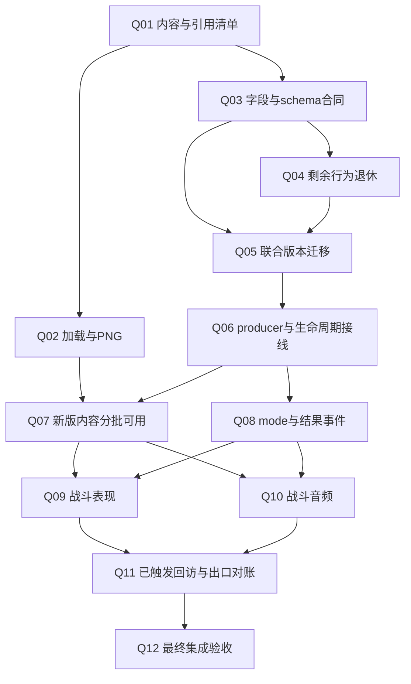

# NTSD 2.8-Logan 与 Unity 战斗完整对齐总表

> **Q05语义身份已接线并限定验证（2026-09-13）：** `NTSD28-Q05-SEMANTIC-CONTENT-IDENTITY-001 / FOCUSED_TEST_PASS / SCOPED_PUBLICATION_PLAY_PASS / JOINT_SCHEMA_PENDING`。raw DAT/visual算法保持，V2 tag+raw32 SHA256/LE ulong进入catalog/candidate/cache、两publisher和本地验证session；75主回归PASS、Visual旧类6PASS/1过期六DAT断言由`NTSD28-Q05-FORMAL-VISUAL-CANDIDATE-ADMISSION-FIXTURE-001 / VERIFIED_TEST_ONLY`定向1PASS闭合（82不同focused有通过证据），完整SelfCheck/独立Python hash通过。正式330/906输入capture成功；隔离native格式源实际menu重进cache1/三key同/World4/46资源全释放/borrower0/两帧Stopped通过，非正式330全渲染或整技能结论。**下一唯一Task `NTSD28-Q05-OPOINT-SNAPSHOT-BOUNDARY-GUARD-001 / READY_FOR_EXACT_PRECHANGE_RECORD`**，继续父步骤3双OPoint guard，再相关内容hash/联合版本/trace/replay。当前12/20/23/1/1未发布，Q05/总目标ACTIVE/FULL_ALIGNMENT_INCOMPLETE，正式资源未迁移；禁止computer-use，Unity/GAS/非战斗、Scene旧SHA/Foot18缺失/例外保持。


> **Q05 HolderCopy载体已清理，步骤2限定出口（2026-09-13）：** `NTSD28-Q05-HOLDERCOPY-CARRIER-RETIREMENT-001 / FOCUSED_TEST_PASS / SCOPED_PLAY_PASS / JOINT_SCHEMA_PENDING`。36脚本/13生产仅runtime/Entity/task/ECS/校验/HitPlan旧载体删除，bit33退休空洞、真实关系保持；首次863=859PASS/4旧统计预期FAIL，独立`NTSD28-Q05-RETIRED-HOLDER-STATS-FIXTURE-CORRECTION-001 / VERIFIED_TEST_ONLY`经27中26PASS+最窄1PASS逐项闭合（保留Cpoint原nativeKO1）。完整SelfCheck与真实pickup/replacement/current OPoint tick/注销Play通过，去旧holderCopy后的有效见证前后完全一致/对象4→4。**下一唯一Task `NTSD28-Q05-CONTENT-IDENTITY-AND-CAPTURE-BOUNDARY-001 / READY_FOR_EXACT_PRECHANGE_RECORD`（父步骤3）**，再联合13/21/24/2/2及trace/回放；五类载体不重做。当前12/20/23/1/1未发布，Q05/总目标ACTIVE/FULL_ALIGNMENT_INCOMPLETE。禁止computer-use；Unity/GAS/非战斗、Scene旧SHA/Foot18缺失/例外保持，正式资源未迁移。


> **Q05 WeaponState载体已清理（2026-09-13）：** `NTSD28-Q05-WEAPONSTATE-CARRIER-RETIREMENT-001 / FOCUSED_TEST_PASS / SCOPED_PLAY_PASS / JOINT_SCHEMA_PENDING`。五生产文件仅旧field/copy/reset/init/ECS hash/checksum/parity删除，真实frame.state/GetResolvedWeaponStateForExternalUse保持；282/282、完整SelfCheck、OID124/action40两次pre-frame Play前后有效观察一致，附带四释放用例PASS/对象4→4。**下一唯一Task `NTSD28-Q05-HOLDERCOPY-CARRIER-RETIREMENT-001 / READY_FOR_EXACT_PRECHANGE_RECORD`**，五类退休载体只剩HolderCopy；之后identity/双OPoint guard/联合13/21/24/2/2/回放继续。当前12/20/23/1/1未发布中间态，Q05/总目标ACTIVE/FULL_ALIGNMENT_INCOMPLETE，正式资源未迁移。禁止computer-use；非战斗/Unity/GAS、Scene旧SHA/Foot18既有缺失/例外保持。


> **Q05 ReleaseTick载体已清理（2026-09-13）：** `NTSD28-Q05-RELEASETICK-CARRIER-RETIREMENT-001 / FOCUSED_TEST_PASS / SCOPED_PLAY_PASS / JOINT_SCHEMA_PENDING`。runtime/copy/reset/ECS hash/checksum/parity及三个无效参数/全部caller已删，四生产文件仅参数变化。267/267、完整SelfCheck复跑、四例当前数据Play前后有效输出一致且对象4→4；首轮SelfCheck旧JSON断言遗漏已纠正并留证。**下一唯一Task `NTSD28-Q05-WEAPONSTATE-CARRIER-RETIREMENT-001 / READY_FOR_EXACT_PRECHANGE_RECORD`**，再HolderCopy、identity/双OPoint guard、联合版本与回放；Q05/总目标ACTIVE/FULL_ALIGNMENT_INCOMPLETE。当前12/20/23/1/1未发布中间态，正式资源未迁移。禁止computer-use；Unity/GAS/非战斗、Scene旧SHA、Foot18既有缺失及例外保持。


> **Q05 GrabbedBy/TrackerFlag载体已清理（2026-09-13）：** `NTSD28-Q05-GRABBEDBY-TRACKERFLAG-CARRIER-RETIREMENT-001 / FOCUSED_TEST_PASS / SCOPED_PLAY_PASS / JOINT_SCHEMA_PENDING`。runtime/Entity/ECS存储、copy/reset/init/自赋值/hash已删；407/SelfCheck/实际pickup-replacement/OPoint tick与unregister Play通过，真实TrackerParent及Owner/Spawner/2F8快照保持。**下一唯一Task `NTSD28-Q05-RELEASETICK-CARRIER-RETIREMENT-001 / READY_FOR_EXACT_PRECHANGE_RECORD`**，后续WeaponState/HolderCopy及identity/OPoint guard/联合版本/回放继续；五类未全部完。Scene旧SHA/Foot18既有缺失保持，禁止computer-use；当前12/20/23/1/1未发布中间态，Q05/总目标ACTIVE/FULL_ALIGNMENT_INCOMPLETE。

> **Q05 Mass/Oscillate载体已清理（2026-09-13）：** `NTSD28-Q05-MASS-OSCILLATE-SHELL-CARRIER-RETIREMENT-001 / FOCUSED_TEST_PASS / SCOPED_PLAY_PASS / JOINT_SCHEMA_PENDING`。20处Context参量/旧runtime、spec及两shell字段已移除；890/SelfCheck、实际driver运动与CentralOnly效果snapshot probe通过，三规则核心主体未变。首轮跨ID整tick错误假设已留证并修正夹具，未改规则。**下一唯一Task `NTSD28-Q05-FIVE-RESERVED-CARRIER-RETIREMENT-001 / READY_FOR_EXACT_PRECHANGE_RECORD`**；2F8/raw恢复和内容来源成果保留。当前shell形状已变而版本仍1/1，只属同Q05未发布中间态，后续13/21/24/2/2、identity/OPoint guard/旧版本拒绝/回放/Play必须继续。Scene旧SHA和Foot18任务外缺失保留；禁止computer-use；总目标ACTIVE/FULL_ALIGNMENT_INCOMPLETE。

> **Q05独立+2F8载体及raw恢复已限定交付（2026-09-13）：** `NTSD28-Q05-OBJECT-AI-2F8-CARRIER-CONTRACT-001` 与 `NTSD28-Q05-UNCLAIMED-RAW-RUNTIME-RESTORE-001` 均FOCUSED_TEST_PASS，46/46/完整SelfCheck/CS0/无新缺失；ObjectAiExcludedGroupSourceSlot2F8独立int/-1、claimed/raw copy/reset/ECS/hash，已补未占用raw恢复漏项并验证旧字段/checksum。**下一唯一Task `NTSD28-Q05-MASS-OSCILLATE-SHELL-CARRIER-RETIREMENT-001 / READY_FOR_EXACT_PRECHANGE_RECORD`**，再五reserved；父Q05步骤3身份/OPoint guard、步骤4统一13/21/24/2/2、步骤5回放/Play仍待。当前仍12/20/23/1/1且字段集合处于INTERMEDIATE_UNPUBLISHED，禁止发布/跨版本交换/Q07。+2F8 held writer/AI消费留Q06。Foot18既有缺失和Scene旧SHA保留；禁止computer-use；总目标ACTIVE/FULL_ALIGNMENT_INCOMPLETE。

> **Q05护甲/碎片实际来源已交付（2026-09-13）：** `NTSD28-Q05-NATIVE-ARMOR-WEAPON-PIECE-SOURCE-INTEGRATION-001 / FOCUSED_TEST_PASS / VERIFIED_ARMOR_PIECE_SOURCE_ONLY`。39夹具/405语料/18armor/三piece与330实际metadata；1829不同测试/完整SelfCheck/CS0/旧138仅source身份差异，原双参数构造保留，Temp probe重建。Q05步骤1数据来源已限定完成，**下一唯一Task `NTSD28-Q05-RETIRED-CARRIER-AND-2F8-MIGRATION-001 / READY_FOR_EXACT_PRECHANGE_RECORD`（父步骤2）**，再身份/联合schema/consumer/Play，不能直接跳Q07。任务外Foot18文件删除+blue/red/yellow新目录保留，Scene旧SHA保持；禁止computer-use。Q05/总目标ACTIVE/FULL_ALIGNMENT_INCOMPLETE，所有例外保持。

> **Q05 BMP/stats实际来源已交付（2026-09-13）：** `NTSD28-Q05-NATIVE-BMP-STATS-SOURCE-INTEGRATION-001 / FOCUSED_TEST_PASS / VERIFIED_BMP_STATS_SOURCE_ONLY`。逐行原版BMP/global stats、动作计数/结束/同一行sheet与实际NativeMetadata接线；405语料/330catalog/28夹具、1390不同测试/完整SelfCheck/CS0、旧138零新投影差异。sentinel/cache与旧sprite准入测试更正均留证，附属`NTSD28-Q05-SPRITE-CORPUS-ADMISSION-FIXTURE-CORRECTION-001 / VERIFIED_TEST_ONLY`（402成功/3拒绝）。Scene旧精度差异SHA保持；正式资源、identity/schema/消费者和Play未完成。**下一唯一Task `NTSD28-Q05-NATIVE-ARMOR-WEAPON-PIECE-SOURCE-INTEGRATION-001 / READY_FOR_EXACT_PRECHANGE_RECORD`**，继续父metadata，不重做BMP/stats。Q05/总目标ACTIVE/FULL_ALIGNMENT_INCOMPLETE，例外保持。

> **Q05 metadata字段合同已交付（2026-09-13）：** `NTSD28-Q05-NATIVE-DEFINITION-FIELDSET-CONTRACT-001 / FOCUSED_TEST_PASS / VERIFIED_FIELDSET_MODEL_ONLY`。不可变ordered Bmp/Stats、Ordinal last-win、预解码int/double有效性及caller fallback已写，新增TryFinite64区分invalid/overflow与有效underflow/零。RED4→486PASS（新4+numeric43+typed439）、4045原版optional、完整SelfCheck PASS、CS0/dotnet0error、Ledger485/95PASS。**未接manager/metadata AST，520精度/3096默认等实际差异仍待。下一唯一Task `NTSD28-Q05-NATIVE-DEFINITION-AST-SOURCE-INTEGRATION-001 / READY_FOR_EXACT_PRECHANGE_RECORD`**，继续父metadata integration，不重做模型/数值；identity/schema/consumer/Play及例外保持，Q05/总目标ACTIVE/FULL_ALIGNMENT_INCOMPLETE。

> **Q05 definition头部审计已交付（2026-09-13）：** `NTSD28-Q05-NATIVE-DEFINITION-HEADER-CONTRACT-AUDIT-001 / VERIFIED_AUDIT_ONLY / METADATA_GAPS_CONFIRMED`。330真实catalog构建后capture与fresh native同源对照：156角色520个float32精度差、172非角色3096个缺省值差（不冒称全是已复现战斗故障）；stats.max_mp158缺载体，weapon_piece三定义各3组4variant缺结构/载体，BMP shadow30/bound98待非例外Q09。18armor/1320sequence/990weapon sound一致，不重写。stats.y3属平台取景例外，smallb154属HUD、hidden/random各158属选择流程排除。capture1/1、CS0、Ledger484/92PASS，production/资源未改。**下一唯一Task `NTSD28-Q05-NATIVE-DEFINITION-METADATA-INTEGRATION-001 / READY_FOR_EXACT_PRECHANGE_RECORD`**，完成metadata native模型/解析接线后再Q05 identity/carrier/联合版本；前包帧内容与330可构建证据保持。Q05/总目标ACTIVE/FULL_ALIGNMENT_INCOMPLETE。

> **Q05-A2 native typed帧接线已验证（2026-09-13）：** `NTSD28-Q05-NATIVE-FRAME-TYPED-CONVERSION-001 / FOCUSED_TEST_PASS / VERIFIED_TYPED_FRAME_CONTENT_AND_CONSTRUCTION_ONLY`。405 DAT/55348声明frame完整40int+六double+27/24/40/9/geometry/ordered sound投影通过，330实际candidate全构建成功，原六文件九frame异常全部消除（不是角色runtime全对齐）。557不同focused有通过证据（555+2）、binary64 2567/原numeric14742回归、完整SelfCheck PASS、CS0/dotnet0error、旧138零新增投影差异、Ledger483/90PASS。**下一唯一Task `NTSD28-Q05-NATIVE-DEFINITION-HEADER-CONTRACT-AUDIT-001 / READY_READONLY_CONTRACT`**，核对尚未完整覆盖的BMP/stats/armor/weapon等definition域，再推进Q05 identity/carrier/联合版本。新增FrameSounds/profile/centerz/chp/cmp及六double须进入identity，Q06 motion/resource、Q09 centerz、Q10音频回访保持。Scene旧精度差异保护；Q05与总目标ACTIVE/FULL_ALIGNMENT_INCOMPLETE，正式资源未迁移。

> **Q05-A2 native frame AST已验证（2026-09-13）：** `NTSD28-Q05-NATIVE-FRAME-AST-ADMISSION-001 / FOCUSED_TEST_PASS / VERIFIED_FRAME_AST_ONLY`。405 DAT/55348声明frame原版有序结构双跑与Unity对照、37语法夹具通过；ssnk数字键7已修且actual manager成功，当前剩余**五文件八frame**。原始RED370含336换行编码假差异，已保留并更正为34实质RED；后续旧六失败与路径分隔符断言修正留证，当前518不同测试有通过证据（517+单独1）、完整SelfCheck PASS、dotnet/CS0、旧138无新增投影差异、Ledger482/88PASS。**下一唯一入口 `NTSD28-Q05-NATIVE-FRAME-SOURCE-INTEGRATION-001 / TYPED_CONVERTER_NEXT`**，先准确Record，再完整27/24/40/19/geometry/WPoint9及frame标量接线/投影；不重做AST。identity/schema/carrier/Play后继保持，Scene精度差异仍保护，Q05与总目标ACTIVE/FULL_ALIGNMENT_INCOMPLETE，正式资源未迁移。

> **Q05-A2 native strength整表加载已验证（2026-09-13）：** `NTSD28-Q05-NATIVE-STRENGTH-TABLE-ADMISSION-001 / FOCUSED_TEST_PASS / VERIFIED_TABLE_LOAD_ONLY`；34语法夹具、正式405中10个strength定义40条原版双跑，真实Unity manager接线；RED34→189PASS+补正确namespace74PASS（45重复，共218不同测试），完整SelfCheck PASS、CS0/dotnet0error、旧138零新增投影差异、Ledger481/85PASS。Scene先前disabled已恢复，现仅UI精度差异，来源仍pending，未回退/不认证Scene unchanged。**下一唯一Task `NTSD28-Q05-NATIVE-FRAME-SOURCE-INTEGRATION-001 / READY_FOR_EXACT_PRECHANGE_RECORD`**：先核对native frame/FieldBag，再完整27/24/40/19/geometry接线与投影；identity/schema/carrier/Play及全部后继保持。Q05与总目标ACTIVE/FULL_ALIGNMENT_INCOMPLETE，正式资源未迁移。

> **Q05-A2 ITR40/strength19 record已写（2026-09-13）：** `NTSD28-Q05-ITR40-STRENGTH19-RECORD-DECODING-001 / FOCUSED_TEST_PASS / TABLE_SOURCE_INTEGRATION_PENDING`保持活跃；三字段/clone/projection/hash、40/19单记录decoder已落盘。RED120→初次488/489，改用native真实FieldBag后最终489/489，完整SelfCheck PASS、CS0、旧138无新增旧投影差异。表头合同已纠正：native仅1..9/拒绝重复，caption非字段，catalog拒绝错误definition。**Scene文件12:15:20多出HUDCamera/ScenesCamera/Canvas disabled及UI坐标差异，ORIGIN_PENDING；已异步询问用户，保留未回退，isDirty=false不可当Scene unchanged。** 下一唯一Task `NTSD28-Q05-NATIVE-STRENGTH-TABLE-ADMISSION-001 / READY_FOR_EXACT_PRECHANGE_RECORD`；source/identity/schema/Play及其他后继保持，总目标ACTIVE/FULL_ALIGNMENT_INCOMPLETE。

> **Q05-A2 Geometry已写/待接线（2026-09-13）：** `NTSD28-Q05-GEOMETRY-CONTENT-CONTRACT-001 / FOCUSED_TEST_PASS / SOURCE_AND_ALGORITHM_INTEGRATION_PENDING`保持活跃；BDY ZWidth/HasGeometry、ITR z/有效性及copy/projection/fingerprint已落盘。native58文件88记录双跑一致，RED92→首次371/375，独立`NTSD28-Q05-RELATED-HITPLAN-FIXTURE-CORRECTION-001 / VERIFIED_TEST_ONLY`纠正4旧HolderCopy/kind7夹具后最终375/375；完整SelfCheck PASS、CS0/Scene clean/root14、旧138无新增旧投影差异。没有修候选算法或切来源，Q03旧27首差留Q06。下一唯一Task `NTSD28-Q05-ITR-STRENGTH-CONTENT-CONTRACT-001 / READY_FOR_EXACT_PRECHANGE_RECORD`；CPoint/OPoint/Geometry均在A2/Q05来源/identity/Play回访，其他后继与例外保持，总目标ACTIVE/FULL_ALIGNMENT_INCOMPLETE。

> **Q05-A2 OPoint24已写/待接线（2026-09-13）：** `NTSD28-Q05-OPOINT24-CONTENT-CONTRACT-001 / FOCUSED_TEST_PASS / SOURCE_INTEGRATION_PENDING`保持活跃。Value/DTO/adapter24与native block decoder已落盘；RED49FAIL→98PASS（新49+旧6+CPoint43）、native43文件45x24、实际多转单和pool复用、完整SelfCheck PASS；CS0/Scene clean/root14。旧138加载成功，相对CPoint轮无新增投影差异；旧工具19/8投影不证明新27/24。没有切来源、修materializer或发布新版本。下一唯一Task `NTSD28-Q05-GEOMETRY-CONTENT-CONTRACT-001 / READY_FOR_EXACT_PRECHANGE_RECORD`；CPoint与OPoint均在A2/Q05来源/identity/Play回访，全部后继约束保持，总目标ACTIVE/FULL_ALIGNMENT_INCOMPLETE。

> **Q05-A2 CPoint27已写/待接线（2026-09-13）：** `NTSD28-Q05-CPOINT27-CONTENT-CONTRACT-001 / FOCUSED_TEST_PASS / SOURCE_INTEGRATION_PENDING`保持活跃。DTO/value/canonical27与3float32/独立hurt/new8int已落盘，新block decoder未切manager；RED42FAIL/1PASS→实际97+13 PASS、完整SelfCheck PASS、CS0/Scene clean/root14。旧138加载成功，710处throwvz均native float32舍入，不能称数值无变；raw资源未改。CPoint新ABI尚未和外层identity/schema一起完成，禁止发布半迁移baseline。下一唯一Task `NTSD28-Q05-OPOINT24-CONTENT-CONTRACT-001 / READY_FOR_EXACT_PRECHANGE_RECORD`；CPoint接线/投影/identity/Play在A2/Q05回访，旧phase/landing ULP/stage暂缓保持。总目标ACTIVE/FULL_ALIGNMENT_INCOMPLETE。

> **Q05-A1限定交付（2026-09-13）：** `NTSD28-Q05-NATIVE-NUMERIC-DECODER-001 / VERIFIED_NUMERIC_HELPER_ONLY`。RED41失败→Unity43/43，含native3622数值与raw969字段共14742扩展比较0差异；完整SelfCheck PASS、CS0/Scene clean/root14、Ledger475/56PASS，保护3059与Q04出口同差异/零缺失。旧Converter/caller/schema/正式资源未改，不宣称运行时接线。下一唯一Task `NTSD28-Q05-LOGAN-CONTENT-MODEL-INTEGRATION-001 / READY_FOR_EXACT_PRECHANGE_RECORD`，先准确路径Record再同Q05窗口迁移模型/入口；115候选inventory复用。Q05及总目标ACTIVE/FULL_ALIGNMENT_INCOMPLETE，旧phase/landing ULP与stage暂缓保持。

> **Q05当前执行（2026-09-13）：** `NTSD28-Q05-NATIVE-NUMERIC-DECODER-001 / IN_PROGRESS`，新增加载期pure decoder，旧Converter/caller/schema/正式资源尚未改。RED41失败→Unity41/41；native3622数值10866比较及raw969字段3876比较0差异。扩展两组Unity回归待重载后运行；不是Q05出口。115候选路径inventory已存父Q05工件，下一继续同窗口模型/身份/runtime迁移，不重做Q03/Q04。总目标ACTIVE/FULL_ALIGNMENT_INCOMPLETE。

> **Q04已交付，下一Q05（2026-09-13）：** Q04-B `NTSD28-Q04-OSCILLATE-CONSUMER-RETIREMENT-001 / VERIFIED_LEGACY_OSCILLATE_READER_ONLY`：RED8FAIL/6PASS→28/28、完整SelfCheck、实际CentralOnly Play slot0偏移/Blink/timeout/延迟速度及共享production快照/恢复PASS，CS0/Scene clean/root14/Ledger474-52PASS。SpriteRenderer前置失败保留，验证改用实际managed表现路径，不宣称GPU全域。Q04-A/B仅行为退休完成，carrier/schema仍旧。下一Q05 Task `NTSD28-Q05-JOINT-CONTENT-RUNTIME-SCHEMA-MIGRATION-001 / READY_PRECHANGE_INVENTORY`，先准确code-path/Record再同窗口迁移；旧phase/landing ULP后继保留，R13行为PARTIAL_RETURN；总目标ACTIVE/FULL_ALIGNMENT_INCOMPLETE。

> **Q04-A已验证，下一Q04-B（2026-09-13）：** `NTSD28-Q04-MASS-FRICTION-GATE-RETIREMENT-001 / VERIFIED_MASS_GATE_ONLY`。production单gate；RED6FAIL/3PASS→focused14/14、完整SelfCheck PASS、真实driver ground/landing三mass0/-2/1一致、cleanup通过、Scene dirtyfalse/root14、CS0、Ledger473/49PASS。首次Play坐标被stage钳制的失败保留，probe已取实际范围中点后通过。相关20项中1个空World旧phase断言失败保留到Q12；另实测既有landing乘1/3与native除3有一ULP首差，加入Q06/B4精确数值待办，不宣称完整landing parity。下一唯一Task `NTSD28-Q04-OSCILLATE-CONSUMER-RETIREMENT-001 / READY_FOR_PRECHANGE_RECORD`，先建Record/RED，只退旧reader。mass/reserved/schema保留到Q05；R13 mass行为PARTIAL_RETURN，总目标ACTIVE/FULL_ALIGNMENT_INCOMPLETE。

> **Q04-A当前执行（2026-09-13）：** `NTSD28-Q04-MASS-FRICTION-GATE-RETIREMENT-001 / FOCUSED_TEST_PASS / FULL_SELFCHECK_PASS / PLAY_PENDING`。production仅移除CharacterMechanics mass>0条件；RED6失败/3通过，focused14/14、完整SelfCheck PASS。相关20项有1个空World旧phase[28]断言失败已保留，未改pass。首次Play摩擦正确但fixture Z200被stage min237钳制，cleanup通过；已改probe先warmup取真实stage中点，下一复验Play，不重跑已完成审计或覆盖现有Record。mass/snapshot/schema仍留Q05。总目标ACTIVE/FULL_ALIGNMENT_INCOMPLETE。

> **Q03已交付，进入Q04（2026-09-13）：** `NTSD28-NATIVE-DAT-AND-JOINT-FIELD-CONTRACT-AUDIT-001 / DELIVERED_CONTRACT_ONLY`，出口证据Q03-EXIT-REPORT.md。数值见证37 native双跑稳定、Unity源链接37/37，333值113异；几何42项15同/27异。出口复核更正：旧Oscillate晚帧reader/base-shell仍在，Q04仅退reader，Q05统一删载体并base1→2；其producer退休保持。Q05版本集合12→13/20→21/23→24/character1→2/base1→2，当前版本均未改。下一唯一入口Q04-A Task `NTSD28-Q04-MASS-FRICTION-GATE-RETIREMENT-001`，先建立准确Change Record与RED测试；随后Q04-B OSCILLATE-CONSUMER。Q03 numeric Change限定VERIFIED，Ledger472/45PASS。R13/R15仅合同PARTIAL_RETURN，Q02成果保持，正式资源未迁移；总目标ACTIVE/FULL_ALIGNMENT_INCOMPLETE、BATCH-02未完成。

> **Q03版本/身份合同推进（2026-09-13）：** 同Q03工件 `VERSION-IDENTITY-AND-CAPTURE-CONTRACT.md` 已记录联合12→13/20→21/23→24/character1→2，其他payload保持；OPoint双owner空队列capture/restore前置（不Flush）、语义摘要确定编码、CPoint27顺序及float32 bit规范、339处reserved/alias分类和+2F8两个object-AI reader。只读合同与规范向量，尚非生产实现。下一唯一动作：native数值语法/bit witness，再逐项核对Q03-A/B完整出口；不重复Q02/几何14/42/两条factory清单。父Q03仍IN_PROGRESS，总目标ACTIVE/FULL_ALIGNMENT_INCOMPLETE，schema/资源/production保持。

> **Q03消费合同推进（2026-09-13）：** OPoint24字段及logic-only/renderer两条factory/initializer/PostInit/copy/reset已记录于同Q03工件 `OPOINT-AND-HELD-DEPTH-CONTRACT.md`。确认显式team与hp/mp有后处理覆盖、缺definition/无slot的整loop终止、未声明0..998零frame、held candidate取holder当前WPoint选择武器strength。WeaponStrength index+8对native index+19的新内容缺口纳入Q05同窗口；不把旧无caller ProcessAttack接成正式路径。此轮只读代码/更新合同，无新脚本/测试/资源变更。父Q03仍IN_PROGRESS；下一为canonical float、reserved/AI全reader、decode-version与Lockstep identity绑定、snapshot的OPoint队列边界。几何14/42见证已交付，不重复；Q02关闭职责保持，总目标ACTIVE/FULL_ALIGNMENT_INCOMPLETE。

> **Q03几何见证已交付（2026-09-13）：** `NTSD28-Q03-COLLISION-GEOMETRY-WITNESS-001 / VERIFIED_CAPTURE_ONLY`；同DAT native14用例与真实Unity三模式42项比较，15相同/27不同，明确深度端点、BDY zwidth、ITR z、负宽度及缺失几何差异；不是parity PASS。正式indexed内容有1127个非零BDY zwidth/78个非零ITR z。报告位于同ID artifacts/diagnostics/REPORT.md；CS0、Scene dirtyfalse/root14、Ledger471/43PASS。只新增诊断工具/Editor测试，production/schema/正式资源不变。父Q03仍IN_PROGRESS，下一继续held strength有效深度、两条OPoint materializer、canonical float及联合字段全reader；新增BDY/presence合同纳入Q05同一窗口。总目标ACTIVE/FULL_ALIGNMENT_INCOMPLETE，Q02限定交付保持，不重做已关闭职责。

> **Q03当前游标（2026-09-13）：** 总目标ACTIVE/FULL_ALIGNMENT_INCOMPLETE，BATCH-02 / Q03 / NTSD28-NATIVE-DAT-AND-JOINT-FIELD-CONTRACT-AUDIT-001 / IN_PROGRESS。六正式DAT九frame已逐块分类（hir frame414为CPoint drain）；复用source-linked双端capture测得CPoint浮点截断/alias、整数准入与WPoint未知字段差异，27/9/24字段形状已捕获。+2F8独立于Spawner、mass/reserved复制/重置/快照链及BDY/ITR候选深度差异已记录；完整consumer/联合版本矩阵仍未冻结。下一继续同一Q03，先完成BDY/ITR live caller与边界证据、两条OPoint materializer、canonical float及全部schema reader矩阵；不跳到Q04/Q05。报告：artifacts/diagnostics/NTSD28-NATIVE-DAT-AND-JOINT-FIELD-CONTRACT-AUDIT-001/Q03-PROGRESS-REPORT.md，联合表JOINT-FIELD-MATRIX.md。Q02限定交付保持；本轮无脚本/正式资源/schema修改，无新增Unity/Play证据。schema12/20/23与character shell1保持，Q07正式迁移未执行；以下旧READY/下一E2均为历史。

> **当前执行游标（2026-09-13）：** 总目标ACTIVE/FULL_ALIGNMENT_INCOMPLETE，BATCH-02继续。Q02加载基础已DELIVERED / VERIFIED_LOAD_INFRASTRUCTURE_ONLY；E3 `NTSD28-B11-SOURCE-CACHE-CALLER-PRODUCTION-001 / VERIFIED_SOURCE_CACHE_CALLER_LOAD_GATES_ONLY`：最终focused40/40、完整SelfCheck最终PASS、native direct/app/menu/menu重进4次Play（每次World4/三key一致/实际pool0/46资源零残留/两帧仍Stopped），默认旧内容App回归也PASS。CS0、NTSD_Battle dirtyfalse/root14、Ledger470/40PASS、保护3059中3047不变/12声明脚本变化/零缺失。首轮late-injection Play失败保留，BeforeSceneLoad测试clone解决注入顺序，原asset未改。下一唯一入口：docs/ai/TASKS/NTSD28-NATIVE-DAT-AND-JOINT-FIELD-CONTRACT-AUDIT-001.md / READY_CONTRACT（Q03六DAT九frame及CPoint27/OPoint24/+2F8/mass/reserved联合合同）；先只读权威消费链/字段矩阵，不提前升schema或部署资源。Q07正式DAT/图片迁移及B11/B12完整验收未完成；schema12/20/23、33ms、十一阶段、Unity/GAS与非战斗行为保持。

> **Q02 E2进行中（2026-09-13最新）：** `NTSD28-B11-SOURCE-ATOMIC-PUBLICATION-001 / FOCUSED_TEST_PASS`只覆盖候选输入绑定与verified decoder：Unity20/20（7+13）、CS0、Scene dirtyfalse、Ledger468/25PASS。新增LoganVisualContentCandidate绑定catalog/config与sheet/head/small hash；BMPLoader在实际decode bytes上验证SHA。E2整体仍IN_PROGRESS，下一继续同一Task/Change的实际staging/停止世代/prepared object-UI/无await提交/资源重绑退休；不是新子目标或完整交付。已确认旧commit提前退休及IsPrewarmCompleted早于UI，uGUI Image保留旧Sprite引用，细节在CANDIDATE-INPUT-REPORT.md；后续脚本前扩充准确Record。global/非战斗/资源未切换，schema12/20/23保持；Q03六DAT阻塞仍在，E3/Q07后继。总目标ACTIVE/FULL_ALIGNMENT_INCOMPLETE；以下旧READY/下一步以本条覆盖。

> **Q02目录E1已验证（2026-09-13最新）：** `NTSD28-B11-LOGAN-CATALOG-CONFIG-CANDIDATE-001 / VERIFIED_CATALOG_AND_CONFIG_CANDIDATE_GATES_ONLY`；真实source-linked native330/330与Unity目录逐项一致，Unity39/39（本包15+路径24）、CS0、Scene dirtyfalse、Ledger467/23PASS。正式config仍由6个DAT Converter失败阻止，未返回partial，不能称新内容整体可用。DefinitionFingerprint仅catalog/DAT，PNG/head/small等完整身份留E2/E3。下一 `docs/ai/TASKS/NTSD28-B11-SOURCE-ATOMIC-PUBLICATION-001.md / READY_CONTRACT`；父CATALOG-PUBLICATION为E1已交付/E2原子发布/E3缓存caller未做。Q03字段合同可独立准备；Q02/BATCH-02/总目标ACTIVE，FULL_ALIGNMENT_INCOMPLETE。global/非战斗/正式资源未切换，schema12/20/23保持；以下旧下一步以本条覆盖。

> **Q02 PNG alpha已验证（2026-09-13最新）：** `NTSD28-B11-PNG-SHEET-ALPHA-CONTRACT-001 / VERIFIED_SOURCE_PNG_SHEET_AND_GPU_SAMPLES_ONLY`；Unity21/21，本包6+PNG13+Overlap2。隔离/正式nar实际sheet staging→atlas pixels→SpriteCatalog→现有shader共10个GPU样点通过（Direct3D11/URP/Gamma），CS0，Scene dirtyfalse，Ledger466/19PASS。旧UI/BMP/processor/shader保持，资源未迁移，schema12/20/23不变。下一 `docs/ai/TASKS/NTSD28-B11-CATALOG-PUBLICATION-CONTRACT-001.md / READY_CONTRACT`，从Q02-A已确认共享caller冻结目录/source/cache/publication事务；Q03字段合同也可准备。R17 raw/range/alpha子条件PARTIAL_RETURN；Q02/BATCH-02及总目标ACTIVE/FULL_ALIGNMENT_INCOMPLETE。未验全局prewarm/正式迁移/全场Play和所有绘制路径，以下旧下一步由本条覆盖。

> **Q02-C已验证（2026-09-13最新）：** `NTSD28-B11-NATIVE-SPRITE-RANGE-CONTRACT-001 / VERIFIED_SOURCE_RANGE_ADMISSION_ONLY`；真实Unity14/14，405DAT/773sheet原始声明/有效范围/尺寸/路径与native capture一致，CS0，Scene dirtyfalse，Ledger465/18PASS。新增Logan配对parser/builder；旧入口和字段形状/schema12/20/23保持。3059保护中仅本包parser/manager及前包BMPLoader声明变化，零缺失。下一 `docs/ai/TASKS/NTSD28-B11-PNG-SHEET-ALPHA-CONTRACT-001.md / READY_CONTRACT`，再做catalog/cache/publication；Q03也可准备。Q02/BATCH-02与总目标ACTIVE/FULL_ALIGNMENT_INCOMPLETE，正式资源未迁移、未验整场Play/GPU；R17 raw+range仅PARTIAL_RETURN。以下旧下一步以本条为准。

> **当前执行（2026-09-13）：** 总目标ACTIVE；Q01/BATCH-01已DELIVERED。BATCH-02/Q02 IN_PROGRESS；纯source合同已VERIFIED，`NTSD28-B11-PNG-WORKER-DECODE-001 / VERIFIED_RAW_WORKER_DECODE_ONLY`也已关闭raw子范围：正式1255/1255像素hash匹配、Unity13/13+最大图1/1、CS0、Scene dirtyfalse。下一`NTSD28-B11-NATIVE-SPRITE-RANGE-CONTRACT-001 / READY`；新增P-21/PNG-SHEET-ALPHA-CONTRACT-001必须保留PNG半透明。仍待range/alpha/catalog/cache/publication，R17 raw部分PARTIAL_RETURN。正式资源/非战斗逻辑未改，未做整场Play/SelfCheck。旧准备态和旧下一包不覆盖本游标。

> **总目标与批次已准备，禁止启动执行（2026-09-13）：** 用户明确要求“先不要执行，只是准备好”。第0.14节保存一个总目标和六个批次目标，全部为 `PREPARED_NOT_STARTED / EXECUTION_USER_HOLD`；Q01只读审计也未启动。
> 恢复先读第0.14节启动状态，再读第0.11节Q队列、第0.12节R回访、第0.13节游标；B1/B2已关闭职责保持。待用户明确启动后，首批为 **BATCH-01 / Q01 / B11新版DAT与角色图片接入清单**。

## 0. 当前执行视图：完整对齐任务重整（2026-09-12）

重整标识：`NTSD28-ALIGNMENT-REPLAN-20260912`。总目标仍为 `FULL_ALIGNMENT_INCOMPLETE`。
**阶段状态先读第 0.10 节：B1 当前生产职责完成，B2 基础与路由职责关闭；B3/B5 仅阶段出口放行；B4/B6 部分子集完成；B7～B12 未完全完成。** 已关闭职责不重新列入实施队列，后续依赖与最终验收分别跟踪。
本节是本表的当前导航和阶段出口约束；第 4 节已直接按当前代码与具名证据修订，启动记录和 Goal 收尾记录保留作证据历史。
本次用户授权重新整理完整对齐任务；本轮只有只读核验和文档修改，不自动恢复所有 production 包。
不得从旧“下一包”或 2026-09-09 全局暂停文字推断当前具名包未完成；也不得从后继限定授权推断全部暂停已解除。

### 0.1 本次核验事实与证据边界

| 项目 | 2026-09-12 核验结论 | 不能扩大成的结论 |
|---|---|---|
| 正式 EXE | 实际运行 `Get-FileHash`，SHA-256 为 `B1E13AE17C86B77240B61A971AFD4C3374B645705F42B0BBCE304FD1D2819033`，与当前权威一致。 | 本轮没有运行正式 EXE 战斗，也没有重新计算全部 source closure manifest。 |
| 正式资源/启动 | 已读 `source/README_SOURCE.md`、playable build 脚本和正式启动器；启动器以 runtime 同时作为两资源根，请求 render FPS 120。 | 同目录存在的资源、测试或候选代码不自动属于正式可达闭包。 |
| Unity | `ProjectVersion.txt` 为 2022.3.62f3；依赖包含本地 `com.ntsd.battle-kernel`；当前常量明确正常 33 ms、快速 3 ms。 | 旧 T-01/T-02 “尚未实现”描述不是当前事实；常量正确仍不能代替 Host 实测。共享 kernel 不能漏出审计边界。 |
| 最近进度 | Goal17～20 有限定收尾记录；Goal20 五项旧行为退休已记录 VERIFIED。读取 `Temp/Goal20_FinalSelfCheck.result` 为 PASS。 | VERIFIED 是具名子集状态，不等于 B6/full tick/full skill/full application parity。 |
| Goal20 回归 | 已读 reconciliation：一次共享 1824 项原始运行失败，20 个旧 ReleaseTick 期望失败；后续受影响 24 项通过。 | 不改写为一次 1824/1824 全绿，不删除原失败记录。 |
| 旧表调用数量 | `rg 'NTSDSpec\.'` 在排除 Test 的 Scripts 中只命中 `LF2Character.cs` 的 mass 初始化。 | 只证明直接表达式搜索结果；别名、反射、mass 消费链、快照和 kernel 路径仍须核验，不能宣布 E 已关闭。 |
| 工作树 | 上轮曾有大量未提交修改；本轮用户澄清后重新检查，审计开始时 Git 工作树干净，HEAD=`6276c912`。 | 不将提交后的旧变更继续报告为未提交。Goal20 曾记录 Scene dirty=true；本轮没有重新读取 Editor dirty 状态。 |

历史“生产尚未开始”“单 RNG”“无接线”“下一 B6”等文字只描述记录时点。每个差异必须结合当前代码、最新具名 Record 和原始证据更新，不能按文字出现顺序选任务。
本轮是任务完整性重整，不是全部 C++/Unity 分支的重新审计；未逐项复核的实现成熟度为待核验。

### 0.2 当前内容决定与保持的例外

1. **例外范围保持**：既有容量、固定相机、多边形边界、随机掉武器、头顶血条、FootSelf、平台取景例外，以及 HUD、结果表现、背景多层/cycle、选择流程排除仍有效。本轮只明确改判 DAT/角色相关图片，不推断其他例外撤销，也不重复询问已确定范围。
2. **H 内容方向已决定（D-023）**：DAT 与角色相关图片使用 NTSD 2.8-Logan 正式版本，旧 Unity 138-DAT 不再裁决目标值。迁移尚未执行，必须先闭合 parser、资源根/格式和引用清单；不再等待“只补缺失/整体切换”的选择。音频及非角色图片仍按原边界处理。

若保留例外，只能声明“非例外战斗域对齐”；若要求战斗域无差异，须逐项撤销相关例外并纳入验收。整应用一致还需要另行包含选择与结果等完整流程。
默认 stage.dat 部署继续暂缓；测试夹具可以验证 stage 逻辑，但不能代表正式 stage 内容交付完成。若最终目标包含正式 stage 内容，该暂停必须单独解决。

### 0.3 双向覆盖台账：防止漏项和重复实现

沿用第 4 节 T/S/I/R/A/F/C/W/L/G/P/O/D/U 差异 ID 和 B0～B12 阶段，不重启旧 campaign。
本轮直接将第 4 节逐 ID 改为当前处置台账；具体实现仍须沿对应符号继续闭合，不把文档审计冒充全分支运行验证。后续每行持续维护：

- 原差异 ID、行为族/分支、可达角色/对象/资源、当前状态与最近核验日期；
- 正式源码文件/符号、playable 构建参与性、调用者/被调用者、字段读写及 reset；
- Unity 生产文件/符号、共享 kernel、fast/fallback/worker 等实际路径；
- 现有 Change ID、证据文件、证据内容哈希、测试覆盖范围、与当前代码/内容/schema 是否匹配；
- 缺口类型：缺实现、缺 producer、缺 consumer、缺资源、缺联测、证据过期、用户决策；
- 上游依赖、下一个最小包、验收场景和最终出口。

双向检查：正式 build closure 中每个战斗分支必须映射 Unity 实现或具名未实现/例外项；Unity 每个可达战斗 writer 必须映射正式行为或批准例外。
禁止只从现有测试和 Unity 方法列表反推“完整”；禁止把零 grep 命中等同于无可达行为。
既有 VERIFIED 包匹配当前身份与代码时复用证据，仅对真实新增依赖、内容/schema 变化或首差补验，不从头重写。
覆盖率只能基于明确台账分母计算；未知项、缺失 trace 字段和无资源 witness 不计作通过。

### 0.4 完整工作分解与出口

以下为剩余核验与实施工作域，**不是声称所有条目均未实现**。每个工作域先做证据对账，产出具名子包后才实施。

| 工作域 | 必须覆盖的任务 | 退出条件 / 主要依赖 |
|---|---|---|
| Q0 当前状态对账 | 原矩阵全部 ID；Goal17～20 成果；旧 blocker 是否已关闭；原始失败与重测；Scene/工作树基线。 | 每个原 ID 都有当前处置，不存在只写“以后处理”的孤儿项；保留全部历史证据。 |
| B0 字段与证据 | slot/generation/生灭、实体及 world 字段、双 RNG 调用日志、事件、内容/schema identity；正式源码与 EXE 可观察证据分级。 | 双端完整字段映射；缺字段显式不可验，不以 null/零补齐伪造相等。 |
| B1 Host | 33/3 ms、暂停、单步、F5、debt cap、同次 Update 最多两 interval、失焦/卡顿、模式边界。 | 相同时间线的 tick/input 消费符合正式 Host；Manual/Lockstep 不消费 LocalFreeRun debt。 |
| B2 输入/RNG/AI | human/link/native AI/object hit_Fa；输入相位、按下/保持/释放、组合窗口、target/owner、双流 call-site/顺序、重开初始化。 | 分支及整 tick trace；真实物理键到动作链；AI 扫描/tie-break/短路的 RNG 消费无首差。 |
| B3 全局 pass | 物理 slot 顺序、输入/运动/瞬移/physics/复活、双 held、collision freeze、两个 hit caller loop、catch、逐slot尾部及publication。 | 全 pass 事件序列相同；placement ready 与完整行为分别核验，不能只数 phase。 |
| B4 帧/物理/复活 | 各对象 frame wait/next/sentinel、速度/位置同步、落地、状态分支、死亡/复活、资源与生成回调。 | 已验证 consumer 复用；补齐 B7/B8/H producer 依赖后再关闭整域。 |
| B5 碰撞/命中 | candidate 集合和顺序、所有可达 itr/body、护甲/防御、伤害/HP/MP/统计、rest/combo、type 分支、终止与实际/HitPlan 一致。 | 命中前快照到全部副作用原子闭合；旧 stats 退休不能掩盖缺失 native writer。 |
| B6 抓取/武器/E | catch/held/refill/pickup/throw、WPoint/CPoint、双方关系、+2F8、目标/owner 区分、mass 与旧 NTSDSpec 残留。 | 复用 Goal17～20；完整技能/关系生命周期证据；保留 carrier 不得继续影响行为，空壳删除另定。 |
| 联合 schema | 按 D-022 审计所有待退 carrier、exact 新字段、shell/snapshot/checksum/ECS；确认当前真实版本与遗漏依赖。 | producer/consumer 退休→一次联合升版→接线验收；旧 midbattle 拒绝、seed/input 重放、capture/restore/hash 通过；不擅改既定版本路线。 |
| B7 生成/生命周期 | 所有 OPoint kind、direct/stage/F8/clone/复活/碎片 producer、继承/default、同 tick 可见性、slot 复用、对象池。 | 从自然输入到生成/命中/消失完整链；HP/baseMax 等 deferred 字段闭合；有序关闭十一阶段和重进零残留。 |
| B8 Stage/Flow | 非例外 clamp/settlement、波次/模式、KO/result timer、继续/结束、功能键接受与拒绝、资源事件。 | 规则即使结果页面被排除也须完整；stage 夹具与正式资产部署分开报告。 |
| B9 战斗画面 | snapshot 时点、前后位置/插值、body/pivot/flip/缩放/透明、Z/slot tie-break、shadow/挂点/spark/bleed/lives/nameplate/combo、shake/earthquake/特殊状态。 | 逻辑命令和 30/60/120 Hz 帧序列对照，出生/消失/瞬移边界不拖影；表现不回写逻辑。 |
| B10 声音 | frame/hit/spawn/KO/模式事件的 tick/顺序、resource key、重复/截断/voice 并发、循环/stop、F11/F12。 | 事件流相同，音源映射与听感/录音核验；后端实现可不同但可观察结果须满足合同。 |
| B11 H 内容 | 正式可达 catalog、indexed DAT、parser presence/default/order、frame/armor/fusion/system、PNG/WAV/glyph、缺失资源、GUID/importer。 | 经批准的正式内容 raw/normalized/引用图闭合；不能用总文件数量相近或当前 138 DAT 测试代替。 |
| B12 集成认证 | 全角色/技能/模式覆盖、完整对战 trace、实际 EXE 与 Unity 操作/画面/声音对照、长跑、回放、worker/fast path 与关闭回归。 | 下述全局门槛全部通过，未解决项为零或逐项批准例外；形成固定版本证据包。 |

### 0.5 依赖顺序与下一步

本节只作导航，**具体选择顺序、硬前置、交付物与回访义务统一维护在第0.11～0.13节**，不再维护另一份模糊的“下一阶段”。

1. 首先执行Q01，确定正式内容引用/替换清单及parser/loader真实缺口。D-023内容方向不再重复选择。
2. 按队列闭合加载前置、数据/字段合同、剩余旧行为退休与D-022联合迁移，再接通B6/B7生产链；不先删资源，也不重做Goal17～20。
3. 新版内容分批接入后，B8补mode/flow/event，B9/B10补视听；每个包达到交付点立即检查第0.12节反向依赖。
4. 先完成已触发的前阶段回访和出口对账，再进入B12最终集成验收；不得因阶段编号较小而无限重开B1～B6。

每个实现包继续要求独立 Task/Change、准确路径与符号、依赖、禁止项、验收及回滚。只改最小闭合行为，未声明资源/Scene/共享 kernel 路径不借机修改。
本轮文档可通过反向移除本节及同步导航恢复；任何实际回滚均保留用户既有工作，遵守 Git 安全授权。

### 0.6 场景覆盖与“完全一致”验收

| 层级 | 覆盖要求 | 必需证据 |
|---|---|---|
| 内容覆盖 | 正式可达每个角色/对象/技能入口/特殊 state 与 mode；从 catalog/引用图生成分母，区分 indexed 与全目录。 | manifest、normalized projection、技能入口到测试 case 映射；不可达须有证据。 |
| 行为覆盖 | 左右朝向，地面/空中，输入冲突/边沿，命中/未命中/防御，HP/MP/死亡边界，抓取/投掷/中断，spawn/free/reuse、同 tick 多事件。 | 分支 trace 和单项测试；非全笛卡尔积，但每个可达分支必须有 witness。 |
| 真实操作 | 每角色可达技能至少一条自然操作链；报告过的组合技、持有武器、奔跑攻击、跟手、阴影必须复现原角色与按键。 | 起始角色/对手/装备、物理按键及持续 tick、连段状态、完整生成→命中→回收、视频/帧序列；禁止只用注入实体代替。 |
| 整场逻辑 | 同内容指纹、schema、初态、seed 和离散输入；实体/HP/MP/状态/关系、双 RNG 调用、事件及 pass。 | 每次首差的 tick/pass/slot/字段/预期/实际；双跑稳定；source runner 证据与正式 EXE 观察明确分级。 |
| 画面 | 相同 viewport、采样时刻、presentation alpha、地图和资源；30/60/120 Hz 与出生/销毁/瞬移边界。 | render command 精确对比，加截图/录像；像素差/字体/采样容差须事前明确，不能看到差异后临时放宽。 |
| 声音 | 同事件时序、同音源、并发/打断/循环/停止；设备输出延迟与逻辑触发延迟分开。 | event trace、资源 hash/音频参数、录音或定向听验；容差事前登记。 |
| 稳定性 | 建议固定 10,000 tick 双跑作为最低长跑，另测 wall-clock 33/3 ms、卡顿/暂停/恢复和 enter/exit/re-enter。 | RNG/状态/资源数量无未解释漂移；worker Join、pending spawn 丢弃、pool/world/publication 零残留。运行预算在 Task 中锁定。 |
| 实现等价 | 所有正式支持的 fast/fallback、单线程/worker、LocalFreeRun/Manual/回放路径。 | 同输入逐 tick trace；不扩张为完整联网/回滚开发任务。 |

例外不可无限传播：固定相机可在事先规定的世界坐标命令域比较；随机掉武器和多边形边界会改变实体/RNG/碰撞，必须使用不触发例外的共同场景做非例外证明，并另测例外开启的影响。不得删除所有下游首差后宣称无差异。

最终交付必须同时满足：全台账闭合、E 无旧规则生产所有权、H 获批且闭合、同版本整场 trace 无未解释首差、正式 EXE 可观察对照、真实 Unity 编译/相关 focused/SelfCheck/Play、画面和声音验收、生命周期与长跑通过。
测试断言修订须依据当前 authority，保留 RED 和原失败；不能为了全绿删减覆盖。Temp 原始证据须在阶段出口归档至版本化证据目录并建立哈希索引，不能仅依赖可清空目录。
存在例外/排除项时最终结论必须附清单；存在 UNKNOWN、STRATEGY_PENDING、RUNTIME_PENDING 或未闭合资源时不得宣布完全对齐。

### 0.7 本轮交付状态

`CURRENT_MATRIX_RECONCILED / DAT_IMAGE_TARGET_CONFIRMED / DOCUMENTATION_ONLY / FULL_ALIGNMENT_INCOMPLETE`。
本轮实际完成：权威 EXE 哈希、启动/源码声明、项目依赖与版本、Git 工作树、当前总表/恢复入口/决策、Goal20 原始回归摘要和 SelfCheck 文件、33/3 ms 与 NTSDSpec 直接调用静态核验。
本轮没有运行编译、Unity 测试、Play、正式 EXE 对战、完整资源 inventory 或逐分支双端审计；本节不产生新的 runtime VERIFIED。

文档验证实测：原141个差异ID全部保留，118行状态/说明已更新，23行沿用经复核的已有状态或用户例外；无ID丢失。旧页首历史段移至本文件文末，除行尾空白规范化外内容逐行一致。`git diff --check`通过；`git diff --name-only -- '*.cs' '*.ps1' '*.shader'`为空。前次文档重排曾触发行尾空白检查失败，已仅修正移动段的空白后复查通过。未运行ChangeLedger validator，因为本轮无脚本修改、无新runtime Change。

### 0.8 当前确实需要调整的脚本与依赖

以下是本轮代码与权威交叉核验后能够定位的修改点；不是重新实现全部 B0～B6。路径相对仓库根；行号是 HEAD `6276c912` 的读取位置，后续修改后以符号为准。

| 优先项 / 关联 ID | 当前脚本位置与已观察事实 | 应调整的内容 / authority |
|---|---|---|
| H-接入 / D-06 | `Assets/NTSD/Scripts/Animation/GameDataManager.cs:44,160`；`Animation/Manager/CharacterAnimtorManager.cs:446,558,851` 仍按旧Config/DAT目录解析。 | 独立registry/DAT/sprite根与逻辑key。正式 `game_session.cpp:1153` 使用decoded_dat与vfs；Naruto `c/nar/nar.dat` 引用 `c/nar/nar.png`，不能在DAT目录下再拼同路径。 |
| H-PNG / D-07 | `Animation/Manager/CharacterAnimtorManager.cs:1364,1408` 在线程池读取；`Animation/Runtime/BMPLoader.cs:57` 后台直接进入BMP手动解析。 | 为正式PNG建立安全的像素解码与publication路径，覆盖sheet/head/small及alpha。主线程LoadImage存在不能证明当前后台路径支持PNG。 |
| CPoint / W-02 | `DatParser/Runtime/Utils/Lf2DatConverter.cs:220` 有front/back→injury/cover alias；`Simulation/DataContracts/CatchPoint/BattleCatchPointValueAdapter.cs:13`、`BattleCatchPointCatalog.cs:13` 只承认19字段。 | 按 `combat_records.h:56` / `combat_records.cpp:120` 补27个独立scalar、去alias并接资源/settlement消费者。缺失8项为faction/baction/uzaction/dzaction/z/recover/drain/gain。正式hir/min/sag action414存在drain600 witness；旧hurt consumer已退，不重做Goal17。 |
| OPoint / L-01、F-05 | `DatParser/Runtime/Utils/Lf2DatConverter.cs:153`、`Simulation/DataContracts/ObjectPoint/BattleObjectPointValue.cs:12` 仅8 scalar。 | `object_spawning.cpp:15` 实际解码24个内容scalar，另source_line为元数据。缺16项z/dvz/hp/mp/team/reserve/effect/pic/centerx/centery/centerz/framea/attacking/join/join_reserve/join_pic；随后同步factory/logic materializer/respawn，不能只扩DTO。 |
| B6 +2F8 | `Animation/LF2Objects/LF2WeaponHeldStateResolver.cs:114` 写Spawner；`LF2Entity.cs:2388`、`LF2WeaponFrameLogicResolver.cs:230` 读取，但该carrier另被spawn/respawn等写入。 | `battle_world.cpp:8025` 的held type1/4/6 DVX专属source与 `native_ai.cpp:281` 的excluded-group consumer需独立语义；不能用通用Spawner/Owner冒充+2F8。列入精确字段与联合schema清单。 |
| E mass / schema | `Animation/LF2Objects/LF2Character.cs:77,1103`、`Animation/Character/CharacterMechanics.cs:374`、`Simulation/Lockstep/Snapshot/BattleWorldCharacterShellSnapshot.cs:14` 仍传递/保存mass。 | 退休无当前authority的mass gate与carrier；正式type0默认为1，属遗留潜在差异而非已测玩家移动故障。复用mass owner审计，不只把初始化改为1。 |
| D-022 reserved迁移 | `NTSDEntityRuntime` 保留GrabbedBy/ReleaseTick/HolderCopy/Tracker/WeaponState；runtime snapshot12、aggregate20、checksum23、character shell1仍在。 | Goal20已退行为，下一按已有联合路线处理声明字段、ECS/hash/capture/restore和版本；CPoint/OPoint内容契约与runtime schema分别声明依赖，不凭本表擅加第二次不兼容窗口。 |
| B7 slot tail / L-02～L-07 | `Simulation/Passes/LateLifecycle/BattleLateEntityLifecycleModule.cs:48`、`Animation/Character/LF2ObjectPointFactory.cs`、`Simulation/Runtime/BattleLogicObjectPointRuntime.cs` 已有结构flush，但完整字段/materializer和terminal顺序尚未闭合。 | 跟随新OPoint合同验证重复zero-frame、已扫描低slot/未扫描高slot、fragment/terminal/reset；已有flush、previous commit及关系cleanup保留。需要逐分支首差再定最终改动清单，不把所有deferred机制判错。 |
| B8结果 / G-05、G-06 | `Simulation/Ecs/Results/BattleResultsOutcomeHostWriter.cs:31,96` 使用HP>0、两bucket、HadBoth和>=11。 | 按 `battle_flow.cpp:16,42` 改living groups、revive_lives与group5排除、timer80/101/350和144后continue；结果UI排除保持。 |
| B9排序 / P-04 | `Simulation/Stage/SimulationStageRenderModule.cs:812`、`Simulation/Presentation/BattlePresentationShadowBuild.cs:2496` 同Z都slot升序。 | 按 `render_snapshot.cpp:2265` 改同深度较大slot先绘制，并验证central排序与遮挡。 |
| B9插值 / P-01、P-02 | `Simulation/Host/SimulationTickDriver.cs:904` 算alpha；`Animation/Rendering/BattleCentralRenderSystem.cs` 消费单published frame。 | 复用当前publication，增加previous/current展示消费及identity/teleport断点保护，保持逻辑只读；按 `presentation_interpolation.cpp:41` 验30/60/120。 |
| B9命令 / P-05～P-13 | `Simulation/Presentation/BattlePresentationShadowBuild.BuildCommands`、`BattleCommonShadowDescriptor`、`BattleEntityOverlayLayout` 未闭合custom shadow/bleed/lives/nameplate/combo/earthquake。 | 按 `render_snapshot.cpp:1596,1777,1823,1857,1942` 与session earthquake接资源/gate/order。spark年龄已验证，只补资源/绘制；旧oscillate仅producer退休，native shake仍待。 |
| B10声音 / O-01～O-04 | `App/NTSDSoundPlayer.cs:280` 有Time.time节流和随机音高/音量；`Simulation/Input/NTSD28NativeFunctionKeyRouter.cs:193` 只路由音量命令。 | native audio event/channel/voice cap/BGM/stop/衰减与实际音量消费需闭合；先证实正式cue下哪些配置触发差异。QueueSound和checksum后publication已存在，复用设施。 |

### 0.9 已完成子集与只需补验的边界

| 已有成果（不得重做） | 当前证据入口 | 仍未涵盖 |
|---|---|---|
| 33/3 ms、Host debt、pause/step | `NTSD28-B1-TIME-HOST-EXIT-AUDIT-001` | OS物理键、长期时间线、worker启用后的复验。 |
| 输入phase/proxy/combo、双RNG/AI基础、功能键生产路由 | `NTSD28-B2-EXIT-GATE-AUDIT-001`及其最终addendum：本阶段职责已关闭，physical Play通过 | 非AI消费者、功能键effect及正式新DAT自然技能/整场trace由下游阶段接管；不得因此重新打开整个B2。 |
| motion/teleport/physics/revival及C25多项owner | B3/B4具名production Record；`NTSD28-B3-EXIT-GATE-AUDIT-001`、`NTSD28-B4-REVIVAL-EXIT-AUDIT-001` | placement/core专项不能关闭所有生成、资源、terminal和画面。 |
| B5大部分候选/伤害/护甲/rest/combo/credit规则族 | 第4.7节当前C行与各B5具名Record | full candidate/fast path/多attacker joint trace与正式内容覆盖。 |
| catch exact/mixed/preflight/accounting/caughtact与原子link cleanup | 当前W-01/L-08及B6具名Record | 完整CPoint资源、world KO、OPoint生命周期。 |
| held refill、kind3 release、terminal结构子集 | B6 HELD-REFILL-MP-EXHAUSTION、WPOINT-KIND3-RELEASE、WPOINT-TERMINAL-STRUCTURAL Record | HP/baseMax、正式全部资源与自然技能链。 |
| pickup P1/P2/P3 | 三个 `NTSD28-B6-KIND2-PICKUP-…-PRODUCTION-001` Record | P3 140 focused/两Play/6记录117字段不等于ITR+OPoint union全量通过。 |
| Goal17～20退休与shared impact/selector | 本文第5节及原Goal17～20最终收尾 | mass/reserved载体还在；schema尚未迁移。 |
| central Mesh增长修复 | `NTSD-BATTLE-MESH-SUBMESH-GROWTH-INITIALIZATION-001` | mesh稳定不等于插值、排序、资源和全部命令对齐。 |

**本轮纠正的 authority 描述：** 两个hit caller loop之间有random drop；timer/armor/rest/healing为逐slot而非全局后扫，只有ordinary combo expiry在loop后。已有Unity结构与这些正式顺序相符的部分保留，禁止根据旧总表误改。正式EXE哈希再次核验一致；源码辅助行与build参与性沿当前入口读取，本轮未重建全closure哈希，也未签发整域运行证书。

### 0.10 B1～B12 阶段状态总览（2026-09-12 出口记录复核）

本节补充**阶段级状态**，第 4 节保留行为域的细项状态。阶段出口 Record 的 `VERIFIED` 表示该份出口审计通过，不自动等于整个行为域 `ALIGNED`。本次只将已有证据准确汇总，不新增运行时完成证据，也不修改历史 Record 状态。

| 阶段 | 当前阶段结论 | 已关闭职责 / 证据 | 剩余工作及归属 |
|---|---|---|---|
| B1 时间与 Host | **当前生产路径的阶段职责已完成**；`B1_CURRENT_PRODUCTION_READY` | 33/3 ms、debt cap、暂停/单步/F5，focused、编译和实际Play；[B1出口](../../../docs/ai/CHANGE-RECORDS/NTSD28-B1-TIME-HOST-EXIT-AUDIT-001.md)。 | OS物理键与长跑归B12；B9解除presentation绑定、启用worker时触发B1复验。当前不重新实现Host。 |
| B2 输入、双RNG、AI基础与功能键路由 | **本阶段基础与路由职责已关闭**；`B2-EXIT-READY` | 输入phase/proxy/combo、双RNG/AI基础、non-AI调用点crosswalk、功能键route/carrier/production与physical Play；[B2出口及最终addendum](../../../docs/ai/CHANGE-RECORDS/NTSD28-B2-EXIT-GATE-AUDIT-001.md)。 | non-AI实际consumer和功能键effect归B3/B5/B8/B10/B11；结果输入归B8，LFR adapter有条件处理，正式内容与自然技能/整场trace归B11/B12。下游未完不撤销B2已关闭职责。 |
| B3 主pass骨架 | **顺序骨架出口通过，整阶段未完全关闭**；`B3_PLACEMENT_EXIT_READY / FULL_CLOSE_DEFERRED` | 多个pass位置、两个hit caller循环及C25多个入口/owner；[B3出口](../../../docs/ai/CHANGE-RECORDS/NTSD28-B3-EXIT-GATE-AUDIT-001.md)。 | residual serial、terminal、生成及跨阶段尾部由B4/B5/B7/B8接管；最终逐pass trace待B12。只处理残余，不重排已正确的骨架。 |
| B4 Frame / Physics / Revival | **多个核心子集已完成，整阶段未完全关闭** | motion、teleport、多项physics与复活gate/queued/normal已有专项；[复活子集出口](../../../docs/ai/CHANGE-RECORDS/NTSD28-B4-REVIVAL-EXIT-AUDIT-001.md)。 | 完整资源更新、OPoint复活字段/视觉producer、碎片/terminal及新版内容验证归B7/B8/B10/B11/B12；复活子集出口不是整个B4出口。 |
| B5 Collision / Hit / Armor / Damage / Combo | **独立规则主线出口通过，整阶段未完全关闭**；`B5_PLACEMENT_EXIT_READY / B5_FULL_CLOSE_DEFERRED` | 大量candidate/hit/armor/damage/rest/combo/credit规则族已验；[B5出口](../../../docs/ai/CHANGE-RECORDS/NTSD28-B5-EXIT-GATE-AUDIT-001.md)允许进入B6。 | 出口审计时未发现额外独立B5首差；catch/resource/content/presentation/lifecycle及最终joint trace仍后置B6/B7/B8/B9/B10/B11/B12。保留后续具名修正，不把出口放行写成整域完成。 |
| B6 Catch / Held / Weapon / E | **大量子包已完成，整阶段未完成** | catch exact/accounting/caughtact、pickup P1/P2/P3、refill子集、impact、compat selector及Goal17～20退休；见第0.9/5节。 | CPoint27来源和+2F8载体已限定验证；mass/Oscillate载体已清理；GrabbedBy/TrackerFlag载体已清理；ReleaseTick载体现已267/SelfCheck/四例前后Play限定验证；WeaponState载体现已282/SelfCheck/OID124前后Play限定验证；HolderCopy现已863纠正证据/SelfCheck/真实Play限定通过；剩余D-022联合identity/schema/trace/replay、+2F8 producer/consumer与完整资源/技能链仍待。既有退休包不再实施。 |
| B7 OPoint / Spawn / Lifecycle | **未完成，已有部分基础与子集** | 部分owner、结构flush、关系清理、previous commit及slot/generation能力已存在。 | OPoint24字段、全部materializer、重复zero-frame、birth visibility、fragment/terminal/reuse及最终关闭联验仍待。 |
| B8 Stage / BattleFlow / Results | **未完成，存在确认的逻辑差异** | 部分clamp位置、模式/结果设施已存在。 | 存活组与复活资格、80/101/350及continue时点、非例外stage/mode/event需要修改和联验；默认stage.dat部署仍暂缓。 |
| B9 战斗表现 | **未完成，已有表现设施与限定修复** | publication、central renderer、C01 spark推进及Mesh增长修复已有成果。 | 同Z排序、previous/current插值、custom shadow/bleed/lives/nameplate/combo/earthquake、正式资源与画面验收未闭合。 |
| B10 Audio | **未完成，已有队列与路由设施** | QueueSound、checksum后publication、播放器和F11/F12输入路由存在。 | native事件时序/channel/voice/BGM/stop/衰减及实际音量命令消费未闭合。 |
| B11 H-Content | **加载基础已验证，正式迁移未完成**；`LOAD_INFRASTRUCTURE_VERIFIED / MIGRATION_NOT_STARTED` | D-023明确DAT/角色图采用NTSD2.8-Logan；Q02 source/PNG/range/alpha/catalog/原子发布/cache/三caller/关闭基础已交付。 | Q03六DAT/联合字段、Q07引用重绑及分批正式迁移、全内容与视听验收仍待；不能以隔离候选通过宣称B11全域完成。 |
| B12 全场景parity验收 | **完整集成验收未完成** | 已积累各子包测试、trace和Play证据。 | 同一最终版本、新DAT/图片下的完整角色技能/整场trace/视听/长跑/退出重进尚未完成，不能拼接局部PASS代替。 |

**实施队列规则：** B1/B2已关闭职责移出待实现队列；新发现的具体首差或上表指定触发条件另建复验/修复包，不能整体重开。B3/B5只保留未接管残余和最终联合出口，B4/B6按未闭合子包推进。B7～B11按依赖补齐，B12承担完整集成验收。所有阶段尚未获得“含全部下游依赖与新版内容终验的整域最终证书”，这不抹除B1/B2阶段成果。

### 0.11 执行优先级队列（2026-09-13）

队列标识：`NTSD28-PRIORITY-DEPENDENCIES-20260913`。Q01～Q12是本总表内的稳定工作组ID，**不是新增Change ID，也不代表代码已启动**。具体实现必须拆成最小闭合Task/Change并登记精确路径；不得把一行跨模块工作一次性全部实施。

当前游标：`EXECUTION=ACTIVE / ACTIVE_BATCH=BATCH-02 / ACTIVE_Q=Q05 / LAST_VERIFIED=NATIVE-DEFINITION-FIELDSET-CONTRACT-001:MODEL_ONLY / NEXT_TASK=NATIVE-DEFINITION-AST-SOURCE-INTEGRATION-001 / ACTIVE_CODE_CHANGE=NONE_UNTIL_EXACT_RECORD / R13_R15=PARTIAL_RETURN / FULL_ALIGNMENT_INCOMPLETE`。
用户已启动总目标，Q01已实际交付；Q02/Q03已满足Q01前置。其余项按硬依赖选择，不再受准备阶段暂停约束。旧包证据保持，不重做已关闭职责。

**选包算法（仅在第0.14节执行暂停已由用户明确解除后适用）：** 先检查R表是否有已触发的回访；有则先处理受影响范围的回访。随后从下表按序号选“硬前置已满足且在当前已启动批次/总目标授权范围内”的第一项。没有满足硬前置的任务才报告具体阻塞。较早项因特定资源/用户范围受阻时，可以推进无关的READY项，必须登记跳过原因；不能以一个局部阻塞冻结全部路线。

| 顺位 / ID | 阶段与有界工作组 | 硬前置 | 当前状态 | 本组交付点（不等于整阶段最终完成） | 完成/变化时检查回访 |
|---|---|---|---|---|---|
| 01 / Q01 | B11：正式DAT/角色图片接入清单与兼容性检查 | 用户已于2026-09-13启动；Task/Record已建立 | DELIVERED | NTSD28-B11-CONTENT-ENTRY-INVENTORY-001已完成离线清单、实际typed首差、path/hash/GUID/非战斗保留审查；报告见顶部。动态reachability与删除许可未认证，资源未导入。 | R15身份子条件已回访；不关闭B11 |
| 02 / Q02 | B11：DAT/sprite根与PNG加载前置 | Q01已交付 | DELIVERED_LOAD_INFRASTRUCTURE_ONLY | path/raw PNG/range/alpha/E1/E2/E3及Preparing回访限定VERIFIED；官方1255PNG raw、405DAT/773sheet及330目录证据保持，E3 final40/40/完整SelfCheck/native三caller+menu重进/legacy App回归PASS，CS0/Scene clean/470-40 Ledger PASS。正式6DAT仍由Q03处理，正式切换留Q07。 | R17加载子条件PARTIAL_RETURN；Q07/视听与整域条件仍待 |
| 03 / Q03 | B6/B7/B0：数据及联合字段合同冻结 | Q01/Q02已交付 | DELIVERED_CONTRACT_ONLY | Q03-EXIT-REPORT逐项出口；六DAT九frame、27/9/24+strength19/BDY、numeric37与geometry42、+2F8/mass/reserved/Oscillate、identity/capture/trace合同闭合；实现和运行时验收留Q04～Q07。 | R13/R15合同子条件PARTIAL_RETURN |
| 04 / Q04 | B6/E/B9：剩余行为退休 | Q03已交付 | DELIVERED_BEHAVIOR_RETIREMENT_ONLY | Mass gate与Oscillate reader各自focused/SelfCheck/Play通过；carrier/base-shell留Q05。 | R13行为PARTIAL_RETURN |
| 05 / Q05 | D-022联合迁移 | Q03/Q04已交付 | IN_PROGRESS / STEP3_GUARD_NEXT / INTERMEDIATE_UNPUBLISHED | 步骤1来源/步骤2载体已限定验证；步骤3 source+decode语义身份已进cache/pub/local validation，82不同focused/SelfCheck/独立hash/menu重进Play通过。下一双OPoint snapshot guard；相关内容hash及步骤4联合13/21/24/2/2与trace、步骤5旧版本拒绝/replay/Play仍待。当前12/20/23/1/1不发布，正式资源未迁移。 | R13删除子条件已回访，R15 identity子条件PARTIAL_RETURN，guard/version/trace仍待 |
| 06 / Q06 | B6/B7及资源owner：精确producer/consumer与slot尾部接线 | Q05 | WAIT_DEPENDENCY | 新增frame int/double分reader motion、chp/cmp内容消费；拆包接CPoint资源/settlement、OPoint完整materializer、+2F8 AI、revival reserve/join、HP/baseMax、C25资源/terminal/pieces/生灭。基础数值合同与规则夹具可先验证；mode/frontend和整场证据分别留Q08/Q12。每个子包实际接通即触发回访，不等整组结束。 | R02、R04～R13、R16 |
| 07 / Q07 | B11：新版DAT/角色图片分批迁移与内容可用验收 | Q02、Q06（包括Q05版本链） | WAIT_DEPENDENCY | 按Q01闭包分批接入、重绑引用、验证内容fingerprint/normalized值及真实载入；每批复验受影响规则。合格交付点为“该批正式内容可用”，不是全视听/全场景通过。旧资源仅按核对后的精确清单处置，保留UI/配置/用户文件。 | R02、R06～R12、R15、R17、R18 |
| 08 / Q08 | B8：非例外stage、mode、结果和事件 | Q06 | WAIT_DEPENDENCY | 拆包闭合stage公式/移除、living groups、80/101/350与continue、mode资源规则、F4等effect和KO/world事件；可用明确夹具先验，正式内容验收依赖Q07。无需等待B9结果页面；默认stage.dat暂停单列。 | R02～R05、R07、R10、R11 |
| 09 / Q09 | B9：正式表现消费与展示验收 | Q07、Q08 | WAIT_DEPENDENCY | 新增frame centerz内容消费；拆包处理同Z排序、post-host snapshot、相邻快照插值及断点、custom shadow/bleed/lives/nameplate/combo/spark/earthquake与资源。按30/60/120采样验证；固定相机等例外保持。 | R01、R08、R14、R16、R17 |
| 10 / Q10 | B10：音频事件与播放效果 | Q07、Q08 | WAIT_DEPENDENCY | 新增FrameSounds按声明顺序前20/跳空值消费；事件tick/order/channel、voice/BGM/stop/衰减、F11/F12实际音量消费；声明DAT catalog与WAV映射。Q09不是其硬前置；未获决定的WAV整体迁移只阻塞相关部分，不能自动扩大D-023。 | R03、R08、R10、R14、R17 |
| 11 / Q11 | B3～B11：前阶段回访与整域出口对账 | Q09、Q10；所有已触发的R项已关闭或有明确剩余归属 | WAIT_DEPENDENCY | 逐个原差异ID回链实际Record、首差、内容/schema identity与待验项；确认旧临时owner已被正确接管，无无主后置任务。只把整场/OS/长跑项目带入Q12；未做完的代码/内容不得改写成只缺B12。 | R04～R17；形成Q12精确场景清单 |
| 12 / Q12 | B12：同版本完整集成验收与最终声明 | Q11；正式内容、schema和例外清单固定 | WAIT_DEPENDENCY | 全角色可达技能、真实物理键、整场逻辑/RNG/事件trace、视听、长跑、退出重进；处理最后首差并归档证据，完成第8节全部门槛后才更新总目标。 | R01、R02、R15～R18及全部剩余终验 |

**开发和终验分开，避免循环依赖：**

- Q01可以读取新版DAT并做兼容性清单；这不要求Q07先完成正式迁移。Q03/Q05/Q06可使用隔离fixture或正式来源测试数据验证字段/事务；不得要求先通过Q12才做schema。
- Q03先冻结合同，Q04只退休尚存行为；Q05承担唯一协调的版本发布窗口，Q06才接入声明的新生产语义。若字段消费的安全过渡必须在同窗口完成，按独立Task声明窗口内顺序，不拆出额外版本、不用伪造默认值宣称兼容。
- Q06的基础资源事务与Q08的mode/frontend投影分开：前者接收明确规则输入，后者提供正式模式值并触发R07/R10复验；不得互相以“等整个B8/B7完成”为前置。
- Q07只要求字段/加载/相关逻辑可用；B9/B10的最终视听依赖Q07资源，不能反过来作为Q07每批导入的入口条件。每批后续视听证据由R17补回。
- Q02与Q03在Q01后可独立准备；Q08在Q06后可用夹具推进，不必因Q07尚在迁移而空等；Q09与Q10可各自推进。并行写代码仍须路径互斥、明确owner，Unity验证串行。
- 图中“硬前置满足”只表示交付依赖满足，不替代实际Task/Change、源码依据、既有用户授权或有序关闭合同。本次没有启动任何实现或资源删除。



图只画Q组的硬前置；R回访在每个子包交付时触发，不是等到Q11才第一次执行。Q11集中核对是否漏做；R01的未启用worker分支和R18的全场景终验可以保留明确条件并由Q12处理，不能形成Q11↔Q12循环。

### 0.12 前阶段后置事项回访表（反向依赖）

R01～R18是稳定回访ID，不是重开整个阶段的指令。R15为PARTIAL_RETURN（Q01身份已记录，Q05/Q07待触发）；R17为PARTIAL_RETURN（Q02-B 1255PNG原始输入hash/解码已验，root/range/alpha/cache/迁移/GPU仍等待）。证据分别见Q01-REPORT和Q02-B-REPORT。其余WAIT_TRIGGER，此前具名VERIFIED保持；不能把回访统一拖到B12。

| 回访ID / 前阶段与原差异 | 等待谁 / 实际触发事件 | 触发后必须做什么 | 关闭证据与禁止误判 |
|---|---|---|---|
| R01 / B1，T-01～T-03、U-03 | Q09启用原先不可用的worker或改变Host/presentation边界；另在Q12进行OS键/长跑 | worker正式启用前回验33/3ms、pause/F2/debt和最后tick；Q12补物理键与长时间线。未启用worker就明确记录条件未触发，不阻塞无关逻辑。 | B1原出口保留；新增路径focused/Play/时间线，不能以旧单线程证据覆盖worker，也不重做Host。 |
| R02 / B2，I-01～I-06、R-01～R-07、A-01～A-08 | Q06每个非AI RNG/生成/AI消费者接通、Q08 mode effect接通、Q07对应DAT批次可用 | 核对流/call-site/顺序、proxy/edge/action、owner/target和自然技能；Q12补完整整场序列。 | 逐变更输入与RNG首差、真实技能链；B2基础/路由职责仍关闭，只回验受影响consumer。 |
| R03 / B2功能键，I-07/I-08/I-10、O-03 | Q08接入F4/资源/结果等effect；Q10接入VolumeDown/Up音频消费 | 对已完成路由后端逐个验证实际效果与拒绝条件、消费tick；Results continue另核144门槛。 | “按键被路由”与“效果已发生”分别记录；已有physical probe不代替新effect验收。 |
| R04 / B3残余owner，S-01/S-15/S-16、F-01/F-09、L-06 | Q06接管terminal/state9998/pieces等、Q08接管session/F7/global tail | 按B3出口残余表逐项复核当前caller/reader；只在所有职责已转移且新鲜证据通过后缩减旧SerialTickAll/HandleFrameTickExit/EntityPostFrameTail相关职责。 | 精确caller归属、无重复writer、terminal/同tick trace；旧11xx/state501等已退休项不再次删除，随机掉落例外保持。 |
| R05 / B3顺序，S-03～S-16 | Q06/Q08改变任一生产pass、结构flush或session边界 | 回到实际NTSDBattleTickSystem检查两hit caller循环、双held、C25逐slot、combo loop后、publication及新增事件位置。 | 当前生产逐pass trace与first difference；不能用phase枚举存在、phase数量或旧单循环描述替代。 |
| R06 / B4复活，F-05、S-06、L-05 | Q06已接reserve/join/join_reserve/join_pic producer且Q07对应正式内容可用 | 用真实死亡→queued/normal复活序列验证资格、资源、位置、owner/slot/出生与visual；图像最终结果在Q09补验。 | 复用原13记录416字段子集；新增producer/内容/Play证据，不能仅因consumer早已VERIFIED关闭整条复活链。 |
| R07 / B4资源与B5共享恢复，F-07/F-10、C-10/C-14 | Q06补C25 pre-display/display/post-display与resource算法，Q08模式规则正式注入，Q07对应内容可用 | 联验HP/MP/baseMax、display值、状态timer与clamp时点、mode/F6抑制及恢复副作用。 | 同tick资源/显示/统计trace；保留已完成PP150边界、负environment recovery和三timer consumer，不能按旧backlog重做。 |
| R08 / B4/B7碎片与生灭，F-08/F-09、W-08、L-03～L-06 | Q06接通state18/OID999/weapon pieces，Q07素材可用；Q09绘制、Q10声音各自接通时追加 | 验zero-entry→particles→previous-action→pieces/lifecycle顺序、数量、已扫描低slot/未扫描高slot可见性；补画面/声音。 | slot/事件/帧序列和资源key证据分层归档；程序化顺序通过不等于正式粒子已经生成可见。 |
| R09 / B5候选与护甲，C-01～C-09 | Q07每批bdy/itr/zwidth/armor/frame内容变化，或Q06更改关系/出生可见性 | 只对受影响族重跑候选集合/顺序、first-body终止、vrest/arest与armor、actual/HitPlan/fast-fallback；Q12全场景。 | 新内容fingerprint、候选与首差报告；旧内容831等计数不是新内容通过证书。 |
| R10 / B5伤害、held与KO，C-10/C-12/C-14、W-01/W-02 | Q06接CPoint/OPoint资源与owner链，Q08接world KO/mode/result，Q10接相关audio | 验damage→HP/MP/score/KO→caughtact→world event的精确顺序与仅一次副作用；补新DAT witness。 | 同tick资源/统计/event trace；已完成held accounting/caughtact/impact不重做，仅补新链。 |
| R11 / B6 C22，C-13、S-14 | Q06相关catch/impulse producer闭合且Q08最终stage settlement/removal接通 | 回到finalizer入口验证被移除对象不会再finalize、hold/count/三轴与stage前后顺序。 | 已有C22公式与Goal18 impact成果保留；新增整链trace，无新首差不新写finalizer。 |
| R12 / B6 held/refill/pickup，W-03～W-05、W-08 | Q06完整HP/baseMax/OPoint关系/old-child cleanup可用且Q07相关DAT批次接入 | 在ITR kind2与OPoint kind2的正式union上验pickup、补给、exhaustion、投掷/中断和技能结束；覆盖新nonzero linked stats。 | 自然操作、完整关系/资源/回收trace；复用P1/P2/P3与refill scoped证据，禁止用两个Play样例宣称全union覆盖。 |
| R13 / B6/E与联合字段，D-05/D-08、W-06、L-08、U-06 | 本次Q04-A mass gate从待办→VERIFIED（14/14/SelfCheck/Play），PARTIAL_RETURN；Oscillate reader也已VERIFIED（28/28/SelfCheck/Play）；Q05 Mass/Oscillate carrier现已890/SelfCheck/scoped Play通过，字段删除子条件PARTIAL_RETURN；GrabbedBy/TrackerFlag carrier也已407/SelfCheck/scoped Play通过；ReleaseTick载体267/SelfCheck/四例前后Play一致已通过（NTSD28-Q05-RELEASETICK-CARRIER-RETIREMENT-001），PARTIAL_RETURN；WeaponState载体282/SelfCheck/OID124前后Play一致已通过（NTSD28-Q05-WEAPONSTATE-CARRIER-RETIREMENT-001），PARTIAL_RETURN；HolderCopy载体也已限定通过（NTSD28-Q05-HOLDERCOPY-CARRIER-RETIREMENT-001，863证据经测试纠正闭合/SelfCheck/真实关系Play）；五类载体删除子条件PARTIAL_RETURN，联合schema/replay仍待，按后继分步触发 | 先确认mass/旧字段不再定义行为，再核对reserved实际删除/保留清单、shell/ECS/hash/capture/restore；生产引用清零后裁定NTSDSpec空壳。 | D-022版本化结果与无旧writer证明；0/null/-1断言只证明行为退休，不等于carrier已删除；不能跳过schema验证。 |
| R14 / B5 combo/C01 spark与B9表现，C-11/C-12、S-02/P-06/P-11 | Q09正式spark/combo图集和命令消费接通；相关声音由Q10单独触发 | 联验命中/计数/expiry与首末可见帧、host slot、命令顺序和资源gate，逻辑只读。 | 复用已完成combo/caughtact和spark age；补30/60/120画面，不能为显示重写计数规则。 |
| R15 / B0与所有trace，T-06/R-07/D-08/D-09/U-06 | NTSD28-Q05-SEMANTIC-CONTENT-IDENTITY-001：raw+V2 semantic/cache/pub/local session子条件经82/SelfCheck/独立hash/隔离源menu Play为PARTIAL_RETURN；双OPoint guard、相关内容hash、版本/trace/replay仍待。 Q01身份基线确认、Q05 schema变化、Q07任一内容fingerprint变化 | 更新双端capture/comparator字段可用性、证据identity；同版本比较，旧snapshot拒绝，seed/input重放。 | 明确authority/source/content/schema哈希；不能填零伪造字段相等或跨版本拼接checksum。 |
| R16 / B3/B7与U-03/U-05/U-08关闭 | **本次Q02返回（E3输入/pool取消也已VERIFIED）：NTSD28-PREPARING-SHUTDOWN-OWNER-CAPTURE-001已VERIFIED，5次Play0残留/两帧仍Stopped；仅该子条件PARTIAL_RETURN**；Q06新增queue/entity/producer、Q09新增publication/renderer或启用worker；Q12终验 | 接入既定十一阶段停止/Join/drain/recycle owner；逐新增模块验退出重进及零残留、Scene dirty基线。 | lifecycle声明、focused与真实enter/exit/re-enter；不得等待整场完成后才给新模块补shutdown，也不得重排顶层关闭顺序。 |
| R17 / B11内容与B9/B10资源出口，D-01～D-07/P-20/O-05 | Q02加载基础已PARTIAL_RETURN（E3已验证；无正式迁移），Q07每批迁移、Q09图像消费、Q10相关声音消费各自完成 | 对账manifest/引用/GUID/缺失资源、正式像素/音源映射；精确处置经核验旧文件，保留用户资源。非角色图片/WAV未决只标对应行。 | Q07的内容可用与后续视听验证分别出证；不以“都能加载”宣称B11整域已完成。 |
| R18 / B2～B6整链与B12，I/F/C/W/L全部非例外域 | Q07相关角色技能内容可用即做定向回访，Q12集成冻结后做全量 | 按具体角色/装备/物理按键走输入→动作→生成→命中→结束/回收；覆盖报告过的组合技、持武器、跑攻、跟手和阴影。 | 记录场景、seed、输入/tick、first difference与影像；注入实体/单测不代替自然技能；最终所有未验项逐条关闭。 |

**反向依赖维护是交付的一部分：** Q表最后一列只提供入口，实际变更影响到未列R项也必须追加。完成Q子包时，在相应R行追加`触发Change ID / 原状态→新状态 / 证据 / 未满足条件 / 下一包`，并同步第0.10节与第4节。上游交付不得悄悄删除R项；若某个等待条件由后继包已解决，写supersede证据后关闭该条件，不能按旧日志再实施一次。

### 0.13 压缩恢复与交接游标

恢复顺序固定为：`CURRENT-AUTHORITY → 本文0.14启动状态 → 0.11队列 → 0.12回访 → 0.10阶段状态 → 目标差异行/Task/Record/原始证据`。执行仍为USER_HOLD时只允许用户要求的准备/讨论，不启动Q01或自动检查权威资源。B编号是职责，不是下一次从哪里开工的游标。

当前交接快照（2026-09-13，总目标ACTIVE，Q01交付）：

| 必填字段 | 当前值 |
|---|---|
| Goal / 执行许可 | `NTSD28-UNITY-BATTLE-REALIGNMENT-001 / ACTIVE`；用户已要求现在启动，首先执行BATCH-01 |
| Plan / prepared batch / next | NTSD28-PRIORITY-DEPENDENCIES-20260913 / BATCH-02 / Q05-JOINT-MIGRATION |
| Active Q / Task / Change | Q05步骤3；NTSD28-Q05-SEMANTIC-CONTENT-IDENTITY-001限定通过，附属NTSD28-Q05-FORMAL-VISUAL-CANDIDATE-ADMISSION-FIXTURE-001为VERIFIED_TEST_ONLY；下一NTSD28-Q05-OPOINT-SNAPSHOT-BOUNDARY-GUARD-001，联合版本/trace/replay仍待 |
| Ready returns / waiting | NONE；R15/R17 PARTIAL_RETURN，后续具体条件见0.12；其余WAIT_TRIGGER |
| 已保护完成项 | B1当前生产职责、B2基础/路由；B3/B5出口与B4/B6/Goal17～20子集证据保留 |
| 已知内容/schema基线 | Unity旧138为迁移前基线，目标D-023；330新版source定义已可构建，正式资源未部署。当前runtime/aggregate/checksum/character/base为12/20/23/1/1，处于同Q05未发布字段迁移中间态，联合目标13/21/24/2/2 |
| 当前明确边界 | DAT/角色图片目标已定；旧资源删除集合未冻结；默认stage.dat部署暂停；其他用户例外、音频范围和十一阶段关闭合同保持 |
| 当前工作树保护 | 保留已有脚本/Scene/文档变化及Foot任务外18旧文件删除、blue/red/yellow新目录；Scene旧精度差异SHA保持，归属pending。不恢复、不清理任务外资源；每次继续重新核对 |
| 下一步最窄动作 | 读取`NTSD28-Q05-OPOINT-SNAPSHOT-BOUNDARY-GUARD-001`与Q03完整snapshot合同，复用driver已有renderer owner，核对两队列World归属/tick/structural边界后先准确Record/RED；不重做已关身份和载体 |
| 最近验证 | Q05 semantic身份：75主回归PASS、Visual6+定向1纠正通过；正式330/906 capture、固定向量/独立SHA和LE投影、完整SelfCheck、实际隔离源menu cache命中1/三key同/46资源零残留/borrower0/两帧Stopped；CS0/Scene dirtyfalse/root14/旧SHA；498 Records/53累计脚本账本通过，保护3059=2954同/87既有声明差/18既有缺失，无新缺失。非正式330全场渲染/整技能结论 |

每次实施交付或压缩交接前，必须更新此游标：当前Q/Task/Change、已满足前置的证据路径、当前first difference、内容/schema身份、被触发R列表、明确未做项、下一最小动作。只有对应交付点实际达成才能将Q置为`DELIVERED`；`DELIVERED`不自动更新整阶段ALIGNED。READY读取/待依赖/局部用户方向等待应分开记录，不复制旧历史“全线HOLD”当作新阻塞，也不凭本次文档整理推断未授权的大型实施已获准。

工作组拆包后，必须在对应Q行或其紧邻索引保留完整的`Q ID → 全部子Task/Change ID → 各子包状态/证据路径 → 触发R ID`映射，不能只保留最后一个包。Q组只有全部必需子包达到本组交付点才能DELIVERED；尚未实施、只写代码或待Play的子包不得被组级状态遮盖。暂停或交接时保留精确阻塞对象与下一个无关可做项。

本轮文档验证（2026-09-13）：从实际Q表解析出12个唯一工作组、18个唯一R回访，硬前置图无环，Q/R引用均可解析，唯一READY_READ_ONLY为Q01；原141个差异ID均保留。`git diff --check`通过，脚本变更为0；AGENTS/DECISIONS与本轮开始时哈希一致，用户资源未处理。未运行编译、Unity测试、Play或ChangeLedger脚本验证器，因为本轮只改优先级与交接文档。

### 0.14 一个总目标与六个执行批次（总目标已启动）

准备日期：2026-09-13。用户本轮明确要求“按照一个总目标＋多个有明确出口的执行批次指定目标，但是先不要执行，只是准备好”。本节是可恢复的**目标合同**，不是已启动任务、实际代码修改清单或自动执行授权。

#### 0.14.1 总目标与硬边界

沿用既有总目标ID：`NTSD28-UNITY-BATTLE-REALIGNMENT-001`，不另起一条平行campaign。

> 在保留当前Unity／GAS框架、全部已批准例外及非战斗功能的前提下，以当前NTSD2.8-Logan正式EXE及playable源码为战斗规则依据，使用其正式DAT与角色相关图片，完成剩余战斗逻辑、数据接入、生命周期和非例外战斗表现对齐，并通过第8节与B12规定的同版本集成验收。

总目标完成条件：141个原差异ID及后续新增差异全部有准确处置；非例外域有符合风险的实现/编译/focused/SelfCheck/真实Play/authority trace及视听证据；D-023内容落地并验证；D-022声明的联合迁移通过；已触发回访无遗漏；框架和非战斗功能保持；按批准例外准确限定最终声明。某个批次或专项PASS不能关闭总目标。

**执行范围保证：**

- 只处理战斗规则、输入消费、状态、碰撞、伤害、抓取、生成/生命周期，以及直接为战斗服务的必要parser/loader、snapshot/checksum和战斗表现接入；资源替换以D-023和精确引用清单为界。
- 不修改或删除与战斗无关的菜单、选择流程、普通UI、设置系统、编辑器功能或其他业务行为；不借对齐重构Unity/GAS、Mono分层、asmdef、对象池、异步框架、ECS或联网体系。
- 共用脚本只修改经声明的战斗路径。若不能避免改变非战斗行为，则该部分暂停并先说明影响，取得用户明确扩大范围的决定后再实施；其他独立且已获授权工作可继续。测试也需覆盖共用入口的非战斗行为保持。
- 不覆盖用户当前工作；每批启动前检查Git/Scene/资源基线。旧资源删除必须先形成精确集合和引用安全证据，并遵守既有删除授权规则，不能清空Config/Sprite。
- authority目录只读；33/3ms、既定两hit caller顺序、逻辑/表现分离和十一阶段shutdown合同保持。固定相机、FootSelf、多边形边界、随机掉落等已批准例外不自动撤销；stage.dat部署和音频范围保持原合同。

#### 0.14.2 六个批次目标

批次ID `BATCH-01`～`BATCH-06` 属于上述总目标，区别于原有阶段B1～B12和工作组Q01～Q12。每个Q只属于一个批次；R回访随实际触发归入当前获准批次，不重开整个早期阶段。各批次当前状态见0.14.4；准备暂停已被用户启动指令覆盖。

| 批次ID / 名称 | 对应Q组 | 具体批次目标 | 启动前置 | 明确退出条件 |
|---|---|---|---|---|
| BATCH-01 / 新版内容接入范围 | Q01 | 只读核对正式DAT/角色图片catalog与引用，形成旧→新映射、兼容性首差、保留资源和后继精确子包。 | 用户明确启动；读取最新authority/工作树，复用已完成证据。无其他技术前置。 | Q01所列清单与证据路径完整；每个确认缺口关联原差异ID、Q owner和R回访；后继Task范围可审阅。不得以本批完成宣称资源已迁移或开始执行第二批。 |
| BATCH-02 / 接入基础与联合版本窗口 | Q02、Q03、Q04、Q05 | 修复必要的根路径/PNG支持，冻结CPoint/OPoint/+2F8/mass及reserved合同，退休剩余旧行为，完成一次协调的D-022迁移。 | 第一批交付；用户已启动本批或总目标；每个子包独立Task/Record，按Q依赖执行。 | 加载前置focused证据；准确字段/owner清单；既有退休保持；新版本capture/restore/hash、旧snapshot拒绝和重放验证通过；受影响路径编译及相关检查通过。生产新字段消费及整场新内容验收归后批，不能用假默认宣称兼容。 |
| BATCH-03 / 战斗生产链与生命周期 | Q06 | 把新字段正确接入CPoint资源/settlement、OPoint materializer、+2F8 AI、revival/HP/baseMax与C25生灭/terminal/pieces。 | 第二批交付；字段与版本明确，纯事务/测试夹具准备；每项修改有当前authority依据。 | 每个必需producer/consumer有实际接线及相应验证，slot/关系/重置/shutdown责任闭合；已触发回访已处理或写明等待正式内容/模式/表现的具体条件。不能把DTO存在当接线完成。 |
| BATCH-04 / 新内容迁移与模式流程 | Q07、Q08 | 按正式引用闭包分批迁移DAT/角色图片，同时收敛非例外Stage、mode、living groups、结果timer与world事件。 | 第三批交付；Q07还依赖Q02；已核对资源清单及涉及的精确脚本/Scene范围。Q07与Q08可在本批按依赖分别推进。 | 正式内容可用、指纹/引用正确，相关规则与自然技能定向验证通过；mode/结果/资源事件正确接入；B3/B4/B5/B6已触发回访有证据。旧资源只按批准的精确集合处置；未决stage/WAV局部项仍明确列出，不能隐藏后宣布本批完整交付。 |
| BATCH-05 / 战斗视听表现 | Q09、Q10 | 完成非例外排序、相邻快照插值、shadow/spark/bleed/lives/nameplate/combo/earthquake和声音事件/播放/音量接入。 | 第四批必要内容与mode事件交付；每项表现修改限定战斗路径，保留现有框架及UI例外。 | 相关30/60/120命令/画面对照和音频事件/效果验证；逻辑checksum不被展示频率改变；worker若启用必须先完成R01；其余已触发R项闭合。未决音频资源不自动扩大D-023范围。 |
| BATCH-06 / 回访收尾与最终认证 | Q11、Q12 | 对账全部阶段残余和回访，再以同一集成版本、新版内容完成最终角色技能/逻辑/视听/长跑/退出重进验收。 | 第五批交付；除本批承担的终验外无未解决代码/内容缺口，身份和例外清单固定。 | Q11确认无无主残余、Q12实际完成第8节全部门槛；所有first difference已修复验证或属于具名批准例外；证据归档后才允许关闭总目标。 |

每批退出前必须检查两份结果：**目标功能证据**和**范围保持证据**。后者说明本批实际修改路径、共用脚本的战斗/非战斗边界、既有功能回归及用户文件保护。发现非战斗行为变化不能以“对齐所需”自动接受。

#### 0.14.3 子任务、批次结束与启动语义

- 层级固定：`一个总目标 → 六个批次 → Q工作组 → 最小Task/Change → 原始验证证据`。总目标保持连续，批次和子包独立验收，Q/R/阶段状态同步；不创建12条互不关联的并行目标。
- 当前总目标已经启动；按批次硬前置与精确Task/Change推进。下方只启动指定批次的规则适用于后续用户明确缩小范围时，不能反向恢复已经解除的准备暂停。
- 用户后续若只启动“第一批”或指定某批，执行范围仅限该批及其已触发且属于该批范围的回访；退出后交付报告并等待后续指令，不自动进入下一批。
- 用户若明确启动“总目标，按批持续推进”，可以在总目标硬边界和既有授权内按批连续执行，每批形成独立出口报告、更新游标后选择后继。未授权的非战斗改动、破坏性删除或其他范围扩展仍不能自行执行。
- 单个批次内不为每个例行小步骤重复询问许可；但写脚本前必须完成适用的精确Task/Change、源码依据、前置条件与验证计划。若某个批次过大，拆子包，不改变其目标或跳过出口。
- 若某批有局部前置未满足，记录确切对象、已完成子包和可独立推进项；不能以部分验证关闭整批，也不能不加说明将剩余项丢给B12。

#### 0.14.4 当前执行快照

| 字段 | 当前状态 |
|---|---|
| Master goal | `NTSD28-UNITY-BATTLE-REALIGNMENT-001`；定义已准备，剩余campaign仍`FULL_ALIGNMENT_INCOMPLETE` |
| Execution permission | `ACTIVE`；2026-09-13用户“现在开始启动”覆盖准备暂停，范围保证保持 |
| Batch states | `BATCH-01 = DELIVERED`；`BATCH-02 = IN_PROGRESS`；`BATCH-03..BATCH-06 = WAIT_DEPENDENCY` |
| Active batch / Q / Task / Change | BATCH-02 ACTIVE；Q02/Q03/Q04限定交付，Q05 IN_PROGRESS，CPoint27/OPoint24/Geometry接线待回访，本批未完成 |
| Current entry | BATCH-02 / Q05-A2 / 下一NTSD28-Q05-NATIVE-STRENGTH-TABLE-ADMISSION-001 / READY_FOR_EXACT_PRECHANGE_RECORD |
| Q/R mapping | 六批完整覆盖Q01～Q12，无重复归属；R01～R18保留原触发条件 |
| Next action | 继续同一E2 Change：首段输入绑定已验，扩充staging/停止/提交/UI资源重绑和回收准确写范围并实施；E3缓存caller保持；见0.13游标。总目标未关闭。 |

第0.13节“唯一READY_READ_ONLY为Q01”的验证文字和下面准备验证均为启动前历史结果；2026-09-13后续启动指令已覆盖PREPARED_HOLD。启动不改变任何已验证阶段/子包的历史结果。

本次准备验证：六个批次唯一覆盖十二个Q组，无遗漏/重复归属；十八个R回访保留，Q硬前置无环；Q01为PREPARED_HOLD，无READY执行项。活动goal检查为空，未启动自动执行。准备前已有的五个脚本、GameConfig资产和战斗Scene共七个受保护文件，准备后SHA-256均未变化；只更新本总表和三个恢复文档。文档diff检查通过，没有执行Q01、资源迁移、Unity编译/测试或Play。

## 1. 最终目标与“完全一致”的准确含义

最终目标是让 Unity 在本文件治理范围内，与正式 NTSD 2.8-Logan 的战斗 runtime 在以下方面完全一致：

- 相同初始状态、seed、玩家输入和逻辑 tick 下，产生相同的输入消费、RNG 消费、实体状态、位置、速度、帧、HP/MP、关系、命中、生成、销毁、统计与战斗结果；
- 战斗相关的角色、武器、飞行物、阴影、火花、叠加文字、绘制层级和时序具有相同的可观察结果；
- Unity-native 的 GameObject、MonoBehaviour、对象池、中央 Mesh、URP、ECS/SoA、worker 和 lockstep 只能改变实现方式，不能改变上述结果；
- 所有差异都必须有明确结论：已对齐、用户批准保留、用户排除、策略待定或仍待证据，不允许因上下文压缩而消失。

### 1.1 用户批准例外与“完全一致”声明边界

用户已经明确批准保留若干 Unity 差异。它们仍然会造成可观察差异，因此在这些例外存在期间，任何最终报告必须使用：

> `战斗规则及非例外表现已与 NTSD 2.8-Logan 对齐；仍保留本文件列出的用户批准 Unity 例外。`

不得使用没有限定语的“逐像素完全一致”“无任何差异”或“整个项目完全相同”。如果用户以后撤销例外，再把对应项目转入正式对齐范围。

### 1.2 当前用户决定

| 决定 | 当前结论 |
|---|---|
| Slot 容量模型 | 使用 Unity 现有容量/profile/动态逻辑容量模型；不作为待修差异。新权威 slot 顺序与生灭语义仍需对齐。 |
| Unity 独有 A：头顶血条 | 保留，不处理。 |
| Unity 独有 B：FootSelf 脚底标记 | 保留，不处理。 |
| Unity 独有 C：移动端底部黑区与平台取景 | 保留，不处理。 |
| Unity 独有 D：多边形战斗边界 | 保留，不处理；明确属于会改变战斗结果的用户批准例外。 |
| Unity 独有 E：旧 `NTSDSpec` | 必须处理；先替换全部生产调用方，最后再决定是否删除空壳。 |
| Unity 独有 F：Unity 随机掉武器路径 | 保留，不处理；明确属于会改变战斗结果的用户批准例外。 |
| Unity 独有 G：固定世界相机 | 保留，不处理；不得借表现对齐恢复新权威完整滚动相机。 |
| Unity 独有 H：内容数值与资源差异 | D-023已决定DAT与角色相关图片采用NTSD2.8-Logan；迁移未执行。按精确引用/替换清单处理，旧138-DAT仅作迁移基线；音频及非角色图片边界不自动扩大。 |
| 新权威缺失项：完整原生 HUD | 用户排除，不处理。 |
| 新权威缺失项：结果页与战斗内结果信息表现 | 用户排除，不处理。 |
| 新权威缺失项：背景多层与动画 cycle | 用户排除，不处理。 |
| 新权威缺失项：完整原生选择流程 | 用户排除，不处理。 |

## 2. 权威、证据和状态词

### 2.1 当前权威

- 正式根目录：`J:\QQFile\NTSD2.8.3.3 zip\NTSD2.8.3.3\NTSD 2.8-Logan`
- 正式 EXE：`NTSD2.8-Logan.exe`
- SHA-256：`B1E13AE17C86B77240B61A971AFD4C3374B645705F42B0BBCE304FD1D2819033`
- playable C++/header closure manifest（82 files）：`39DDDA154F5632C43089E2D5F1A5755ABBFBFD131A85D6B5ABF9AC00E6A46109`
- authority source-capture manifest（75 files）：`07CD47A0623F23D2C439E0E85EABF2ED10F8EAE8FC7D70DDB8396C704B3D778F`
- 对应源码声明：`source\README_SOURCE.md`
- 战斗主 tick：`source\ntsd28_core\src\simulation\simulation_tick_driver.cpp::SimulationTickDriver28::step(...)`
- 正式 host：`source\ntsd28_playable\src\game_session.cpp::GameSession28::step()`
- 逻辑表现快照：`source\ntsd28_core\src\rendering\render_snapshot.cpp`
- 正式绘制与插值：`source\ntsd28_playable\src\d3d11_renderer.cpp`、`presentation_interpolation.cpp`

NTSD 2.4、旧 C#、旧 `game_tick(...)`、旧 trace、旧测试名和旧 Change 状态都没有当前裁决权。

### 2.2 差异状态

| 状态 | 含义 |
|---|---|
| `CONFIRMED_DIFFERENCE` | 两端代码、数据或正式行为已经显示出明确不同。 |
| `AUTHORITY_ONLY` | 新权威存在正式能力，Unity 当前没有对应生产路径。 |
| `REBASELINE_REQUIRED` | Unity 有相似实现，但尚未使用新权威调用链和 trace 证明一致。旧验证不能继承。 |
| `USER_ACCEPTED_EXCEPTION` | 用户明确保留 Unity 差异，不进入当前修复范围，但必须永久披露。 |
| `USER_EXCLUDED` | 用户明确排除的新权威功能，不作为完成门槛。 |
| `STRATEGY_PENDING` | 用户已要求处理，但实施方向尚未决定。 |
| `ALIGNED` | 只有具备本文件规定的新权威证据、测试和运行时验证后才能使用。当前总表尚无任何项目因此自动成为 `ALIGNED`。 |

### 2.3 完整性规则

本表是当前静态 inventory 的完整入口，但静态阅读不能证明不存在隐藏差异。一个领域只有在以下条件同时满足时才能关闭：

1. 新权威正式 EXE/正式源码调用链、字段和 build closure 已闭合；
2. Unity 对应生产调用链、默认值、重置点和所有写入者已闭合；
3. 同 seed、同输入、同 tick 的状态/RNG/事件 trace 没有 first difference；
4. 聚焦测试、Unity 编译、SelfCheck 和目标 Play 场景均有新鲜证据；
5. 表现项还需 30/60/120 展示采样或逐帧截图/录像证据；
6. 用户批准例外和用户排除项仍被准确披露。

因此，“没有在静态源码中发现更多项目”不等于“没有更多差异”。

## 3. 总体结论（2026-09-12 当前审计）

- B1～B6 已有大量生产接线和具名限定验证；旧“尚未开始、没有双 RNG/输入代理”的总括描述已过时。角色/对象两个hit caller循环符合当前权威，旧表要求合并的描述已纠正；不得由类名与C++不同推断未实现。
- 第 4 节将当前实现、已验证子集、确认脚本差异、只缺集成/内容验收与未核验分开。`VERIFIED`/`ALIGNED_SUBSET` 只针对所列子域，不升级整个阶段。
- Goal17～20 已完成的旧 hurt/Flute/oscillate、pickup、impact、compat selector及关系行为退休不再列为待实现。剩余数据/schema、OPoint与跨阶段资源、flow、表现/音频及全场景验证仍须闭合。
- 本轮实际确认新版资源接入的 CPoint 19→27/alias、DAT与sprite root、后台PNG解码缺口。正式全目录405 DAT、Unity138 DAT不等于可达内容数，迁移按正式catalog引用图进行。
- D-023 已明确 DAT/角色图片采用 NTSD 2.8-Logan。所有历史 Direction-B 数量与验收保留为旧内容证据；新版内容尚未部署。
- 本轮只改治理和对齐文档，没有修改 C#、Scene、Prefab、DAT、图片或运行行为；没有新增编译/测试/Play结果。

## 4. 完整差异矩阵

**读取规则（2026-09-12）：** 本节是当前处置，不再是最初静态盘点。`*_VERIFIED` 是已有具名证据，`*_PENDING` 要看是内容/运行验收还是实现；`REVIEW_REQUIRED` 不等于已经证实代码错误。详细符号与证据索引见本节表格、第 0 节当前剩余脚本清单及第 5/6 节。历史启动/失败记录保持原样，不以它们覆盖本节当前状态。

### 4.1 Host、时间与调度

| ID | 状态 | 新权威 | Unity 当前 | 影响与处理 |
|---|---|---|---|---|
| T-01 | `CURRENT_PRODUCTION_VERIFIED / B12_PENDING` | 正常逻辑间隔为 `33 ms`。 | 已为SIM_DT=0.033f；B1-CADENCE-CONTRACT及TIME-HOST-EXIT有focused/实际Play证据。 | 复用实现；物理键、长跑和B9解除worker限制后的复验归B12。 |
| T-02 | `CURRENT_PRODUCTION_VERIFIED / B12_PENDING` | F5 快速模式使用 `3 ms` 间隔。 | FAST_SIM_DT=0.003f，切换清debt，B1出口包含快速模式Play。 | 不重做F5；实际OS按键、长跑与worker启用后复验。 |
| T-03 | `CURRENT_PRODUCTION_VERIFIED / B12_PENDING` | Win32 host 按 33/3 ms 处理 wall-clock debt、暂停、单步和 excess debt。 | SimulationTickHostPolicy/Driver已实现两interval debt及每Update最多两tick，F1/F2/F5有focused与Play。 | B1-TIME-HOST-EXIT允许进B2；未启用worker和OS输入不得扩大为已验。 |
| T-04 | `PARTIAL_IMPLEMENTATION / B8_JOINT_PENDING` | `GameSession28::step()` 先处理上层 battle flow/模式，再调用战斗 step。 | Driver.StepOneTickInternal及function-key session接线已存在。 | 剩余Results/mode/离场与core同tick边界归B8；不是重做整个Host。 |
| T-05 | `USER_ACCEPTED_EXCEPTION` | 引擎 profile 为 1000 物理 slot。 | Unity 使用多个容量 profile 和动态逻辑容量。 | 按用户决定保留 Unity 容量；只对齐 slot 顺序、identity、复用和生灭可见性。 |
| T-06 | `FIELD_BINDINGS_IMPLEMENTED / FINAL_TRACE_PENDING` | 物理 frame id、资源 frame 和逻辑 sequence 有明确整数边界。 | B0 action/frame/counter与B3 C23/C24 world clock已有字段及证据。 | 逐对象完整reset/序列、B7 terminal与presentation tick需联合trace。 |

### 4.2 主 tick 与 pass 顺序

| ID | 状态 | 新权威顺序 | Unity 当前 | 影响与处理 |
|---|---|---|---|---|
| S-01 | `PLACEMENT_EXIT_READY / TAIL_FULL_CLOSE_PENDING` | 单一 `SimulationTickDriver28::step()` 固定全局顺序。 | NTSDBattleTickSystem已有B3实际phase及C25生产入口；不是原29phase未迁移状态。 | 复用B3-ACTUAL-PHASE-SEQUENCE/EXIT-GATE；只补C25 residual及B7/B8依赖，最后逐pass trace。 |
| S-02 | `B3_C01_ALIGNED / B9_RESOURCE_MAPPING_PENDING` | tick 开始先推进原生 spark。 | 已在input phase后、producer/hit前建立resource-independent C01唯一writer；presentation/Host/worker只读。 | lifecycle、同tick新hit base ID和终止时序已通过真实Play；素材/完整资源映射仍归B9。 |
| S-03 | `TWO_PASS_PLACEMENT_VERIFIED / OBJECT_AI_PENDING` | 先做物理实体扫描、object `hit_Fa`、原生 AI 和 pending input sample。 | SimulationWorld与NTSD28InputTwoPassModule已做producer/sample→proxy/route；B3-C02-C03已接。 | object hit_Fa剩余分支、完整AI/生成与新版DAT触发链仍待；不能称没有输入接线。 |
| S-04 | `C04_OWNER_VERIFIED / FINAL_TRACE_PENDING` | 输入路由后执行 frame motion。 | RunFrameAdvancePhase先调用NativeFrameMotion，B3-C04与B4-F02有专项证据。 | 复用motion；正式内容/全对象/优化路径的整tick验收后置。 |
| S-05 | `C04_C05_C06_PLACEMENT_VERIFIED` | frame motion 后执行 teleport，再执行 physics。 | 已实现frame motion→state400/401 teleport→nested physics，相关Play通过。 | 不能重排回旧early pass；特殊资源/完整场景仍需联验。 |
| S-06 | `REVIVAL_CORE_VERIFIED / PRODUCER_PENDING` | physics 后统一处理 revival 及其表现对象。 | BattleRespawnModule及B4 gate/queued/normal/exit已有13记录416字段trace。 | OPoint reserve/join/join_reserve/join_pic、视觉资源和schema依赖仍归B7/H。 |
| S-07 | `PLACEMENT_AND_REFILL_SUBSET_VERIFIED` | 第一次 stage depth clamp 后第一次 held refill。 | 首次stage clamp→held refill已接；B6-HELD-REFILL-MP-EXHAUSTION有Sakura/Naruto真实Play。 | HP/baseMax与完整OPoint materializer及新版内容验收未关闭。 |
| S-08 | `SNAPSHOT_CANDIDATE_PLACEMENT_VERIFIED` | movement/physics 后冻结 action snapshot，再建几何候选。 | C09后冻结action并建候选，B3-C10/C11有focused/Play，B5逐规则迁移已进行。 | 全部candidate集合/顺序与fast path最终trace另验。 |
| S-09 | `FUSION_PLACEMENT_VERIFIED / LIFECYCLE_PENDING` | fusion 在候选建立后、命中消费前。 | Oid5152FusionScan已在candidate后、hit前；C12 barrier已验证。 | fusion partner生灭、全部内容和同tick可见性依赖B7。 |
| S-10 | `TWO_CALLER_LOOPS_PRESENT / JOINT_TRACE_PENDING` | simulation_tick_driver.cpp:730起明确两个升序caller loop：type0先消费，random drop后nonzero type消费。 | 当前CharacterHit→RandomWeaponDrop→ObjectHit与正式caller顺序一致；共享hit runner不意味着合并两循环。 | 旧表单一升序循环要求作废；保留两循环，验每循环candidate及终止语义。 |
| S-11 | `USER_ACCEPTED_EXCEPTION` | consume_native_hit_pass(true)→random drop→consume_native_hit_pass(false)；正式候选表为空。 | 当前随机掉落位于CharacterHit与ObjectHit之间，与正式phase位置一致；生成内容保留Unity例外。 | 只保留生成行为例外，不能把phase位置也误判为待改。 |
| S-12 | `CATCH_CORE_VERIFIED / RESOURCE_EVENT_PENDING` | 两个hit循环后catch advance/settlement；再clamp/held、最终stage settlement与horizontal impulse。 | B6 mixed advance/exact relation/preflight/held accounting/caughtact及positive validation退休已有证据。 | 补MP resource/world KO及余下producer；C22在最终stage之后，不能按旧文字提前。 |
| S-13 | `PLACEMENT_VERIFIED / FULL_STAGE_RESOURCE_PENDING` | 命中后第二次 depth clamp，再第二次 held refill。 | 命中/catch后第二次clamp→held已接，不再是位置缺失。 | 复用held-refill证据；完整资源/B8非例外边界/内容联合验收待做。 |
| S-14 | `C21_C22_PLACEMENT_VERIFIED / JOINT_PENDING` | 随后执行最终 X/Z stage settlement。 | PreFrameBounds→FramePostProcess已映射final settlement→impulse。 | C22 consumer已有独立证据；余下stage/producer联合首差再决定修改。 |
| S-15 | `C23_C24_VERIFIED / C25_PARTIAL` | `begin_native_resource_tick()`、`begin_frame_tick()` 后升序逐 slot 执行定义/资源/帧/生命周期/OPoint。 | world两时钟与单一LateEntityLifecycle入口已有生产包；多项C25子owner已验证。 | OPoint实时birth visibility、terminal/pieces/resource、残余serial尾需B7，禁止重做所有尾部。 |
| S-16 | `PER_SLOT_TAIL_PARTIAL / B7_RESOURCE_PENDING` | 当前源码955..1074：每slot definition/resources/display/frame/timers/armor/rest/OPoint/particles/previous/pieces/lifecycle/healing；loop后才combo expiry。 | BattleLateEntityLifecycle已执行逐slot frame/timer/armor/rest/previous/healing子owner；combo expiry另在loop后。 | 原全局healing/display/timer/rest描述错误；按C25同slot顺序补资源/生成/terminal，保留已验owner。 |

### 4.3 输入、组合键、代理和功能键

| ID | 状态 | 新权威 | Unity 当前 | 影响与处理 |
|---|---|---|---|---|
| I-01 | `PHASE_CADENCE_IMPLEMENTED / JOINT_CONTENT_PENDING` | `DAT_004A0B90` 输入更新相位；1tu 强制 0，2tu 交替 1/0。 | INPUT-PHASE-CADENCE已实现1tu=0、2tu交替及human phase0更新；INPUT-JOINT-TRACE有子集证据。 | 正式新DAT下真实技能/2tu输入与长跑复验，不重写已接phase。 |
| I-02 | `PHASE_CADENCE_IMPLEMENTED / JOINT_CONTENT_PENDING` | 非 AI 物理输入只在相位 0 更新 producer。 | INPUT-PHASE-CADENCE已实现1tu=0、2tu交替及human phase0更新；INPUT-JOINT-TRACE有子集证据。 | 正式新DAT下真实技能/2tu输入与长跑复验，不重写已接phase。 |
| I-03 | `TWO_PASS_IMPLEMENTED / NATURAL_TRACE_PENDING` | physical sample 位于逐 slot input routing 之前。 | first scan producer/sample、second scan proxy/route已存在于SimulationWorld/NTSD28InputTwoPassModule。 | 补完整input→动作自然trace及object/AI缺失分支。 |
| I-04 | `PROXY_33_BYTE_SUBSET_VERIFIED` | linked input proxy 精确复制 `0x21` 字节输入状态。 | NTSD28InputProxyBlock已有33字节序列化/deep-copy，两pass proxy接线已有focused。 | history不属于这33字节；完整AI/history/action链与新版内容复验。 |
| I-05 | `NATIVE_INPUT_PARTIAL / ACTION_CONTENT_REVIEW` | human、AI、linked producer 的选择和覆盖顺序由 `input_routing.cpp` 定义。 | native producer、combo/router字段和transaction已接；不是只有旧组合池。 | 按最新action crosswalk确认缺caller与仅旧DAT值为0的区别；新内容需自然组合键逐链验收。 |
| I-06 | `NATIVE_INPUT_PARTIAL / ACTION_CONTENT_REVIEW` | 组合键状态与动作解析在输入代理和 frame motion 前闭合。 | native producer、combo/router字段和transaction已接；不是只有旧组合池。 | 按最新action crosswalk确认缺caller与仅旧DAT值为0的区别；新内容需自然组合键逐链验收。 |
| I-07 | `PHYSICAL_ROUTE_SUBSET_VERIFIED / EFFECTS_PENDING` | F1～F12 含暂停、单步、离场、快速、资源、补 MP、掉落、终止、音量等合同。 | B2-FUNCTION-KEY-PRODUCTION-INTEGRATION与PHYSICAL-PLAY-PROBE已有F3-F12组证据；B1接F1/F2/F5。 | physical route不等于F4/F6/F7/F8/F9资源/退出/flow全部effect完成，归B5/B8/B10/H。 |
| I-08 | `B8_FLOW_REVIEW_REQUIRED` | Results continue 输入只在指定结果 timer 后生效。 | 已有BattleResultsFlow/Results writer，完整原生timer与continue尚未闭合。 | 与G-05一起闭合准确字段和首差；结果页面排除不等于逻辑排除。 |
| I-09 | `NATIVE_LFR_COMPATIBILITY_NOT_VERIFIED` | `.lfr` 录制、回放、保存失败重试/丢弃具有正式格式和 host 行为。 | Unity已有journal/replay，现有source-model诊断不证明原生.lfr格式兼容。 | 先确定验收是否需要直接消费正式LFR；若需要则独立adapter包，不为trace工具重写联网。 |
| I-10 | `ROUTE_RULES_IMPLEMENTED / OS_MATRIX_PENDING` | Win32 key repeat、Ctrl 维护命令、global delay 和 F3 lock 会拒绝部分命令。 | native key router/session已接Ctrl/priority/F3等规则，不能统称只有旧allowlist。 | OS repeat、延迟/lock/拒绝矩阵与F1/F2/F5物理验收归B12。 |

### 4.4 RNG

| ID | 状态 | 新权威 | Unity 当前 | 影响与处理 |
|---|---|---|---|---|
| R-01 | `DUAL_RNG_IMPLEMENTED / CONSUMERS_PARTIAL` | 两个进程级流：MSVCR80 CRT 流与 3000-byte synchronized table 流。 | NTSD28NativeRandom已有CRT与3000-byte同步表、state/reset/capture；AI accepted消费已有专项。 | 不是单RNG缺实现；按最新非AI调用点和B6/B7生产状态补缺，最后整场消费顺序trace。 |
| R-02 | `CALLSITE_API_IMPLEMENTED / COVERAGE_PENDING` | `synchronized_next(call_site, bound)` 把结果绑定到固定调用点。 | SynchronizedNext(callSite,bound)及accepted AI调用日志已存在。 | B6 refill/throw/复活等后继已迁移部分非AI点，旧crosswalk不得全部重开；余点逐caller核验。 |
| R-03 | `AI_AND_NONAI_SUBSETS_VERIFIED / FULL_LEDGER_PENDING` | AI、掉落、生成、模式选择各自消费指定流。 | AI及B4复活/B6多项生产consumer已使用native流；RNG ledger非零起点。 | 按当前生产逐调用点闭合流/ordinal/short-circuit；例外流单列。 |
| R-04 | `USER_ACCEPTED_EXCEPTION / ISOLATION_TRACE_PENDING` | 普通随机掉落固定消费 call-site `0x92`、bound 200。 | BattleRandomWeaponDropModule保留world.Rng独立掉落路径。 | 验证不触发例外的场景及例外开启影响，不能把下游差异无限豁免。 |
| R-05 | `CROSS_PASS_SEQUENCE_VALIDATION_PENDING` | 同一 tick 的随机调用顺序由物理扫描、AI、hit、spawn 和 tail 固定。 | 当前已有双流和大量有序consumer，不能凭旧pass描述断言全部顺序错误。 | 随B7/C25等缺口闭合逐tick比较callsite；发现首差再修具体owner。 |
| R-06 | `RESET_SNAPSHOT_SUBSET_VERIFIED / REPLAY_PENDING` | seed/reset/recording 与 GameSession 生命周期绑定。 | RNG-WORLD-STATE与DIRECT-BATTLE-BOOTSTRAP已有reset/restore/seed子集证据。 | 新版内容、联合schema后的回放/多world/worker/长跑复验。 |
| R-07 | `DIAGNOSTIC_TRACE_IMPLEMENTED / FORMAL_CAMPAIGN_PENDING` | 正式 trace 可按流和 call-site 定位 first difference。 | 已有raw schema/comparator与direct/accepted per-call trace observer。 | 源码runner诊断不升级为正式EXE内部证书；整场各域trace仍需B12。 |

### 4.5 AI

| ID | 状态 | 新权威 | Unity 当前 | 影响与处理 |
|---|---|---|---|---|
| A-01 | `PRODUCER_PLACEMENT_IMPLEMENTED / OBJECT_AI_PENDING` | native AI 在物理扫描阶段、输入路由之前执行。 | native sample/proxy两pass已接；AI先于route，B3-C02/C03已有placement。 | object hit_Fa余分支与正式自然场景仍需闭合。 |
| A-02 | `NATIVE_KERNEL_PARTIAL / FINAL_TRACE_PENDING` | AI 的目标扫描、距离、队伍、对象类型和 tie-break 来自当前 `native_ai.cpp`。 | AiDecisionKernel已覆盖大量native分支和双RNG accepted transaction，不能称仅旧AI。 | 逐分支核对最新Record；新DAT profile/目标/动作及全世界first difference尚待。 |
| A-03 | `NATIVE_KERNEL_PARTIAL / FINAL_TRACE_PENDING` | AI 同时消费 CRT 与 synchronized 随机调用。 | AiDecisionKernel已覆盖大量native分支和双RNG accepted transaction，不能称仅旧AI。 | 逐分支核对最新Record；新DAT profile/目标/动作及全世界first difference尚待。 |
| A-04 | `OPTIMIZED_PATHS_PRESENT / ORDER_TRACE_PENDING` | special scan、linked target、威胁和对象选择使用正式 slot 顺序。 | full/indexed/SoA/shadow均存在且已有相关专项。 | 全slot candidate集合/顺序/tie-break在正式可达场景复验，shadow自身通过不等于native parity。 |
| A-05 | `PROXY_OUTPUT_IMPLEMENTED / ACTION_CHAIN_PENDING` | AI 输出进入同一 input proxy/routing 数据结构。 | exact input store/host pending/proxy roundtrip已接同输入结构。 | 完整AI→组合动作→frame motion自然链与新内容验证后置。 |
| A-06 | `C25F_TIMER_OWNER_VERIFIED` | type-0 frame state 7000～7999 在 slot tail 刷新 computer timer。 | BattleLateEntityLifecycle.RefreshNativeComputerState已按slot<10/type0/state7000..7999写timer，同tick后续递减。 | 复用B3-C25F-H-J-TIMER-OWNERS；mode/content/AI可见性仍另验。 |
| A-07 | `OWNER_BINDING_VERIFIED / SENSING_TRACE_PENDING` | 角色/武器/特殊对象的 AI 可见性由物理 slot 和状态门控制。 | B2-AI-OWNER-SLOT-KILLCOUNT-CORRECTION已有8记录48字段专项，消费OwnerSlotIndex。 | 全对象集合/顺序和空间索引优化对照仍待，不重做owner binding。 |
| A-08 | `MODE_INTEGRATION_REVIEW_REQUIRED` | function key、battle mode、资源开关可改变 AI 可见状态或资源。 | function/resource/mode已有部分载体与接线。 | 按B8/H具体effect确认AI可见性与decision；未核验部分不能直接报告错误。 |

### 4.6 Frame、运动、物理和复活

| ID | 状态 | 新权威 | Unity 当前 | 影响与处理 |
|---|---|---|---|---|
| F-01 | `C25G_FRAME_BODY_VERIFIED / TERMINAL_PENDING` | `frame_machine.cpp` 定义 wait、next、action 和 frame counter。 | LF2Entity.RunNativeC25FrameBodyForWorldPass及frame tick已有B3-C25G生产证据。 | B7 terminal/free、所有sentinel与新DAT全对象仍需联验。 |
| F-02 | `B4_VERIFIED / PRODUCTION_NATIVE_KERNEL` | `frame_motion.cpp`按current frame、facing与strict depth intent写motion。 | production C04已使用统一kernel；legacy direct helper保留。 | XYZ阈值/偏置/facing clamp与双按none已由5+45+455测试及SelfCheck闭合。 |
| F-03 | `B3_VERIFIED / PLACEMENT_ALIGNED` | teleport 位于 frame motion 后、physics 前。 | production已建立C04→C05→C06顺序；state400/401 Play通过。 | placement闭合；teleport具体字段证据见F-12。 |
| F-04 | `PHYSICS_CORE_SUBSETS_VERIFIED / CROSS_PHASE_PENDING` | `physics_integrator.cpp` 定义gate、重力、摩擦、collision-Y floor、落地、反弹和精确/整数同步；每slot physics后立即dead-resource normalize。 | type0/nonchar/collisionY/state12/18 motion及后续B5 status producer有具名专项。 | 不重复旧status producer包；剩余KO事件/B10声音、碎片/资源/完整物理trace分开闭合。 |
| F-05 | `B3_PLACEMENT_VERIFIED / B4_GATE_BRANCH_QUEUED_NORMAL_VERIFIED / B4_REVIVAL_EXIT_READY / B7_H_PRODUCER_PENDING` | revival在physics后；normal按effective floor、sumX与sync RNG0x90/0x91写precise位置和vitals。 | production已闭合gate/branch、queued及normal核心，C07不提前同步integer X/Z；13-record/416-field joint trace覆盖slot reuse且first difference空。 | revival consumer/exit专项已ready；OPoint reserve/join/join_reserve/join_pic producer、schema及最终全场景parity仍后置。 |
| F-06 | `C25A_B_DEFINITION_CLONE_SUBSET_VERIFIED` | definition transition 在每个 slot 的资源/frame 前执行。 | TryApplyNativeC25DefinitionTransition和state9996 clone已在slot资源/frame前。 | 正式新DAT definition/stats与完整resource rebinding归H/B7/B9，不从零新增phase。 |
| F-07 | `CARRIER_AND_MP_BINDING_PRESENT / RESOURCE_ALGORITHM_PENDING` | native resources 在当前 slot frame 前更新。 | C25C-E有carrier及CURRENT-MP-BINDING-CORRECTION；LateLifecycle recovery仍需完整原生事务。 | 按RESOURCE-DISPLAY-INVENTORY对齐pre-display→display→post-display，缺producer/数值/事件明确拆包。 |
| F-08 | `C25L_ORDER_IMPLEMENTED / RESOURCE_SPAWN_PENDING` | state 18 broken-weapon particles 在 frame 后、previous action 前生成。 | state18 particle owner已有程序化顺序验证；正式OID999生成与birth witness未全验。 | B7/H下验证7/1数量、slot占用和当tick处理；不重复owner位置包。 |
| F-09 | `C25M_PREVIOUS_ACTION_SUBSET_VERIFIED / TERMINAL_PENDING` | `previous_action_078` 在生命周期解析前写入。 | previous_action_078已有独立commit；不能称没有字段。 | early terminal仍可能提前退出，C25l/m/n/o/p顺序归B7处理。 |
| F-10 | `PER_SLOT_TIMER_HEALING_SUBSETS_VERIFIED / RESOURCE_PENDING` | 当前源码resources前后夹display；frame后timer/armor/rest；lifecycle未消费slot才healing，均为逐slot。 | C25F-H-J和C25P已有timer/armor/healing owner；display完整资源算法仍待。 | 不得迁到loop后；补资源与terminal跳过语义，并在正式内容复验。 |
| F-11 | `REST_COMBO_OWNERS_VERIFIED / JOINT_PENDING` | attacker rest在每slot frame/timer/armor后；ordinary combo expiration在整个slot loop后。 | C25 attacker rest及B5-NATIVE-COMBO-EXPIRY已有生产证据。 | 完整复打窗口需与命中、terminal、正式DAT整tick比较；不能据旧全局描述重排。 |
| F-12 | `B3_VERIFIED / STATE400-401_PLAY_PASS` | C05只处理state400/401；C25a definition transition只处理state8000..8999，当前playable源码无state500/501战斗路径。 | state500/501已从production C05隔离，旧combined入口只保留direct compatibility。 | focused、kind0 no-op Play及state400/401 production定向Play均通过；C05闭合。 |

### 4.7 碰撞、命中、伤害、防御和护甲

| ID | 状态 | 新权威 | Unity 当前 | 影响与处理 |
|---|---|---|---|---|
| C-01 | `B3_B5_PRODUCTION_REBASED / JOINT_TRACE_PENDING` | 物理/移动完成后冻结 `tick_action_snapshot`。 | snapshot时点已迁移并由frozen pair消费。 | 最终同tick joint trace仍待。 |
| C-02 | `B5_PRODUCTION_REBASED / FAST_PATH_TRACE_PENDING` | 几何候选由当前 bdy/itr、facing、center、zwidth 和 slot 顺序生成。 | brute-force、spatial、candidate store已按B5规则族重基线。 | 最终验证所有fast path集合/顺序trace。 |
| C-03 | `B5_RULE_REBASED / D023_DAT_RETEST_PENDING` | attack `zwidth=0` 的 fallback 与 body depth 规则由 2.8 实现定义。 | zwidth/body depth规则已重基线。 | D-023正式内容迁移后复跑边界，不重做规则族。 |
| C-04 | `B5_PRODUCTION_REBASED / FINAL_TRACE_PENDING` | pair vrest/arest 与候选建立、消费有固定时点。 | cooldown/rest/candidate顺序已按B5迁移。 | 最终同tick复打窗口trace仍待。 |
| C-05 | `B3_PLACEMENT_VERIFIED / B7_LIFECYCLE_TRACE_PENDING` | fusion 可在命中消费前使 partner 失活。 | production placement已迁移。 | B7生命周期与最终trace继续闭合。 |
| C-06 | `TWO_CALLER_LOOPS_PRESENT / SHARED_CONSUMERS_REBASED` | 当前正式源码为type0与nonzero两个升序caller循环，random drop位于两者之间；不要求合并成单循环。 | CharacterHit→RandomWeaponDrop→ObjectHit保留；B5共享consumer与B6 pickup P3已接。 | 保持两caller循环；补全部candidate/relation的多attacker joint trace。 |
| C-07 | `B5_FIRST_BDY_VERIFIED / FINAL_TRACE_PENDING` | 成功 first-body 响应终止该 attacker 的剩余 candidates；外层 slot 循环继续。 | shared runner已实现per-attacker abort。 | 用多attacker joint trace终验。 |
| C-08 | `B5_REBASED / B6_RELATION_SUBSETS_VERIFIED` | special relation hit 与普通 hit 在同一候选流中裁决。 | kind/effect/status、pickup原子接线及catch exact/accounting/caughtact已有具名专项。 | 完整CPoint资源/OPoint关系链和新内容联测仍待；不重做已验catch core。 |
| C-09 | `B5_TYPE1_ARMOR_VERIFIED / D023_DAT_RETEST_PENDING` | type-1 armor 与 unarmored 标准命中分支由当前 armor catalog 决定。 | selection/match/activation/reduced/fallback已有验证。 | 正式armor content切换后复验，与未实现算法分开。 |
| C-10 | `B5_DAMAGE_AND_B6_IMPACT_REBASED / RESOURCE_AUDIO_PENDING` | damage、fall、defense、HP/MP、统计和声音副作用有固定写入顺序。 | damage/rest/status/HP及Goal18 exact impact事务已迁移。 | 完整HP/MP资源、spawn/mode/world事件与声音需B7/B8/B10/H闭合。 |
| C-11 | `B5_HIT_RESPONSE_REBASED / B9_B10_PENDING` | hit stop、震动、击飞、倒地、受伤动作和朝向由当前 hit response 定义。 | logic response已重基线。 | 火花资源/震动/画面归B9，声音归B10，最终正式场景待验。 |
| C-12 | `ORDINARY_CAUGHTACT_COMBO_VERIFIED / B9_CONTENT_PENDING` | ordinary combo 与 caughtact combo 在命中/抓取指定时点写入。 | ordinary producer/expiry及post-settlement caughtact event已有专项。 | combo图集与显示归B9；新DAT tuple迁移后复验，不把显示误分到B10音频。 |
| C-13 | `C22_CONSUMER_EXIT_READY / STAGE_JOINT_PENDING` | stage settlement后统一按hold/count与三轴公式finalize。 | consumer公式/gate已等价；后继Goal18 impact producer也已限定完成。 | 不新增C22公式；复核余下catch escape/B8 stage removal及B12 joint trace。 |
| C-14 | `DAMAGE_CREDIT_HELD_ACCOUNTING_VERIFIED / WORLD_RESOURCE_PENDING` | 统计 credit/owner 链按当前 BattleWorld 关系解析。 | ordinary damage/KO、held canonical score/KO/caughtact及Goal20 holder-only旧stats退休已完成。 | world KO feed、child/mode/content资源链仍待B7/B8/H。 |

### 4.8 抓取、持有、武器和 CPoint

| ID | 状态 | 新权威 | Unity 当前 | 影响与处理 |
|---|---|---|---|---|
| W-01 | `MIXED_ADVANCE_PREFLIGHT_ACCOUNTING_CAUGHTACT_AND_POSITIVE_RETIREMENT_VERIFIED` | catch advance是单一slot升序mixed pass；settlement在vaction重验后执行canonical held damage/score/KO、cover timers及post-settlement caughtact；之后无positive validation。 | mixed/exact/fences/preflight/accounting/caughtact均已迁移，Unity-only positive半清理pass已退休并通过真实Battle grab。 | B6剩余held/weapon规则另行按Authority顺序复核；MP resource和world KO feed继续后置。 |
| W-02 | `CPOINT_27_REQUIRED / OLD_HURT_CONSUMER_RETIRED` | CPoint是27个独立scalar；front/back hurt与injury/cover不互为alias，drain/gain进入resource，z进入settlement；2.8无front/back hit-tail consumer。 | Goal17已退休actual/HitPlan kind2 hurt-action consumer；Converter alias与19-scalar formal value仍在，drain被拒绝。 | 补27字段/去alias/资源与z等consumer；D-023方向已确认，不再策略阻塞；新schema另建Task。 |
| W-03 | `REFILL_MP_EXHAUSTION_SCOPED_VERIFIED / HP_BASEMAX_PENDING` | held refill 在碰撞前和命中后各执行一次。 | B6-HELD-REFILL-MP-EXHAUSTION：focused7/7、真实Play6/6、26 samples和6 exhaustion，含RNG与motion/reset。 | HP/baseMax完整clamp、全部正式DAT tuple、完整OPoint自然技能链仍待。 |
| W-04 | `PICKUP_P1_P2_P3_SCOPED_VERIFIED / UNION_TRACE_PENDING` | kind2按attack edge、ground state、type、weapon_throw table、prior relation写link/owner/group/count/action。 | rules23/pure32/atomic140与两个scoped Play、6记录117字段source trace通过；kind7额外pickup已退。 | 不重做三包；old-child cleanup、ITR/OPoint union全域、schema与正式内容迁移复验待做。 |
| W-05 | `COMPAT_SELECTOR_VERIFIED / PHYSICAL_PIXEL_PENDING` | 轻/重武器、跑投和普通投掷由 link state 与 linked definition `<stats>` 选择；当前/release九个action stats entry均为0，走call-site fallback。 | Goal19共享九字段selector，canonical/Legacy一致；focused771，双profile各32Play和512字段对照。 | 已有真实内容多为zero fallback；nonzero fixture不代替新版技能，物理键和pic999武器像素证据仍缺。 |
| W-06 | `NATIVE_IMPACT_SCOPED_VERIFIED / E_MASS_PENDING` | 新权威无旧 `LF2_19 properties.js` 表；physics无mass gate；kind10/11/17/18是environment/owner/system-table impact事务；body shake另属render phase。 | Goal18 carrier13/pure147/atomic194及Tayuya10/11Play闭合，17/18以fixture覆盖；旧WeaponCount/stat写入已退。 | 不重做impact；E余mass/schema，B9 body shake与完整新内容GameSession trace仍待。 |
| W-07 | `USER_ACCEPTED_EXCEPTION` | 当前正式普通模式随机武器表为空。 | Unity 会从加载对象中生成随机武器。 | 保留，但必须隔离其 RNG/slot 副作用，避免污染非例外对齐。 |
| W-08 | `RELEASE_TERMINAL_SUBSETS_VERIFIED / FULL_TAIL_PENDING` | broken weapon 和 held object 的 lifecycle 进入统一 slot tail。 | WPoint kind3 release与terminal structural有Goal11/12限定证据，Goal20 release/state旧行为已退。 | 完整weapon pieces/粒子/声音、frame→previous→lifecycle和新资源联测归B7/B10。 |

### 4.9 OPoint、生成、Slot 可见性与生命周期

| ID | 状态 | 新权威 | Unity 当前 | 影响与处理 |
|---|---|---|---|---|
| L-01 | `OPOINT_CONTENT_GAP_CONFIRMED / MATERIALIZER_PENDING` | OPoint 由当前 frame、owner、facing、input 和 spawn planner 定义。 | BattleObjectPointValue及Converter只有8个正式scalar；C++ decode有24个内容scalar，另source_line是元数据。 | 先补z/dvz/hp/mp/team/reserve/effect/pic/centers/framea/attacking/join族等16字段，再同步各factory/runtime/materializer。 |
| L-02 | `REPEATED_ZERO_FRAME_REVIEW_REQUIRED` | frame counter 为 0 且 `wait:0,next:0` 可按规则重复发射，不是简单 action one-shot。 | 已有OPoint factory、C25结构materializer和flush，不能直接称整个能力不存在。 | 对wait0/next0重复入口与latch逐tick建立witness，确认后只改实际首差。 |
| L-03 | `BIRTH_VISIBILITY_CONTRACT_PENDING` | 升序实时 slot 扫描；低 slot 生成到尚未扫描高 slot 时可同 tick 进入尾部。 | C25已有升序处理和结构任务flush，同时保留deferred mutation/suppress字段。 | 逐生成来源核验高slot同tick、低slot次tick；不能仅见deferred就认定全部错误。 |
| L-04 | `SLOT_VISIBILITY_JOINT_TRACE_PENDING` | 生成到已扫描低 slot 时等到下一 tick。 | Unity容量/profile保留，已有registry/slot代际基础。 | 按正式扫描顺序比较分配到已扫描低slot与未扫描高slot的行为；容量例外不豁免时序。 |
| L-05 | `EXACT_PRODUCER_SUBSETS_VERIFIED / OPOINT_FIELDS_PENDING` | transient、revival visual、broken particle、fusion child 有各自字段初始化。 | B0 direct/OPoint/F8 owner、B4 revival与Goal20关系seam等已完成；完整OPoint字段仍缺。 | 新增字段的default/继承/reset完整接入后验transient/revival/fusion/pieces；不能重做所有owner。 |
| L-06 | `PREVIOUS_COMMIT_PRESENT / TERMINAL_TAIL_PENDING` | lifecycle pending 在 previous action 写入后解析。 | C25M previous-action owner已有验证；terminal早退仍需与后续particles/pieces/lifecycle闭合。 | B7核对最后可攻击/可见/回收tick与终止分支，避免提前free跳过native副作用。 |
| L-07 | `IDENTITY_CLEANUP_SUBSETS_VERIFIED / FULL_REUSE_PENDING` | pool/slot 复用后的 identity 由物理 slot 和实体字段决定。 | generation/stable handle与B6原子关系cleanup已有代码及专项。 | 全生成→释放→复用及stale-ref整场trace待验，不重写Unity identity模型。 |
| L-08 | `LINK_CLEANUP_VERIFIED / RESERVED_SCHEMA_PENDING` | relation writer建链；despawn/spawn publication前由`clear_entity_links()`原子清held/catch反向引用；无每tick positive validation。 | exact/compat关系release/reuse原子清理与positive validation退休已验；Goal20五类旧行为producer/reader也已退。 | reserved字段仍进入部分snapshot/ECS/hash；按D-022联合迁移，不把行为退休算作字段删除。 |
| L-09 | `DEFINITION_TRANSITION_SUBSET_VERIFIED / RESOURCE_PENDING` | definition transition 可改变运行定义与表现资源。 | C25A/B definition/clone owner已有验证。 | 新DAT切换后的frame/pic/collision/cache/resource绑定及所有入口归H/B7/B9。 |
| L-10 | `SHUTDOWN_CONTRACT_PRESENT / INTEGRATED_EXIT_PENDING` | 有序关闭不定义战斗规则，但不得改变最后一个 tick 的事件和回收。 | 现有十一阶段shutdown、worker/pool/world owner必须沿用。 | 用最终集成版本验证最后tick/退出重进/零残留，不重排既定关闭合同。 |

### 4.10 Stage、边界、模式与战斗结果

| ID | 状态 | 新权威 | Unity 当前 | 影响与处理 |
|---|---|---|---|---|
| G-01 | `USER_ACCEPTED_EXCEPTION` | 正式 stage bounds 为 width、z-near、z-far 及对象/模式例外区间。 | Unity 场景启用任意多边形 walkable boundary。 | 保留；属于 gameplay 例外，不能宣称无差异。 |
| G-02 | `PLACEMENT_VERIFIED / SETTLEMENT_ALGORITHM_PENDING` | 碰撞前和命中后各有一次 depth clamp，之后有最终 X/Z settlement。 | NTSDBattleTickSystem已按首次clamp→第二次clamp→PreFrameBounds顺序；B3-C08/C21等placement有证据。 | 不能再次重排已对位置；SimulationStageRenderModule与PreFrameBounds的type/mode算法需按BattleWorld settlement闭合。 |
| G-03 | `TYPE_MODE_BRANCH_REVIEW_REQUIRED` | type 0、type 3、grounded object、group 5、transient 和 protected mode 有不同边界行为。 | 已有角色PreFrameBounds与stage模块，非角色/grounded/transient等分支覆盖尚未形成完整对照。 | 列出各类对象/模式的实际生产入口与首差，补确认缺口，保留多边形例外。 |
| G-04 | `MODE_FIELD_INTEGRATION_PENDING` | battle mode 影响资源、随机掉落、nameplate、revive 和结果 transition。 | MatchConfig/GameModeConfig与mode4 reserve有局部接线。 | 将正式selected mode映射到资源/掉落/nameplate/revive/results；不能以字段同名证明一致。 |
| G-05 | `RESULT_TIMER_DIFFERENCE_CONFIRMED` | battle end timer 在 80/101/350 等节点发信号、建结果、完成并跳转。 | BattleResultsOutcomeHostWriter仍在BattleEndPhase>=11激活summary。 | 按BattleFlow28的80/101/350、144后continue及transition重做结果逻辑；不恢复排除的页面。 |
| G-06 | `LIVING_GROUP_RULE_DIFFERENCE_CONFIRMED` | living groups、revive lives 和 HP 决定胜负。 | OutcomeHostWriter按HP>0、最多两Team bucket、HadBoth和reserve判定。 | 按revive_lives>1、有效group范围及group5排除重建结果分类；同tick复活/结束与B8联验。 |
| G-07 | `USER_EXCLUDED` | 新权威完整结果页和战斗结果信息表现。 | Unity 使用自己的 Results UI/数据。 | 不处理表现；结果判定与进入时序仍必须对齐。 |
| G-08 | `USER_EXCLUDED` | 新权威完整角色/模式/背景/BGM 选择流程。 | Unity 使用自己的菜单和选择 UI。 | 不处理；选择结果传入 battle 的字段仍需映射正确。 |

### 4.11 战斗表现、绘制顺序和展示采样

| ID | 状态 | 新权威 | Unity 当前 | 影响与处理 |
|---|---|---|---|---|
| P-01 | `DISPATCH_PLACEMENT_CORRECTED / SNAPSHOT_HANDOFF_PENDING` | 逻辑 tick 后由独立 `RenderSnapshot28` 建立展示快照。 | FramePostProcess已先于RenderDispatch；coordinator已有capture/publish。旧表提前dispatch描述过时。 | 完整post-host snapshot边界与previous/current publication仍需接入/联合验证，不能重做整个dispatch。 |
| P-02 | `INTERPOLATION_CONSUMER_MISSING` | 正式支持 30/60/120 render FPS，启动器请求 120，并实际插值。 | Driver只计算/暴露RenderAlpha；central系统消费单published frame，未发现previous/current生产插值。 | 补只读相邻快照与identity/generation/teleport断点保护；30/60/120画面和checksum联验。 |
| P-03 | `USER_ACCEPTED_EXCEPTION` | 新权威使用 camera X/Y 和 render offset。 | Unity 每帧清零 camera X 和 render offset，固定世界相机。 | 保留，不恢复完整权威相机；属于可观察表现例外。 |
| P-04 | `SLOT_TIEBREAK_DIFFERENCE_CONFIRMED` | 同 Z 时后面的物理 slot 先绘制。 | StageRenderModule.ComparePresentationRenderOrder与ShadowBuild.ComparePresentationSnapshots均同Z按slot升序。 | 两比较器统一为正式同Z较大slot先，确认central无二次反转；专测遮挡，不重构无关渲染。 |
| P-05 | `COMMAND_PHASE_GAP_CONFIRMED` | 每实体内部顺序为 shadow、body、bleed、lives、nameplate、combo、spark。 | ShadowBuild.BuildCommands已有shadow/entity/overlay/hit record，但未闭合正式各entity phase。 | 按body/bleed/lives/nameplate/combo/spark顺序补命令；保留Unity批准血条/标记例外。 |
| P-06 | `C01_ADVANCE_VERIFIED / DRAW_RESOURCE_PENDING` | spark 在 tick 开头推进，终止列不绘制。 | B3-C01推进已在tick开头，Play age序列与single writer有证据。 | 不重做age；核验正式spark ID/cell/terminal/resource/host slot及draw order和新资源。 |
| P-07 | `COMMON_SHADOW_PRESENT / CUSTOM_DATA_PENDING` | shadow 的 mode/state/object/DAT gate、custom picture/size 和位置由 2.8 定义。 | 已有common shadow gate/descriptor，未闭合正式shadow_pic/shadowsize自定义内容与命令。 | 按新DAT shadow数据、模式/状态/对象gate与挂点逐项接入/复验。 |
| P-08 | `BLEED_COMMAND_GAP_CONFIRMED` | 正式 bleed-mark command。 | 当前BuildCommands未找到正式bleed生产路径。 | 补资源/位置/持续期/phase，不能以不同类型名本身裁定缺失。 |
| P-09 | `OVERLAY_PRESENT / NATIVE_RULE_REVIEW` | revive lives 文字有正式 gate、位置和 glyph。 | 已有BattleEntityOverlayLayout；lives/nameplate的正式gate/glyph/颜色/slot/viewport规则未完整对照。 | 复用已有布局能力，对照render_snapshot.cpp按具体首差改数据/命令，不重写完整HUD。 |
| P-10 | `OVERLAY_PRESENT / NATIVE_RULE_REVIEW` | player/CPU nameplate 有正式 gate、关系图集、括号和 viewport clamp。 | 已有BattleEntityOverlayLayout；lives/nameplate的正式gate/glyph/颜色/slot/viewport规则未完整对照。 | 复用已有布局能力，对照render_snapshot.cpp按具体首差改数据/命令，不重写完整HUD。 |
| P-11 | `COMBO_PRESENTATION_GAP_CONFIRMED` | combo 使用专用图集、位置和命中计时。 | ordinary/caughtact combo逻辑已验，专用native combo atlas/command未接齐。 | 接B9 combo显示，复用现有逻辑计数/expiry；不把缺画面写成combo逻辑未实现。 |
| P-12 | `SPECIAL_VISIBILITY_REVIEW_REQUIRED` | body visibility、shake、state 9997 viewport/owner relative 有正式路径。 | 已有sprite capture/visibility与旧Effect.Oscillate consumer；Goal17仅退休producer。 | 核对render phase、state9997 owner-relative及viewport；不能因lookup已退就宣称shake完成。 |
| P-13 | `EARTHQUAKE_PRESENTATION_GAP_CONFIRMED` | earthquake 可分别影响背景和实体展示。 | 只有测试入口/phase标识，未发现正式背景/实体earthquake输出consumer。 | 新增presentation offset并保持固定世界相机例外；不得回写logic位置。 |
| P-14 | `USER_ACCEPTED_EXCEPTION` | 没有 Unity 头顶三层血条。 | 默认启用 runtime overhead health bar。 | 保留，不处理。 |
| P-15 | `USER_ACCEPTED_EXCEPTION` | 没有 Unity FootSelf 贴图。 | 战斗场景启用 FootSelf。 | 保留，不处理。 |
| P-16 | `USER_ACCEPTED_EXCEPTION` | 没有 Unity Android/iOS 底部黑区适配。 | 移动端使用平台取景和底部黑区。 | 保留，不处理。 |
| P-17 | `USER_EXCLUDED` | 原生角色 HUD、HP/MP panel、status、旗帜等。 | Unity 没有完整 2.8 HUD。 | 用户排除，不处理。 |
| P-18 | `USER_EXCLUDED` | background DAT 多层和 cycle 动画。 | Unity 主要使用单一背景 Sprite 和平台取景。 | 用户排除，不处理。 |
| P-19 | `USER_EXCLUDED` | 结果页/KO feed/scoreboard 等完整原生表现。 | Unity 使用自身结果表现。 | 用户排除，不处理。 |
| P-20 | `MISSING_RESOURCE_MATRIX_PENDING` | 资源缺失、隐藏 pic、frame 无资源时有正式 fail/skip 行为。 | 已有effectivePic/catalog fail/skip；与正式resource_available、hidden/terminal和fallback尚未闭合。 | 结合D-023 parser/PNG接入验证缺失、隐藏pic、无帧资源与重复sheet引用。 |
| P-21 | `SOURCE_PATH_FIXED_AND_GPU_SAMPLES_VERIFIED / GLOBAL_SWITCH_PENDING` | 正式d3d11_renderer load_texture用WIC 32bppRGBA，角色draw_quad默认source_alpha；nar.png等tRNS有241/238等半透明值。 | CharacterAnimtorManager的sheet路径在raw decode后调用RuntimeSpriteProcessor.ProcessSheetPixelsFast，将非黑色alpha写255、黑色写0，PNG原alpha丢失。 | 独立NTSD28-B11-PNG-SHEET-ALPHA-CONTRACT-001：只改变正式PNG战斗sheet消费，保留旧BMP/菜单/Editor行为；核实grid separator，再做CPU/实际catalog/GPU证据。Q02-B只关闭raw worker decode，不能关闭本项；关联Q02后续/Q09/R17。 |

### 4.12 音频

| ID | 状态 | 新权威 | Unity 当前 | 影响与处理 |
|---|---|---|---|---|
| O-01 | `EVENT_QUEUE_PRESENT / NATIVE_TIMING_PENDING` | frame/hit/result 事件在固定逻辑位置生成 audio event。 | SimulationWorld.QueueSound与Driver.PublishPendingSoundsAfterChecksum/Dispatch已存在。 | 按native source/channel/tick/order/worldX对每个frame/hit/KO事件核验，保留publication隔离。 |
| O-02 | `BACKEND_BEHAVIOR_DIFFERENCE_CONFIRMED` | XAudio2 backend 定义 effect voice、BGM loop、stop-all 和复用。 | NTSDSoundPlayer有Time.time节流、可配置Unity随机音高/音量和48/24 pool，未等价native voice/BGM合同。 | 对正式cue参数证明随机/节流是否触发，补channel/cap/loop/stop/衰减，避免声音被渲染时间改变。 |
| O-03 | `KEY_ROUTE_PRESENT / AUDIO_EFFECT_MISSING` | F11/F12 连续调节音量。 | PhysicalLatch/NativeFunctionKeyRouter已有F11/F12→VolumeDown/Up；生产搜索仅见枚举/路由，未见音频effect消费。 | 接入实际音量及repeat/边界；不能写成没有F11/F12输入。 |
| O-04 | `TRANSITION_AUDIO_PENDING` | story/result/mode transition 有 stop-all/BGM 选择时点。 | 结果/story/mode已有部分应用音频设施，未闭合native stop-all/BGM时点。 | 与G-05 transition接线并验证暂停/退出/重进，页面排除不豁免声音状态。 |
| O-05 | `DAT_CATALOG_TARGET_DECIDED / WAV_SCOPE_PENDING` | 正式 runtime 有 981 WAV 和 resource catalog 映射。 | D-023覆盖DAT与角色图片，因此sound.dat目标明确；WAV整体迁移未被该决定自动授权。 | 核对sound.dat→现有/正式WAV映射，单列音频资源缺口；不再把全部H写成策略未定。 |

### 4.13 数据、Parser、资源和旧 `NTSDSpec`

| ID | 状态 | 新权威 | Unity 当前 | 影响与处理 |
|---|---|---|---|---|
| D-01 | `TARGET_DECIDED / MIGRATION_PENDING` | runtime 全目录本轮仍统计405 DAT；正式 indexed/reachable 集须由catalog确定。 | Unity 本轮仍为138 DAT，尚未迁移。 | D-023 已批准 DAT/角色图片使用新版；逐文件引用与替换清单待执行，不再等待内容方向。 |
| D-02 | `TARGET_DECIDED / PARSER_CHANGES_REQUIRED` | 正式2.8 DAT的独立字段、默认值和顺序定义内容。 | Unity 仍有19-scalar CPoint准入和front/back→injury/cover alias。 | 先补数据合同和consumer；再迁移正式DAT，旧Direction-B仅作回归基线。 |
| D-03 | `PARTIAL_IMPLEMENTATION / CPOINT_GAP_CONFIRMED` | CombatRecordDecoder28::catch_point读取27个独立scalar。 | BattleCatchPointValueAdapter只允许19项，Catalog ScalarsPerEntry=19；drain被拒绝。 | 扩展8字段并删除alias；同步value/catalog/admission/hash及kernel边界，先按新内容证明。 |
| D-04 | `Q01_DIAGNOSTIC_DELIVERED / PRECISE_GAPS_PENDING` | parser定义presence/default/重复键/顺序与路径。 | Q01实际405文件经当前Converter有6 indexed文件/9 frame拒绝；CPoint/OPoint字段、float32、alias与pic range首差已登记。body/ITR表示审查单列，不将已有适配统称全旧。 | 见Q01-REPORT与typed-projection-gaps.csv；Q02/Q03仅修经consumer确认的首差，保留已正确逻辑；非全域重写或完成证书。 |
| D-05 | `RETIREMENTS_VERIFIED / MASS_SCHEMA_REMAINS` | ground friction没有mass gate。 | Goal17 flute、oscillate producer，Goal18 impact，Goal19 compat selector及Goal20旧关系行为已限定关闭；直接NTSDSpec引用只余mass。 | LF2Character._mass/CharacterMechanics ctx.mass/shell仍待联合退休；不是重做五包。 |
| D-06 | `CATALOG_MIGRATION_REQUIRED` | GameSession28以decoded_dat/data/data.txt解析对象；图片以vfs为根。 | GameDataManager与CharacterAnimtorManager仍使用旧Config根；新Naruto为c/nar/nar.dat→c/nar/nar.png。 | 对象registry、DAT根与图片根分开映射；按正式依赖闭包迁移，不能按旧basename匹配。 |
| D-07 | `RAW_PNG_WORKER_VERIFIED / ROOT_ALPHA_PUBLICATION_PENDING` | 正式角色PNG和原生resource key由vfs/catalog解析。 | PNG-WORKER-DECODE-001已在实际后台入口接纯decoder：1255/1255原始像素hash、Unity13/13+最大图1/1，BMP/mainthread保持。 | raw子范围关闭；root/key/source、P-21 alpha、range与完整加载publication仍待完成，不能把decoder成功当最终资源/显示对齐。 |
| D-08 | `PARTIAL_VERIFIED / JOINT_SCHEMA_PENDING` | 默认/关系/owner/target等字段分别有正式语义。 | 多批exact producer已验证，Goal20只退休行为，reserved字段和snapshot形状仍在。 | 复用既有字段成果，按D-022一次迁移后capture/restore/hash；关联B6/B7，不重新移植全部字段。 |
| D-09 | `USER_CONFIRMED / MIGRATION_NOT_STARTED` | D-023：DAT与角色相关图片采用正式NTSD2.8-Logan。 | 运行内容仍是迁移前Unity版本。 | 迁移与新内容验收完成前不能宣布内容一致；音频/非角色图片不自动整体切换。 |

### 4.14 Unity-native 基础设施的非差异条件

以下能力可以保留，不因为新权威没有同样架构而删除；但一旦改变可观察结果，就自动转为正式差异：

| ID | Unity 能力 | 当前状态 | 剩余验收与保持条件 |
|---|---|---|---|
| U-01 | ECS/SoA writer、fast path、shadow compare | IMPLEMENTED / PARITY_PENDING | 已有大量规则族专项；完整trace仍须与正式基准一致，不因使用优化就默认重写。 |
| U-02 | spatial index、quadtree、candidate store | IMPLEMENTED / ORDER_TRACE_PENDING | 逐场景验证candidate集合/顺序/fallback，已有测试不等于当前正式全场景证书。 |
| U-03 | worker thread、single-writer host | IMPLEMENTED / ELIGIBLE_PATH_RETEST_PENDING | worker/Stop/Join设施已存在；B1当前worker受presentation绑定限制，启用时复验Host与关闭最后tick。 |
| U-04 | central renderer、Texture2DArray、dynamic Mesh、URP | MESH_GROWTH_SUBSET_VERIFIED / PRESENTATION_PENDING | Goal19 M1仅证容量/上传；P-02插值、P-04排序、P-05命令等仍是具体缺口。 |
| U-05 | object pool、slot generation、stable handle | IMPLEMENTED / B7_FULL_LIFECYCLE_PENDING | 已有reset/关系cleanup专项；正式生成→birth→free→reuse整链仍待。 |
| U-06 | lockstep、checksum、snapshot、replay journal | IMPLEMENTED / D022_MIGRATION_PENDING | 当前12/20/23；联合升版未实施。新schema后capture/restore/hash/seed-input replay验收，不扩张为完整联网开发。 |
| U-07 | Editor preview、benchmark、diagnostics、self-check | AVAILABLE / NON_AUTHORITY | 诊断设施可复用，不进入规则，也不能将旧content/synthetic测试升格为正式EXE parity。 |
| U-08 | MonoBehaviour/GameObject 生命周期适配 | CONTRACT_AND_SUBSETS_PRESENT / INTEGRATED_EXIT_PENDING | 保留十一阶段关闭；历史Record阻塞须结合最新SelfCheck重新对账，不把旧Naruto失败自动报为当前仍失败。最终enter/exit/re-enter、dirty与零残留要重验。 |

### 4.15 生产证据索引

下表是每个领域开始闭环时的最小入口。`AUTH` 表示：

```text
J:\QQFile\NTSD2.8.3.3 zip\NTSD2.8.3.3\NTSD 2.8-Logan
```

入口文件不等于完整证据；仍须继续追到调用者、被调用者、字段定义、资源、分支和正式 build closure。

| 领域 / 差异 ID | 新权威生产入口 | Unity 当前生产入口 |
|---|---|---|
| Authority/build | `AUTH\NTSD2.8-Logan.exe`；`AUTH\source\README_SOURCE.md`；`AUTH\source\ntsd28_playable\scripts\build.ps1` | `docs/ai/CURRENT-AUTHORITY.md`；根 `AGENTS.md` |
| T / Host/timing | `AUTH\resources\runtime\decoded_dat\data\system.dat`；`source\ntsd28_playable\src\main.cpp`；`include\ntsd28_playable\native_function_keys.h` | `Assets/NTSD/Scripts/Simulation/Core/SimulationConstants.cs`；`Simulation/Host/SimulationTickDriver.cs` |
| S / 主 tick | `source\ntsd28_core\src\simulation\simulation_tick_driver.cpp`；`source\ntsd28_playable\src\game_session.cpp` | `Assets/NTSD/Scripts/Simulation/Core/NTSDBattleTickSystem.cs`；`Simulation/Core/SimulationWorld.cs` |
| I / 输入 | `source\ntsd28_core\src\simulation\input_routing.cpp`；`native_ai.cpp`；`source\ntsd28_playable\src\main.cpp` | `Assets/NTSD/Scripts/Simulation/Input/`；`Simulation/Ai/`；`Simulation/Host/SimulationTickDriver.cs`；`App/BattleFunctionKeyModeRule.cs` |
| R / RNG | `source\ntsd28_core\src\simulation\native_random.cpp`；`native_ai.cpp`；`simulation_tick_driver.cpp` | `Assets/NTSD/Scripts/Simulation/Core/SimulationWorld.cs` 所消费的共享 `DeterministicRng` 源码；`Simulation/Ai/Kernel/AiDecisionRandomStream.cs` |
| A / AI | `source\ntsd28_core\src\simulation\native_ai.cpp`；`input_routing.cpp`；`battle_world.cpp` | `Assets/NTSD/Scripts/Simulation/Ai/Runtime/SimulationAiDecisionModule.cs`；`SimulationAiInputModule.cs`；`SimulationAiSensingModule.cs`；`Ai/Kernel/` |
| F / Frame/physics | `source\ntsd28_core\src\simulation\frame_machine.cpp`；`frame_motion.cpp`；`physics_integrator.cpp`；`battle_world.cpp` | `Assets/NTSD/Scripts/Animation/LF2Objects/LF2Entity.cs`；各对象 partial/resolver；`Animation/Character/CharacterMechanics.cs`；`Simulation/Ecs/Passes/` |
| C / collision/hit | `source\ntsd28_core\src\simulation\collision_geometry.cpp`；`hit_candidates.cpp`；`hit_response.cpp`；`damage_resolution.cpp`；`defense_resolution.cpp`；`armor_resolution.cpp`；`combat_records.cpp`；`battle_world.cpp` | `Assets/NTSD/Scripts/Animation/Character/BruteForceSceneQuery.cs`；`Simulation/Ecs/Hit/BattleEcsHitExecutionPlan.cs`；`Simulation/Ecs/Writers/BattleDamageWriter.cs`；各 LF2 hit resolver |
| W / held/weapon | `source\ntsd28_core\src\simulation\battle_world.cpp`；`input_routing.cpp`；`object_spawning.cpp` | `Assets/NTSD/Scripts/Animation/LF2Objects/LF2CharacterWeaponLinkResolver.cs`；`LF2WeaponHeldStateResolver.cs`；`LF2WeaponInteractionResolver.cs`；`Animation/Character/LF2WeaponPointFactory.cs`；`Simulation/Core/NTSDSpec.cs` |
| L / spawn/lifecycle | `source\ntsd28_core\src\simulation\object_spawning.cpp`；`battle_world.cpp`；`simulation_tick_driver.cpp` | `Assets/NTSD/Scripts/Animation/Character/LF2ObjectPointFactory.cs`；`Simulation/Runtime/BattleLogicObjectPointRuntime.cs`；`BattleLogicEntityFactory.cs`；`Simulation/Ecs/Writers/BattleStructuralWriter.cs`；`Simulation/Runtime/SimulationRegistryModule.cs` |
| G / stage/results | `source\ntsd28_core\src\simulation\battle_flow.cpp`；`battle_world.cpp`；`source\ntsd28_playable\src\game_session.cpp` | `Assets/NTSD/Scripts/Simulation/Stage/`；`Simulation/Ecs/Results/`；`Simulation/Runtime/BattleRuntimeState.cs`；`LevelEditor/BoundaryWallManager.cs` |
| P / presentation | `source\ntsd28_core\src\rendering\render_snapshot.cpp`；`native_combo_hud.cpp`；`native_frame_hud.cpp`；`source\ntsd28_playable\src\d3d11_renderer.cpp`；`presentation_interpolation.cpp` | `Assets/NTSD/Scripts/Simulation/Presentation/`；`Simulation/Stage/SimulationStageRenderModule.cs`；`Animation/Rendering/BattleCentralRenderSystem.cs`；`BattleRenderFeature.cs`；`BattleEntityOverlayRenderer.cs` |
| O / audio | `source\ntsd28_playable\src\audio_backend.cpp`；`game_session.cpp`；`source\ntsd28_core\src\simulation\frame_machine.cpp` | `Assets/NTSD/Scripts/App/NTSDSoundPlayer.cs`；`AudioController.cs`；各 `QueueSound` 生产调用 |
| D/H / content | `AUTH\resources\runtime`；`source\ntsd28_core\src\data/`；`src\rendering\native_resource_catalog.cpp`；各 catalog/parser | `Assets/NTSD/Config`；`Assets/NTSD/Scripts/DatParser/`；`Animation/GameDataManager.cs`；`Animation/Manager/CharacterAnimtorManager.cs`；Unity importer/资源 catalog |
| Verification | 正式 EXE、正式启动器、playable tests/scenario/LFR；候选 build 只作辅助 | `BattleRuntimeSelfCheck`；focused EditMode tests；真实 `NTSD_Battle` Play；lockstep/checksum/first-difference 工具 |

## 5. E 项专项：淘汰旧 `NTSDSpec`

### 5.1 当前生产残留与已完成项（2026-09-12）

原 owner inventory 的“4 文件/6 行/7 表达式”是退休前计数，已被 Goal17～20 后续成果更新。本轮生产 Scripts 排除 Test 的直接 `NTSDSpec.` 搜索仅余 `LF2Character.Initialize` 一处 mass lookup；该搜索不能代替完整字段消费审计。

| 项目 | 当前状态及证据 | 剩余工作 |
|---|---|---|
| Character mass | `NTSD28-B6-NTSDSPEC-MASS-CARRIER-OWNER-AUDIT-001` 是审计 VERIFIED；`LF2Character._mass` 初始化/capture/restore 与 `CharacterMechanics` 的 gate 尚在。正式角色默认1，已知正式输出不受影响。 | 与 character-shell 联合迁移退休无权威的 mass gate/carrier；不要误称玩家当前移动已证实错误，也不要仅硬编码1留下可变快照状态。 |
| dead Flute API | Goal17 `NTSD28-B6-NTSDSPEC-DEAD-FLUTE-API-RETIREMENT-PRODUCTION-001` 已 VERIFIED。 | 不再列待删除；没有自然caller，不冒充完整技能Play。 |
| compat attack/throw selector | Goal19 `NTSD28-B6-NTSDSPEC-COMPAT-WEAPON-ACTION-PRODUCTION-001` 已 VERIFIED，Legacy/canonical共享native selector，旧四bool退出。 | 不重做52/55、linked stats等已关闭修复；在正式新DAT下做受影响内容回归。 |
| oscillate producer | Goal17 `NTSD28-B9-NTSDSPEC-OSCILLATE-PRODUCER-RETIREMENT-PRODUCTION-001` 已 VERIFIED。 | 原生 body shake/render phase仍归B9；旧producer退休不等于表现对齐。 |
| kind10/11/17/18 impact | Goal18F 三包 carrier→pure→atomic 已限定 VERIFIED，参见本文末尾收尾及同名 Record。 | 复用exact事务与HitPlan；17/18无自然内容producer的边界保持，正式内容迁移后复验触发链。 |
| Tracker/GrabbedBy/WeaponState/ReleaseTick/HolderCopy | Goal20行为退休与Q05五类载体删除已限定验证，HolderCopy task/diagnostic也已移除；真实TrackerParent/frame state/holder-owner关系保持。 | 联合identity/schema/trace/replay仍待，不能据此关闭整体D-022/Q05。 |

### 5.2 当前处理顺序

1. 复核并声明 mass、其余 reserved carrier 与新增 exact 字段的完整联合迁移清单，沿用 D-022；consumer/producer缺口先补齐。
2. 在联合窗口处理声明的 runtime/shell/snapshot/checksum/ECS 字段及版本；旧 midbattle 严格拒绝，历史 parity 按版本分组。
3. 生产规则引用确实清零后，再裁定 `NTSDSpec` 空壳是否删除。当前不为“文件还在”重做已完成包。
4. 以新版 DAT/角色图片重验可达技能；保留已有旧内容专项证据，不把旧 PASS 直接计为新内容整场验收。

## 6. H 项专项：内容、数值与资源

### H / 2026-09-10联合schema路线图裁定

D-022已获用户确认：行为退休→一次性主版本提升→接线，只一个不兼容窗口。entity12→13、aggregate20→21、checksum23→24，shell按删除项升版；旧midbattle snapshot严格拒绝、seed/input重放、不建adapter。locked immutable规则不支持alternate；reserved退出条件为相关行为退休及联合新版本验收完成即删除。历史checksum/parity分版本；CPoint19→27内容合同仍独立，Direction-B/H资源策略不变。本Goal仅P1/P2，不改schema。


### 6.1 当前决定（D-023，2026-09-12）

用户已明确要求 DAT 和角色相关图片采用 NTSD 2.8-Logan 版本。本范围内容方向已决定，不能再以 Direction B 或“策略未定”阻塞。Unity 138-DAT 及现有图片保留为迁移前基线；迁移尚未执行，旧内容专项验证不等于新内容验证。

角色/技能关联图片以正式引用图确定；不等于清空整个 `Assets/NTSD/Sprite`。`Config` 中还包含 GameConfig/InputConfig 等 Unity 配置，也不能连带删除。旧文件应在新版载入、引用重绑与回归完成后按精确清单处置；“估计全部删除”不是已核验的删除清单。

### 6.2 已选方向与必须先修的接入点

- DAT/角色图片采用新版；下面策略表保留为历史备选对照，不再要求用户重复选择。
- `GameDataManager.ResolveObjectFilePath` / `CharacterAnimtorManager`：DAT 与 sprite root 分离；正式 Naruto `c/nar/nar.dat` 引用 `c/nar/nar.png`，图片应落在 `vfs` 根，不能拼在 DAT 所在目录下。
- `CharacterAnimtorManager.ProcessAndCreateSpritesAsync` / `LoadBMPAsSpriteAsync` → `BMPLoader.LoadBmpData`：后台只走手动 BMP，正式 PNG 会失败。必须修复后台像素解码，不能只调整扩展名。
- `Lf2DatConverter.ConvertToCatchPoint` / `BattleCatchPointValueAdapter` / `BattleCatchPointCatalog`：27 scalar、独立 front/back hurt、drain/gain/recover 等准入和消费；Goal17 已完成旧 hurt consumer 退休，不代表该数据迁移完成。
- 对所有正式可达 DAT 的 normalized projection 建立首差报告；已有 native input/armor 等适配保留，只修改证实缺失的字段/默认/结构。
- 音频资源、非角色图片与被排除的 UI/背景不在本次已确认的整体替换范围；按各自原规则处理。默认 stage.dat 的实际部署暂停仍需单独解决。

| 选项 | 含义 | 主要风险 |
|---|---|---|
| 整体切换 | NTSD 2.8 runtime 成为内容值、结构和资源权威。 | 影响范围最大，需要完整 catalog、资源导入、parser 和场景回归。 |
| 只补缺失 | Unity 现有 138 DAT 数值继续正式，只补新权威有而 Unity 没有的对象/资源。 | 同名内容仍可能与权威不同，不能达到内容完全一致。 |
| 分类权威 | 战斗必需字段/资源按 2.8，另一些 Unity 内容继续保留。 | 需要精确分类表，长期治理复杂。 |

具体迁移仍以独立 Task/Change 声明文件、GUID/引用、parser/loader 修改、验收与回滚；内容方向已获用户确认，无需重复询问同一决定。本轮是审计与文档整理，没有执行资源替换或删除。

### 6.3 必须形成的内容工件

- 2.8 与 Unity 的 object/mode/background/resource catalog 对照；
- 每个 DAT 的逻辑 ID、类型、来源顺序、引用者和 reachable 状态；
- parser normalized projection 差异；
- frame/bdy/itr/cpoint/opoint/wpoint/armor/fusion/resource/sound 字段差异；
- PNG/WAV 的逻辑 key、路径、尺寸、pivot、透明度、采样/导入设置和引用闭包；
- 用户排除的 HUD、结果页、背景多层、选择流程资源单独标记，不混入战斗必需迁移；
- raw manifest、normalized manifest 和内容 fingerprint；
- 回滚方式及 Unity `.meta`/GUID 稳定策略。

## 7. 分阶段实施顺序

**当前阶段状态以第0.10节为准，实际执行优先级与回访以第0.11～0.13节为准。** 以下B编号只表示职责划分，不是线性待办顺序；尤其不能因为B11编号较后而推迟内容前置。B1/B2已关闭职责不重复实施，B3/B5出口放行不等于整域完成。仅对未闭合项建立独立Task/Change。

1. **B0：Trace 与字段基线**——2.8/Unity 双端 schema、输入、RNG、slot、实体字段和 comparator；
2. **B1：时间与 Host（当前生产职责已完成）**——保留33/3 ms、暂停/单步/debt实现；仅按worker触发条件及B12要求复验；
3. **B2：输入、双 RNG 与 AI 基础（基础/路由职责已关闭）**——保留phase/proxy/combo/RNG/AI基础及功能键路由；下游consumer/effect/内容与回放验收由对应阶段接管；
4. **B3：主 pass 骨架**——只重排边界和不可变快照，不同时重写所有行为；
5. **B4：Frame/Physics/Revival**；
6. **B5：Collision/Hit/Armor/Damage/Combo**；
7. **B6：Catch/Held/Weapon 与 E-NTSDSpec**；
8. **B7：OPoint/Spawn/Lifecycle/Birth visibility**；
9. **B8：Stage 非例外时序与 BattleFlow/Results 逻辑**；
10. **B9：非例外战斗表现**——snapshot、插值、排序、spark、bleed、nameplate、combo、earthquake；
11. **B10：Audio**；
12. **B11：H-Content**——D-023已确认DAT/角色图片方向；前置parser/loader与引用清单后分批迁移，不能机械等到B10结束才开始；
13. **B12：全场景 parity campaign**——角色、武器、技能、模式、30/60/120 展示和长时运行。

每一阶段都必须先建立 Task Contract 和 Change Record，再修改脚本；不得复用 NTSD 2.4 的旧 Change ID。

### 7.1 历史具名包与证据日志（非当前执行队列）

本节保留各包启动、失败、修正和完成历史；当前处置以第 4 节和第 0 节剩余脚本清单为准。不得把旧“下一包”重新排入实施，也不得修改原始失败证据以匹配最新状态。

- `NTSD28-B4-F04-STATE12-18-TRANSACTION-PREREQUISITE-AUDIT-001 / VERIFIED / GOVERNANCE_ONLY / CARRIER_AND_OWNER_SPLIT_DEFINED`：缺7个status motion/action carrier；env/credit count已有，KO event sink缺失。下一carrier；B5 producer/B8 event后置。详见`docs/ai/MANIFESTS/NTSD28-B4-F04-STATE12-18-TRANSACTION.md`。
- `NTSD28-B4-F04-STATUS-MOTION-CARRIER-001 / VERIFIED / CARRIER_READY / PRODUCER_CONSUMER_DEFERRED`：7-field reset/copy/snapshot/checksum/parity已闭合；red21→final focused6、related60、精确NTSD28 broad527、08:00:57Z SelfCheck，Scene/Console/Ledger通过。为保持现有authority capture兼容，本包未单边改变48-leaf raw exact schema。下一hard-motion consumer；B5 producer与B8 event另包。
- `NTSD28-B4-F04-HARD-MOTION-CONSUMER-001 / VERIFIED / PURE_KERNEL_READY / PRODUCTION_TRANSACTION_DEFERRED`：authority dx/dy/dz strict sentinel、hit-facing clamp、add/override与消费清理已闭合；red7→focused15、related55、精确NTSD28 broad542、08:12:40Z SelfCheck，Scene/Console/Ledger通过。下一接state12/18 contact transaction；B5/B8后置。
- `NTSD28-B4-F04-STATE12-18-CONTACT-ACTION-001 / VERIFIED / CONTACT_ACTION_SINGLE_OWNER / ENVIRONMENT_DAMAGE_DEFERRED`：effective-floor contact及exact/shared soft/hard action/motion/status single owner已闭合；red→final focused9、related64、精确NTSD28 broad551；旧WeaponCount damage夹具x4更正后08:32:06Z SelfCheck，Scene/Console/Ledger通过。下一environment damage/credit；B5/B8后置。
- `NTSD28-B4-F04-STATE12-18-ENVIRONMENT-CREDIT-001 / VERIFIED / DAMAGE_CREDIT_COUNT_ALIGNED / B8_EVENT_DEFERRED`：contact前abs/scale damage、source decode、two-owner credit、score与lethal KO count已闭合；red6/7→focused7、related71、精确NTSD28 broad558、08:45:39Z SelfCheck，Scene/Console/Ledger通过。B8 event/B5 producer后置。
- `NTSD28-B5-STATUS-PRODUCER-AUDIT-001 / VERIFIED / GOVERNANCE_ONLY / PRODUCER_SPLIT_DEFINED`：确认confirmed encoded + unarmored arm两producer、13个缺失ITR字段、RNG顺序与type0 owner；Unity冻结Config ITR状态字段0条、authority runtime内容92条，Direction B下不覆盖内容。下一ITR data carrier，详见`docs/ai/MANIFESTS/NTSD28-B5-STATUS-PRODUCER.md`。
- `NTSD28-B5-ITR-STATUS-FIELDS-001 / VERIFIED / ITR_STATUS_CONTRACT_READY / PRODUCER_DEFERRED`：13-field InteractionArea/Converter/CopyFrom/ECS projection/fingerprint已闭合；red53→focused5、related195、精确NTSD28 broad563、09:02:27Z SelfCheck，Scene/Console/Ledger通过。不执行status producer，不导入authority内容。
- `NTSD28-B5-TYPE0-ENCODED-STATUS-001 / VERIFIED / TYPE0_ENCODED_PRODUCER_ALIGNED / ARM_AND_OTHER_TYPES_DEFERRED`：type0 confirmed 13-field synchronized RNG order/codec及production调用已闭合；red3→focused4、related216、精确NTSD28 broad567、10:42:11Z SelfCheck，Scene/Console/Ledger通过。arm、join/mimic side effects与其他target types后置。
- `NTSD28-B5-TYPE0-HIT-MOTION-ARM-001 / VERIFIED / TYPE0_HIT_MOTION_ARM_ALIGNED / OTHER_TYPES_DEFERRED`：strict bypass、-5/+5边界、pending-Z、facing/motion/gain/default/explicit action与reaction后/horizontal前production order已闭合；red5→focused10、related34、精确NTSD28 broad577、11:00:36Z SelfCheck，Scene unchanged。下一type0 join/mimic immediate side effects；其他target type/B8后置。
- `NTSD28-B5-TYPE0-JOIN-MIMIC-SIDE-EFFECTS-001 / VERIFIED / TYPE0_JOIN_MIMIC_IMMEDIATE_EFFECTS_ALIGNED / OTHER_TYPES_DEFERRED`：join gate/re-entry/original group与mimic type/counter/enabled/source slot、encoded→same-hit activation已闭合；red5→focused10、related44、精确NTSD28 broad587、11:13:36Z SelfCheck，Scene unchanged。下一审计其他target type confirmed-hit producer。
- `NTSD28-B5-OTHER-TARGET-PRODUCER-AUDIT-001 / VERIFIED / GOVERNANCE_ONLY / OTHER_TARGET_SPLIT_DEFINED`：type1/2/3/4/5执行encoded+join，type6跳过；type1..6全部执行arm。Unity weapon/special/other owner与两包拆分已闭合；下一non-type0 encoded+join，resource/armor/effect另包。
- `NTSD28-B5-NONTYPE0-ENCODED-JOIN-001 / VERIFIED / TYPE1_5_ENCODED_JOIN_ALIGNED / TYPE6_SKIP_VERIFIED`：type1/2/4 weapon与type3/5 special/other已接producer+join，non-type0 mimic不enable，type6保持zero-RNG/status/join；red11→focused11、完整hit related233、精确NTSD28 broad598、11:30:59Z SelfCheck，Scene unchanged。下一non-type0 arm。
- `NTSD28-B5-NONTYPE0-HIT-MOTION-ARM-001 / VERIFIED / TYPE1_6_HIT_MOTION_ARM_ALIGNED`：weapon/special/other均在reaction后、horizontal前接arm；type1..6 armed、type6 status-skip+arm及strict bypass闭合；red7/pass1→focused8、完整hit related241、精确NTSD28 broad606、11:45:00Z SelfCheck，Scene unchanged。至此B5 status producer family闭合；resource/armor/effect另行审计。
- `NTSD28-B5-HIT-RESOURCE-PREREQUISITE-AUDIT-001 / VERIFIED / GOVERNANCE_ONLY / RESOURCE_SPLIT_DEFINED`：positive injury四display-step位于local/F6 gate前且carrier ready；resource rules/F6/attribution拆包，armor/weapon-strength保持H/B11 gate，effect/damage scale另审。下一display-step producer，详见`docs/ai/MANIFESTS/NTSD28-B5-HIT-RESOURCE-SPLIT.md`。
- `NTSD28-B5-HIT-DISPLAY-STEP-PRODUCER-001 / VERIFIED / TYPE0_5_DISPLAY_STEPS_ALIGNED / TYPE6_SKIP_VERIFIED`：positive `/10,/10,/10,/20`、zero/negative preserve、type0..5 production与type6 skip闭合；red2→focused10、related255、精确NTSD28 broad616、12:00:34Z SelfCheck，Scene unchanged。下一resource injury pure core。
- `NTSD28-B5-RESOURCE-INJURY-PURE-CORE-001 / VERIFIED / PURE_CORE_READY / PRODUCTION_UNCONNECTED`：double、definition/mode优先、49/50 rounding、negative remainder与32位overflow闭合；red3→focused9、related249、精确NTSD28 broad625、12:12:35Z SelfCheck，Scene unchanged。production仍等待carrier；下一resource transaction pure core。
- `NTSD28-B5-RESOURCE-TRANSACTION-PURE-CORE-001 / VERIFIED / PURE_TRANSACTION_READY / PRODUCTION_UNCONNECTED`：local gate、type0 reward、suppression、drain/gain all-or-nothing与reward→drain→gain顺序闭合；red6→focused7、related256、精确NTSD28 broad632、12:26:10Z SelfCheck，Scene unchanged。下一carrier/attribution审计，production仍未接。
- `NTSD28-B5-RESOURCE-CARRIER-ATTRIBUTION-AUDIT-001 / VERIFIED / GOVERNANCE_ONLY / CARRIER_ATTRIBUTION_SPLIT_DEFINED`：resource attacker固定`OwnerSlotIndex`两跳、negative/self terminal、missing next失败；suppression缺carrier；F6缺world transaction投影；stats.attacking/baseMax保持B11/H gate。下一suppression carrier。
- `NTSD28-B5-HIT-RESOURCE-SUPPRESSION-CARRIER-001 / VERIFIED / CARRIER_READY / PRODUCER_DEFERRED`：default/input/full reset、copy、snapshot、checksum、full parity及schema9/13/16闭合；red12→focused6、相关69、精确NTSD28 broad638、12:49:59Z SelfCheck，Scene unchanged。下一resource-attacker resolver；child继承/type0强制1仍归B7/C25b。
- `NTSD28-B5-RESOURCE-ATTACKER-RESOLVER-001 / VERIFIED / RESOLVER_READY / PRODUCTION_UNCONNECTED`：active physical slot、negative/self terminal、两跳上限、missing-next fail-closed与stable/holder字段隔离闭合；red8→focused7、相关302、精确NTSD28 broad645、13:03:42Z SelfCheck，Scene unchanged。下一world rules/F6审计。
- `NTSD28-B5-WORLD-RESOURCE-RULES-F6-AUDIT-001 / VERIFIED / GOVERNANCE_ONLY / WORLD_RULES_SPLIT_DEFINED`：FunctionKeys保持唯一local gate；1C/34/38建numeric world carrier；F6 active projection与registration inheritance独立接；selected-mode override归B8/H。下一rules carrier。
- `NTSD28-B5-WORLD-HIT-RESOURCE-RULES-CARRIER-001 / VERIFIED / CARRIER_READY / F6_PROJECTION_DEFERRED`：world numeric `1C/34/38`默认/reset、snapshot/restore、checksum/parity及schema7/14/17闭合；red24→focused16、related59、精确NTSD28 broad650、13:29:18Z SelfCheck，Console/Scene/Ledger通过。下一F6 active projection与registration inheritance；mode override/production后置。
- `NTSD28-B5-F6-RESOURCE-GATE-PROJECTION-001 / VERIFIED / ACTIVE_AND_REGISTRATION_PROJECTION_ALIGNED`：accepted gate-change同tick occupied-slot投影、locked no-op、成功registration继承、entity/raw同步和zero allocation闭合；red3→focused5、clean related69+isolated1、精确NTSD28 broad655、13:49:24Z SelfCheck，Console/Scene/Ledger通过。下一resource production readiness审计；mode override仍后置。
- `NTSD28-B5-RESOURCE-PRODUCTION-READINESS-AUDIT-001 / VERIFIED / GOVERNANCE_ONLY / PRODUCTION_DEPENDENCIES_ROUTED`：pure core/resolver/world rules/F6已ready；definition attacking/baseMax、mode override、child suppression、armor及cpoint六类依赖分别路由H/B11、B8/H、B7和B6。禁止只接standard path并把缺失definition值伪装为0；下一damage-scale/effect审计。
- `NTSD28-B5-DAMAGE-SCALE-EFFECT-AUDIT-001 / VERIFIED / GOVERNANCE_ONLY / DAMAGE_AND_EFFECT_SPLIT_DEFINED`：Authority unarmored严格`target +340 -> attacker weak/2`，selected armor只+340；Unity三条standard damage owner均未按此消费。下一unarmored consumer；producer/armor/effect eligibility/post-action/override/audio/spark独立处理，旧5000/6000扩展不得自动晋升。
- `NTSD28-B5-TYPE0-UNARMORED-DAMAGE-SCALE-CONSUMER-001 / VERIFIED / TYPE0_UNARMORED_SCALE_WEAK_ALIGNED`：32位`target +340 -> attacker weak/2`、effective HP/HPBound/combo/stat/KO与raw display分离闭合；red4→focused9、related284、精确NTSD28 broad664、14:14:56Z SelfCheck，Console/Scene/Ledger通过。下一nonchar scale owner审计；producer/armor/effect后置。
- `NTSD28-B5-NONCHAR-DAMAGE-SCALE-OWNER-AUDIT-001 / VERIFIED / GOVERNANCE_ONLY / NONCHAR_MIGRATION_SEAM_DEFINED`：Authority只以`IncomingDamageScale340`作为实际伤害除数；Unity `FallDamageDiv`是Results等旧owner的独立遗留字段，不能双轨或双重缩放。下一迁weapon/type3 standard；其他consumer分流B4/B6/B8/B5，carrier待全部owner迁移后退休。
- `NTSD28-B5-NONCHAR-UNARMORED-DAMAGE-SCALE-CONSUMER-001 / VERIFIED / TYPE1_5_UNARMORED_SCALE_WEAK_ALIGNED / TYPE6_SKIP_VERIFIED`：weapon type1/2/4与type3/5 normal、hit-plan projection已迁`+340 -> weak/2`；raw durability/display/status及type6 skip保持。red5→focused6、related290、精确NTSD28 broad670、14:37:47Z SelfCheck，Console/Scene/Ledger通过。下一剩余FallDamageDiv consumer审计。
- `NTSD28-B5-REMAINING-FALLDAMAGEDIV-CONSUMER-AUDIT-001 / VERIFIED / GOVERNANCE_ONLY / REMAINING_OWNERS_ROUTED`：alternate→armor/H、cpoint→B6、landing/recovery→B4/B7、results writer→B8；确认Unity itr.kind16伤害/旋风没有2.8 authority consumer，源码中的effect16是独立字段。下一退役kind16生产路由。
- `NTSD28-B5-LEGACY-KIND16-PRODUCTION-RETIREMENT-001 / VERIFIED / KIND16_UNSUPPORTED / KIND15_EFFECT16_PRESERVED`：disposition、hit-plan、actual/shared character与actual/generic weapon已统一unsupported/no mutation；kind15 separation与kind0/effect16保持。red4→compile0→focused5、hit-plan178、B5 117、精确96类675、15:07:48Z SelfCheck PASS；Console0、Scene unchanged、Ledger PASS。下一effect eligibility/post-action审计。
- `NTSD28-B5-EFFECT-ELIGIBILITY-POSTACTION-AUDIT-001 / VERIFIED / GOVERNANCE_ONLY / IMPLEMENTATION_SPLIT_DEFINED`：direct effect2/4/20/21/30 filter已对齐；effect8..16 action override与unarmored type0 direct post-action确认缺失，effect8在Authority runtime corpus有808条；type3/armor/audio/effect6500另行路由。旁支发现type0 hit-plan仍用raw injury，下一先做独立修正。详见`docs/ai/MANIFESTS/NTSD28-B5-EFFECT-ELIGIBILITY-POSTACTION.md`。
- `NTSD28-B5-TYPE0-HITPLAN-DAMAGE-SCALE-CORRECTION-001 / VERIFIED / HITPLAN_PRODUCTION_SCALE_PARITY`：type0 hit-plan现与production共同消费`+340 -> weak/2` effective injury；raw display/status保持。red1→compile0→focused1、hit-plan179、精确96类675、15:35:17Z SelfCheck PASS、Console0。验证期间并发Scene改动未由本包产生，已原样保留。下一effect action override。
- `NTSD28-B5-EFFECT-ACTION-OVERRIDE-001 / VERIFIED / EFFECT8_16_ACTION_OVERRIDE_ALIGNED`：definition property及Frame级首BDY kind carrier、完整target矩阵、四类抑制、pickedact、positive catching/caught、death gate与actual character/weapon/type3-other/hit-plan已闭合；formal BDY几何合同不变。red16/7→compile0→focused24、related320、exact97/698、16:01:21Z SelfCheck、Console0、Ledger PASS；并发Scene改动原样保留。下一kind0 direct post-effect action。
- `NTSD28-B5-KIND0-DIRECT-POST-EFFECT-ACTION-001 / VERIFIED / KIND0_DIRECT_POST_EFFECT_ACTION_ALIGNED`：unarmored type0的3/30→200、2/21/22/合格20→203、previous-state gate、final-X facing与effect override后顺序已同步actual/hit-plan；kind9/non-type0/reduced排除。red10/6→focused16、related336、clean exact98/713、16:25:18Z SelfCheck、Console0、Ledger PASS；Scene并发基线不变。下一type3 post-hit action审计。
- `NTSD28-B4-F04-STATE12-18-AIRBORNE-001 / VERIFIED / SINGLE_AIRBORNE_SELECTOR / LANDING_TRANSACTION_PENDING`：compile-red→focused17、related99、broad521、07:26:33Z SelfCheck、Scene/Console/Ledger PASS。exact/shared读取result Airborne、Env320与upcoming phase且不reset counter；下一transaction prerequisite audit。
- `NTSD28-B4-F04-STATE12-18-AIRBORNE-AUDIT-001 / VERIFIED / GOVERNANCE_ONLY / SELECTOR_SEAM_DEFINED`：Authority post-gravity strict bands已闭合；Unity错读WeaponCount、tickIndex与absolute y。下一实现。
- `NTSD28-B4-F04-TYPE0-ORDINARY-LANDING-001 / VERIFIED / TYPE0_ORDINARY_SINGLE_BODY / STATE12_18_PENDING`：red2/6→focused6、related77、final broad504；SelfCheck旧state13 Frozen夹具更正后07:08:54Z PASS，Scene/Console/Ledger PASS。exact/shared negative floor及94/215/hit_g/219闭合；下一state12/18 airborne selector审计。
- `NTSD28-B4-F04-TYPE0-ACTION-AUDIT-001 / VERIFIED / GOVERNANCE_ONLY / TYPE0_SPLIT_DEFINED`：ordinary首差为hit_g遗漏与negative effective floor被handler重写0；airborne selector、state12/18 environment/credit/hit-motion另包。下一ordinary single body；详见`docs/ai/MANIFESTS/NTSD28-B4-F04-TYPE0-ACTION.md`。
- `NTSD28-B4-F04-TYPE3-OID999-REFERENCE-001 / VERIFIED / HIT_G_AND_REMAINING_NONCHAR_REFERENCE / TYPE0_PRODUCERS_AUDIO_PENDING`：hit_g prerequisite、behavior red6→focused7、related93、final broad498；两条旧SelfCheck y0夹具更正后06:44:53Z PASS，Scene/Console/Ledger PASS。全部remaining nonchar reference core及type3/real OID999 single body闭合；下一type0 action审计。
- `NTSD28-B4-F04-TYPE3-OID999-AUDIT-001 / VERIFIED / GOVERNANCE_ONLY / REMAINING_NONCHAR_SEAM_DEFINED`：正式type3 special helper先于real OID999 strict `<-9` override；Unity旧OID999 y0/全停相反，普通type5仍漏reference core。下一single body/result迁移。
- `NTSD28-B4-F04-DERIVED-WEAPON-REFERENCE-001 / VERIFIED / DERIVED_TYPE1_2_4_6_REFERENCE / TYPE3_OID999_PENDING`：red5→focused5、related59、最终broad491、06:21:49Z SelfCheck、Scene/Console/Ledger PASS；normal pooled result/in-flight/landing及cpoint suppression闭合，specialization/virtual/snapshot保留。下一type3/OID999。
- `NTSD28-B4-F04-DERIVED-WEAPON-OWNER-AUDIT-001 / VERIFIED / GOVERNANCE_ONLY / MIGRATION_SEAM_DEFINED`：正常pooled LF2Weapon仍走legacy bool/y0与absolute-Y in-flight gate；最小迁移保留specialization/virtual seam/snapshot并以同调用栈overload传reference。下一derived test-first；type3/OID999/producer另包。
- `NTSD28-B4-F04-SHARED-TYPE2-4-6-REFERENCE-001 / VERIFIED / SHARED_TYPE2_4_6_REFERENCE / DERIVED_AND_OID999_PENDING`：red6→focused6、related31、broad486、06:03:19Z SelfCheck、Scene/Console/Ledger PASS；shared type2/4/6 negative-reference predicate/clamp/writeback闭合。下一derived owner审计；type3/OID999/producer不改。
- `NTSD28-B4-F04-SHARED-TYPE1-REFERENCE-001 / VERIFIED / SHARED_TYPE1_REFERENCE / DERIVED_AND_OTHER_TYPES_PENDING`：初次red因fallback type5作废；更正后green2、focused4、related48、broad480、05:47:11Z SelfCheck、Scene/Console/Ledger PASS。无分配result core及shared type1 negative-reference landing闭合；下一type2/4/6，derived/OID999另包。
- `NTSD28-B4-F04-NONCHARACTER-RESULT-SEAM-AUDIT-001 / VERIFIED / GOVERNANCE_ONLY / SHARED_FIRST_SPLIT`：现有bool丢失previous/contact/effective-floor；下一先新增result core并迁shared path，derived/on-landed/direct/OID999另包。
- `NTSD28-B4-F04-IDENTITY-X-EXTRAS-001 / VERIFIED / INDEPENDENT_IDENTITY_EXTRAS / FLOOR_LANDING_PENDING`：red3/6→focused6、related44、broad476、05:27:46Z SelfCheck、Scene/Console/Ledger PASS；shared/derived single kernel闭合。下一non-character result seam审计。
- `NTSD28-B4-F04-NONCHARACTER-PHYSICS-AUDIT-001 / VERIFIED / GOVERNANCE_ONLY / NONCHAR_SPLIT_DEFINED`：完整non-character landing依赖contact/effective-floor result seam；首个独立差异为derived identity X extras，下一test-first实现。
- `NTSD28-B4-F04-TYPE0-PHYSICS-CORE-001 / VERIFIED / TYPE0_CORE / ACTIONS_AND_PRODUCERS_PENDING`：red3/5→focused5、related33、broad470；旧epsilon/contact-side SelfCheck更正后05:16:05Z PASS；Scene/Console/Ledger PASS。下一non-character core审计，actions/producer仍待。
- `NTSD28-B4-F04-TYPE0-PHYSICS-CORE-AUDIT-001 / VERIFIED / GOVERNANCE_ONLY / TYPE0_CORE_SEAM_DEFINED`：Unity零地面假设与缺previous<floor strict crossing为首差；现有CharacterMechanics可独立消费carrier。
- `NTSD28-B4-F04-COLLISION-Y-CARRIER-001 / VERIFIED / CARRIER_READY / PRODUCERS_UNCONNECTED`：red14→focused6、related29、fixture3、tool21+5、final broad465、04:58:24Z SelfCheck、Scene/Console/Ledger PASS；schema7/11/14与raw42/6闭合。下一physics core consumer审计；所有producer/其他consumer未接。
- `NTSD28-B4-F04-COLLISION-Y-CARRIER-AUDIT-001 / VERIFIED / GOVERNANCE_ONLY / CARRIER_BOUNDARY_DEFINED`：Authority C11清0/operation30最低值、linked dvy、defusion复制与physics/teleport/next999/input/fusion/hit readers已闭合；Unity无等价字段。详见`docs/ai/MANIFESTS/NTSD28-B4-F04-COLLISION-Y-CARRIER.md`。
- `NTSD28-B4-F04-TYPE1-LANDING-001 / VERIFIED / TYPE1_THRESHOLD_BRANCH / FULL_PHYSICS_PENDING`：red1/3→focused4、related33、final broad459、04:35:25Z SelfCheck、Scene/Console/Ledger PASS；普通finite state1002冲击action70，strict超正式巨大threshold才action7。下一collision-Y carrier审计；其余physics/Audio/资源未关闭。
- `NTSD28-B4-F04-PHYSICS-OWNER-AUDIT-001 / VERIFIED / GOVERNANCE_ONLY / PHYSICS_SPLIT_DEFINED`：gate、integration、friction/floor、gravity、type0/1/2/3/4/6 landing与integer sync矩阵已闭合。首个不依赖carrier的差异为type1/state1002阈值；其余按collision-Y/core/type-family/owner retirement分包。详见`docs/ai/MANIFESTS/NTSD28-B4-F04-PHYSICS-OWNER.md`。
- `NTSD28-B4-F02-FRAME-MOTION-KERNEL-001 / VERIFIED / PRODUCTION_NATIVE_KERNEL / STRICT_DEPTH_INTENT`：production C04统一X facing clamp、Y add/override、Z intent/override；Up/Down strict XOR，双按不写Vz，legacy direct保持。red1→focused5、related45、`.*NTSD28.*`455、04:12:57Z SelfCheck、Scene/Console/Ledger PASS。下一F04 physics audit。
- `NTSD28-B4-ENTRY-FRAME-MOTION-AUDIT-001 / VERIFIED / GOVERNANCE_ONLY / FIRST_DIFFERENCE_DEPTH_INTENT`：XYZ阈值/偏置/X facing clamp主体匹配；Authority仅Up/Down严格互斥时产生depth intent，Unity cooldown tie-break使双按仍写Vz。下一F02 single kernel；详见`docs/ai/MANIFESTS/NTSD28-B4-FRAME-MOTION-ENTRY.md`。
- `NTSD28-B3-EXIT-GATE-AUDIT-001 / VERIFIED / GOVERNANCE_ONLY / B3_PLACEMENT_EXIT_READY / FULL_CLOSE_DEFERRED`：允许进入B4，但normal C25后临时SerialTickAll仍承载special state/death、snapshot/state9998 cleanup，global post-tail仍承载F7/carrier cleanup；它们分别路由B4/B5/B7/B8/B10/B11/H。接管并删除残留、full pass trace无首差前不得写B3 complete。详见`docs/ai/MANIFESTS/NTSD28-B3-EXIT-GATE.md`。
- `NTSD28-B3-C25M-PREVIOUS-ACTION-COMMIT-001 / VERIFIED / SURVIVOR_COMMIT / TERMINAL_PATH_PENDING_B7`：C25l后立即commit；后续virtual tail以try/finally old-Prev context保留state13/200并不绕过LF2Character/探针，C25p位于snapshot前。red4→focused3；旧C25l placement断言按l→m→cleanup更正，related69、`.*NTSD28.*`450、03:58:35Z SelfCheck、Scene/Console/Ledger PASS。terminal path留B7/C25o；下一B3 exit gate audit。
- `NTSD28-B3-C25M-PREVIOUS-ACTION-OVERRIDE-AUDIT-001 / VERIFIED / GOVERNANCE_ONLY / TRANSIENT_CONTEXT_DEFINED`：生产LF2Character和诊断/测试virtual tail覆写必须保留。下一以调用栈内old-Prev context在C25l后提交C25m，再调用原virtual tail；state13/200仍读旧值，terminal early exit留B7/C25o。
- `NTSD28-B3-C25L-STATE18-PARTICLE-OWNER-001 / RUNTIME_PENDING / PROGRAMMATIC_ORDER_VERIFIED / RESOURCE_SPAWN_PENDING`：state18/19 branch已在OPoint后、cleanup/C25m前；state13/200 virtual tail/N30保持。red4→focused4/related63；SelfCheck捕获并修复空任务extra flush，最终18、`.*NTSD28.*`447、03:44:32Z SelfCheck、Scene/Console/Ledger PASS。正式OID999 7/1粒子、最低slot和四次RNG tuple Play待H/B11/B7；下一C25m override audit。
- `NTSD28-B3-C25K-M-PREREQUISITE-AUDIT-001 / VERIFIED / GOVERNANCE_ONLY / DEPENDENCY_ORDER_CORRECTED`：Authority terminal pending来自C25g并保留原始code；Unity缺carrier且部分999已规范化丢失，C25k不能独立前移。C25m必须在C25l消费旧Prev后提交。下一改为C25l/m；C25k并入B7 terminal producer/carrier/C25o联合包。详见`docs/ai/MANIFESTS/NTSD28-B3-C25K-M-PREREQUISITE-AUDIT.md`。
- `NTSD28-B3-C25P-HEALING-OWNER-001 / VERIFIED / PER_SLOT_HEALING_OWNER / GLOBAL_DUPLICATE_REMOVED`：type0 living survivor现于dynamic slot tail执行encoded→ordinary→state1700；global post-tail不再重复治疗且保留F7/carrier/transient/snapshot。red3→focused6；related32+44、`.*NTSD28.*`443、03:27:04Z SelfCheck；Scene unchanged/Console0/Ledger PASS。C25k-o未改；下一C25k/m。
- `NTSD28-B3-C25K-P-OWNER-AUDIT-001 / VERIFIED / GOVERNANCE_ONLY / IMPLEMENTATION_SPLIT_DEFINED`：Authority同槽k→l→m→n→o→p与o消费跳p已闭合；Unity确认early lifecycle、mixed state13/18 transition、late Prev commit、missing weapon pieces/formal pending和global healing差异。下一先独立迁C25p；k/m、l、n/o分包，n/o依赖B7/B10/B11/H。详见`docs/ai/MANIFESTS/NTSD28-B3-C25K-P-OWNER-AUDIT.md`。
- `NTSD28-B3-C25I-ARMOR-RECOVERY-001 / VERIFIED / PROGRAMMATIC_CORE_AND_PLACEMENT / FORMAL_CONTENT_PENDING`：h→i→j、timer/reload/gate及默认false profile seam闭合。red8→focused5；一次C25h误早退14项由原测试捕获并修复，最终related96、`.*NTSD28.*`437、11:05:02 SelfCheck；Scene unchanged/Console0。正式armor schema/content/hit仍归B5+H/B11；下一C25k-p。
- `NTSD28-B3-C25I-ARMOR-RECOVERY-OWNER-AUDIT-001 / VERIFIED / GOVERNANCE_ONLY`：timer/gate/reload状态机已闭合；两carrier ready、production owner与profile schema缺失。已裁决先实现programmatic core，正式content不越权。
- `NTSD28-B3-C25G-FRAME-BODY-001 / VERIFIED / C25G_COMMON_CORE / DOWNSTREAM_BEHAVIOR_ROUTED`：exact/fallback共用单一frame core；production terminal state14 hold、type3 state3007和Unity-only heavy早退已闭合。red4→focused4、related85、`.*NTSD28.*`432、10:50:29 SelfCheck；Scene unchanged/Console0。collision-Y/cost/pending/audio/content仍归B4/B7/B10/B11/H；下一C25i。
- `NTSD28-B3-C25G-FRAME-BODY-OWNER-AUDIT-001 / VERIFIED / GOVERNANCE_ONLY / IMPLEMENTATION_SPLIT_DEFINED`：C25g已经处于同一live-slot的C25f→g→h结构，B3不再新增/移动writer；terminal retain、type3 state3007、next999 collision-Y、blink、negative cost、pending/free与multi-sound差异分别路由B4/B7/B10/B11/H。下一C25i owner审计；详见`docs/ai/MANIFESTS/NTSD28-B3-C25G-FRAME-BODY-OWNER-AUDIT.md`。
- `NTSD28-B3-AI-RENDER-PHASE-CONSUMERS-001 / VERIFIED / PHYSICAL_Y_PRESERVED`：normal/abnormal target role/index、C8/air dispatch、held blocker与synchronized state17已从旧Y误读迁到`HitStop -> render_phase_008`；OID/action/state真实高度Y保留。red4→compile0；focused121、all-AI385、`.*NTSD28.*`428、10:29:46 SelfCheck PASS；3组旧Y fixture闭合，Scene unchanged/Console0。下一C25g frame body与C25i armor recovery。
- `NTSD28-B3-AI-RENDER-PHASE-CONSUMER-AUDIT-001 / VERIFIED / GOVERNANCE_ONLY / CONSUMER_CROSSWALK_COMPLETE`：current Authority的normal/abnormal target、cached/primary scan、abnormal dispatch、held blocker和weapon-run state17消费者已映射。Unity共享role/index、kernel/fallback和synchronized held仍把这些predicate误读为Y；HitStop carrier已有。角色专项动作中的真实高度Y明确保留。下一`NTSD28-B3-AI-RENDER-PHASE-CONSUMERS-001`按Y/HitStop互异矩阵实施；详见`docs/ai/MANIFESTS/NTSD28-B3-AI-RENDER-PHASE-CONSUMER-AUDIT.md`。
- `NTSD28-B3-C25F-H-J-TIMER-OWNERS-001 / VERIFIED / C25F-H-J-PRODUCTION-OWNERS / JOINT-RAW-RENDER-PHASE-EQUAL`：production live-slot现执行C25f computer refresh、C25h render/reaction/十字段bank/positive-HP status/poison/join-proxy cleanup与C25j rest；C25g direct compatibility counters由原子marker隔离。red13→compile0；focused15、adjacent29、`.*NTSD28.*` broad425、related38、tool21+5、09:48:48 SelfCheck；3tick/6pair/288 raw中renderPhase仍equal，Scene unchanged/not playing/Console0。caller审计确认legacy -0.5 recovery不在post-C25 production serial；下一先纠正AI render-phase consumer，再做C25g/C25i。
- `NTSD28-B3-C25F-J-STATE-CARRIERS-001 / VERIFIED / STATE_CARRIERS / SNAPSHOT-CHECKSUM-CLOSED / ALGORITHMS-EXCLUDED`：12个computer/timer/status/join/poison/armor字段已进入reset/copy/snapshot6/full10/checksum13与独立parity；raw armor41/7并在3tick双端trace equal。red60→compile0；joint66、NTSD28 broad410、tool21+5、09:11:30 SelfCheck；Scene unchanged/not playing/Console0。算法/content仍待。
- `NTSD28-B3-C25F-J-RENDER-PHASE-BINDING-001 / VERIFIED / RENDER-PHASE-HITSTOP-BINDING / JOINT-RAW-EQUAL / NO-RUNTIME-BEHAVIOR-CHANGE`：48-field raw新增严格renderPhase；Y/phase互异3tick两端均为4/-4→3/-3→2/-2，6 pairs/288 occurrences中该字段全等，其他17个既有差异保留。red1/3；tool21+5、focused15、NTSD28 broad406、08:53:55 SelfCheck；Scene unchanged/not playing/Console0。旧AI Y consumer和C25h owner仍待。
- `NTSD28-B3-C25F-J-FIELD-OWNER-AUDIT-001 / VERIFIED / GOVERNANCE_ONLY / FIELD_OWNER_MATRIX_COMPLETE / NEXT_RENDER_PHASE_BINDING`：C25f-j五段gate/order与Unity writer已闭合。发现HitStop高度吻合render_phase但旧AI用Y的binding冲突、Bdefend -0.5 vs native -1、十字段bank/positive-HP status/computer/armor缺口；Authority armor18（6 hp1）、poison28、delay16而Unity0。详细见`docs/ai/MANIFESTS/NTSD28-B3-C25F-J-FIELD-OWNER-INVENTORY.md`；无code/content/Scene/Authority写入，下一先做render-phase trace binding。
- `NTSD28-B3-C25C-E-ENTITY-CARRIERS-001 / VERIFIED / ENTITY-CARRIERS / SNAPSHOT-CHECKSUM-CLOSED / ALGORITHM-EXCLUDED`：21个C25c/e status/attribution与C25d value/step carrier已进入reset/canonical copy/snapshot5/full9/checksum12及独立`nativeResourceDisplay` parity组。red100→compile0；focused4、snapshot/checksum29、NTSD28 broad405、08:16:42 SelfCheck PASS；Scene unchanged、not playing、Console0。这里只闭合确定性载体，C25c/d/e算法、B11 schema与B5/B8 producer仍待。
- `NTSD28-B3-C25C-E-CURRENT-MP-BINDING-CORRECTION-001 / VERIFIED / CURRENT-MP-PP-BINDING / RAW-PROJECTION-CORRECTED / NO-RUNTIME-BEHAVIOR-CHANGE`：MP200/PP173红灯证明旧raw取错MP；contract/exporter现唯一读PP，旧MP字段保留但无native current_mp身份。tool build0/0、21/21、raw5/5、format；Unity compile0、joint49、NTSD28 broad401、07:42:52 SelfCheck PASS；contract SHA1AE87A06、Scene unchanged、not playing、post-clear Console0。下一runtime carriers。
- `NTSD28-B3-C25C-E-RESOURCE-DISPLAY-INVENTORY-001 / VERIFIED / GOVERNANCE_ONLY / FIELD_MATRIX_COMPLETE / CURRENT-MP-CONFLICT-FOUND`：C25c-e逐字段矩阵已闭。C25d 8 carrier全缺、PpDisplay不可复用；Authority locked object DAT有max_mp158/cmp7/chp4，Unity schema均无。B0 parity/raw的Runtime.MP与production action/damage/C06/C25b的Health.PP形成current_mp硬冲突，初值500会掩盖。下一先做非零joint trace唯一纠正，再加runtime carriers；B11内容gate不变。无code/asset/Scene写入，validator PASS。
- `NTSD28-B3-C25A-B-DEFINITION-CLONE-001 / VERIFIED / C25A-B-PRODUCTION / TARGETED-PLAY-PASS / B11-DEFINITION-STATS-PENDING`：production仅对state8000..8999按旧source next原子切definition/action，missing target/action no-op；旧9995/4000/render-offset链仅留direct compatibility。state9996五分身已切native synchronized精确34 callsite，legacy0 call，native HP/PP/owner/spawner/group/arest与weapon HP闭合。red5/6→compile0；focused11、related30、NTSD28 broad399、07:13:17 SelfCheck及Play PASS；Play OID7/action3/type3、5 clones，SHA15285774、Scene unchanged、Play exited、Console0。definition stats留B11；下一C25c-e。
- `NTSD28-B3-C25-NESTED-TAIL-SKELETON-001 / VERIFIED / C25-SINGLE-PRODUCTION-ENTRY / COMPLETED-TICK-RENDER / TARGETED-PLAY-PASS / C25A-P-BEHAVIOR-PENDING`：normal tick已为C24→dynamic late C25→legacy serial→Stage/session tails/Results→Render，step-wait旧路径保持。red1/2→compile0；focused2、placement/W05/worker51、presentation14、NTSD28 broad123、06:38:37 SelfCheck及Play PASS。tick6 phase25～33 exact、publishedTick6、SHA8AE8AB88、Scene unchanged、Play exited、Console0；next C25a-b。
- `NTSD28-B3-C25-WRITER-INVENTORY-AUDIT-001 / VERIFIED / GOVERNANCE_ONLY / C25A-P-WRITERS-MAPPED / NEXT-C25-SKELETON`：修复后Authority C25a～p已逐项映射到Unity serial/late/post-tail/structural writer。确认dynamic slot cursor基础存在，但三个global scan、early lifecycle、loop-end mutation flush与Render-before-tail均不等价；C25d/f/i/n完整owner缺失。详细表见`docs/ai/MANIFESTS/NTSD28-B3-C25-WRITER-INVENTORY.md`；下一先建C25 single production entry/skeleton，再分A-B/C-E/F-J/K-P闭合。
- `NTSD28-B3-C23-C24-WORLD-CLOCK-001 / VERIFIED / C23-C24-SINGLE-OWNER / SNAPSHOT-CHECKSUM-CLOSED / TARGETED-PLAY-PASS / C25-PENDING`：Unity runtime自有phase12/phase3/sequence已在C22后/serial前single-owner提交并进入reset、snapshot6/8、checksum11、restore/parity；共享Server package与C25 consumers不改。red20→compile0；focused14、snapshot/checksum78、C04-C24/actual51、06:01:19 SelfCheck及Play PASS。真实tick6 5→6/2→0/5→6，phase24～27正确，SHA186F7F02、Scene unchanged、Play exited、Console0。full/partial34/4；next C25 nested tail。
- `NTSD28-B3-C21-C22-PLACEMENT-001 / VERIFIED / C21-C22-PLACEMENT / TARGETED-PLAY-PASS / ALGORITHMS-PENDING-B4-B5-B8`：`PreFrameBounds`与`FramePostProcess`已移到current C20后/serial前；`CurrentWaveStage`及算法不改。red2→compile0；focused2、C04-C22/actual46、related21、05:28:56 SelfCheck与Play PASS。真实tick6 X-200→-100、Vx10、HitCount/Knockback0，phase23～27正确，SHA2E3A6570、cleanup、Scene unchanged、Play exited、Console0。full/partial32/4；next C23/C24/C25 owners。
- `NTSD28-B3-RESIDUAL-SERIAL-TAIL-REHOME-001 / VERIFIED / C14-C15-ADJACENCY / SERIAL-AFTER-C20 / TARGETED-PLAY-PASS / BODY-PRESERVED`：serial caller已从C14/C15之间原样后移到current C20后；C15例外及serial/type3/state9998本体不改。red2→compile0；focused2、C04-C14/actual44、related289、05:07:12 SelfCheck及Play PASS。真实tick6 hit3、RNG5→6且serial6，phase15/16/17/22/23正确，SHAE3A0B326、cleanup、Scene unchanged、Play exited、Console0。full/partial32/4；next C21/C22 owner，C17～C20算法仍归B6，C25 nested未实施。
- `NTSD28-B3-C14-TYPE0-HIT-PLACEMENT-001 / VERIFIED / C14-PLACEMENT / TARGETED-PLAY-PASS / HIT-ALGORITHM-PRESERVED`：type0 caller已在C13后/serial前；consumer不改。red2→compile0；focused2、C04-C14/actual42、hit related196、04:33:34 SelfCheck与Play PASS。真实tick6 serial/final hit count3，phase14～18=C13/C14/serial/drop/C16；SHA3695117E、cleanup、Scene unchanged、Play exited、Console0。旧W06私有阶段断言已改为不重复C14。full/partial32/4，next residual serial ownership before C15。
- `NTSD28-B3-C13-ACTIVE-WEAPON-COUNT-PLACEMENT-001 / VERIFIED / C13-PLACEMENT / EXACT-TYPE-SET / RANDOM-DROP-EXCEPTION-PRESERVED / TARGETED-PLAY-PASS`：C13已在C12后/serial前只计active current-DAT 1/2/4/6；random-drop正文及all-non-character例外门槛未改。red6→compile0；focused4、C04-C13/actual40、related13、4096=0B、04:11:29 SelfCheck与Play PASS。真实tick6 count4/captured tick6，SHA2D382636、cleanup、Scene unchanged、Play exited、Console0。full/partial32/4，next C14 type-zero hit。
- `NTSD28-B3-C12-FUSION-BARRIER-PLACEMENT-001 / VERIFIED / C12-PLACEMENT / TARGETED-PLAY-PASS / EXISTING-ALGORITHM-PRESERVED`：C12已从serial后移到C11后、serial前；算法/C25h timer不改。red2→compile0；focused2、C04-C12/actual36、OID+C12 6、03:47:14 SelfCheck与Play PASS。真实tick6 route frame10→9/state2，C12融合OID7/8→51/frame290，serial看到51，timer4499、partner dormant；SHA FFAD6915、cleanup、Scene unchanged、Play exited、目标Play Console0。fixture missing frame9～12的初次伪失败已留档。full/partial31/4，next C13 active weapon count。
- `NTSD28-B3-C11-CANDIDATE-BUILD-PLACEMENT-001 / VERIFIED / C11-PLACEMENT / TARGETED-PLAY-PASS / ALGORITHM-PENDING-B5`：rest→PairVRest→CandidateCollect已整体移到C10后、serial前。red2→compile0；focused2、C04-C11/actual34、related28、03:08:13 SelfCheck与Play PASS；serial rest0、pair visit5，SHA3C43ADC9、cleanup、Scene unchanged、Play exited、Console0。full/partial31/4，next C12。
- `NTSD28-B3-C10-COLLISION-ACTION-SNAPSHOT-PLACEMENT-001 / VERIFIED / C10-SNAPSHOT-PLACEMENT / FOLLOWUP-C11-SUPERSEDED-TEMP-REST-BOUNDARY`：C10 snapshot-only位置与SHA D96A619A证据仍有效；当时rest暂留serial后的阶段边界已由C11取代，当前为C10→C11→serial。
- `NTSD28-B3-C09-HELD-REFILL-PLACEMENT-001 / VERIFIED / C09-PLACEMENT / TARGETED-PLAY-PASS / BEHAVIOR-PENDING-B6`：第一次负relation held/refill扫描已移到C08后、serial前；C20第二次与内部算法不改。red2→compile0；focused2、C04-C09/actual29、related65、02:34:48 SelfCheck与Play PASS；serial frame5/pose(95,47,199)，SHA62ED5E71、cleanup、Scene unchanged、Play exited、Console0。full/partial31/4，next C10。
- `NTSD28-B3-C08-STAGE-DEPTH-PLACEMENT-001 / VERIFIED / C08-PLACEMENT / TARGETED-PLAY-PASS / BEHAVIOR-PENDING-B4-B8`：第一次type0 Z clamp已移到C07后、serial前；C19第二次与算法不改。red2→compile0；focused/actual27、stage/frame/worker48、02:11:19 SelfCheck与Play PASS；stage237..760、Z910→serial观察760，SHA7841FD33、cleanup、Scene unchanged、Play exited、Console0。full/partial31/4，next C09。
- `NTSD28-B3-C07-REVIVAL-PRODUCTION-PLACEMENT-001 / VERIFIED / C07-PLACEMENT / HIGH-SLOT-DOWNSTREAM-VISIBLE / BEHAVIOR-PENDING-B4-B7-B9`：revival唯一owner已移到完整C06后、serial/geometry前，内部算法未改。red1→compile0；focused3、C04-C07/actual25、W05+worker28、01:59:07 SelfCheck与Play PASS；slot51同tickserial可见且不补跑C06，SHA185F9CBD、cleanup、Scene unchanged、Play exited、Console0。full/partial31/4，next C08。
- `NTSD28-B3-C06-NESTED-PHYSICS-PRODUCTION-001 / VERIFIED / C06-PRODUCTION-OWNER / TARGETED-PLAY-PASS / NEXT-C07`：production已在C05后按升序slot执行现有physics owner并立即归零死亡current-DAT type0的`HPBound/PP`；exact character保留ECS fast path，serial不重复physics，direct兼容保留。red2→compile0；focused6、actual22、NTSD28 92、frame23、worker20、physics22、01:38:19 SelfCheck与C06/C05 Play均PASS；SHA50BA937F/8064DFCE、cleanup、Scene unchanged、Play exited、Console0。full/partial=31/4，下一C07；公式仍归B4/B10。
- `NTSD28-B3-C05-NATIVE-TELEPORT-PRODUCTION-001 / VERIFIED / TARGETED-STATE400-401-PLAY-PASS / NEXT-C06`：production已改为每tickstate400/401 native teleport，修正self、collision-Y和precise sync并隔离state500/501；direct兼容保留。red7、compile0、focused11、related209、01:01:47 SelfCheck、kind0 no-op Play与state400/401 production两tick均PASS；targeted result SHA02016B53、cleanup PASS、Scene unchanged、Play exited、Console0。下一步C06 nested physics。
- `NTSD28-B3-C04-FRAME-MOTION-PRODUCTION-OWNER-001 / VERIFIED / BASIC-C04-OWNER / REAL-PLAY-PASS / FULL-C04-B4-PENDING / NEXT-C05`：dvx/dvy/dvz已从production C03/non-character SimTU抽到显式C04全slot writer，direct兼容保留。red6、compile0、focused11、related211、00:43:10 SelfCheck及kind0 Play通过，result SHA5E379F2D，Scene unchanged、Play exited、Console0；full/partial=30/4。linked-platform/delay/dxyz留B4，下一C05。
- `NTSD28-B3-FRAME-MOTION-OWNER-AUDIT-001 / VERIFIED / GOVERNANCE_ONLY / C04-BASIC-IMPLEMENTED`：基础C04 owner差异已由上一项闭合；审计确认的完整C04字段、C05 half-cadence/self/Y/state500/501 extra及C06 immediate normalize仍分包处理。
- `NTSD28-B3-OID5152-PRODUCTION-SPLIT-001 / VERIFIED / C12-FUSION / C25H-TIMER / REAL-PLAY-PASS / NEXT-FRAME-MOTION`：production fusion已移到candidate后/hit前，`Unk338`正值递减已移到per-slot frame后，combined direct兼容不变。red4、compile0、focused10、related182、00:14:06 SelfCheck与4503-tick OID Play通过；merge4499、timer0不提前split、下一C12 split后899/双方PP5。result SHA D003E910，Scene unchanged、Play exited、Console0；full/partial=29/4，下一首差FrameMotion/EarlyFrameAdvance。
- `NTSD28-B3-OID5152-MAINTENANCE-PLACEMENT-AUDIT-001 / VERIFIED / IMPLEMENTED-BY-PRODUCTION-SPLIT-001`：该审计确认C12读取未递减timer、C25h frame后递减；发现的combined production差异已由上一项闭合。
- `NTSD28-B3-COOLDOWN-WRITER-EXTRACTION-001 / VERIFIED / C11-C25J-OWNERS / NEXT-STEP-COMPLETED`：早期Cooldown已删除，rest clear/commit已归C11/C25j；当时29/5与RuntimeMaintenance首差现为历史阶段，当前以最上方29/4与FrameMotion/EarlyFrameAdvance为准。
- `NTSD28-B3-C02-C03-PRODUCTION-PLACEMENT-001 / VERIFIED / C02-C03-PRODUCTION-PLACED / REAL-PLAY-PASS / NEXT-FRAME-MOTION-VS-COOLDOWN`：Human poll、slot-interleaved non-character hit_Fa/character producer及第二遍proxy/route已在Cooldown前；旧FrameLogic occurrence移除。red1、compile0、focused8、related110、23:24:44 SelfCheck与kind0 Play tick3～6均PASS，Console0、Scene unchanged。下一拆Cooldown的C11/C25j writer。
- `GOVERNANCE-NTSD28-AUTHORITY-PROMOTION-002 / VERIFIED / USER_CONFIRMED / AUTHORITY-PROMOTED / B0-B3-IMPACT-CLASSIFIED`：当前`B1E13AE1...9033`/82-file`39DDDA15...6109`正式生效；75-file capture子闭包`07CD47A0...778F`。capture build、3场景9 stream byte-equal、validator/tool/formal smoke与B3 rebaseline证据均闭合；旧身份只保留历史。
- `GOVERNANCE-NTSD28-AUTHORITY-IDENTITY-DRIFT-001 / SUPERSEDED / USER-CONFIRMED-BUGFIX / PROMOTION-002`：保留物理身份变化的发现事实；等待条件已经解除。
- `NTSD28-B3-PRODUCER-SCAN-COOLDOWN-BOUNDARY-AUDIT-001 / IN_PROGRESS / AUTHORITY-PROMOTED / GOVERNANCE_ONLY / READ_ONLY-REBASELINE`：新版C00～C17主体仍存在，但C18以后有实质顺序变化。先更新全pass manifest与immutable contract，再重新确认producer/Cooldown首差和下一实现包。
- `NTSD28-B3-BUGFIXED-PASS-CONTRACT-REBASELINE-001 / FOCUSED_TEST_PASS / 57-CHECKPOINT / PRODUCTION-UNCONNECTED`：旧52项contract已按Bug修复版修正为57项；physics+dead-resource normalize为per-slot nested pair，hit为type0→drop→non-type0，stage后才impulse，slot tail为16步。red18→compile0，focused10、B3 related38、22:58:20 SelfCheck与Console0通过；C02/Cooldown仍是下一production首差。
- `NTSD28-B3-NATIVE-SPARK-C01-INTEGRATION-001 / VERIFIED / PRODUCTION-C01-SINGLE-WRITER / PRESENTATION-READ-ONLY / REAL-PLAY-PASS / NEXT-FIRST-DIFF-CORE-PRODUCER-SCAN-VS-COOLDOWN`：C01已在input phase后、producer/hit前接入，正式RenderDispatch/同步Host/worker/stress不再写logical age。final38、related98、22:14:51 SelfCheck、Console0；kind0 Play tick3～6年龄`[0]→[1,0]→[2,1,0]→[3,2,1,0]`、commands1/2/3、Late只读、warm alloc0/0与cleanup均PASS。B9资源映射另阶段。
- `NTSD28-B3-NATIVE-SPARK-LIFECYCLE-CORE-001 / FOCUSED_TEST_PASS / NATIVE-SPARK-CORE-READY / TERMINAL-TAIL-EXACT / ZERO-ALLOC / PRODUCTION-UNCONNECTED / NEXT-C01-INTEGRATION`：red14后末位9/non-tail retain/tail-only pop/0～98 increment/invalid keep闭合；compile0、focused16、related67、满10槽4096次0B、21:35:21 SelfCheck PASS、Console0。下一C01 production integration。
- `NTSD28-B3-SPARK-ADVANCE-BOUNDARY-AUDIT-001 / VERIFIED / PRESENTATION-DRIVEN-LIFECYCLE-CONFIRMED / EXISTING-CALL-NOT-MOVABLE / NEXT-NATIVE-SPARK-LIFECYCLE-CORE`：Authority C01为0～99 native cell、末位9 terminal/tail-only pop，新hit本tick不进位；Unity current在U25由presentation/no-publication写逻辑，旧valid age范围不同且资源缺失会冻结。不能直接搬现有方法；下一先建native lifecycle core。
- `NTSD28-B3-ACTUAL-PHASE-SEQUENCE-BASELINE-001 / FOCUSED_TEST_PASS / ACTUAL-SEQUENCE-READY / FULL-30-PARTIAL-5 / FIRST-DIFF-SPARK-VS-COOLDOWN / ZERO-ALLOC / PRODUCTION-BEHAVIOR-UNCHANGED`：red18后fixed64 occurrence recorder已落地；真实完整tick30项、input-clear partial5项，首差为共同C00后`expected CoreSparkAdvance / actual Cooldown`。compile0、focused6、related90、4096 0B、21:24:11 SelfCheck PASS、Console0；下一spark boundary audit。
- `NTSD28-B3-PASS-ORDER-CONTRACT-001 / SUPERSEDED / OLD-52-CHECKPOINT-CONTRACT`：旧身份下的历史focused证据保留；当前由`NTSD28-B3-BUGFIXED-PASS-CONTRACT-REBASELINE-001`取代。
- `NTSD28-B3-PASS-SKELETON-ENTRY-AUDIT-001 / VERIFIED / ENTRY-AUDIT-CLOSED / ORDER-AND-BOUNDARY-DIFFERENCES-CONFIRMED / NEXT-PASS-ORDER-CONTRACT`：Authority G00～G17、C00～C30/C24a～h与Unity UH/U/UF实际顺序已manifest；确认global barrier、collision action snapshot、C24 nested tail和completed-tick presentation结构差异。S01～16均已路由，S11保留用户随机掉落例外；下一`NTSD28-B3-PASS-ORDER-CONTRACT-001`。
- `NTSD28-B2-EXIT-GATE-AUDIT-001 / VERIFIED / B2-EXIT-READY / FUNCTION-KEY-PHYSICAL-PASS / DOWNSTREAM-OWNERS-ROUTED / NEXT-B3-ENTRY-AUDIT`：B2 input/proxy/combo/AI/dual-RNG基础、NONAI 50+2 owner crosswalk与F1～F12 route/carrier/production/real Play均闭合；AI tick3首差归B11，下游producer/effects按B3～B12继续。下一步先执行B3主pass骨架入口审计。
- `NTSD28-B2-FUNCTION-KEY-PHYSICAL-PLAY-PROBE-001 / VERIFIED / REAL-PLAY-PHYSICAL-F3-F12-PASS / SCENE-UNCHANGED / PRODUCTION-UNCHANGED`：真实NTSD_Battle、driver Running、Keyboard device 1、tick0→5；九组physical InputSystem state-event全部PASS。result SHA `881C44CC...355E1`；Play已退出，Scene SHA `20984749...018B`前后不变；20:50:48 SelfCheck PASS、Console0、Ledger157/115。
- `NTSD28-B2-FUNCTION-KEY-PRODUCTION-INTEGRATION-001 / VERIFIED / PRODUCTION-CONNECTED / SESSION-EXACTLY-ONCE / LEGACY-PHYSICAL-ISOLATED / REAL-PLAY-PHYSICAL-PASS / EFFECTS-DEFERRED-DOWNSTREAM`：red23；compile0、focused11、相关96、worker、4096 zero-alloc与真实Play九组均PASS。F4/F6～F12最终effects仍归B3/B5/B8/B10/B11，不误报完成。
- `NTSD28-B2-FUNCTION-KEY-SESSION-STATE-CARRIER-001 / FOCUSED_TEST_PASS / SESSION-CARRIER-READY / SNAPSHOT-CHECKSUM-RESTORE-READY / PRODUCTION-UNCONNECTED / NEXT-PRODUCTION-INTEGRATION`：red50后mask/fixed dispatch/lock/count/pending与core5/full7/checksum10/restore闭合；compile0、新9、相关65、4096 zero-alloc、20:19:23 SelfCheck、Console0、Ledger155/110。下一production integration。
- `NTSD28-B2-FUNCTION-KEY-ROUTE-CONTRACT-001 / FOCUSED_TEST_PASS / PURE-ROUTE-READY / PRODUCTION-UNCONNECTED / NEXT-SESSION-STATE-CARRIER`：red123后pure route已实现；compile0、router8、相关19、4096 zero-alloc、20:01:21 SelfCheck、Console0、Ledger154/106。不接physical/runtime/effects；下一Session carrier。
- `NTSD28-B2-FUNCTION-KEY-ROUTE-CROSSWALK-001 / VERIFIED / FULL-F1-F12-CROSSWALK / IMPLEMENTATION-SPLIT-DEFINED / NEXT-ROUTE-CONTRACT`：F1～F12、九级route priority、mask0xF4、固定F3→F6→F7→F8→F9 dispatch与same-window F9 wins已闭合。旧F7全属性500不等于Authority current-MP-only；B1 F1/F2/F5复用，下游归B3/B5/B8/B10/B11。下一pure route contract。
- `NTSD28-B2-NONAI-RNG-CALLSITE-CROSSWALK-001 / VERIFIED / FRESH-50-SYNC-PLUS-2-CRT-CLOSED / DOWNSTREAM-OWNERS-ROUTED / NEXT-FUNCTION-KEY-CROSSWALK`：BW32+IN2+TD1+GS15及CRT2已逐项manifest，纠正旧43；Unity fresh87语法/86调用候选已分legacy/optimized/exception/domain owner。input/BGM已迁移，其余按B3～B8/B11/B12随single-owner行为迁移；下一function-key crosswalk。
- `NTSD28-B2-FORMAL-EXE-HEADLESS-INPUT-OBSERVATION-001 / VERIFIED / FORMAL-EXE-HUMAN-AND-AI-HEADLESS-PASS / INPUT-RESET-OBSERVED / PER-CALL-RNG-NOT-EXPOSED`：SHA锁定根formal EXE的human/AI两次均exit0、900tick PASS；human双人七键mask127、动作/无输入对照与双方reset clean通过。报告SHA65D4FF97/2F845CBD；authority清单签名71275342前后不变。exact/per-call不在smoke schema。
- `NTSD28-B2-AI-EXACT-INPUT-STORE-ROUNDTRIP-001 / FOCUSED_TEST_PASS / AI-TICKS1-2-EXACT-EQUAL / NEXT-FIRST-DIFFERENCE-B11-CONTENT-DOWNSTREAM-TICK3 / FORMAL_EXE_PENDING`：redc83e0f44后post-route AI runtime已handle-safe回写canonical store；compile0、exporter11、broad200，common/standing equal，AI ticks1-2 exact+RNG equal；tick3 current首差由tick2 action650/9 B11内容分叉传导。19:21:55 SelfCheck、Console0；B2继续formal证据。
- `NTSD28-B2-AI-HOST-PENDING-PROJECTION-001 / FOCUSED_TEST_PASS / AI_HOST_PREVIOUS_READY / RUN_TRIGGER_READY / NEXT_FIRST_DIFFERENCE_AI_HISTORY_ROUNDTRIP / ACTION_CONTENT_B11 / FORMAL_EXE_PENDING`：red0b7d3ad5后compile0；exporter11、broad169，common/standing均3tick/6pairs equal，AI previous/run闭合且首差下移tick2 history[3] 4/-1；19:09:33 SelfCheck、Console0。action9/650归B11；B2继续。
- `NTSD28-B2-AI-NATIVE-HISTORY-BIND-ORDER-001 / FOCUSED_TEST_PASS / NATIVE_HISTORY_PRE_BIND_READY / AI_TICK1_EXACT_EQUAL / NEXT_FIRST_DIFFERENCE_TICK2_PREVIOUS_MASK / FORMAL_EXE_PENDING`：redc9956771后成功registration改为init后Bind；compile0、exporter11、broad183，18:50:38 SelfCheck、Console0。common/standing equal；AI tick1 exact+RNG全equal，新首差tick2 previousMask0/2；B2继续。
- `NTSD28-B2-FIRST-TICK-CHARACTER-INPUT-AI-READINESS-001 / FOCUSED_TEST_PASS / FIRST_TICK_READY / AI_NATIVE_RNG_JOINT_EQUAL / FIRST-DIFFERENCE-SUPERSEDED-BY-AI-NATIVE-HISTORY-BIND-ORDER / FORMAL_EXE_PENDING`：red5153cb5d后guard仅拒绝非正tick；compile0、exporter11、broad149，18:38:00 SelfCheck、Console0。AI RNG逐次equal；当时keyHistory首差已由后续Bind-order包关闭。
- `NTSD28-B2-AI-ACCEPTED-RNG-PER-CALL-JOINT-TRACE-001 / FOCUSED_TEST_PASS / ACCEPTED-AI-TRACE-READY / FIRST-DIFFERENCE-SUPERSEDED-BY-FIRST-TICK-FIX / FORMAL-EXE-PENDING`：该包当时准确捕获AI首次eligible晚1tick；后续first-tick包已关闭并证明AI RNG逐次equal。accepted-only observer/v3证据保留，当前首差为AI keyHistory。
- `NTSD28-B2-DIRECT-RNG-PER-CALL-JOINT-TRACE-001 / FOCUSED_TEST_PASS / DIRECT-PER-CALL-V2-READY / INPUT-COMMON-STANDING-EQUAL / AI-FORMAL-PENDING`：red Unity5/.NET3后C++/.NET/Unity compile0，selftests5+5/21/12/6、Unity31+25、AI/lockstep86全PASS。input-common/standing-attack均valid 3tick/6pairs equal，后者tick2为0x82/bound2/result1；18:08:40 SelfCheck、Console0。AI cursor/formal另待。
- `NTSD28-B2-DEFEND-REENTRY-EXACT-FRAME-REFRESH-001 / FOCUSED_TEST_PASS / EXACT-REFRESH-READY / INPUT-COMMON-JOINT-EQUAL / FORMAL-PER-CALL-PENDING`：red3后compile0、focused75/75；writer同步legacy+exact，frame gate/pass顺序/input decrement不动。input-common B2 exact input/native RNG 3tick/6pairs全equal、firstDifference null；17:47:38 SelfCheck、Console0。formal/per-call仍待。
- `NTSD28-B2-NATIVE-RNG-DIRECT-BATTLE-BOOTSTRAP-001 / FOCUSED_TEST_PASS / DIRECT-BATTLE-RNG-CURSOR-READY / JOINT-FIRST-DIFFERENCE-CLOSED / AUDIO-SELECTION-B10`：red4后compile0，seed→0x004021E0 shared helper及local/lockstep/diagnostic三caller闭合；focused28+17，B2 joint initial双RNG全equal，首差下移tick2 slot1 defend cooldown3/0；17:38:34 SelfCheck、Console0。音频选择留B10，generic reset/restore与selection flow不动。
- `NTSD28-B2-INPUT-RNG-JOINT-RAW-SCHEMA-001 / FOCUSED_TEST_PASS / INPUT-RNG-OBSERVABILITY-READY / REAL-FIRST-DIFFERENCE-CAPTURED / DIAGNOSTIC_ONLY`：red.NET12/Unity2/C++1后build0、selftest4+旧5/12/6、Unity9+40；双端valid3tick/6entity。首差sync counter1/0=Random BGM 0x004021E0；downstream exact只余defend cooldown3/0。SelfCheck/Console0，production未改。
- `NTSD28-B2-UNITY-TRACE-PHYSICAL-BUTTON-MAPPING-001 / FOCUSED_TEST_PASS / TRACE_TRANSLATION_CORRECTED / PRODUCTION_UNCHANGED / JOINT_TRACE_RERUN_PASS`：red3后compile0、final8/8、相关20/20；物理J/K/L crossed载体与domain canonical反投影闭合。同场景action/state/counter全equal，37 equal/10 diff，首差转B11 baseMaxMp，其余9 missing；SelfCheck、Console0、Ledger140/94。
- `NTSD28-B2-INPUT-JOINT-TRACE-001 / VERIFIED / B2-SCOPE-JOINT-CLOSED / HUMAN-SCENARIOS-EQUAL / AI-TICKS1-2-EXACT-AND-RNG-EQUAL / FORMAL-BEHAVIOR-PASS / DOWNSTREAM-FIRST-DIFFERENCE-B11`：common/standing全等；AI ticks1～2 exact+RNG闭合，tick3首差归B11。formal human/AI 900tick behavior与function-key real Play已补齐；formal per-call internals未暴露，不冒充该层证书。
- `NTSD28-B2-NATIVE-TYPE0-BUILTINS-PRODUCTION-INTEGRATION-001 / FOCUSED_TEST_PASS / PRODUCTION_CONNECTED / RUNTIME_PENDING / JOINT_TRACE_PENDING`：native顺序已为combo→three→direction→ground/air→projection，LF2Character与共享Character-DAT壳在native profile不再二次运行旧动作，Legacy profile保留，dead type0清空/投影后早退。compile0；integration8、NTSD28 group167、CharacterInput37、worker/AI101、snapshot/checksum/ring31、SelfCheck均PASS，Console0。真实Play/joint trace待验；environment producer/raw及Config/DAT/Scene不动。
- `NTSD28-B2-NATIVE-TYPE0-AIR-DASH-REDIRECT-BUILTINS-001 / FOCUSED_TEST_PASS / GROUND_AIR_CORE_READY / PRODUCTION_UNCONNECTED`：正式playable action215、state4/5、state85/86及action182/188 rowing writer core已完成；compile0，air10、ground+air22、NTSD28 group159、CharacterInput37、snapshot/checksum/ring31、SelfCheck均PASS，Console0。ground+air统一production integration另包；environment producer/raw与Config/DAT/Scene不动。
- `NTSD28-B2-ENVIRONMENT-STATE-CARRIER-001 / FOCUSED_TEST_PASS / CARRIER_READY / PRODUCERS_UNCONNECTED / AIR_CONSUMER_PENDING`：air rowing所需独立signed environment_state_320 carrier已覆盖default/input/full reset、copy、entity4/aggregate6/checksum9；compile0，新5、carrier10、snapshot/checksum/ring31、NTSD28 group149、SelfCheck均PASS，Console0。raw仍missing，B4/B5/B6 producer和air consumer另包，不能据此宣称environment behavior已对齐。
- `NTSD28-B2-NATIVE-TYPE0-GROUND-BUILTINS-001 / FOCUSED_TEST_PASS / GROUND_CORE_READY / HIGH_FRAME_READY / PRODUCTION_UNCONNECTED / AIR_PENDING`：red37→10/11定位cache600；formal decoded max856后cache857 exclusive，final12/12、B2 broad259/259。DATA-01B/C、FT-02、LC-02三处旧600 SelfCheck夹具逐项重基线后full PASS，Console0、Ledger135/91。two-pass/resolver不变，ground core不可达；air/integration/joint trace另包。
- `NTSD28-B2-NATIVE-TYPE0-BUILTIN-DATA-SEAMS-001 / FOCUSED_TEST_PASS / DATA_SEAMS_READY / CONSUMERS_UNCONNECTED`：red37后，4组BMP movement action sequence与9个linked stats selector的model/parser/carrier/converter闭合；compile0、new6/6、parser/carrier20/20、B2 broad247/247、SelfCheck PASS、Console0、Ledger134/89。Config/DAT与consumer未改；后续按ground→air/dash/redirect→joint trace推进。
- `NTSD28-B2-NATIVE-DIRECT-HOLD-DIRECTION-ROUTING-001 / FOCUSED_TEST_PASS / DIRECT_HOLD_DIRECTION_READY / PRODUCTION_CONNECTED / BUILTINS_JOINT_TRACE_PENDING`：red31后，production按combo→three-button→direction→projection接线；逐field重读current frame，严格保留缓存比较、失败仍消费、同tick多field、朝向重判、counter不清与四条depth不对称cleanup，DataOriented legacy owner为release-only。Unity compile0；new12/12、input-owner37/37、B2-related241/241、snapshot/checksum32/32、worker/AI-shadow101/101、SelfCheck PASS、Console0、Ledger133/86。真实Play、type-0 built-ins、sync82/83/84与joint trace另包，B2未关闭。
- `NTSD28-B2-NATIVE-COMBO-ACTION-TRANSACTION-001 / FOCUSED_TEST_PASS / COMBO_ACTION_TRANSACTION_READY / PRODUCTION_CONNECTED / JOINT_TRACE_PENDING`：authority input-routing 46/46 main closure与fresh binary PASS；Unity compile0、focused18/18、B2 broad261/261、含B0 raw-capture超集267/267、snapshot/checksum31/31、fresh SelfCheck PASS与Console0。只闭合combo/generic action transaction；direct/hold/direction、type-0 built-ins与B2 joint trace仍待后续包。
- 进展：red65；current remap/bound、exact combo production caller、generic lock/redirect/source-cost/
  resource/fallback/facing与`hit_ja`事务已写，Legacy不接。direct/hold/direction、type0 built-ins、
  sync82/83/84、跨阶段producer和joint trace另包；待compile/focused/SelfCheck。
- `NTSD28-B2-NATIVE-ACTION-DATA-CARRIERS-001 / FOCUSED_TEST_PASS / DATA_CARRIERS_READY / PRODUCTION_UNCONNECTED`
- 结果：red128→compile0；runtime carrier、input-only/full reset、canonical deep-copy/fail-closed、
  entity/aggregate snapshot与checksum schema`3/5/8`、frame `hp`和11个direct/hold字段、definition
  parser闭合。final10/10、B2 255/255、snapshot31/31、0B；13:55:53 SelfCheck、Console0、
  Ledger131/80。action resolver、timer和B3/B5/B7/B8 producer未接，Config/DAT/Scene未由本包改。
- `NTSD28-B2-NATIVE-ACTION-ROUTING-CROSSWALK-001 / VERIFIED / SOURCE_CHAIN_CLOSED / IMPLEMENTATION_SPLIT_DEFINED / GOVERNANCE_ONLY`
- 结论：authority `step_sampled`动作顺序、generic/direct事务、46个由`main`实际调用的tests与字段库存已闭合；Unity
  selector无production caller，缺hold/direction/action carriers、remap/jump-suppress及sync82/83/84。
  详细manifest拆成5个实施包；本审计无source改动。
- `NTSD28-B2-NATIVE-INPUT-PRODUCER-MIGRATION-001 / FOCUSED_TEST_PASS / PRODUCTION_TWO_PASS_READY / REAL_PLAY_DDJ_DRA_PASS / JOINT_TRACE_PENDING`
- 结果：DataOriented已按human/AI raw producer→proxy→native edge/history/combo once→legacy projection；
  native history初始-1、dead type0全清、AI direct combo merge与128tick zero-alloc闭合，Legacy保持。
  red4/5、final及fresh focused8/8、broad239/239、AI367/367、zero-alloc。最终DDJ exact1→2→3/
  Frame271、DRA exact1→2→4/Frame263，均physical attempts1/1/1；batch自动退Play。13:19:28
  SelfCheck PASS、Console0、Ledger130/77。exact action fields与joint trace仍待，B2未整体完成。
- `NTSD28-B2-AI-SYNC-RNG-PRODUCTION-COMMIT-001 / FOCUSED_TEST_PASS / PRODUCTION_SYNC_COMMIT_READY / LEGACY_RNG_ISOLATED / JOINT_TRACE_PENDING`
- 结果：IndexedCanonical每AI从NativeRandom capture，accepted writer先验证并唯一提交；same-generation
  stale拒绝，Full oracle/DeepShadow/SharedShadow/fallback均不提交，legacy RNG不被sync witness覆盖，
  call-site进入严格trace比较。red5/81；final81/81、AI362/362、broad234/234、shadow69/69、
  native12/12、11:36:54 SelfCheck、Console0、Ledger128/76。native input producer/joint trace仍待。
- `NTSD28-B2-SELFCHECK-AI-NATIVE-RNG-SEAM-001 / VERIFIED / FULL_SELFCHECK_PASS / TEST_ONLY`
- 结果：旧R3自检从legacy/indexed同一通用RNG断言改为双seed/双owner合同；11:29:43 red→
  11:36:54 PASS，production零改。
- `NTSD28-B2-AI-HELD-RNG-001 / FOCUSED_TEST_PASS / HELD_SITES_28_35_READY / ALL_40_LIVE_IDS_READY / PRODUCTION_UNCONNECTED`
- 结果：held `0x28..0x35`、native返回/早停、subject-group blocker、115/300阈值、state17
  render phase及combo index4/5闭合；red1、19/19、AI361/361、full HeldDecision order、4096
  zero-alloc、SelfCheck、Console0、Ledger126/75。所有40 live IDs已有candidate，production commit另包。
- `NTSD28-B2-AI-ORDINARY-NONHELD-RNG-001 / FOCUSED_TEST_PASS / NONHELD_SITES_READY / SURPLUS_69_ISOLATED / PRODUCTION_UNCONNECTED`
- 结果：静态BattleMode/cadence分离；动态`0x1A/1C`与`0x1B/1D`、`0x1E..0x21`、单一
  `0x26/0x27`及`0x37..0x3B`闭合，sync模式不再进入69个surplus。red11、15/15、AI342/342、
  full Complete order、4096 zero-alloc、SelfCheck、Console0、Ledger125/74。held与production cursor另包。
- `NTSD28-B2-AI-SPECIAL-PROFILE-RNG-001 / FOCUSED_TEST_PASS / SITES_3C_6C_READY / SURPLUS_65_ISOLATED / PRODUCTION_UNCONNECTED`
- 结果：candidate `0x3C/0x6C`与combo index2闭合，旧profile树65个surplus隔离；red5、6/6、
  AI303/303、4096 zero-alloc、SelfCheck、Console0、Ledger124/72。production/tail未接。
- `NTSD28-B2-TWO-PASS-ROUTING-VISIBILITY-TEST-001 / VERIFIED / TWO_PASS_EXPECTATION_CORRECTED / TEST_ONLY`
- 结果：旧route→later producer可见期望已改为2.8 route隔离；最终297/297、SelfCheck、Console0，production零改。
- `NTSD28-B2-AI-PICKUP-RNG-001 / FOCUSED_TEST_PASS / PICKUP_SITES_16_17_READY / PRODUCTION_UNCONNECTED`
- 结果：native1000/2004、legacy1004/2004与`0x16/0x17`完成；red1、6/6、相关297/297、
  4096 zero-alloc、SelfCheck、Console0、Ledger123/71。完整selection/production另包。
- `NTSD28-B2-AI-TARGET-PREFIX-RNG-001 / FOCUSED_TEST_PASS / SITES_13_14_15_18_19_READY / PRODUCTION_UNCONNECTED`
- 结果：五个site及cached/type、state7、boundary/force顺序闭合；red7、final7/7、AI185/185、
  4096 zero-alloc、SelfCheck、Console0、Ledger121/68。production未接，pickup0x16/17另包。
- `NTSD28-B2-AI-SCRIPTED-RNG-TRANSACTION-001 / FOCUSED_TEST_PASS / SCRIPTED_TRANSACTION_READY / PRODUCTION_UNCONNECTED`
- 结果：scripted `0x11/0x12`及snapshot→kernel→witness→explicit commit事务完成；red19、6/6、
  AI178/178、4096 zero-alloc、SelfCheck、Console0、Ledger120/67。production capture/commit未接。
- `NTSD28-B2-AI-SYNC-RNG-STREAM-SEAM-001 / FOCUSED_TEST_PASS / STREAM_SEAM_READY / PRODUCTION_UNCONNECTED`
- 结果：显式site synchronized cursor与trace/commit seam完成；red34、7/7、native18/18、
  world+kernel18/18、AI172/172、5000 bit-exact、4096 zero-alloc、SelfCheck、Console0、Ledger通过。
  旧CRT与production consumer未改，40 live sites/69 surplus仍留后续包。
- `NTSD28-B2-AI-RNG-CALLSITE-CROSSWALK-001 / VERIFIED / LIVE_CLOSURE_CLOSED / IMPLEMENTATION_SPLIT_DEFINED / GOVERNANCE_ONLY`
- 结论：authority42文本表达式排除4个nonlive后为38 live expressions/40 possible IDs；Unity
  canonical为107 expressions，69个无live ID。动作/字段/短路差异已逐项冻结；后续按stream seam、
  ordinary、held、profile+carrier、authoritative-only commit、joint trace拆包，production尚未迁移。
- `NTSD28-B2-AI-SYNC-RNG-CURSOR-001 / FOCUSED_TEST_PASS / SYNCHRONIZED_CURSOR_READY / CONSUMERS_UNMIGRATED`
- 结果：共享table、独立scalar、generation-gated commit的zero-allocation cursor已实现；11/11、
  相关16/16、5000步bit-exact、4096 zero-alloc、08:35:12 SelfCheck、Console0。generation不进
  snapshot/checksum；authority/indexed/shadow AI call-sites尚未迁移。
- `NTSD28-B2-NATIVE-COMBO-ROUTER-FIELDS-001 / FOCUSED_TEST_PASS / FRAME_FIELDS_AND_SELECTOR_READY / PRODUCTION_UNCONNECTED`
- 结果：补齐`hit_aj/ad/jd` frame/parser、pure combo10 priority selector及explicit attempt consume；
  17/17、related42+1skip、08:21:06 SelfCheck、Console0、zero-alloc。Config未改；production、
  `hit_ja`特殊副作用和human/AI producer迁移均另包。
- `NTSD28-B2-NATIVE-COMBO-PRODUCTION-CROSSWALK-001 / VERIFIED / CROSSWALK_CLOSED / IMPLEMENTATION_SPLIT_DEFINED / GOVERNANCE_ONLY`
- 结论：2.8在第二遍proxy copy之后才推进edge/history/combo10/action；Unity human/AI仍在producer
  提前推进旧edge/combo。Unity缺`hit_aj/ad/jd`字段/解析，权威1110/1089/99处而Unity Config均0。
  后续拆router-fields、producer migration、RNG call-sites与joint trace；本包只读。
- `NTSD28-B2-AI-SAMPLE-PROXY-TWO-PASS-001 / FOCUSED_TEST_PASS / PRODUCTION_TWO_PASS_READY / REAL_PLAY_INPUT_ROUTE_PASS / JOINT_TRACE_PENDING`
- 结果：production已拆为all producer/sample freeze→ascending exact proxy copy+route；lower target→higher
  AI source、nested/invalid source、producer可见/route隔离均通过。focused7/7、AI80/80、B2联合198/198、
  07:51:26 SelfCheck、DDJ/DRA真实Play及Console0；legacy AI→exact仍是迁移桥，native combo producer/
  action readers和权威联合trace另包。
- `NTSD28-B2-PROXY-CONTROL-LIFECYCLE-001 / FOCUSED_TEST_PASS / CONTROL_CORE_READY / PRODUCTION_UNCONNECTED`
- 结果：counter status、type0 confirmed-hit activation、positive-HP/body-gated decrement与
  unconditional expiry core已实现；13/13+44/44、zero-alloc、SelfCheck、Console0。hit writer归B5、
  global tail placement归B3，当前无production caller。
- `NTSD28-B2-NATIVE-COMBO-BRIDGE-001 / FOCUSED_TEST_PASS / COMBO10_CORE_READY / PRODUCTION_UNCONNECTED`
- 结果：exact combo10、native edge/history顺序、same-sample/early-terminal、history priority、tail/clear
  与严格受限legacy projection已实现；19/19→31/31、SelfCheck、Console0。native `hit_aj/ad/jd`
  不做错误别名；production human/AI/proxy/router仍未接。
- `NTSD28-B2-NATIVE-INPUT-STATE-CARRIER-001 / FOCUSED_TEST_PASS / CARRIER_READY / WRITERS_UNCONNECTED`
- 结果：per-runtime exact33-byte block+counter/source/enabled已闭合reset、deep-copy、entity/aggregate
  snapshot与checksum；5/5+38/38+23/23、full SelfCheck、Console0。legacy字段与production
  combo/control/two-pass/joint trace仍未改。
- `NTSD28-B2-PROXY-INTEGRATION-AUDIT-001 / VERIFIED / CROSSWALK_CLOSED / IMPLEMENTATION_SPLIT_DEFINED / GOVERNANCE_ONLY`
- 结论：7 key/edge与CdDefendLock可映射；native combo10≠Unity旧combo9，control/tail缺失；
  authority sample/AI→proxy/routing两遍与Unity逐实体交错。按carrier/combo/control/two-pass/trace五包推进。
- `NTSD28-B2-INPUT-PROXY-BLOCK-001 / FOCUSED_TEST_PASS / PROXY_BLOCK_READY / PRODUCTION_UNCONNECTED`
- 结论：33-byte offsets、copy/exclusion/fail-closed与4096 zero-allocation由focused5/5验证；
  compile/Console0，production entity/AI/two-pass未接。
- `NTSD28-B2-INPUT-PHASE-CADENCE-001 / FOCUSED_TEST_PASS / PHASE_CADENCE_READY / AI_PROXY_PENDING`
- 结论：pending七键、default2tu 1/0、oneTu恒0及snapshot/checksum落地；new5/5、related86/86、
  full SelfCheck、compile/Console0。AI/proxy/RNG consumer另包。
- `NTSD28-B2-RNG-WORLD-STATE-001 / FOCUSED_TEST_PASS / WORLD_STATE_READY / CONSUMERS_UNMIGRATED`
- 结论：new5/5、related50/50、full SelfCheck PASS；tableSeed provenance已由初次7个restore
  failure驱动补齐。core/restore/checksum warm allocation均0，fresh transfer通过；consumer/exporter未迁移。
- 三项B2 validation test-only seam均`VERIFIED / FULL_SELFCHECK_PASS`：private field/property、
  ItrRest重组owner path、runtime-slot internal accessor；production零改动。
- `NTSD28-B2-NATIVE-DUAL-RNG-PRIMITIVE-001 / FOCUSED_TEST_PASS / PRIMITIVE_READY / WORLD_UNCONNECTED`
- 结论：test-first 12个CS0246；final job `736e...c58f` 为本包6/6+related4/4。seed1和
  B0 authority seed的CRT state/table hash均精确通过；compile/Console0。world/AI/consumer尚未接。
- `NTSD28-B2-INPUT-RNG-SOURCE-AUDIT-001 / VERIFIED / SOURCE_INVENTORY_CLOSED / IMPLEMENTATION_SPLIT_DEFINED / GOVERNANCE_ONLY`
- 结论：B2 authority input phase、human/AI sampling、recording-before-proxy、精确0x21-byte proxy和
  CRT+synchronized双流源链已闭合；生产83个sync表达式/80 IDs、direct CRT 2。Unity通用RNG消费
  37处、AI `.Rand`文本168处，当前没有同步表状态。下一包只做未接world的双流基元+vectors；
  input/world/call-site/joint trace尚未实施，不得称B2 aligned。
- `NTSD28-B1-TIME-HOST-EXIT-AUDIT-001 / VERIFIED / B1_CURRENT_PRODUCTION_READY / B2_READY / GOVERNANCE_ONLY`
- 结论：B1 current production 33/3ms、two-interval、F1/F2/F5/pause闭合；focused7/7、
  related31/31、Play32.71883/3.88752ms、ratio0.118816，report `DAC9D1...C0ED`。
  worker因Unity bindings当前ineligible且B9解除前强制复验；OS实体键留B12。下一阶段B2。
- `NTSD28-B1-WORKER-PACING-AUDIT-001 / FOCUSED_TEST_PASS / REAL_REASON_CAPTURED / CURRENT_PATH_INACTIVE / B9_REVALIDATION_TRIGGER`
- 范围：Scene设useWorker=true但真实reason为`unity-presentation-bindings-are-still-attached`；
  failure/submission空，current inline path通过。single-in-flight不能同Update第二tick；B9解除binding
  前必须补B1 worker cadence实现/trace。report SHA `DAC9D1...C0ED`。
- `NTSD28-B1-UNITY-HOST-LOOP-BRIDGE-001 / FOCUSED_TEST_PASS / REAL_PLAY_PASS / WORKER_PATH_PENDING`
- 范围：red6/7→final7/7、related31/31；真实Play Normal32.76602ms、Fast4.4956583ms、
  ratio0.1372049、max jump2。每Update最多排空two-interval debt；worker inactive路径未证。
- `NTSD28-B1-EDITOR-PROBE-REQUEST-ISOLATION-001 / FOCUSED_TEST_PASS / REAL_PLAY_NO_REQUEST_PASS / REQUEST_SCENARIO_NOT_RERUN`
- 范围：旧OID5152/CentralLiveness poller只在request存在后才能unpause；final F1 pause稳定，
  `SetPaused`仅bootstrap一次。旧R8有request完整场景未重跑。
- `NTSD28-B1-HOST-PHYSICAL-EDGE-LATCH-001 / FOCUSED_TEST_PASS / UNITY_COMPILE_0 / EDGE_LATCH_7_7 / REAL_PLAY_DEVICE_PATH_PASS`
- 范围：Driver自身`isPressed` false→true latch，held不重复、release/clear重装填；真实Play临时
  Input System Keyboard production路径通过。OS实体键未自动化。
- `NTSD28-B1-HOST-RUNTIME-TRACE-001 / FOCUSED_TEST_PASS / REAL_PLAY_SYNTHETIC_DEVICE_PASS / OS_PHYSICAL_PENDING / WORKER_INACTIVE`
- 范围：final report SHA `07364B...B95F`；pause/F2/F5、32.766/4.496ms和max jump2通过。
  自动化使用临时虚拟Keyboard且不调用Host diagnostic command seam；OS实体键/worker仍待。
- `NTSD28-B1-HOST-CONTROL-001 / FOCUSED_TEST_PASS / UNITY_COMPILE_0 / HOST_CONTROL_6_6 / RUNTIME_PENDING`
- 范围：LocalFreeRun生产入口已接F1 pause、paused-only F2 one-step、F5 33/3ms+debt reset；
  paused持续清debt，single-step复用production internal tick/worker入口。final job `3625...b6a0`
  6/6、related `a92c...ee4` 33/33，Console 0 error，tool6/12/21/5、Ledger95/22通过。
  Manual/Lockstep不消费物理Host键；物理按键与真实Play cadence/worker runtime留下一B1包。
- `NTSD28-B1-CADENCE-CONTRACT-001 / FOCUSED_TEST_PASS / UNITY_COMPILE_0 / HOSTPOLICY_4_4 / RUNTIME_PENDING`
- 范围：LocalFreeRun精确33ms、纯Fast3ms cadence、two-active-interval debt cap、每Update最多1tick、
  cadence变化清debt。red捕获旧33.333ms/8tick debt；final Host4/4、related11/11、stress3/3、
  B0 joint9/9。物理每tick换算30保留，Manual/Lockstep不变；F1/F2/F5与真实Play下一包。
- `NTSD28-B1-TIME-HOST-SOURCE-AUDIT-001 / VERIFIED / SOURCE_CHAIN_CLOSED / IMPLEMENTATION_SPLIT_DEFINED / GOVERNANCE_ONLY`
- 结论：authority normal/fast精确33/3ms、每host loop最多1tick、debt cap2 intervals；F5清
  logic/render debt，pause清logic debt，F2只在paused立即单步且running不排队。Unity当前1/30、
  8tick cap、pause不清debt且无F1/F2/F5 Host合同。下一包先实施纯cadence/HostPolicy合同与tests。
- `NTSD28-B0-BASELINE-EXIT-AUDIT-001 / VERIFIED / B0_BASELINE_READY / B1_READY / GOVERNANCE_ONLY`
- 结论：B0双端schema、真实input、RNG topology、slot/epoch、47字段和两个comparator已形成可重复
  基线，允许进入B1；这不是行为已对齐。RNG topology→B2，9 missing→B4/B5/B7，baseMaxMp→B11，
  formal EXE certificate/full campaign→B12。下一活动阶段固定为B1时间与Host。
- `NTSD28-B0-DOMAIN-FIRST-DIFFERENCE-001 / FOCUSED_TEST_PASS / BUILD_0_0 / COMPARATOR_6_6 / REAL_FIRST_DIFFERENCE`
- 范围：双端domain raw先各自验证，再按input→RNG→slot→lifecycle比较；capacity只应用用户例外，
  occupant/epoch/event不放宽。结果：真实3tick input/occupants/lifecycle equal，capacity1000/400
  exception applied；首差为RNG stream topology，authority CRT+sync均0/0/0、Unity deterministic
  1/2/1。报告`B0AED0...CF185`；不建立未经证据的stream映射，修复留B2。
- `NTSD28-B0-UNITY-DOMAIN-RAW-EXPORTER-001 / FOCUSED_TEST_PASS / UNITY_COMPILE_0 / JOINT_9_9 / REAL_DOMAIN_VALID`
- 范围：现有Editor exporter实际提交非空FrameInputSet并可选输出Unity domain raw；只声明
  unity deterministic available，authority CRT/synchronized missing/null；slot/epoch来自只读视图，
  lifecycle delta由snapshot推导。结果：job `1f2d...e9dc` 9/9；entity/domain SHA
  `ADD7AE...ED97D`/`D88820...BBFC8`两次确定性且domain valid。mask同authority；Unity RNG
  delta1/2/1 vs authority0/0/0形成B2差异；capacity400为例外、slot0/1 epoch1。不改production。
- `NTSD28-B0-AUTHORITY-DOMAIN-RAW-EXPORTER-001 / FOCUSED_TEST_PASS / CPP_BUILD_0_0 / REAL_DOMAIN_VALID / AUTHORITY_READ_ONLY`
- 范围：workspace runner在保留47字段raw同时可选输出真实非空applied input、authority CRT/
  synchronized state+call delta、1000 slot occupant/epoch及snapshot-derived lifecycle delta；initial
  world作为首tick前基准。结果：真实mask `(17,2)/(1,96)/(0,12)`，initial CRT/sync calls
  `3000/1`且三tickdelta全0，slot0/1 epoch1稳定；entity raw `609D39...56C32`与domain raw
  `A3C337...C39A6`两次确定性并通过validator。所有build/output留Temp，证据仍为source-model/
  certificate false；Unity exporter待下一包。
- `NTSD28-B0-INPUT-RNG-SLOT-RAW-CONTRACT-001 / FOCUSED_TEST_PASS / BUILD_0_0 / DOMAIN_12_12 / PRODUCTION_UNCHANGED`
- 范围：先冻结completed-tick七动作held input、authority CRT/synchronized与Unity deterministic三个
  source-native RNG stream的availability/state/call delta、slot occupant/allocationEpoch及snapshot-derived
  birth/death/reuse；不伪造Unity双RNG或per-call日志。结果：contract SHA `7185B5D2...DCC68AD`，
  专用12/12、既有21/21、raw5/5、build0/0、format与Ledger88/16通过。当前包只做contract/
  validator/self-test，双端exporter与非空输入场景拆到后续包，B0仍未完成。
- `NTSD28-B0-LIFECYCLE-PENDING-BINDING-CORRECTION-001 / FOCUSED_TEST_PASS / BUILD_0_0 / UNITY_COMPILE_0 / REAL_CLASSIFICATION_CORRECTED`
- 结果：authority terminal-code pending 从错误PendingFlushDestroy candidate改为missing/null，maturity
  38/0/9；最终工具21/21、job `d4bc...0bd4` 证明true不泄漏；neutral为10/equal37/occurrence60，
  生产等价实现留B7。
- `NTSD28-B0-ENVIRONMENT-STATE-BINDING-CORRECTION-001 / FOCUSED_TEST_PASS / BUILD_0_0 / UNITY_COMPILE_0 / REAL_CLASSIFICATION_CORRECTED`
- 结果：`environment_state_320` 从错误Unk328 candidate改为missing/null，maturity38/1/8；job
  `a86f...a22a` 证明-3不泄漏；neutral仍9/equal38/occurrence54但分类正确，生产实现留B4/B5。
- `NTSD28-B0-OWNER-SLOT-BINDING-001 / FOCUSED_TEST_PASS / BUILD_0_0 / UNITY_COMPILE_0 / REAL_BASELINE_UNCHANGED`
- 结果：`owner_slot→OwnerSlotIndex` 晋级VERIFIED，maturity38/2/7；job `b4b2...78cd`
  以17并用19/21/23防误绑；neutral仍9/equal38/occurrence54，不改production。
- `NTSD28-B0-PARTICIPANT-CLASS-BINDING-001 / FOCUSED_TEST_PASS / BUILD_0_0 / UNITY_COMPILE_0 / REAL_BASELINE_UNCHANGED`
- 结果：`participant_class_344→Unk344` 晋级VERIFIED，maturity37/3/7；job `e879...1f9e`
  以非零4通过；neutral仍9/equal38/occurrence54，不改production。
- `NTSD28-B0-BATTLE-GROUP-BINDING-001 / FOCUSED_TEST_PASS / BUILD_0_0 / UNITY_COMPILE_0 / REAL_BASELINE_UNCHANGED`
- 结果：`battle_group` 从错误Team candidate更正为RelationTeam并晋级VERIFIED，maturity36/4/7；
  job `6bc4...577c` 以Team11/RelationTeam13验证输出13；neutral仍9/equal38/occurrence54，不改production。
- `NTSD28-B0-HP-BOUND-BINDINGS-001 / FOCUSED_TEST_PASS / BUILD_0_0 / UNITY_COMPILE_0 / REAL_BASELINE_UNCHANGED`
- 结果：`effective_max_hp/base_max_hp→HPBound/HP3` 两项晋级VERIFIED，maturity35/5/7；job
  `b050...05bc` 以480/500互异值通过；neutral差异9/equal38/occurrence54保持，production vitals与DAT未改。
- `NTSD28-B0-ATTACKER-REST-BINDING-001 / FOCUSED_TEST_PASS / BUILD_0_0 / UNITY_COMPILE_0 / REAL_BASELINE_UNCHANGED`
- 结果：attacker_rest→AttackExempt晋级VERIFIED，maturity33/7/7；job `d43c...e787` 以非零5
  通过；neutral差异9/equal38/occurrence54保持，production rest未改。
- `NTSD28-B0-HIT-REACTION-BINDING-001 / FOCUSED_TEST_PASS / BUILD_0_0 / UNITY_COMPILE_0 / REAL_BASELINE_UNCHANGED`
- 结果：旧hitReactionTimer→HitStop candidate已更正为Fall，maturity32/8/7；job `42b9...12fb`
  以Fall60/HitStop4通过；neutral差异9/equal38/occurrence54保持不变，production hit未改。
- `NTSD28-B0-REVIVAL-FIELD-BINDINGS-001 / FOCUSED_TEST_PASS / AUTHORITY_RAW_VALID / UNITY_COMPILE_0 / REAL_DIFF_CLOSED`
- 结果：纠正旧reviveLives→RespawnCount假映射；三字段现为HP2Orig/HPOrig/RespawnCount，
  maturity31/9/7；job `34e6...468c` 以4/7/320通过，真实差异11→9、equal36→38、
  occurrence66→54；production revival未改。
- `NTSD28-B0-MOTION-HOLD-BINDING-001 / FOCUSED_TEST_PASS / BUILD_0_0 / UNITY_COMPILE_0 / REAL_DIFF_CLOSED`
- 结果：`motion_hold_timer→FrameDelay`，maturity28/10/9；job `0f6e...41b8` 覆盖+3/-5；
  真实差异12→11、equal35→36、occurrence72→66，首差异仍为baseMaxMp；生产逻辑未改。
- `NTSD28-B0-WEAPON-HP-BINDING-001 / FOCUSED_TEST_PASS / BUILD_0_0 / UNITY_COMPILE_0 / REAL_DIFF_CLOSED`
- 结果：`weapon_hp_31c→WeaponFlightCounter`，maturity27/10/10；job `16bf...6949` 覆盖37/-1；
  真实差异13→12、equal34→35、occurrence78→72，首差异仍为baseMaxMp；生产writer/DAT/资源未改。
- `NTSD28-B0-FRAME-HISTORY-BINDINGS-001 / FOCUSED_TEST_PASS / REAL_BASELINE_PASS / JOINT_6_6`
- 结果：previousAction→Frame.Prev、tickActionSnapshot→Runtime.PrevFrame2；maturity26/10/11。
  同一Editor request两次确定性raw使差异14→13；非零9/6已由job `16bf...6949` 实际通过。
- `NTSD28-B0-ACTION-LATCH-BINDING-001 / FOCUSED_TEST_PASS / BUILD_0_0 / UNITY_COMPILE_0 / REAL_DIFF_CLOSED`
- 结果：authority actionLatch绑定Unity WaitCounter；maturity24/11/12，真实差异15→14、
  equal32→33、occurrence90→84；tickActionSnapshot/previousAction冲突另包裁决。
- `NTSD28-B0-CONTROL-SLOT-BINDING-001 / FOCUSED_TEST_PASS / BUILD_0_0 / UNITY_COMPILE_0 / REAL_DIFF_CLOSED`
- 结果：schema历史名controlSlot实际是native Entity+0x000 cycle/关联字段，现绑定Unity
  AnimCounter；maturity23/11/13，差异16→15、equal31→32、occurrence96→90；不改production writer。
- `NTSD28-B0-ALLOCATION-EPOCH-NORMALIZATION-001 / FOCUSED_TEST_PASS / CPP_BUILD_0_0 / REAL_DIFF_CLOSED`
- 结果：authority raw按槽首次epoch1；allocationEpoch差异关闭，unique17→16、equal30→31、
  occurrence99→96。只改workspace diagnostic writer，不改authority或Unity Slot模型。
- `NTSD28-B0-UNITY-COMPLETED-TICK-BOUNDARY-001 / FOCUSED_TEST_PASS / UNITY_COMPILE_0 / JOINT_6_6`
- 结果：diagnostic bootstrap不再注入entry-clear；每个输出tick硬验两个exact character
  frame-tick，不改production NeedClearInput/driver。
- `NTSD28-B0-FRAME-COUNTER-BINDING-001 / FOCUSED_TEST_PASS / BUILD_0_0 / REAL_DIFF_CLOSED`
- 结果：`frameCounter→AttackingCounter`，maturity22/11/14；真实tick1/2/3一致，差异18→17、
  equal29→30、occurrence105→99；不改战斗counter writer。
- `NTSD28-B0-RAW-ENTITY-DIFFERENCE-001 / FOCUSED_TEST_PASS / BUILD_0_0 / RAW_SELFTEST_5_5`
- 结果：严格工具复现3 ticks/6 pairs/282字段occurrences、105差异occurrences、18 unique
  differences、29 equal fields；14 missing与4 non-null difference分开，首差异allocationEpoch，
  不自动归一化任何例外。
- `NTSD28-B0-UNITY-RAW-SCENARIO-EXPORTER-001 / FOCUSED_TEST_PASS / UNITY_COMPILE_0_ERROR / EDITMODE_3_3_PASS`
- 原 authority OID99/7 场景保留为内容缺口证据：OID99 在新权威存在、Unity正式data.txt缺失；
  另用两侧共有OID2/7建立真实 DAT→LF2Character→Manual StepOneTick 三 tick 公共 runtime 基线。
  两类证据不得相互替代；不修改DAT/Scene/authority。公共双端raw均为3 ticks/6 entities；首盘
  29字段相等、18字段差异，其中14为missing=null，另4为allocationEpoch/frameCounter/baseMaxMp/
  environmentState；尚未完成repeatable comparator或语义修正。
- `NTSD28-B0-UNITY-ENTITY-PROJECTION-001 / FOCUSED_TEST_PASS / UNITY_COMPILE_0_ERROR / EDITMODE_3_3_PASS`
- 历史结果：Unity slot/epoch/occupant 来自 ReadOnlySlotView，live battle truth 来自
  `view.Entity.Runtime`；当时21/12/14 manifest、missing=null已验证。后续
  `NTSD28-B0-FRAME-COUNTER-BINDING-001` 已把当前 maturity 更正为22/11/14。
- `NTSD28-B0-AUTHORITY-SOURCE-CAPTURE-001 / FOCUSED_TEST_PASS / SOURCE_MODEL_CAPTURE_READY / REAL_3_TICKS_6_ENTITIES / SELF_TEST_21_21 / GLOBAL_LEDGER_PASS`
- 结果：workspace-owned 47-field raw capture 已真实运行；formal EXE/source/runner/exact binary 与
  legacy scenario hash 分离；certificate false，不是 formal EXE runtime trace。下一包接 Unity raw exporter。
- B0 authority exporter discovery 已确认：源码现有 `parity_runner_main.cpp`/`trace_json28` 为
  `ntsd28-trace/1.0` source-model 通道，未发现预编译 runner/LFR fixture；ScenarioLoader 的 legacy
  reference hash `5EDA5144...19D86B` 与当时正式、现已历史化的 EXE `1277B70B...DAF75` 不同。当前正式
  SHA只允许从本文第2.1节恢复。下一包必须在 workspace
  外部构建只读 capture，并分离 formal authority identity 与 diagnostic producer identity。
- `NTSD28-B0-ENTITY-FIELD-SCHEMA-001 / FOCUSED_TEST_PASS / TRACE_SCHEMA_V2 / FIELDS_47 / SELF_TEST_17_17 / GLOBAL_LEDGER_PASS`
- 历史结果：初始21 verified / 12 candidate / 14 missing；后续frameCounter source mapping已把当前
  inventory更正为22 verified / 11 candidate / 14 missing。47字段仍全部strict。
- `NTSD28-B0-TRACE-CONTRACT-001 / FOCUSED_TEST_PASS / TOOL_CONTRACT_READY / BUILD_PASS / SELF_TEST_13_13 / GLOBAL_LEDGER_PASS`
- 范围：独立 `Tools/NTSD28Parity` trace contract、validator、streaming first-difference comparator 和 synthetic/malicious self-test。
- 明确排除：C++/Unity exporter、Unity runtime、权威目录写入、33 ms/3 ms、输入/RNG/pass/Scene/资源修改。
- 本包已闭合；B0 下一包固定为 entity-field schema 扩展，先完成双端字段语义、类型、默认值、写入时点和比较策略，再接 exporter。
- exporter、真实 scenario 与 runtime parity 证据仍待后续包，不得把 synthetic 13/13 扩大为战斗已对齐。

> **2026-09-06 B5 type3攻击者post-hit action已验证：** `NTSD28-B5-TYPE3-ATTACKER-POST-HIT-ACTION-001 / VERIFIED / TYPE3_ATTACKER_POST_HIT_ACTION_ALIGNED`。frame-level cover与hit_Fj已进入正式模型；state3000或state3007+cover2/3读取hit_Fj（仅0回退10），新动作帧dvx写Z。四条actual与四条hit-plan共用resolver，旧OID209 target-dependent skip已移除。red9、focused11、B5+hit-plan348、exact99/724、17:34:52Z SelfCheck、filtered CS0、Scene/Ledger PASS。target ownership/control/impulse与kind catalog仍未关闭，下一先做前置载体审计。

> **2026-09-06 B5 type3 target前置载体审计已闭合：** `NTSD28-B5-TYPE3-TARGET-CONTINUATION-PREREQUISITE-AUDIT-001 / VERIFIED / GOVERNANCE_ONLY / RUNTIME_CARRIERS_READY`。更正早期推断：B0已正式绑定owner→OwnerSlotIndex、control_slot_000→AnimCounter；pending total/count也已由KnockbackXYZ+HitCount及C22闭合。无需新增runtime carrier；下一generic continuation只需修生产事务并补hit-plan TargetOwnerSlot。kind transform保持独立。

> **2026-09-06 B5 type3 target generic continuation已验证：** `NTSD28-B5-TYPE3-TARGET-GENERIC-CONTINUATION-001 / VERIFIED / TYPE3_TARGET_GENERIC_CONTINUATION_ALIGNED`。state3005精确skip、direct/active-parent group-owner-control、HitConfirm2、只清KnockbackXYZ并保留HitCount/Runtime XYZ、target current hit_Fj/Uj与30/20 fallback已同步actual/hit-plan；转换后的kind9按kind0 generic处理，真正kind9/locked kind transform保持独立。red7/11→focused11、HitPlan182、B5+HitPlan359、exact100/735、18:29:12Z SelfCheck、filtered CS0、Scene/Ledger PASS。下一`NTSD28-B5-TYPE3-KIND-CATALOG-TRANSFORM-AUDIT-001`。

> **2026-09-06 B5 type3 kind-catalog transform审计已闭合：** `NTSD28-B5-TYPE3-KIND-CATALOG-TRANSFORM-AUDIT-001 / VERIFIED / GOVERNANCE_ONLY / IMPLEMENTATION_SEAM_DEFINED`。正式kind.dat SHA39E30DF8的唯一record与playable加载链已闭合；candidate gate等价，transform当前会错误依赖active209，把8/213错误替成209，并错写parent/HolderCopy、Runtime XYZ和WeaponCount，漏owner/action-latch/previous-action精确事务。现有carrier足够，无需部署kind.dat；下一`NTSD28-B5-TYPE3-KIND-CATALOG-TRANSFORM-001`。详见`docs/ai/MANIFESTS/NTSD28-B5-TYPE3-KIND-CATALOG-TRANSFORM.md`。

> **2026-09-06 B5 type3 kind-catalog transform已验证：** `NTSD28-B5-TYPE3-KIND-CATALOG-TRANSFORM-001 / VERIFIED / TYPE3_LOCKED_KIND_TRANSFORM_ALIGNED`。3 bound×7 respond、direct attacker definition/id/type/group/owner、action/latch/Prev40、仅清pending total、matching-state pair reset后置及transferred-definition effect projection已闭合；旧active209扫描helper退役。red4/7及effect projection red1→focused190、B5+HitPlan367、exact101/742、19:31:26Z SelfCheck、filtered CS0、Scene/Ledger PASS。下一`NTSD28-B5-TYPE3-POST-HIT-EXIT-AUDIT-001`。

> **2026-09-06 B5 type3 post-hit退出审计已闭合但family未退出：** `NTSD28-B5-TYPE3-POST-HIT-EXIT-AUDIT-001 / VERIFIED / GOVERNANCE_ONLY / REMAINING_TAIL_DIFFERENCES_ROUTED`。matching pair仍需改为双方latch-frame hit_Uj/0→20且只清pending total；motion-hold release需从pair条件内移到每次type3 continuation后；legacy type3 effect5000/6000/23需退役。下一`NTSD28-B5-TYPE3-PAIR-RESET-HOLD-EFFECT-TAIL-001`，完成后重跑退出门。

> **2026-09-06 B5 type3 pair/hold/effect-tail已验证：** `NTSD28-B5-TYPE3-PAIR-RESET-HOLD-EFFECT-TAIL-001 / VERIFIED / CLOSED`。matching 3005/3006 pair现按双方action-latch帧`hit_Uj`（0→20）独立选动作并只清pending impulse；ordinary/negative-parent motion-hold release无条件后置；Unity legacy type3 effect5000/6000/23支线已退役，公共effect8..16保持。red6/1→focused7、HitPlan183、B5+HitPlan374、exact102/749、20:14:00Z SelfCheck、filtered CS0、Scene/Ledger PASS。下一`NTSD28-B5-TYPE3-POST-HIT-EXIT-AUDIT-002`重新裁决family退出。

> **2026-09-06 B5 type3第二次退出审计已闭合但family仍未退出：** `NTSD28-B5-TYPE3-POST-HIT-EXIT-AUDIT-002 / VERIFIED / GOVERNANCE_ONLY / EARLY_BRANCH_DIFFERENCE_ROUTED`。正式`battle_world.cpp:6615-6651`对initial matching 3005/3006 non-character pair在普通damage/resource/status/audio/hit-record前仅应用standard rests、pair reset和hold release并立即返回；Unity当前先完成全部伤害再尾部reset。其余candidate/attacker/generic/transform/late pair/effect段复核保持。下一`NTSD28-B5-TYPE3-MATCHED-PAIR-EARLY-BRANCH-001`。

> **2026-09-06 B5 type3 matching-pair early branch已验证：** `NTSD28-B5-TYPE3-MATCHED-PAIR-EARLY-BRANCH-001 / VERIFIED / CLOSED`。双方initial matching3005/3006现于sound/vital/status/join/object-hurt/effect/hit-record之前只提交现有standard rests、latch-hit_Uj pair reset和ordinary/negative-parent hold release并return；near-miss保持普通路径，HitPlan同步。red3/1→focused4、HitPlan183、B5+HitPlan378、exact103/753、20:40:26Z SelfCheck、filtered CS0、Scene/Ledger PASS。下一第三次type3 exit audit；standard-rest全局数值仍归B5/F11。

> **2026-09-06 B5 type3-specific family允许退出：** `NTSD28-B5-TYPE3-POST-HIT-EXIT-AUDIT-003 / VERIFIED / GOVERNANCE_ONLY / TYPE3_SPECIFIC_FAMILY_EXIT_READY`。正式candidate、initial matching early-return、attacker post-hit、generic/locked transform、late pair/hold与effect8..16 handoff逐段复核无specific首差。common `apply_standard_hit_rest`数值仍归B5/F11、audio/spark归B10、relation/cpoint归B6、内容归H，故不扩大为具体Type3场景整体完成。下一`NTSD28-B5-STANDARD-HIT-REST-RECOVER-AUDIT-001`。

> **2026-09-06 B5 standard-hit rest/recover审计已闭合：** `NTSD28-B5-STANDARD-HIT-REST-RECOVER-AUDIT-001 / VERIFIED / GOVERNANCE_ONLY / CARRIER_AND_RESOLVER_SPLIT_DEFINED`。Authority由ITR recover、双方definition effect、world reduction0..5共同决定hold，并对arest与uint8 vrest做reduction。Unity三类typed carrier均缺且actual/HitPlan重复raw公式。正式405 DAT与Unity冻结138 DAT的recover/bmp-effect当前均0、rest值均在byte范围，default reduction0暂无首差；正式nondefault1..5有可观察差异。下一`NTSD28-B5-STANDARD-HIT-REST-DATA-CARRIERS-001`；完整selection UI继续排除，详见manifest。

> **2026-09-06 B5 standard-hit rest数据载体已验证：** `NTSD28-B5-STANDARD-HIT-REST-DATA-CARRIERS-001 / VERIFIED / CARRIER_READY / BEHAVIOR_UNCONNECTED`。typed ITR recover、definition `<bmp> effect`与world timing-reduction0..5已闭合parser/copy/HitPlan projection+fingerprint/reset/core snapshot/full restore/checksum/full parity，schema推进8/15/18；未接命中行为或selection UI。red5→focused5、related74、B5+HitPlan383、exact104/758、21:17:06Z SelfCheck、filtered CS0、Scene/Ledger PASS。下一pure standard-rest resolver。

> **2026-09-06 B5 standard-hit rest pure resolver已验证：** `NTSD28-B5-STANDARD-HIT-REST-PURE-RESOLVER-001 / VERIFIED / PURE_CORE_READY / PRODUCTION_UNCONNECTED`。recover、双方definition effect、reduction0..5、arest特例与native uint8 vrest已收敛到allocation-free单一truth table；red20→focused21、B5+HitPlan404、exact105/779、21:32:09Z SelfCheck、filtered CS0、Scene/Ledger PASS。下一`NTSD28-B5-STANDARD-HIT-REST-PRODUCTION-INTEGRATION-001`统一接actual/HitPlan；selection UI仍排除。

> **2026-09-06 B5 standard-hit rest生产接线已验证：** `NTSD28-B5-STANDARD-HIT-REST-PRODUCTION-INTEGRATION-001 / VERIFIED / PRODUCTION_CONNECTED / STANDARD_REST_ALIGNED`。character/weapon/special/other/initial matching pair actual与HitPlan六个standard投影均已统一使用pure resolver，recover、双方definition effect、nondefault reduction及native-byte vrest进入正式行为；alternate/reduced/armor未改。red7→focused7、B5+HitPlan411、NTSD28 broad692、22:03:59Z SelfCheck、filtered CS0、Scene/Ledger PASS。下一standard-rest exit audit。

> **2026-09-06 B5 standard-hit rest family允许退出：** `NTSD28-B5-STANDARD-HIT-REST-EXIT-AUDIT-001 / VERIFIED / GOVERNANCE_ONLY / STANDARD_REST_FAMILY_EXIT_READY`。Authority 2个caller与Unity canonical actual/HitPlan single-resolver链已逐项闭合；残留固定rest已分类为OID300/kind9、alternate/reduced/armor或unreachable legacy tail，不构成第二生产owner。下一`NTSD28-B5-ARMOR-REDUCED-HIT-AUDIT-001`，不扩大为B5完成。

> **2026-09-06 B5 armor/reduced-hit审计已闭合：** `NTSD28-B5-ARMOR-REDUCED-HIT-AUDIT-001 / VERIFIED / GOVERNANCE_ONLY / IMPLEMENTATION_SPLIT_DEFINED / TYPE1_CONTENT_GATED`。Authority defense/type1 selection、activation、damage、reduced rest、tail与C25i recovery已闭合；正式armor18（type1-12/type0-6）而Unity schema/content为0，旧alternate在selection/damage/rest/HP/tail均不等价。下一先做不依赖content的reduced-hit-rest pure resolver；type1 production/content继续受H/B11门约束。详见manifest。

> **2026-09-06 B5 reduced-hit rest pure resolver已验证：** `NTSD28-B5-REDUCED-HIT-REST-PURE-RESOLVER-001 / VERIFIED / PURE_CORE_READY / PRODUCTION_UNCONNECTED`。default/null与delay-1 effect/reduction、signed packed-delay三段与frame-counter clear、direct 4/12 arest和native-byte vrest已收敛到allocation-free truth table；red13→focused14、B5+HitPlan425、NTSD28 broad706、22:27:22Z SelfCheck、filtered CS0、Scene/Ledger PASS。下一ordinary-defense pure resolver。

> **2026-09-06 B5 ordinary-defense pure resolver已验证：** `NTSD28-B5-ORDINARY-DEFENSE-PURE-RESOLVER-001 / VERIFIED / PURE_CORE_READY / PRODUCTION_UNCONNECTED`。kind0/effect<61、state7/70/75、HP、state7 facing/spark/dbdefend/dvx与locked system OID822按Authority顺序闭合，含OID只在其他trigger未命中时标记。red13→focused14、B5+HitPlan439、NTSD28 broad720、22:41:19Z SelfCheck、filtered CS0、Scene/Ledger PASS。下一reduced-hit damage pure core，之后整体接入，避免半事务。

> **2026-09-06 B5 reduced-hit damage pure core已验证：** `NTSD28-B5-REDUCED-HIT-DAMAGE-PURE-CORE-001 / VERIFIED / PURE_CORE_READY / PRODUCTION_UNCONNECTED`。null/type4 signed `/10`、type3 unsupported、decrease、HP/MP分流、runtime armor-HP delta与HP-only target +0x340 low-32-bit scale已收敛到allocation-free truth table，且API不接受attacker weak。red20→focused21、B5 265、HitPlan184、NTSD28 broad741、22:59:44Z SelfCheck、filtered CS0、Scene/Ledger PASS。下一ordinary-defense/reduced-hit原子生产接线；正式type1 content仍受H/B11门约束。

> **2026-09-06 B5 production接线前置修正：** 接线审计确认Authority ordinary-defense读取ITR `spark/dbdefend`，Unity `InteractionArea`、converter、CopyFrom与HitPlan projection/fingerprint均缺typed carrier。当前Authority正式character/object ITR/weapon-strength与Unity 138-DAT都未显式声明二者，默认0不产生当前内容差异；但非默认contract必须在接线前闭合。已启动`NTSD28-B5-ITR-DEFENSE-FIELDS-CARRIER-001 / IN_PROGRESS / TEST_FIRST`，不修改content/Scene或战斗路由。

> **2026-09-06 B5 ITR defense fields carrier已验证：** `NTSD28-B5-ITR-DEFENSE-FIELDS-CARRIER-001 / VERIFIED / CARRIER_READY / BEHAVIOR_UNCONNECTED`。`spark/dbdefend`已进入typed parser、CopyFrom、HitPlan raw/projection fingerprint、projection constructor与kind5 replacement；red4→focused4、B5 269、HitPlan184、NTSD28 broad745、23:18:31Z SelfCheck、filtered CS0、Scene/Ledger PASS。下一ordinary-defense/reduced-hit原子生产接线。

> **2026-09-06 B5 ordinary-defense/null-armor reduced-hit生产接线已验证：** `NTSD28-B5-ORDINARY-DEFENSE-REDUCED-HIT-PRODUCTION-INTEGRATION-001 / VERIFIED / PRODUCTION_CONNECTED / NULL_ARMOR_DEFENSE_ALIGNED`。actual两入口和HitPlan已统一使用current-state defense/OID822、raw `/10`后HP-only target `+0x340`、weak exclusion与definition-effect/timing reduced rest；旧OID37/6/52/Prev2自检已退休。red3→focused3、B5 272、HitPlan184、NTSD28 broad748、23:53:08Z SelfCheck、filtered CS0、Scene/Ledger PASS。下一exit audit；type1 armor仍受H/B11门约束。

> **2026-09-06 B5 ordinary-defense/null-armor family允许退出：** `NTSD28-B5-ORDINARY-DEFENSE-REDUCED-HIT-EXIT-AUDIT-001 / VERIFIED / GOVERNANCE_ONLY / NULL_ARMOR_FAMILY_EXIT_READY`。actual两入口、HitPlan selection/plan consumers、actual/projection damage/rest pure owners均闭合；production不再含旧OID37/6/52/Prev2 selection或FallDamageDiv/weak reduced damage。残留Prev2仅属defend-break reaction tail。下一`NTSD28-B5-TYPE1-ARMOR-DATA-CONTRACT-001`，不部署正式content。

> **2026-09-06 B5 type1 armor data contract已验证：** `NTSD28-B5-TYPE1-ARMOR-DATA-CONTRACT-001 / VERIFIED / DATA_CONTRACT_READY / PRODUCTION_SELECTION_UNCONNECTED`。ArmorRecord28全部字段、双整数frame解析、last-win/type优先与ptype fallback、有序重复列表、deep-copy、allocation-free fingerprint及formal loader seam已闭合；red6、focused7、B5 279、NTSD28 broad755、00:19:49Z SelfCheck、Console/Scene/Ledger PASS。下一type1 armor match pure core；activation/runtime HP/recovery与正式content仍未接。

> **2026-09-06 B5 type1 armor match pure core已验证：** `NTSD28-B5-TYPE1-ARMOR-MATCH-PURE-CORE-001 / VERIFIED / PURE_CORE_READY / PRODUCTION_UNCONNECTED`。按Authority分支顺序闭合kind gate、facing、strict ratio/bdefend/fall/injury thresholds、effect/id bypass、inclusive frame/state OR与2.8.3.3 invalid-state fallback；red24、focused25、B5 304、NTSD28 broad780、00:36:52Z SelfCheck、Console/Scene/Ledger PASS。下一activation pure core；production/content仍未接。

> **2026-09-06 B5 type1 armor activation pure core已验证：** `NTSD28-B5-TYPE1-ARMOR-ACTIVATION-PURE-CORE-001 / VERIFIED / PURE_CORE_READY / PRODUCTION_UNCONNECTED`。按Authority闭合MP优先、decrease→mp两级64位absolute-or-percent换算、最低1、exact MP availability与runtime armor HP缺失/`<= effectiveInjury`破甲`-1`；red11、focused12、B5 316、NTSD28 broad792、00:49:44Z SelfCheck、Console/Scene/Ledger PASS。下一runtime-initialization audit；production/content仍未接。

> **2026-09-06 B5 type1 armor runtime初始化审计已闭合：** `NTSD28-B5-TYPE1-ARMOR-RUNTIME-INITIALIZATION-AUDIT-001 / VERIFIED / GOVERNANCE_ONLY / IMPLEMENTATION_SPLIT_DEFINED`。Authority出生与C25i都只读首armor；Unity runtime字段/snapshot/kernel存在，但profile原固定false、出生原为0/-1。正式18 armor均recover0，6个hp均1。下一runtime-profile integration；破甲tail留atomic hit，content继续gated。

> **2026-09-06 B5 type1 armor runtime profile接线已验证：** `NTSD28-B5-TYPE1-ARMOR-RUNTIME-PROFILE-INTEGRATION-001 / VERIFIED / PRODUCTION_PROFILE_CONNECTED / HIT_SELECTION_UNCONNECTED`。首armor profile、ModuleBind出生/reuse初始化、C25i生产读取与snapshot-skip已闭合；red7、focused8、B5 324、NTSD28 broad800、01:06:53Z SelfCheck、Console/Scene/Ledger PASS。下一atomic production audit；selection/damage/break/content仍未接。

> **2026-09-06 B5 type1 armor原子生产审计已闭合：** `NTSD28-B5-TYPE1-ARMOR-ATOMIC-PRODUCTION-AUDIT-001 / VERIFIED / GOVERNANCE_ONLY / PREREQUISITES_ROUTED`。现有布尔alternate分流不足；缺definition attacking与HitPlan runtime armor/consumption写面。实施顺序固定为definition carrier→HitPlan carriers→atomic production integration；content继续gated。

> **2026-09-06 B5 definition attacking carrier已验证：** `NTSD28-B5-DEFINITION-ATTACKING-CARRIER-001 / VERIFIED / DATA_CARRIER_READY / PRODUCTION_CONSUMPTION_UNCONNECTED`。`stats.attacking` typed field与正式converter已闭合；red4、focused4、B5 328、broad804、01:28:12Z SelfCheck、Console/Scene/Ledger PASS。

> **2026-09-06 B5 type1 armor HitPlan runtime carriers已验证：** `NTSD28-B5-TYPE1-ARMOR-HITPLAN-RUNTIME-CARRIERS-001 / VERIFIED / HITPLAN_CARRIERS_READY / ARMOR_TRANSACTION_UNCONNECTED`。runtime armor HP与input HP/MP消费累计已进入writer-effect capture/compare；red4、focused4、B5 343、broad808、01:57:16Z SelfCheck、Console/Scene/Ledger PASS。下一atomic production integration；selection/damage/content仍未接。

> **2026-09-06 B5 type1 armor原子生产接线已验证：** `NTSD28-B5-TYPE1-ARMOR-ATOMIC-PRODUCTION-INTEGRATION-001 / VERIFIED / PRODUCTION_CONNECTED / TYPE1_ARMOR_CORE_TRANSACTION_ALIGNED`。defense优先、type1 match/activation、selected reduced、unarmored fallback与broken `-1→action→0`已接actual+HitPlan；最终focused10、B5 353、HitPlan184、broad818、02:28:31Z SelfCheck、Console/Scene/diff/Ledger PASS。下一type1 armor exit audit；resource/audio/spark/content仍独立。

> **2026-09-06 B5 type1 armor首次退出审计已闭合但family未退出：** `NTSD28-B5-TYPE1-ARMOR-EXIT-AUDIT-001 / VERIFIED / GOVERNANCE_ONLY / BREAK_VERTICAL_ORDER_ROUTED`。actual在horizontal/break前可能先写vertical，HitPlan在break后先写attacker post-hit再写vertical；下一targeted order correction。跨族resource/audio/spark/content仍独立且继续阻止整个4.7完成。

> **2026-09-06 B5 type1 armor破甲顺序已验证：** `NTSD28-B5-TYPE1-ARMOR-BREAK-VERTICAL-ORDER-001 / VERIFIED / BREAK_VERTICAL_POSTHIT_ORDER_ALIGNED`。broken fallback现按horizontal→break→vertical→attacker post-hit提交actual+HitPlan；red2/3、focused3、HitPlan184、B5 356、broad821、03:01:45Z SelfCheck、Console/Scene/diff/Ledger PASS。下一exit audit 002。

> **2026-09-06 B5 type1 armor专属规则族允许退出：** `NTSD28-B5-TYPE1-ARMOR-EXIT-AUDIT-002 / VERIFIED / GOVERNANCE_ONLY / TYPE1_ARMOR_SPECIFIC_FAMILY_EXIT_READY`。production owner与Authority链无剩余type1-specific首差；cross-family hit-resource、B9/B10 audio/spark及H/B11 content仍阻止整个4.7/全局完成。下一hit-resource production readiness audit 002。

> **2026-09-06 B5 hit-resource production readiness复审已闭合：** `NTSD28-B5-HIT-RESOURCE-PRODUCTION-READINESS-AUDIT-002 / VERIFIED / GOVERNANCE_ONLY / THREE_BLOCKERS_REMAIN / HP_CONSUMPTION_READY`。stats/type1 blockers已解除；完整MP transaction仍等baseMax H/B11、mode override B8/H、child suppression B7/C25b，cpoint归B6。下一独立unarmored/type0 fallback +0x34C production。

> **2026-09-06 B5 unarmored HP消费累计已验证：** `NTSD28-B5-UNARMORED-HP-CONSUMPTION-PRODUCTION-001 / VERIFIED / UNARMORED_HP_CONSUMPTION_ALIGNED / FULL_RESOURCE_BLOCKED`。type0/1/2/3/4/5按effective HP damage累加`+0x34C`，type6跳过，actual+HitPlan闭合；有效red13/15、focused15、HitPlan184、B5 371、NTSD28 broad836、03:33:54Z SelfCheck、Console/Scene/diff/Ledger PASS。完整MP resource仍受baseMax、mode override、child suppression阻塞；下一B5 remaining exit audit。

> **2026-09-06 B5 remaining exit audit已闭合：** `NTSD28-B5-REMAINING-EXIT-AUDIT-001 / VERIFIED / GOVERNANCE_ONLY / KIND8_FAMILY_ROUTED / B5_EXIT_NOT_READY`。当前下一独立首差为kind8 control relation：Authority允许由`bdefend/respond`选择type0..6和group/owner/mode；Unity candidate错误硬限制type0，actual/HitPlan还缺防御复核、caughtact MP、dvx999与dvy precise坐标模式。下一eligibility pure core→owner/write-surface audit→candidate+consumer actual+HitPlan原子接线；跨阶段resource/CPoint/audio/spark/content保持后置。

> **2026-09-06 B5 kind8 eligibility pure core已验证：** `NTSD28-B5-KIND8-ELIGIBILITY-PURE-CORE-001 / VERIFIED / PURE_CORE_READY / PRODUCTION_UNCONNECTED`。target selector 0..6 exact、7=1/2/4/6、8 unrestricted及respond0..4 group/owner/mode顺序已闭合且4096次zero-allocation；red至少25/35、focused35、B5 406、NTSD28 broad871、03:59:36Z SelfCheck、clean Console/Scene/Ledger PASS。下一production owner/write-surface audit；本包未改变candidate/actual/HitPlan运行行为。

> **2026-09-06 B5 kind8 production owner审计已闭合：** `NTSD28-B5-KIND8-PRODUCTION-OWNER-AUDIT-001 / VERIFIED / GOVERNANCE_ONLY / ATOMIC_INTEGRATION_READY`。现有Runtime/HitPlan snapshot已覆盖heal/current MP/action/precise+int坐标；生产唯一actual seam为shared candidate runner。下一包同改candidate eligibility、shared actual writer与HitPlan defensive projection；旧四壳direct分支保留为compatibility-only。

> **2026-09-06 B5 kind8 control relation已验证：** `NTSD28-B5-KIND8-ATOMIC-PRODUCTION-INTEGRATION-001 / VERIFIED / KIND8_CONTROL_RELATION_ALIGNED`。candidate与consumer现共同执行target/group/owner/mode selector；shared runner唯一actual writer与HitPlan已对齐injury/caughtact/dvx的独立条件写、dvy -1/0/1/2 precise轴选择及int坐标保持。red14、focused14、HitPlan184、collision258、B5 420、clean NTSD28 broad885、04:33:16Z SelfCheck、Console/Scene/diff/Ledger PASS。下一kind8 exit audit。

> **2026-09-06 B5 kind8专属规则族允许退出：** `NTSD28-B5-KIND8-EXIT-AUDIT-001 / VERIFIED / GOVERNANCE_ONLY / KIND8_SPECIFIC_FAMILY_EXIT_READY`。brute/loose/role-aware candidate、runtime defensive gate、shared四壳actual owner与HitPlan无kind8-specific首差；旧direct路径只保留compatibility。此结论不覆盖其他kind/effect或全B5。

> **2026-09-06 B5 remaining exit audit 002已闭合：** `NTSD28-B5-REMAINING-EXIT-AUDIT-002 / VERIFIED / GOVERNANCE_ONLY / CANDIDATE_EFFECT_TYPE_FILTER_ROUTED / B5_EXIT_NOT_READY`。下一首差为Authority在几何前执行的effect13..16 target-type filter；Unity candidate层缺失，且晚阶段effect-action override matcher的8..16矩阵语义不同、effect16集合也不同。下一独立candidate effect/type pure core→production filter。

> **2026-09-06 B5 candidate effect/type pure core已验证：** `NTSD28-B5-CANDIDATE-EFFECT-TYPE-PURE-CORE-001 / VERIFIED / PURE_CORE_READY / PRODUCTION_UNCONNECTED`。独立矩阵13→type0、14→type3、15→type0/3、16→type1/2/3/4/6、其他unrestricted已闭合且zero-allocation；red10/26、focused26、B5 446、NTSD28 broad911、04:53:26Z SelfCheck、Console/Scene/Ledger PASS。下一candidate/runtime defensive production filter；晚阶段action override保持独立。

> **2026-09-06 B5 candidate effect/type production filter已验证：** `NTSD28-B5-CANDIDATE-EFFECT-TYPE-PRODUCTION-FILTER-001 / VERIFIED / CANDIDATE_AND_CONSUMER_FILTER_ALIGNED`。candidate core及runtime ITR替换后的shared consumer二次门已共享同一13..16矩阵；red6/15、focused15、HitPlan184、B5 461、NTSD28 broad926、05:13:45Z SelfCheck、Console仅7条预期负路径、Scene/Ledger PASS。下一exit audit；未扩大到整个B5已退出。

> **2026-09-06 B5 candidate effect/type exit audit已闭合：** `NTSD28-B5-CANDIDATE-EFFECT-TYPE-EXIT-AUDIT-001 / VERIFIED / GOVERNANCE_ONLY / CANDIDATE_EFFECT_TYPE_SPECIFIC_FAMILY_EXIT_READY`。所有正式candidate模式与shared consumer二次门已复核，无该规则族首差；其余candidate/B5不在此结论内。

> **2026-09-06 B5 remaining exit audit 003已闭合：** `NTSD28-B5-REMAINING-EXIT-AUDIT-003 / VERIFIED / GOVERNANCE_ONLY / MULTI_BODY_CANDIDATE_MULTIPLICITY_ROUTED / B5_EXIT_NOT_READY`。下一首差为Authority按目标BDY源顺序为每个重叠BDY独立产生candidate，而Unity brute/cached collector首个重叠即返回、每ITR/target至多一项；影响bodyX、20容量、nearest同步RNG及消费顺序。下一先做owner audit，详见multi-body manifest。

> **2026-09-06 B5 multi-body candidate owner audit已闭合：** `NTSD28-B5-MULTI-BODY-CANDIDATE-OWNER-AUDIT-001 / VERIFIED / GOVERNANCE_ONLY / PRODUCTION_SEAMS_FROZEN`。brute/loose汇聚`CollectCandidatesForPair`，role-aware exact使用按源序构建的body rect cache且fallback回pair；每个重叠BDY继续进入唯一`TryRecordReleaseCandidate`，direct `QueryBodyHits`保持单target兼容。下一test-first production multiplicity。

> **2026-09-06 B5 multi-body candidate production已验证：** `NTSD28-B5-MULTI-BODY-CANDIDATE-PRODUCTION-001 / VERIFIED / MULTI_BODY_CANDIDATE_MULTIPLICITY_ALIGNED`。brute/loose与role-aware exact/fallback现按BDY源序逐项进入既有selection/store owner；20容量、nearest第二BDY的同步RNG与direct query兼容均闭合。有效red7/8；focused8、RoleAware67、HitPlan184、B5 469、NTSD28 broad934、05:51:00Z SelfCheck、Console仅7条预期负路径、Scene/Ledger PASS。下一exit audit；全B5仍未退出。

> **2026-09-06 B5 multi-body candidate exit audit已闭合：** `NTSD28-B5-MULTI-BODY-CANDIDATE-EXIT-AUDIT-001 / VERIFIED / GOVERNANCE_ONLY / MULTI_BODY_CANDIDATE_FAMILY_EXIT_READY`。三种正式collector、源序、容量、nearest RNG和direct兼容复核后无该规则族首差；其余B5不在此结论内。

> **2026-09-06 B5 remaining exit audit 004已闭合：** `NTSD28-B5-REMAINING-EXIT-AUDIT-004 / VERIFIED / GOVERNANCE_ONLY / KIND4_ENVIRONMENT_CONSUMPTION_ROUTED / B5_EXIT_NOT_READY`。下一首差为kind4 environment chain：Authority统一读`environment_state_320`并维护16位`kind4_source_count_92`用于归属/结算递减；Unity虽已有EnvironmentState320，却在actual/HitPlan误读WeaponCount，且缺+92 carrier、candidate increment、attribution与decrement。下一owner audit，B6 cpoint producer保持独立。

> **2026-09-06 B5 kind4 environment owner audit已闭合：** `NTSD28-B5-KIND4-ENVIRONMENT-OWNER-AUDIT-001 / VERIFIED / GOVERNANCE_ONLY / CARRIER_AND_ATOMIC_SPLIT_DEFINED`。先补跨tick 16位`Kind4SourceCount92`的full reset/copy/snapshot/checksum/parity；再以原子包接candidate increment、EnvironmentState320 actual/HitPlan转换、CatchSourceSlot90归属与成功伤害尾部递减。WeaponCount保持独立，B6 cpoint producer不混入B5。

> **2026-09-06 B5 kind4 +92 carrier已验证：** `NTSD28-B5-KIND4-SOURCE-COUNT-CARRIER-001 / VERIFIED / CARRIER_READY / BEHAVIOR_UNCONNECTED`。独立persistent `Kind4SourceCount92`、full reset/input-preserve/copy/snapshot/checksum/parity与schema10/16/19已闭合；red13、focused5、related47、B5 474、Unity侧NTSD28自动回归939、06:26:19Z SelfCheck、Console仅7条预期负路径、Scene/Ledger PASS。下一atomic production；本包不声称kind4行为已对齐。

> **2026-09-06 B5 kind4 atomic production已启动：** `NTSD28-B5-KIND4-ATOMIC-PRODUCTION-INTEGRATION-001 / IN_PROGRESS / TEST_DESIGN`。测试矩阵已冻结，必须原子覆盖每几何candidate的+92递增、仅EnvironmentState320驱动的actual/HitPlan转换、CatchSourceSlot90低16位起点与两层owner归属，以及unarmored/reduced成功结算递减；B6 cpoint producer明确排除。尚未写行为代码，不能报告kind4已对齐。

> **2026-09-06 B5 kind4 atomic production已验证：** `NTSD28-B5-KIND4-ATOMIC-PRODUCTION-INTEGRATION-001 / VERIFIED / KIND4_ENVIRONMENT_CONSUMPTION_ALIGNED`。candidate逐BDY +92、EnvironmentState320 actual/HitPlan/direct fallback、CatchSourceSlot90低16位与两层owner归因、type0积分及成功伤害消耗已闭合；valid red8/10、focused30、HitPlan184、RoleAware67、B5 504、Unity侧 `NTSD28` 自动回归1062、07:47:21Z SelfCheck、Console/Scene PASS。B6 cpoint producer仍明确排除；下一kind4-specific exit audit。

> **2026-09-06 B5 kind4 dead WeaponCount selection退役已启动：** `NTSD28-B5-KIND4-DEAD-WEAPONCOUNT-SELECTION-RETIREMENT-001 / IN_PROGRESS / TEST_DESIGN`。专项退出扫描只发现 `AcceptReleaseSelectFlagCandidate` 中一条会被下一通用non-1/2/7分支完全覆盖的旧selectFlag赋值；它无可观察差异，但会误导authority恢复。删除并加source guard后再做kind4退出审计。

> **2026-09-06 B5 kind4 dead WeaponCount selection已退役：** `NTSD28-B5-KIND4-DEAD-WEAPONCOUNT-SELECTION-RETIREMENT-001 / VERIFIED / DEAD_WEAPONCOUNT_KIND4_SELECTION_RETIRED`。source guard有效red1/31、focused31、B5 505、Unity侧 `NTSD28` 自动回归1063、08:08:03Z SelfCheck、Console/Scene PASS；战斗结果保持不变。下一kind4-specific exit audit。

> **2026-09-06 B5 kind4专项已退出：** `NTSD28-B5-KIND4-EXIT-AUDIT-001 / VERIFIED / GOVERNANCE_ONLY / KIND4_SPECIFIC_FAMILY_EXIT_READY`。三candidate模式、carrier生命周期、runtime/direct/HitPlan、heavy-held、catch-source/two-owner score和success-only decrement复审无首差；production scan无kind4/WeaponCount authority gate。B6 cpoint producer仍排除；下一remaining exit audit 005。

> **2026-09-06 B5 remaining exit audit 005已闭合：** `NTSD28-B5-REMAINING-EXIT-AUDIT-005 / VERIFIED / GOVERNANCE_ONLY / WEAPON_DURABILITY_ATTACKING_INJURY_ROUTED / B5_EXIT_NOT_READY`。下一首差为type1/2/4/6 `weapon_hp_31c`：Authority扣definition/mode修正后的native attacking injury，Unity actual/HitPlan仍扣raw injury。下一owner audit；不改变content/Scene或完整resource transaction。

> **2026-09-06 B5 weapon durability owner audit已闭合：** `NTSD28-B5-WEAPON-DURABILITY-ATTACKING-INJURY-OWNER-AUDIT-001 / VERIFIED / GOVERNANCE_ONLY / ATOMIC_INTEGRATION_READY`。复用既有native attacking injury pure resolver；actual `ApplyWeaponDamage` 与HitPlan `TargetWeaponFlightCounter`各一处接线，无需carrier/schema扩张。下一test-first production；content与完整resource transaction排除。

> **2026-09-06 B5 weapon durability production已启动：** `NTSD28-B5-WEAPON-DURABILITY-ATTACKING-INJURY-PRODUCTION-001 / IN_PROGRESS / TEST_DESIGN`。测试先行覆盖type1/2/4/6、definition/mode优先级、raw fallback、bdefend100、HP隔离与HitPlan shadow；尚未改生产行为。

> **2026-09-06 B5 weapon durability production已验证：** `NTSD28-B5-WEAPON-DURABILITY-ATTACKING-INJURY-PRODUCTION-001 / VERIFIED / WEAPON_DURABILITY_ATTACKING_INJURY_ALIGNED`。actual+HitPlan现复用native attacking injury；definition优先、mode fallback、raw fallback、type1/2/4/6、bdefend100与HP隔离闭合。red7/10、focused10、HitPlan184、B5 515、Unity侧 `NTSD28` 自动回归1073、08:28:37Z SelfCheck、Console/Scene PASS。下一专项exit audit。

> **2026-09-06 B5 weapon durability专项已退出：** `NTSD28-B5-WEAPON-DURABILITY-EXIT-AUDIT-001 / VERIFIED / GOVERNANCE_ONLY / WEAPON_DURABILITY_ATTACKING_INJURY_EXIT_READY`。actual/HitPlan、type1/2/4/6、definition/mode/raw优先级、bdefend100与HP隔离复审无首差；weapon-strength self-cost、完整resource/content与其他B5不在本结论内。下一remaining audit 006。

> **2026-09-06 B5 remaining exit audit 006已闭合：** `NTSD28-B5-REMAINING-EXIT-AUDIT-006 / VERIFIED / GOVERNANCE_ONLY / SPECIAL_HIT_LATCH_LIFECYCLE_ROUTED / B5_EXIT_NOT_READY`。Authority独立`special_hit_latch_0eb`从type3特殊命中置位后跨tick保持到实体生命周期结束，两条consumer在writer前阻止该attacker继续命中type0；Unity以`HitConfirm2`代替却在C25/C11清零，且普通weapon也共享写该旧字段，不能直接永久化。下一先补独立`SpecialHitLatch0EB` carrier/raw/schema，再owner audit与atomic actual/HitPlan/runner迁移。详见special-hit-latch manifest。

> **2026-09-06 B5 special-hit latch carrier已验证：** `NTSD28-B5-SPECIAL-HIT-LATCH-CARRIER-001 / VERIFIED / CARRIER_READY / BEHAVIOR_UNCONNECTED`。独立bool现具备full reset/input-preserve/copy/snapshot/checksum/ECS hash/parity及Unity/C++ raw binding；schema11/17/20、raw49/43/6。red1、focused5/raw3、related39、B5 520、NTSD28 1078、Parity21/5、C++ raw3ticks/6entities、18:25:08 SelfCheck、Console/Scene/Ledger PASS。下一owner audit；本包没有接hit behavior。

> **2026-09-06 B5 special-hit latch owner audit已闭合：** `NTSD28-B5-SPECIAL-HIT-LATCH-OWNER-AUDIT-001 / VERIFIED / GOVERNANCE_ONLY / ATOMIC_INTEGRATION_READY`。Authority四true producer/两pre-writer gate映射到Unity四actual写面、一个shared runner gate和五个HitPlan type3 projection；下一包必须原子迁新carrier并保留普通weapon旧`HitConfirm2`及两clear边界。详见owner audit manifest。

> **2026-09-06 B5 special-hit latch atomic已验证：** `NTSD28-B5-SPECIAL-HIT-LATCH-ATOMIC-PRODUCTION-INTEGRATION-001 / VERIFIED / SPECIAL_HIT_LATCH_PRODUCTION_ALIGNED / LEGACY_WEAPON_CONFIRM_PRESERVED`。四type3 actual、shared pre-writer type0 gate和五HitPlan projection/diff已迁独立latch；普通weapon旧`HitConfirm2`与C25/C11 clear保持。red4、atomic4/type3-18/HitPlan184/B5-524/NTSD28-1082、18:58 SelfCheck及collision-hit Play 10-candidate矩阵均PASS；weapon旧confirm=false-latch、type3 new-latch/old-confirm0和whole-attacker abort均有真实Play见证。Console0、已退出Play、Scene SHA/dirty/root不变；下一remaining exit audit 007。

> **2026-09-06 B5 remaining exit audit 007已闭合：** `NTSD28-B5-REMAINING-EXIT-AUDIT-007 / VERIFIED / GOVERNANCE_ONLY / HIT_GROUP_ELIGIBILITY_FROZEN_PAIR_ROUTED / B5_EXIT_NOT_READY`。下一首差是native hit-group eligibility和candidate frozen-pair：Unity错读collision/Prev2 state、缺state190反转/state180/selected-mode +0x18、type0→type3 opposing-facing极性相反、raw kind集合不等价，且`SceneQueryHit`未冻结group/state/action/type/facing导致consumer重读live fields。Authority state190为39 frames/19 DAT，Unity冻结Config为0；内容仍归H/B11。下一独立owner/snapshot audit，详见manifest。

> **2026-09-06 B5 hit-group owner audit已闭合：** `NTSD28-B5-HIT-GROUP-ELIGIBILITY-OWNER-AUDIT-001 / VERIFIED / GOVERNANCE_ONLY / FOUR_PACKAGE_SPLIT_DEFINED`。完整18-payload+valid pair snapshot、三collector唯一汇合点、shared/cached consumer、store shadow、HitPlan identity及world mode18 scalar/schema责任已冻结。后续按world carrier→pair carrier→pure core→atomic production→exit audit；B8/H producer、state190 content与full-restore resource规则均不混入。本审计无脚本/content/Scene/authority写入。

> **2026-09-06 B5 world hit-group mode gate carrier已验证：** `NTSD28-B5-WORLD-HIT-GROUP-MODE-GATE-CARRIER-001 / VERIFIED / CARRIER_READY / BEHAVIOR_AND_CONTENT_UNCONNECTED`。`ActiveModeHitGroupGate18`已闭合default/reset/restore/core snapshot/checksum/full parity，schema9/18/21且entity11不变；red9、focused19+12+21、B5 529、Unity侧NTSD28 1087、build0、20:27 SelfCheck、Console0、Scene/Ledger PASS。下一完整pair snapshot carrier；hit行为、background content与full-restore consumer未接。

> **2026-09-06 B5 hit-candidate pair snapshot carrier已验证：** `NTSD28-B5-HIT-CANDIDATE-PAIR-SNAPSHOT-CARRIER-001 / VERIFIED / CARRIER_READY / FORMAL_PRODUCER_UNCONNECTED`。Authority完整18-payload+valid snapshot已贯穿SceneQueryHit/store/shadow/cached rebuild/shared runner/HitPlan identity；formal producer仍为invalid，无eligibility或persistent schema变化。red2、dedicated4、HitPlan185、RoleAware92、B5 533、Unity侧NTSD28 1091、build0、21:03 SelfCheck、Console0、Scene/Ledger PASS。下一hit-group pure core。

> **2026-09-06 B5 hit-group eligibility pure core已启动：** `NTSD28-B5-HIT-GROUP-ELIGIBILITY-PURE-CORE-001 / IN_PROGRESS / TEST_FIRST / PRODUCTION_UNCONNECTED`。只实现Authority七步hit-group resolver与分支矩阵；query/runner/HitPlan仍不接线。

> **2026-09-06 B5 hit-group eligibility pure core已验证：** `NTSD28-B5-HIT-GROUP-ELIGIBILITY-PURE-CORE-001 / VERIFIED / PURE_CORE_READY / PRODUCTION_UNCONNECTED`。七步truth table、state190反转、mode/state effect排除、target type/facing与zero-allocation闭合；red7、focused52、B5 585、NTSD28 1143、build0、21:34 SelfCheck、Console0、Scene/Ledger PASS。下一atomic production。

> **2026-09-06 B5 hit-group eligibility atomic production已验证：** `NTSD28-B5-HIT-GROUP-ELIGIBILITY-ATOMIC-PRODUCTION-INTEGRATION-001 / VERIFIED / HIT_GROUP_ELIGIBILITY_PRODUCTION_ALIGNED`。三collector在nearest/capacity/RNG前冻结并统一筛选，shared/cached consumer只读valid pair并闭合kind5 holder；red8、focused25、related255、B5 610、NTSD28 1168、build0、collision-hit Play 10 candidates+cleanup、22:38 SelfCheck、Console0、Scene dirtyfalse/root13/SHA不变、Ledger PASS。

> **2026-09-06 B5 hit-group eligibility规则族允许退出：** `NTSD28-B5-HIT-GROUP-ELIGIBILITY-EXIT-AUDIT-001 / VERIFIED / GOVERNANCE_ONLY / HIT_GROUP_ELIGIBILITY_FAMILY_EXIT_READY`。唯一resolver、三collector pre-nearest筛选、frozen shared/cached consumer、kind5 holder及store/HitPlan identity复审无残余首差；下一remaining audit 008。本审计无行为/content/Scene修改。

> **2026-09-06 B5 remaining exit audit 008已闭合：** `NTSD28-B5-REMAINING-EXIT-AUDIT-008 / VERIFIED / GOVERNANCE_ONLY / FIRST_BDY_RESPONSE_ROUTED / B5_EXIT_NOT_READY`。下一首差为目标当前帧第一个BDY的1xxx/2xxx动作/阵营/hold响应及十进制encoded响应；Unity缺`respond` carrier、同步RNG、actual/HitPlan与成功后的per-attacker abort。Authority正式runtime逐帧首BDY统计为55个1xxx、157个encoded；Unity冻结Config自身已有22个1xxx。下一owner audit，详见first-BDY manifest。

> **2026-09-06 B5 first-BDY response owner audit已闭合：** `NTSD28-B5-FIRST-BDY-RESPONSE-OWNER-AUDIT-001 / VERIFIED / GOVERNANCE_ONLY / THREE_PACKAGE_SPLIT_DEFINED`。formal body geometry保持X/Y/W/H；first kind/respond parser carrier、外置roll pure resolver、shared pre-consume actual/RNG writer、HitPlan attempt shadow及per-attacker abort的唯一owner已冻结。下一carrier→pure→atomic；内容迁移、CPoint/held、表现和音频不混入。

> **2026-09-06 B5 first-BDY response carrier已验证：** `NTSD28-B5-FIRST-BDY-RESPONSE-CARRIER-001 / VERIFIED / CARRIER_READY / BEHAVIOR_UNCONNECTED`。保留formal X/Y/W/H和旧suppression字段；新增一般化first-kind入口及first-respond，converter保持first-only/missing0/duplicate-last-wins。RED7、focused4/4、B5 614/614、NTSD28 1079/1079、SelfCheck PASS、Console0、Scene hash/dirty/root不变、Ledger339/293。尚未连接runner/damage/RNG/HitPlan；下一pure core。

> **2026-09-06 B5 first-BDY response pure core已启动：** `NTSD28-B5-FIRST-BDY-RESPONSE-PURE-CORE-001 / IN_PROGRESS / TEST_FIRST / BEHAVIOR_UNCONNECTED`。范围仅new resolver/result与focused test；roll外置，不读实体/World/RNG。计划覆盖1xxx/2xxx strict bounds、respond、encoded chance/action/effect、raw injury及warm-loop zero-allocation；当前先取RED，production行为未连接。

> **2026-09-07 B5 first-BDY response pure core已验证：** `NTSD28-B5-FIRST-BDY-RESPONSE-PURE-CORE-001 / VERIFIED / PURE_CORE_READY / BEHAVIOR_UNCONNECTED`。1xxx/2xxx strict split、respond、encoded 2/3/3/1、chance两阶段、action<999/effect组合与raw injury均已纯投影；warm100000次0 allocation。RED CS0246、focused39/39、B5 653/653、NTSD28 1118/1118、SelfCheck PASS、Console0、Scene不变、Ledger340/295。production runner/writer/HitPlan仍未连接；下一atomic包。

> **2026-09-07 B5 first-BDY response atomic production已启动：** `NTSD28-B5-FIRST-BDY-RESPONSE-ATOMIC-PRODUCTION-INTEGRATION-001 / IN_PROGRESS / TEST_FIRST / HIGH_RISK_ATOMIC_INTEGRATION`。范围冻结为shared runner/new writer/HitPlan/World/native RNG generation scalar/new focused test；必须在同一事务闭合pre-consume route、同步RNG、actual writes、current-attacker abort、next-attacker continuity与shadow/DataOriented identity。当前先取RED；Scene/Config/资源不改。

> **2026-09-07 B5 first-BDY response atomic production已验证：** `NTSD28-B5-FIRST-BDY-RESPONSE-ATOMIC-PRODUCTION-INTEGRATION-001 / VERIFIED / FIRST_BDY_RESPONSE_PRODUCTION_ALIGNED / FORMAL_CRIMINAL_PLAY_PASS`。四shell共享runner已在consume-effects/普通writer前统一执行1xxx/2xxx/encoded响应、同步RNG、action/counter/group/hold/manual damage及current-attacker abort；chance失败/未识别kind继续普通路径，HitPlan/DataOriented同步。正式criminal OID300见证发现Unity提前`Oid300Redirect`会绕过C++先行response，已更正为同属unarmored continuation。writer/HitPlan与OID300 frame33-vs-30两轮RED后，focused17/17、B5 138/138、HitPlan185/185、NTSD28 318/318、01:37:51 SelfCheck PASS；真实Play11 candidates中formal frame30/kind1033→frame33、group1、hold3/-3、counter77、HP100、vrest0且cleanup true（artifact SHA F5286842）。Console0、已退出Play、Scene dirtyfalse/root13/SHA不变、Ledger341/297。下一`NTSD28-B5-REMAINING-EXIT-AUDIT-009`，尚不扩大为整个B5完成。

> **2026-09-07 B5 remaining exit audit 009已启动：** `NTSD28-B5-REMAINING-EXIT-AUDIT-009 / IN_PROGRESS / GOVERNANCE_ONLY / READ_ONLY_FIRST_DIFFERENCE_SCAN`。从Authority first-BDY response之后的精确下一语句继续扫描普通命中尾、type1 caller、per-attacker终止与Unity shared runner/HitPlan，并逐项排除已关闭family；只读，不改code/content/Scene/Authority。

## 8. 验收矩阵

### 8.1 每个差异项的关闭证据

- authority 文件、类型、函数、字段、分支与 playable build participation；
- Unity 文件、类型、方法、字段及所有生产调用者；
- 前置条件、输入、seed、tick 和实体初态；
- authority expected trace 与 Unity actual trace；
- first-difference 为零，或差异被用户明确批准为例外；
- focused test、compile 0、SelfCheck；
- 涉及玩家操作时的真实 Play Mode 按键序列；
- 涉及表现时的命令顺序、截图/帧序列和 30/60/120 展示验证；
- 涉及内容时的 raw/normalized manifest 和资源引用闭包；
- Change Ledger、STATE、handoff 同步。

### 8.2 全局完成门槛

以下条件全部满足前，`NTSD28-UNITY-BATTLE-REALIGNMENT-001` 不得标记完成：

1. 本表所有非例外、非排除项目均为 `ALIGNED`；
2. E 项所有生产调用已替换，旧表不再定义行为；
3. H 项内容策略已由用户决定并完成相应验收；
4. 同 seed/输入/tick 的 full trace 在规定场景矩阵中无 first difference；
5. Unity 编译、目标 focused tests、SelfCheck 和真实 Play 场景通过；
6. 长时间运行没有 33 ms 时间漂移、RNG 漂移或 slot/lifecycle 漂移；
7. 30/60/120 展示不会改变逻辑 checksum；
8. 用户批准例外和用户排除项仍被最终报告明确列出；
9. 没有把旧 2.4/C# 证据升级为 2.8 完成证明。

## 9. 当前未验证项与风险

- 本文基于当前源码静态审计和资源计数，没有运行正式 EXE/Unity 同场景 comparator；隐藏常量和分支仍可能新增差异行。
- 正式 EXE 与对应源码声明一致，但源码候选 build 不自动替代固定 SHA 的正式 EXE 行为。
- DAT/角色图片方向已由D-023确认；parser/loader接入、实际资源迁移与新内容覆盖验收未完成，是当前内容闭合门槛。
- 用户批准保留的多边形边界、随机掉武器、固定相机、头顶血条、FootSelf 和移动端取景会持续造成可观察差异。
- 用户排除的 HUD、结果表现、背景多层/cycle 和选择流程意味着整个应用不能声明逐像素完全相同；当前目标是本文件非例外战斗域的完全对齐。

## 10. 恢复指令

任何上下文压缩或新任务恢复时：

1. 先读 `docs/ai/CURRENT-AUTHORITY.md`；
2. 先读取本文第0.14节执行许可与批次目标；当前EXECUTION_USER_HOLD未由用户解除时不执行。已明确启动后再读第0.13节游标、0.11节Q队列及0.12节R回访，在已启动范围内先处理READY_RETURN再选满足硬前置的Q；禁止按最小B编号或旧“下一包”恢复；
3. 读取根 `AGENTS.md`、`docs/ai/STATE.md` 和当前handoff，重新核对Git状态、authority/内容/schema身份；用户未提交与未跟踪资源保持；
4. 读取第0.10节阶段状态、目标差异ID和具名Task/Change/原始证据；为未覆盖的新脚本路径先建精确Task/Record，不重开已关闭职责；
5. 不得恢复已删除的旧 C#/NTSD 2.4 对齐计划；
6. 不得把用户例外偷偷改回待修项，也不得把例外隐藏后声称无差异；
7. 新发现差异先登记到第4节，并为它指定Q owner、硬前置和R回访；开发前置与最终验证前置分开，不写无owner的“后置”；
8. 每个子包交付立刻更新Q/R状态、触发证据、未做项及第0.13节游标，同步STATE/handoff；有脚本变更按原合同运行ChangeLedger validator。正式新内容整场证据未完成前保持FULL_ALIGNMENT_INCOMPLETE。


Goal18????PLANNED/TEST_FIRST?`NTSD28-B6-NATIVE-IMPACT-HITPLAN-CARRIERS-PRODUCTION-001`, `NTSD28-B6-NATIVE-IMPACT-PURE-CORE-PRODUCTION-001`, `NTSD28-B6-NATIVE-IMPACT-ATOMIC-PRODUCTION-INTEGRATION-PRODUCTION-001`???I1?I2?I3?I3?I1/I2?????Temp/Goal18_*???????Goal17?????

Goal18 I1 `NTSD28-B6-NATIVE-IMPACT-HITPLAN-CARRIERS-PRODUCTION-001` IN_PROGRESS/TEST_FIRST???RED9FAIL???13?RED?I2/I3?PLANNED???????

Goal18 I1 NTSD28-B6-NATIVE-IMPACT-HITPLAN-CARRIERS-PRODUCTION-001 FOCUSED_TEST_PASS/13_OF_13?I2 NTSD28-B6-NATIVE-IMPACT-PURE-CORE-PRODUCTION-001??IN_PROGRESS/TEST_FIRST????????API stub??RED??????I3?PLANNED?????

Goal18 I2 NTSD28-B6-NATIVE-IMPACT-PURE-CORE-PRODUCTION-001 FOCUSED_TEST_PASS147/147/WARMED0B?I3 NTSD28-B6-NATIVE-IMPACT-ATOMIC-PRODUCTION-INTEGRATION-PRODUCTION-001 IN_PROGRESS/TEST_FIRST???I1/I2????

## Goal18F 收尾追加（2026-09-12，VERIFIED，限定 impact 三包）
本追加更正此前 Goal18 的 PLANNED/IN_PROGRESS/CODE_WRITTEN、SHARED_PENDING 等恢复状态；历史段落、乱码、失败和证据均保留。用户本轮授权为断点续传，没有重做或回退 I1/I2/I3。
- I1 `NTSD28-B6-NATIVE-IMPACT-HITPLAN-CARRIERS-PRODUCTION-001`：VERIFIED。Authority 为 battle_world.cpp:5405-5531 的 environment/+0x90/+0x164 写入；瞬态 HitPlan 捕获/投影/mask，复用既有 catch-source。历史 RED 11 FAIL/2 PASS；本次共享 focused 13/13 PASS。
- I2 `NTSD28-B6-NATIVE-IMPACT-PURE-CORE-PRODUCTION-001`：VERIFIED。Authority 同段的 owner/type/immunity/respond/motion 有序事务；纯计划 resolver，拒绝零写、对象 Y 步长 2.3、字符 3.0 与除法位模式。历史 RED 执行147项，报告至少25失败且 capped，精确失败总数未知，禁止写成147 FAIL；本次147/147 PASS，warmed0B。
- I3 `NTSD28-B6-NATIVE-IMPACT-ATOMIC-PRODUCTION-INTEGRATION-PRODUCTION-001`：由 CODE_WRITTEN 经本次 FOCUSED_TEST_PASS 推进为 VERIFIED。Authority 为 hit_candidates.cpp:134-256、battle_world.cpp:4540-4580/5270-5309/5405-5531、game_session.cpp:4171-4182；concrete/generic/legacy/HitPlan 共用既有 shared writer。历史 RED137 FAIL/57 PASS，本次194/194 PASS，Shadow valid/0 mismatch。当前 Record C++ 原文与现场源码逐字匹配，正式 EXE SHA B1E13AE17C86B77240B61A971AFD4C3374B645705F42B0BBCE304FD1D2819033；见 Temp/Goal18F_AuthorityIdentity.json。

F1：原四项旧 focused 新鲜4/4 PASS，原失败源码守卫在续传前已经修好；第二份旧 XML 实为3/3，不能误报它覆盖四项。证据 Temp/Goal18_F1_OldFocused_Result.json 与 Goal18_F1_OldFocused.xml。
F2：Temp/Goal18_PlayF_attempt1.json 与 attempt2.json 均 PASS/cleanup=true；第二次补全 PP/rest 观测。current Tayuya OID36/frame243，经真实 SimulationTickDriver，seed424242、empty input、采样 tick6/7，kind11 只有 index3 候选。environment=-20、catch_source8242、impact_source50、action182；kind10 Y=-2/Vy=-6，kind11 Y=-3.75、Vy=-8.9，Vx/Vz=/1.07 位模式匹配。HP/PP/rest/delay/WeaponCount 与 impact 边界 RNG 保持。98个 C++/Unity 比较字段 firstDifference=null，详见 Temp/Goal18_PlayF_Comparison2.json、Goal18_AuthorityTrace.json 与 Goal18_AuthorityProvenance.json。
见证边界：C++ harness 调用当前 playable core 的几何候选与 impact 阶段，恢复 Unity 采样边界 CRT 状态、使用冻结 Direction-B 帧夹具并平移 Z 原点，排除无关实体；不是完整 C++ GameSession host replay。PP/sourceArest/targetArest/targetVrest 由 Unity 新鲜采样证明不变，未宣称这些字段由 C++ 输出。RNG 不抽仅指 impact 阶段，整个 driver tick 仍有其他既有 RNG 消费。object2.3、自定义 respond 与 kind17/18 由 focused 夹具覆盖；kind17/18 为 PLAY_NOT_PERFORMED_NO_PRODUCER。

F3：唯一共享 B6 job032efcd73b5949f1bada58270878a741 执行964=610前置+354新增，原始963 PASS/1 FAIL；失败为旧 impact 名称守卫，已按原批类内期望授权只修改四个字符串。定向完整守卫4/4 + refill9/9，于 jobb3527a23f1324eb7872d68f1e64eb9dc 合计13/13 PASS；首次定向启动0tests超时单独保留。合并最新定向结果后964个用例均有PASS证据，未进行第二次整批B6，也未篡改原963/964 XML。全部前置92/80/17/72/24/23/32/140与Goal17三包13/4/10覆盖数量核对一致，见 Temp/Goal18F_B6_Coverage.json。full SelfCheck于2026-09-12 08:37:27Z新鲜PASS；汇总 Temp/Goal18F_Regression.json，原始 Temp/Goal18F_B6.xml、Goal18F_GuardAndRefill.xml、Goal18F_SelfCheck.result。
双构建实际命令：dotnet build Assembly-CSharp.csproj --no-restore -v:minimal -clp:ErrorsOnly；Editor同命令。均exit0/0error，warnings47/104；最终Editor增量后再次0error，见 Temp/Goal18F_RuntimeBuild.txt、Goal18F_EditorBuild_Final.txt。Unity重载后无编译错误，SelfCheck Console7条均预期registration/rest负向夹具，不声称Console0。
Tools/Validate-ChangeLedger.ps1通过452 records/2 governed code files；最终文件 Temp/Goal18F_Validator.txt。PowerShell默认把Git全局ignore不可读与CRLF warning当作终止错误，因此仅对子进程追加 core.excludesFile=NUL、core.safecrlf=false，保留既有safe.directory设置；不写.git/config，不绕读受限文件。历史Record非当前diff警告保留。
SelfCheck曾切换为空场景，已通过既有编辑器重新打开 NTSD_Battle，isDirty=false/root13；Scene SHA仍为D18E75F7920E12A1FEB13A8C23949042869E679B420A3073F7C21E4D4F4A2F11，见Temp/Goal18F_FinalSceneRestored.json。

F4：本次只改两个授权测试文件（probe增加8行、旧impact守卫4个字符串）与治理文档；无生产脚本变更，无schema/RNG写入/HP/PP/rest/delay主体修改，无FluteForce/+11复活。三个既有UI图片修改与.claude用户目录保留。无git add/commit/push。全部历史中文乱码只保留，本次追加为UTF-8正常中文；metadata状态和Ledger当前状态更新，不重写历史事实。回滚仍仅限获批后反向本次测试/文档增量，不回退既有三包。
三包 VERIFIED 仅指本轮批准的 impact 范围与上述分层证据，不代表整个战斗系统完全对齐；既有 USER_HOLD、内容Direction-B与默认stage资产暂缓继续有效，不启动后继任务。

Goal19 / 2026-09-12 / PLANNED / TEST_FIRST: `NTSD28-B6-NTSDSPEC-COMPAT-WEAPON-ACTION-PRODUCTION-001`, `NTSD-BATTLE-MESH-SUBMESH-GROWTH-INITIALIZATION-001`. W1 then M1; shared regression once at batch end. User authorization limited to declared paths. Records/tasks established before scripts. Evidence Temp/Goal19_*.

Goal19 progress: `NTSD28-B6-NTSDSPEC-COMPAT-WEAPON-ACTION-PRODUCTION-001` FOCUSED_TEST_PASS / 771_OF_771 / canonical current-weapon Play32PASS / LegacyPlay pending; `NTSD-BATTLE-MESH-SUBMESH-GROWTH-INITIALIZATION-001` PLANNED, no M1 script edits. Shared regression not yet run. Evidence Temp/Goal19_W1_*.

Goal19 W1 `NTSD28-B6-NTSDSPEC-COMPAT-WEAPON-ACTION-PRODUCTION-001` RUNTIME_PENDING: focused771PASS + dual current weapon Play32/32, 512 fields no difference, cleanup/asset hashes pass; only shared batch gates pending. M1 `NTSD-BATTLE-MESH-SUBMESH-GROWTH-INITIALIZATION-001` IN_PROGRESS / TEST_FIRST / PRODUCTION_UNCHANGED.

Goal19 pre-shared gate: W1 and M1 RUNTIME_PENDING solely for shared batch acceptance; W1 focused771 + dualPlay32/32/512fields equal; M1 focused22 + real rendering Play +0B stable high-water path. Shared regression will run once using Temp/Goal19_SharedRegressionPlan.json.

## Goal19 closure / 2026-09-12 / VERIFIED (scoped)

W1 `NTSD28-B6-NTSDSPEC-COMPAT-WEAPON-ACTION-PRODUCTION-001`: shared nine-field nonzero/fallback selector; canonical delegates without selection behavior change; Legacy relation/stats and exact held call-site gates/counters/direct writes corrected; old table bool action consumers retired, NTSDSpec API unchanged. Authority input_routing.cpp808-879/997-1093/1163-1169/1200-1313/1350-1490, formal EXE SHA B1E13AE17C86B77240B61A971AFD4C3374B645705F42B0BBCE304FD1D2819033; README_SOURCE + playable build inclusion checked. RED672=209FAIL/463PASS, plus separate boundary RED2/6,1/2,4/10. Final focused771/771. Real driver NTSD_Battle Naruto2 + current weapons122/123, profiles32/32 each, seed424242/tick21..52, 512 compared fields firstDifference=null, cleanuptrue. Nonzero stats remain fixture-only; current zero stats and pic999 content mean fallback/field proof, no physical keyboard or weapon pixel claim.

M1 `NTSD-BATTLE-MESH-SUBMESH-GROWTH-INITIALIZATION-001`: RED10=7PASS/3FAIL, one actual MinMaxAABB at growth plus three index-range overlap warnings and NaN accepted. Not falsified. Selected batch SetSubMeshes candidate with reusable value-only staging, current finite vertex upload first, batch only changed counts/ranges, stable active-prefix and stale-tail handling retained. No Build/CreateMesh/index template changes; no log filtering or enlarged bounds. Final focused22/22 (14new+8existing), includes original3 SelfCheck groups covering the8 reported sites, cache recovery and NaN/+Inf/-Inf. Stable high-water4096/active1,256Builds:0B and4.930078125us average in this environment. Real normal Play tick2759 observed; full1920x1080 battle image visually verified in Temp/Goal19_M1_RenderPlay_Camera.png (byte-identical to first screenshot); original composited capture2errors retained, not a mesh failure. No GPU performance claim from zero EditorStats.

Exactly one shared regression job637100deade44a0eb4bf25d0d9950b9c:1778/1778 PASS = originalB6964 + W1771 + M114 + existingbackend8 + refill9 + nativeground12. Original B6 class counts unchanged; no old case missing. Full SelfCheck requested once, fresh PASS at2026-09-12T10:09:52Z. Actual builds: `dotnet build Assembly-CSharp.csproj --no-restore -v:minimal -clp:ErrorsOnly` and Editor equivalent, both exit0/errors0, warnings47/104. Validator passes with explicit RepositoryRoot and process-only Git warning settings; first default-parameter invocation failure retained, validator source/.git unchanged. Final Console9errors =7expected registration/rest negative fixtures +2composited screenshot-tool errors; MinMaxAABB0/overlap0, do not claim Console0.

Scene NTSD_Battle remains loaded, isDirty=false/root13; SHA D18E75F7920E12A1FEB13A8C23949042869E679B420A3073F7C21E4D4F4A2F11. Existing user modifications preserved; no unexpected script paths or staged files. No schema/NTSDSpec/Gen/Plugins/input sampling/content/Scene changes, no git add/commit/push. These facts close only Goal19 scope, not full battle parity or outstanding content strategy.

Authoritative batch evidence index: Temp/Goal19_FinalSummary.json; raw RED/focused/shared XML, Play comparisons, screenshots, Console, build and validator files linked there. Earlier PLANNED/CODE_WRITTEN/RUNTIME_PENDING entries are superseded by this closure, while their failures/corrections remain preserved.

Goal20 R1 `NTSD28-B6-LEGACY-TRACKER-PRODUCER-RETIREMENT-PRODUCTION-001` / IN_PROGRESS / TEST_FIRST. Contract and Record established before scripts; exact scope in docs/ai/TASKS/NTSD28-B6-LEGACY-TRACKER-PRODUCER-RETIREMENT-PRODUCTION-001.md. R2 waits for R1; R3-R5 preflight only. Evidence Temp/Goal20_*. Schema/carriers preserved; no Git mutation.

Goal20 R1 CODE_WRITTEN/focused10of10 (new5+kind5existing5), runtime/shared pending. R2 `NTSD28-B6-LEGACY-GRABBEDBY-NONZERO-PRODUCER-RETIREMENT-PRODUCTION-001` IN_PROGRESS/TEST_FIRST; exact Task/Record created before scripts.

Goal20 progress: `NTSD28-B6-LEGACY-TRACKER-PRODUCER-RETIREMENT-PRODUCTION-001` FOCUSED_TEST_PASS (new5+kind5existing5); `NTSD28-B6-LEGACY-GRABBEDBY-NONZERO-PRODUCER-RETIREMENT-PRODUCTION-001` FOCUSED_TEST_PASS (new6+G16P3existing140). R1RED3FAIL after2reachablePASS; R2 correctedRED6FAIL. Play/shared/build/validator pending.

Goal20 `NTSD28-B6-LEGACY-WEAPON-STATE-BEHAVIOR-RETIREMENT-PRODUCTION-001` IN_PROGRESS / TEST_FIRST / PRODUCTION_UNCHANGED. Exact Task/Record created; main agent controls Unity serial validation. Schema/reserved shape unchanged. Evidence Temp/Goal20_*.

Goal20 `NTSD28-B6-LEGACY-RELEASE-TICK-PRODUCER-RETIREMENT-PRODUCTION-001` IN_PROGRESS / TEST_FIRST / PRODUCTION_UNCHANGED. Exact Task/Record created; main agent controls Unity serial validation. Schema/reserved shape unchanged. Evidence Temp/Goal20_*.

Goal20 R1/R2 RUNTIME_PENDING solely for batch shared gates; focused10/146PASS and targeted PlayPASS (G16 two actual pickup witnesses, current51/279->213/0 OPoint relationship seam, fulltick/unregister reserved0/null, objects4->4). Temp/Goal20_R12_PlaySummary.json defines precise boundary; no full skill/keyboard claim.

Goal20 R5 `NTSD28-B6-LEGACY-HOLDERCOPY-RESIDUAL-RETIREMENT-PRODUCTION-001` IN_PROGRESS / TEST_FIRST / PRODUCTION_UNCHANGED; Task/Record and fresh52production references/22files callgraph Temp/Goal20_R5_Callgraph.json established. True lifecycle defaults99/-1 retained, root-copy/stage/held/legacy-holder stats behavior retired only after RED. Main owns integration and Unity serial execution.

Goal20 R1-R5 RUNTIME_PENDING for shared batch gates. R1focused10/R2focused146/R3focused5/R4focused13/R5focused157 all PASS; R3 native normalized firstDifference=null and currentPlayPASS, R4 currentPlay4PASS only ReleaseTick differs, R1/R2 targetedPlayPASS. Shared1824 planned once (B6 1735+37), fullSelfCheck/two builds/finalvalidator pending.

Goal20 final package statuses:

- `NTSD28-B6-LEGACY-TRACKER-PRODUCER-RETIREMENT-PRODUCTION-001` / VERIFIED / RED 3FAIL after factory reachability2PASS; focused10/10.

- `NTSD28-B6-LEGACY-GRABBEDBY-NONZERO-PRODUCER-RETIREMENT-PRODUCTION-001` / VERIFIED / RED 6FAIL; focused146/146.

- `NTSD28-B6-LEGACY-WEAPON-STATE-BEHAVIOR-RETIREMENT-PRODUCTION-001` / VERIFIED / RED 3FAIL/2PASS; focused5/5; native normalized firstDifference/firstChecksumDifference/firstMotionDifference null.

- `NTSD28-B6-LEGACY-RELEASE-TICK-PRODUCER-RETIREMENT-PRODUCTION-001` / VERIFIED / RED 9FAIL/4PASS; focused13/13; current Play4/4 only retired carrier differs.

- `NTSD28-B6-LEGACY-HOLDERCOPY-RESIDUAL-RETIREMENT-PRODUCTION-001` / VERIFIED / RED 7FAIL/1PASS; focused157/157; fresh production references52/22files to29/13files, only defaults/carrier/diagnostics remain.

Goal20 final scoped closure, 2026-09-12: VERIFIED for the authorized R1-R5 behavior retirement only. Full SelfCheck fresh PASS: Temp/Goal20_FinalSelfCheck.result (attempt4; earlier failures retained). Actual commands: dotnet build Assembly-CSharp.csproj --no-restore -v:minimal -clp:ErrorsOnly and dotnet build Assembly-CSharp-Editor.csproj --no-restore -v:minimal -clp:ErrorsOnly; both exit0/0errors, 47/104 warnings, Temp/Goal20_AcceptanceRuntimeBuild.txt and AcceptanceEditorBuild.txt. One shared1824 job completed with20 old ReleaseTick expectation failures; only authorized assertion rebaseline followed by affected24/24 PASS. Original broad FAILED receipt is retained, no second broad run or standalone all-green1824 claim; Temp/Goal20_SharedRegressionReconciliation.json. B6 coverage1735+37=1772, refill9 included.

Targeted runtime evidence: Temp/Goal20_FinalReservedPlayResult.json, Goal20_R3_PlayWitness.json, Goal20_R4_CurrentPlay_GREEN.json. Current OPoint seam, G16 pickup witnesses, weapon prepass and release pass are covered; no physical-key/full-skill or full native-world checksum parity claim. R3 native comparator covers two isolated hit_Fa pre-frame-advance calls, seed424242/empty input, identical normalized schema; tick1 checksum/tick2 motion differences disappear. No full tick/physics equivalence claim.

Disk Scene SHA remains D18E75F7920E12A1FEB13A8C23949042869E679B420A3073F7C21E4D4F4A2F11. Final editor scene isDirty=true/root13; source of dirty flag UNKNOWN, no save/clear performed, so scene-dirty-unchanged is NOT claimed. External UIPanels deletions/new images appeared during work and were not performed or modified by this batch; preserve them. Final Console snapshot: MinMaxAABB0/Overlap0; 7 expected fault-injection errors plus1 MCP disposed-connection error, warnings0; do not claim Console0errors. Temp/Goal20_FinalScene.json, FinalErrors.json, FinalWarnings.json, FinalScopeAudit.json.

Reserved contract: GrabbedBy0, TrackerFlag0/TrackerParentnull, WeaponState0, ReleaseTick-1. HolderCopy retains actual type/lifecycle defaults (runtime/Character/SpecialAttack99; Weapon/Other-1; task-1), not a new uniform default. Existing synthetic sentinels remain for no-write/fingerprint tests. Schema/snapshot/checksum/parity/ECS fingerprint structures, +2F8, NTSDSpec, Gen, Plugins and task content/Scene remain untouched; no staged files or git add/commit/push. Broader battle alignment and joint schema migration remain incomplete. Earlier progress statements are superseded by this closure; failures and correction history are retained. Final evidence index: Temp/Goal20_FinalSummary.json. Final validator receipt is appended after execution.

Final validator executed: Tools/Validate-ChangeLedger.ps1 -RepositoryRoot I:/GitHub/Unity_GAS/gameplay-ability-system-for-unity; exit0 PASS,459 records/28 governed code files, Temp/Goal20_Validator.txt. Process-only Git config environment avoided unavailable user global ignore; no Git config files changed. Final git diff --check exit0. All changed scripts also explicitly covered by these five Goal20 Records.

## 历史页首追加记录（已移至文末，内容保留）

> **Goal17三个限定退休包已验证（2026-09-10）：** `NTSD28-B6-CPOINT-KIND2-HURT-CONSUMER-RETIREMENT-PRODUCTION-001 / VERIFIED`, `NTSD28-B6-NTSDSPEC-DEAD-FLUTE-API-RETIREMENT-PRODUCTION-001 / VERIFIED`, `NTSD28-B9-NTSDSPEC-OSCILLATE-PRODUCER-RETIREMENT-PRODUCTION-001 / VERIFIED`。focused13/4/10全PASS，一次共享B6610/610含全部指定前置，refill9/9、旧converter/HitPlan7/7、freshSelfCheckPASS、双build0error；Scene固定SHA/dirtyfalse，schema/内容/NTSDSpec本体/P3 Record均保持。包1不实现drain/recovery，包2无自然Play caller，包3保留Oscillate晚帧consumer/恢复，不声明native B9对齐。报告后等待复核，以下启动记录为过程历史。

> **Goal17已获追加授权恢复：** 三包 `NTSD28-B6-CPOINT-KIND2-HURT-CONSUMER-RETIREMENT-PRODUCTION-001`, `NTSD28-B6-NTSDSPEC-DEAD-FLUTE-API-RETIREMENT-PRODUCTION-001`, `NTSD28-B9-NTSDSPEC-OSCILLATE-PRODUCER-RETIREMENT-PRODUCTION-001` 均IN_PROGRESS/TEST_FIRST；包1引用复核方完整正向证明，限定旧测试范围已批准，drain/recovery延后；包2/3先全量名称认证。P3 Record不再修改。以下事前暂停为已解除历史。

> **2026-09-10三退休包事前暂停：** 包1`NTSD28-B6-CPOINT-KIND2-HURT-CONSUMER-RETIREMENT-PRODUCTION-001 / BLOCKED`；包2`NTSD28-B6-NTSDSPEC-DEAD-FLUTE-API-RETIREMENT-PRODUCTION-001 / PLANNED`；包3`NTSD28-B9-NTSDSPEC-OSCILLATE-PRODUCER-RETIREMENT-PRODUCTION-001 / PLANNED`。现有SelfCheck/HitPlan仍要求hurt覆盖且旧converter测试直接调用拟删helper，相关旧测试未在本轮授权文件清单内。详见Temp/Goal17_PrechangeScopeReview.md，脚本改动0，新RED/共享验收未执行。P3本轮已获用户复核确认，当前VERIFIED；此前REVIEW_HOLD已解除。

> **Goal16 P3限定子集已验证（2026-09-10）：** `NTSD28-B6-KIND2-PICKUP-ATOMIC-PRODUCTION-INTEGRATION-PRODUCTION-001 / VERIFIED / REVIEW_HOLD`。RED126失败/14控制→focused140PASS；B6 583/583（含所有指定前置）、refill9/9、旧pickup2/2、fresh SelfCheckPASS、双build0error。两scoped Play tick6/8与当前playable C++源码同seed/input/tick比较6记录117字段无首差；该证据是Direction-B夹具源码执行，不是正式EXE完整应用parity。8个旧期望站点逐项留痕。Scene固定SHA/dirtyfalse、37保护哈希不变；P2/schema/Attack映射/old-child cleanup无改。报告后等复核，不启动后继；以下启动/阻塞/恢复条目为过程历史。

> **Goal16 P3已获追加授权并恢复：** NTSD28-B6-KIND2-PICKUP-ATOMIC-PRODUCTION-INTEGRATION-PRODUCTION-001 / IN_PROGRESS / TEST_FIRST_RESUMED。用户批准两处R-HC-04期望及授权文件内四类P2/Authority直接矛盾的旧期望修订（counter/HolderCopy/count/kind7），逐站点登记；先新RED再生产。下方BLOCKED为已解除的过程历史，类外/P2缺陷仍硬停。

> **Goal16 P3事前范围阻塞：** NTSD28-B6-KIND2-PICKUP-ATOMIC-PRODUCTION-INTEGRATION-PRODUCTION-001 / BLOCKED / PRODUCTION_UNCHANGED_FROM_GOAL15。SelfCheck14770仍要求unsupported type3保留counter7、14859仍要求HolderCopy镜像；与P2/用户目标冲突且位于明确授权修订行之外。两处最小提案见Temp/Goal16_ProposedAdditionalSelfCheckExpectations.diff，尚未应用。P3 RED/生产/Play/共享回归未执行；需用户追加这两处旧期望范围再恢复，以下启动条目为过程历史。

> **Goal16 P3启动：** NTSD28-B6-KIND2-PICKUP-ATOMIC-PRODUCTION-INTEGRATION-PRODUCTION-001 / IN_PROGRESS / TEST_FIRST。用户已批准本包覆盖Goal15等待复核状态；只消费既有P2计划，kind7副作用退休，state2004替换旧child保留，schema/Attack映射不改；独立Task/Record已先建。

> **Goal15限定子集已验证（2026-09-10）：** NTSD28-B6-KIND2-PICKUP-RELATION-COUNT-SYSTEM-RULES-PRODUCTION-001 / VERIFIED（rules/relation-count）；NTSD28-B6-KIND2-PICKUP-PURE-TRANSACTION-PRODUCTION-001 / VERIFIED（pure plan）。P1绑定+35C已证明，RED16失败/7控制→23PASS；P2骨架RED32执行、失败明细20条截断→32PASS。共享B6 443/443、refill9/9、fresh SelfCheck PASS、双build0error；34个schema文件哈希不变，Scene SHA D18E75F7920E12A1FEB13A8C23949042869E679B420A3073F7C21E4D4F4A2F11/dirtyfalse。PLAY_NOT_PERFORMED_RULES_PURE_LAYER；P3_NOT_CONNECTED，完整pickup仍未关闭。D-022只登记路线图，本Goal无schema变更。报告后等待用户复核；以下启动条目为过程历史。

> **P2启动：** NTSD28-B6-KIND2-PICKUP-PURE-TRANSACTION-PRODUCTION-001 / IN_PROGRESS / TEST_FIRST；P1 NTSD28-B6-KIND2-PICKUP-RELATION-COUNT-SYSTEM-RULES-PRODUCTION-001已23/23 PASS。只新增pure有序计划，P3未接线、schema不改，最后共享回归。

> **P1启动：** NTSD28-B6-KIND2-PICKUP-RELATION-COUNT-SYSTEM-RULES-PRODUCTION-001 / IN_PROGRESS / TEST_FIRST / PICKUPCOUNT_BINDING_PROVEN。P2纯计划后继，P3未授权；遵循D-022但本Goal不改schema。

> **2026-09-10用户裁定 D-022：** 行为退休→一次提升→接线，entity12→13/aggregate20→21/checksum23→24及必要shell升版，旧midbattle严格拒绝按seed/input重放，无adapter；首批system规则locked immutable不支持alternate。reserved只过渡，历史checksum/parity按版本分组，CPoint19→27内容合同独立。本Goal不触碰schema文件，先P1/P2，P3待复核。

> **Goal13b已验证三个限定子集：** NTSD28-B6-HELD-NEGATIVE-FRAME-LIFECYCLE-GUARD-PRODUCTION-001、NTSD28-B6-WPOINT-MISSING-ACTION-CONTINUE-PRODUCTION-001（依赖guard）、NTSD28-B6-WPOINT-DVX-WEAPON-HP-PRESERVATION-PRODUCTION-001均VERIFIED。guard RED6/11→17PASS，missing72复跑PASS且Sakura/Sakon双Play两轮均Free0，DVX RED8/16→24PASS且200→199→拾取199→投掷199。共享一次B6 388/388（含17/72/24/92/80），refill9/9，fresh SelfCheckPASS，双build0error，SceneSHA不变。最终SelfCheck Console保留7条负向夹具日志+8条MinMaxAABB引擎断言，根因未排查，不声明Console0。详见三Record；报告后GOAL14_USER_HOLD，不自动推进+2F8/schema。

> **Goal13b包2启动：** NTSD28-B6-WPOINT-DVX-WEAPON-HP-PRESERVATION-PRODUCTION-001 / IN_PROGRESS / TEST_FIRST。守卫NTSD28-B6-HELD-NEGATIVE-FRAME-LIFECYCLE-GUARD-PRODUCTION-001已有17/17及双Play；包1NTSD28-B6-WPOINT-MISSING-ACTION-CONTINUE-PRODUCTION-001已依赖守卫升级VERIFIED（72复跑+第二轮双Play）；批次最终共享回归待包2完成。

> **Goal13b：** NTSD28-B6-HELD-NEGATIVE-FRAME-LIFECYCLE-GUARD-PRODUCTION-001 / IN_PROGRESS / TEST_FIRST。用户已授权C25限定guard，先守卫/双Play与72收口，再包2，共享最终回归；原Goal13硬停止由此限定解除。

> **Goal13硬停止：** NTSD28-B6-WPOINT-MISSING-ACTION-CONTINUE-PRODUCTION-001 / BLOCKED / FOCUSED72_PASS / PLAY_SAKURA_PASS_SAKON_LATE_FREE_FAIL。Sakon-888在C09/C20保持但后续C25 Free1；修复点BattleLateEntityLifecycleModule不在清单。包2未启动、共享回归未运行，不标VERIFIED、不自动扩包；下一步等用户复核。详见同ID Record。

> **Goal13包1：** NTSD28-B6-WPOINT-MISSING-ACTION-CONTINUE-PRODUCTION-001 / IN_PROGRESS / TEST_FIRST；仅missing-action精确子集；包2尚未启动，最后共享回归。用户当前授权覆盖此前Goal13 HOLD。

> **Goal12 Part A（2026-09-10）：** NTSD28-B6-WPOINT-TERMINAL-STRUCTURAL-PRODUCTION-001 / VERIFIED_TERMINAL_SUBSET / RED_COMPLETED80_FAILED_CAPPED25 / FOCUSED80_PASS / B6_275_PASS / KIND3_REFILL101_PASS / LIFECYCLE_STRUCTURAL35_PASS / FULL_SELFCHECK_PASS / BUILDS_0_ERROR / ROCKLEE254_SCOPED_PLAY_PASS / CONSOLE0 / SCENE_UNCHANGED / LEDGER440_379。tick6/C09 Free/childUnregister/generationRelease各1、terminal RNG/sound0，World4→4及两个pool2→2。详见Record；Part B结果仅最终回复，GOAL13_USER_HOLD。

> **Goal11 kind3 release包（2026-09-10）：** NTSD28-B6-WPOINT-KIND3-RELEASE-PRODUCTION-001 / VERIFIED_KIND3_SUBSET / RED_COMPLETED92_FAILED_CAPPED25 / FOCUSED92_PASS / B6_195_PASS / REFILL9_PASS / RNG_RELATIONS41_PASS / FULL_SELFCHECK_PASS / BUILDS_0_ERROR / SCOPED_ROCKLEE255_PLAY_PASS / CONSOLE0 / SCENE_UNCHANGED / LEDGER439_378。tick12同步原值0,5,1,0，left-facing final motion100,-1,-2；owned cleanup4→4、roster恢复。Play为current DAT pickup consumer与standing同tick native chord，详见Record。后置族不变，GOAL12_USER_HOLD。

> **Goal9三timer消费包（2026-09-09）：** NTSD28-B5-RECOVERY-STATUS-CONSUMERS-NO-STATS-001 / VERIFIED / NO_STATS_THREE_CONSUMERS_ONLY / FOCUSED_69_OF_69 / B5_846_OF_846 / NTSD28_316_OF_316 / FULL_SELFCHECK_PASS / BUILDS_0_ERROR / SCENE_UNCHANGED / PLAY_NOT_PERFORMED_NO_NATURAL_PRODUCER / GOAL10_USER_HOLD。恢复先于C25h递减，render_phase已建模；shared writer仅消费weak/HP-double/MP-bonus。69项RED至少25实测失败（MCP capped）→69/69 GREEN，B5原777+69与NTSD28原247+69全绿，full SelfCheck14:36:14Z PASS，Scene不变。bonus两timer无自然producer，按许可Editor强制载体验收；完整证据见同ID Record。其余C25c-e/B11/B8继续后置，停止等待Goal10。

> **Goal8限定边界包（2026-09-09）：** NTSD28-PP-RECOVERY-LOW-THRESHOLD-INCLUSIVE-BOUNDARY-001 / VERIFIED / PP150_BOUNDARY_ONLY / RED_3_FAIL_15_PASS / BOUNDARY_18_OF_18 / B5_777_OF_777 / NTSD28_247_OF_247 / FULL_SELFCHECK_PASS / BUILDS_0_ERROR / SCENE_UNCHANGED / PLAY_NOT_PERFORMED_BOUNDARY_ONLY / GOAL9_USER_HOLD。仅两处>=150改>150与18组新增测试；RED3 fail/15 pass→GREEN18/18，B5原759+18及NTSD28原229+18全部通过，fresh full SelfCheck13:48:37Z PASS。指定Scene不变，完整证据见同ID Record；只关闭等号边界，C25c-e其余算法继续后置，完成停止等待Goal9。

> **Goal7 PartA限定包（2026-09-09）：** NTSD28-RESPAWN-STALE-INTEGER-FIXTURE-READ-CORRECTION-001 / VERIFIED / TEST_FIXTURE_ONLY / FULL_SELFCHECK_PASS / BUILDS_0_ERROR / SCENE_UNCHANGED / GOAL8_USER_HOLD。仅respawn stale-int的raw整数断言及消息；fresh full SelfCheck于13:24:41Z PASS，目标全部断言（含后续全局同步guard）通过，无下一停点；两套build0 error，指定Scene SHA不变。完整验收见同ID Record。PartB零文件改动，结论仅报告；其他任务继续USER_HOLD，停止等待Goal8。

> **Goal6 PartA限定包（2026-09-09）：** NTSD28-UNIFIED-AI-SNAPSHOT-REFRESH-EXPECTATION-FIXTURE-CORRECTION-001 / VERIFIED / TEST_FIXTURE_ONLY / SINGLE_1_OF_1 / STRESS_280_OF_280 / CORE_STRESS_256_OF_256 / BUILDS_0_ERROR / SCENE_UNCHANGED / GOAL7_USER_HOLD。仅具名RefreshCount期望1→2及两阶段注释；单测一次1/1、ProductionEntityStress完整组一次280/280（main256/timing17/capacity7），两套build0 error。完整证据见同ID Task/Record。其余工作保持USER_HOLD；PartB零文件改动，结论仅在报告；完成等待Goal7。

> **Goal5限定双包完成（2026-09-09）：** NTSD28-R4-HIT02A-FLUTE-STAT-SENTINEL-FIXTURE-CORRECTION-001 / VERIFIED / TEST_FIXTURE_ONLY / FOUR_CASES_PASS / BUILDS_0_ERROR / SELFCHECK_BLOCKED_LATER_RESPAWN_STALE_INT / GOAL6_USER_HOLD；NTSD28-UNIFIED-AI-SNAPSHOT-STRESS-COUNTER-EVIDENCE-001 / VERIFIED / EVIDENCE_CAPTURE_ONLY / SINGLE_RUN_FAILED_REFRESH_1_VS_2 / ASSERTIONS_UNCHANGED / GOAL6_USER_HOLD。A四组通过后停在既有respawn stale-int，不修；B单跑取证1/1/1/2/1/1050，首失败RefreshCount原期望1/实际2，断言未改。两套build0 error，指定Scene SHA不变。各自Task/Record保留完整证据。停止等待Goal6，production及其余B6继续USER_HOLD。

> **Goal3 GT06期望修正已验证（2026-09-09）：** `NTSD28-GT06-RECOVERY-PP-EXPECTATION-FIXTURE-CORRECTION-001 / VERIFIED / TEST_FIXTURE_ONLY / GT06_PASS / BUILDS_0_ERROR / SELFCHECK_BLOCKED_LATER_R4_HIT_02A / SCENE_UNCHANGED / GOAL4_USER_HOLD`。唯一改动为PP20→4，ApplyRecoveryFixture与production不变。fresh SelfCheck12:04:37Z越过GT06/current-DAT matrix后停在既有后续R4-HIT-02A；不修该检查，不称全量通过。两套build0 error，指定Scene D18E75F7...A2F11不变。仅关闭该夹具，整个战斗目标仍FULL_ALIGNMENT_INCOMPLETE；B6剩余族、任何production修改继续USER_HOLD，停止等待用户复核。

> **Goal 2 held-refill专项Play已闭合（2026-09-09）：** `NTSD28-B6-HELD-REFILL-MP-EXHAUSTION-PRODUCTION-001 / VERIFIED / FOCUSED_7_OF_7 / C09_RELATED_2_OF_2 / NTSD28_CATEGORY_229_OF_229 / B5_NAME_GROUP_759_OF_759 / TARGETED_PLAY_6_OF_6 / REFILL_SAMPLES_26 / EXHAUSTION_EVENTS_6 / BUILDS_0_ERROR / CONSOLE_0_ERROR / SCENE_UNCHANGED / SELFCHECK_BLOCKED_UNRELATED_GT06 / HP_BASEMAX_DEFERRED`。本轮沿用现有resolver，只补test-only探针：真实NTSD_Battle、正式Sakura/Naruto DAT、OPoint kind2关系绑定入口、生产driver完整tick5→20；OID122/123连续消费、零/负HP、child cap/exact gate、单次RNG与motion/reset均通过。探针自身实体回收，额外OID150/slot52已证实来自生产normal random-drop；Scene SHA为指定`D18E75F7920E12A1FEB13A8C23949042869E679B420A3073F7C21E4D4F4A2F11`。精确记录见`docs/ai/CHANGE-RECORDS/NTSD28-B6-HELD-REFILL-MP-EXHAUSTION-PRODUCTION-001.md`。HP/baseMax与完整OPoint materializer未借本包关闭；**Goal3及所有未授权工作继续USER_HOLD，总目标FULL_ALIGNMENT_INCOMPLETE，等待用户复核。** 此条只supersede该包旧PLAY_PENDING，不删除历史事实。

> **总体目标已暂停（2026-09-09）：** `NTSD28-UNITY-BATTLE-REALIGNMENT-001 / USER_HOLD /
> FULL_ALIGNMENT_INCOMPLETE`。用户将交由GLM先核验当前进度、已处理脚本和证据，再整理遗漏与未处理项；
> 禁止从头重做已有成果。暂停期间不得启动新包或继续运行验收。
> 新会话提示词见 `docs/ai/GLM-INCREMENTAL-CONTINUATION-PROMPT-2026-09-09.md`；
> 当前状态、未闭环项、用户例外/排除与最终成果定义见
> `docs/ai/GLM-REALIGNMENT-HANDOFF-2026-09-09.md`。

> **B6 positive-link validation已退休（2026-09-09）：** `NTSD28-B6-POSITIVE-LINK-VALIDATION-RETIREMENT-PRODUCTION-001 / VERIFIED / RED_4_FAIL_2_PASS_OF_6 / FOCUSED_6_OF_6 / RELATED_33_OF_33 / B6_CATEGORY_103_OF_103 / NTSD28_229_OF_229 / STRESS_255_OF_256_1_UNRELATED_AI_REPORT / REAL_BATTLE_GRAB_PLAY_PASS / BUILDS_0_ERROR / SELFCHECK_BLOCKED_UNRELATED_R2_CPOINT_SYNC / CONSOLE_0_ERROR / SCENE_UNCHANGED / PHASE_33 / NO_POSITIVE_EVENT`。正式tick phase由34压至33，post-catch不再单边清relation或发positive event；stress/U6/W07旧owner同步退出，真实Battle grab与lifecycle cleanup回归通过。下一先复核B6剩余首差与既有held package状态。

> **B6 held injury caughtact event已验证（2026-09-09）：** `NTSD28-B6-HELD-INJURY-CAUGHTACT-EVENT-PRODUCTION-001 / VERIFIED / RED_5_FAIL_10_PASS_OF_15 / FOCUSED_15_OF_15 / B6_CATEGORY_97_OF_97 / NTSD28_223_OF_223 / HITPLAN_185_OF_185 / PREINTERACTION_15_OF_15 / REAL_BATTLE_GRAB_PLAY_PASS / BUILDS_0_ERROR / SELFCHECK_BLOCKED_UNRELATED_POSITIVE_LINK / CONSOLE_0_ERROR / SCENE_UNCHANGED / LEDGER_PASS_428_364 / POST_SETTLEMENT_EVENT_EXACT`。正injury applied event只在完整settlement后按序消费；formal tuple/type/facing/one-hop owner、双事件与0B均闭合，真实Play count0→1且无重复。下一strict首差为positive-link validation retirement。

> **B6 held injury accounting/cover已验证（2026-09-09）：** `NTSD28-B6-HELD-INJURY-ACCOUNTING-COVER-PRODUCTION-001 / VERIFIED / RED_14_FAIL_3_PASS_OF_17 / FOCUSED_17_OF_17 / B6_CATEGORY_82_OF_82 / NTSD28_208_OF_208 / HITPLAN_185_OF_185 / PREINTERACTION_15_OF_15 / RELATED_FIXTURES_9_OF_9 / REAL_BATTLE_GRAB_PLAY_PASS / BUILDS_0_ERROR / SELFCHECK_BLOCKED_UNRELATED_POSITIVE_LINK / CONSOLE_0_ERROR / SCENE_UNCHANGED / LEDGER_PASS_427_363 / CANONICAL_ACCOUNTING_COVER_EXACT`。current正injury223条路径的canonical damage/score/KO与cover timer已迁，真实Battle grab通过；caughtact/MP/world event后置。

> **B6 settlement vaction preflight已验证（2026-09-09）：** `NTSD28-B6-CATCH-SETTLEMENT-VACTION-PREFLIGHT-PRODUCTION-001 / VERIFIED / RED_4_FAIL_4_PASS_OF_8 / FOCUSED_8_OF_8 / B6_CATEGORY_65_OF_65 / NTSD28_191_OF_191 / HITPLAN_185_OF_185 / PREINTERACTION_15_OF_15 / TARGETED_PLAY_8_CASES / BUILDS_0_ERROR / SELFCHECK_BLOCKED_UNRELATED_HELD_ACCOUNTING / CONSOLE_0_ERROR / SCENE_UNCHANGED / LEDGER_PASS_426_362 / ACTUAL_PREFLIGHT_EXACT`。actual settlement现按signed/zero vaction写后重验target frame/首kind2 CPoint，invalid terminal。下一held injury exact accounting。

> **B6 mixed catch advance/exact consumer已验证（2026-09-09）：** `NTSD28-B6-CATCH-EXACT-CONSUMER-AND-ADVANCE-ORDER-PRODUCTION-001 / VERIFIED / RED_1_PASS_7_FAIL_OF_8 / FOCUSED_16_OF_16 / PREINTERACTION_15_OF_15 / B6_CATEGORY_57_OF_57 / HITPLAN_185_OF_185 / NTSD28_183_OF_183 / TARGETED_PLAY_16_CASES / BUILDS_0_ERROR / SELFCHECK_BLOCKED_UNRELATED_HELD_ACCOUNTING / CONSOLE_0_ERROR / SCENE_UNCHANGED / LEDGER_PASS_425_361 / SINGLE_MIXED_ADVANCE_EXACT_CONSUMERS`。两sweep已合并为slot升序mixed advance，settlement保持独立；三个consumer服从plain exact +0x90，mismatch/negative release均terminal。下一settlement vaction preflight。

> **B6 catch relation exact-field production已验证（2026-09-09）：** `NTSD28-B6-CATCH-RELATION-EXACT-FIELDS-PRODUCTION-001 / VERIFIED / RED_0_OF_3 / FOCUSED_19_OF_19 / B6_CATEGORY_41_OF_41 / HITPLAN_185_OF_185 / NTSD28_167_OF_167 / TARGETED_PLAY_19_CASES / BUILDS_0_ERROR / SELFCHECK_BLOCKED_UNRELATED_HELD_ACCOUNTING / CONSOLE_0_ERROR / SCENE_UNCHANGED / EXACT_RELATION_ATOMIC`。kind3 first/signed、双frame原子预检、exact+compat relation、respond timeout与HitPlan已闭合；current criminal 341/130与kind1不变量有真实Play证据。下一mixed catch fences。

> **B6 invalid negative-held reciprocal preserve已验证（2026-09-09）：** `NTSD28-B6-HELD-INVALID-RECIPROCAL-PRESERVE-PRODUCTION-001 / VERIFIED / RED_2_OF_2 / FOCUSED_7_OF_7 / B6_CATEGORY_22_OF_22 / RELATED_47_OF_47 / BROAD_56_OF_62_6_UNRELATED_NATIVE_INPUT_PROXY / TARGETED_PLAY_7_CASES / BUILDS_0_ERROR / SELFCHECK_BLOCKED_UNRELATED_HELD_ACCOUNTING / CONSOLE_0_ERROR / SCENE_BASELINE_RESTORED / DIAGNOSTIC_PRESERVE`。Authority diagnostic+continue已进入C09/C20共享handler；三reason、slot0/high、lifecycle-clean、RNG/sentinel、trace和0B有真实Unity证据。下一严格包是catch relation exact-field producer。

> **B6 entity-link lifecycle cleanup已验证（2026-09-09）：** `NTSD28-B6-ENTITY-LINK-LIFECYCLE-CLEANUP-PRODUCTION-001 / VERIFIED / FOCUSED_7_OF_7 / B6_CATEGORY_15_OF_15 / RELATED_91_OF_91 / TARGETED_PLAY_7_CASES / BUILDS_0_ERROR / SELFCHECK_BLOCKED_UNRELATED_HELD_ACCOUNTING / CONSOLE_0_ERROR / SCENE_BASELINE_RESTORED / ATOMIC_RELEASE_CLEANUP / RED_NOT_EXECUTED`。Unity适配在成功release后、generation release/reuse前同步清held/catch exact+compat关系；same-slot ABA、失败零副作用、deferred/pending与4096-slot零分配均有真实Unity证据。P7旧夹具已纠正，下一严格包为invalid reciprocal preserve。

> **B6 CPoint throw精确子集已验证（2026-09-09）：** `NTSD28-B6-CPOINT-THROW-ENVIRONMENT-VZ-PRODUCTION-001 / VERIFIED / FOCUSED_8_OF_8 / RELATED_17_OF_17 / TARGETED_PLAY_PASS / BUILDS_0_ERROR / SELFCHECK_BLOCKED_UNRELATED_HELD_ACCOUNTING / CONSOLE_0_ERROR / SCENE_CURRENT_BASELINE_UNCHANGED / FULL_RESOURCE_DEFERRED / ILLEGAL_CATEGORY_RETIRED`。display lead、environment/self-source、WeaponCount exclusion与exclusive-depth Vz均通过真实Unity和Play；full SelfCheck当前首差转到held injury accounting。完整MP resource仍等待B7/B8/B11/H。

> **B5 negative environment shared recovery已验证（2026-09-09）：** `NTSD28-B5-NEGATIVE-ENVIRONMENT-RECOVERY-PRODUCTION-001 / VERIFIED / RED_11_OF_12 / FOCUSED_12_OF_12 / RELATED_154_OF_154 / RELATED_B5_981_OF_981 / TARGETED_PLAY_12_CASES / BUILDS_0_ERROR / SELFCHECK_BLOCKED_UNRELATED / SCENE_UNCHANGED / SINGLE_EXACT_TRANSACTION / FLUTE_FALSE_POSITIVE_RETIRED`。两套WeaponCount分支已由single exact transaction替换，phase/rule/scale/two-hop/KO/clamp与flute control通过；其当时的CPoint throw Vz阻塞已由后继B6包关闭，fresh full SelfCheck推进到held injury accounting。B6 impact producer、B8 event/schema后置。

> **B5 negative environment clamp合同已纠正（2026-09-09）：** `NTSD28-B5-NEGATIVE-ENVIRONMENT-CLAMP-CORRECTION-AUDIT-001 / VERIFIED / GOVERNANCE_ONLY / SOURCE_HASH_MATCH / CLAMP_TO_ZERO_REQUIRED / PRIOR_NO_CLAMP_CLAUSE_SUPERSEDED`。无漂移source/test明确HP与HPBound在exact accounting后clamp0；原owner audit仅no-clamp一句作废，后继consumer必须覆盖overkill。

> **B5 negative environment rule carrier已验证（2026-09-09）：** `NTSD28-B5-NEGATIVE-ENVIRONMENT-RULE-CARRIER-001 / VERIFIED / RED_13 / FOCUSED_6_OF_6 / RELATED_106_OF_106 / NTSD28_1394_OF_1394 / BUILDS_0_ERROR / SELFCHECK_BLOCKED_UNRELATED / SCENE_BASELINE_UNCERTIFIED / CARRIER_READY / RECOVERY_CONSUMER_NEXT`。default9/raw值、world snapshot/restore/checksum/parity、schema `11/20/23`及0B闭合；RED13、focused6、related106、exact NTSD28 broad1394、builds/Ledger绿。下一single recovery consumer，B6 impact/B8 event/legacy schema仍后置。

> **B5 negative environment recovery owner审计已闭合（2026-09-09）：** `NTSD28-B5-NEGATIVE-ENVIRONMENT-RECOVERY-OWNER-AUDIT-001 / VERIFIED / GOVERNANCE_ONLY / WEAPONCOUNT_WRONG_CARRIER / EXACT_TRANSACTION_REQUIRED / TWO_PACKAGE_ROUTE`。Authority negative EnvironmentState320 transaction已冻结；Unity WeaponCount/FallDamageDiv/ComboVic双路错误且flute可达。下一rule90 carrier→single consumer，B6 producer/B8 event/schema后置。

> **B5 input HP-cost shared transaction已验证（2026-09-09）：** `NTSD28-B5-INPUT-HP-COST-COMPAT-SHARED-TRANSACTION-PRODUCTION-001 / VERIFIED / RED_0_OF_6 / FOCUSED_6_OF_6 / RELATED_INPUT_187_OF_187 / RELATED_B5_926_OF_926 / TARGETED_PLAY_6_CASES / BUILDS_0_ERROR / SELFCHECK_BLOCKED_UNRELATED / SCENE_UNCHANGED / TWO_INPUT_WRITERS_RETIRED / NEGATIVE_RECOVERY_AUDIT_NEXT`。registered/unregistered generic action共享single exact core，两处旧ComboVic HP-cost镜像归零；下一negative recovery owner audit，CPoint/schema仍后置。

> **B5 input HP-cost compatibility stats审计已闭合（2026-09-09）：** `NTSD28-B5-INPUT-HP-COST-COMPAT-STAT-RETIREMENT-AUDIT-001 / VERIFIED / GOVERNANCE_ONLY / COMPAT_PATH_LIVE / PARTIAL_RETIREMENT_UNSAFE / SHARED_TRANSACTION_PRODUCTION_DEFINED`。旧input helper一处dead、一处Legacy production可达，且缺完整native transaction；禁止局部改字段。下一包共享exact action core后统一退休两处，negative recovery/B6 held/schema仍后置。

> **B5 type3/weapon/flute legacy stats安全退休已验证（2026-09-09）：** `NTSD28-B5-TYPE3-WEAPON-FLUTE-LEGACY-STAT-WRITER-RETIREMENT-001 / VERIFIED / RED_0_OF_4 / FOCUSED_4_OF_4 / RELATED_B5_777_OF_777 / TARGETED_PLAY_4_CASES / LIVE_COLLISION_MATRIX_PASS / BUILDS_0_ERROR / SELFCHECK_BLOCKED_UNRELATED / SCENE_UNCHANGED / SCOPED_LEGACY_STATS_RETIRED / INPUT_COMPAT_AUDIT_NEXT`。type3/weapon/flute extra legacy stats实际与HitPlan已归零，exact HP/KO/+0x2F4保持；下一独立审计input compat，standard/reduced/CPoint/recovery/schema不混入。

> **B5 standard/reduced exact KO producer已验证（2026-09-09）：** `NTSD28-B5-STANDARD-REDUCED-KNOCKOUT-PRODUCER-001 / VERIFIED / RED_1_OF_4 / FOCUSED_4_OF_4 / RELATED_270_OF_270 / TARGETED_PLAY_4_CASES / BUILDS_0_ERROR / SELFCHECK_BLOCKED_UNRELATED / SCENE_UNCHANGED / EXACT_KO_PRODUCER_READY / TYPE3_WEAPON_FLUTE_STATS_NEXT`。lethal pre-HP、same attribution、gate/HP/source拒绝与HitPlan observable闭合；旧stats/event feed仍后置。

> **B5 legacy damage-stat writer retirement readiness已闭合（2026-09-09）：** `NTSD28-B5-LEGACY-DAMAGE-STAT-WRITER-RETIREMENT-READINESS-AUDIT-001 / VERIFIED / GOVERNANCE_ONLY / GLOBAL_RETIREMENT_BLOCKED / FOUR_PREREQUISITE_ROUTES`。production mutation为ComboVic13/ComboAtk8/actual Kill3/Damage7/KillStats3；standard/reduced、held、input compat、negative recovery各有exact前置。先`STANDARD-REDUCED-KNOCKOUT-PRODUCER-001`，禁止直接全删。

> **B5 OrdinaryCreditGate2F4 producer/consumer纠正已验证（2026-09-09）：** `NTSD28-B5-ORDINARY-CREDIT-GATE-2F4-PRODUCER-CONSUMER-CORRECTION-001 / VERIFIED / RED_0_OF_5 / FOCUSED_5_OF_5 / RELATED_287_OF_287 / TARGETED_PLAY_5_CASES / BUILDS_0_ERROR / SELFCHECK_BLOCKED_UNRELATED / SCENE_UNCHANGED / EXACT_2F4_READERS_PRODUCERS / LEGACY_STATS_WRITER_NEXT`。damage/CPoint/HitPlan、recovery与OPoint type0 child传播已改绑exact +0x2F4，15处scoped KillCount绑定归零；旧stats writer与联合schema后置。

> **B5 type3 HolderCopy extra-writer退休已验证（2026-09-09）：** `NTSD28-B5-TYPE3-LEGACY-HOLDERCOPY-WRITER-RETIREMENT-001 / VERIFIED / RED_0_OF_3 / FOCUSED_4_OF_4 / RELATED_284_OF_284 / TARGETED_PLAY_3_CASES / BUILDS_0_ERROR / SELFCHECK_BLOCKED_UNRELATED / SCENE_UNCHANGED / FOUR_TYPE3_WRITERS_RETIRED / TYPE3_SPECIFIC_FAMILY_EXIT_READY / ORDINARY_CREDIT_GATE_2F4_NEXT`。actual kind9一处与HitPlan三处legacy projection已退休；type3 exact group/owner/control/action/motion保持。下一严格route为B5 `OrdinaryCreditGate2F4`，stats/carrier/schema后置。

> **B5 kind5 linked-parent binding已验证（2026-09-09）：** `NTSD28-B5-KIND5-LINKED-PARENT-SLOT-CORRECTION-001 / VERIFIED / RED_0_OF_5 / FOCUSED_5_OF_5 / RELATED_280_OF_280 / TARGETED_PLAY_5_CASES / BUILDS_0_ERROR / SELFCHECK_BLOCKED_UNRELATED / SCENE_UNCHANGED / EXACT_LINKED_PARENT_BOUND / HOLDERCOPY_UNCHANGED / TYPE3_WRITER_NEXT`。frozen pair/kind5/negative-link现只读HolderStableId/implicit-zero；旧hit-group exit恢复到binding已纠正的范围。type3 writer与stats/schema后置。

> **B4 revival exit已验证（2026-09-09）：** `NTSD28-B4-REVIVAL-EXIT-AUDIT-001 / VERIFIED / REVIVAL_TRACE_EQUAL_13_RECORDS_416_FIELDS / DOUBLE_RUN_BYTE_STABLE / RELATED_54_OF_54 / TARGETED_PLAY_PASS / BUILDS_0_ERROR / SELFCHECK_BLOCKED_UNRELATED / SCENE_UNCHANGED / B4_REVIVAL_EXIT_READY / PRODUCTION_UNCHANGED / B7_H_PRODUCER_PENDING`。Authority/Unity同seed trace覆盖direct、C25、C07三分支、peer与slot reuse，13/416 first difference空且双跑稳定；真实Play/Console/Scene绿。B7/H queued producer/schema仍后置。

> **B4 normal floor/RNG已验证（2026-09-09）：** `NTSD28-B4-REVIVAL-NORMAL-FLOOR-RNG-PRODUCTION-001 / VERIFIED / RED_0_OF_7 / FOCUSED_7_OF_7 / RELATED_59_OF_59 / TARGETED_PLAY_7_CASES / BUILDS_0_ERROR / SELFCHECK_BLOCKED_UNRELATED / SCENE_UNCHANGED / EXIT_AUDIT_NEXT`。effective floor、peer/sumX、sync RNG0x90/0x91、precise-only X/Z和vitals tail已闭合；下一B4 joint exit audit。

> **B4 queued continuation已验证（2026-09-09）：** `NTSD28-B4-REVIVAL-QUEUED-CONTINUATION-PRODUCTION-001 / VERIFIED / RED_4_OF_11 / FOCUSED_13_OF_13 / RELATED_47_OF_47 / TARGETED_PLAY_13_CASES / BUILDS_0_ERROR / SELFCHECK_BLOCKED_UNRELATED / SCENE_UNCHANGED / NORMAL_ROUTE_NEXT / PRODUCER_B7_H_PENDING / SCHEMA_DEFERRED`。controller/defer/group、queued字段、visual、action219/counter0/hold10与OID998调用前状态已闭合；下一normal floor/RNG。

> **B4 revival participant gate与branch ownership已验证（2026-09-09）：** `NTSD28-B4-REVIVAL-PARTICIPANT-GATE-KILLCOUNT-CORRECTION-001 / VERIFIED / RED_10_OF_16 / FOCUSED_16_OF_16 / RELATED_34_OF_34 / TARGETED_PLAY_20_CASES / BUILDS_0_ERROR / SELFCHECK_BLOCKED_UNRELATED / SCENE_UNCHANGED / QUEUED_ROUTE_NEXT`。两个legacy HitStun arm与C07 KillCount/team gate已退休，lives-first四结果已恢复；下一queued细节，normal floor/RNG和exit parity后置。

> **B0 direct revival默认producer已验证，B4恢复（2026-09-09）：** `NTSD28-B0-DIRECT-REVIVAL-DEFAULTS-PRODUCTION-001 / VERIFIED / RED_1_OF_3 / DIRECT_DEFAULTS_1_0_0 / FOCUSED_3_OF_3 / DIRECT_OWNER_REGRESSION_15_OF_15 / TARGETED_PLAY_PASS / BUILDS_0_ERROR / SELFCHECK_BLOCKED_UNRELATED / SCENE_UNCHANGED / B4_RUNTIME_RESUMABLE`。slot0/19在首次注册与active snapshot均为1/0/0，raw backing仍0/0/0；invalid不写。focused3/3、owner15/15、Play/Console/Scene通过；full SelfCheck独立CPoint阻塞。

> **B4 revival owner审计已验证（2026-09-09）：** `NTSD28-B4-REVIVAL-PARTICIPANT-GATE-OWNER-AUDIT-001 / VERIFIED / GOVERNANCE_ONLY / KILLCOUNT_NOT_REVIVAL_AUTHORITY / THREE_ENTRY_POINTS_SPLIT / DIRECT_DEFAULT_PRODUCER_MISSING / FOUR_RUNTIME_ROUTES_DEFINED / PRODUCTION_HELD`。Authority C25/C07无KillCount；Unity三旧gate、wrong branch priority、primary free与queued/floor/RNG后继已拆分。Direction-B state14=235；先回退B0闭合direct默认producer。

> **B3 1100..1299 child propagation退休已验证（2026-09-09）：** `NTSD28-B3-LEGACY-1100-1299-CHILD-PROPAGATION-RETIREMENT-001 / VERIFIED / RED_0_OF_4 / PRODUCTION_CHILD_SCAN_REMOVED / FOCUSED_4_OF_4 / TARGETED_PLAY_PASS / BUILDS_0_ERROR / SELF_RESET_PRESERVED / CURRENT_ITACHI_1250_COVERED / SELFCHECK_BLOCKED_UNRELATED / SCENE_UNCHANGED`。RED matched child为0/-99/-149/-198而normal为40；删除唯一world/KillCount child write后focused4/4与真实Play通过，self reset与Itachi1250保留。full SelfCheck仍由独立CPoint阻塞；下一严格route为B4 revival participant gate correction。

> **B3 legacy state501生产退休已验证（2026-09-09）：** `NTSD28-B3-LEGACY-STATE501-TRANSFORM-RETIREMENT-001 / VERIFIED / RED_0_OF_1 / PRODUCTION_BRANCH_REMOVED / FOCUSED_1_OF_1 / EARLY_M2_11_OF_11 / TARGETED_PLAY_PASS / BUILDS_0_ERROR / SELFCHECK_BLOCKED_UNRELATED / SCENE_UNCHANGED`。RED命中child ObjectId 31→9000；移除fast/fallback/legacy 501分支后两组10实体canonical runtime/definition/identity/frame全不变，M2 11/11、真实Play与builds通过，Console0、Scene不变。full SelfCheck仍由独立CPoint阻塞；下一严格route为B3 1100..1299 child propagation retirement。

> **B3 legacy state501审计已验证（2026-09-09）：** `NTSD28-B3-LEGACY-STATE501-OWNED-CHILD-TRANSFORM-RETIREMENT-AUDIT-001 / VERIFIED / GOVERNANCE_ONLY / NO_AUTHORITY_STATE501_TRANSFORM / DIRECTION_B_GAMEPLAY_ZERO / RELEASE_GAMEPLAY_ZERO / HUD_RADAR_ONLY_TWO_TOKENS / UNITY_SYNTHETIC_BRANCH_CONFIRMED / PRODUCTION_RETIREMENT_DEFINED`。Authority C25仅处理8000..8999且不扫描owner；Unity early-frame独有synthetic 501 self/child mutation。本审计无code/content/Scene/Authority改动。

> **B2 AI owner guard family已验证（2026-09-09）：** `NTSD28-B2-AI-OWNER-SLOT-KILLCOUNT-CORRECTION-001 / VERIFIED / OWNER_GUARD_TRACE_EQUAL_8_RECORDS_48_FIELDS / UNITY_FOCUSED_4_OF_4 / TARGETED_PLAY_PASS / DOUBLE_RUN_BYTE_STABLE / BUILDS_0_ERROR / EXACT_OWNER_SLOT_BINDING / LEGACY_KILLCOUNT_DETACHED_FROM_AI / SELFCHECK_BLOCKED_UNRELATED`。Authority source-model/Unity production snapshot专项trace为8 records/48 fields且first difference空，双端各自双跑稳定；B0 producer owner 0/7/99实际消费。真实NTSD_Battle Play通过、Console0、Scene不变；full SelfCheck仍由独立CPoint Vz阻塞。本包只关闭AI owner/KillCount guard binding family，下一严格route为B3 state501 legacy child transform retirement audit。

> **B0 owner-slot producer出口已验证，恢复B2 runtime（2026-09-09）：** `NTSD28-B0-OWNER-SLOT-PRODUCTION-EXIT-AUDIT-001 / VERIFIED / OWNER_TRACE_EQUAL_15_RECORDS_135_FIELDS / DOUBLE_RUN_BYTE_STABLE / TARGETED_PLAY_PASS / ROUTES_1_TO_4_REGRESSION_32_OF_32 / BUILDS_0_ERROR / SELFCHECK_BLOCKED_BY_UNRELATED_CPOINT / B0_OWNER_PRODUCER_EXIT_READY / B2_RUNTIME_RESUMABLE / PRODUCTION_UNCHANGED`。Authority/Unity专项trace以相同seed4660、neutral/F8 marker和transaction tick覆盖direct self0/1、owner7/target0独立、root→child→child、F8 first spawn99、state9996五child -1、type3 owner transfer及slot50 generation1→2/owner7→13；15 records/135 fields first difference空，双端各自双跑SHA稳定。01:06:52真实NTSD_Battle Play通过、Console0、Scene SHA/dirty/root不变；route1～4回归32/32、builds 0 error。full SelfCheck仍提前阻塞于既有CPoint throw-Vz；不扩大为full parity或B8 physical F8。下一恢复B2 AI owner runtime验收。

> **B0 owner-slot route 5出口审计已启动（2026-09-09）：** `NTSD28-B0-OWNER-SLOT-PRODUCTION-EXIT-AUDIT-001 / IN_PROGRESS / B0_OWNER_PRODUCER_ROUTE_5 / OWNER_ONLY_JOINT_TRACE_DESIGN / PRODUCTION_UNCHANGED`。既有通用raw capture固定两角色/三tick，不能覆盖dynamic owner生命周期。专项双端trace只比较Authority +0x354与Unity OwnerSlot，覆盖direct self、two-hop OPoint、F8 99、state9996 -1、type3 mutation和slot reuse；F8内容/数量/位置、full parity及B8 physical consumer不扩大。诊断代码与验证待执行。

> **B0 ordinary OPoint owner route 4 focused通过、runtime待验（2026-09-09）：** `NTSD28-B0-OPOINT-OWNER-PROPAGATION-PRODUCTION-001 / FOCUSED_TEST_PASS / UNITY_RUNTIME_COMPILE_PASS / OUT_OF_PROCESS_COMPILE_PASS / UNITY_FOCUSED_7_OF_7 / SELFCHECK_BLOCKED_BEFORE_PRESENTATION_ASSERT_BY_UNRELATED_CPOINT / RUNTIME_PENDING / B0_OWNER_PRODUCER_ROUTE_4 / LOGIC_AND_PRESENTATION_PRODUCERS_WRITTEN / FRAGMENT_AND_LEGACY_BRANCHES_EXCLUDED`。logic/presentation两个world-owned producer各只写parent literal owner；精确RED=`2/7`，builds 0 error，Unity 00:09:55 GREEN=`7/7`覆盖owner矩阵、kind/type/single/multi/two-hop/holder/raw backing与built-in -1。00:11:22 SelfCheck在更早CPoint停止，未到presentation新增断言；Play/joint待验。下一route5 exit audit。

> **B0 F8 owner99 route 3 focused通过、runtime待验（2026-09-08）：** `NTSD28-B0-F8-OWNER99-PRODUCTION-001 / FOCUSED_TEST_PASS / UNITY_RUNTIME_COMPILE_PASS / OUT_OF_PROCESS_COMPILE_PASS / UNITY_FOCUSED_3_OF_3 / SELFCHECK_REACHED_UNRELATED_CPOINT_AFTER_NEW_CHECK / RUNTIME_PENDING / B0_OWNER_PRODUCER_ROUTE_3 / MODE2_MATERIALIZER_OWNER_ONLY / PHYSICAL_F8_EFFECT_WIRING_EXCLUDED`。精确RED=`1/3`后只在mode2 factory前写task owner=`99`；builds均0 error，Unity 23:25:56 GREEN=`3/3`覆盖slot50/399、claimed entity runtime/raw backing分离、frame/位置/四次RNG及normal owner`-1`/六次RNG。23:27:20 SelfCheck通过本包检查后停在较后的既有CPoint throw-Vz；物理F8/Play/joint待验。下一route 4 ordinary OPoint owner propagation。

> **B0 route 4 OPoint/fragment边界已更正（2026-09-08）：** Authority ordinary frame OPoint传播parent literal owner，hit_Fa5/6 source owner与target +3F8独立；但built-in OID999 weapon fragments与state9996保持owner -1，只有DAT `<weapon_piece>` fragments继承source owner。Unity正式late OPoint producer在`BattleLogicObjectPointRuntime.ProcessOneLateOpoint()`且缺task owner；built-in/state9996现状正确，DAT weapon_piece没有parser/materializer仅有pass skeleton，完整行为归B7；hit_Fa8/9/13独立未闭合。route 4只补ordinary single/multi producer并验two-hop/first claimed active-slot runtime/raw-trace projection，独立raw backing保持`-1`，不做factory全局parent推断。本轮无code/content/Scene。

> **B0 F8 owner99 route 3前实施边界已闭合（2026-09-08）：** Authority在`GameSession28::step()`完成战斗tick后消费共享F8/F9 pending，F8的`NativeFunctionKeyDropSpawn28.owner_slot`默认精确99并原样进入`spawn_at`。Unity正式F8当前只写`FunctionKeys.PendingObjectCommand`且无生产consumer；现有`Mode2Request==1 -> SpawnMode2RandomWeapons()`来自legacy diagnostic latch并缺owner。route 2 focused gate现已满足；route 3只给该既有生成task写99并验证slot50/high first claimed active-slot runtime/raw-trace projection；独立raw backing保持`-1`，保留其`requiredRuntimeSlot=-1` lowest-free factory分配，不新增post-register fix-up。physical F8 effect接线仍归B8；`RunNormalDrop`继续默认owner -1，用户保留的candidate/RNG/position不变。本轮无code/content/Scene。

> **B0 direct/stage self-owner focused通过、runtime待验（2026-09-08）：** `NTSD28-B0-DIRECT-ENTITY-SELF-OWNER-PRODUCTION-001 / FOCUSED_TEST_PASS / UNITY_RUNTIME_COMPILE_PASS / OUT_OF_PROCESS_COMPILE_PASS / UNITY_FOCUSED_15_OF_15 / SELFCHECK_BLOCKED_BY_UNRELATED_CPOINT / RUNTIME_PENDING / B0_OWNER_PRODUCER_ROUTE_2 / DIRECT_AND_STAGE_SELF_OWNER_ONLY`。direct App/bootstrap在ModuleBind前声明required/self slot，adapter按Authority只接受physical slot `0..19`，actual slot不匹配时统一reset/recycle并跳过roster；stage task携带owner=required，各entity OPoint initializer在首次注册前消费explicit owner，stage/results-reserve最终保持self owner。runtime `0 error / 47 warnings`、Editor进程外compile `0 error / 104 warnings`；重启后的Unity于22:51:33刷新程序集。首轮7/15证明活动实体owner正确但暴露测试错误的raw backing假设；纠正为claimed entity runtime并保护独立raw backing `-1`后，22:51:46实际`15/15`通过。22:52:37 full SelfCheck在更早的既有CPoint throw-Vz断言停止；Play/joint trace仍待验。F8、ordinary OPoint、state9996与其他writer不并入。

> **B0 object-AI target +0x3F8 focused 7/7通过（2026-09-08）：** `NTSD28-B0-OBJECT-AI-TARGET-3F8-DECONFLICTION-001 / FOCUSED_TEST_PASS / UNITY_RUNTIME_COMPILE_PASS / 7_OF_7_PASS / SELF_CHECK_BLOCKED_BY_UNRELATED_CPOINT / PLAY_PENDING / JOINT_TRACE_PENDING / RUNTIME_PENDING / B0_OWNER_PRODUCER_PREREQUISITE / EXISTING_STORAGE_REUSED / NO_SCHEMA_CHANGE`。已有`PickerStableId`int现由canonical +3F8入口消费；Authority已闭合的common/4/7/11、5/6 child与specialized 4/12已完成owner/target分离及stale/gate修正。8/9/13、+2F8、schema和raw inactive adapter不并入。Unity compile无CS错误，v2 Unity EditMode focused于20:48实际通过7/7；完整SelfCheck被更早既有CPoint throw-Vz阻塞，Play/joint trace仍待。已满足后继owner producer的compile+focused前置，下一包为direct/stage self-owner。

> **B0 owner-slot production owner已闭合，B2 runtime前置重开（2026-09-08）：** `NTSD28-B0-OWNER-SLOT-PRODUCTION-OWNER-AUDIT-001 / VERIFIED / GOVERNANCE_ONLY / FIELD_BINDING_RETAINED / FORMAL_SELF_OWNER_MISSING / OPOINT_OWNER_PROPAGATION_MISSING / F8_OWNER99_MISSING / TARGET_MULTIPLEXING_CONFLICT / FIVE_ROUTES_DEFINED / B2_RUNTIME_BLOCKED / PRODUCTION_HELD`。Authority direct/stage=self、OPoint/source child=source owner、F8=99、state9996=-1；Unity缺前三类并用OwnerSlot承载+3F8 target。127行中生产59行/18文件。先B0 target deconflict→self/F8/OPoint→exit trace，才恢复B2 runtime。

> **B2 AI owner-slot纠正已写且隔离验证通过，runtime待验（2026-09-08）：** `NTSD28-B2-AI-OWNER-SLOT-KILLCOUNT-CORRECTION-001 / RUNTIME_PENDING / EXACT_OWNER_SLOT_BINDING / LEGACY_KILLCOUNT_DETACHED_FROM_AI / ISOLATED_RUNTIME_AND_EDITOR_COMPILE_PASS / FOCUSED_PURE_PASS / SELFCHECK_BLOCKED_UNRELATED`。Authority `owner_slot>=0`已映射OwnerSlotIndex，SoA/unified/legacy/publisher不再消费KillCount；build 0 error、owner -1/slot0/high OID122/123 harness PASS。SelfCheck被既有CPoint throw Vz断言阻塞，Unity NUnit/Play/joint trace待验。

> **B5 legacy damage/stats owner已闭合，严格顺序回退到B2字段纠正（2026-09-08）：** `NTSD28-B5-LEGACY-DAMAGE-STATS-OWNER-AUDIT-001 / VERIFIED / GOVERNANCE_ONLY / NO_SINGLE_LEGACY_STATS_AUTHORITY / KILLCOUNT_MULTIPLEXED / EARLIER_PHASE_BINDINGS_REOPENED / EXACT_NATIVE_CARRIERS_EXIST / SEVEN_ROUTES_DEFINED / JOINT_SCHEMA_DIRECTION_GATED / PRODUCTION_HELD`。`KillCount`同时被当作+0x2F4、AI owner、revival资格、state501/11xx child owner；Authority分别使用exact gate/owner/revival/lifecycle字段。其余legacy entity/world stats与`+0x34C/+0x348/+0x358/+0x1E0/+0x1E4`并行。577行中生产207行/29文件；先B2 AI→B3 child→B4 revival→B5 +2F4/stats，carrier schema还须roster1→2及既有13/20/23。

> **B6 legacy HolderCopy multiplexed-slot owner已闭合，B5前置纠正已完成（2026-09-08，2026-09-09续）：** `NTSD28-B6-LEGACY-HOLDERCOPY-MULTIPLEXED-SLOT-OWNER-AUDIT-001 / VERIFIED / GOVERNANCE_ONLY / NO_SINGLE_AUTHORITY_FIELD / MULTIPLEXED_OWNER_CONFIRMED / EARLY_B5_BINDINGS_CORRECTED / CURRENT_TWO_HOP_GRAPH_WITNESS / ROUTES_SPLIT / SCHEMA_DIRECTION_GATED / PRODUCTION_HELD`。Authority分别以linked parent、owner、group、control和physical slot表示Unity HolderCopy混合语义。frozen pair/BruteForce/HitPlan已由kind5 correction精确绑定HolderStableId，type3 actual/HitPlan extra write已由本轮退休；current117 ITR-kind2、62 OPoint-kind2及71-row/14-OID/30-pair graph不变。下一严格route回到B5 `+0x2F4`/stats，B6 producer与联合schema仍后置。

> **B6 legacy GrabbedBy relation mirror已闭合（2026-09-08）：** `NTSD28-B6-LEGACY-GRABBEDBY-RELATION-MIRROR-AUDIT-001 / VERIFIED / GOVERNANCE_ONLY / NO_AUTHORITY_SECOND_RELATION_FIELD / CURRENT_OPOINT_WRITER_REACHABLE / LEGACY_READER_ROUTED / TWO_NEW_PACKAGES_PLUS_EXISTING_CONSUMER / SCHEMA_DIRECTION_GATED / PRODUCTION_HELD`。Authority只以interaction state与linked parent/child slots维护held relation。Unity在current62条OPoint-kind2/39 Character sources写child`GrabbedBy=-1`，而shared117条ITR-kind2不写，证明它不是exact或稳定compat mirror。唯一gameplay readers是已路由退休的raw-kind5 duplicate；carrier进runtime snapshot/ECS fingerprint却不进checksum/parity。后继复用tracker consumer→退nonzero producers→联合carrier/schema。

> **B6 legacy Tracker relation owner已闭合（2026-09-08）：** `NTSD28-B6-LEGACY-TRACKER-RELATION-OWNER-AUDIT-001 / VERIFIED / GOVERNANCE_ONLY / NO_AUTHORITY_TRACKER_LAYER / CURRENT_OPOINT_WRITERS_REACHABLE / LEGACY_READERS_DEFAULT_BYPASSED / THREE_PACKAGE_SPLIT_DEFINED / SCHEMA_DIRECTION_GATED / PRODUCTION_HELD`。Authority OPoint kind2/kind5/type3 owner只读reciprocal link。Unity两个factory为current62条OPoint-kind2/56 edges额外写TrackerFlag与managed TrackerParent；shared kind5已按link转换，旧raw readers默认绕过，current13 target OIDs与353 kind5 ITR交集0。后继producer→consumer/cache→联合carrier/schema。

> **B6 object-AI target +0x3F8 owner已闭合（2026-09-08）：** `NTSD28-B6-OBJECT-AI-TARGET-3F8-OWNER-AUDIT-001 / VERIFIED / GOVERNANCE_ONLY / EXISTING_CARRIER_RECLASSIFIED / OWNER_354_CORRUPTION_CURRENT_REACHABLE / THREE_PACKAGE_SPLIT_DEFINED / PRODUCTION_HELD`。Authority +0x354 owner、+0x2F8 excluded source和+0x3F8 target cache独立；Unity specialized OID124已正确使用`PickerStableId` storage，但generic common/4/7/11及5/6 child把target读写到OwnerSlot。current206 common frames、OID219 5→4及9条3→7链可达。后继按carrier语义→common/child producer→既有+0x2F8 consumer执行。

> **B6 legacy WeaponState owner已闭合（2026-09-08）：** `NTSD28-B6-LEGACY-WEAPON-STATE-OWNER-AUDIT-001 / VERIFIED / GOVERNANCE_ONLY / NO_AUTHORITY_PARALLEL_STATE / BEHAVIOR_RETIREMENT_DEFINED / CURRENT_OID124_WITNESS / CARRIER_SCHEMA_DIRECTION_GATED / PRODUCTION_HELD`。Authority只读actual current frame state；Unity独立WeaponState驱动额外1002→2000→3000及Vx halving。OID124 action40..55的16帧state1002/hit_Fa12循环、Tenten/Criminal2 direct spawn和kind2+Naruto clone DVX均可达：tick1 checksum、tick2 motion首差。后继先退休behavior/producer并保留reserved0；carrier删除须与ReleaseTick联合取得schema13/20/23方向。

> **B6 legacy ReleaseTick owner已闭合（2026-09-08）：** `NTSD28-B6-LEGACY-RELEASE-TICK-OWNER-AUDIT-001 / VERIFIED / GOVERNANCE_ONLY / NO_AUTHORITY_FIELD_OR_READER / TWO_PACKAGE_SPLIT / CURRENT_RELEASE_WITNESS / SCHEMA_DIRECTION_GATED / PRODUCTION_HELD`。Authority无对应field/writer/reader；Unity在DVX/kind3/consume写当前tick并纳入canonical copy、ECS fingerprint、checksum/parity。先退休动态producer并暂留reserved-1；删除carrier及snapshot/checksum schema13/20/23需用户方向。current witness为DVX2125、kind3 11116、OID122/123 edges3/35。

> **B6 held missing-action continue owner已闭合（2026-09-08）：** `NTSD28-B6-WPOINT-MISSING-ACTION-CONTINUE-OWNER-AUDIT-001 / VERIFIED / GOVERNANCE_ONLY / ACTION_WRITE_THEN_CONTINUE / REAL_AND_GENERIC_OWNER / CURRENT_16796_WITNESS / DORMANT_RULES_UNION_RECONFIRMED / PRODUCTION_HELD`。Authority写child action后若frame缺失只diagnostic/continue，保留relation且零RNG；Unity real/generic继续pose/DVX/kind3，real current-frame null gate又阻断下一pass refill/recovery。完整union有16796 rows/2402 triples；cover2/state12/18重验0。production等待cleanup→terminal runtime绿灯。

> **B6 held relation producer domain已纠正并完成后继复核（2026-09-08）：** `NTSD28-B6-HELD-RELATION-PRODUCER-DOMAIN-CORRECTION-AUDIT-001 / VERIFIED / GOVERNANCE_ONLY / ITR_AND_OPOINT_UNION / CURRENT_REACHABILITY_REBASELINED / OWNERS_RETAINED / PRODUCTION_HELD`。完整held域必须合并ITR kind2 pickup与OPoint kind2 direct-link：41 sources/668 edges，而非pickup-only39。current primary WPoint7624、kind3 811、nonkind3 DVX186、terminal33/23 defs全1000；edge-aware missing-action为16796 rows/2402 triples。missing owner已闭合，cover2/state12/18重验0。

> **B6 terminal WPoint structural owner已闭合（relation domain corrected，2026-09-08）：** `NTSD28-B6-WPOINT-TERMINAL-STRUCTURAL-OWNER-AUDIT-001 / VERIFIED / GOVERNANCE_ONLY / FREE_NOT_DESTROY_OWNER / POST_REFILL_PRE_POSE_GATE / CURRENT_33_WITNESS / CORRECTED_RELATION_DOMAIN / PRODUCTION_HELD`。Authority在refill/exhaustion后、child frame/pose/DVX/kind3前无RNG `despawn`；Unity应由held real/generic writer返回transient terminal outcome，world以`StructuralWriter.Free`消费。`Destroy`会增加weapon break audio，明确排除。完整ITR+OPoint union terminal33/23 definitions且全为1000；production须等待entity-link lifecycle cleanup runtime绿灯。

> **B6 Direction-B multiline corpus总纠正已闭合（relation domain后继已应用，2026-09-08）：** `NTSD28-B6-DIRECTION-B-MULTILINE-CORPUS-CORRECTION-AUDIT-001 / VERIFIED / GOVERNANCE_ONLY / ROOT_CAUSE_MULTILINE_OMISSION / CURRENT_REACHABILITY_REBASELINED / OWNER_RULES_RETAINED / PRODUCTION_HELD`。正式projection为WPoint7995/CPoint1426/ITR4437；后继OPoint domain纠正后完整held union为terminal33、kind3 811、nonkind3 DVX186。native impact与OID417 invalid等其他纠正不变；owner保留。

> **B6 kind2 pickup corpus已纠正（2026-09-08）：** `NTSD28-B6-KIND2-PICKUP-CORPUS-CORRECTION-001 / VERIFIED / GOVERNANCE_ONLY / CURRENT_CORPUS_CORRECTED / OWNER_AND_THREE_PACKAGES_RETAINED / PRODUCTION_HELD`。Direction-B frozen projection为117条kind2 / 39 holder definitions与31个supported target frames，不是旧1/1/17；release仍375/53，kind7两端0，target WPoint两端0/0。OID120 witness有效但非唯一，规则/owner/三包保持。

> **B6 positive-link validation retirement owner已闭合（2026-09-08）：** `NTSD28-B6-POSITIVE-LINK-VALIDATION-RETIREMENT-OWNER-AUDIT-001 / VERIFIED / GOVERNANCE_ONLY / UNITY_ONLY_MUTATING_PASS_CONFIRMED / POST_LIFECYCLE_RETIREMENT_PACKAGE_DEFINED / PRODUCTION_HELD`。Authority post-catch无独立validation；Unity invalid时单边清holder LinkState、保留其他正反向字段并发额外event。先完成lifecycle cleanup runtime，再退休phase/pass/config/index/parity旧witness；AI relation projection保留，invalid-preserve另包。

> 计划 ID：`NTSD28-UNITY-BATTLE-REALIGNMENT-001`
> 建立日期：2026-09-02
> 当前状态：`STATIC_INVENTORY_COMPLETE / BUGFIXED_AUTHORITY_PROMOTED_AND_VERIFIED / B3_PLACEMENT_EXIT_READY / B3_FULL_CLOSE_DEFERRED / B4_F02_FRAME_MOTION_VERIFIED / B4_F04_TYPE1_THRESHOLD_VERIFIED / F04_COLLISION_Y_CARRIER_VERIFIED / F04_ALL_NONCHAR_REFERENCE_VERIFIED / F04_TYPE0_ORDINARY_AND_AIRBORNE_VERIFIED / F04_STATUS_MOTION_CARRIER_VERIFIED / F04_STATE12_18_TRANSACTION_COUNTS_VERIFIED / B5_STATUS_PRODUCER_FAMILY_VERIFIED / B5_HIT_RESOURCE_PREREQUISITE_AUDIT_VERIFIED / B5_HIT_DISPLAY_STEP_PRODUCER_VERIFIED / B5_RESOURCE_INJURY_PURE_CORE_VERIFIED / B5_RESOURCE_TRANSACTION_PURE_CORE_VERIFIED / B5_RESOURCE_CARRIER_ATTRIBUTION_AUDIT_VERIFIED / B5_HIT_RESOURCE_SUPPRESSION_CARRIER_VERIFIED / B5_RESOURCE_ATTACKER_RESOLVER_VERIFIED / B5_WORLD_RESOURCE_RULES_F6_AUDIT_VERIFIED / B5_WORLD_HIT_RESOURCE_RULES_CARRIER_VERIFIED / B5_F6_RESOURCE_GATE_PROJECTION_VERIFIED / B5_RESOURCE_PRODUCTION_DEPENDENCIES_ROUTED / B5_DAMAGE_SCALE_EFFECT_AUDIT_VERIFIED / B5_TYPE0_UNARMORED_DAMAGE_SCALE_VERIFIED / B5_NONCHAR_DAMAGE_SCALE_OWNER_AUDIT_VERIFIED / B5_NONCHAR_UNARMORED_DAMAGE_SCALE_VERIFIED / B5_REMAINING_FALLDAMAGEDIV_OWNERS_ROUTED / B5_LEGACY_KIND16_RETIREMENT_VERIFIED / B5_EFFECT_ELIGIBILITY_POSTACTION_AUDIT_VERIFIED / B5_TYPE0_HITPLAN_DAMAGE_SCALE_CORRECTION_VERIFIED / B5_EFFECT_ACTION_OVERRIDE_VERIFIED / B5_KIND0_DIRECT_POST_EFFECT_ACTION_VERIFIED / B5_TYPE3_SPECIFIC_FAMILY_EXIT_READY / B5_STANDARD_HIT_REST_FAMILY_EXIT_READY / B5_ARMOR_REDUCED_HIT_AUDIT_VERIFIED / B5_REDUCED_HIT_REST_PURE_RESOLVER_VERIFIED / B5_ORDINARY_DEFENSE_PURE_RESOLVER_VERIFIED / B5_REDUCED_HIT_DAMAGE_PURE_CORE_VERIFIED / B5_ITR_DEFENSE_FIELDS_CARRIER_VERIFIED / B5_ORDINARY_DEFENSE_NULL_ARMOR_REDUCED_HIT_PRODUCTION_VERIFIED / B5_ORDINARY_DEFENSE_NULL_ARMOR_FAMILY_EXIT_READY / B5_TYPE1_ARMOR_DATA_CONTRACT_VERIFIED / B5_TYPE1_ARMOR_MATCH_PURE_CORE_VERIFIED / B5_TYPE1_ARMOR_ACTIVATION_PURE_CORE_VERIFIED / B5_TYPE1_ARMOR_RUNTIME_INITIALIZATION_AUDIT_VERIFIED / B5_TYPE1_ARMOR_RUNTIME_PROFILE_INTEGRATION_VERIFIED / B5_TYPE1_ARMOR_ATOMIC_PRODUCTION_AUDIT_VERIFIED / B5_DEFINITION_ATTACKING_CARRIER_VERIFIED / B5_TYPE1_ARMOR_HITPLAN_RUNTIME_CARRIERS_VERIFIED / B5_TYPE1_ARMOR_ATOMIC_PRODUCTION_INTEGRATION_VERIFIED / B5_TYPE1_ARMOR_EXIT_AUDIT_001_VERIFIED / B5_TYPE1_ARMOR_BREAK_VERTICAL_ORDER_VERIFIED / B5_TYPE1_ARMOR_SPECIFIC_FAMILY_EXIT_READY / B5_HIT_RESOURCE_PRODUCTION_READINESS_AUDIT_002_VERIFIED / B5_UNARMORED_HP_CONSUMPTION_PRODUCTION_VERIFIED / B5_REMAINING_EXIT_AUDIT_VERIFIED / B5_KIND8_ELIGIBILITY_PURE_CORE_VERIFIED / B5_KIND8_PRODUCTION_OWNER_AUDIT_VERIFIED / B5_KIND8_ATOMIC_PRODUCTION_INTEGRATION_VERIFIED / B5_KIND8_SPECIFIC_FAMILY_EXIT_READY / B5_REMAINING_EXIT_AUDIT_002_VERIFIED / B5_CANDIDATE_EFFECT_TYPE_PURE_CORE_VERIFIED / B5_CANDIDATE_EFFECT_TYPE_PRODUCTION_FILTER_VERIFIED / B5_CANDIDATE_EFFECT_TYPE_SPECIFIC_FAMILY_EXIT_READY / B5_REMAINING_EXIT_AUDIT_003_VERIFIED / B5_MULTI_BODY_CANDIDATE_OWNER_AUDIT_VERIFIED / B5_MULTI_BODY_CANDIDATE_PRODUCTION_VERIFIED / B5_MULTI_BODY_CANDIDATE_FAMILY_EXIT_READY / B5_REMAINING_EXIT_AUDIT_004_VERIFIED / B5_KIND4_ENVIRONMENT_OWNER_AUDIT_VERIFIED / B5_KIND4_SOURCE_COUNT_CARRIER_VERIFIED / B5_KIND4_ATOMIC_PRODUCTION_INTEGRATION_VERIFIED / B5_KIND4_DEAD_WEAPONCOUNT_SELECTION_RETIREMENT_VERIFIED / B5_KIND4_SPECIFIC_FAMILY_EXIT_READY / B5_REMAINING_EXIT_AUDIT_005_VERIFIED / B5_WEAPON_DURABILITY_ATTACKING_INJURY_OWNER_AUDIT_VERIFIED / B5_WEAPON_DURABILITY_ATTACKING_INJURY_PRODUCTION_VERIFIED / B5_WEAPON_DURABILITY_ATTACKING_INJURY_EXIT_READY / SCENEVIEW_HIERARCHY_VISIBILITY_VERIFIED / B5_REMAINING_EXIT_AUDIT_006_VERIFIED / B5_SPECIAL_HIT_LATCH_CARRIER_VERIFIED / B5_SPECIAL_HIT_LATCH_OWNER_AUDIT_VERIFIED / B5_SPECIAL_HIT_LATCH_ATOMIC_VERIFIED / B5_REMAINING_EXIT_AUDIT_007_VERIFIED / B5_HIT_GROUP_ELIGIBILITY_OWNER_AUDIT_VERIFIED / B5_WORLD_HIT_GROUP_MODE_GATE_CARRIER_VERIFIED / B5_HIT_CANDIDATE_PAIR_SNAPSHOT_CARRIER_VERIFIED / B5_HIT_GROUP_ELIGIBILITY_PURE_CORE_VERIFIED / B5_HIT_GROUP_ELIGIBILITY_ATOMIC_PRODUCTION_VERIFIED / B5_HIT_GROUP_ELIGIBILITY_CORE_AND_LINKED_PARENT_VERIFIED / B5_REMAINING_EXIT_AUDIT_008_VERIFIED / B5_FIRST_BDY_RESPONSE_OWNER_AUDIT_VERIFIED / B5_FIRST_BDY_RESPONSE_CARRIER_VERIFIED / B5_FIRST_BDY_RESPONSE_PURE_CORE_VERIFIED / B5_FIRST_BDY_RESPONSE_ATOMIC_PRODUCTION_VERIFIED / B5_REMAINING_EXIT_AUDIT_009_VERIFIED / B5_SYSTEM_TABLE_ATTACKER_TERMINAL_VERIFIED / B5_LEGACY_DAMAGE_STATS_OWNER_AUDIT_VERIFIED / B2_AI_OWNER_FIELD_CORRECTION_VERIFIED / B3_STATE501_RETIREMENT_VERIFIED / B3_1100_1299_CHILD_PROPAGATION_VERIFIED / B4_REVIVAL_GATE_BRANCH_VERIFIED / B4_REVIVAL_QUEUED_CONTINUATION_VERIFIED / B4_REVIVAL_NORMAL_FLOOR_RNG_VERIFIED / B4_REVIVAL_EXIT_READY / B5_TYPE3_HOLDERCOPY_EXTRA_WRITE_CORRECTION_VERIFIED / B5_ORDINARY_CREDIT_GATE_2F4_VERIFIED / FULL_ALIGNMENT_INCOMPLETE`
> 当前权威恢复入口：`docs/ai/CURRENT-AUTHORITY.md`
> 当前阶段出口：`B5_PLACEMENT_EXIT_READY / B5_FULL_CLOSE_DEFERRED / NEXT_B6 / FULL_ALIGNMENT_INCOMPLETE`
> 本文性质：当前 NTSD 2.8-Logan 对齐工作的唯一差异总表、范围合同和关闭标准；不是已完成证明。

> **B6 kind2 pickup relation已路由（corpus corrected，2026-09-08）：** `NTSD28-B6-KIND2-PICKUP-RELATION-OWNER-AUDIT-001 / VERIFIED / GOVERNANCE_ONLY / THREE_PACKAGE_SPLIT_DEFINED / CURRENT_OID120_WITNESS / KIND7_DORMANT_RETIREMENT / PRODUCTION_HELD`。Authority candidate要求attack rising与target state1004/2004；writer按type、weapon_throw表、prior relation写双方link、exact owner/group、conditional +35C、counter0与WPoint final action。Unity kind2漏OID120 promotion/OwnerSlot/conditional count/WPoint tail，反而为两端0语料kind7实现pickup。current/release kind2为117/375、current holders39；OID120 ground frame64可与多个holder构造101-vs-1首差。后续carrier+system rules→pure→atomic actual/HitPlan/legacy，runtime待验。

> **B6 C22 horizontal impulse finalizer standalone已退出（2026-09-08）：** `NTSD28-B6-HORIZONTAL-IMPULSE-FINALIZER-EXIT-AUDIT-001 / VERIFIED / GOVERNANCE_ONLY / C22_STANDALONE_EXIT_READY / PRODUCER_AND_STAGE_DEPENDENCIES_ROUTED / JOINT_TRACE_PENDING / NO_NEW_PRODUCTION_PACKAGE`。Authority与Unity在motion-hold gate、HitCount/contribution count、pending/motion XYZ、三轴`2/(count+1)`、count≤0清pending但保留motion/negative count、active升序遍历上等价。catch escape误写count与native impact是producer差异，offstage removal归B8 C21；B12 joint trace仍待，故只退出consumer本体。

> **B6 kind2 CPoint旧hurt-action consumer已路由（corpus rebased，2026-09-08）：** `NTSD28-B6-CPOINT-KIND2-HURT-ACTION-CONSUMER-OWNER-AUDIT-001 / VERIFIED / GOVERNANCE_ONLY / UNITY_ONLY_HURT_OVERRIDE_CONFIRMED / ATOMIC_ACTUAL_SHADOW_LEGACY_RETIREMENT_DEFINED / PRODUCTION_HELD`。2.8 playable无front/back hit-tail consumer；Unity旧alias进入actual/HitPlan/legacy。current/release front/back rows=170/398且均kind2、无raw injury/cover。后续atomic retirement/schema顺序不变，matrix扩大。

> **B6 CPoint 27-scalar schema已路由（corpus rebased，2026-09-08）：** `NTSD28-B6-CPOINT-27-SCALAR-SCHEMA-OWNER-AUDIT-001 / VERIFIED / GOVERNANCE_ONLY / AUTHORITY_27_SCALARS_REQUIRED / RELEASE_DRAIN_WITNESS / CONTENT_STRATEGY_GATED / PRODUCTION_HELD`。current/release CPoint=1426/4019；current front/back170、raw injury298/223、cover142/106、A/T各9，8 missing字段explicit0。release drain600三witness与schema/alias owner不变；先退旧consumer，再versioned schema/resource。

> **B6 catch控制流 fences已路由（corpus rebased，2026-09-08）：** `NTSD28-B6-CATCH-CONTROL-FLOW-FENCES-OWNER-AUDIT-001 / VERIFIED / ADVANCE_PACKAGE_AMENDED / SETTLEMENT_PACKAGE_DEFINED / CURRENT_AND_RELEASE_TREE_WITNESS / PRODUCTION_HELD`。Authority mismatch/negative release立即continue；Unity误继续tail且escape写错counter。current kind1/state9/negative=776/760/204，OID417 tree `73→72/130→vaction17`产生40个invalid pairs；release OID555产生134。advance与settlement preflight owners不变。

> **B5 system-DAT attacker terminal首差（2026-09-07）：** `NTSD28-B5-REMAINING-EXIT-AUDIT-009 / VERIFIED`确认
> Authority仅在unarmored/type0 continuation消费`henry_arrow={201}`与`john_biscuit={214}`，而Unity旧
> `LF2SpecialAttack` post-hit tail会泄漏到armor/defense reduced hit，且214清零时点偏晚。已启动
> `NTSD28-B5-SYSTEM-TABLE-ATTACKER-TERMINAL-PRODUCTION-001 / IN_PROGRESS / TEST_FIRST`，先固定RED后迁移。

> **B5 system-DAT attacker terminal已验证（2026-09-07）：** `NTSD28-B5-SYSTEM-TABLE-ATTACKER-TERMINAL-PRODUCTION-001 / VERIFIED`。OID214在unarmored writer早期位置清零；OID201预解析route并保留slot到hit-record tail后释放；armor/defense reduced排除、broken fallback保留。RED2+顺序RED，focused11、HitPlan185、B5-149、NTSD28-330、SelfCheck PASS；Scene不变。

> **B5 remaining exit audit 010（2026-09-07）：** `NTSD28-B5-REMAINING-EXIT-AUDIT-010 / IN_PROGRESS / GOVERNANCE_ONLY`已从system-table后续target-type/effect/audio/spark/deferred lifecycle与reduced tail开始只读复核；当前不预设下一差异、不改脚本/内容/Scene。

> **B5 reduced state2000首差（2026-09-07）：** audit010已`VERIFIED`：Authority以double X只在attacker
> 明确向远离target方向（含零速度）时`/2.5`衰减X/Z，equal不衰减；Unity actual/HitPlan使用XInt
> 与toward极性。正式OID150 type2 `w/1.dat` state2000 kind0可达。

> **B5 reduced state2000 away damping已验证（2026-09-07）：** `NTSD28-B5-REDUCED-STATE2000-AWAY-DAMPING-PRODUCTION-001 / VERIFIED`。actual与HitPlan现共享double-X严格away predicate；RED10、focused14、HitPlan185、B5-813，NTSD28 broad唯一MCP日志污染项isolated1通过，SelfCheck PASS；Console0、Scene unchanged。B5尚未exit，下一audit011。

> **B5 remaining exit audit 011（2026-09-07）：** `NTSD28-B5-REMAINING-EXIT-AUDIT-011 / IN_PROGRESS / GOVERNANCE_ONLY`从state2000分支之后继续只读核对reduced余尾、unarmored/non-character continuation、hit-record与命中后生命周期；当前不预设下一差异，不改code/content/Scene。

> **B5 native combo runtime首差（2026-09-07）：** audit011已`VERIFIED`：Authority正式combo记录为`bound1/facing1/respond50/caughtact1`，applied ordinary hit生产专用count/last tick并在C25后到期；Unity没有等价entity/world载体、producer或实际`CoreComboExpire`。已启动owner audit；输入combo、伤害累计和B10 HUD不得混用。

> **B5 native combo owner拆分（2026-09-07）：** `NTSD28-B5-NATIVE-COMBO-RUNTIME-OWNER-AUDIT-001 / VERIFIED / FIVE_PACKAGE_SPLIT_DEFINED`。先carrier，再ordinary producer与C25后expiry；caughtact依赖B6，显示归B10，正式tuple激活归H。当前已启动carrier test-first包。

> **B5 native combo carriers已验证（2026-09-07）：** `NTSD28-B5-NATIVE-COMBO-CARRIERS-001 / VERIFIED / CARRIERS_READY / BEHAVIOR_UNCONNECTED`。entity count/lastTick与world record/bound/facing/respond/caughtact已进入reset/copy/ECS/snapshot/checksum/parity/restore；focused6、related29、B5-819、NTSD28-1166与fresh SelfCheck通过，Scene unchanged。默认tuple仍关闭；ordinary producer、expiry、B6 caughtact、B10显示和H激活均未连接。

> **B5 native combo ordinary producer已验证（2026-09-07）：** `NTSD28-B5-NATIVE-COMBO-ORDINARY-PRODUCER-001 / VERIFIED / PRODUCTION_ROUTED / FORMAL_TUPLE_INACTIVE`。shared runner仅在普通Damage dispatch成功后按捕获slot回查并执行bound、target type0、facing、non-type0 one-hop owner与当前process tick生产；focused7、B5-826（MCP污染项isolated1）、NTSD28-1173、fresh SelfCheck、Console0通过，Scene unchanged。不接expiry、B6 caughtact、B10显示或H正式tuple。

> **B5 native combo expiry已验证（2026-09-07）：** `NTSD28-B5-NATIVE-COMBO-EXPIRY-001 / VERIFIED / CORE_COMBO_EXPIRE_ROUTED / FORMAL_TUPLE_INACTIVE`。C25 live-slot尾后按record/negative-respond gate和inclusive elapsed扫描active slots，只清positive count并保留lastTick；focused5、B5-831、NTSD28-1178、fresh SelfCheck、Console0通过，Scene unchanged。不接B6 caughtact、B10显示或H tuple激活；下一步重新执行B5 exit gate。

> **B5出口门已闭合（2026-09-07）：** `NTSD28-B5-EXIT-GATE-AUDIT-001 / VERIFIED / GOVERNANCE_ONLY / B5_PLACEMENT_EXIT_READY / B5_FULL_CLOSE_DEFERRED`。连续first-difference scan已覆盖到Authority hit tail与combo expiry后的driver return，没有新的独立B5首差，下一阶段进入4.8/B6。B6/B7/B8/B10/B11/H与最终joint trace仍后置，不能称整个命中系统完全一致；C-07旧“全局终止”已更正为per-attacker candidate abort。

> **B6入口审计已启动（2026-09-07）：** `NTSD28-B6-ENTRY-CATCH-SETTLEMENT-AUDIT-001 / IN_PROGRESS / GOVERNANCE_ONLY`。从post-hit catch relation advance、catch settlement、held/cpoint与horizontal/depth impulse tail开始只读核对，选择B6首个production差异；caughtact combo与cpoint resource等待真实settlement injury event。当前不改code/content/Scene。

> **B6入口首差已路由（2026-09-07）：** `NTSD28-B6-ENTRY-CATCH-SETTLEMENT-AUDIT-001 / VERIFIED / CPOINT_THROW_SETTLEMENT_ROUTED`。Authority post-hit顺序与正式4019-CPoint corpus已闭合。完整A/T/D/UZ/DZ/F/B/J输入覆盖规则在Unity不完整，但正式corpus无这些显式action字段；首个正式内容可达差异是kind-1 throw：75条非零throwvx，6条同时最终正throwinjury时Unity误写WeaponCount且漏resource/environment写入，全部throw在无独占depth输入时还会误清Vz。已启动owner audit；held settlement与caughtact combo保持后置。

> **B6 CPoint throw owner审计（2026-09-07）：** `NTSD28-B6-CPOINT-THROW-OWNER-AUDIT-001 / IN_PROGRESS / GOVERNANCE_ONLY`。只读冻结formal CPoint字段、B5 resource helper、Environment carriers、actual writer、HitPlan/trace与测试拆分；当前不改code/content/Scene。

> **B6 CPoint throw owner已闭合（2026-09-07）：** `NTSD28-B6-CPOINT-THROW-OWNER-AUDIT-001 / VERIFIED / ATOMIC_PRODUCTION_SPLIT_DEFINED`。首差只需修改BattleCpointWriter actual，复用B5 resource pure core与现有Environment/parity carriers；CPoint advance不属于HitPlan。正式throw的drain/gain均0，完整schema扩展与held settlement后置。已启动atomic production test-first包。

> **B6 CPoint throw atomic production（2026-09-07）：** `NTSD28-B6-CPOINT-THROW-ATOMIC-PRODUCTION-001 / IN_PROGRESS / TEST_FIRST`。先以focused RED固定正injury资源/environment/self-source、WeaponCount sentinel、exclusive/nonexclusive depth Vz；随后原子修改actual与既有错误断言。不改content/Scene/HitPlan。

> **B6 CPoint throw范围纠正（2026-09-08）：** 编译后复核既有B5 readiness，发现完整MP transaction仍受B7 child suppression、B8 selected-mode override与B11/H authoritative baseMax阻塞，不能用Unity MPMax代替。`NTSD28-B6-CPOINT-THROW-ATOMIC-PRODUCTION-001`已`SUPERSEDED / NO_VERIFICATION`；当前`NTSD28-B6-CPOINT-THROW-ENVIRONMENT-VZ-PRODUCTION-001 / IN_PROGRESS`先移除该错误接线，只实现resource-attacker存在时display lead、environment/self-source、WeaponCount exclusion与exclusive-depth Vz。Unity batch两次在Test Runner前被Licensing IPC返回199，运行时验收明确待恢复。

> **B6 CPoint throw可精确子集代码已写（2026-09-08）：** `NTSD28-B6-CPOINT-THROW-ENVIRONMENT-VZ-PRODUCTION-001 / RUNTIME_PENDING / ISOLATED_COMPILE_PASS / FULL_RESOURCE_DEFERRED`。invalid MP transaction已移除；actual、8-case focused test、SelfCheck与grab probe断言已同步。isolated Runtime47 warnings/0 errors、Editor104/0、source contract7/7、Ledger355/307和Scene SHA不变；Unity Test Runner两次因Licensing IPC 199未启动，所以没有focused/SelfCheck/Play证据，不能标记已验证。

> **B6 CPoint throw许可重试3（2026-09-08）：** 确认stale lock PID不存在后启动单一focused batch；Unity虽拉起LicensingClient，`LicenseClient-Logan` IPC等待60.01秒后仍未建立，return199且无XML。因此仍是Test Runner未启动，throw package保持`RUNTIME_PENDING`。

> **B6 CPoint throw许可诊断终点（2026-09-08）：** 第四次无密钥Hub IPC启动能与versioned client handshake，但因无Hub token而exit1；Hub CLI又因沙箱AppData write EPERM无法代理启动。不使用日志中的任何敏感凭据，停止许可尝试。累计4次均未进入Test Runner、无XML，仍`RUNTIME_PENDING`。

> **B6 post-throw settlement审计（2026-09-08）：** `NTSD28-B6-POST-THROW-SETTLEMENT-AUDIT-001 / IN_PROGRESS / GOVERNANCE_ONLY`。只读继续核对dircontrol、held injury/cover/position、caughtact combo和后置held/stage settlement，选择下一正式可达差异；不以read-only进度替代throw尚缺的Unity运行时验收，也不提前连接full MP resource。

> **B6 post-throw settlement首差已路由（corpus rebased，2026-09-08）：** `NTSD28-B6-POST-THROW-SETTLEMENT-AUDIT-001 / VERIFIED / HELD_INJURY_ACCOUNTING_ROUTED`。release正injury484；current kind1正injury223、cover0:205/1:15/11:3。Unity canonical accounting与timer首差不变；settlement preflight另有OID417/40-pair current witness。

> **B6 held-injury owner已闭合（2026-09-08）：** `NTSD28-B6-HELD-INJURY-ACCOUNTING-OWNER-AUDIT-001 / VERIFIED / TWO_PRODUCTION_PACKAGE_SPLIT_DEFINED / FULL_RESOURCE_DEFERRED`。第一包只闭合display lead、incoming scale、直接owner/type0-self credit、HP/HPBound/HP-consumed/score/KO和cover timers，不写legacy stats；第二包在整个settlement后聚合caughtact event并复用B5 combo producer。KO world feed需后续独立owner；完整MP resource仍受B7/B8/B11/H阻塞。throw runtime未验前不叠加新code。

> **B6全局入口顺序纠正（relation domain rebased，2026-09-08）：** `NTSD28-B6-HELD-WPOINT-ENTRY-CORRECTION-AUDIT-001 / VERIFIED / GLOBAL_B6_ORDER_CORRECTED / WPOINT_KIND3_ROUTED`。C09早于geometry；release kind3=2744，完整current held-union=811且已有authored overlap。refill仍更早，kind3与terminal均为current后继。

> **B6 WPoint kind3旧owner已被纠正（2026-09-08）：** `NTSD28-B6-WPOINT-KIND3-RELEASE-OWNER-AUDIT-001 / SUPERSEDED / CORRECTED_BY_NTSD28-B6-WPOINT-KIND3-RELEASE-OWNER-CORRECTION-001`。四draw和final-write事实仍保留，但sole-`DropRandomly()`实施边界无效；以下correction为唯一后继。

> **B6 WPoint kind3 owner纠正（relation domain rebased，2026-09-08）：** `NTSD28-B6-WPOINT-KIND3-RELEASE-OWNER-CORRECTION-001 / VERIFIED / TWO_ACTUAL_BRANCHES_DEFINED / PRODUCTION_HELD`。Authority DVX后继续kind3，Unity提前return；完整current held-union kind3=811且Rock Lee255已有authored DV overlap，原770是pickup-only，release2744/5。双owner不变。

> **B6 C09更早refill分支纠正（2026-09-08）：** 在kind3 tail之前，OID122 HP=1或OID123 HP=2就会当次exhaust。Authority写random Vx、Vy=0并保留Vz，Unity写Vy=-8/Vz=0；OID123对HP<=0仍应执行，且+0x2F4 nonnegative应cap child MP，Unity却早退/误用KillCount/误cap holder。因此global next改为`HELD_REFILL_MP_EXHAUSTION_ROUTED`，kind3降为subsequent package。

> **B6 held-refill MP/exhaustion owner已闭合（2026-09-08）：** `NTSD28-B6-HELD-REFILL-MP-EXHAUSTION-OWNER-AUDIT-001 / VERIFIED / ACTUAL_ONLY_PACKAGE_DEFINED / HP_BASEMAX_DEFERRED`。唯一actual是`LF2WeaponHeldStateResolver.ProcessDrinkConsumption()`：修OID123 nonpositive entry、`OrdinaryCreditGate2F4`的child MP cap、以及OID122/123共享exhaustion的one RNG/Vy0/Vz preserve。OID122 HP/baseMax clamp仍归B11/H；throw runtime未验前未启动production。

> **B6 held-refill MP/exhaustion暂停于Play前（2026-09-09）：** `NTSD28-B6-HELD-REFILL-MP-EXHAUSTION-PRODUCTION-001 / RUNTIME_PENDING / FOCUSED_7_OF_7 / C09_RELATED_2_OF_2 / BUILDS_0_ERROR / PLAY_PENDING / SELFCHECK_BLOCKED_UNRELATED_R2_CPOINT_SYNC / HP_BASEMAX_DEFERRED / USER_HOLD`。OID123 entry/+0x2F4 child cap与OID122/123 exhaustion motion的7-case和C09 placement已真实通过；专门Play仍待，OID122 baseMax继续归B11/H。

> **B6 held DVX weapon HP首差已路由（2026-09-08）：** `NTSD28-B6-WPOINT-DVX-WEAPON-HP-AUDIT-001 / VERIFIED / GOVERNANCE_ONLY / SUBSEQUENT_WEAPON_HP_PRESERVATION_ROUTED / PRODUCTION_HELD`。Authority non-kind3 DVX release不写`weapon_hp_31c`，Unity real type1/2/4/6却在唯一`OnThrown()`中将`WeaponFlightCounter`恢复为definition值。当前/release non-kind3 DVX WPoint为3/599，受损后拾取再投掷可达。下一actual仅移除该重置，但排在kind3之后；+0x2F8、generic Vz、terminal/invalid/cover2/damaged-drop继续独立审计。

> **B6 held DVX +0x2F8 carrier已拆分（2026-09-08）：** `NTSD28-B6-WPOINT-DVX-EXCLUDED-GROUP-CARRIER-AUDIT-001 / VERIFIED / GOVERNANCE_ONLY / THREE_PACKAGE_SPLIT_DEFINED / PRODUCTION_HELD`。Authority字段默认-1，仅由type1/4/6 held DVX写holder slot，并在native non-character AI common path排除其battle group；Unity `SpawnerSlotIndex`含respawn/lifecycle等额外writer，不能严格复用。后续按独立carrier→held writer→AI consumer实施，consumer前再确认C02/legacy actual；当前runtime stack未清，未改code/content/Scene。

> **B6 invalid held reciprocal旧reachability状态已关闭（2026-09-08）：** `NTSD28-B6-HELD-RECIPROCAL-FAILURE-AUDIT-001 / SUPERSEDED / REACHABILITY_RESOLVED_BY_NTSD28-B6-HELD-RECIPROCAL-LIFECYCLE-REACHABILITY-AUDIT-001`。missing/mismatch同状态差异与terminal/cover2/current referenced-action统计继续有效，但动态可达已由以下despawn/reuse审计解决。

> **B6 held relation lifecycle可达已确认（2026-09-08）：** 上述pending已由`NTSD28-B6-HELD-RECIPROCAL-LIFECYCLE-REACHABILITY-AUDIT-001 / VERIFIED / LIFECYCLE_REACHABILITY_CONFIRMED / ATOMIC_DESPAWN_LINK_CLEANUP_REQUIRED / PRODUCTION_HELD`解决。Authority `despawn()`在slot reset前全局清held/catch反向引用与rest column；Unity `ReleaseRuntimeSlot()`不清其他active实体且可same-tick reuse，所以invalid C09/C20清零是下游补偿，并存在旧child误认新occupant的physical-slot ABA窗口。修复必须先审计完整held/catch exact字段与structural owner，再原子cleanup，最后更正invalid handler；不能局部改一行。

> **B6 entity-link lifecycle cleanup owner已闭合（2026-09-08）：** `NTSD28-B6-ENTITY-LINK-LIFECYCLE-CLEANUP-OWNER-AUDIT-001 / VERIFIED / GOVERNANCE_ONLY / TWO_PRODUCTION_PACKAGE_SPLIT_DEFINED / PRODUCTION_HELD`。Authority held/catch字段分别映射到LinkState、TargetSlotIndex、HolderStableId、CaughtSlotIndex、CatchSourceSlot90与CaughtDuration；CatcherSlotIndex/HeldWeaponStableId只作为compat同步，HolderCopy与Kind4 count不清。Unity adaptation在`RuntimeSlots.Release()`成功后、registry方法返回和任何reuse前完成无间隙扫描；先实现cleanup并取runtime证据，之后才更正invalid handler。

> **B6 entity-link lifecycle cleanup production已闭合（2026-09-09）：** `NTSD28-B6-ENTITY-LINK-LIFECYCLE-CLEANUP-PRODUCTION-001 / VERIFIED`。`BattleEntityLinkLifecycleWriter`只由registry成功release事务调用，按slot升序清child/parent/catch target/source与必要compat references，并通过relation property发布；HolderCopy、Kind4、owner/Spawner、action/motion/RNG保持。focused7、B6 category15、相邻91、Play7和build0-error通过；full SelfCheck越过本包P7夹具后停在独立held accounting。测试曾自动保存HUDBg active状态，已恢复到进入本包前SHA `89AA…A673`并重新加载；本包无Scene交付。test-first fixture先写但没有实际RED run，证据明确标为`RED_NOT_EXECUTED`。

> **B6 invalid negative-held reciprocal production已闭合（2026-09-09）：** `NTSD28-B6-HELD-INVALID-RECIPROCAL-PRESERVE-PRODUCTION-001 / VERIFIED`。C09/C20的out-of-range/inactive/mismatch不再清Link或刷新snapshot，只累计last/total诊断并在sink开启时发布reasoned preserved trace。RED2、focused7、B6 category22、clean adjacent47与Play7通过；宽回归仅6个独立NativeInputProxy旧比较失败。full SelfCheck回到held accounting首差；Scene reload自动保存副作用已恢复到`89AA…A673`，无Scene交付。

> **B6 catch relation exact-field owner已闭合（corpus rebased，2026-09-08）：** `NTSD28-B6-CATCH-RELATION-EXACT-FIELDS-OWNER-AUDIT-001 / VERIFIED / GOVERNANCE_ONLY / ATOMIC_ACTUAL_AND_SHADOW_PACKAGE_DEFINED / PRODUCTION_HELD`。Unity actual/HitPlan漏exact `CatchSourceSlot90`；current/release kind3=249/548，current249均有catching/caught pair且respond0。compat只作mirror，atomic actual+shadow owner不变，current matrix扩大。

> **B6 catch relation exact-field production已闭合（2026-09-09）：** `NTSD28-B6-CATCH-RELATION-EXACT-FIELDS-PRODUCTION-001 / VERIFIED`。actual strict kind3与HitPlan shadow同时实现first/signed、双frame preflight、exact source、compat mirror、respond与no-op unsupported；focused19、B6 41、HitPlan185、NTSD28 167、Play19和build0-error均通过。full SelfCheck越过本包后仍停在held accounting；Scene保持`89AA…A673`。下一mixed catch control-flow fences。

> **B6 held WPoint规则分类已二次纠正并复核（2026-09-08）：** `NTSD28-B6-HELD-WPOINT-DORMANT-RULES-AUDIT-001 / VERIFIED / CORRECTED_BY_MULTILINE_AND_RELATION_DOMAIN_AUDITS / DORMANT_RULES_UNION_RECONFIRMED / PRODUCTION_HELD`。current WPoint全量7995、完整held-union primary7624，terminal33已current reachable且owner已闭合；kind3 811、nonkind3 DVX186。cover2与referenced state12/18在668-edge union仍0，generic Vz/damaged-drop其余边界保留。

> **B6 catch advance slot顺序首差已路由（2026-09-08）：** `NTSD28-B6-CATCH-ADVANCE-SLOT-ORDER-OWNER-AUDIT-001 / VERIFIED / GOVERNANCE_ONLY / SINGLE_ASCENDING_MIXED_PASS_REQUIRED / EXACT_CONSUMER_PACKAGE_DEFINED / PRODUCTION_HELD`。Authority `advance_catch_relations()`在一个升序loop内逐slot以snapshot-kind1否则current-kind2分派；Unity却先全体kind1再全体kind2，故低槽caught会被错误地按高槽catcher变更后的状态校验。当前2条throw仅vaction180/181且无kind2 definition交叉匹配；release有Hinata/Neji两条action343 `throwvx5/vaction132/next344(state15)`，并有134个type0 definition的action132为kind2。后续production必须重建single mixed pass并迁exact `CatchSourceSlot90` consumer，同时保持settlement为独立后续pass；真实输入Play仍待验，本轮无code。

> **SceneView/Hierarchy 可见性修复（2026-09-06）：** 用户明确要求 Play 时不再出现无逐对象
> Hierarchy 条目的中央战斗像素。`BATTLE-SCENEVIEW-HIERARCHY-VISIBILITY-001 / VERIFIED` 已将
> production camera gate 收窄为 exact Base world camera；真实 Play 在 world frame 19 commands/7
> segments 有效时，SceneView gate=false、lease=false、isolated pixels=0；benchmark runner、presenter、
> render children与camera也统一为`DontSave`但Hierarchy可见。该修复不改变战斗状态、Game View、
> 中央 Mesh 架构或 Edit Mode 中由可见 `BattleCentralEditorPreview` owner 控制的显式预览。

> **新版权威恢复结论（2026-09-04）：** 用户确认指定root变化来自其修复NTSD 2.8-Logan Bug，并要求继续。
> 当前`B1E13AE1...9033` EXE与82-file playable C++/header `39DDDA15...6109` closure manifest已正式晋升；旧
> `1277B70B...DAF75`/`C59BD8D3...2D75`只保留为历史比较。新版改变了core pass顺序，B0～当前B3
> 受影响合同正在显式重新基线，禁止只换hash后继承旧pass证书。详见
> `GOVERNANCE-NTSD28-AUTHORITY-PROMOTION-002`。

## Q02-C范围入口回访补记（2026-09-13）

D-04/D-06/P-20、R17的range子条件已交付：原生405DAT/773sheet与明确Logan入口投影一致，实际SpriteCatalog验证和旧Overlap回归均通过（最终Unity14/14）。报告`artifacts/diagnostics/NTSD28-B11-NATIVE-SPRITE-RANGE-CONTRACT-001/Q02-C-REPORT.md`；旧入口/非战斗/schema保持。本结论不关闭D-04其他字段/Converter拒绝，也不关闭P-21 alpha或P-20整体图片消费；R17继续PARTIAL_RETURN，Q07/Q09条件保留。

## Q02 PNG alpha回访（2026-09-13）

P-21已在明确Logan+实际PNG的生产sheet路径修复：保留全部RGBA，原生DAT rect负责排除间隔，不按绿色占比清行列；旧源与UI不变。Unity21/21，隔离与正式nar经过实际sheet staging/catalog，Direct3D11/URP/Gamma共10GPU样点符合source-alpha，详见artifacts/diagnostics/NTSD28-B11-PNG-SHEET-ALPHA-CONTRACT-001/Q02-D-REPORT.md。P-21全局caller切入仍依赖CATALOG-PUBLICATION/Q07；R17只部分返回，不提升成全场/全部绘制路径证书。

## Q02 E1目录/候选回访（2026-09-13）

D-01/D-04/D-06、R15/R17的目录输入子条件已有native330/330和Unity39/39证据，报告artifacts/diagnostics/NTSD28-B11-LOGAN-CATALOG-CONFIG-CANDIDATE-001/Q02-E1-REPORT.md。正式6个DAT在完整候选构建时被明确拒绝，负向测试通过不等于Q03缺口已修复。E1 fingerprint只覆盖catalog/DAT；E2完整图片identity与原子发布、E3缓存caller和Q07迁移继续。

### Q04-A新鲜验证衍生待办（不重开整域）

- Q06/B4：新增 `NTSD28-B4-LANDING-DIVISION-EXACTNESS-REVIEW-001`。本包native.tsv landing VX5/3=1.6666666666666667，Unity play-final.json为1.6666666666666666；LF2CharacterDamageStateResolver相关路径乘常量1/3。需要精确复核相关real/generic/weapon caller后按独立Task修复，不全仓盲替换。Q04-A mass gate验收不关闭这项。
- Q12测试夹具：`NTSD28C06NestedPhysicsProductionEditorTests.FullTick_RecordsNestedPhysicsBeforeRevivalStageBoundsHeldAndSerialRemainder`空World phase[28]期待FrameAdvance而actual Stage；Q04-A相关检查19/20，14项直接相关及完整SelfCheck通过。保留失败并复核当前权威顺序，不为旧index改生产pass。
